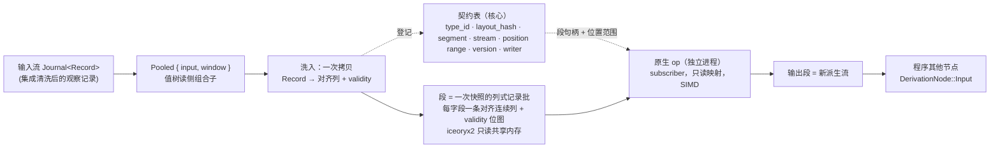

# 行情派生高性能计算子系统：`Pooled` → 段池 → 原生 op

## 0 定位

**一句话**：`Pooled` 把一条线性行情派生洗入类型化只读共享内存段；原生 op 在独立进程里按导出的对齐布局对整段做计算；输出是一条新的派生流。这里决定的是洗入、段布局、段池生命周期、原生 op 契约、作者面、选库与验证闸门。



- **读者**：子系统实现者、原生 op 作者。
- **审批者**：无；维护者确认范围与状态。
- **状态**：**评审中**。边界与选库已定；列式段标 `[暂定：闸门 8]`，`gap_policy` 与中间层原语集标 `[暂定：闸门 9]`，每项在对应节写关闭事件；实测闸门尚未全部通过。
- **与主文档的切缝**：主文档是 `../uta-design.md`（下文按名引用为 `uta-design.md`）；其 §6.6 拥有 `Pooled` 契约、四条前置条件、未安装或不满足时的行为以及对核心零影响；本文拥有这些条件的可判定实现含义、布局、洗入、段池、契约表、原生 op、预算、作者面、选库与闸门。本文的一手证据在同目录 `research/`（§13）。

### 0.1 范围与非目标

| 在子系统内 | 在子系统外 |
|---|---|
| `Pooled` 的洗入、布局推导与导出、契约表、段生命周期、原生 op 装载与握手、触发与预算 | 输入流的 `Journal` 与持久化（`uta-design.md §2.3`、§6.7）、程序其他节点、效应侧一切、集成进程 |
| 观察侧运行期快照 | 效应侧永不进段池 |
| 满足 `uta-design.md §6.6` 四条前置条件的行情类流 | 余额、持仓、订单状态、新闻等不满足这些前置条件的流 |

明确不做：段池不持久；不提供 hostile-code sandbox；不自研映射层；不把段池概念泛化到 `Journal`；不提供原生 op 直写 venue 的入口。`Pooled` 契约、四条条件的业务定义和未安装行为只引用 `uta-design.md §6.6`，不在本文重写。

---

## 1 场景与存在理由

### 1.1 场景与需求

UTA 持续观察约 **1500** 条 market stream；一个自定义 computation 选取其中 **15** 条，使用最近 **24 小时**的逐秒数据计算 indicator。indicator 达到某个业务阈值后，唤醒与该订单对应的 AI。该场景对应主文档 **Q24**，是沟通场景，**不是容量指标**，也不是通用容量上限、默认配置、速率保证或所有策略的必选参数。

若某一条流在窗口内持续保持 **1 Hz** 覆盖，则该流有 `24 × 60 × 60 = 86,400` 条记录；**15** 条合计 `1,296,000` 条，前提是覆盖未中断。每次触发都必须能看到这 **15** 条流的完整最新窗口，不能用只传新增一条替代。

本节的需求陈述来源于维护者要求：

- **黑盒闭包**：UTA 不理解算法，只把已登记的行情读数据和触发信号交给计算，并把它产生的值交给程序中已约定的消费者。
- **只读指标**：本场景的计算接口提供观察数据并接收计算值，不提供 venue 写入口；这是正常接口契约，不是对原生代码实际权限的保证。
- **已约定消费者**：消费者关系由程序或注册关系给出，例如对应订单的 AI wake；计算闭包不直接交易，也不绕过既有 effect path。
- **完整窗口**：每次触发可见指定输入的完整最新窗口，而不是本次 `delta`；不能用静默丢弃中间输入或另建一个未登记的历史缓存替代。
- **观察渐进、算法不强制渐进**：观察记录和位置会逐步推进，但任意闭包不必能由 `delta` 自动归约，也不要求算法自动增量化。
- **不保证程序无毒**：只读映射限制计算对核心 payload 的写入，却不限制任意 syscall；原生路径不是 hostile-code sandbox。错误、权限与资源超限仍须可观察，但不能由只读视图宣称恶意代码隔离。

### 1.2 从输入到消费者

既有入站链路产生观察记录与位置推进；注册的读 hook 触发计算；计算借用当前完整窗口，输出 indicator 或结构化失败观察；值进入已约定消费者。消费者若产生外部写请求，仍经既有单据、STS、IO 壳与日志/证据路径（`uta-design.md §5.1–§5.4`）。本文不增加指标权威对象，也不让核心拥有策略业务语义。

### 1.3 为什么段池存在：扇出而不是 SIMD

**零拷贝的精确含义**是同一物理页的只读映射，而不是共享虚拟地址空间：独立进程可以读取相同物理页，因此同时得到零拷贝路径与故障域。这里的性能—故障域二难是选择共享内存 IPC 的根问题：若要进程隔离，完整窗口不能在每次调用中复制；若要零拷贝，数据又必须以可借用的共享段交接。

段池不是为了算得快，也不是为了追求对齐本身。实际场景很可能是同一个指标被 **N** 个策略复用并派生出一堆计算：派生 DAG 的每条边都是“一个段被多个消费者读”，共享映射让边的交接成本不随消费者复制窗口，每个段只物化一份。按消费者复制的方案成本为 `O(窗口 × 消费者)`，并使每个消费进程各持一份副本；进程内 cdylib 没有独立故障域，按触发复制又没有扇出共享。段池因此把独立进程故障域与多消费者复用放在同一条数据路径上。fp-11/fp-12 表明计算侧需要的是连续列、`f64` 与 validity；对齐的可测收益见 §4.2。

### 1.4 `Pooled` 边界、洗入与值/schema 分离

`Pooled` 是进入高性能计算模式的边界。边界上发生的**一次拷贝就是洗入**：原始记录写入对齐布局，之后每次调用不再搬运完整窗口。洗入产出连续列、`f64`、validity 位图和对齐布局；前三者是计算侧全部 kernel（autovec 的 `Zip`、增量窗口、单调队列、位图传播）的前提，第四项不是，见 §4.2。洗入每快照一次；按 fp-09 的融合转换折算，**8465** 行、**4** 列约 **14 µs** [推断]，相对单次计算 **50–200 µs** 与 **50 ms** 内部预算均为小项，仍需闸门 7 测量。

段里只有值，布局在契约表。洗入时去掉原始流的表示杂音：RFC 3339 字符串映射为 `i64` 纳秒、十进制字符串映射为定点或 `f64`、枚举字符串映射为 `u8`、可空值映射为 validity 位图而不是哨兵；这些表示对物理布局的要求不同，因此值和 schema 分离。布局由输入组合子树推导并导出，计算 op 不猜宿主对象。

### 1.5 两套存储

`Journal` 是记录的载体，持久于 SQLite；段池是由 `Pooled` 从输入流洗入的运行期快照。两者不是缓存、热层或索引关系，`Journal` 不从段池重建，二者共同点只有 `LogPosition` 标定。段池不持久；重启后由 `Pooled` 重洗。行情持久化归 `Journal`（`uta-design.md §2.3`、§6.7）。

- 共享内存是可分配边界的大内存池，池内无 malloc/free、无指针，只有按行情类型切出的段。
- 每个行情派生读类型声明扁平布局并据此拥有段；布局是该类型的一部分。
- 段内每列地址按 `column_base + (pos - from) * element_size` 计算；跨段位置由契约表归一。
- ring 回绕、段满和进程重启只是把流切成若干段，按位置区间拼回即原数据。
- 计算输入是段句柄列表与位置范围；输出也是一个段，成为一条派生流，同样可被 **N** 个消费者映射。
- 段是某时刻输入窗口的快照，有段池内部有效期；外部只看到这一版窗口。有效期不泄漏为公共业务契约。

这样把实现集中为独立子系统：核心在未安装本子系统时仍能运行；子系统只通过 `Pooled` 读侧组合子和注册关系接入，不把段池约束泛化成核心通用类型约束。

### 1.6 代价与责任的理由

- **隔离代价**：只读映射不能阻止原生代码 syscall；这是追求性能时明确接受的故障域边界。原生 artifact 由 principal 经控制面安装即授权；值树程序仍不可信并受预算约束。
- **洗入代价**：一次写入列布局和数值转换是进入段池的固定成本，换取之后按段借用；不把网络、解码或洗入称为 zero-copy。
- **扁平化代价**：段内没有指针或 `Vec`；变长字段由 typed SDK 承担，不能直接进入固定布局。
- **库依赖代价**：映射、回收与生命周期簿记交给 `iceoryx2`；只有跨平台实测或控制面语义不满足时才进入自研备选。
- **独立子系统理由**：研究已分别覆盖段池选库、布局导出与作者面，这些实现细节可以由独立边界承载，使核心在没有子系统时仍可运行；布局、gap、原语集和触发仍有实现闸门，因此本文状态是评审中。

---

## 2 质量场景与预算

### 2.1 场景表

| 场景 | 刺激源与刺激 | 构件/环境 | 响应 | 响应度量与优先级 |
|---|---|---|---|---|
| Q24 完整窗口原生计算 | 已登记读 hook 在约 **1500** 条流中选 **15** 条，要求最近 **24 h**、逐秒的完整最新窗口；阈值后唤醒 AI | 核心洗入器、段池、独立原生 op、已约定消费者；这是沟通场景而非容量测试 | 每次触发借用完整窗口，输出值或可观察失败，不把 `delta` 当完整窗口 | 窗口完整性、位置范围、失败可见性；**1500/15/24 h/1 Hz** 不构成容量或 SLA；优先级：业务重要性高、架构风险高 |
| Q30 HPC 扇出端到端 | 真实 L2 窗口输入 **1 → K 个派生 op → N 个策略消费者**，闸门用 **K=3、N=10** | 真实 `iceoryx2` 链路与目标平台；对照按消费者 pipe 复制 | 记录 `T_ipc`、`T_convert`、`T_compute`、`T_writeback` 与总内存，比较共享段扇出曲线 | **50 ms** 是内部预算假设，不是 SLA；报告各项 p99 与总内存，闸门 7 决定 IPC 是否可先视为小项；优先级：业务重要性中、架构风险高 |

### 2.2 内部预算与平台优先级

默认把一次计算的内部预算写成：

$$T_{\mathrm{total}} = T_{\mathrm{ipc}} + T_{\mathrm{convert}} + T_{\mathrm{compute}} + T_{\mathrm{writeback}}$$

**50 ms 是内部预算假设，不是 SLA。** 它是段有效期和调度的暂定上界；超出时记录该 op 的失败观察，不等待。fp-09 §7 的本机 M4 标量数据为：单指标 **100 k** 样本 **25–154 µs**；每列 `i64 → f64` 转换 **14 µs**；三列 **100 k** 样本的 AoS→SoA 转置 **98 µs**。若每次触发都转置或转换，物化占合计 **34–65 %**，与计算同量级；列式段与洗入期转换把 `T_convert` 从每次触发移到洗入。真实链路的 `T_ipc` 与剩余分项由 §10 闸门 7 测量。

库已有的 IPC 基准把 `iceoryx2` 描述为纳秒级量级的低延迟路径，可作为把 IPC 先当作小项的起点；本文不把该基准当成本系统实测结论，闸门 7 必须给出 `T_ipc` 占比，若占比不小，就修改预算与备选。

延迟不是等待语义：op 超过预算即失败观察。段有效期不向外部业务泄露，窗口只对本次借用有效。

平台优先级是 **aarch64 NEON 首要**（OpenAlice 用户主流是 ARM macOS），x86 AVX2 第二，AVX-512 不作目标。Apple M4 是 **128-bit NEON**，`f64` 为 **2 lane**；`std::simd` 仍 nightly-only（`#86656` open）。AVX2/NEON 对浮点大幅加速、对整数收益小，所以段内数值列采用 `f64`，定点只在洗入时转换。窗口/归约指标（SMA、Bollinger、rolling 统计）可沿时间向量化；递归指标（EMA/RSI/ATR）有 loop-carried 依赖，沿时间不可并行，标量是合理形态；若要并行，维度是跨流或跨参数而非跨时间。现成指标库在 aarch64 上没有显式 NEON 内核，库自带 SIMD 在首要平台上不能作为前提。GPU 是同一形态的更远延伸，代价大，现在不做。

向量化是自然收益，不是目标：不追求 SIMD 利用率或高度向量化。对齐交给布局，作者面对对齐定长数组且不碰 SIMD。fp-10 release 默认基线已把 elementwise/密集窗口 autovec 为 NEON `.2d`；显式 SIMD 的增量收益依指标而变：SuperTrend 递推约 **1.0×**、Squeeze **1.36×**、朴素 rolling max/min **3.3×**，而换成 O(n) 单调队列的标量实现可能反超。`f64` 选择与平台判断的证据为 fp-09 §3.1 问四、§6 与 fp-10 §4.3。

---

## 3 前置条件的可判定含义

四条前置条件的业务定义、`Pooled` 合法性与装载失败行为由 `uta-design.md §6.6` 拥有；本节只规定装载期如何判定，不重新定义条件。

输出类型 fold 遍历 `Pooled` 输入组合子树，并为每个输入形成可导出的布局与位置描述：

1. **定长**：fold 为每个字段导出固定 format 与 `element_size`；缺少固定元素宽度的字段不能生成布局。
2. **位置线性**：fold 产出输入 `StreamId` 和位置区间，检查 `LogPosition` 的单调关系以及同一列相邻位置是否能用固定步长寻址。
3. **无指针**：导出形状只能含值列、定长 shape 与 validity；引用、`Vec`、字符串等不能进入段布局，无法证明时拒绝。
4. **可容忍 ring 回收**：fold 登记窗口的保留依赖；对已回收的位置，查表路径必须产出 `BeyondRetention`，不能把复用后的槽误当旧值。

四项均能由 fold 证明时，装载器才把 `Pooled` 输入交给洗入器；任一项不能证明，程序在装载期被拒绝。`required_inputs` 的树上 fold 语义只引用 `uta-design.md §2.4`，不在此另造一套输入定义。

---

## 4 布局：列式段、推导、对齐、导出、身份

### 4.0 段是列式记录批，不是记录数组

**一段 = 一次快照的所有字段，每字段一条连续对齐列，外加每列一张 validity 位图；不是 `repr(C)` 记录的数组。** `[暂定：闸门 8]`

**理由**：fp-09 §3.1、§4、§5 中，VectorTA、TA-Lib、Tulip、polars 的输入形状都是连续单列 `&[f64]`/`double*`，没有接受记录 stride 视图的接口；记录数组若接入这些库，每次触发必须转置。M4 实测三列 × **100 k** 为 **98 µs**，与单指标计算同量级，会破坏“洗入后不再搬窗口”。Intel/Arm 优化手册要求跨样本同字段的 vertical SIMD 使用连续列，Arm 也警告运行期重排整个数据集代价高；Arrow/DataFusion 的核心收益同样是只扫所需列。

洗入本来就是一次拷贝，把 raw 记录写到列地址而不是记录地址，字节数不增加；段一次性写满即发，写时已知 `n`，列块边界确定。因此 `地址即位置` 逐列成立，作者面对对齐定长数组。列式段的关闭事件：完成 §10 闸门 8，在同一窗口和指标集上对比记录数组段与列式段；转置收益成立且多字段同点访问退化不抵消它则转为已定，否则按 §12 撤销。

不取“列即段”（每列独立 service）：那会另立跨段时间轴、长度与缺失一致性协议；一段内含全部列则一次快照天然一致。多字段同点访问（如单根 K 线的 OHLC）退化为四次不同地址加载；这是核心值树的 `On(pattern)` 模式，不是原生 op 的向量路径。

定长多档字段（L2 订单簿的 `bid_sz[N]`）是布局 fold 的显式选择并进入身份。fp-12 §5、§8 给出两种形状：

- **A**：展平为 `N` 条标量列（Arrow fixed-size-list `+w:N` 展平，每 `(side, level, field)` 一列）。
- **B**：一条行主序 `(n × N)` 二维列。

两者对不同指标最优相反：归约成每快照一个标量且能跨快照垂直向量化的 OBI(k)，A 快 **1.5×**；输出或访问本身是每档一条剖面的累计深度，B 快 **2–5×**，显式 SIMD 也救不了 A 的散写。默认规则是逐档剖面用 B、跨档归约成标量用 A；fold 记录所选形状与 `N`，二者产生不同 hash。**4 档**与**10 档**段的身份不能相撞。

### 4.1 推导（fold）

`Pooled` 之前的组合子树（`field::<T>` 访问器与转换算子）经 `uta-design.md §2.4` 的输出类型 fold 得到段布局 `Layout`：字段列表，每字段 `(name, format, element_size, column_offset, shape)`；标量列 `shape=[]`，多档字段 `shape=[N]` 以及 §4.0 的 A/B 折法；段级 `capacity`、`alignment` 与 validity 位图位置也在布局中。

fold 必须确定性地输出规范化描述：字段顺序稳定、不含默认值、不含名字以外的语言细节；该描述是 hash 输入。档数与折法必须进 hash，否则四档段与十档段会撞身份。确定性规则没有外部先例，需要由 §10 闸门 6 自证；它是 **SP-13** 的剩余实现问题，不把未测结果写成已定。

### 4.2 对齐

段基址与每列起点对齐到 **64 B（cache line）**，同时覆盖目标向量宽度：aarch64 NEON **16 B**，x86 AVX2 **32 B**。AVX-512 不是设计目标；**64 B** 只是 cache-line 对齐，不暗示 512-bit 向量路径。对齐是 `Layout` 的一部分并进入 hash。[设计] 之所以保留它，是为了 cache line 边界、避免相邻列 false sharing 以及布局身份规范化，而不是声称它带来自动向量化。

对齐不是自动向量化前提。fp-10 的标量基线使用普通 `Vec<f64>`（分配器 **16 B** 对齐），release 汇编已出现 `fadd/fmul/fmla.2d`；NEON/AVX2 非对齐向量加载无故障，惩罚仅在跨 cache line 时 [推断]。fp-11 的实测比较了 **64 B** 对齐、起点错位 **8/24/40 B** 与普通 `Vec`，**3** 指标 × **2** 实现 × **7** pass，差异均在 **±2%** 噪声内。因此对齐不能用性能辩护；它的保留理由是边界、false sharing 与规范身份。真正决定 Rust kernel 能否被 LLVM 向量化的是原语 crate 内的写法纪律：

1. 连续 stride-1 访问且无别名，`&`/`&mut` 已保证；
2. 用 `Zip`/迭代器或循环前 `assert_eq!(len)` 消掉边界检查；
3. 没有循环携带依赖；递归类始终标量；
4. 浮点归约默认不向量化（Rust 无 fast-math，LLVM 不重结合 `fadd`），`sum` 类需手动多累加器；fp-10 的朴素 rolling max/min 未被 autovec 即属此类。

### 4.3 导出格式

布局描述与语言无关，形状取 Arrow `ArrowSchema` format 码与列偏移：每字段 `(name, format, column_offset, element_size)`。format 码覆盖洗入映射：`'g'` 为 `f64`、`'l'` 为 `i64`、`'tsn:'` 为 ns 时间戳、`'C'` 为 `u8` 枚举。描述附 `capacity`、`alignment`、validity 位图布局与 `layout_hash`。列式段与 Arrow 的对应比记录数组直接，每列就是一条 Arrow buffer。Rust 源（列切片视图结构）与 C 头是由工具生成的两种渲染；导出策略的可行性证据为 fp-07 命题 2、fp-09 §5.3。

### 4.4 身份

`layout_hash = SHA256(规范化布局描述)`（RIHS01 式）。描述必须覆盖全部物理布局：字段名、format、元素宽度、列偏移、容量、对齐、padding、validity 表示；字段名加偏移不足以标定列式段。不能依赖 iceoryx2 的 `is_compatible_to`，因为它只比较 `type_name + size + alignment`，同尺寸同对齐但字段语义不同会误配。证据：fp-07 命题 1、fp-08 §3.3、fp-09 修正 7。

### 4.5 数值表示与 gap：两条独立的契约轴

段里的价格与数量列是 `f64`，定点不进段。行情本质上是浮点，AVX2/NEON 对浮点的加速大、对整数收益小；现成算法库与数组库价格类型也是 `f64`（fp-09 §3.1 问五、§5.4）。核心若以定点承载价格，洗入时一次转换为 `f64`，成本落在一次洗入而非每次触发；定点到 **53 位**尾数的精度语义是进入 `Pooled` 的已知代价。时间戳列为 `i64` 纳秒、枚举列为 `u8`，不受影响。

输入流缺位在段里以 validity 位图表示，不伪造连续值、不填哨兵。VectorTA RSI 遇 NaN 会平台化后继续输出错误值，batch 与 stream 对同一序列也可能不同（fp-09 §3.1 问三），所以 op 注册项必须声明 `gap_policy ∈ { Reset, Hold, Missing }`：gap 后重新预热、保持上一态、或输出缺失直到新预热完成。op 输出 validity 位图必须把预热区与 `Missing` 区标无效；不声明则拒绝装载。跨触发保留库的 streaming 状态会悄悄固定未声明的语义，禁止。

`gap_policy` 是 `[暂定：闸门 9]`。关闭事件：在 §10 闸门 9 用人造 gap 对 `ewm` 的 `Hold/Reset/Missing` 做端到端测量（SPY 数据没有缺口，当前实测未触发）；三种策略的预热区、validity 与失败观察均可由手算序列核对则转为已定，否则按 §12 撤销。

---

## 5 契约表与段生命周期

### 5.1 责任分配

核心拥有**契约表、洗入器、位置映射、`Pooled` 装载判定与原生 op 启动/编排**；它不拥有 IPC 库内部的映射、回收和簿记实现。`iceoryx2` 拥有 service/sample 映射、refcount、chunk 回收、fence 与 subscriber 控制面簿记。原生 op 拥有计算代码、输入段借用和输出段写入；核心仍登记其输出契约并把输出接入派生流。这样“核心维护跨段抽象”和“核心是洗入 publisher、启动 op”同时成立。

### 5.2 契约表

| 字段 | 含义 | 拥有者 |
|---|---|---|
| `type_id` | 输出类型 fold 给出的类型身份 | 核心登记；布局 fold 产生 |
| `layout_hash` | §4.4 的物理布局身份 | 核心比较；SDK/op 携带 |
| `service` / `segment` | iceoryx2 service 名与 sample 句柄（段） | iceoryx2 分配与映射，核心登记 |
| `stream` | 输入 `StreamId` | 核心 |
| `position_range` | 段覆盖的 `LogPosition` 区间 `[from, to)` | 核心位置映射 |
| `version` | 契约版本；布局变即新版本与新 service | 核心登记 |
| `writer` | 核心洗入器或某原生 op | 核心登记，写者执行 |

iceoryx2 的段槽由 `PoolAllocator` 自由列表分配，没有流内全局位置算术；`地址即位置` 只在一个 `Sample<Slice<Layout>>` 内成立：`base + (pos - from) * stride`。跨段依靠契约表把无序 allocator offset 归一到有序位置区间；窗口是按 `position_range` 排序的段句柄列表。证据：fp-08 §3.1/§3.9。

iceoryx2 没有 per-slot generation。核心与 op 只能经 `Sample` 借用访问段，禁止缓存裸 offset 跨释放复用；段回收后从契约表删除其 `position_range`，旧位置查表得到 `BeyondRetention`。这是避免 ABA 的边界，证据：fp-08 推荐 2。

### 5.3 段生命周期

1. **洗入与发布**：核心洗入器调用 `loan_slice_uninit(n) → 逐列写 → send`；一段一次性写满即发，不原地追加。写入时已知 `n`，列块边界与 validity 位图一起落定。核心负责发布动作与契约登记，iceoryx2 负责 sample 映射与簿记（fp-08 §3.2）。
2. **订阅与借用**：原生 op 进程是 subscriber port。payload 段采用 OS 只读映射（`AccessMode::Read` → `PROT_READ` / `PAGE_READONLY`）；连接队列和 refcount 控制面可写，但那是 iceoryx2 内部结构，不是核心 payload。接受“计算进程是可写控制面 subscriber，而不是零协议只读附着”（fp-08 §3.5、推荐 3）。
3. **快照窗口**：持有 `Sample` 即 refcount>0，chunk 不回收；`subscriber_max_borrowed_samples` 限制慢读者。窗口是核心持有的一组有序 `Sample`；history 是回放队列，不是随机访问，随机访问由核心保留引用集实现（fp-08 §3.4、推荐 4）。
4. **回收与溢出**：ring 深度与 overflow 由 `history_size`、`subscriber_max_buffer_size`、`enable_safe_overflow` 配置；safe overflow 只回收无人借用的 chunk。段快照有效期属于段池内部，不向消费者泄露。
5. **崩溃回收**：原生 op 进程死亡时，其借用经 `retrieve_returned_chunks` 与 `H10 fence` 回收；核心死亡时 op 成为孤儿，由 fence 回收（fp-08 §7.1 第 3 项；`uta-design.md §6.1`）。核心观察侧流的来源故障与写提交的业务状态仍按主文档分别处理，不能把 op 崩溃改名为 `Gap{origin: Source}` 或 `NoResponse`。

### 5.4 运行期顺序

核心先由 `Pooled` 装载判定得到布局，再洗入并登记位置范围；op 启动后按 `layout_hash` 握手；触发时核心根据契约表交付有序段句柄，op 借用、计算、发布输出并释放输入。输入段不能原地更新，布局变更通过新 service 与新版本切换。段池重启后从 `Journal`/输入流重洗，不能由段池反向恢复持久记录。

---

## 6 原生 op：装载、握手、执行

### 6.1 注册项

处理器字段注册表由 `uta-design.md §6.3` 拥有；本子系统为 `Pooled` 输入提供如下注册数据：

`{ op_id, inputs: [(stream, layout_hash)], output: (stream, layout_hash), gap_policy, code_version, artifact, principal }`

`required_inputs` 对 `Pooled` 输入的解析沿 `uta-design.md §2.4` 的 fold 语义进行，再由本子系统查契约表得到段句柄；`gap_policy` 见 §4.5。`artifact` 是由 principal 安装并授权的原生代码，不代表核心能保证其无毒。

### 6.2 装载与握手

1. 核心启动 op 进程（或允许 op 自行启动并连接），传入 service 名与期望的 `layout_hash` 集。
2. op open service；iceoryx2 校验 `type_name/size/alignment`；核心再比较契约表的 `layout_hash` 与 op 编译时携带的 hash。
3. hash 不等时 fail-closed：记录装载失败、不给 op 运行资格、不发布输出；不能依赖只比较 `type_name + size + alignment` 的库检查。
4. 握手通过后 op 成为 subscriber；触发可经 iceoryx2 事件或核心触发通道。触发的 edge/level、合并、冷却与背压语义属于 **SP-14**，本节不暗定默认值。

### 6.3 接口与错误语义

| 操作 | 输入/正常结果 | 错误与 undesired event | 处理语义 |
|---|---|---|---|
| `load` / `handshake` | service、期望 hash 集、注册元数据 | hash 不等、`type_name/size/alignment` 不兼容、artifact 或版本不可装载 | fail-closed；不进入运行、不发输出，保留失败原因与版本 |
| `borrow_window` | 当前完整窗口的有序段句柄、位置范围、布局版本 | gap、`BeyondRetention`、慢读者达到借用上限 | 不伪造连续窗口；按注册的 validity/gap 语义产生可观察失败；回收由 iceoryx2 负责 |
| `compute` | 只读列视图、触发信号、`code_version` | 超 **50 ms** 内部预算、panic/OOM、输出列或 validity 写入失败 | 记录 op 失败观察，不等待；释放借用；不把错误当 indicator 值 |
| `publish` | `loan_slice_uninit(n)` 得到的输出段，逐列写与 validity，`send` | service 停止、池耗尽、写者崩溃、输出 hash 不匹配 | 不发布不完整段；保留失败与位置范围；下游只看到成功发布的普通派生流 |
| `replace` | 新布局/版本的新 service | 布局变、在途调用仍持有旧段、旧代码卸载时序不明 | 新 `layout_hash` 使用新 service；旧 op 继续读旧 service 直到停止；在途回收与结果排序进入 SP-12/替换未决 |

接口不新增业务失败类型：原生 op 的加载、计算、资源与生命周期错误记录为观察侧派生失败记录（`uta-design.md §3.3`）；主文档拥有 `Gap{origin: Source}`、`NoResponse`/`Undetermined`、`Unavailable` 的领域语义与线缆映射（`uta-design.md §3.2`、§5.4、§6.3）。

### 6.4 执行路径

op 收到触发 → 借用当前窗口的段列表 → 按导出布局取各列切片计算（布局已保证对齐，无转置无转换）→ `loan_slice_uninit` 输出段 → 逐列写与 validity → `send` → 释放借用。预算按 §2 分项，超过 **50 ms** 即失败观察，不等待。输出段是新派生流，供程序其他节点按普通派生流消费。

场景走查保持以下顺序：

1. **正常路径**：既有入站链路产生记录和位置；登记的读 hook 触发；核心为本次调用提供指定输入的完整最新窗口；原生 op 借用只读视图，输出 indicator 或结构化失败；值进入已约定消费者；若消费者产生外部写请求，仍经既有 effect path、STS、IO 壳与日志/证据。
2. **缺口、窗口不完整或过期**：provider 断线、输入 gap、窗口尚未完备或 retention 越界时，不伪造连续输入，也不静默当成完整窗口。是否不调用、记录显式不完整状态或等待完备进度仍由 SP-14 与未决控制面决定；`latest` 不能默认降级替代完整窗口。
3. **闭包失败、超时或资源超限**：没有有效 value 时，不把错误伪装成 indicator 值触发阈值消费；错误、输入版本与计算版本必须可观察。重试、跳过、暂停、限流、人工介入与恢复仍由未决项关闭，不把只读视图写成恶意代码隔离。
4. **代码修订与同输入比较**：作者修改小计算后，必须能区分旧、新 `code_version`，在相同输入窗口上观察中间值与最终值差异；记录推进不意味着算法必须增量化。

### 6.5 布局替换、重启与孤儿

布局变更等于新 `layout_hash` 与新 service；旧 op 继续读旧 service，直到显式停止；新 op 连接新 service，不原地改布局。调用中持有的段在借用释放后才可自然回收，但替换与回收的跨平台时序仍须 SP-12 实测。op 崩溃只影响其计算进程与借用，核心保留失败观察；核心崩溃时 op 为孤儿，依赖 `H10 fence` 回收。

---

## 7 作者面：列视图、原语集与标量逃逸

### 7.1 typed SDK 与批量入口

作者面是列视图、原语集与标量逃逸口，作者不碰 SIMD。typed SDK 从契约表导出 Rust 源：列视图结构、输出段可写列、`const LAYOUT_HASH` 与编译期布局校验。核心形状保留为：

```rust
struct Window<'a> {
    ts: &'a [i64],
    close: ArrayView1<'a, f64>,
    …,
    valid: &'a Bitmap,
}

fn compute(window: &Window, out: &mut OutputColumns) -> Written { len, first_valid }
```

每字段是一列，`ndarray` 视图从段借用而不复制；输出列是 `ArrayViewMut1<f64>` 与可写位图。入口是批量 `compute`，与 `xxx_into(&mut [f64])` / TA-Lib `outBegIdx` 家族同形，不是逐条 iterator。输出列必须是连续 `&mut [f64]`；只返回新 `Array`、`Series` 或 `Tensor` 的库（arrow-rs、polars、candle、burn）不能通过此 ABI，不能作数据面。`zerocopy`/`bytemuck` 派生宏用于编译期校验导出布局确实可零拷贝访问。证据：fp-10 §3、修正 1；fp-07 组四；fp-08 §3.3；fp-09 修正 5/8。

作者写一个依赖 SDK 的小 crate；修改一个 op 只重编译这个小 crate。单 OS 最小 crate 的 warm rebuild 实测由 **0.94 s** 降至 **0.12 s**（fp-07 命题 5）。交付可以是 source 或预编译 artifact；三 OS 产物按 target triple 矩阵构建（cargo-dist 式），Windows 需 MSVC，macOS 需 SDK；工具链缺口是独立条件，不由子系统消掉。宿主内嵌编译器不在范围内：Cranelift 实验性，rustc 作库不稳定（fp-07 案例 4.5）。

### 7.2 中间层原语集

**中间层 = `ndarray` 视图作容器 + 子系统自有的、词汇取自 pandas/numpy 的一小组时间轴原语 + 标量逃逸口；作者写数组表达式与惯用 `for` 循环，不写 SIMD。** `[暂定：闸门 9]`

理由是面向 AI 的常见认知：高级用户可以使用最贵的 AI，不要求原语逐一复制 numpy；但若算子不符合 AI 常见认知，用户程序会难以开发。因而不自造行业 DSL，保留 pandas/numpy 习惯词汇，同时不把完整 DataFrame 或 SIMD 类型交给作者。`ndarray` 词汇最近 numpy，却缺 rolling/scan/ewm/where/validity；polars 词汇最近 pandas，虽有 `rolling_*`/`ewm`/位图，但 kernel 只能返回新 `Series`，复杂指标慢 **1.5–2.3×** 且分配；arrow-rs/candle/burn 同样不合 ABI；faer/pulp 分工自然却要求作者写 `WithSimd`。没有单一 Rust 库同时满足 numpy 式表达、作者不碰 SIMD、借外部列并写调用方列、rolling/ewm/validity。

fp-10 的本机 M4 结果表明，aarch64 上作者不碰 SIMD 可由 LLVM autovec 达成：release 默认基线的 elementwise/密集窗口已是 NEON `.2d`；禁 autovec 对照的 Squeeze 慢 **14 %**。显式 SIMD 的增量收益是 SuperTrend 递推约 **1.0×**、Squeeze **1.36×**、朴素 rolling max/min **3.3×**；后者改用 O(n) 单调队列标量可能反超。SuperTrend 的原语实现快过手写 NEON；它属于 loop-carried 状态机，在 numpy、pandas、Arrow、Polars、numexpr 先例中都必须退回 scalar/custom，因此任何只写表达式的中间层都必须留标量逃逸口。中间层真正拥有的是窗口、递归与 validity 语义，而不是 SIMD。

原语集的关闭事件：完成 §10 闸门 9 的补测与语义对照——原语范围、`first_valid`、`ddof`、`seed`、`gap_policy` 逐指标与手算 oracle 一致，且多项 rolling 物化代价在 Q24 负载下不支配预算；通过则转为已定，否则按 §12 撤销。在关闭前不得把这组原语扩展成完整 DataFrame 或档轴 DSL。

### 7.3 原语语义表

输入为 `ArrayView1<f64>` 加位图，输出写调用方列加位图；语义不沿用任何库默认：

| 原语 | 语义契约 | 实现形态 |
|---|---|---|
| `rolling(w).{sum, mean, std(ddof), var, min, max}` | `min_periods = w`，前 `w-1` 无效；`std` 的 `ddof` 必填 | sum/mean/std 增量窗口（Neumaier/Welford）；min/max 是允许内部 SIMD 的 kernel，fp-11 中小窗口单调队列 O(n) 相对显式 NEON 为 **2.2×**；作者面不变 |
| `ewm(alpha, seed)` | `seed` 必填：`First` / `MeanOf(n)`（EMA 的 idx `n-1` 均值 seed）/ `Wilder(n)`；`adjust=false`；无效输入按 §4.5 `gap_policy` | 顺序标量，递归沿时间不可平行 |
| `shift(k)` / `diff(k)` | 位移后的无效区显式进入位图 | 视图偏移，零拷贝 |
| `where(cond, a, b)` / elementwise ufunc / `cumsum` / `reduce` | validity 逐元素与运算同步传播 | `Zip` 惯用循环，autovec 已成 NEON（fp-11 §4），不用显式 SIMD |
| `linreg(w)` | 窗口线性回归端点值（Pine `ta.linreg`） | 代数展开为 rolling sum 组合 |
| **标量逃逸口** | 作者对列切片写惯用 `for` 循环（状态机、自定义递推），自己写 `first_valid` 与位图 | 无框架，autovec 自然适用 |

不做：不自造行业 DSL；不提供 SIMD 类型；不实现完整 DataFrame；不承诺全向量化。原语 crate 自己实现并维护约 **十个** kernel 与 validity 传播规则；Polars `rolling/no_nulls` 借 `&[T]+Bitmap` 的内部形状是参考。原语的 `first_valid`、`ddof`、`seed`、`gap_policy` 是子系统契约，不能由每个 op 各自书写，否则 validity 传播无法统一保证。

### 7.4 实证范围与代价

实验选择是约 **500 KB** 的真实 SPY 行情，指标选择 PineScript 社区常见的复杂度：递推状态机、多窗口 rolling max/min 与线性回归；过于简单的指标不能代表用户指标，券商通常已自带简单指标。fp-10 的真实 SPY 三个 Pine 级指标有 golden **1e-9** 对照。

fp-11 的同口径作者 LOC 为：SuperTrend/Ichimoku/Squeeze，原语集 **43/36/36**，`ndarray` 手写 **62/78/128**，pulp 手写 **114/99/212**；逃逸口只剩 SuperTrend 状态机约 **18 行**与 Squeeze 的 i8 分类约 **6 行**，Ichimoku 无逃逸口。零优化普通写法（`Vec` + 朴素 O(n·w) + 分配）中，Ichimoku/Squeeze 比原语版慢 **3×**，SuperTrend 不慢；原语价值在窗口类指标的 O(n) 算法和语义，而非保证 SIMD。

fp-12 的 L2 指标划出边界：原语词汇是纯时间轴的，档轴归约（OBI 跨档、累计深度剖面）由 `ndarray` 二维视图与逐行 fold 承担，不加档轴原语；两种写法代码 **404 ≈ 389**。LOC 收益是时间轴指标占比的函数。多项 rolling 的回归指标中，slope 用 **4** 次 `rolling.sum` 物化 **4** 条临时列，原语版 **3110 µs**，pulp 融合单遍 **643 µs**（**4.8×**）；OFI **1.4×**；单项 rolling（z-score）约持平。`rolling.sums(&[cols])` 的多输入单遍融合是待实测缓解方向。`rolling.std` 用补偿滑动求和，避免全局 prefix 差分在近常值窗口中的灾难性抵消（fp-12 §2）。

SDK 内部如需稳定 Rust 运行期 ISA 派发，可用 `pulp`（aarch64 NEON / x86 V3；`Arch::new().dispatch`），多版本化用 `multiversion`；`wide` 仅 build-time 检测，`std::simd` 稳定化前不用（fp-09 §6；fp-10 §3.5）。指标语义（预热长度、seed、零分母、NaN 传播）不凭同名假定一致；作者须以可手算序列逐指标对照后才注册。

排除记录（fp-09 §8；fp-10 §6）：VectorTA（aarch64 全标量、gap 静默污染）；TA-Lib/Tulip（C FFI、标量、分列 double）；`ta`/`yata`（逐值状态机、无批量列路径）；polars/arrow-rs/candle/burn（新数组、违 ABI）；`numrs`/`numrs2`（owned 存储）；`nalgebra`（矩阵词汇、索引循环慢）；`mdarray`（可用但 unsafe 面最大、实验性）；`faer`（线代词汇，其 pulp 分工范式在原语层内部采用）。

---

## 8 选库与替代方案

### 8.1 段池选库

首选 **`iceoryx2`**。它同时具备 Rust 一等支持、三 OS（CI 与本机 macOS 跨进程实测）、`repr(C)` 类型校验、`Slice<T>` 定长数组样本、单写多读、payload OS 只读映射、可配置 ring 深度、refcount 借用生命周期，并由库承担映射与簿记（fp-08 §7）。选库决定的理由是把 IPC 映射、回收和生命周期簿记交给已有库，而不是自研第二套段协议。

核心侧接受五项补齐：

1. 自建契约表做跨段位置映射；
2. 只经 `Sample` 访问，禁止缓存裸 offset；
3. 计算进程是可写控制面 subscriber；
4. 随机访问历史由核心持引用集；
5. 跨语言时覆写 `type_name`，再以 `layout_hash` 补强。

备选 **`memmap2` + 自研** 仅在以下条件满足其一时启用：§10 实测 `iceoryx2` 在 macOS/Windows 跨独立进程不可靠；可写控制面 subscriber 被判不可接受；或必须把裸 offset 导出给 op 做零协议随机寻址。启用时必须重新登记自写范围：命名段生命周期、契约表、位置算术、seqlock、ring + generation、借用簿记、控制/数据面分离；这不是默认路径。

不选：Aeron（可写 `MmapMut`、需 media driver、CI 仅 Linux）；disruptor-rs（进程内）；Chronicle（持久、查表、付费 Rust 绑定）；ipc-channel、shm_ringbuf、shared_memory（三门 FAIL）。Arrow `FFI_ArrowSchema` 只作布局导出面，不作数据面。

### 8.2 场景下的替代方案

| 方案 | Q24/Q30 下的后果 | 不选理由 |
|---|---|---|
| **同地址空间 cdylib** | 可借用宿主已有 typed view，调用时不搬完整窗口；但计算与核心共享故障域，无法同时提供独立 op 崩溃回收与共享物理页扇出 | 本子系统要求独立进程故障域；“只读 view”不能保证程序无毒，且同进程故障会影响核心 |
| **按消费者 pipe 复制** | 每个策略消费者都得到一份窗口；成本为 `O(窗口 × 消费者)`，每次调用还重复遍历、编码、解码或分配 | 不能满足一段多读的扇出目标；复制成本随 **N** 增长 |
| **进程内无段池** | 单个计算可运行，但多个 op/消费者之间没有统一段句柄、位置范围与借用回收，输出不能以同一运行期快照扇出 | 失去段池的共享物化与跨进程生命周期簿记；需要另造共享/保留协议 |
| **`repr(C)` 记录数组** | 可表达字段，但成熟指标库要连续单列；每触发需做三列 × **100 k** 的 **98 µs** 转置，破坏洗入后不搬窗口 | 列式段把同一次洗入写成计算直接消费的列，避免每次 AoS→SoA |
| **现成指标库作算法层** | VectorTA 等可提供部分指标，却有 aarch64 全标量、gap 静默污染、逐值状态机或返回新数组等问题；新数组路径不写调用方列 | 与作者 ABI、validity/gap 语义及标量逃逸不同时满足；原语集只吸收可统一的时间轴语义 |

同地址空间借用、按消费者复制与进程内无段池都可以作为实验对照，但不改变本文的独立 op + 段池边界。若实测共享段不优于复制或无法满足生命周期闸门，§11/§12 规定回退条件。

---

## 9 风险、敏感点与权衡

| 决定 | 风险/敏感点 | 权衡与显式代价 | 观察与缓解 |
|---|---|---|---|
| 独立进程 + 只读共享段 | 原生代码仍可 syscall；核心故障会留下孤儿 op | 以故障域换取共享物理页；不宣称 hostile-code sandbox | `H10 fence`、op/core 崩溃闸门；核心记录失败观察 |
| 段池不持久、`Journal` 持久 | 重启必须重洗；段不能作为恢复来源 | 以简单运行期快照换取持久化边界清楚 | 重启重洗与 `Journal` 位置范围走查；持久化归 `uta-design.md §2.3`/§6.7 |
| 列式布局 | OHLC 同点访问需多地址加载；布局形状需维护 | 以点访问退化换取成熟 kernel 的连续列与零转置 | 闸门 8 记录退化幅度；多档 A/B fold 进 hash |
| 64 B 对齐 | 实测未显示直接性能收益 | 保留 cache-line 边界、false sharing 防护与身份规范化 | fp-11：错位 **8/24/40 B**、±**2%** 噪声；不把对齐当 SIMD 保证 |
| `f64` 段列 | 定点到 **53 位**尾数有精度代价 | 把转换放进一次洗入，换取浮点 kernel 与 NEON/AVX2 自然收益 | 洗入格式与精度语义登记在布局；时间戳仍为 `i64`、枚举为 `u8` |
| 显式 validity + `gap_policy` | 递归指标 gap 语义复杂，错误默认会静默污染 | 以注册复杂度换取可观察、可重复的缺口语义 | gap 闸门；未声明拒绝装载；`Reset/Hold/Missing` 暂定 |
| **50 ms** 内部预算 | IPC 占比和真实链路尚未测；部分指标有回归物化开销 | 以内部预算指导快照有效期，不把它写成产品 SLA | 闸门 7 分项 p99；超时记失败观察而不等待 |
| 原语层而非现成库 | 子系统需维护约 **十个** kernel 与位图规则；多项 rolling 可能慢融合循环 **2–5×** | 以作者可读性、ABI 与统一语义换取实现维护成本 | 闸门 9、`rolling.sums` 融合方向；档轴原语明确不加入 |
| iceoryx2 而非自研 | 跨平台、可写控制面与裸 offset 语义需验证 | 以库依赖换取映射/回收/簿记不重复实现 | macOS + Windows 闸门 1–5、7–9；失败才启用 `memmap2` |
| 共享扇出 | 慢读者可能拖垮池，borrow 上限可能造成读取失败 | 以 bounded borrow 与 safe overflow 换取不无限增长 | `subscriber_max_borrowed_samples`、overflow 配置与闸门 2 |

---

## 10 实测闸门

落地前在 macOS 与 Windows 各执行一遍；已完成项与既有证据明确分开。任一失败按 §8.1 的备选条件处理，不把失败隐藏为正常值。

1. **跨独立进程只读消费**：publisher 发布列式段，另一进程 subscriber 按各列 `column_base + (pos - from) * element_size` 遍历；写 payload 应触发段错误。已有 fp-08 本机 macOS 跨进程 pub/sub 与 `Slice` 连续性证据；完整写保护与 Windows 复验未完成。
2. **借用期回收安全**：长持最老 `Sample` 的 reader 与正常 reader 并存，publisher 超发 `buffer + history` 条；长持样本仍有效，overflow 行为符合配置。未完成。
3. **reader 崩溃回收**：持借用的 op 进程异常退出，chunk 经 fence 回收，不泄漏、不死锁。未完成。
4. **Slice 动态重分配**：非 Static 策略超过 `max_slice_len` 扩容，快照不丢样本。未完成。
5. **契约表归一**：无序 `PointerOffset` 归一到有序 `LogPosition` 区间并跨段拼接；不同 subscriber 对同一位置得到同一内容，跨独立进程复验。未完成。
6. **布局 fold 确定性**：同一组合子树多次 fold 得到同一规范化描述与 hash；字段顺序扰动不改变 hash。未完成，属于 SP-13。
7. **端到端 50 ms 与扇出**：用真实 L2 窗口（fp-12 数据）构造 `1 → K → N` DAG，**K=3、N=10**；记录 `T_ipc / T_compute / T_writeback` 的 p99 与总内存，并与按消费者 pipe 复制的成本曲线对照。`T_ipc` 占比决定 §2 把 IPC 当小项的假设是否成立。未完成。
8. **列式段对比**：同一窗口在记录数组段与列式段上运行同一指标集，验证 §4.0 的零转置收益并记录多字段同点访问退化。未完成；它同时是列式段暂定项的关闭事件。
9. **原语集实证**：**已做，fp-11**——LOC 降 **57–73%**；SuperTrend **0.73×**、Squeeze **1.25×** 手写 pulp，Ichimoku **2.23×**（不过）。对齐对照也已做：64 B 与错位结果在 **±2%** 噪声内。补测项是给 `rolling.min/max` 加内部 SIMD 后 Ichimoku 是否达到 **≤1.5×**；人造 gap × `gap_policy` 的端到端测试（SPY 无缺口，`ewm` 的 Hold/Reset/Missing 尚未触发）；以及中间列物化的内存流量占比。此项是原语集与 gap_policy 暂定项的关闭事件，但补测未完成。

### 10.1 五个最小实验的去向

以下五项实验用于关闭交付物中的实现问题；它们不增加新的业务契约：

1. **完整窗口原型**：按 Q24 的 **1500/15/24 h/逐秒**场景构造真实 full-window program，验证每次触发的可见性、缺口表示与保留行为。
2. **调用成本**：测量从宿主已有段视图到计算结果的分配、额外遍历、端到端延迟与积压，确认完整窗口复制没有藏在视图构造阶段；若比较序列化路径，只建立交付基线，不实现第二套生产运行时。
3. **迭代成本**：比较 cold build、修改后到可见结果、依赖存在时的 warm rebuild；不把“Rust 会很快重编译”当既定事实，也不要求用户构建完整应用。
4. **可观察性**：同一输入窗口运行不同 `code_version`，检查中间值、最终值、输入位置与版本是否能对齐与复现。
5. **生命周期**：让输入更新、窗口过期、并发调用与 replacement 同时发生，观察 view 借用、释放、排队与结果归属，确认无悬空借用或静默丢中间输入。

---

## 11 未决表与交付物去向

### 11.1 子系统 spike 与暂定决定

这些条目供主文档 `uta-design.md §8.3` 汇总引用；本文只保留子系统实现细节、验证状态与关闭事件。

| 项目 | 问题 | 关闭事件 | 影响节 |
|---|---|---|---|
| SP-12 | `iceoryx2` 在 macOS/Windows 的跨进程映射、借用回收、崩溃回收、动态 Slice、契约表归一、端到端扇出与在途段回收是否成立 | 闸门 1–5、7–9 各平台实测；给出是否切换 `memmap2` 的结论与自写清单 | §2、§5、§6、§8、§9、§10 |
| SP-13 | fold 能否稳定地产生规范化布局 hash；三 OS 的 source/预编译工具链是否可交付 | 闸门 6 通过；完成 target triple 矩阵与版本/工具链实验 | §4、§7、§10 |
| SP-14 | trigger 的 edge/level、合并、冷却、背压与失败观察形状如何定义 | 业务确认 + 端到端积压/重复触发走查；将触发语义登记到注册契约 | §2、§6、§9 |
| 列式段 | 是否保留一段多列 + validity，而非记录数组或每列 service | 闸门 8 给出同口径收益、退化与快照一致性 | §1.4、§4、§8、§12 |
| `gap_policy` | `Reset/Hold/Missing` 的预热区、validity 与递归状态是否满足实际 op | 闸门 9 gap 补测 + 可手算序列与失败观察审查 | §4.5、§6、§7、§9、§10 |
| 中间层原语集 | `ndarray` 视图、时间轴原语与标量逃逸是否是可维护的作者面 | 闸门 9 补测、fp-11/fp-12 范围审查、`rolling.sums` 物化测量 | §7、§8、§9、§10 |

SP-15 不在本文，行情持久化归 `Journal`（主文档 `uta-design.md §2.3`/§6.7）。

### 11.2 交付稿未决面的逐行对照

| 交付物 | 已回答的落点 / 尚未回答的问题 | 关闭事件 | 影响节 |
|---|---|---|---|
| 最小编译单元 | §7.1 给出小 crate、SDK 依赖、`compute` 输入/输出和 `Written`；源码依赖声明的完整包装格式仍未规定 | 用 Q24 原型形成可审查包边界，验证改一个 op 只重编译该单元 | §7、§10 |
| typed SDK / data contract | §4.3、§7.1 给出列视图、可写输出、`LAYOUT_HASH`、format 码、validity 与批量 ABI；版本化 schema、错误载荷的最终编码仍未规定 | 端到端样例 + 契约审查，覆盖输入流、完整窗口、值、失败与版本 | §4、§6、§7 |
| 编译与交付 | §7.1 已规定 source/预编译、target triple、Windows MSVC、macOS SDK 与 warm rebuild **0.94 s → 0.12 s**；冷构建、缓存和最终构建位置仍未实测 | 冷构建/热构建与三 OS 交付路径实验 | §7、§10 |
| loading / ABI / version coupling | §4.4、§6.2 已规定物理布局 hash、握手比较、fail-closed；编译器/运行时完整兼容矩阵与缓存失效细节仍未回答 | 版本矩阵与装载实验，覆盖 hash、`code_version`、artifact 拒绝 | §4、§6、§10 |
| 窗口物化 | §1.4、§4、§5 已规定洗入一次拷贝、列式段、完整最新窗口与快照；不同窗口触发的物化调度仍需测量 | Q24 规模原型验证可见性、缺口与保留行为 | §1、§4、§5、§10 |
| borrow / retention / concurrency | §5 已规定 `Sample` refcount、借用上限、ring/safe overflow 与 fence；并发更新、过期和在途替换的跨平台时序仍未回答 | 闸门 2–5、SP-12 生命周期实验 | §5、§6、§10 |
| 调度与背压 | §6.2/§6.3 只规定触发入口与超时失败观察；排队、重复触发、慢计算、积压和取消仍未回答 | SP-14 的端到端 backlog 观察并登记传播语义 | §2、§6、§9 |
| trigger / wake | §1.1 与 §6.2 保留已约定消费者，但没有暗定 edge/level、合并、cooldown 或重复值顺序 | SP-14 业务确认 + 可观测场景走查 | §1、§6、§11 |
| 可观测性 | §5.2、§6.1、§6.3 已保留位置范围、布局版本、`code_version`、失败原因与输出流；中间值和同输入不同版本的对齐/复现仍未回答 | 同一输入窗口运行不同 code version，核对中间值、最终值、输入位置与版本 | §6、§7、§10 |
| replacement | §6.5 已规定新布局用新 service、旧 op 继续读旧 service；在途调用、旧段释放、新旧结果排序仍未回答 | 替换与并发实验，观察借用释放和结果归属 | §5、§6、§10 |
| state | §4.5 定义 gap 下的递归策略，§1.5 定义重启重洗；op 自有状态的重启重建、版本迁移或拒绝仍未回答 | 重放/重建实验；没有契约前不得宣称自动迁移 | §4、§6、§7、§10 |
| 错误与资源 | §6.3、§6.4、§9 已定义 hash 拒绝、超时、崩溃、慢读者与资源边界的可观察方向；重试、跳过、暂停、限流、人工介入与恢复选择仍未回答 | 失败注入与资源观察，确认影响范围和恢复；不把只读映射写成恶意代码隔离 | §5、§6、§9、§10 |

---

## 12 证伪条件

以下观测会推翻相应决定，而不是用补丁保留结论：

- **段池**：在真实 `1 → K=3 → N=10` 扇出下，共享段的 p99、总内存或回收复杂度不优于按消费者 pipe 复制；或者独立进程共享映射无法在 macOS/Windows 通过借用、崩溃和生命周期闸门。此时撤销段池数据面，按 §8.1 条件评估 `memmap2` 或复制方案。
- **列式段**：闸门 8 显示记录数组不需要转置，或列式洗入成本、缓存退化和多字段同点访问代价抵消了零转置收益；或者列式不能保持一次快照的字段/validity 一致性。此时撤销列式布局，重新评估记录数组或其他共享形状，并重新计算 layout hash。
- **统一布局 fold**：闸门 6 显示同一组合子树不能得到稳定规范化描述，或规则、程序、处理器需要不同代数/生命周期，`uta-design.md §2.4` 的同一 enum 类型视图不再足够；此时暂停统一 fold，回到类型关系设计。
- **原语层**：补测表明原语集不能保证 validity/gap 语义，时间轴指标作者 LOC 没有 **57–73%** 的实测收益且无法由语义收益解释，或多项 rolling 物化在 Q24 负载上持续支配预算且融合原语无效。此时撤销自有原语集，评估现成库、标量 SDK 或更小的容器层。
- **预算与隔离**：真实链路显示 `T_ipc` 使总时间稳定超过 **50 ms**，或 op 崩溃/慢读者无法被独立回收；此时不能把 50 ms 或库 IPC 写成成立条件，必须修改调度/预算或切换备选。

---

## 13 来源

- `research/fp-07-type-export-and-external-compilation.md`：**24** 个案例；pinned iceoryx2 `aec1ed8`、arrow `b274238`、rosidl `00d13c5`；支持导出布局、握手 hash、source/预编译交付与 **0.94 s → 0.12 s** warm rebuild。
- `research/fp-08-segment-pool-libraries.md`：**14** 个库、**3** 个淘汰门、**12** 个维度；本机 macOS 跨进程 iceoryx2 pub/sub 与 `Slice` 连续性；支持 sample 借用、overflow、控制面 subscriber、fence 与五项核心补齐。
- `research/fp-09-hpc-compute-layer-and-vectorta.md`：VectorTA **0.3.1**（tarball SHA-256 `b530eecc…`，git `802518e2`）与 **6** 个对照库、Intel/Arm/Arrow 一手依据、**4** 个 Rust SIMD 派发库；支持 M4 计时、gap 观测、AoS→SoA 转置、f64 与平台收益。
- `research/fp-10-array-middle-layer.md`：**11** 个数组/张量/SIMD 库过 ABI 往返闸门；本机 M4 真实 SPY **3** 个 Pine 级指标实测（golden **1e-9**）；LLVM autovec 对照与 **6** 个跨生态放置先例；支持作者面与中间层取舍。
- `research/fp-11-gate9-primitives-demo.md`（含 **3** 份附录）：原语集、ndarray 手写、pulp 手写、零优化普通写法四份并排；对齐/cache line 对照与 debug 量级；支持 LOC、速度与对齐实测。
- `research/fp-12-l2-orderbook-demo.md`：LOBSTER AMZN **2012-06-21** level-**10**、**269,748** 快照；**4** 种写法 × **6** 个指标（OBI、microprice、OFI、深度剖面、z-score、rolling 回归）；支持多档布局 A/B、档轴归约与中间列物化边界。
- `uta-design.md §2.3`、§2.4、§3.1、§3.2、§5.1–§5.4、§6.1、§6.3、§6.6、§6.7：提供 Journal/LogPosition、值树与 fold、领域失败语义、处理器注册表、H10 fence、Pooled 契约与持久化切缝。

## 14 术语

| 名字 | 一句话定义 | 所在节 |
|---|---|---|
| `Pooled` | 核心值树中的读侧组合子，把满足主文档前置条件的完整窗口交给本子系统 | §0、§3 |
| 洗入 | 把输入记录一次写入段内导出布局，形成连续列、数值格式与 validity 的过程 | §1.4、§5.3 |
| 段（segment） | 某一时刻完整窗口的列式记录批，每字段一条列并带 validity 位图 | §4.0 |
| `Layout` | 由输出类型 fold 生成的字段、形状、容量、对齐和 validity 描述 | §4.1 |
| `layout_hash` | 对规范化物理布局描述计算的身份摘要，用于握手与版本切换 | §4.4、§6.2 |
| 契约表 | 把段句柄、输入流、位置范围、布局版本与写者关联起来的核心运行期表 | §5.2 |
| 段池 | 按行情类型切分、运行期分配和回收共享段的存储边界 | §1.5、§5.3 |
| 原生 op | 在独立进程中借用只读段、计算并发布派生段的注册计算单元 | §6 |
| `gap_policy` | 原生 op 对输入 gap、预热区和递归状态的显式处理策略 | §4.5、§7.3 |
| 原语集 | 面向作者的时间轴数组操作和标量逃逸口，负责窗口、递归与 validity 语义 | §7.2、§7.3 |
