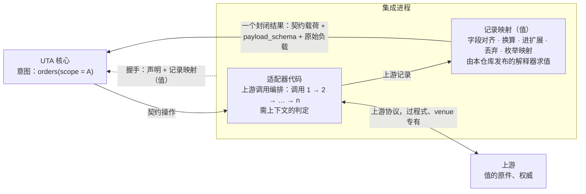

# 集成（上游适配层）设计

本文设计集成这一侧：集成为什么存在、由哪三部分构成、做什么与不做什么，以及怎样证明一个集成合格。核心↔集成的契约（操作的粒度、声明、记录映射、行为、操作集、推送、义务）由核心设计 §8.1–§8.4 拥有，本文只引用，不重述；核心章节号 `§N.M` 指 `design/core/` 下前缀为 N 的文件，本文自己的节写作“本文第 N 节”。

- **范围**：集成三部分的分工、各自在实现上的约束、一致性测试的构成、接入一个新 venue 的步骤。
- **不在范围**：先接哪个 venue；某个 venue 的具体调用序列与记录映射（那是该集成自己的制品）；IDL、公共 schema 与记录映射的文件格式（实现阶段制品，§8.1）。
- **状态**：已定。

## 1 为什么有这一层

> 根本约束见 §0.1：值的权威在上游，UTA 只有意图。

总得有一个地方去接触原值：读懂上游协议、在上游落实意图、判定上游的回应对某个意图意味着什么。这件事若发生在 UTA 里，UTA 就要持有原值的拷贝，并承担与原值无尽的对齐。集成把每个上游的全部接触集中到一处，对 UTA 只交出契约值形式的结论，以及作证据的原文。[设计]

UTA 交给集成的是意图，不是上游调用（§8.1 操作的粒度）：UTA 只说“账户 A 的订单”，上游可能要连调八个过程式接口才凑得出来。集成是 UTA 意图在该上游上的解释器，与 IO 壳解释 `Prepared` 同构（§6.5）。

## 2 三部分怎样分工

集成由三部分构成，对应契约的三部分（§8.1）。判据只有一条：不含调用、先后顺序、时间与跨记录状态的写成值；含其中任一的是代码。

| 部分 | 回答什么 | 形式 | 由谁保证 |
|---|---|---|---|
| 声明 | 这个集成有什么：作用域、流、写能力（每种操作的写操作、键角色及键的作用域与唯一期、取证渠道）与接受的订单目标种类、扩展 schema、锚点对齐 | 值（`Projection`，§2.2） | 握手时核心校验 |
| 记录映射 | 拿到的一条上游记录怎样落到对齐点 | 值（§8.1 记录映射） | 握手时核心静态校验；集成内由本仓库的解释器求值 |
| 适配器代码 | 怎样为一个契约操作从上游拿到记录；需上下文的判定 | 代码，语言不限 | 一致性测试（本文第 5 节） |

### 2.1 适配器代码

适配器代码只做两件事：

- **把契约操作解释为上游调用编排。** 调几次、什么顺序、怎样分页与重试、怎样鉴权与 pacing，都在这里。契约不约束这些（§8.1）。
- **需上下文的判定。** 例如：按核心交来的 `barrier_at` 判断一个调用方键是否仍在上游保证唯一或可查的期限内（§1.6.1），期外查不到只能回 `Unavailable`，不能回 `Absent`；`replay_by_key` 只在键仍在上游保留期内时重放；listing 缺席需隔一段时间再确认的上游，由适配器判断间隔，保证之外回 `Unavailable`（§8.3）。这类判定依赖时间或调用历史，写不成逐条记录的纯变换；核心不持有这些期限。

约束 [设计]：

- **一个操作一个封闭结果。** 编排中任一次上游调用失败，结果就是该操作封闭返回值中的失败值（读为 `Unavailable`），不交出缺项结果（§8.1）。
- **每次写至多一次上游写。** 为一次 `submit` / `cancel` 可以做任意次上游读；改变上游状态的调用至多一次，上游 SDK 自带的写重试必须关闭（§8.1、§8.3）。某上游必须连发多次写才能完成一个意图时，不在适配器里拼装：该操作种类声明为 `Unsupported`，由调用方把各次写组合成各自的单据（例如只能先撤后下的上游，改单声明 `Unsupported`，调用方自己组合撤单与下单两张单据，§6.2）。一个 `OperationKind` 恒为恰好一次上游写（§6.2 交易协议）；新 `OperationKind`（轴 B，§8.3）也只能是另一种单次写，多次写的意图不以新 `OperationKind` 列出。
- **写操作与键角色如实。** 声明改单受支持，就在一次 `submit` 里按意图参数 schema 所接受口径的原义完成改单；schema 不接受上游做不到原义的口径。每次写只凭核心交来的锚点与参数完成，不改写参数：`Close` 按交来的 `PositionRef` 寻址持仓，撤单与改单按交来的订单目标（§8.2 `submit`、`cancel`）。调用方键由核心以 `AttemptRef` 的固定编码铸造（§8.2）：上游在该作用域逐字接受这一编码的每个值时才声明键角色，装不下就声明 `None`，不哈希、不截断、不改写。某次写的键声明为订单键，上游就必须能以它找到并撤改该次写投放的订单；做不到的声明为请求键。键角色不是 `None` 时同时声明键的作用域与上游保证唯一的期限；只在这个作用域与期限内依上游以该键给出的关联填 `FromAttempt`，其外只凭键的记录填 `Unattributed`，判断不了不填 `External`。撤单能按哪种订单身份（venue 订单身份 / 调用方键）找到目标，如实列进目标种类（§8.3）。撤单只能声明按它自己请求键的 by-key / replay-by-key 渠道，不声明 listing 与成交 / 持仓对账（§6.6 撤单尝试的取证）；上游能把某条记录关联到这次撤单请求时，才把它归因到这次撤单；撤单回执里目标订单的状态按目标订单自己的关联证据归因。
- **路由与供给。** 同一会话内，核心对某条流的第一次 `route` 之前，集成不推送这条流；只供给被路由且未被拒绝的主体；`Refused` 只在上游明确拒绝时返回；失去供给（含上游推送通道断开重连）就上报 `Gap{origin: Source}`，它为该流开新流 epoch。会话内上报的每条 gap 带该流的 `generation`：由集成创建，按流、按会话计，会话开始为 0，每上报一条加一并带上新值，所以本会话第一条带 1。集成在收到带这个新 `generation` 的 `route` 之前不推送这条流，确认实时供给后为新 epoch 重新声明 `Live{live_from}`。所带 `generation` 早于该流最近上报的那个的 `route`，一律回 `Unavailable`，不改变任何供给：它问的是已结束的 epoch，核心在收到 gap 之前发出了它；核心不另判，只有集成能判定这一点（§8.2 `route`）。上报这条 gap 之前，先把该流上已收到、尚未作答的 `read`、`backfill` 与 `route` 调用以 `Unavailable` 完成：集成已收到它们，回答就在 gap 之前送出；送出 gap 之后才收到的调用照常作答（`route` 按上一句回 `Unavailable`），核心按发出 epoch 处置 `read`、`backfill` 的结果；写与取证调用不在此列，照常返回（§8.3“上报 gap 之前先完成已收到的调用”）。能以游标续接时，等第一次 `route` 期间不得丢掉上游记录，保不住就声明 gap。每条数据记录（推送、回填、一次性读、回执、取证的都一样）在信封的 `subject` 字段给出它的主体，与 `route` 用同一主体身份，核心按它投递（§8.1、§8.5）。订单状态记录的 `venue_order_id` 与 `Ack` 里的相同，一张订单只出现在一条流上；一个持仓也只出现在一条持仓流上。可衔接序号与 `live_from` 按 §8.4 如实声明；只在上游保有该流自真实起点以来的全部历史（含修订与作废）、且落在与实时相同的回填坐标上时声明 `backfill_from_origin`（§2.2、§8.2 `route`、§8.3、§8.4）。
- **写的四种结果如实。** 上游给出业务回执回 `Ack`，明确拒绝回 `Reject`；在 `submit` / `cancel` 内、交出之前决定不发写（意图的参数 schema 身份已不是此刻接受的、载荷含发不出的选项、先读到没有交易权限），回 `NotSent`，并能证明这次写没有交给任何可能把它送出的部件（SDK 发送缓冲、断线后补发的队列都算已交出）；其余回 `NoResponse`。每个写调用在适配器自己定的时限内给出这四者之一，时限到时可能已交出就是 `NoResponse`（§8.3）。
- **握手结论只取三种。** 上游明确拒绝登记所列的任何身份或配置（凭据被拒、账户不存在或未开通、配置被拒），回 `Refused(reason)`；上游不可达、超时或回答不明确，回 `Unavailable`，核心在同一通道上再握手；否则交出声明（§8.2 `handshake`）。会话中上游吊销了身份，集成关闭通道并退出，核心在它 OS 确认退出之后拉起新进程，由新会话的握手得到 `Refused`（§8.3）。拒绝的粒度是整个登记：登记里一个账户被拒，整个登记停下（§7.2 第 3 步）。
- **只用核心交来的通道与凭据。** 集成进程由核心拉起，只经拉起时继承的通道与核心交换消息，凭据只从拉起时继承的句柄读一次；不读封存文件，不自行连接核心，也不在消息里填会话 epoch：会话就是这条通道，epoch 由核心分配与记录（§7.1 凭据链、§7.2 会话 epoch）。一个进程只有一个会话；通道断了就退出，不重连。
- **推送次序与定序证据如实。** 同一会话内，集成按上游交付推送的次序把它们送出，不重排；这只保证集成不打乱送达次序，本身不是来源顺序的证据。只在上游经一条有序通道、按状态次序交付某流的推送时，为该流声明 `push_ordered`：该流的推送不是多路上游 feed 的合并，也不是由轮询合成的。上游推送通道断开重连是供给中断：集成照路由与供给的义务上报 `Gap{origin: Source}`，它为该流开新流 epoch，重连之后的推送不在原流 epoch 内续接。核心凭 `push_ordered` 只比较同一会话 epoch、同一流 epoch 内的两条推送，它不比较推送与回答，也不跨会话或跨流 epoch；重连而不上报，重连两侧的推送就被当作可比，声明随之不实。只在上游文档保证一个订单修订（或更新时间）值对同一订单跨推送与查询渠道单调时，为订单状态流声明 `order_revision`，并在每条记录上以注册字段 `order_revision` 送达它；只在上游文档保证查询不读到早于已送出推送的状态时，为该流声明 `query_not_lagging`。核心凭这些声明与 venue 序号给同一订单的记录定序，声明不实会让较旧的状态盖掉较新的；都不声明时，不带序号的记录之间不可比，内容不同的由核心并列给出（§2.2、§8.1“订单身份与最近观察”、§8.3）。
- **原文随结果交出。** 一次操作调用了多个上游接口时，原始负载是全部响应的原文，按调用顺序（§6.5）。走 HTTP/WS 的上游，原文是响应或消息字节；经 SDK 回调接入的上游（如 IBKR TWS），原文是集成对 SDK 回调对象的无损序列化，以 SDK 暴露的全部字段为界。

### 2.2 记录映射

记录映射把上游记录落到契约的对齐点：锚点、已注册字段、公共或扩展载荷 schema 的字段（§8.1）。每个上游字段三选一：对齐（可附换算）、进扩展、丢弃；枚举值走枚举映射表，表外值为 `Unmapped(raw)`。

- **适配器作者决定丢什么。** 丢弃是映射里的显式选择：丢掉的字段不进契约载荷。它的后果在握手时就能看到：该流提供的字段集里没有它，引用它的程序树与检查项在装载 / 启动期被拒（§2.5、§8.1）。
- **有公共 schema 的种类必须用公共 schema。** 公共 schema 的必填字段必须全部对齐，否则投影不合法（§8.1）。venue 特有内容走扩展 schema 的单独流，程序按身份字段 `Join`。
- **原文保留按路径。** 写路径回应与可带 `attribution` 的流（订单状态、成交）必须保留原始负载；其余观察流由映射声明保留与否（§8.1）。
- **成交身份。** `execution_id` 由上游证明能唯一识别一笔执行的键构造，跨渠道、跨会话一致；上游明确给出修正次序时才给 `execution_revision`；不是执行的行由映射丢弃（§8.1）。
- **在集成内求值。** 映射由本仓库随 IDL 发布的解释器求值，以库的形式嵌入适配器；核心只校验、不执行，所以核心永远看不到上游形状的记录（§8.1）。

### 2.3 声明

声明是一个值：`Projection`（§2.2）中除 `mappings` 外的部分（`mappings` 即上一节的记录映射，随同一个值交出），加锚点对齐。

- 集成可以先调用上游（例如列出账户得到 `WriteScope`、查询已开通的能力），再构造这个值；交给核心的只是结果值。
- 值是权威表示，各语言的构造 API 只是构造糖（与值树同一规则，§2.5）。校验失败按 §8.2 `handshake` 处理：投影不合法，拒绝该集成。
- 能力可在握手后变化，经能力变更推送进入核心（§8.3），不改声明的形式。
- 核心在声明上做的事：路由（lane 按 `WriteScope`、订阅、一次性读与回填按 `StreamDecl`）、门（写门按 `Capability` 的可执行性：支持与否、意图参数 schema、目标种类，§6.2；读按流的 `read` / `backfill` 能力）、`required_inputs` 比对（§2.5）、每次写所用的写操作、键角色与取证渠道顺序（§6.5、§6.6），以及把声明落成声明版本、经读模型 `sources` 交给解释层（`account_ref`、`label`、名义数据等级在这里被用到，§8.5）。声明中每一项都应对应到其中一处。

## 3 集成不做什么

- **不以拷贝回答读。** 读与取证的回答来自本次对上游的询问；为消费推送流维持的状态只用于产出推送记录（§8.3）。集成本身也不得成为上游原值的第二份拷贝。
- **不越过契约。** 不把上游消息格式放进载荷；不输出契约封闭集合之外的返回值；不交出缺项结果；判定不了就取保守值（`NoResponse`、`Unavailable`、`Unmapped(raw)`），不交给 UTA 再判定。
- **不把上游接口带进契约。** 契约操作按 UTA 的意图定粒度（§8.1）；一个上游接口的形状不成为契约的形状。
- **不做决策。** 不持有规则状态、不决定是否发写、不重试写、不接触 SQLite（§8.3）。
- **不理解 UTA 的规则。** 集成只需要锚点表、字段注册表与载荷 schema（§2.1）。

## 4 发布什么

本仓库随 release 发布：

- 契约 schema：`Projection`、公共载荷 schema、公共请求 schema（有公共 schema 的种类各一份，§2.2）、交易协议各操作种类的公共意图 schema（§6.2、§8.1）、记录映射的 schema；
- JSON Schema 的参考校验器（钉住的 draft 版本与关键字子集，§6.2）：核心的输入约束步按同一语义校验意图参数；集成作者写扩展意图 schema 时，据它确认 schema 只用该子集、参数的合规结论与核心一致；
- 记录映射解释器（库）；
- 一致性测试套件与 fixture 上游。

每个集成随自己的发布制品给出它的扩展 schema 与记录映射（值）。解释层在构建期据此生成该来源专有的命令参数与字段（`design/downstream/design.md` 第 4 节）；握手时交出的同一组值以 `(schema_id, schema_version)` 标识，与发布制品不一致的版本在解释层按“构建时没有的 schema 版本”处理。

本仓库不提供各语言的适配器框架：契约只有一份，合格与否由握手校验与一致性测试裁定；框架是实现便利，以后加入也不改契约。[设计]

## 5 一致性测试

一个集成合格，当且仅当它通过握手校验与一致性测试。测试以 **fixture 上游**驱动集成：fixture 是可编程的假上游，扮演上游的全部回应方式，测试观察集成对核心输出了什么。

fixture 必须能注入的上游行为：

- 写：业务回执、明确拒绝、超时、断连、5xx、仅传输层确认、回执迟到；写前读到不能发（无交易权限、连接已断）；写交给 SDK 缓冲后断线；一次写完成的改单与只能先撤后下的改单；按调用方键撤单被上游接受或拒绝；上游对键的字符集与长度限制；同一作用域里别的写者用了同样字节的键；
- 读：命中、明确否定、键超出上游保证期限、listing 滞后、分页、不可达；查询回答比调用发出前已送出的推送更旧（上游查询读到较早的副本）；上游明确拒绝一次读或回填（未开通、主体不受支持）、历史穷尽、只保留最近一段历史；
- 握手：凭据被拒、账户不存在或未开通、上游暂时不可达、会话中吊销身份；
- 编排：一个操作所需的多次上游调用中，任一次失败；
- 推送：乱序、重复、断线、续传游标可用与不可用、未列举的状态值、venue 专有字段；同一执行经推送、回执、`list_fills`、`read`、`backfill` 多渠道到达；执行修正（有 / 无上游次序）；非执行行；无身份的执行；订单状态在推送与查询上都带订单修订值（跨渠道单调与不单调两种）；同一序号或同一修订值上内容不同的记录；同一流的推送来自多路上游 feed 的合并、由轮询合成，或在一个会话内经历上游推送通道重连后重送较旧的状态；上游推送通道在该流有 `read`、`backfill`、`route` 与写调用在途时断开重连。

测试项：

- 核心验收 §10.5 #22 的每一条；
- 握手：凭据或账户被拒时回 `Refused`，上游暂时不可达时回 `Unavailable` 并在同一通道上接受再握手，会话中吊销身份时关闭通道并退出（核心验收 §10.5 #36 中由集成决定的各条）；
- 写的结果：写前读到不能发、参数 schema 身份不符时回 `NotSent`、fixture 写调用数为 0；写已交给 SDK 缓冲后断线时回 `NoResponse`，不回 `NotSent`；每个写调用在适配器时限内返回（核心验收 §10.5 #59 中由集成决定的部分）；
- 写操作与键角色：声明改单受支持的，每笔改单 fixture 写调用数恰为 1 且按原义执行；只能先撤后下的上游声明改单不受支持；核心铸造的键原样到达 fixture 上游，上游装不下该编码时声明 `None`；声明为订单键的键在 fixture 上能撤改该次写投放的订单；只带键的记录只在声明的键作用域与唯一期内归因为 `FromAttempt`，别的写者用同样字节的键时得 `Unattributed`；目标种类只列 fixture 上确能找到目标的身份；`Close` 在 fixture 上平的是交来的 `PositionRef` 所指的持仓；撤单的记录只在上游以请求键关联到这次撤单时归因到它（核心验收 §10.5 #22、#41、#42、#51、#52、#61 中由集成决定的部分）；
- 按键取证的窗口：`barrier_at` 已超出 fixture 上游的键唯一期时 `query_by_key` 回 `Unavailable`，不回 `Absent`；超出保留期时 `replay_by_key` 回 `Unavailable` 且不向上游重放；空 listing 不作否定（核心验收 §10.5 #65 中由集成决定的部分）；
- 路由与供给：第一次 `route` 之前不推送该流，只供给被路由且未被拒绝的主体；失去供给时上报 `Gap{origin: Source}`，会话内的每条带 `generation`：每条流的 `generation` 在会话开始时为 0，每上报一条加一并带上新值，所以本会话第一条带 1；之后在收到带新 `generation` 的 `route` 之前不推送该流，并为新 epoch 重新声明 `live_from`；上报之后收到的、带旧 `generation` 的 `route` 回 `Unavailable`，供给与推送都不变；上报之前已收到的该流 `read`、`backfill`、`route` 都已以 `Unavailable` 送出，上报之后才收到的 `read`、`backfill` 照常作答，写调用的回答照常送出；等待路由期间不丢可续接的上游记录，或声明 gap；每条数据记录带与 `route` 同一身份的 `subject`；订单状态的 `venue_order_id` 与 `Ack` 相同，一张订单只在一条流上，一个持仓只在一条持仓流上；可衔接序号与 `live_from` 如实（核心验收 §10.5 #45、#47、#49 各自最后一条，#54 第二条，#77，#84，#87 的合格集成、跨越的 `route`、合规的竞态与集成一致性四条）；
- 来源顺序：同一会话内推送按 fixture 交付的次序送出；声明 `order_revision` 的，同一订单的修订值跨推送与查询单调、每条订单状态记录都带；声明 `query_not_lagging` 的，一次性读、回执与取证的回答从不早于调用发出前已送出的推送；声明 `push_ordered` 的，同一会话、同一流 epoch 内该流后送出的推送从不早于先送出的，fixture 上的上游推送通道断开重连时集成先上报 `Gap{origin: Source}` 再送出重连后的推送；fixture 上修订值不跨渠道单调、查询读到较早副本、推送来自多路 feed 合并或由轮询合成时，集成不声明对应的项；声明了 `push_ordered` 而同一流 epoch 内出现后送出者反映更早状态，或上游推送通道重连而未上报 `Gap{origin: Source}` 的，测试判为声明不实（核心证伪 §10.4 #30、#31、#37，验收 §10.5 #69 中由集成决定的部分）；
- 读与回填：上游明确拒绝时回 `Refused`，超时、断连、限流回 `Unavailable`；回填的 `covered_to` 只在历史穷尽时短于窗口，任一页失败即整体 `Unavailable`；声明 `backfill_from_origin` 的，从 `Origin` 起的窗口交回自起点以来的全部记录，上游只保留最近一段时不以“此刻最早一条”作答（§8.3；核心验收 §10.5 #28 的两条回填、#55 最后一条中由集成决定的部分）；
- 账户引用：重登录、换凭据、重启后对同一上游账户给出同一 `account_ref`，从不把用过的引用给另一个账户（核心验收 §10.5 #26 第三条）；
- 成交身份：各渠道、各会话给出同一 `execution_id`，给不出身份时读与回填回 `Unavailable`（核心验收 §10.5 #39 最后一条、#40 第一条中由集成决定的部分）；
- 推送义务：断线后上报 `Gap{origin: Source}`；readiness 进入 `Live` 时声明 `live_from`；续传与否按 §8.2 `handshake` 的 epoch 规则；`attribution` 按 §5.3 填写；
- 声明与记录映射：通过握手校验；写操作的 `CapabilityProof` 声明的每条取证渠道，在 fixture 上都能按 §8.2 的返回值集合应答。

每个集成上线前必须通过全部测试项；这也是 C2 关闭事件“每个集成上线时其 P1 声明完整”的检查点。

## 6 接入一个新 venue

1. 从该 venue 的一手文档核实能力：推送流、调用方幂等键及其字符集与长度限制、唯一性的作用域与期限、保留期，按键回读、续传游标、配额（§1.6.1 的一行）、成交身份及其跨渠道一致性与修正方式、上游怎样表达凭据或账户被拒、改单能否一次写按原义完成、撤单能按哪种订单身份找到目标、调用方键能否用来撤改订单，以及每个契约操作在该上游需要哪些接口。
2. 写声明：作用域与锚点对齐、流与载荷 schema、每个 `(scope, OperationKind)` 的能力（写操作、键角色及键的作用域与唯一期、取证渠道）与接受的目标种类。
3. 写记录映射：公共 schema 的必填字段全部对齐，决定哪些字段进扩展、哪些丢弃；枚举映射表按该 venue 列举输入值；声明各观察流是否保留原文。
4. 写适配器代码：每个契约操作的上游调用编排与需上下文的判定。
5. 让 fixture 上游复现第 1 步核实到的每一项能力与限制，通过握手校验与一致性测试。

新 venue 只加处理器、扩展 schema 与记录映射，不改锚点、不改核心（§8.3 扩展三轴）。解释层重新构建即得到该来源的命令；对外概念与翻译表不变。
