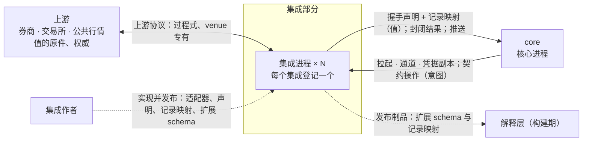

# 集成：系统上下文

## 0 定位

- **层级与元素：** C4 L1，集成部分作为黑盒。上级是景观文档 [../README.md](../README.md)：划分理由在其 §4.1，部分之间的关系在 §4.2，需求分配在 §4.3。
- **本文决定：** 集成为什么存在、与哪些外部交换什么、分配到哪些需求、由什么容器构成、本仓库为集成作者发布什么、一个集成怎样才算合格、接入一个新 venue 怎样走。
- **读者：** 集成作者（语言不限，第三方）；审查一个集成能否上线的人；实现 core 时需要知道集成边界的人。审批者无（K3）。
- **状态：** 已定。
- **非目标：**
  - 核心↔集成契约本身（操作粒度、契约三部分、`Projection`、记录映射与握手校验、操作集、推送、错误映射、集成义务清单、扩展三轴）：由 core 拥有，规格在 [integration-session.md §4.3 核心↔集成契约的会话部分](../core/core-process/integration-session.md#43-核心集成契约的会话部分) 及各操作所在组件（[core-process/design.md §4.2 对外接口总表](../core/core-process/design.md#42-对外接口总表)）。本文只引用，不复述。
  - 集成进程的内部：[integration-process/design.md](integration-process/design.md)。
  - 先接哪个 venue；某个 venue 的具体调用序列与记录映射（那是该集成自己的制品）。
  - IDL、公共 schema 与记录映射的文件格式（实现阶段制品）。

证据标签与编号前缀的约定见 [README.md §0.4 阅读约定](../README.md#04-阅读约定)。

## 1 问题域

### 1.1 为什么有这一层

> 根本约束：值的权威在上游，UTA 只有意图（[README.md §1.1 根本约束：权威不在 UTA](../README.md#11-根本约束权威不在-uta)）。

总得有一个地方去接触原值：读懂上游协议、在上游落实意图、判定上游的回应对某个意图意味着什么。这件事若发生在核心里，核心就要持有原值的拷贝，并承担与原值无尽的对齐。集成把每个上游的全部接触集中到一处，对核心只交出契约值形式的结论，以及作证据的原文。[设计]

核心交给集成的是意图，不是上游调用：核心只说“账户 A 的订单”，上游可能要连调八个过程式接口才凑得出来。集成是核心意图在该上游上的解释器，与 IO 壳解释 `Prepared` 同构（[io-shell.md §3.2 IO 壳是效应侧的解释器](../core/core-process/io-shell.md#32-io-壳是效应侧的解释器)）。它与解释层对称：集成把上游清洗成契约值，解释层把核心清洗成下游接口（[README.md §1.4 三段：清洗、抽象、清洗](../README.md#14-三段清洗抽象清洗)）。

### 1.2 外部与它们的固有性质

| 外部 | 它是什么 | 与集成相关的固有性质 |
|---|---|---|
| 上游（券商、交易所、公共行情） | 值的原件与权威（F1） | 协议过程式、venue 专有；写的结果可能不可判定（F5）；能力、限额与键、保留期语义按 venue × 操作种类变化，不少未文档化（F6）；会限流（F7）；listing 滞后（F10）；推送有自己的时钟（F11）；成交身份与修正方式由 venue 给出（F12） |
| core（核心进程） | 契约的拥有者，拉起集成进程 | 只认契约值：声明与记录映射在握手时静态校验，行为只见封闭返回值与推送（[integration-session.md §3.2 契约的三部分](../core/core-process/integration-session.md#32-契约的三部分-设计)） |
| 集成作者 | 第三方，按 IDL 实现一个集成 | 语言按上游 SDK 选；venue 的能力要由作者从一手文档核实 |
| 解释层（构建期） | 下游接口的构建 | 构建期从各集成发布的扩展 schema 与记录映射生成来源专有的参数与字段 |
| OS | 进程、继承句柄 | 三个目标 OS（H8）；进程的存亡只有 OS 能确认 |

### 1.3 分配给集成的需求

需求编号与定义见 [README.md §4.3 需求分配](../README.md#43-需求分配)；集成承担的部分如下，每条都是 [integration-session.md §4.4 集成义务清单](../core/core-process/integration-session.md#44-集成义务清单) 中某组义务的集成侧陈述：

| 编号 | 集成承担的部分 |
|---|---|
| C2 | 在写能力里如实声明取证渠道；取证按上游证据作答，键窗口按 `barrier_at` 判断，期外 `Unavailable` |
| C6 | 供给中断即上报 `Gap{origin: Source}`；只在能以游标证明时续接，不伪造连续 |
| C7 | 凭据终点：凭据只经“统一路径封存文件 → 核心 → 该集成进程”注入 |
| C8 | 订阅流与调用方键对每个集成都是新写的能力，不复用旧 adapter 的行为 |
| C13 | 枚举映射表外只输出 `Unmapped(raw)`；写路径与可带 `attribution` 的流保留原始负载 |
| Q1、Q5 | 回执与推送带原生身份与成交字段，有公共 schema 的种类按公共 schema 输出 |
| Q2 | 可能已交出即 `NoResponse`；每次写至多一次上游写；通道关闭即退出 |
| Q3 | 取证渠道按声明回答；`Absent` 只给唯一期内足以证明未发生的明确否定 |
| Q6 | `attribution` 只依上游关联证据填写 |
| Q11 | 断线上报 `Gap{origin: Source}`，不静默跳过 |
| Q13 | 声明订阅配额池 |
| Q14 | 回填按 pacing 分页、`covered_to` 如实；按时机声明 `live_from` |
| Q15 | 多次上游调用中任一失败得到封闭的 `Unavailable`，不交出缺项结果 |
| Q16 | 读与回填能力按流如实声明；`Unsupported` 与不可用如实区分 |
| Q18 | 一个集成的故障、换凭据、重启只影响它自己的流；`account_ref` 跨握手不变 |
| Q27 | 改单只在上游能一次写完成时声明为受支持 |
| Q32 | 握手的 `Refused` 只给上游的明确拒绝，其余是 `Unavailable`；上报 readiness |

## 2 驱动

- **K1**：集成是独立进程，与核心之间是序列化文本或跨语言 RPC；契约只有一份，由 IDL 固定。
- **K2 不约束集成**：K2 的 Rust 偏好只约束 core 与解释层；集成作者按自己的上游 SDK 选语言（[README.md §3.2 约束与偏好](../README.md#32-约束与偏好)）。
- **H8**：三个目标 OS。
- **行为只能由测试证明**：值（声明、记录映射）能在握手时静态校验，行为不能；由此需要一个与语言无关的合格判据（§3.1）。

各质量场景在集成进程上的响应度量见 [integration-process/design.md §2 驱动](integration-process/design.md#2-驱动)。

## 3 模型

### 3.1 合格判据

契约的三部分里，声明与记录映射是值，由核心在握手时静态校验；行为是代码，只能由一致性测试验证（[integration-session.md §3.2 契约的三部分](../core/core-process/integration-session.md#32-契约的三部分-设计)）。所以：**一个集成合格，当且仅当它通过握手校验与一致性测试。** 每个集成上线前必须通过全部测试项；这也是 C2 关闭事件“每个集成上线时其 P1 声明完整”的检查点。测试怎样驱动集成、观测什么，见 [integration-process/design.md §6.1 一致性测试](integration-process/design.md#61-一致性测试)。[设计]

### 3.2 集成不做什么

以下是集成对外的不变量，均为核心↔集成契约义务的集成侧陈述：

- **不以拷贝回答读**：读与取证的回答来自本次对上游的询问；为消费推送流维持的状态只用于产出推送记录。集成不得成为上游原值的第二份拷贝。
- **不越过契约**：不把上游消息格式放进载荷；不输出契约封闭集合之外的返回值；不交出缺项结果；判定不了就取保守值（`NoResponse`、`Unavailable`、`Unmapped(raw)`），不交给核心再判定。
- **不把上游接口带进契约**：契约操作按核心的意图定粒度；一个上游接口的形状不成为契约的形状。
- **不做决策**：不持有规则状态、不决定是否发写、不重试写、不接触 SQLite。
- **不理解核心的规则**：集成只需要锚点表、字段注册表与载荷 schema（[envelope.md §3.1 锚点表 × 链路](../core/core-process/envelope.md#31-锚点表--链路)、[envelope.md §3.2 处理器字段注册表](../core/core-process/envelope.md#32-处理器字段注册表)、[envelope.md §3.3 payload_schema 与 schema 发布](../core/core-process/envelope.md#33-payload_schema-与-schema-发布)）。

## 4 结构

### 4.1 容器

| 容器 | 拥有 | 隐藏的决定 | 假设 | 文档 |
|---|---|---|---|---|
| 集成进程 | 一个集成登记的上游连接与凭据副本；对该上游的全部消费：把契约操作落到上游，把上游的回应清洗成契约值 | 上游账户结构、venue 词汇、上游消息格式与调用序列 | 核心↔集成契约稳定；只经核心创建的通道与核心交换消息；读的回答来自本次对上游的询问 | [integration-process/design.md](integration-process/design.md) |

- **个数**：每个集成登记一个集成进程；同一集成同时至多一个进程（[integration-session.md §3.8 不变量](../core/core-process/integration-session.md#38-不变量) 第 3 条）。
- **为什么是独立的进程**：每个集成一个独立 OS 进程，语言不限；它是凭据终点，也是独立故障域。集成与核心同进程会失去这两点，还会强制集成用核心的语言（[README.md §4.1 划分与理由](../README.md#41-划分与理由)）。
- **只有这一个容器**：一致性测试套件与 fixture 上游是证明集成进程合格的手段，属于它的评估（§3.1），不是集成部分运行时的组成。

与 core 的每一种交互，规格都在实现它的核心组件文档里：[integration-session.md §4.3 核心↔集成契约的会话部分](../core/core-process/integration-session.md#43-核心集成契约的会话部分)，各操作见 [core-process/design.md §4.2 对外接口总表](../core/core-process/design.md#42-对外接口总表)。

### 4.2 发布物

本仓库随 release 发布给集成作者：

- 契约 schema：`Projection`、公共载荷 schema、公共请求 schema（有公共 schema 的种类各一份）、交易协议各操作种类的公共意图 schema、记录映射的 schema（[envelope.md §3.3 payload_schema 与 schema 发布](../core/core-process/envelope.md#33-payload_schema-与-schema-发布)）；它们是 core 拥有的契约（[README.md §4.2 部分之间的关系](../README.md#42-部分之间的关系)）；
- JSON Schema 的参考校验器（钉住的 draft 版本与关键字子集）：核心的输入约束步按同一语义校验意图参数；集成作者写扩展意图 schema 时，据它确认 schema 只用该子集、参数的合规结论与核心一致（[ticket.md §3.4 参数合规：意图参数 schema](../core/core-process/ticket.md#34-参数合规意图参数-schema-设计)）；
- 记录映射解释器（库）：按 core 定义的值树表示求值（[core-process/design.md §3.12 组合子值树与五个 fold](../core/core-process/design.md#312-组合子值树与五个-fold)）；
- 一致性测试套件与 fixture 上游（[integration-process/design.md §6.1 一致性测试](integration-process/design.md#61-一致性测试)）。

每个集成随自己的发布制品给出它的扩展 schema 与记录映射（值）；它们在构建期交给解释层，这条部分之间的关系见 [README.md §4.2 部分之间的关系](../README.md#42-部分之间的关系)。

### 4.3 部署与信任

- **由核心拉起**：集成与核心之间只有核心创建、在拉起时交给集成进程的那条通道（[integration-session.md §3.5 会话：核心创建的通道化身](../core/core-process/integration-session.md#35-会话核心创建的通道化身-设计)）；进程一侧的动作见 [integration-process/design.md §4.6 进程视图](integration-process/design.md#46-进程视图)。
- **凭据终点**：凭据只经“统一路径封存文件 → 核心 → 该集成进程”注入（C7）；集成进程持有的副本随它的退出结束（[integration-session.md §4.5 进程、通道与凭据](../core/core-process/integration-session.md#45-进程通道与凭据)）。
- **信任单位是 OS 用户**：集成进程是同一 OS 用户下的独立进程（[core/design.md §4.3 部署与信任](../core/design.md#43-部署与信任)）。
- **独立故障域**：一个集成的故障、换凭据、重启只影响它自己的流（Q18）。

## 5 走查

### 5.1 接入一个新 venue

经过集成作者、集成进程、核心的握手校验、一致性测试与解释层的构建。

1. 从该 venue 的一手文档核实能力：推送流、调用方幂等键及其字符集与长度限制、唯一性的作用域与期限、保留期，按键回读、续传游标、配额（[README.md §2.4.1 Venue 原生能力](../README.md#241-venue-原生能力) 的一行）、成交身份及其跨渠道一致性与修正方式、上游怎样表达凭据或账户被拒、改单能否一次写按原义完成、撤单能按哪种订单身份找到目标、调用方键能否用来撤改订单，以及每个契约操作在该上游需要哪些接口。
2. 写声明（[integration-process/design.md §4.5 声明构造](integration-process/design.md#45-声明构造)）。
3. 写记录映射（[integration-process/design.md §4.4 记录映射](integration-process/design.md#44-记录映射)）。
4. 写适配器代码（[integration-process/design.md §4.3 适配器代码](integration-process/design.md#43-适配器代码)）。
5. 让 fixture 上游复现第 1 步核实到的每一项能力与限制，通过握手校验与一致性测试（§3.1）。

新 venue 只加处理器、扩展 schema 与记录映射，不改锚点、不改核心（[integration-session.md §4.3.4 扩展与演进](../core/core-process/integration-session.md#434-扩展与演进)）。解释层重新构建即得到该来源的命令；对外概念与翻译表不变。

卡点：无。每一步只用本部分的容器、core 公布的契约与解释层的构建输入。

## 6 评估

### 6.1 替代方案

- **不提供各语言的适配器框架** [设计]：契约只有一份，合格与否由握手校验与一致性测试裁定；框架是实现便利，以后加入也不改契约。
- **不选：集成与核心同进程**：理由见 §4.1。

### 6.2 风险

- **行为义务无法由构造保证，只能由一致性测试发现**：fixture 没覆盖到的上游行为，集成可能声明不实（例如 `push_ordered`、`query_not_lagging`），后果是较旧状态盖掉较新状态。缓解是 §5.1 第 1 步的一手核实与第 5 步的复现要求。

本层没有另外的证伪条件与验收项；集成进程的验收 #22、#77 在 [integration-process/design.md §6.2 验收](integration-process/design.md#62-验收)。
