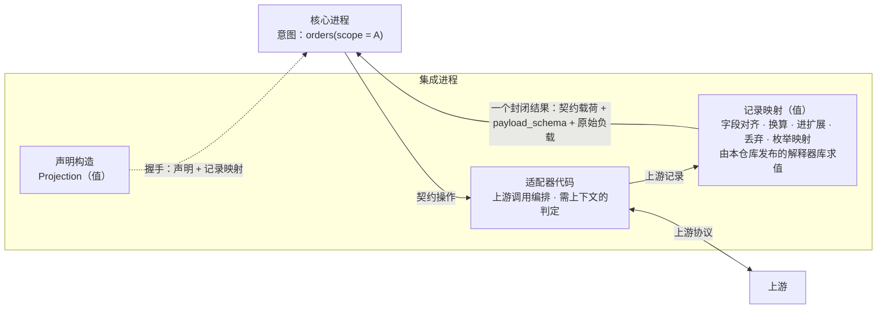

# 集成（上游适配层）

- **层级与元素**：集成部分的 C4 树。第 1 节是它的 L1（系统上下文，黑盒）；这一部分只有一种容器——集成进程——所以容器与组件视图写在同一份文档的第 3–4 节。上级：[README.md §4.1 划分与理由](../README.md#41-划分与理由)。
- **决定什么**：集成为什么存在；一个集成进程由哪三部分构成、各自承担核心↔集成契约的哪些义务、在实现上受什么约束；本仓库为集成作者发布什么；怎样证明一个集成合格；接入一个新 venue 的步骤。
- **读者**：集成作者（语言不限，第三方）；审查一个集成能否上线的人。审批者：维护者。
- **状态**：已定。
- **非目标**：
  - 核心↔集成契约本身（操作粒度、契约三部分、`Projection`、记录映射与握手校验、操作集、推送、错误映射、集成义务清单、扩展三轴）：由 core 拥有，规格在 [integration-session.md §4.3 核心↔集成契约的会话部分](../core/core-process/integration-session.md#43-核心集成契约的会话部分) 及各操作所在组件（[core-process/design.md §4.2 对外接口总表](../core/core-process/design.md#42-对外接口总表)）。本文只引用，不复述。
  - 先接哪个 venue；某个 venue 的具体调用序列与记录映射（那是该集成自己的制品）。
  - IDL、公共 schema 与记录映射的文件格式（实现阶段制品）。

证据标签与编号前缀的约定见 [README.md §0.4 阅读约定](../README.md#04-阅读约定)。

## 1 系统上下文（L1）

### 1.1 为什么有这一层

> 根本约束：值的权威在上游，UTA 只有意图（[README.md §1.1 根本约束：权威不在 UTA](../README.md#11-根本约束权威不在-uta)）。

总得有一个地方去接触原值：读懂上游协议、在上游落实意图、判定上游的回应对某个意图意味着什么。这件事若发生在核心里，核心就要持有原值的拷贝，并承担与原值无尽的对齐。集成把每个上游的全部接触集中到一处，对核心只交出契约值形式的结论，以及作证据的原文。[设计]

核心交给集成的是意图，不是上游调用：核心只说“账户 A 的订单”，上游可能要连调八个过程式接口才凑得出来。集成是核心意图在该上游上的解释器，与 IO 壳解释 `Prepared` 同构（[io-shell.md §3.2 IO 壳是效应侧的解释器](../core/core-process/io-shell.md#32-io-壳是效应侧的解释器)）。它与解释层对称：集成把上游清洗成契约值，解释层把核心清洗成下游接口（[README.md §1.4 三段：清洗、抽象、清洗](../README.md#14-三段清洗抽象清洗)）。

### 1.2 黑盒与外部

| 外部 | 关系 | 交换什么 | 规格所在 |
|---|---|---|---|
| 上游 | 集成是上游的唯一消费点 | 上游协议的调用与回应、推送 | 该集成自己的制品 |
| core（核心进程） | 核心拉起集成进程、给通道与凭据副本；在通道上发契约操作，收封闭结果与推送 | 契约值（信封 + 契约载荷 + 按保留规则的原始负载） | [integration-session.md §4.3 核心↔集成契约的会话部分](../core/core-process/integration-session.md#43-核心集成契约的会话部分) |

### 1.3 分配给集成的需求

需求编号与定义见 [README.md §4.3 需求分配](../README.md#43-需求分配)；集成承担的是：

- **Q3、Q5**：写结果与回执保真、未列举状态以 `Unmapped(raw)` 承载、原始负载完整保留（C13）；取证渠道如实声明（C2）。
- **C2 的关闭事件**：“每个集成上线时其 P1 声明完整”，检查点就是本文 §5 的一致性测试。
- **C7**：凭据只经“统一路径封存文件 → 核心 → 该集成进程”注入，集成进程是凭据终点。
- **Q15、Q16**：多次上游调用中任一失败得到封闭的 `Unavailable`；能力 `Unsupported` 与不可用如实区分。
- **Q18**：一个集成的故障、换凭据、重启只影响它自己的流。

### 1.4 为什么集成是独立的进程

每个集成一个独立 OS 进程，语言不限；它是凭据终点，也是独立故障域。集成与核心同进程会失去这两点，还会强制集成用核心的语言（[README.md §4.1 划分与理由](../README.md#41-划分与理由)）。

## 2 驱动

| 场景 | 本部分的响应 | 响应度量 |
|---|---|---|
| Q3（`Undetermined` 收敛） | 取证渠道按声明回答；期外、判断不了一律 `Unavailable` | 一致性测试“按键取证的窗口”各条 |
| Q5（回执保真与未列举状态） | 公共 schema 输出、枚举映射表外为 `Unmapped(raw)`、写路径与可带 `attribution` 的流带原文 | 验收 #22 第 5 条 |
| Q15（fan-out 部分失败） | 一个操作一个封闭结果 | 验收 #22 第 6 条 |
| Q18（配置热变更 / 换凭据） | 一个进程一个会话；通道断即退出，不重连 | [integration-session.md §6.3 验收 #78](../core/core-process/integration-session.md#63-验收标准) 中由集成决定的各条 |

约束：K1（独立进程，跨进程通讯为序列化文本或跨语言 RPC）；三个目标 OS（H8）——集成作者按自己的上游 SDK 选语言，契约只有一份。

## 3 模型：三部分与判据

集成由三部分构成，对应契约的三部分（[integration-session.md §3.2 契约的三部分](../core/core-process/integration-session.md#32-契约的三部分-设计)）。判据只有一条：**不含调用、先后顺序、时间与跨记录状态的写成值；含其中任一的是代码。**

| 部分 | 回答什么 | 形式 | 由谁保证 |
|---|---|---|---|
| 声明 | 这个集成有什么：作用域、流、写能力（每种操作的写操作、键角色及键的作用域与唯一期、取证渠道）与接受的订单目标种类、扩展 schema、锚点对齐 | 值（`Projection`） | 握手时核心校验 |
| 记录映射 | 拿到的一条上游记录怎样落到对齐点 | 值 | 握手时核心静态校验；集成内由本仓库的解释器求值 |
| 适配器代码 | 怎样为一个契约操作从上游拿到记录；需上下文的判定 | 代码，语言不限 | 一致性测试（§5） |

- **为什么这样分**：值能在握手时被静态校验（丢字段、映射不穷尽在握手时就能查出），代码只能靠测试。把不含调用与状态的清洗全部写成值，能被构造保证的就不留给测试；调用编排写不成值（要表达调用、顺序、分页与重试就是在写程序）。替代方案的比较见 [integration-session.md §3.2 契约的三部分](../core/core-process/integration-session.md#32-契约的三部分-设计)。
- **集成不做什么**（与核心的分工，均为契约义务的集成侧陈述）：
  - 不以拷贝回答读：读与取证的回答来自本次对上游的询问；为消费推送流维持的状态只用于产出推送记录。集成不得成为上游原值的第二份拷贝。
  - 不越过契约：不把上游消息格式放进载荷；不输出契约封闭集合之外的返回值；不交出缺项结果；判定不了就取保守值（`NoResponse`、`Unavailable`、`Unmapped(raw)`），不交给核心再判定。
  - 不把上游接口带进契约：契约操作按核心的意图定粒度；一个上游接口的形状不成为契约的形状。
  - 不做决策：不持有规则状态、不决定是否发写、不重试写、不接触 SQLite。
  - 不理解核心的规则：集成只需要锚点表、字段注册表与载荷 schema（[envelope.md §3.1 锚点表 × 链路](../core/core-process/envelope.md#31-锚点表--链路)、[envelope.md §3.2 处理器字段注册表](../core/core-process/envelope.md#32-处理器字段注册表)、[envelope.md §3.3 payload_schema 与 schema 发布](../core/core-process/envelope.md#33-payload_schema-与-schema-发布)）。

## 4 结构

### 4.1 容器：集成进程

- **拉起与通道**：集成进程由核心拉起，只经拉起时继承的通道与核心交换消息，不自行连接核心。凭据只从拉起时继承的句柄读一次，读后关闭；不读封存文件（[integration-session.md §4.5 进程、通道与凭据](../core/core-process/integration-session.md#45-进程通道与凭据)）。
- **一个进程一个会话**：会话就是这条通道；集成不在消息里填会话 epoch，epoch 由核心分配与记录（[integration-session.md §3.5 会话：核心创建的通道化身](../core/core-process/integration-session.md#35-会话核心创建的通道化身-设计)）。通道断了就退出，不重连。
- **上游吊销身份**：集成关闭通道并退出；核心在它 OS 确认退出之后拉起新进程，由新会话的握手得到 `Refused`（[integration-session.md §4.3.1 handshake](../core/core-process/integration-session.md#431-handshake--projection--refused--unavailable)）。
- **持久化**：集成不接触 SQLite；它若为续传暂存上游记录，那是它进程内的实现，不是核心可见的状态。

### 4.2 组件：义务怎样落到三部分

下表把 [integration-session.md §4.4 集成义务清单](../core/core-process/integration-session.md#44-集成义务清单) 的每组义务分给承担它的组件。规格以链接处为准；本表只写该组件做什么以及本文特有的实现约束。

| 组件 | 承担的义务 | 规格 |
|---|---|---|
| 声明构造 | 作用域与锚点对齐、流及其 `payload_schema` 与 `request_schema`、写能力与目标种类、`account_ref`、`joinable_venue_seq`、`backfill_from_origin`、`order_revision`、`query_not_lagging`、`push_ordered` 的如实声明 | [integration-session.md §3.3 投影 Projection](../core/core-process/integration-session.md#33-投影-projection)、[integration-session.md §4.4 集成义务清单](../core/core-process/integration-session.md#44-集成义务清单) |
| 记录映射 | 对齐 / 进扩展 / 丢弃、枚举映射与 `Unmapped(raw)`、原始负载保留、`execution_id` / `execution_revision`、`venue_order_id` 与一单一流、一个持仓只在一条持仓流上、`subject` | [integration-session.md §3.4 记录映射](../core/core-process/integration-session.md#34-记录映射-设计)、[read-model.md §3.2 成交的计数身份](../core/core-process/read-model.md#32-成交的计数身份-设计)、[envelope.md §3.3 payload_schema 与 schema 发布](../core/core-process/envelope.md#33-payload_schema-与-schema-发布) |
| 适配器代码：写 | `submit` / `cancel` 的四种结果、每次写至多一次上游写、写操作与键角色如实、时限内返回 | [io-shell.md §4.6 submit](../core/core-process/io-shell.md#submitattempt--ack--reject--notsent--noresponse)、[io-shell.md §4.6 cancel](../core/core-process/io-shell.md#cancelattempt--ack--reject--notsent--noresponse)、[ticket.md §4.5 交易协议：操作种类、目标、可执行性、检查目录](../core/core-process/ticket.md#45-交易协议操作种类目标可执行性检查目录-交易协议) |
| 适配器代码：取证 | `query_by_key`、`list_open`、`list_fills`、`replay_by_key` 按 `barrier_at` 判断键窗口，期外 `Unavailable` | [io-shell.md §4.6 写与取证操作的规格（核心→集成）](../core/core-process/io-shell.md#46-写与取证操作的规格核心集成) |
| 适配器代码：读与供给 | `read`、`backfill`、`route` 与 `generation`、上报 gap 之前先完成已收到的调用、`live_from` 与 readiness | [one-shot-read.md §4.1 核心→集成：read](../core/core-process/one-shot-read.md#41-核心集成readstream-request-range--answered--unavailable--refused)、[subscription.md §4.4 核心→集成：backfill](../core/core-process/subscription.md#44-核心集成backfillstream-window-subjects--covered--unavailable--refused)、[subscription.md §4.3 核心→集成：route](../core/core-process/subscription.md#43-核心集成routestream-subjects-generation--routedrefused--unavailable)、[integration-session.md §4.3.2 集成→核心的推送](../core/core-process/integration-session.md#432-集成核心的推送) |
| 适配器代码：握手 | 三种结论 `Projection` / `Refused` / `Unavailable`；拒绝粒度是整个登记 | [integration-session.md §4.3.1 handshake](../core/core-process/integration-session.md#431-handshake--projection--refused--unavailable) |
| 适配器代码：归因 | 依上游关联证据填 `attribution`；只凭调用方键时只在声明的键作用域与唯一期内填 `FromAttempt` | [core-process/design.md §4.4 效应侧归因处理器](../core/core-process/design.md#44-效应侧归因处理器) |

#### 适配器代码

- **把契约操作解释为上游调用编排。** 调几次、什么顺序、怎样分页与重试、怎样鉴权与 pacing，都在这里；契约不约束这些。
- **需上下文的判定。** 例如按核心交来的 `barrier_at` 判断一个调用方键是否仍在上游保证唯一或可查的期限内（[README.md §2.4.1 Venue 原生能力](../README.md#241-venue-原生能力)），期外查不到只能回 `Unavailable`；`replay_by_key` 只在键仍在上游保留期内时重放；listing 缺席需隔一段时间再确认的上游，由适配器判断间隔。这类判定依赖时间或调用历史，写不成逐条记录的纯变换；核心不持有这些期限。
- **多次写的意图不在适配器里拼装。** 某上游必须连发多次写才能完成一个意图时，该操作种类声明为 `Unsupported`，由调用方把各次写组合成各自的单据（例如只能先撤后下的上游，改单声明 `Unsupported`）。新 `OperationKind` 也只能是另一种单次写（[ticket.md §4.5 交易协议：操作种类、目标、可执行性、检查目录](../core/core-process/ticket.md#45-交易协议操作种类目标可执行性检查目录-交易协议)）。
- **上游 SDK 自带的写重试必须关闭。** 适配器自己也不重发写。
- **原文随结果交出。** 一次操作调用了多个上游接口时，原始负载是全部响应的原文，按调用顺序。走 HTTP/WS 的上游，原文是响应或消息字节；经 SDK 回调接入的上游（如 IBKR TWS），原文是集成对 SDK 回调对象的无损序列化，以 SDK 暴露的全部字段为界。
- **推送次序。** 同一会话内按上游交付的次序送出推送，不重排；它本身不是来源顺序的证据，只有声明了 `push_ordered` 才是。上游推送通道断开重连是供给中断，先上报 `Gap{origin: Source}` 再送出重连后的推送。

#### 记录映射

- **适配器作者决定丢什么。** 丢弃是映射里的显式选择：丢掉的字段不进契约载荷。后果在握手时就能看到：该流提供的字段集里没有它，引用它的程序与检查项在装载 / 启动期被拒。
- **有公共 schema 的种类必须用公共 schema**，公共 schema 的必填字段必须全部对齐，否则投影不合法。venue 特有内容走扩展 schema 的单独流，程序按身份字段 `Join`。
- **在集成内求值。** 映射由本仓库随 IDL 发布的解释器求值，以库的形式嵌入适配器；核心只校验、不执行，所以核心永远看不到上游形状的记录。换算与值树同一表示（[core-process/design.md §3.12 组合子值树与五个 fold](../core/core-process/design.md#312-组合子值树与五个-fold)）。

#### 声明构造

- 声明是一个值：`Projection` 中除 `mappings` 外的部分（`mappings` 即上面的记录映射，随同一个值交出），加锚点对齐。
- 集成可以先调用上游（例如列出账户得到 `WriteScope`、查询已开通的能力），再构造这个值；交给核心的只是结果值。
- 值是权威表示，各语言的构造 API 只是构造糖。校验失败则投影不合法，该集成被拒。
- 能力可在握手后变化，经能力变更推送进入核心，不改声明的形式。
- 声明中每一项都应对应到核心的某一处用法（路由、门、`required_inputs` 比对、写操作与取证渠道的选择、经 `sources` 交给解释层；[integration-session.md §3.6 声明的两种解释](../core/core-process/integration-session.md#36-声明的两种解释-设计)）。没有用处的项不声明。

### 4.3 发布物

本仓库随 release 发布：

- 契约 schema：`Projection`、公共载荷 schema、公共请求 schema（有公共 schema 的种类各一份）、交易协议各操作种类的公共意图 schema、记录映射的 schema（[envelope.md §3.3 payload_schema 与 schema 发布](../core/core-process/envelope.md#33-payload_schema-与-schema-发布)）；
- JSON Schema 的参考校验器（钉住的 draft 版本与关键字子集）：核心的输入约束步按同一语义校验意图参数；集成作者写扩展意图 schema 时，据它确认 schema 只用该子集、参数的合规结论与核心一致（[ticket.md §3.4 参数合规：意图参数 schema](../core/core-process/ticket.md#34-参数合规意图参数-schema-设计)）；
- 记录映射解释器（库）；
- 一致性测试套件与 fixture 上游（§5）。

每个集成随自己的发布制品给出它的扩展 schema 与记录映射（值）。解释层在构建期据此生成该来源专有的命令参数与字段（[downstream/design.md §4.3 命令与参数从哪里来](../downstream/design.md#43-命令与参数从哪里来)）；握手时交出的同一组值以 `(schema_id, schema_version)` 标识，与发布制品不一致的版本在解释层按“构建时没有的 schema 版本”处理。

本仓库不提供各语言的适配器框架：契约只有一份，合格与否由握手校验与一致性测试裁定；框架是实现便利，以后加入也不改契约。[设计]

## 5 走查与一致性测试

### 5.1 组件级走查

**一次 `list_fills`（读，多次上游调用）。**

1. 核心在通道上发 `list_fills(scope, since)`。→ 适配器代码按上游分页连续调用 n 次。
2. 每页上游记录交记录映射求值：对齐成交公共 schema，构造 `execution_id`，保留原文。
3. 全部成功 → 一个封闭结果 `Fills(items)`，原始负载为全部响应原文、按调用顺序。任一页失败 → 整体 `Unavailable`，不交出已取得的几页。
- 走通。行动者：适配器代码；恢复者：核心（取证渠道的 `Gap{origin: Channel}`，[io-shell.md §4.6 写与取证操作的规格（核心→集成）](../core/core-process/io-shell.md#46-写与取证操作的规格核心集成)）。

**一次 `submit`（写）。**

1. 核心发 `submit`，带 `AttemptRef` 编码的调用方键（键角色不是 `None` 时）与意图参数。→ 适配器代码可先读上游（例如权限）；读到不能发 → `NotSent`，fixture 写调用数为 0。
2. 交给上游（或 SDK 发送缓冲）恰一次。→ 业务回执 `Ack` / 明确拒绝 `Reject` / 其余 `NoResponse`，在适配器时限内。
3. 回执经记录映射得到订单状态记录（`venue_order_id` 与 `Ack` 相同）与原文。
- 走通。

**推送与 gap。**

1. 核心为某流发 `route(stream, subjects, generation=0)`。→ 适配器开始供给，`Routed{refused}`，此后推送该流。
2. 上游推送通道断开重连。→ 适配器先以 `Unavailable` 完成该流上已收到的 `read`、`backfill`、`route`，再上报 `Gap{origin: Source}`（`generation = 1`），停推该流。
3. 核心重发 `route(..., generation=1)`；此前在途、带旧 `generation` 的 `route` 回 `Unavailable`。→ 恢复供给后为新 epoch 声明 `Live{live_from}`，再推送。
- 走通。

**握手。**

1. 集成进程启动，读继承的凭据句柄后关闭它。→ 调上游列出账户与能力，构造 `Projection`。
2. 上游拒绝凭据 → `Refused(reason)`；上游不可达 → `Unavailable`，核心在同一通道再握手；否则交出声明。
- 走通。

卡点：无。上述四条各步只用本部分拥有的组件与 core 公布的契约操作，没有需要核心内部状态的判定。

### 5.2 一致性测试

一个集成合格，当且仅当它通过握手校验与一致性测试。测试以 **fixture 上游**驱动集成：fixture 是可编程的假上游，扮演上游的全部回应方式，测试观察集成对核心输出了什么。每个集成上线前必须通过全部测试项；这也是 C2 关闭事件“每个集成上线时其 P1 声明完整”的检查点。

fixture 必须能注入的上游行为：

- 写：业务回执、明确拒绝、超时、断连、5xx、仅传输层确认、回执迟到；写前读到不能发（无交易权限、连接已断）；写交给 SDK 缓冲后断线；一次写完成的改单与只能先撤后下的改单；按调用方键撤单被上游接受或拒绝；上游对键的字符集与长度限制；同一作用域里别的写者用了同样字节的键；
- 读：命中、明确否定、键超出上游保证期限、listing 滞后、分页、不可达；查询回答比调用发出前已送出的推送更旧（上游查询读到较早的副本）；上游明确拒绝一次读或回填（未开通、主体不受支持）、历史穷尽、只保留最近一段历史；
- 握手：凭据被拒、账户不存在或未开通、上游暂时不可达、会话中吊销身份；
- 编排：一个操作所需的多次上游调用中，任一次失败；
- 推送：乱序、重复、断线、续传游标可用与不可用、未列举的状态值、venue 专有字段；同一执行经推送、回执、`list_fills`、`read`、`backfill` 多渠道到达；执行修正（有 / 无上游次序）；非执行行；无身份的执行；订单状态在推送与查询上都带订单修订值（跨渠道单调与不单调两种）；同一序号或同一修订值上内容不同的记录；同一流的推送来自多路上游 feed 的合并、由轮询合成，或在一个会话内经历上游推送通道重连后重送较旧的状态；上游推送通道在该流有 `read`、`backfill`、`route` 与写调用在途时断开重连；同一持仓经推送、一次性读、回填与取证到达。

测试项（引用的验收项只取其中由集成决定的部分）：

- 验收 #22 与 #77 的每一条（§6.2）；
- 握手：凭据或账户被拒时回 `Refused`，上游暂时不可达时回 `Unavailable` 并在同一通道上接受再握手，会话中吊销身份时关闭通道并退出（[integration-session.md §6.3 验收 #36](../core/core-process/integration-session.md#63-验收标准)）；
- 写的结果：写前读到不能发、参数 schema 身份不符时回 `NotSent`、fixture 写调用数为 0；写已交给 SDK 缓冲后断线时回 `NoResponse`，不回 `NotSent`；每个写调用在适配器时限内返回（[io-shell.md §6.3 验收 #59](../core/core-process/io-shell.md#63-验收)）；
- 写操作与键角色：声明改单受支持的，每笔改单 fixture 写调用数恰为 1 且按原义执行；只能先撤后下的上游声明改单不受支持；核心铸造的键原样到达 fixture 上游，上游装不下该编码时声明 `None`；声明为订单键的键在 fixture 上能撤改该次写投放的订单；只带键的记录只在声明的键作用域与唯一期内归因为 `FromAttempt`，别的写者用同样字节的键时得 `Unattributed`；目标种类只列 fixture 上确能找到目标的身份；`Close` 在 fixture 上平的是交来的 `PositionRef` 所指的持仓；撤单的记录只在上游以请求键关联到这次撤单时归因到它（[core-process/design.md §6.3 验收 #41](../core/core-process/design.md#63-验收标准)、[ticket.md §6.3 验收 #42](../core/core-process/ticket.md#63-验收)、[io-shell.md §6.3 验收 #51](../core/core-process/io-shell.md#63-验收)、[io-shell.md §6.3 验收 #52](../core/core-process/io-shell.md#63-验收)、[io-shell.md §6.3 验收 #61](../core/core-process/io-shell.md#63-验收)）；
- 按键取证的窗口：`barrier_at` 已超出 fixture 上游的键唯一期时 `query_by_key` 回 `Unavailable`，不回 `Absent`；超出保留期时 `replay_by_key` 回 `Unavailable` 且不向上游重放；空 listing 不作否定（[io-shell.md §6.3 验收 #65](../core/core-process/io-shell.md#63-验收)）；
- 路由与供给：第一次 `route` 之前不推送该流，只供给被路由且未被拒绝的主体；失去供给时上报 `Gap{origin: Source}`，会话内的每条带 `generation`：每条流的 `generation` 在会话开始时为 0，每上报一条加一并带上新值，所以本会话第一条带 1；之后在收到带新 `generation` 的 `route` 之前不推送该流，并为新 epoch 重新声明 `live_from`；上报之后收到的、带旧 `generation` 的 `route` 回 `Unavailable`，供给与推送都不变；上报之前已收到的该流 `read`、`backfill`、`route` 都已以 `Unavailable` 送出，上报之后才收到的 `read`、`backfill` 照常作答，写调用的回答照常送出；等待路由期间不丢可续接的上游记录，或声明 gap；每条数据记录带与 `route` 同一身份的 `subject`；订单状态的 `venue_order_id` 与 `Ack` 相同，一张订单只在一条流上，一个持仓只在一条持仓流上；可衔接序号与 `live_from` 如实（[read-model.md §6.3 验收 #45](../core/core-process/read-model.md#63-验收)、[subscription.md §6.2 验收 #47](../core/core-process/subscription.md#62-验收标准)、[subscription.md §6.2 验收 #49](../core/core-process/subscription.md#62-验收标准) 各自最后一条，[core-process/design.md §6.3 验收 #54](../core/core-process/design.md#63-验收标准) 第二条，验收 #77，[core-process/design.md §6.3 验收 #84](../core/core-process/design.md#63-验收标准)，[core-process/design.md §6.3 验收 #87](../core/core-process/design.md#63-验收标准) 的合格集成、跨越的 `route`、合规的竞态与集成一致性四条）；
- 来源顺序：同一会话内推送按 fixture 交付的次序送出；声明 `order_revision` 的，同一订单的修订值跨推送与查询单调、每条订单状态记录都带；声明 `query_not_lagging` 的，一次性读、回执与取证的回答从不早于调用发出前已送出的推送；声明 `push_ordered` 的，同一会话、同一流 epoch 内该流后送出的推送从不早于先送出的，fixture 上的上游推送通道断开重连时集成先上报 `Gap{origin: Source}` 再送出重连后的推送；fixture 上修订值不跨渠道单调、查询读到较早副本、推送来自多路 feed 合并或由轮询合成时，集成不声明对应的项；声明了 `push_ordered` 而同一流 epoch 内出现后送出者反映更早状态，或上游推送通道重连而未上报 `Gap{origin: Source}` 的，测试判为声明不实（[read-model.md §6.2 证伪 #30](../core/core-process/read-model.md#62-证伪条件)、[read-model.md §6.2 证伪 #31](../core/core-process/read-model.md#62-证伪条件)、[read-model.md §6.2 证伪 #37](../core/core-process/read-model.md#62-证伪条件)，[read-model.md §6.3 验收 #69](../core/core-process/read-model.md#63-验收)）；
- 读与回填：上游明确拒绝时回 `Refused`，超时、断连、限流回 `Unavailable`；回填的 `covered_to` 只在历史穷尽时短于窗口，任一页失败即整体 `Unavailable`；声明 `backfill_from_origin` 的，从 `Origin` 起的窗口交回自起点以来的全部记录，上游只保留最近一段时不以“此刻最早一条”作答（[subscription.md §6.2 验收 #28](../core/core-process/subscription.md#62-验收标准) 的两条回填、[core-process/design.md §6.3 验收 #55](../core/core-process/design.md#63-验收标准) 最后一条）；
- 账户引用：重登录、换凭据、重启后对同一上游账户给出同一 `account_ref`，从不把用过的引用给另一个账户（[integration-session.md §6.3 验收 #26](../core/core-process/integration-session.md#63-验收标准) 第三条）；
- 成交身份：各渠道、各会话给出同一 `execution_id`，给不出身份时读与回填回 `Unavailable`（[read-model.md §6.3 验收 #39](../core/core-process/read-model.md#63-验收) 最后一条、[read-model.md §6.3 验收 #40](../core/core-process/read-model.md#63-验收) 第一条）；
- 推送义务：断线后上报 `Gap{origin: Source}`；readiness 进入 `Live` 时声明 `live_from`；续传与否按 [integration-session.md §4.3.1 handshake](../core/core-process/integration-session.md#431-handshake--projection--refused--unavailable) 的 epoch 规则；`attribution` 按 [core-process/design.md §4.4 效应侧归因处理器](../core/core-process/design.md#44-效应侧归因处理器) 填写；
- 声明与记录映射：通过握手校验；写操作的 `CapabilityProof` 声明的每条取证渠道，在 fixture 上都能按取证操作的返回值集合应答。

## 6 评估

### 6.1 接入一个新 venue

1. 从该 venue 的一手文档核实能力：推送流、调用方幂等键及其字符集与长度限制、唯一性的作用域与期限、保留期，按键回读、续传游标、配额（[README.md §2.4.1 Venue 原生能力](../README.md#241-venue-原生能力) 的一行）、成交身份及其跨渠道一致性与修正方式、上游怎样表达凭据或账户被拒、改单能否一次写按原义完成、撤单能按哪种订单身份找到目标、调用方键能否用来撤改订单，以及每个契约操作在该上游需要哪些接口。
2. 写声明：作用域与锚点对齐、流与载荷 schema、每个 `(scope, OperationKind)` 的能力（写操作、键角色及键的作用域与唯一期、取证渠道）与接受的目标种类。
3. 写记录映射：公共 schema 的必填字段全部对齐，决定哪些字段进扩展、哪些丢弃；枚举映射表按该 venue 列举输入值；声明各观察流是否保留原文。
4. 写适配器代码：每个契约操作的上游调用编排与需上下文的判定。
5. 让 fixture 上游复现第 1 步核实到的每一项能力与限制，通过握手校验与一致性测试。

新 venue 只加处理器、扩展 schema 与记录映射，不改锚点、不改核心（[integration-session.md §4.3.4 扩展与演进](../core/core-process/integration-session.md#434-扩展与演进)）。解释层重新构建即得到该来源的命令；对外概念与翻译表不变。

- **风险**：行为义务无法由构造保证，只能由一致性测试发现；fixture 没覆盖到的上游行为，集成可能声明不实（例如 `push_ordered`、`query_not_lagging`），后果是较旧状态盖掉较新状态。缓解是第 1 步的一手核实与第 5 步的复现要求。

### 6.2 验收

22. **集成一致性**：以 fixture 上游驱动每个集成，逐条行为义务观测：（对应 Q3/Q5）
    - `submit` / `cancel` 只在上游给出业务回执时返回 `Ack`、只在上游明确拒绝时返回 `Reject`、只在能证明未交出时返回 `NotSent`，超时 / 断连 / 5xx / 仅传输确认 / 已交给 SDK 缓冲后断线均为 `NoResponse`；每个写调用在集成时限内返回；任何注入故障下，一次 `submit` / `cancel` 在 fixture 上游的写调用数 ≤ 1；
    - `query_by_key` 只在上游明确否定且否定足以证明未发生时返回 `Absent`；键超出上游保证期限时返回 `Unavailable`；
    - 声明 `Replace` 为 `Supported` 的集成，对每笔改单的上游写调用数恰为 1，结果按意图 schema 所接受口径的原义执行；只能先撤后下的上游声明 `Replace` 为 `Unsupported`；声明某次写的键为订单键的，fixture 上游能以该键撤单或改单该次写投放的订单；
    - 上游不可达时，所有读操作返回 `Unavailable`，不以集成保存的状态作答；
    - 有公共 schema 的种类以公共 schema 输出；未列举的上游状态输出 `Unmapped(raw)`；写路径回应与可带 `attribution` 的流带原始负载；
    - 一个操作背后的多次上游调用中，注入任一次失败，结果为该操作的封闭失败值（读为 `Unavailable`），不返回缺项结果；成功取证的 `Evidence` 含全部上游响应原文；
    - 握手时，未对齐公共 schema 必填字段、换算类型不符、枚举映射缺省分支不是 `Unmapped(raw)`、写路径或可带 `attribution` 的流声明不保留原文的记录映射，均使投影不合法、集成被拒。
77. **持仓一流的集成一致性**：以 fixture 上游让同一持仓经推送、一次性读、回填与取证到达：各渠道的记录都落在它所属作用域的同一条持仓流上；fixture 集成违反时一致性测试把它判为违约（核心侧的跨流冲突呈现见 [core-process/design.md §6.3 验收 #57](../core/core-process/design.md#63-验收标准)）。（对应 Q1/Q5）
