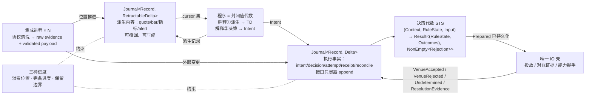
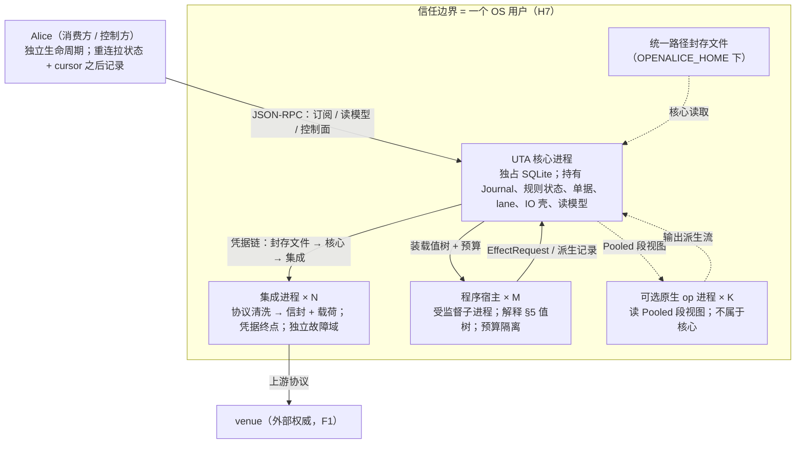
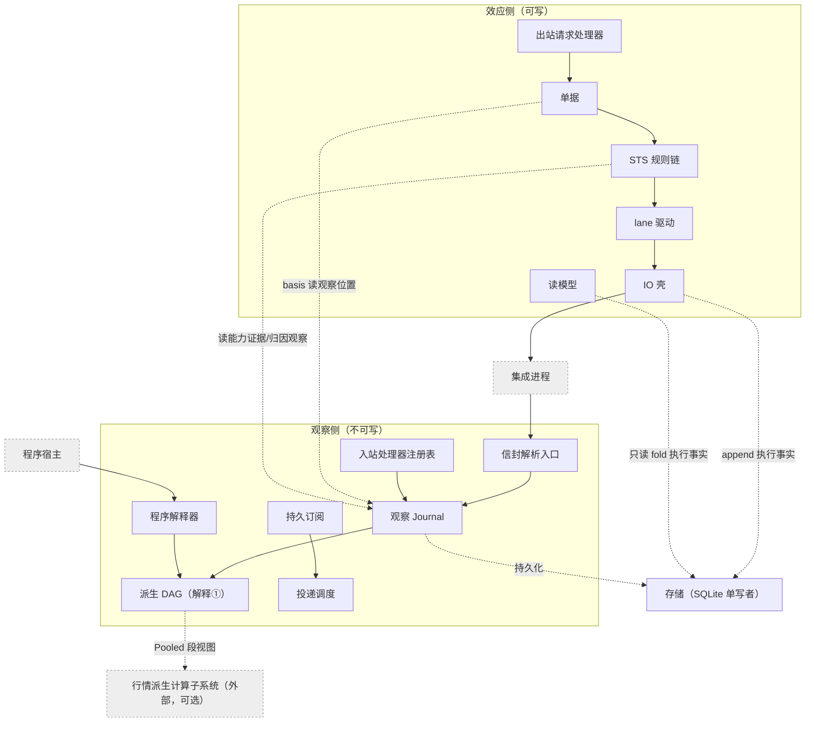

# UTA 设计

## 目录

- 0 定位
  - 0.1 决定什么
  - 0.2 读者、审批与维护
  - 0.3 状态
  - 0.4 非目标
  - 0.5 阅读约定
- 1 问题域与驱动
  - 1.1 域事实、既有机器事实、利益相关者要求与假设
  - 1.2 机器与域共享的现象
  - 1.3 需求
  - 1.4 质量场景
  - 1.5 约束与偏好
  - 1.6 调查结论摘录
  - 1.7 未核实清单
- 2 共同底层
  - 2.1 一句话与四步导览
  - 2.2 记录：信封、锚点、处理器、载荷；协议 = 注册单元；形状 vs 投影
  - 2.3 位置词汇：`StreamId`、`LogPosition`、三种进度、保留语义
  - 2.4 判断的底层：组合子值树与五个 fold
  - 2.5 两个类型宇宙与唯一边
- 3 观察宇宙
  - 3.1 抽象：`Journal`、撤回代数、压缩
  - 3.2 消费方式与 gap
  - 3.3 派生 DAG 与程序解释①
  - 3.4 抽象：读副作用与读模型
  - 3.5 `Pooled`：观察侧的可选扩展点
- 4 唯一边：效应侧引用观察侧
- 5 效应宇宙
  - 5.1 出口：`EffectRequest`、处理器、程序解释②
  - 5.2 单据 `Ticket`：意图形成期的抽象
  - 5.3 决策代数 STS 与 lane
  - 5.4 写边界：IO 壳、两阶段、`Undetermined`、决议、崩溃恢复
  - 5.5 写副作用 vs 读副作用、无锁定位
  - 5.6 基础类型
- 6 边界契约与归属
  - 6.1 进程、信任与生命周期
  - 6.2 模块指南
  - 6.3 核心↔集成契约
  - 6.4 核心↔Alice 契约
  - 6.5 核心↔程序宿主
  - 6.6 核心↔可选行情派生计算子系统（核心层自包含）
  - 6.7 持久化归属与配置/凭据归属
  - 6.8 Rust 映射
- 7 走查
  - 7.1 场景 trace
  - 7.2 崩溃矩阵
  - 7.3 卡点清单
- 8 评估
  - 8.1 替代方案对比表
  - 8.2 风险 / 敏感点 / 权衡点
  - 8.3 未决
  - 8.4 证伪条件
  - 8.5 验收标准
  - 8.6 明确不做
- 9 术语表
  - 9.1 规范词表
  - 9.2 五种关系，五种承载
  - 9.3 同名异义表
- 附录 A 研究与调查报告索引
- 附录 B 图索引

## 0 定位

### 0.1 决定什么

UTA 是 Alice 与多个外部交易来源之间的独立核心进程：它接收集成层清洗后的能力、观察与效应记录，向消费方提供一次性读和订阅，接收带身份与依据的意图，并把执行过程与外部结果保真地记录和关联。本文决定 UTA 的问题域与驱动（§1）、设计中心与两个类型宇宙（观察 | 效应，§2–§5）、进程与接口/归属边界（§6），并以走查与评估（§7–§8）验证这些决定；每个决定的证据与替代就近登记，证伪条件与验收项在 §8 汇总。

### 0.2 读者、审批与维护

- **读者：** 以后实现 UTA 的实现者。
- **审批者：** 无。C3 原话为“读者是以后实现uta的人，没有审批”。
- **维护者：** 范围与状态确认者；维护者确认不会把本文误读成实现承诺。

### 0.3 状态

**已定。** §2–§6 全部已定：记录与位置、组合子值树与五个 fold、两个类型宇宙与唯一边、单据/STS/IO 壳、进程与契约归属（程序宿主 = 受监督子进程、会话 epoch、Alice 操作集、配置文件契约）。依赖假设 H 的决定在 §8.4 有证伪条件。需要实测的量都是 §8.5 的验收项，不是设计未决；可选行情派生计算子系统的决定在 `hpc-derivation/design.md`，其验收标准在其 §10、证伪条件在其 §11，本文只拥有它的接口（§6.6）。

### 0.4 非目标

本设计的定位范围不包括：

- 不实现 UTA 或其集成；
- 不规定 crate 布局、文件布局或具体实现目录；
- 不承担 Alice 侧接入适配（包括旧 Alice 配置写入、重启触发和消费方迁移）；
- 不设计打包、发行和分发流程；
- 不重写 OpenAlice 中的旧 UTA、SDK、BFF、UI、connector 或其他旧代码。

这些边界来自 §6.1、§6.7 的进程与共享配置划分，以及 C1 原话（本轮只做设计，不做实现与打包）。设计层面的“明确不做”集中在 §8.6，不在这里展开。

### 0.5 阅读约定

标签含义如下：`[证据]` 是来源直接支持的事实或原话；`[设计]` 是在已有事实上的设计表达，必须紧跟理由；`[推断]` 表示由已列事实推出、但没有一手来源直接陈述的结论。

**图。** `design/diagrams/*.md` 是本文的图示视图（静态结构、状态机、假想运行时时序），每张图编号 `Dx.y` 并注明对照章节；本文相应章节以 `> 图：` 行指向它。图只画本文已定的内容，不是设计来源：正文改了图随之改，图上出现正文没有的东西即图错。总对照表在附录 B。

编号含义如下：`F` = 外部域事实，`O` = 既有机器事实，`S` = 利益相关者要求，`H` = 假设或威胁，`P` = 机器与域共享现象，`A` = 既有行为入口，`B` = 新增需求原话，`C` = 由事实推出的需求，`Q` = 质量场景。

状态词只使用 `已定`；依赖假设 H-n 的决定在 §8.4 给出证伪条件。会推翻决定的观测写在 §8.4，需要实测的量写在 §8.5；设计不登记待做实验。

## 1 问题域与驱动

### 1.1 域事实、既有机器事实、利益相关者要求与假设

#### F 外部域事实

|编号|事实|证据|
|---|---|---|
|F1|venue 是账户、持仓、订单、成交、价格的权威来源；本地任何记录都是对它的解释。|`docs/uta-live-testing.md:138` “Never trust the ledger over the venue”|
|F2|instrument 身份只在其 venue 内有意义；同一“东西”在不同 venue 是不同 instrument。|`packages/uta-protocol/src/types/broker.ts:615-621`（conId / CCXT symbol / ticker）；`:600-606`（CCXT 的 AAPL 是合成代币）|
|F3|instrument 之间有 venue 给出的派生关系（期权→标的、期货月份→品种）。|`broker.ts:507-513,190-223`|
|F4|instrument 会上市、退市、到期。|域常识；既有目录刷新是对此的响应（O5）。|
|F5|对外部写的结果可能不可判定：请求可能到达 venue 而调用方拿不到回执。|gRPC/tonic 明言 deadline 错误时写可能已完成（`investigation/rust-feasibility.md:175`）；venue 侧无回音是网络固有性质|
|F6|venue 的能力、限额、幂等/回读/续传语义按 venue × 操作种类变化，且不少条目官方未文档化。|`investigation/venue-capabilities.md:148-178` 矩阵与 unknown 列表|
|F7|venue 会限流；历史数据有 pacing。|`ccxt/exchanges/hyperliquid.spec.ts:95-99`（429）；IBKR pacing、Longbridge 500 symbol 上限（`venue-capabilities.md` sections 2 and 3）|
|F8|子账户 / 钱包是某些 venue 的结构。|`broker.ts:535-553`|
|F9|用户可在 venue 自己的 app 里下单、出入金；我们只能事后观察。|`broker.ts:578-586`|
|F10|订单从 listing 消失不等于终态（listing 可能滞后或不完整）。|`UnifiedTradingAccount.ts:853-877` 二次确认；Longbridge `client_request_id` 仅 10 分钟缓存（`venue-capabilities.md:156`）|
|F11|推送流有自己的时钟；venue 事件时间与本地收到时间不同源。|域常识；`src/domain/market-data/bars/types.ts:92` 明言 freshness “neither establishes measured feed latency”|

#### O 既有机器事实

本表和 F/H 表中的旧代码路径来自 OpenAlice 仓库 `mouriya-s-lab/OpenAlice` commit `d9583df0d264`；旧代码留在 OpenAlice，不迁入本仓库。调查报告记录的是源码可观察行为，不把它们写成新设计保证。

|编号|事实|证据|
|---|---|---|
|O1|六个 adapter 无一使用推送式市场数据；无一向 venue 发调用方幂等键。|`brokers/` grep `WebSocket\|subscribe\|watch*` 无匹配；`IbkrBroker.ts:837` snapshot；`ibkr/README.md:40-45`；幂等键 grep 无匹配|
|O2|写结果类型只有 `submitted\|filled\|rejected\|cancelled\|user-rejected`，无 unknown、无 principal。|`packages/uta-protocol/src/types/git.ts:56-77,93-102`|
|O3|push 先调 venue，再读状态、再追加提交、再清 staging；任何异常记为 `rejected`。|`TradingGit.ts:141-155,157-184`|
|O4|一个 `UTAConfig` = presetId + 凭据 + 可选子账户 + guards + keyless/readOnly/asVendor/editable/ephemeral 标志；tier 由 keyless/readOnly 推导。|`src/core/config.ts:442-487`；`UnifiedTradingAccount.ts:233-243`|
|O5|目录每 6h 刷新；快照按调度捕获；event log 只记 health/snapshot，不记 ledger commit。|`services/uta/src/main.ts:134-141`；`uta-manager.ts:61-76`；`src/core/event-log.ts:127-163`|
|O6|同账户写互斥是单个 `TradingGit` 实例内的布尔量；跨客户端（UI / AI / connector）无序列化定义。|`TradingGit.ts:64-80,242-248`|
|O7|Alice→UTA 是 HTTP JSON、无认证；“信任边界是 host”；只读拦截靠路径字符串匹配且漏 `/wallet/commit\|reject\|stage-*`。|`src/webui/routes/trading-proxy.ts:1-8,115-215,193-206`；`routes-trading.ts:453-535`|
|O8|改配置 / 换凭据 = Alice 写 flag → 整个 UTA 进程重启。|`UTAManagerSDK.ts:174-200`；`main.ts:8-10`|
|O9|持久化：ledger 是每账户一个 pretty JSON（每次提交整写）；快照 50 条一 chunk 的 JSONL + index（`version:1`）；event log JSONL；无 retention/compaction；配置有 migration 与 `_meta.json`；两个 Alpaca legacy id 共用一条回退路径。|`git-persistence.ts:12-47`；`snapshot/store.ts:1-85`；`src/core/config.ts:545-548`；`git-persistence.ts:18-39`|
|O10|消费方全部是请求/响应轮询：健康 1s、BFF 30s、connector 1.5s、UI 3–300s。|`investigation/alice-consumers.md:206`|
|O11|20 条已观察缺陷：所有权绕过、数量不校验、子账户竞态、unknown→rejected、投放后落盘窗口、成交字段丢失、状态压成 rejected、guard 绕过健康记账、冷却先记后发、重启丢 staging。|`investigation/existing-capabilities.md:254-277`|

#### S 利益相关者要求

|编号|要求|来源|
|---|---|---|
|S1–S7|分别等同于 B1–B7（见 §1.3.2）。|维护者原话，B1–B7|
|S8|每个决定（批准 / 否决 / 自动放行）事后能回答“谁、何时、依据什么”。|问题域关于效应关联的原话；既有缺口 O2|
|S9|运维者能改审核规则、装 / 卸本机程序、换一个集成的凭据、重启一个连接、看状态。|问题域角色要求；既有 O8 是当前实现方式|
|S10|Alice 现有消费面在新边界上仍可实现。|`investigation/alice-consumers.md:192-207`|
|S11|只读 / 策略门在多处边缘执行，需要 UTA 暴露调用方身份与账户用途。|`alice-consumers.md:204`|

#### H 假设 / 威胁模型

|编号|假设或威胁|依据|证伪 / 关闭事件|
|---|---|---|---|
|H1|对同一外部效果的重复投放不可接受（资金后果）。|域常识；S8 对效应关联可审计的要求|维护者明确接受“宁重复不漏单”的账户类别|
|H2|程序（AI 写的决策代码）不可信：会死循环、吃内存、超产意图、输出非法。|维护者“ai写不好scala”；S8 对安全关联的要求|—（威胁模型，不证伪）|
|H3|凭据封存文件由 Alice 写入 `OPENALICE_HOME` 统一路径，UTA 核心读取并传给对应集成进程；程序与消费方只见账户身份。|§6.7 的共享配置文件契约；`src/core/config.ts:704-787` 封存；`alice-consumers.md:213`|维护者把 owner 移到 UTA 或 OS secret broker|
|H4|同一 (账户, 子账户) 上的写需要一个全序；不同账户可并行。|F1 + F8：venue 侧顺序只能由我们发出的顺序决定|某 venue 文档保证并发写的确定性排序（未见）|
|H5|订阅的 owner 是 UTA 而非消费方：消费方断开后订阅仍有业务价值（程序在跑）。|S1/S3：程序在 UTA 内运行|维护者决定程序随消费方连接存亡|
|H6|决定有时效，过期未决 = 否决，不做补偿。|connector `ttlMs`（`delivery-manager.ts:271`）、Telegram 过期（`telegram-uta.ts:196-199`）是现有实例|维护者要求人类决定无过期，或过期后自动执行|
|H7|信任单位是 **OS 用户**：本机非本用户的进程不可信；本用户的进程视为用户本人；同机进程能连到 UTA 不等于有权发写——写权限来自认证得到的 principal × 策略 scope，不来自连接。|O7 现状无认证 + C1 独立进程使 IPC 成为正式边界；UDS 对端凭据 / 命名管道 ACL 的粒度都是用户|维护者要求同用户进程之间也互相隔离（则需能力令牌 / 管道句柄传递，§6.1 的升级路径）；或接受"host 即信任边界"|
|H8|Windows 是必须支持的运行目标。|§6.1 已确认；三 OS 目标为 macOS、Windows、Linux（旧基线 `README.md:32`；`docs/development-workflow.md:280,324`）|—|
|H9|程序状态需要跨 UTA 重启恢复（而非重启后从零重建）。|S3 alert/决策连续性；若不恢复则每次重启丢失指标暖机与程序 state|维护者接受重启后程序冷启动 + 历史回填|
|H10|同一用户状态根（`OPENALICE_HOME`）上同时只能有一个 UTA 核心实例持有单据与订阅表；孤儿实例（父进程死而子进程活）是真实威胁。|`scripts/guardian/shared.ts:271-276`：Windows 上 kill 只到 wrapper，孤儿 UTA 继续占端口使新实例无法绑定；用户状态根见 `existing-capabilities.md:239`|—（威胁模型）|

### 1.2 机器与域共享的现象

观察引用 = `LogPosition`（§2.3）：`StreamId = (source, stream, epoch)`、`LogPosition = (StreamId, Seq)`；位置集写作 `Set<LogPosition>`（同构于 `Map<StreamId, Seq>`）。

每个现象是一类带名字、方向和语义字段的记录；字段写语义而不是实现类型。`→机` = 域给机器；`机→` = 机器给域。所有记录共享不可变信封：记录身份、记录时间（本地墙钟 + 单调计数）、记录者 principal 或来源；下表不重复列。

|编号|现象|方向|语义字段|被哪些需求引用|
|---|---|---|---|---|
|P1|能力声明|集成→机|集成身份、venue、账户、按（操作种类 / 流种类）的 supported / unsupported、配额、每种写操作的 unknown 证据渠道（按调用方键回读 / open-order listing + venue 订单身份（含“缺席需二次确认”的间隔） / 成交或持仓对账 / 无），历史 bar 有无与 pacing、子账户有无、续传游标有无|C2、C8、A18、A19、Q6、Q13、Q15|
|P2|观察|集成→机；程序→机（派生）|来源（账户、公共 feed、或程序——程序输出的指标 / alert 是派生观察，与外部观察同一形状）、主体（instrument / 账户 / 子账户 / feed）、种类（quote / book / bar / clock / 余额 / 持仓 / 订单状态 / 成交 / 目录 / 连接状态 / 健康 / 汇率 / 派生）、venue 事件时间（可无）、venue 序号（可无）、venue 续传游标（可无）、本地收到时间、Seq、原始负载、质量标记；订单状态 / 成交观察带归因（某尝试 / 外部 / 未定）|B1–B5、A11–A17、Q1–Q3、Q16、Q18|
|P3|gap / 控制|机→程序/消费方|来源 gap（某范围断代：新 epoch 首条记录，含前一范围与其最后 Seq、原因 ∈ {start, disconnect, quota, ingress_overflow, credential_rotated, schema_change, backfill_incomplete, program_upgrade}）；投递 gap（某订阅对某范围的损失：gap id、from/to Seq、原因 ∈ {slow_consumer, compacted, conflated}，需显式确认；程序作为订阅消费者滞后被跳过的区间也是投递 gap）；状态通知（readiness backfilling/live、订阅挂起 / 恢复；非损失，不需确认，由订阅状态派生）|C6、Q11、Q12、Q14、Q28、Q31|
|P4|订阅需求 / 订阅状态|消费方/程序→机；机→集成|owner、选择器（来源 × instrument × 种类）、epoch、状态（待接纳 / 活 / 被拒 / 挂起）、拒绝原因、消费游标（该订阅已确认的最后 `LogPosition`；确认 = 消费方已处理，未确认区间可重复可见，§3.2）|B1、C5、Q9、Q13、Q14、Q23、Q31|
|P5|回填|机→集成；集成→机|范围、页 / 游标、结果、与实时流的边界、readiness|A19、Q14|
|P6|意图|程序/消费方→机|意图身份、principal、目标（账户、子账户、instrument）、操作种类（下单 / 改单 / 撤单 / 平仓）、参数、依据（`Set<LogPosition>`）、生产者（程序制品 hash + 版本 + 调用身份，或消费方会话）、过期|B7、C1、C3、A29–A35、Q5、Q7、Q17、Q19、Q25|
|P7|决定|决策者→机|所指意图、principal、裁决（批准 / 否决 / 过期 / 规则否决）、原因、依据、对待决集合版本的期望|S8、C3、A26–A28、Q7、Q9、Q10、Q19|
|P8|尝试|机→集成→venue|所指意图、尝试身份、venue 调用方键（能力允许时）、阶段（已预约未发 / 已发出 / 发出与否不可判定）及各阶段时间|C1、C2、Q1、Q2、Q5|
|P9|回执|venue→集成→机|所指尝试、venue 结果（原始 + 域词表映射）、venue 订单身份、成交明细|C1、A13、Q1、Q5、Q16|
|P10|对账|机↔集成；人→机|所指尝试、证据渠道、结论（found / absent / inconclusive），若人工则 principal|C2、Q3、Q6|
|P11|外部变更|集成→机；机→机|账户、观察到的订单 / 成交 / 余额变动的原始记录、归因结论（某本地尝试 / 外部 / 未定）及其证据|F9、A48、Q6、Q18|
|P12|程序|作者→机；机→消费方|程序制品身份（hash）、版本、输入声明（instrument 集合 × 消费方式）、预算、状态版本、状态、trap、alert|B3、B5、C4、Q4、Q8、Q25|
|P13|会话|消费方/集成↔机|对端、principal、授权范围（账户 × 操作种类）、deadline|S11、H7、Q19、Q29|
|P14|控制|运维者→机|principal、配置变更、凭据轮换、重启某集成、装 / 卸程序、请求快照；结果（生效 / 拒绝 + 原因）|S9、A06–A09、Q18、Q19、Q32|
|P15|快照 / 保留 / 迁移|机→机|快照身份、按存储类别的保留规则（观察日志可压缩到窗口；效应单据只追加不压缩，只做快照加速）、压缩点、格式版本、迁移结果|A36–A38、Q17、Q21、Q28|
|P16|健康 / readiness|机→消费方/运维者|按集成 / 账户：reach、tier、连续失败数、最后成功时间|A01–A02、A25、Q32|

### 1.3 需求

#### 1.3.1 既有行为 A

A 表按调查报告记录的真实入口（路由、SDK 方法、UI/CLI 调用或后台任务）逐条列出，编号 A01–A51 由本表分配。A40–A46 是模拟器集成的本地注入方法，不是 HTTP 路由；`/api/simulator/*`（A39）与这些方法的对应关系报告未记录，登记于 §1.7。

|编号|入口 / 既有行为|报告:行证据|核验状态|
|---|---|---|---|
|A01|health：健康探测与摘要状态。|`alice-consumers.md:129-133`、`:205-206`|已核实|
|A02|账户列表：`listUTAs` / `GET /api/trading/uta`，按 source 解析。|`alice-consumers.md:31`、`:68-69`|已核实|
|A03|equity：经理级账户权益读，并在组合面按账户聚合。|`alice-consumers.md:31`、`:72`|已核实|
|A04|search：合同搜索，支持 source 选择和多账户扇出。|`alice-consumers.md:31`、`:69`|已核实|
|A05|fx-rates：经理级 FX 读，供组合面换算。|`alice-consumers.md:31`、`:72`|已核实|
|A06|test-connection：测试连接入口。|`alice-consumers.md:137`、`:160`|已核实|
|A07|reconnect：请求受监督重启 / 重连，不在 SDK 内初始化。|`alice-consumers.md:29`、`:141`|已核实|
|A08|sync：按 source 执行同步，返回更新数；无更新不等同失败。|`alice-consumers.md:58`、`:93`|已核实|
|A09|simulate-price：独立的价格模拟效应入口。|`alice-consumers.md:58`、`:83`|已核实|
|A10|subaccounts：读取 `{subAccounts}`。|`alice-consumers.md:39`|已核实|
|A11|account：按可选 `subAccountId` 读取 `{account}`。|`alice-consumers.md:40`、`:71`|已核实|
|A12|positions：按可选 `subAccountId` 读取 `{positions}`。|`alice-consumers.md:41`、`:72`|已核实|
|A13|orders：按可选 id 列表读取 `{orders}`；空 id 列表省略查询。|`alice-consumers.md:42`、`:73`|已核实|
|A14|clock：读取 `{clock}`，可按 source 逐一返回。|`alice-consumers.md:47`、`:79`|已核实|
|A15|quote：按稳定 `aliceId` 或 contract shell 读 quote。|`alice-consumers.md:43`、`:77`|已核实|
|A16|option-contracts / option-chain：按期权合同请求 / 期权链请求读取（`POST /api/trading/uta/:id/contract/option-contracts`、`.../option-chain`）。|`alice-consumers.md:44-45`、`:74-75`|已核实|
|A17|book：按账户和结构化请求读取 order book。|`alice-consumers.md:46`、`:76`|已核实|
|A18|expand：按 `aliceId` 与 filters 返回 contracts 或 grid。|`alice-consumers.md:48`、`:78`|已核实|
|A19|historical：按 contract query 与 params 读取 historical bars；源码注释提示可能 404，不是运行观测。|`alice-consumers.md:49`、`existing-capabilities.md:229-235`|入口已核实，运行结果未核实|
|A20|details：按 contract query 读取 contract details。|`alice-consumers.md:51`、`:70`|已核实|
|A21|log：读取并按时间排序 wallet commits。|`alice-consumers.md:52`、`:80`|已核实|
|A22|order-history：按 source 读取有界 order history，默认 limit 50。|`alice-consumers.md:55`、`:91`|已核实；50 的来源为 SDK 默认值|
|A23|trade-history：按 source 读取有界 trade history，默认 limit 50。|`alice-consumers.md:56`、`:92`|已核实；50 的来源为 SDK 默认值|
|A24|show：按 hash 查找 commit；not-found 与传输失败区分。|`alice-consumers.md:53`、`:81`|已核实|
|A25|status：读取结构化 wallet status，供审批和效应路径门控。|`alice-consumers.md:54`、`:82`|已核实|
|A26|commit：提交 staged work；无 staged work 可跳过并返回元数据。|`alice-consumers.md:58`、`:88`|已核实|
|A27|reject：按 pending hash 拒绝，必要时先让 staged work 进入记录。|`alice-consumers.md:58`、`:90`|已核实|
|A28|push：按 pending hash 投放；策略关闭时返回人工审批状态。|`alice-consumers.md:58`、`:89`|已核实|
|A29|stage-place：stage place-order。|`alice-consumers.md:58`、`:84`|已核实|
|A30|stage-modify：stage modify-order。|`alice-consumers.md:58`、`:85`|已核实|
|A31|stage-close：stage close-position。|`alice-consumers.md:58`、`:86`|已核实|
|A32|stage-cancel：stage cancel-order。|`alice-consumers.md:58`、`:87`|已核实|
|A33|one-shot place：UI 下单对话框的一次性 place 入口，服务端为 stage→同步 commit→异步 push 的便利包装，按阶段标注失败。|`existing-capabilities.md:78`；`alice-consumers.md:162`|已核实|
|A34|one-shot close：UI 下单对话框的一次性 close 入口，同一包装。|`existing-capabilities.md:78`；`alice-consumers.md:162`|已核实|
|A35|modify / cancel 无 one-shot 入口：AI 工具与 CLI 的 modify/cancel 走 stage→commit→push（A30/A32 + A26/A28）。|`alice-consumers.md:184`、`:202`|已核实|
|A36|快照读取：UI 详情页每 60 s 轮询快照；AI snapshot 工具按 `asOf` 取最新快照并返回新鲜度警告。|`alice-consumers.md:121`、`:159`|已核实|
|A37|快照捕获：触发为 scheduled / post-push / post-reject / manual；构建时 best-effort `sync` 后读账户、持仓、待决订单。|`existing-capabilities.md:182-184`|已核实|
|A38|快照持久化：每账户 `snapshots/index.json` + `chunk-NNNN.jsonl`，每 chunk 50 条；index 经同目录临时文件 + rename 写入；读取按 chunk 由新到旧。|`existing-capabilities.md:189`|已核实|
|A39|`/api/simulator/*` 路由族：BFF 直通到 UTA；只读模式的 mutation matcher 把 `/api/simulator`、`/simulator` 前缀视为 venue 写。|`alice-consumers.md:7`、`:131`|已核实|
|A40|模拟器 `setMarkPrice`：设置标记价并自动撮合挂单。|`venue-capabilities.md:141-142`（`MockBroker.ts:546-755`）|已核实|
|A41|模拟器 `tickPrice`：推进一笔价格 tick。|同上|已核实|
|A42|模拟器 `fillOrder`：手动成交一笔挂单。|同上|已核实|
|A43|模拟器 `cancelPendingOrder`：撤销一笔挂单。|同上|已核实|
|A44|模拟器 `externalDeposit`：注入外部存款。|同上|已核实|
|A45|模拟器 `externalWithdraw`：注入外部取款。|同上|已核实|
|A46|模拟器 `externalTrade`：注入外部成交（F9 外部变更的模拟入口）。|同上|已核实|
|A47|CLI `alice-uta` simulation price-change：经 Alice gateway 映射到 A09 同一工具。|`alice-consumers.md:184`|已核实|
|A48|后台 poller：健康账户上按周期进行外部订单观察和同步，账户间失败隔离。|`existing-capabilities.md:121-137`|已核实|
|A49|快照调度：scheduled / post-push / post-reject / manual 触发，按配置周期执行。|`existing-capabilities.md:178-190`|已核实|
|A50|catalog 刷新：presets / engine pack catalog 的加载与校验。|`existing-capabilities.md:207-227`|已核实|
|A51|ephemeral purge：启动时删除 ephemeral UTA 的 trading 目录和配置记录。|`existing-capabilities.md:237-245`|已核实|

#### 1.3.2 新增需求 B

以下原话逐字保留；现象列把每条需求接到 §1.2 的共享现象。

|编号|需求|原话|现象|
|---|---|---|---|
|B1|实时 K 线订阅、秒级清洗、每 instrument 大量增量指标、多核。|“UTA是做交易数据的，只要有实时K线数据要订阅这一个场景，秒级的K线节点清洗，巨型object装载一堆指标是家常便饭，而UTA的核心职责是订阅后分发effect，纯单线程做这种事情并不好考虑”|P2、P4、P12|
|B2|多渠道多资产同时订阅，程序用全部渠道最新状态判断。|“我在渠道A订阅了十年短债，渠道B订阅了hl的pre ipo代币，渠道C上下了一旦，等待某个指标满足后买一笔SPY500期权，现在ai想要指标尽可能用上所有渠道的信息，因为市场是流动的，你很难写到了多少价格以后买，何况期权的价格还是，正股波动到了什么价格去买期权同时计算gamma”|P2、P12|
|B3|TradingView 式可组合：自造指标、alert 回调、可编程决策；不接受每 bar 全量重跑。|“最好的参照物是tradingview，实际上如果能逆向tradingview则uta没有存在的意义，通过自造指标serverless，alert是实质上的事件回调，而pinescript同等于一个能编程的dsl，这样你想把什么组合就把什么组合，而uta现在只是要求effect抽象后能安全的互相影响，tradingview式的做法需要巨大的运行时成本，本质上因为挂靠的是k线，只要k线每有一条新数据，则pinescript中编译优化后的产物就运行一次”|P12|
|B4|衍生品是有自己实时数据的 instrument，标的是它的输入；跨 instrument 观察是常态。|“不应该只把期权看作指令集合，期权有自己额外的实时数据，只不过他要把正股当成自己的一部分，而，正常做交易这才是常态，不做短线而做市场波动，观察CRWV同时也看NVDA是再正常不过的事情，那假如加上pre ipo的openai则更加正常，难道这种东西不存在指令吗，最终难道你要组合数据吗”|P2、P12|
|B5|不对齐时间；消费有序与否由程序声明。|“时间不应该要求对齐，而是先后顺序一致”；“节点顺序是否要保证先后顺序这事根本不一定，而依赖你的观察组合怎么写，如果是运算式的那是await消费而不是所谓的指令谁先谁后，如果是观察在同一时刻是否有效追求的是观察窗口的延迟范围有多大而不是谁先来谁后来，消费的时候是否要有序那是程序的事情”|P2、P4、P12|
|B6|核心不处理协议；集成层洗完送内部协议。|“uta本身非常像反向代理，uta的核心不处理协议怎么交互，协议交互是集成层自己洗过了然后送到uta，uta然后再直接消费自己内部尽可能统一但是有扩展性的协议”|P1、P2、P8、P9|
|B7|效应：副作用怎么消费、谁和谁能关联、抽象怎么做。|“这个设计并没有回答，不管有没有wasm，副作用怎么消费，谁和谁能关联在一块，抽象怎么做”|P6、P7、P8、P13|

#### 1.3.3 推出的需求 C

|编号|前提|需求|不保证|关闭事件|
|---|---|---|---|---|
|C1|F5 + H1|意图在任何尝试发出之前已持久化；发出后无回执的尝试进入 unknown；unknown 不得自动产生新尝试。|不保证 venue 侧只执行一次（无键的 venue 做不到）；只保证 UTA 不主动重复。|—（不变量）|
|C2|F6 + F10|unknown 的收敛按（venue，操作种类）使用集成在 P1 声明的证据渠道：按键回读、open-order listing + venue 订单身份、成交 / 持仓对账；渠道结论 inconclusive 或无渠道 → 停在人工，带 principal 的 P10 才能关闭。|不保证收敛时限。|每个集成上线时其 P1 声明完整。|
|C3|S8 + H6|每个 P7 带 principal 与依据；每个 P6 带过期；过期未决 = 否决记录，不补偿。|不保证 principal 的真实性（那是 C11）。|H6 被证伪。|
|C4|H2|一个程序的 CPU / 内存 / 意图速率 / 状态大小有预算；超预算被隔离并报告；其他程序、账户、核心不受影响。|不保证被隔离程序的 state 可用。|—|
|C5|H5|订阅（P4）与程序（P12）的生命周期由 UTA 拥有，与消费方连接无关；消费方重连拿到当前状态。|不保证重连期间发生的推送逐条补发（见 C6）。|H5 被证伪。|
|C6|F11 + F6（无通用续传）|断线、配额、慢消费者、压缩过期造成的不连续必须以 P3 显式标记；有 venue 游标时可续传；无游标时不伪造连续。|不保证缺失数据可回填（能力决定）。|—（不变量）|
|C7|H3 + C4|凭据只经过“统一路径封存文件 → UTA 核心 → 该集成进程”注入链；程序与消费方只见账户身份。|—|H3 被证伪。|
|C8|O1（既有事实）|订阅流与幂等键对每个集成都是新写的能力；设计不能假设复用现有 adapter 的任何行为。|—|—（实施前提，不是域需求）|
|C9|F2 + O11（所有权绕过缺陷）|意图的目标 instrument 必须属于目标账户（由该账户的集成确认），否则在任何 venue 调用前否决。|—|—（不变量）|
|C10|O11（数量校验与子账户竞态缺陷）|意图参数在创建时校验：数量 / 名义有限且为正；目标子账户在集成已声明子账户能力且已枚举后才可指定，未枚举前拒绝写。|—|—（不变量）|
|C11|H7 + S11|每个 P13 会话绑定一个经传输无关机制认证的 principal；写类操作按（principal, 账户, 操作种类）授权；P7 对待决集合版本的期望不匹配 → 冲突，不执行。|不保证传输层本身的机密性（本机）。|H7 被证伪。|
|C12|O11（guard 健康记账与冷却时序缺陷） + H1|自动规则（guard）的读走同一健康记账；读失败或不可判定 = 规则否决（fail-closed，记 P7 规则否决 + 原因），不放行；规则的副作用（冷却计时）只在尝试实际发出后记。|—|—（不变量）|
|C13|O11（成交字段丢失与状态压扁缺陷）|P9 原始负载完整保留；状态映射到有限域词表（至少 accepted / partially_filled / filled / cancelled / rejected / expired / unknown），映射表按 venue 列举输入枚举，无“其他 → rejected”。|—|—（不变量）|
|C14|O9 + H9|持久记录带格式版本；升级只前进；迁移失败拒绝启动而非部分迁移；程序状态带状态版本，不兼容时显式重置而非静默丢失。|—|—（不变量）|

### 1.4 质量场景

每条场景六要素为：stimulus source（刺激源）、stimulus（刺激）、artifact（构件）、environment（环境）、response（响应）、response measure（响应度量）。优先级按业务重要性 × 架构风险：高表示资金安全、身份/权限或数据连续性直接受影响；中表示主要消费能力或恢复能力；低表示可隔离的附加能力。没有一手阈值时，响应度量写可观察项，由 §8.5 的验收项或子系统验收标准（`hpc-derivation/design.md §10`）实测。

|ID|场景|stimulus source|stimulus|artifact|environment|response|response measure|来源|优先级|
|---|---|---|---|---|---|---|---|---|---|
|Q1|正常下单闭环|程序/AI|账户 X 下一笔意图；venue 依次产生受理、部分成交、成交|P6–P9 记录与订阅|集成在线、能力已声明|按顺序保留回执，带 venue 原生身份和成交字段，并形成最终成交状态|订阅者收到三张回执；字段与 fixture venue 一致；最终读模型为成交|F1；C1|高|
|Q2|SendBarrier 后崩溃与脑裂|核心进程、旧集成实例|SendBarrier 已持久化，核心在回执前 kill -9；旧实例可能迟到调用|P8 尝试、SendBarrier、P9 回执|核心重启并建立新集成会话|该尝试进入 Undetermined；不再给同一尝试新的 SendBarrier；带可关联身份的迟到回执可收敛，否则进入对账|fixture venue 调用记录不超过 1；该意图恰有一条 SendBarrier 记录；无第二次下单|F5；H1；C1|高|
|Q3|Undetermined 收敛|核心恢复器|分别提供按键回读、listing+身份、无渠道三种能力|P10 对账与 ResolutionEvidence|Q2 之后，渠道能力按 P1 声明|查到则补回执；listing 不能证明未递或无渠道则停人工；人工凭证带 principal|三种环境的末态可枚举；人工态只能由带身份凭证关闭|F6、F10；C2|高|
|Q4|Prepared 未发前崩溃|核心进程、集成|Prepared 已持久化而 SendBarrier 尚未持久化时崩溃|P6、Prepared、P8|核心重启，集成未收到 SendBarrier|集成未调用 venue；意图回到待递或按策略过期，不误升为 Undetermined|fixture venue 调用数为 0；不存在 SendBarrier 记录|C1|高|
|Q5|回执保真与未列举状态|集成|部分成交后成交；或发送 venue 专有状态|P9 回执与状态映射|同一尝试的回执顺序可能迟到|保留原始负载和原生身份；专有状态保留原值；未列举状态标 unknown 并告警，不映射为 rejected|累计成交量等于回执累计字段；映射表不存在“其他→rejected”|C13|高|
|Q6|外部变更归因|venue 推送|出现对不上任何本地尝试的成交或余额变动|P11 外部变更|存在 pending 意图或无对应意图|记录为外部变更，不归因到 pending 意图；后续证据可引用原记录|外部变更记录存在且无意图引用；订阅者收到该记录|F9；P11|高|
|Q7|同 lane 并发与队首阻塞|UI、AI|100 ms 内各提交一笔到同一 `WriteLaneKey`；第一笔变为 Undetermined|P6–P8、lane|同账户/子账户；另一账户同时有写|同 lane 按提交顺序递送；队首 Undetermined 时后续等待并告警；其他账户不等待|fixture 调用不重叠；Undetermined 期间没有第二次调用|H4|高|
|Q8|校验与授权拒绝|消费方|instrument 属他账户、数量非法、只读账户下单三种输入|P6、P7、C11 安全记录|意图创建前|创建期记录意图与否决；权限拒绝另记安全事件；不触碰 venue|没有 venue 调用；三对意图/否决；有安全事件|C9、C10、C11|高|
|Q9|人工审批与过期|人工 principal、connector|策略要求人工；审批带版本；另一笔超过过期时间|P7 决定、P6 过期|待决集合并发变化|批准带身份、时间、依据、期望版本；过期形成终态决定，不递送|读模型可回答谁、何时、依据什么；过期意图无递送|C3；H6|高|
|Q10|决定版本冲突|两个 principal|同一意图以同一期望版本作两次决定|P7 决定|同一待决集合版本|第二次返回冲突，不执行、不改状态|冲突记录存在；意图状态不变|C11|高|
|Q11|行情断线无续传|集成|订阅 200 个 instrument 的 tick；断线 30 s 后重连；venue 无游标|P2 流、P3 来源 gap|无通用续传能力|断线前后分代；新 epoch 首条记录显式标前一段末 Seq 与原因|订阅者收到 gap；不存在静默跳过|F11、C6|高|
|Q12|慢消费者投递 gap|三个订阅者|其中一个不确认投递|P3 投递 gap、P4 游标|同一组流，慢消费者缓冲耗尽|慢者停投并收到 gap；其他订阅者继续|两快者的可观测投递不因慢者停止；慢者有 gap 记录|C6|高|
|Q13|配额拒绝|消费方|第二个订阅使一个 venue 的 symbol 总数超过 500|P1 能力、P4 订阅|venue 声明 500 symbol 上限|订阅时 typed 拒绝并说明配额；既有订阅不受影响|拒绝可枚举；集成没有收到超限订阅|F7；P1|中|
|Q14|历史回填与实时边界|消费方、集成|订阅带回填 500 根；venue 有 pacing；中途断线|P5 回填、P2 流、P3 readiness|回填与实时并行边界|按 pacing 分页；回填/实时边界去重；readiness 从 backfilling 到 live；断线后新 epoch 按声明窗口回填|就绪切换可观察且只发生一次；同 epoch 无重复 bar|F7；P5|中|
|Q15|一次性读 fan-out 部分失败|消费方|无 source 读持仓，3 个账户中 1 个 venue 不可用|一次性读、P10 对账响应|多账户 fan-out，有 deadline|其他账户独立返回；不可用账户 typed 失败；持仓响应可留作对账|每账户结果独立；不可用项在 deadline 内可见|S10|中|
|Q16|能力不支持|消费方|向声明无历史 bar 的集成请求历史数据|P1 能力、一次性读|能力明确 unsupported|返回 typed Unsupported，不返回看似成功的空数组|响应变体可枚举，unsupported 与空结果可区分|F6；C2|中|
|Q17|核心 append 中途崩溃|核心进程|追加记录或替换订阅表中途 kill -9|P2/P3/P4 持久状态|崩溃恢复|重启只恢复完整记录、订阅和游标；半写状态不可见|无半条记录；订阅者可按游标恢复|O9；C14|高|
|Q18|配置热变更 / 换凭据|运维者|改策略；或只更换一个集成的凭据|P14 控制、P1/P2/P13|其他集成继续运行|下一笔意图使用新策略；换凭据只使目标集成重建并显式标 gap，其他流保持连续|其他集成的 Seq 连续；目标集成会话重建与原因可见|S9；O8；H5|中|
|Q19|会话身份与未授权控制|攻击者或未授权进程|伪造请求体身份、未认证连接、已认证但无 scope 的控制请求|P13 会话、P14 控制、P7 安全记录|同机跨进程边界|以认证 principal 判定；拒绝未认证与越权；不产生写或配置副作用|无 venue 调用、无配置变更；安全事件可读|H7；C11|高|
|Q20|双实例|第二个核心进程|在同一用户状态根启动第二实例|单实例锁、fence、P15|已有实例存活；也测试已有实例死亡后接管|第二实例专用退出并报告；持有者死亡后新实例按 fence 接管|退出码/诊断可观测；接管不会产生双写|H10|高|
|Q21|格式升级|新旧版本核心|N+1 读 N；反向读取；迁移中断电|P15 格式版本与迁移|持久文件在升级边界|支持的升级后等价；高版本拒绝；断电后二者之一完整，不出现第三态|退出码或记录说明版本结果；无部分迁移|O9；C14|中|
|Q22|秒级 K 线与大量指标|维护者需求|实时 K 线订阅、秒级清洗、每 instrument 大量增量指标、多核分发|P2、P4、P12|行情持续到达，程序声明输入|允许增量派生和分发，不把每 bar 全量重跑写成前提|处理不落后于 bar 周期：秒级 bar 的清洗 + 增量指标在下一根到达前完成，积压不增长；分发不阻塞清洗 [推断：B1"秒级"]；负载形状取 Q24 沟通场景规模，验收 §8.5 #19|B1|中|
|Q23|多渠道多资产判断|维护者需求|同时订阅多渠道、多 instrument；程序以全部渠道最新状态判断|P2、P4、P12|来源时钟不同，消费声明组合方式|按输入声明提供跨 instrument 观察；不隐含全局时间对齐|程序输入声明包含来源与消费方式；跨源无隐式对齐|B2、B4、B5|中|
|Q24|完整窗口原生计算|维护者需求|约 1500 条流选 15 条，覆盖 24 h 逐秒数据，指标阈值后唤醒 AI|P2、P5、P12 与可选 Pooled|沟通场景，非容量指标|能表达完整窗口与选择条件，把原生计算输出作为普通派生观察|单次触发到输出派生流 ≤ 50 ms（子系统内部预算，hpc-derivation/design.md §2.2，验收其 §10 #7/#10）；1500/15/24 h 仅为沟通场景，不作容量上限|hpc-derivation/design.md §1.1、§2.2；B3|中|
|Q25|程序超预算隔离|程序运行时|程序死循环、超内存或超意图速率|P12 程序、P6 意图|不可信程序与其他程序并存|超预算程序隔离并报告；其他程序、账户、核心继续|超出装载时声明的预算（P12：CPU / 内存 / 意图速率 / 状态大小）后被隔离并产出失败观察；其他程序、账户、核心的响应度量不变；预算值是装载声明的参数，不是设计常量|H2；C4|高|
|Q26|单据并发编辑|第二个 principal|第二个 principal 对已有负责人的单据 `Revise`|Ticket、P6/P7|已有负责人且版本已变化|拒绝共同编辑或返回冲突，保留负责人和版本记录|冲突结果、负责人、版本均可读|§5.2|高|
|Q27|Replace 无原子能力|消费方|venue 无 cancel/replace 原子操作时改单|P6–P10、能力声明|目标意图可能已执行或仍 pending|不把改单伪装为原子动作；按能力与意图状态返回可区分结果|读模型显示原操作与后续操作的关联及未决状态；撤单腿 `Undetermined` 期间新单腿不发；`deadline`（H6）到期后新单腿永不发出并记过期记录，不补偿|§5.2；F6|高|
|Q28|保留边界推进|维护者或核心|retention 推进时仍有单据或程序引用的位置|P15、LogPosition 引用、程序输入|观察记录可压缩，效应单据只追加|不删除仍被引用的位置；必要时拒绝推进或先处理引用|压缩后所有仍引用的 `LogPosition` 均在保留边界内|P15；§2.3；§8.5 #4|高|
|Q29|Alice 断连重连|Alice 客户端|Alice 崩溃或重启，UTA 独立存活；重连后请求当前状态和 cursor 之后记录|P13 会话、P4 订阅、P3 gap|UTA 订阅和程序仍由 UTA 拥有|重连可取得当前状态；断连期间损失显式标 gap，不伪造逐条补发|当前状态、cursor 后记录和 gap 原因可读|H5；C5；§6.1|中|
|Q30|可选子系统扇出端到端|核心与可选子系统|1 个输入经 K 个 op 到 N 个消费者|P2/P12、Pooled|子系统已装载且满足前置条件|输出以普通派生流进入下游；不满足条件时 Pooled 程序拒绝而核心其余程序不受影响|端到端结果可测；子系统内部预算分项见 hpc-derivation/design.md §2.2，验收其 §10 #7|hpc-derivation/design.md §2.2、§10 #7|中|
|Q31|消费方式声明|程序作者|同一组流分别以 await-all、ordered、latest 消费|P4、P12、P3|来源时间不同且存在 gap/窗口|按程序声明解释，不强加全局对齐；latest 的合并引用窗口界或 conflated gap|每次合并可追溯到声明窗口或 gap|B5；C6；§8.5|中|
|Q32|健康与 readiness 可见|运维者/消费方|查询集成 reach、tier、连续失败和最后成功时间|P16、P14|集成在线、断开和恢复各状态|返回结构化健康/readiness，供读写门和运维观察|字段 reach、tier、连续失败数、最后成功时间可读|P16；S9|中|

### 1.5 约束与偏好

#### C1：约束

> “UTA本次是完全重写，且必须是独立进程，而且不考虑打包问题，UTA应该是独立二进制被调用，跨进程通讯应该序列化文本或者跨语言的rpc”

**约束（有组织边界理由）：** UTA 必须独立进程、独立二进制，跨进程使用序列化文本或跨语言 RPC；不把打包问题带入本轮设计。它排除了把 UTA 嵌入 Alice、依赖 Alice 父进程生命周期、或用未定义的进程内对象作为边界。

#### C2：偏好

> “现在是偏向rust，实在不行才有ts，其他一概不考虑”；“rust最大的不行根本不需要调查，而是rust表达不了effect system，那么，在rust如何保持优雅抽象”

**偏好：** 优先 Rust；只有具体技术点证明 Rust 不可行时才考虑 TypeScript，其他语言不在范围。它排除了没有具体不可行证据就增加语言的方案，但不把语言偏好写成域事实。

#### C3：偏好

> “读者是以后实现uta的人，没有审批”

**偏好：** 面向未来实现者，不设置审批角色。它排除了把本文当作审批流程或审批记录的阅读路径；范围与状态仍由维护者确认。

另有必须支持的运行目标：Windows（H8）；调查与工程材料将 macOS、Windows、Linux 作为三 OS 目标。Windows 传输选择不得假设 macOS/Linux 的 UDS 直接适用，具体比较由 §6.1 处理。

### 1.6 调查结论摘录

#### 1.6.1 Venue 原生能力

|Venue|推送流|调用方幂等键|按键回读|续传游标|
|---|---|---|---|---|
|Alpaca|有|`client_order_id`（重复被拒有文档，保留期未知）|有 `/v2/orders:by_client_order_id`|无|
|IBKR TWS|有|无（`orderRef` 仅为用户引用）|无|无|
|Longbridge|有|`client_request_id`（10 分钟缓存）|无（详情需 `order_id`）|无|
|Binance|有|`newClientOrderId`（只保证挂单期间唯一）|有 `origClientOrderId`|无|
|Bybit|有|`orderLinkId`（要求唯一，重复行为未知）|有|无|
|OKX|有|`clOrdId`（挂单期唯一，终态后可复用）|有|无|
|Bitget Classic|有|`clientOid`（重复报错有文档）|有|无|
|Hyperliquid|有|`cloid` 字段存在，重复幂等未被文档保证|有 `orderStatus oid=cloid`|无|
|LeverUp|无|无|无|无|
|Mock|无|无|无|无|

来源：`investigation/venue-capabilities.md:148-163`。

调查到的十条产品路径里没有一条有已证明的通用续传契约，因此无游标到显式 gap 是常态路径，游标续传是可选能力。幂等键的保留期和重复语义大多未知，所以证据渠道必须逐 venue × 操作种类声明。配额是能力的一部分（Longbridge 500 symbol、IBKR pacing）。官方 URL 尚未在本环境重开，登记于 §1.7。

#### 1.6.2 Rust 生态可行性

未证明任何 Rust 不可行点；Rust 偏好未触发语言例外。tonic 0.14.6 在 Windows 返回 `uds connections are not allowed on windows`（`investigation/rust-feasibility.md:165`），因此 Windows 传输作为 §6.1 的 OS 选择问题。Wasmtime 48.0.2 没有 live `Store` 快照 / 恢复 API；Wizer 只快照初始化，`Module::serialize` 只保存编译产物（`investigation/rust-feasibility.md:133-139`），这是 Wasm 不选为初始程序宿主的依据之一（§6.5：宿主 = 受监督子进程）。fuel 是确定性指令预算，epoch 不确定，两者都管不住阻塞的 host 调用；Component Model async ABI "very incomplete"；tokio `broadcast` 会丢弃落后者；okaywal 自述不宜生产；gRPC 单流有序、流间独立；`rust_decimal` scale ≤ 28（同报告 `:117-119,131,189,215,300`）。吞吐、延迟、崩溃注入文件系统矩阵和 Windows 传输实测尚未完成。

#### 1.6.3 既有缺陷

`existing-capabilities.md:254-277` 的 20 条源码发现已经并入 O11；其中所有权、数量、子账户、unknown、投放后落盘、成交字段、状态映射、guard 和重启状态问题分别形成 C9–C14 与 Q8、Q19、Q20。它们是既有实现证据，不是新实现已满足的保证。
FX 回退链和模拟器属于既有读来源/集成行为；新边界中的能力声明、操作集合和错误映射由 §6.3 表达，不从旧实现路径推出新的核心结构。

#### 1.6.4 Alice 侧消费需要

`alice-consumers.md:192-207` 的来源限定 instrument 身份、显式 source 解析、统一可扩展读面、部分失败、能力与质量元数据、无隐式跨源对齐、分阶段效应、hash/conflict 安全、多边缘只读策略、独立生命周期、有界轮询和跨语言序列化边界，分别形成 S10/S11、P13、C11、A01–A51 与 Q1–Q32 的追溯链。SDK 缺口（`getCapabilities` 空、`getPendingOrderIds` 空、historical 可能 404、BFF 变更匹配表漏路径，报告 `:221-227`）说明新边界的能力和变更类操作需由 §6.3 的契约结构表达，而不能从旧路径字符串推定。

### 1.7 未核实清单

- Venue 官方 URL 尚未逐条重开；表格中保留的能力、重复语义和 10 分钟缓存仍需按 `venue-capabilities.md:167` 重新核实。
- UTA 服务端真实路由、运行时错误体、实际状态转移、超时和 retry 语义未从运行环境核实；SDK 路径是调用方证据，不是服务端实现证据。
- `/api/simulator/*`（A39）到模拟器注入方法（A40–A46）的路由级对应关系未从调查报告取得；报告只记录了路由族与方法各自的存在。
- 质量场景的容量数字（Q22、Q24、Q30）来自沟通场景与内部预算假设，不是产品 SLO；核心侧以 §8.5 #19 验收，子系统侧以 hpc-derivation/design.md §10 #7/#10 验收。

## 2 共同底层

观察宇宙（§3）与效应宇宙（§5）都建立在同一套记录、位置与判断机制上。本章定义这套共同底层：一句话导览（§2.1）、记录如何进出（§2.2）、位置与进度词汇（§2.3）、判断的组合子值树（§2.4）、以及两个类型宇宙与它们之间唯一的边（§2.5）。本章不定义任一宇宙独有的机制。

### 2.1 一句话与四步导览

**UTA 记录看到了什么，计算可以做什么，受控地执行一次，再用证据确认发生了什么。**

订单、持仓、审批流、策略行为均为这四步的组合结果，而非核心实体。核心中不存在任何同时承载 provider 字段与业务状态的对象。[证据：fp-00 §1 五十三案例无一以大对象为中心；fp-02 命题 12]

四步各对应一个机制，机制之间仅通过位置、键与日志记录关联：

| 步 | 机制 | 章节 |
|---|---|---|
| 看到了什么 | 载体 `Journal<Record, Delta>`，派生侧可撤回 | §2.3 §3 |
| 可以做什么 | 程序 = 封闭值代数，两种解释；出口是 effect 请求 | §3.3 §5.1 |
| 受控执行一次 | 单据 → 决策代数 STS → 唯一 IO 壳 | §5.2 §5.3 §5.4 |
| 证据确认发生了什么 | `Undetermined` 的证据 gate + 恢复协议 | §5.4 |



四步口号是全文的开篇导览与场景视图骨架（走查见 §7），不是章节主线：主线是两个类型宇宙与它们之间唯一的边（§2.5）。

### 2.2 记录：信封、锚点、处理器、载荷；协议 = 注册单元；形状 vs 投影

> 图：D2.1（`design/diagrams/02-record-model.md`）。

#### 抽象：信封与反向代理

**是什么。** UTA 是一个反向代理：它可以处理经过的协议的任何部分，但**只看自己代数要消费的字段**，其余原封不动打包转发。一个字段若没有任何进度/lane/规则/保留/钩子去读它，它就必须是不透明载荷。**信封之于 UTA，如主键之于数据库**：数据库只坚持看主键，其余列它不解释；UTA 只坚持看信封，载荷它不解释。集成输出因此分两部分：

- **信封字段**——锚点与已注册处理器要读的字段，入口解析并验证（parse-don't-validate，隐藏构造器）。
- **载荷字节**——原封不动直通，永远保留（C13）。

被核心读的信封字段分两类，性质不同：

- **锚点**：没有它构不成链路（如上游端点与端口）。闭合、必填、入口即验；缺锚点不是规则否决（那是 fail-closed），是**畸形记录**，在集成边界拒绝。锚点只服务路由与关联（§9），不服务业务判断；锚点集合按链路种类不同，像 port 取决于 scheme。
- **处理器**："header 里出现了什么，则做什么"。非锚点字段的语义完全由注册的处理器定义：处理器 = (触发条件：某字段存在；`required_inputs`：读哪些字段（§2.4 定义）；效果：append 什么记录或触发什么动作)。字段不存在 → 处理器不触发，**不是错误**。注册表按 §2.5 两侧分开：观察侧处理器只产生派生记录与进度，效应侧处理器才涉及 lane / 决议 / 规则。

**从哪推出。** 现实中不可能拿自造的假账户去交易，只能用上游真账户；账户的 schema 完全由上游协议决定——有的券商只有账号，有的有子账号，有的跨国家账号通用但另有独立账户概念。这些结构不可能在程序里预先构建，任何预先构建都是把某一家券商的结构冒充为通用模型。因此核心永远不知道账户长什么样，但知道它的投影（下文"形状 vs 投影"的 `WriteScope`，契约见 §6.3）。这条 litmus 本身就是防"业务对齐大对象"的机制：核心没有 30 条规则去读 30 个字段，`Order { 30 个字段 }` 就写不出来；核心没有地方消费账户结构，`Account` 就写不出来。[证据：fp-00 §1；fp-04 命题 15/16；域 F2/F6]

**不变量。**
- "核心看哪些字段"是推导出来的：`锚点 ∪ ⋃ handler.required_inputs`；没有处理器声明要读的字段自动是载荷。
- 加处理器不改锚点：新 venue 带来的新字段只需注册处理器；新增 `OperationKind` 改实现该协议的所有集成，因为 `OperationKind` 是锚点。
- 锚点缺失 = 畸形记录（入口拒绝）；处理器字段缺失 = 不触发（不是错误）。二者的失败面互不混淆。
- 核心与集成是对称的无知：核心不知道账户长什么样，集成不知道规则长什么样，信封是两者唯一的共同语言；由谁保证：入口解析（集成侧填、核心侧验）与注册表。

**替代与不选理由。** 面向对象把"长什么样"与"能做什么"绑在同一个类上，UTA 一旦要知道后者就被迫定义前者，`Account`/`Order` 大对象由此产生——不选，因为它把上游权威冒充为本地模型，且随每个 venue 膨胀。把投影藏进适配器再在核心里造 `账户 id=1 / id=2`，与预先构建账户结构没有区别——不选，同一理由。[证据：fp-03 命题 8；fp-01 M1 Haxl `DataSource`]

**状态。** 已定。构造子/字段注册的完整集合随协议演进，属集成契约（§6.3），不属核心代数。

推出的五条：
1. **"核心看哪些字段"是推导出来的**：`锚点 ∪ ⋃ handler.required_inputs`。`AlignmentCheck.required_inputs`（§5.2）已是这个形状，推广到所有处理器。
2. **加处理器不改锚点**：轴 A 的 additive 扩展落到协议层——新字段只注册处理器；轴 B（加 `OperationKind`）改实现该协议的所有集成。
3. **两类规则组合的物理依据**：锚点驱动顺序固定链（授权 → 输入约束 → 审批 → lane → 过期，每步读锚点）；处理器按字段触发、彼此独立，天然是可交换集。若一个处理器依赖另一个的输出，它读的是前者 append 的记录，属链不属处理器集（§5.3）。
4. **解释载荷的不是核心**：程序（§3.3/§5.1）与单据钩子（§5.2）按 `payload_schema` 解释载荷，核心只路由字节、存它们的输出——nginx 不看 body，filter 看。§5.6 的 money/quantity 精确类型只在核心**计算**处出现，信封不含价格。
5. **集成义务随之收缩**：填锚点、填它认识的可选字段、其余装进载荷并打 `payload_schema`。集成不需要理解 UTA 的规则，只需要锚点表与字段注册表——"集成不一定用 Rust 写"由此成立。

接入层不只是网络协议转换器：把上游混乱的 API 转成好消费的内容是一半；另一半是把上游的账户结构、市场地址、身份体系**对齐到 UTA 的锚点契约**（什么是 lane 键、`basis` 能引用哪些流、`target` 用什么身份）。这是需要判断的设计动作，每个集成自己做、自己负责；做错了只影响它自己的流。

> 锚点集合按链路种类、处理器字段注册表的完整两张表是核心↔集成契约的一部分，属 §6.3；本节只写"是什么/为什么"。**完整锚点表（× 链路种类）与处理器字段注册表见 §6.3**。

#### 协议 = 注册单元

UTA 处理订单、新闻还是期权，只是协议不同的处理对象；协议改变的是 UTA 如何响应内部的值，不透明的部分交给下游。一个协议 = 它填的锚点 + 它注册的字段 + 这些字段触发的处理器 + 它的 `payload_schema` 集；`cumulative_filled_quantity = 100` 对核心没有意义，交易协议注册了"`cumulative_filled_quantity` 出现 → `Replace` 第二腿"，UTA 才对它有响应。协议 ≠ venue：一个 venue 实现一个或多个协议。每个协议至少有观察半边；只有可写协议才有效应半边。[证据：fp-04 命题 15/16]

| 处理对象 | 锚点 | 注册的字段与处理器 | 载荷交给谁 |
|---|---|---|---|
| 新闻 | 观察链路 | 可能只有 `occurred_at`；无效应半边 | 程序做派生、消费方展示 |
| 期权 | 观察 + 意图链路 | 与股票同一交易写协议；守卫要读 greeks/到期则注册 | 同交易 |
| 订单 | 观察 + 意图/尝试链路 | `attribution`、`cumulative_filled_quantity`、`venue_order_id`、`idempotency_key`、守卫字段 | 程序、钩子、读模型 |

"交给下游"的下游包括程序与钩子：它们解释载荷，但输出仍经过核心（派生记录、Intent、`IntentAlignment`）。不透明是对**核心的路由与存储**不透明；解释权在下游，记录权在核心。属于交易协议注册、不属于核心的内容标 [交易协议]（如 lane 键对齐为 (账户, 子账户)、撤改单/`Replace`/`cumulative_filled_quantity`、`OperationKind` 具体集合、money/quantity 值类型）。

#### 形状 vs 投影

**形状归上游，投影归代数。** UTA 对经过的每一样东西——账户、订单、持仓、行情流、证据渠道、程序——都不知道它长什么样，但必须知道它的**投影**。前者是形状（schema），由上游协议决定，藏在集成里；后者是投影（`Projection`），由 UTA 定 schema、由集成填内容，UTA 原样转给下游。没有投影，UTA 无法告诉下游"你可以和我的哪些作用域通信、每个能做什么"。同一上游对象可有多种投影，投影随握手变化，UTA 从不持有对象本身。[证据：fp-03 命题 3；域 P1/C2]

**投影 = 握手声明的值**，带来源与观察时间，随握手变化：

```rust
struct Projection {
    scopes: Vec<WriteScope>,                     // 可写作用域：多账户在 UTA 里的存在形式；键不透明
    streams: Vec<StreamDecl>,                    // 观察流：StreamKind + payload_schema + 是否有游标/事件时间
    capabilities: Vec<Capability>,               // (scope, OperationKind) → Verdict
    source: Source, observed_at: Instant,
}
struct WriteScope { key: WriteLaneKey, label: Text, streams: Vec<StreamId> }   // label 只给人看
struct Capability { scope: WriteLaneKey, operation: OperationKind, verdict: Verdict }
enum Verdict { Supported(CapabilityProof), Unsupported, Unknown }
```

`WriteScope` 就是"多账户"：核心不知道它是账号、子账号还是跨国独立账户，只知道有几个、各自能做什么、各自挂哪些流。F6"部分未文档化"的能力不可能是静态保证。写操作的 `CapabilityProof` 含 unknown 证据渠道声明（by-key / listing+venue id / fills-positions / 保留期内 replay-by-key / 无）。UTA 对投影只做两件事：原样转发给下游；按投影路由（lane 按 `WriteScope`、订阅按 `StreamDecl`、门按 `Capability`）。它不解释形状，也不发明投影。

- **能力未知 ≠ 结果未知**：三值 `Verdict` 属握手阶段，与 §5.4 的"结果未知"分开——能力未知约束启动阶段（能不能发），结果未知约束恢复阶段（发了之后）。`Verdict` 是**运行期值**，不抬进类型 [设计]：能力随握手与运行期观察变化（§6.3.6 能力变更推送、`CapabilityObserved`），静态类型无法表达运行期才知道的三值；单据 `alignment` 的能力项按当前能力证据评估（§5.2），`Unknown` 视同 `Unsupported`：该项 `Diverged`，不放行。[证据：fp-03 命题 3]
- **`payload_schema` 身份** [设计]：`StreamDecl.payload_schema` 是 `(schema_id, schema_version)` 对，由集成在握手声明；同一 `StreamId` 内版本不变，版本变化即开新 epoch（§6.3.4）。核心不解释 schema 内容，只按身份路由与存储，并在 `Projection` 中原样转发给消费者；消费者据此决定能否解析。
- **信封解析，载荷直通**：venue 状态映射只对被路由的少数字段做（订单状态的终态/非终态），按 venue 枚举输入，输出**必须保留 `Unmapped(raw)`**，不能靠"无 catch-all"伪造穷尽映射。[证据：fp-04 命题 15/16；域 C13/F6]
- **只读批处理条件**：只读请求允许批处理/去重的条件：无可观测副作用 + 稳定 identity + 幂等 + 可接受的批窗口。写操作永不走此路径。[证据：fp-03 命题 4；fp-02 命题 1/2]
- venue 词汇不进核心。[域 B6]

> **命名约定**：本文"投影"一词只指握手 `Projection`。消费侧对执行事实 `Journal` 的非权威 fold（订单/持仓等）一律称**读模型**（§3.4/§5.1）。二者区别见 §9 同名异义表。

### 2.3 位置词汇：`StreamId`、`LogPosition`、三种进度、保留语义

> 图：D2.2、D8.1、D8.2（`design/diagrams/02-record-model.md`、`08-retention-and-references.md`）。

#### 位置

```
StreamId    = (source, stream, epoch)   // 每个范围独立维持位置单调；系统内不存在全局入口序
LogPosition = (StreamId, Seq)           // 一条记录的顺序身份
```

- 每个 `StreamId` 独立维持 `LogPosition` 单调递增；`Seq` 在该 `StreamId` 内**每 epoch 独立**单调。系统内不存在全局入口序。[证据：fp-04 命题 11；域 P2]
- 有序范围 = `StreamId=(source, stream, epoch)`，`Seq` 每 epoch 独立单调——这一对应由 P2（`Seq` 在"来源 × 流 × epoch"有序范围内赋）、P3（新 epoch 首条记录）与本节位置定义共同给出。
- **位置作为关联**：`LogPosition` 集合仅用于两项语义——**输入依据**（例如某决策观察到的行情流 A@120、汇率流 B@57、账户流 C@90）与**重放位置**。它不替代外部订单身份、幂等键或 causation id，后者属独立的名义关联（§9）。效应侧引用观察侧位置的 `basis`（§4）是**位置集** `Set<LogPosition>`；撤/改单的目标身份（`venue_order_id` / `idempotency_key`）不放进 `basis`，放进意图自身的 `target` 字段，`basis` 只记录该身份来自哪条记录的位置。

#### 抽象：三种进度

**是什么。** 三种进度互不替代：

| 进度 | 含义 | 承载 |
|---|---|---|
| 消费位置（cursor） | 某消费者已读取到的位置 | 订阅状态 |
| 完备进度（frontier / watermark） | 哪些逻辑时间之前不再产生新更新 | 流元数据，由来源声明或推导 |
| 保留边界（retention） | 存储仍能精确重建的最早历史时间点 | 存储元数据 |

**从哪推出。** 读取到特定序号并不保证更早事件时间的数据不会迟到——`await-all` 必须按完备进度触发，而非按消费位置。三者度量的是三件不同的事（读到哪、之前不再变、还能重建到哪），任一都无法从另两者算出。[证据：fp-05 案例 10④/11⑤/13⑤；fp-04 命题 10]

**不变量。**
- cursor ≤ frontier 不是强制关系：cursor 可落后于 frontier（慢消费者），也可等于（跟上）。
- 引用的 `LogPosition` 一旦 < retention，其精确重建不再保证；边界推进前必须显式处理仍被引用的位置（§2.3 保留语义；此约束在 §4 basis 与 retention 的关系处再引用）。
- 时间权威归核心：核心是 `LogPosition` 与完备进度的权威持有者；集成只提供证据（venue seq/cursor/事件时间）。有 venue 游标时完备进度由证据推进，无游标时由核心按声明的滞后界从 `received_at` 保守推导。由谁保证：核心（时间权威），集成（证据）。

**替代与不选理由。** 用单一"进度"标量同时表达消费、完备与保留——不选：它把"读到哪"与"之前不再变"混同，`latest` 消费者会被误当作已跟上完备进度，阈值策略据此误触发（§3.2）。

**状态。** 已定。

#### 保留语义

- **引用处理与边界推进**：推进保留边界前，必须显式处理仍被引用的 `LogPosition`——保留对应历史、保存必要证据，或明确缩小重放承诺（`AS OF ≥ retention frontier`）。[证据：fp-05 案例 13⑤ Materialize]
- **双侧保留策略**：派生侧依据 frontier 进行压缩（`compact_below_retention` 仅对 `RetractableDelta` 表存在，§3.1）；执行事实侧依据 §2.5 不变量保持纯 append；快照是重启延迟的必需项，不改变 append-only 语义。[域 P15]
- **权责与周期归属** [设计]：**登记方 = 核心**——引用在产生时由核心自动登记，随持有者的生命周期自动解除，消费者不手工登记：意图的 `basis`（§4）在 `Prepared` 持久化时登记，在该 Attempt 链 `Resolved` 后解除；程序 `Checkpoint` 依赖的 cursor 位置在 checkpoint 持久化时登记，下一个 checkpoint 持久化即替换；对账 `ResolutionEvidence` 引用的观察位置在 append 时登记，Attempt `Resolved` 后解除。解除后的历史引用仍可读作审计，落到边界之下时读得 `BeyondRetention`（§4），不再阻止压缩。**审批方 = 控制面 principal**（§6.4 `advance_retention`）：核心算出 `min(当前登记引用)`，边界不得越过它，越过即 `Rejected(ReferencedBelow{min})`；要越过只能先让持有者终结（关闭单据、人工决议 `Undetermined`、卸载程序），没有旁路。**留存时长 = 配置参数**（§6.7.3）：执行事实侧原始记录不压缩、不删除；派生历史与原始观察的保留窗口由配置给出，实际边界 = `min(配置窗口下界, 当前登记引用最早位置)`。

> 存储引擎（单个 SQLite 文件、表结构、事务、快照、格式版本）是持久化归属，属 §6.7；本节只写保留的**语义**（哪些历史必须保留、谁批准边界推进），不定实现。

### 2.4 判断的底层：组合子值树与五个 fold

> 图：D2.3（`design/diagrams/02-record-model.md`）。

§5.3 的规则守卫、§3.3 的程序节点、§2.2 的处理器触发、§5.2 的单据检查项共用**同一个派生机制**，分属两个类型宇宙（§2.5）。谓词可以处理任意协议，因为它们是底层无关的纯组合子；组合子的核心意义是**让类型可以顺利派生**。[证据：fp-01 案例 3 Composing Contracts；fp-03 条目 5 Servant]

#### 抽象：组合子值树

**是什么。** 组合子树在 Rust 里是**一个 enum 值**（deep embedding），不是泛型类型：

```rust
// 值树 = 一个 enum（deep embedding）。判断的共同底层表示。
enum DerivationNode {
    Const(V),
    Field(FieldName),                 // field::<T>(name)：带类型标签的访问器叶子；协议差异压在这一层
    Input(Cursor),                    // 派生流输入
    Pred(PredOp, Vec<Id>),            // 谓词/比较算子：InBand / Eq / Lt / And / Or / Not …，输出 bool
    Op1(Op1, Id), Op2(Op2, Id, Id),   // 一元/二元值算子
    Scan(ScanOp, Id),                 // 状态累加节点（即 Fold）
    Window(Id, W),                    // 核心内按位置产出值的滑动窗口节点
    Join(JoinOp, Vec<Id>),
    Pooled { input: Id, window: Window },  // 读侧组合子；输出段视图，交可选子系统（§3.5）
}
```

- `Field::<T>(name)` 是带类型标签的访问器叶子；类型随访问器进入表达式，装载期校验。组合子从不提 venue，只接受三种输入——锚点、注册表里的具名字段（带类型）、经 `payload_schema` 访问器取得的载荷值。协议差异被压在访问器一层，谓词之上一律纯组合：`InBand(field("px"), lo, hi)` 对任何注册了 `px: Price` 的 venue 都成立。
- **`Pred<X>`** = 对输入 X 输出类型为 `bool` 的树；**`Comb<X, Y>`** = 输入 X、输出 Y 的树（`Pred<X>` 即 `Comb<X, bool>`）；**`Scan`** = 状态累加节点，`Fold` 在此表示为 `Scan`。这些是把已隐含的关系写明的类型别名视图，不是四个独立类型。

**五个 fold。** 五种"派生"是对这同一棵树的 fold，在**装载/启动期**求出，而不是编译期。Rust 没有类型级和/积的自动构造，`required_inputs` 与"失败变体之并"从关联类型派不出来，故选值树 + fold：

| fold | 结果 | 替代的旧做法 |
|---|---|---|
| `required_inputs` | 树里所有 `Field` 访问器的 stream kind 之并；启动/装载期与握手声明比对，缺失即 fail-closed | 登记 → 字面意义的推导 |
| 输出类型 | 从组合形状得出每节点值类型（`Field::<T>` 叶子给基类型，`Op`/`Scan`/`Join` 按算子推导）；`Pooled` 节点输出类型即段布局，导出给原生计算作者（§3.5） | 手写的布局/输出类型 |
| 求值 | `Pred` → `bool`；`Comb` → 值；`Scan`/`Fold` → 状态 | — |
| 失败 | **单一 kind enum + 路径上下文**（`InBand{field, lo, hi, actual}`、`FieldAbsent(kind)`…，附树中路径），不是各组合子变体的类型级并集 | 组合子层失败不再是各变体类型级并集 |
| 说明 | 为审批人生成"为何否决"；静态检查"引用了没有集成提供的字段" | 每条规则各写一遍 |

组合子层的失败是单一 kind enum；§5.3 的 `Rejection` 是**规则层**具名 enum，包装本层的 kind enum，两层各自封闭，不是同一个类型。

**`required_inputs` 的唯一定义。** `required_inputs` = 对值树整体做上表第一个 fold 的结果 = 树中 `Field` 访问器引用的 `StreamKind` 集。处理器、检查项、程序节点都是组合子树，所以"处理器的 `required_inputs`"就是对其树做**同一个** fold；`Pooled` 输入由子系统解析、其余解析到普通流。**本定义在 §2.4 给出一次**；§5.2 的 `AlignmentCheck.required_inputs`、§6.3 的字段注册只引用此定义，不重新定义一套语义。

**同一 enum 的四处使用。** 五个 fold 是同一 enum 的解释器；四处使用是同一 enum 的四种消费：

| 使用点 | 该处的树形状 | 谁构造 / 何时校验 |
|---|---|---|
| 处理器触发、订阅过滤（§2.2） | `Pred<Envelope>` | 集成注册 / 启动期 |
| 规则守卫（STS guard，§5.3） | `Pred<(Context, RuleState, Input)>` | 实现者 / 启动期 |
| 单据检查项 `AlignmentCheck.eval`（§5.2） | `Comb<Observed, CheckResult>` | 由 (意图类型 × venue 能力) 解析 / 评估期 |
| 程序节点（§3.3 解释①派生的 `Comb`、§5.1 解释②决策；读模型对执行事实的 `Fold`） | `Comb` / `Scan` / `Fold` | 程序作者 / 装载期 |

核心与程序的区别**只在谁构造、何时校验**：核心规则由实现者构造、启动期校验；AI 程序由程序作者构造、装载期校验。校验相同、表示相同、解释器相同。类型化的 builder API 可以叠在值树之上，但值树是权威表示，builder 只是构造糖。[证据：fp-01 M9 Marlowe 闭合构造子]

**不统一的**：顺序固定链（授权 → 输入约束 → 审批 → lane → 过期）是对组合子结果的**顺序消费**，读的是前一步 append 的记录（§5.3）；IO 壳的阶段链是协议驱动器（§5.4）；单据锁是责任持有（§5.2）。组合子是**判断**的底层，不是**控制流**的底层。

**从哪推出。** 核心规则、处理器、检查项与程序共享一个表示的直接动因是 Rust 缺口：没有类型级和/积的自动构造，`required_inputs` 与失败变体之并无法从关联类型派生；§3.3 已经为程序选了值树，规则/处理器/检查项复用同一表示即可让这四处的类型顺利派生。[证据：fp-01 M9/M10；fp-03 条目 2/4]

**不变量。**
- `required_inputs` 是装载/启动期可算的确定集；引用了没有集成提供字段的树 fail-closed（由谁保证：启动期 fold + 握手比对）。
- 组合子层失败与规则层 `Rejection` 是两个封闭类型，互不塌陷（由谁保证：两层各自 enum）。
- 值树是权威表示，builder/文本糖必须编译到同一值（由谁保证：装载期按 schema 校验，§5.1 的规范序列化形式）。

**替代与不选理由。** 泛型关联类型派生（cardano 式 `Embed`）——不选：Rust 无类型级和/积自动构造，泛型嵌套是 O(N²) 样板或退化到 `BoxError` catch-all（§5.3 详述）。黑盒函数 `(State,Input)->(State,Output)` 作程序——不选：无法预算、无法静态检查、状态可序列化仅依赖作者承诺（§3.3/§5.1）。builder API 作权威表示——不选：会让"引用了没有集成提供的字段"这类静态检查失去单一 fold 入口。

**状态。** 已定。构造子全集即上面的 `enum DerivationNode`；表达力不足时的扩展轴是**显式加构造子**——改这个 enum，五个 fold 随之各加一臂，编译器指出全部遗漏（与 §5.3 加规则同一纪律：显式接受，不做泛型逃生口）。会推翻本节统一表示的观测在 §8.4 #1（规则/程序/处理器需要不同代数或生命周期，或同一树得不到稳定规范化描述）。求值开销与 `dyn` 分发成本是实现期 profiling 的对象，落点变化不改本节。

### 2.5 两个类型宇宙与唯一边

> 图：D2.4 两个宇宙与边的四种承载、D2.5 记录种类总表（`design/diagrams/02-record-model.md`）。

#### 第一边界

研究中确立的最稳定边界并非问题域现象（§1.2）的分组，而是**可撤回/可压缩的派生内容 | 只追加的执行事实**。本节把这条代数边界命名为观察（不可写）| 效应（可写）两个类型宇宙——名字借自问题域的现象分组，所指是这条代数边界。[证据：fp-05 命题 12"不能把负 diff 当外部 Write 的补偿"；fp-03 命题 1 log+fold 仅在不可丢/须审计条件下成立]

| 内容 | 修正方式 | 例 |
|---|---|---|
| 派生计算结果（bar、指标、信号、alert） | 撤回旧贡献、加入新贡献、重算受影响子图 | 迟到 tick 修订 bar → 均线重算 → 旧信号撤回 |
| 已发生的决策与执行事实（意图、批准、预约、发出、回执、对账） | 仅追加后续事实，永不改写为"从未发生" | 行情修订导致信号消失，但已发出的买单仍然存在；反向交易属于新行为 |

撤回派生结果不等于删除原始输入证据；原始证据的保留义务由 §2.3 保留语义单独定义。

该边界由三层分别保证，**任何一层均不可替代其他两层**：

1. **代数能力**：`Delta`/`RetractableDelta` 决定能否在代数上表达撤回（§3.1）。
2. **持久化接口**：执行事实侧的存储接口仅暴露 `append`；替换、删除、快照属于独立且需显式授权的操作（§6.7）。
3. **保留协议**：明确哪些历史必须保留、谁有权批准边界推进（§2.3、§6）。

"无逆元"仅约束第一层，不构成存储层面的不可变保证。

#### 两套抽象

所有锁与对账机制都是为写操作存在的。为对账设计的类型若扩展到全体代码，会污染认知，并让组合子处理过多兼容项。因此可写对象与不可写对象是**两套独立的抽象**，不共享类型宇宙；§4 的边界不只是一个形状的两次实例化，而是两套类型。

| | 观察（不可写） | 效应（可写） |
|---|---|---|
| 主体 | range：`StreamId` / `LogPosition` / 进度 / 保留 | 可写对象：有 venue 侧身份、作用域键、能力证据、可能有幂等键 |
| 载体 | `Journal<RetractableDelta>`，可撤回可压缩（§3.1） | append-only 记录链（§5.4/§6.7） |
| 组合子宇宙 | `Pred` / `Comb` / `Fold`：输出是值与派生记录，**没有失败 sum** | guard：`Pred<(Context, RuleState, Input)>` → `Result<_, Failure>`；`Check` 带 `required_inputs` 与 `IntentAlignment` |
| 处理器（§2.2） | `occurred_at`、`payload_schema` | `idempotency_key`、`attribution`、`cumulative_filled_quantity`、`deadline`、守卫字段、`venue_order_id` |
| 机制 | 订阅、派生 DAG、程序解释① | 单据锁、STS 链、lane、IO 壳、两阶段、证据 gate、程序解释② |

**唯一的边是单向的**：效应侧读观察侧——`basis` 引用观察位置，钩子读观察值，决议读带归因的订单状态观察。反向不存在：观察侧的任何类型、组合子、处理器都不引用效应侧。归因字段落在观察记录上，但它的处理器注册在效应侧——**记录归观察，响应归效应**。程序是值不是类型，同一个程序值可以跨两边（解释①在观察宇宙，解释②在效应宇宙）。这条边的方向、基数、可追溯性与 retention 约束在 §4 完整定义；本节只给总述与关系表。

#### 允许 / 禁止关系表

谁能引用谁、谁能产生/消费什么：

| 主体 | 允许产生 | 允许消费 / 引用 | 禁止 |
|---|---|---|---|
| 观察侧处理器（§2.2） | 派生记录、进度推进 | 信封字段、派生流 | 引用效应侧任何类型 |
| 效应侧处理器（§2.2 §5.1） | lane / 决议 / 规则记录、写请求 | 信封字段、执行事实记录、经 `basis` 的观察值 | 绕过效应路径直接写 venue |
| 程序（值，§3.3/§5.1） | 派生记录（解释①）、`EffectRequest`（解释②） | cursor 之后的记录、frontier | 直接调用 venue 写接口 |
| 规则 STS（§5.3） | `Outcome` 记录 | 执行事实记录、经 `basis` 的观察值 | 引用读模型（读模型非权威） |
| 读模型（§3.4/§5.1） | 供下游订阅的只读 fold | 执行事实 `Journal` | 被规则引用、被当作权威 |
| IO 壳（§5.4） | 执行事实记录（`SendBarrier`/`VenueAccepted`/`Expired`/…）；取证读产生的观察记录（落观察 `Journal`，与一次性读同形，§3.4） | `Prepared`、证据响应、复合链所需的终态观察（经 `basis` 边） | 修改任何记录、知道单据存在 |
| 单据（§5.2） | `TicketAction` append 记录 | IO 壳 append 的记录（作 `basis`/检查项依据）、观察值 | 反向耦合进 IO 壳 |
| 效应侧 → 观察侧（`basis`，§4） | — | 观察位置集 `Set<LogPosition>` | — |
| 观察侧 → 效应侧 | — | — | **全部禁止**（反向不编译） |

#### 不变量清单

以下不变量在任何时刻成立；每条注明由谁保证：
1. 同 lane **至多一条未终结 Attempt**；特别地，任一 `Undetermined` 记录在 `Resolved` 前同 lane 无新 Attempt——由 STS lane 步在 `Prepared` 之前等待 + IO 壳按序推进保证（§5.3/§5.4）。两个例外都使阻塞头成为未终结 Attempt 的集合（§5.3）：以阻塞头 Attempt 的幂等键为 `target` 的撤单意图（lane 步对它不等待；它是协议内的决议手段）；带 principal 的显式绕过（以 Decision 记录在案，是对协议的自觉违反）。
2. 执行事实侧**只 append**，永不改写为"从未发生"——由持久化接口（对应表模块 API 仅暴露 `append`）保证（§2.5 第二层/§6.7）。
3. 压缩后所有**已登记引用**的 `LogPosition` 均 **≥ 保留边界**；未登记而落到边界之下的引用不静默失真，而在校验时得 `BeyondRetention`（§4）——由核心自动登记 + 边界推进前的显式引用处理保证（§2.3 保留语义：登记方核心、审批方控制面 principal）。
4. 一张单据**至多一个负责人**（`responsible` 字段的存在即锁）——由单据锁保证（§5.2）。
5. **写处理器不绕过效应路径**（至少经授权与预算规则）——由处理器注册语义保证（§5.1）。
6. **观察侧不引用效应侧**（反向不编译）——由本节单向边 + crate 依赖方向保证（§4）。
7. 一张单据**至多一次** `Close(Prepared)`——由单据状态机穷尽转移保证（§5.2）。
8. `Prepared` 无 `SendBarrier` = 确未发出；`SendBarrier` 无后继 = 可能已发出——由发送屏障 durable append 保证（§5.4）。
9. 组合子层失败与规则层 `Rejection` **两层各自封闭**——由两层各自 enum 保证（§2.4/§5.3）。
10. 引用了没有集成提供字段的树 **fail-closed**——由启动期 `required_inputs` fold + 握手比对保证（§2.4）。
11. 锚点缺失 = 畸形记录（入口拒绝）；处理器字段缺失 = 不触发（不是错误）——由入口解析 + 注册表保证（§2.2）。
12. venue 状态映射**保留 `Unmapped(raw)`**，不伪造穷尽映射——由信封解析保证（§2.2/§5.6）。

---

## 3 观察宇宙

观察宇宙是不可写的一半：记录派生内容，用可撤回代数修正，供订阅与程序消费。它的类型不引用效应侧（§2.5）。本章定义载体（§3.1）、消费与 gap（§3.2）、派生 DAG 与程序解释①（§3.3）、读副作用与读模型（§3.4），以及可选计算子系统的接入点 `Pooled`（§3.5）。

### 3.1 抽象：`Journal`、撤回代数、压缩

> 图：D2.5、D3.1（`design/diagrams/02-record-model.md`、`03-observation-ingest.md`）。

**是什么。** 观察侧的载体是 `Journal`；存储原语可与效应侧共享，抽象不共享：

```rust
trait Delta: Monoid { fn is_zero(&self) -> bool }                  // fp-05 案例 12 difference.rs
trait RetractableDelta: Delta { fn neg(&self) -> Self }            // 只有派生侧要求

struct Journal<Record, D: Delta> { stream: StreamId, ops: Vec<(LogPosition, D)> }
fn fold_state<Record, D: Delta>(journal: &Journal<Record, D>, at: LogPosition) -> State<Record>   // state = 前缀和 = fold
fn compact_below_retention<Record, D: RetractableDelta>(journal: &mut Journal<Record, D>, frontier: Frontier)
```

- `Record`：该流的记录词表，由集成侧在边界处解析给出（§2.2）。`Record` 必须为具体类型；退化为 `dyn Any` 即违反解析边界。[证据：fp-04 命题 15/16]
- `StreamId = (source, stream, epoch)`：每个范围独立维持 `LogPosition` 单调递增；系统内不存在全局入口序（§2.3）。[证据：fp-04 命题 11；域 P2]
- **状态计算**：状态是 `fold_state` 的计算结果（前缀和折叠），可随时重建与缓存，而非由规则原地修改的对象。[证据：fp-03 命题 1；fp-01 M8]

**从哪推出。** 派生内容会被迟到 tick 修正，需要在代数上表达撤回（负 diff）；`RetractableDelta` 的 `neg` 使旧贡献可撤、新贡献可加、受影响子图可重算。执行事实不可如此修正（§2.5 第一边界），所以逆元只在派生侧要求。[证据：fp-05 命题 12；fp-03 命题 1；域 P15]

**不变量。**
- 派生侧使用 `Delta: RetractableDelta`（可撤回多重集、正负 diff）；执行事实侧的 append-only 记录链在存储上可复用同一原语（`Delta: Monoid`，无逆元，§2.5 第一层），但它属于效应抽象，类型不与观察侧共享——由 §2.5 单向边 + crate 依赖方向保证。
- `compact_below_retention` 仅对 `RetractableDelta` 表存在；压缩后仍被引用的位置 ≥ 保留边界（§2.3）。

**替代与不选理由。** 把执行历史也建成可撤回 delta——不选：负 diff 不能当外部 Write 的补偿，已发出的写不能被撤回代数抹成"从未发生"（§2.5）。让状态由规则原地修改而非 fold——不选：状态就无法随时重建与缓存，重放/审计失去依据。

**状态。** 已定。两侧共用存储原语（§6.7.1 单 SQLite 文件、同一 `(stream_id, log_position)` 主键形状）是实现事实，不共享类型宇宙是设计事实；表结构是否物理共表由实现按写放大与查询成本定，不改本节。

### 3.2 消费方式与 gap

> 图：D3.4 订阅/cursor/ack/gap、D3.5 三种消费方式、D3.6 gap 来源判定（`design/diagrams/03-observation-ingest.md`）。

在 `LogPosition` 的积序 `Set<LogPosition>`（≅ `Map<StreamId, Seq>`）上定义比较子，支持三种消费策略：

| 方式 | 语义 | 损失 |
|---|---|---|
| await-all | 待所有指定输入均达到要求位置/完备进度后再行计算 | 无（引入等待） |
| ordered | 按单条流的顺序依次处理，不跳过中间记录 | 无（引入背压） |
| latest / conflated | 允许合并中间更新，仅保留最新值 | **有**：`Gap{origin: Delivery}` 原因记录为 `conflated`，或以消费者声明的窗口界作为其可接受丢失界 |

`await-all` 按**完备进度**触发，而非按消费位置（§2.3）。`latest` 属于传输层 conflation，而非 frontier 消费；UI 报价显示可接受 conflation，但依赖完整状态路径的阈值策略不能默认接受。损失语义必须由消费者显式声明。[证据：fp-05 命题 2/15；域 C6]

**gap 的三种来源**同一形状、按 `origin` 区分：

- `Gap{origin: Source, reason}`：来源流有缺口（§3；新 epoch 首条记录后的补齐边界由 frontier 声明，域 P3/P4）。`reason` 取 P3 的集合 `{start, disconnect, quota, ingress_overflow, credential_rotated, schema_change, backfill_incomplete, program_upgrade}`：`start`/`disconnect`/`quota`/`ingress_overflow` 由集成上报，`credential_rotated` 由会话重建（§6.1）、`schema_change` 由载荷版本变化（§6.3.4）、`backfill_incomplete` 由回填穷尽（§6.3.10）触发；程序产出的派生流也是来源，程序升级或 `Reset` 开新 epoch 时记 `program_upgrade`（§6.5）。
- `Gap{origin: Delivery, reason}`：投递有缺口，`reason ∈ {slow_consumer, compacted, conflated}`（P3）：慢消费者被停投、订阅位置已被压缩到保留边界之下、`latest` 消费合并。程序是订阅消费者（§3.3 输入 = 位置推进），程序滞后被跳过的区间是它的 `Delivery` gap。
- `Gap{origin: Channel, channel}`：读渠道不可用，`channel` 为返回 `Unavailable` 的那个对账取证渠道（§5.4）、回填操作（§6.3.10）或一次性读 `read`（§6.3.5）。落点随发起者：取证渠道的记在执行事实侧、属该 Attempt（§5.4 IO 壳输出）；回填与一次性读的记在观察侧该流上。

**集成崩溃的观察流面**：集成在**观察流侧**崩溃（订阅/推送进程掉线）时，仅波及其负责的流，记录为 `Gap{origin: Source}`，核心不受影响。这是集成崩溃两个故障面之一；另一面是集成在**写投放路径**（IO 壳 `submit`）中途崩溃，落 `NoResponse → Undetermined`。两面的唯一判别边界与能否并发在 §5.4 给出。

**cursor 与确认。** 每个订阅者持有一个 `Set<LogPosition>` cursor，由核心作为唯一物理写者持久化（§6.7.2）。**确认 = 消费方已处理**：消费者向核心提交"已处理到 `LogPosition` p"，核心把 cursor 推进到 p；已投递未确认的记录是消费者内存里的事。确认前崩溃或断连后，核心从已确认 cursor 之后重投，所以同一记录可能被同一订阅者重复看到；重复只发生在未确认区间，消费者按 `LogPosition` 去重（每条记录的 `(StreamId, Seq)` 唯一，§2.3）。已确认区间不重投；退回 cursor 是显式控制动作（§6.4），不是恢复路径。程序订阅同样受此约束：程序状态 `Checkpoint` 与其 cursor 同事务持久化（§6.5、§6.7.2），因此程序重启后从其 checkpoint 对应的 cursor 续读，不会看到已折入状态的记录。

### 3.3 派生 DAG 与程序解释①

> 图：D4.1 一轮 `Advance`（`design/diagrams/04-program-host.md`）。

程序不是黑盒函数 `(State, Input) -> (State, Output)`——无法预算、无法静态检查，且状态可序列化仅依赖作者承诺。程序是 **deep embedding 的小闭合值**，节点即 §2.4 的值树：

```rust
struct Program { nodes: Vec<DerivationNode>, rules: Vec<DecisionStep>, state: Vec<NamedProj> }
// DerivationNode 见 §2.4；DecisionStep 见 §5.1
```

#### 抽象：程序（观察半边 = 解释①）

**是什么。** 同一个程序值有两种解释；观察半边是**解释①（派生）**：`nodes` → 增量 DAG，仅重算受影响节点并通过 cutoff 截断；输出写回派生侧 `Journal`——alert 本质上是派生观察，与外部观察同形。增量在**节点粒度**（哪些节点因输入变化重跑），不在算法内部：一个节点被触发时可以看它声明的完整窗口，输出相等时 cutoff 仍成立。记录渐进不要求算法渐进。[证据：fp-01 M3 Mu `Work_`；fp-05 案例 7 Incremental；域 B3/P2]

- **输入 = 位置推进**（frontier + cursor 之后的记录），程序可见 gap 与两种时间。
- **输出 = (effect 请求集, 派生记录集)**；锚点经处理器成为 Intent 或读结果（解释②在 §5.1）。

**`Window` vs `Pooled{window}`。** 两者都以窗口为入口，但语义与物化策略不同：
- `Window(Id, W)` 是**核心内**按位置产出值的滑动窗口节点，输出是逐条值流，走普通增量 DAG。
- `Pooled{input, window}` 把完整窗口**物化为可借用的段视图**交给原生 op（§3.5），输出是段视图，不是逐条值。

**从哪推出。** 值代数替代黑盒函数是为了可预算、可静态检查、状态由结构本身保证纯性（§2.4）。状态正交划分：
- **可安全重算的数据状态**（`Scan`/`Window` 累加器，归属解释①）。
- **绑定不可逆外部行为的执行状态**（冷却、lane 等待、审批等待、过期，归属解释②）。
执行状态不进入派生 DAG——Incremental 的 height/cycle 约束与 Salsa 的 cycle panic 均禁止自反馈环。[证据：fp-05 案例 7⑤/9⑤；fp-01 M7 Mercury Workflow]

**不变量。**
- 执行状态不进入派生 DAG（无自反馈环）——由增量引擎的 height/cycle 约束保证。
- 核心越小且越封闭，穷尽验证、预算控制与静态分析能力越强；构造子膨胀至 TradingView 当量即退化为 Pine-with-limits——由封闭构造子集保证（§2.4）。[证据：fp-01 M9/M10；fp-05 案例 14⑥]
- 无写能力：程序无写能力，Intent 是值而非外部调用，capability token 仅用于授权而不执行动作；预算依赖宿主进程隔离（§6.5 受监督子进程），而非类型系统（§5.1）。[证据：fp-03 命题 7；域 H2/H3]

**替代与不选理由。** 黑盒函数 `(State,Input)->(State,Output)`——不选：不可预算、不可静态检查、状态序列化仅靠作者承诺。增量在算法内部而非节点粒度——不选：记录渐进不要求算法渐进，节点粒度的 cutoff 足够且更简单。

**状态。** 已定。程序表达力不足时加构造子（§2.4 扩展轴）；程序状态的序列化与重放边界由 `Checkpoint` 与 cursor 同事务持久化给出（§3.2、§6.5、§6.7.2）。

### 3.4 抽象：读副作用与读模型

> 图：D2.4 边的承载、D4.3 读处理器、D9.2 消费方 `read`（`design/diagrams/02-record-model.md`、`04-program-host.md`、`09-alice-session.md`）。

**是什么。** "读进来"这个动作本身就改变了系统内部——多一条记录、进度推进、程序被唤醒——这是**读副作用**；它不改变外部世界。读的两条推论：
- **读即观察记录**：读本身是一条带 `LogPosition` 的观察记录（一次性查询也写入派生侧 `Journal`，与推送观察同形，§3.1；操作是 §6.3.5 的 `read`，记录带 `provenance: OneShot{origin}` 与质量标记 `one_shot`）。
- **发起者是任何人**：集成推送、程序、钩子的 `InputMissing` 取证、消费方、IO 壳的对账取证都可发起读。

**读模型**（read model）是读副作用的一种消费产物：消费侧对执行事实 `Journal` 的**可重建、非权威** fold（订单、持仓等），经同一对外接口暴露；消费方也可直接订阅原始记录自行 fold。它不作权威、不被规则引用（§5.3），只服务下游可实现性——避免每个消费方重复 fold。

**从哪推出。** 读的结果总是可判定（拿到了或没拿到），失败可重试、可换渠道、可标 gap；这与写的"可能不可判定"（§5.5）本质不同，所以读与写必须分成两类动作，而非按对象轴（§2.5）划分。[证据：fp-03 命题 4]

**不变量。**
- 读结果总可判定；读没有 in-doubt，只有"没拿到"——由读的定义保证（对比 §5.4 的 `Undetermined`）。
- 读模型非权威、不被规则引用——由 §2.5 关系表（规则禁止引用读模型）保证。
- 一次性读写入派生侧 `Journal`，与推送观察同形——由 §3.1 载体保证。

**替代与不选理由。** 让规则直接引用读模型（把它当权威）——不选：读模型是可重建 fold，一旦被规则依赖就要为它承担权威与一致性，违反"核心状态最小化"（§5.3）。为每个消费方各自 fold 而不提供读模型——不选：利益相关者 S10 要求 Alice 消费面可实现，重复 fold 是浪费且易分叉。

**状态。** 已定；读模型的集合、`as_of` 与 gap 一致性在 §6.4。

### 3.5 `Pooled`：观察侧的可选扩展点

`Pooled` 是 §2.4 值树里的**读侧组合子**，也是核心暴露给可选行情派生计算子系统的唯一接口：`DerivationNode::Pooled { input, window }`，输出是可借用的完整窗口**段视图**（不是逐条值）。原生 op 是 §2.2 注册表里由子系统提供的黑盒 op，要求输入是 `Pooled` 的，输出是一条派生观察流，下游像读任何派生流一样读它；"程序不是黑盒函数"对决策（解释②）继续成立。子系统未安装时，含 `Pooled` 的程序在**装载期被拒绝**，其余程序不受影响。

`Pooled` 的存在理由、四条前置条件及其装载期判定、未安装/不满足时的失败语义、对核心的零影响与核心层最小验收，全部在 §6.6（核心层自包含）；子系统的实现细节在 `design/hpc-derivation/design.md`。本节只给接口定位，不重复前置条件。

---

## 4 唯一边：效应侧引用观察侧

> 图：D2.4 边的四种承载、D8.3 `basis_validity` 判定（`design/diagrams/02-record-model.md`、`08-retention-and-references.md`）。

两个类型宇宙之间只有一条边，方向单一：效应侧读观察侧。本章定义这条边的承载 `basis`——它的方向、基数、可追溯性、有效性语义（`basis_validity`）与 retention 约束——以及 `Prepared` 作为唯一接触点的双认、归因记录的归属，和为什么反向被禁止。效应侧对 `basis` 的**消费**（单据门、STS）在 §5，本章只定义边本身。

### 抽象：`basis`

**是什么。** `basis` 是效应侧引用观察侧位置的**唯一边**：一个 `Set<LogPosition>`。效应侧读观察侧有三种表现——`basis` 引用观察位置、钩子读观察值、决议读带归因的订单状态观察——三者都经这条单向边。反向不存在：观察侧的任何类型、组合子、处理器都不引用效应侧。程序是值不是类型，同一个程序值可以跨两边（解释①在观察宇宙，解释②在效应宇宙），但它对效应侧的输出仍经核心（Intent、`IntentAlignment`），不构成反向引用。[证据：域 P6]

**方向。** 效应 → 观察，单向。问题域依据：§1.2"连接只有一处"——效应侧对观察侧的连接点只有 `basis` 引用观察位置这一处；程序输出是现象 P6（依据引用观察位置），不是直接的 venue 调用。venue 调用是 IO 壳的事（§5.4），不是这条边。

**基数。** `basis` 是**位置集** `Set<LogPosition>`（≅ `Map<StreamId, Seq>`）。它可同时含：
- **派生侧（观察）位置**——这是真正的跨边引用（记录某决策观察到的行情流 A@120、汇率流 B@57、账户流 C@90）；
- **执行事实侧位置**——`VenueAccepted` / `SendBarrier` / 归因记录的位置，作为**身份与因果依据**（§5.2），属效应宇宙内部的自引用，不是跨边。

撤/改单的目标身份（`venue_order_id` / `idempotency_key`）不放进 `basis`，放进意图自身的 `target` 字段；`basis` 只记录该身份来自哪条记录的位置（§2.3）。

**可追溯性。** `basis` 记录意图实际消费的 `LogPosition` 集；取值不复制进 `basis`，由观察 `Journal` 在这些位置 `fold_state` 重建（§3.1），因此从 `basis` 能重建"这个决定当时看到了什么"。intent ↔ 结果 / 审计 / 重放 的名义关联由执行事实日志的位置 + causation id 承载（§9）；`basis` 提供的是决定的输入侧可追溯性，与结果侧关联互补、不重叠。

**与 retention 的关系（`basis_validity`）。** `basis` 的有效性语义是效应侧进入 prepare 的**只读校验边界**：

```rust
fn basis_valid(basis: &Basis, world: &Observed, window: Lag) -> BasisValidity;
enum BasisValidity { Fresh, Stale(Lag), Retracted(LogPositions), BeyondRetention(LogPositions) }
```

- `Fresh`：依据滞后不超过该操作声明的窗口、未被撤回、未落到保留边界下。
- `Stale` / `Retracted`：只对派生侧（`RetractableDelta`）位置——年龄超窗或旧贡献被撤回。
- `BeyondRetention`：两侧都可能——引用位置落到保留边界之下，不再能精确重建（§2.3）。
- 执行事实侧的引用**不会因年龄变假**（只 append，§2.5）。

有效性窗口是 `操作种类 × WriteLaneKey 策略` 的参数而非全局常量。[设计] 未声明窗口的操作默认窗口为 `Lag = 0`：`basis` 中每条派生侧流的位置**不早于**该流最近一次完备进度（决定至少看到了所有"之前不再变"的记录；早于它即 `Stale`）。理由：完备进度是"之前不再变"的唯一保证（§2.3），以它为默认使未声明策略的操作 fail-closed 于最保守的一侧，而不是静默接受任意滞后。**这条只读校验边界不参与两阶段协议**（§5.4），只决定是否进入 prepare——写的前置条件（依据有效性）向读侧延伸出的一条边界。§5.2 的单据在提交时**应用**此门（读取 `basis_validity == Fresh` 等状态字段），**不重新定义** `basis` 或其有效性语义。

**`Prepared` 的双认。** `Prepared` 是同一条记录，是单据 → IO 壳的**唯一交出点**（两者同属效应宇宙，§2.5）：单据侧只认它是"我已交出"（`Close(Prepared(position))` 的结果，§5.2）；IO 壳只认它是"我该做的"（链起点 `Prepared → SendBarrier → …`，§5.4）。两边各认一半，中间隔着整条 STS 链。

**归因记录归观察，响应归效应。** 归因字段落在观察记录上，但读它的处理器注册在效应侧：
- **记录归观察**：`attribution` 落在订单/成交观察记录上。
- **响应归效应**：读它的处理器（lane 决议匹配、读模型归因）注册在效应侧。
- **由谁填**：集成填 `attribution`（它持有 venue 回执与 `idempotency_key` 的对应）；IO 壳在 `VenueAccepted` 时补 `FromAttempt(position)`；集成填不出的记 `Unattributed`，由 IO 壳按键回读补。

**从哪推出。** 两个宇宙独立成型（§2.5）后，效应侧仍必须知道"依据什么下的决定"以支持决议、审批与重放；把这个依据建成对观察位置的引用（而非把观察状态复制进效应对象），既保持单向、又让依据可随观察侧撤回/推进而重算（§5.2 偏离是状态）。[证据：fp-03 命题 2；域 F9/P11]

**不变量。**
- `basis` 是位置集，不含观察状态的拷贝——由类型（`Set<LogPosition>`）保证。
- 反向不存在：观察侧不引用效应侧——由 §2.5 单向边 + crate 依赖方向保证（反向不编译）。
- 边界推进前必须显式处理仍被 `basis` 引用的派生侧位置——由保留协议保证（§2.3）。
- 执行事实侧引用不因年龄变假——由 append-only 语义保证（§2.5 第二层）。
- `Prepared` 是唯一接触点，单据与 IO 壳各认一半——由 `Prepared` 记录的双认语义保证。

**替代与不选理由。** 把观察状态复制进效应对象（自带一份行情快照）——不选：会在效应侧造出与观察侧并行的第二份状态，撤回/gap 无法传播，且引入反向耦合。把目标身份塞进 `basis`——不选：`basis` 是位置语义，身份是名义关联（§9），混同会让"依据滞后"与"目标是谁"两件事互相污染。

**状态。** 已定。

---

## 5 效应宇宙

效应宇宙是可写的一半：形成意图、经决策代数放行、受控执行一次、用证据确认。它的机制都为写操作存在（§2.5）。本章定义程序的决策出口 `EffectRequest` 与处理器（§5.1）、意图形成期的单据 `Ticket`（§5.2）、决策代数 STS 与 lane（§5.3）、写边界的 IO 壳与两阶段协议（§5.4）、写副作用与无锁定位（§5.5）、基础值类型（§5.6）。效应侧对观察侧的引用只经 §4 的 `basis`。

### 5.1 出口：`EffectRequest`、处理器、程序解释②

> 图：D4.3 `EffectRequest` 分派与重派、D5.2 意图来源（`design/diagrams/04-program-host.md`、`05-ticket-and-sts.md`）。

程序的决策半边是**解释②（决策）**：`rules` → 对日志的 fold，其纯性由数据结构本身保证而非开发约定（程序作为共享抽象见 §3.3）。[证据：fp-01 M7 Mercury Workflow]

```rust
enum DecisionStep { On(Pattern, Box<DecisionStep>), Emit(EffectRequest), Require(Guard, OnFail), Expire(Deadline, Box<DecisionStep>) }
Emit(EffectRequest { effect_kind: EffectKind, payload: Bytes, basis: Basis, key: Option<Key> })
```

#### 抽象：`EffectRequest` 与出站处理器

**是什么。** 程序需要请求核心不认识的副作用（发通知、拉一次历史 K 线、调外部模型、下单）。程序的唯一出口是一个 `EffectRequest`，不是对每种副作用各加一个构造子：
- **请求是值，不是调用**（`IO a` 的纪律，§5.4）：被 append 为记录；核心不解释 `payload`。
- **响应由处理器决定**：注册了该 `EffectKind` 的处理器接手；未注册则记录留在日志里为 `Unhandled`——有请求无处理器不是错误，与 §2.2 字段无处理器不触发同理。
- **处理器在注册时声明读/写**：
  - **读处理器**：立即执行，结果作为观察记录 append（带 `LogPosition`，`provenance: OneShot{request: 该 EffectRequest 记录的 LogPosition}`，§3.4/§6.3.5 `read`），程序按位置推进看到它——闭环走观察侧（§3.4）。
  - **写处理器**：请求被当作 Intent，进入单据 → STS → IO 壳的完整效应路径；结果是执行事实与决议记录。**负责人**：写处理器以程序的**装载 principal**（装载该程序的人或服务账户）为 `responsible` 开单（§5.2）；程序本身不是 principal。该 principal 的授权范围决定单据能否不经人工直接放行（§5.3 授权规则）。开单的 `Draft.basis` 含该 `EffectRequest` 记录的位置（执行事实侧位置作因果依据，§4）。程序意图没有编辑期：写处理器在同一事务 `Draft` 并 `SubmitForDecision`，单据直接进入 `AwaitingDecision`；之后的退回、改写、移交由装载 principal 经 §6.4 单据操作进行，与人起的单据无异。
- **请求与响应的关联是引用，不是事务**：`EffectRequest` 记录随程序 `Advance` 输出持久化（§6.5），处理器在其后执行；响应记录（读处理器的观察记录、写处理器的 `Draft`）以位置引用该请求。核心重启时 fold 出**无响应引用**的 `EffectRequest`：读处理器重发（读可重试，§5.5）；写处理器已有引用它的 `Draft` 则不再开单，否则开单（§7.2 #21）。`Unhandled` 请求没有响应也不重派。
- 核心只保证：写类走两阶段，读类可重试，两类都被记录、都带 `basis`。

**从哪推出。** 若为每种副作用各加一个构造子，程序的封闭代数就随副作用种类膨胀，突破"构造子膨胀"红线（§3.3）；把副作用的种类推到注册表，`DerivationNode`/`DecisionStep` 就不动。

**不变量。**
- `Emit(EffectRequest)` 是唯一出口；副作用的种类是注册表的事，程序代数不膨胀——由单一出口构造子保证。
- 对程序与核心同形：下单 `trade.place`（写）、发通知 `notify.telegram`（写——对外部世界也是写）、拉历史 `fetch.bars`（读）三者对程序是同一构造子——由 `EffectKind` 注册区分保证。
- 两个注册表对称：入站字段 → 处理器（§2.2）；出站请求 → 处理器（本节）。都是"出现了什么，则做什么"。
- **写处理器不得绕过效应路径**：注册为写处理器即意味着经过规则链（至少授权与预算），不因"只是发个消息"就直通；否则程序拿到一条不经审批的外部写通道，H2 的不可信程序前提被破坏——由处理器注册语义保证。[域 H2]

**替代与不选理由。** 对每种副作用各加一个 `DecisionStep` 构造子——不选：代数随副作用膨胀、退化为 Pine-with-limits（§3.3）。让写处理器"轻量"消息直通不走规则链——不选：破坏不可信程序前提。

**状态。** 已定。

#### 程序隔离运行时的前提

程序无写能力，预算依赖宿主进程隔离而非类型系统。宿主 = **受监督子进程**（§6.5）：每程序一个宿主进程，预算由 OS 进程机制限制，状态经宿主协议以 `Checkpoint` 值显式序列化，不依赖运行时快照；§3.3/§5.1 的封闭值代数与两种解释不变——宿主仅是解释器的宿主，不进入设计中心。

- **为何不是 Wasm**：Wasmtime 缺乏 live `Store` 快照/恢复 API，Component Model async ABI 尚未完成，fuel 虽能提供确定性指令预算但无法限制阻塞性 host 调用（§1.6.2）；三 OS 开箱即用（作为普通 Rust 依赖即可构建运行、预算与 trap 语义一致、独立二进制无平台差异）未证。这些是能力缺口，足以不选它作初始宿主；它可作实现阶段的替代宿主，走同一宿主协议（§6.5），不改设计。
- **运行时状态要求**：程序状态只经 `Checkpoint{bytes, state_version}` 序列化，与程序 cursor 同事务持久化（§6.7.2）。

### 5.2 单据 `Ticket`：意图形成期的抽象

> 图：D5.1 单据状态机、D5.5 两层对账重算（`design/diagrams/05-ticket-and-sts.md`）。

#### 抽象：单据锁 = 责任持有

**是什么。** 单据锁**不驱动 IO 壳，IO 壳不知道单据的存在**：它不是"事务发起时加的锁"，而是在事务之前就存在，覆盖整个意图形成期（起单 → 编辑 → 送审 → 决定 → 进入 `Prepared` 关闭）。IO 壳（§5.4）的模型是 Haskell `IO`，单据锁的模型是**责任持有**。单据**单向读取** IO 壳 append 的记录（能力证据、`VenueAccepted`、归因后的订单观察）作为依据，不存在反向耦合。

术语：本节的"偏离 / fit"回答"我的意图还对不对"；§5.4 的"决议 / resolution"回答"我的动作发生了没有"。两者不同名，不共用状态（§9）。

```rust
/// 一张单据 = 一把锁 + 一条线性版本链 + 一个对账钩子。锁的持有者是单据的负责人。
struct Ticket<Intent> {
    id: TicketId,
    responsible: Principal,      // 当前负责人；锁 = 这个字段的存在
    current_version: Hash,       // 版本链末端（内容寻址，每版带父 hash）
    versions: Vec<Version<Intent>>, // 只追加；Intent = 意图类型（下单/改单/撤单…）
    basis: Basis,               // §4：位置集，可含派生侧（观察）与执行事实侧位置
    basis_validity: BasisValidity, // 第一层：依据有效性（§4 定义 basis_valid / BasisValidity；单据只应用此门）
    alignment: IntentAlignment,   // 第二层：意图专属对账，逐项状态（可能全部 InputMissing）
    latest_revision: Option<Revision<Intent>>,  // 最近一次 Revise 的结构差（派生；见编辑 diff）
    state: Drafting | AwaitingDecision(Hash) | Closed(Outcome),
}

/// 第二层：意图专属对账。一组检查，每项声明它需要哪些观察输入（required_inputs 见 §2.4）。
/// 由 (意图类型 × 该 venue 当前能力证据) 在评估时解析，不存在单据上；握手变了它就变。
struct AlignmentCheck<Intent> { name: CheckName, required_inputs: Set<StreamKind>, eval: fn(&Intent, &Observed) -> CheckResult }
type AlignmentChecks<Intent> = Vec<AlignmentCheck<Intent>>;
enum CheckResult { Aligned, Diverged(Divergence), Undecidable(Gap) }        // 输入齐全时的三种结果
type IntentAlignment = Map<CheckName, Aligned | Diverged(Divergence) | Undecidable(Gap) | InputMissing(Set<StreamKind>)>;
//                                                                   ^ 该项需要的输入观察侧没有

enum TicketAction<Intent> {
    Draft   { by: Principal, initial: Intent, basis: Basis },  // 建立单据 = 取得锁 = 声明负责
    Revise  { by: Principal, next: Intent, basis: Basis },     // 仅 responsible；追加版本，current_version 前进
    Transfer{ by: Principal, from: Principal, to: Principal },  // 显式移交，记录，不静默；by = from（自愿）或持有控制授权的 principal（强制，§6.4）
    SubmitForDecision { by: Principal, at: Hash },           // 送审：冻结 current_version，Drafting → AwaitingDecision
    SendBack { by: Principal, reason },                      // 审批退回：AwaitingDecision → Drafting，responsible 不变
    Close   { outcome: Prepared(LogPosition) | Withdrawn | DecisionRejected | Expired },  // 锁消失；Withdrawn 仅 responsible，DecisionRejected 仅决定者，Expired 仅过期规则，Prepared 仅放行链
}
```

- **锁的本质是 `responsible` 字段**：`Draft` 即取锁，`Close` 即释放；持锁期间仅 `responsible` 可 `Revise`/`SubmitForDecision`，其他 principal 的 `Revise` 被拒绝（不排队、不产生分支）。
- **`TicketAction` 均为 append 记录**：每条带 principal 与依据 `LogPosition`；`Ticket` 自身是这些记录的 fold（§3.1 `fold_state`），不是原地修改的对象。"锁"因此也是记录的解释：`responsible` 由最近一次 `Draft`/`Transfer` 决定。
- **穷尽转移表**：`Drafting --Revise--> Drafting`、`Drafting --SubmitForDecision--> AwaitingDecision`、`AwaitingDecision --SendBack--> Drafting`、`AwaitingDecision --Close(Prepared)--> Closed`、`Drafting|AwaitingDecision --Close(Withdrawn)--> Closed`、`AwaitingDecision --Close(Expired|DecisionRejected)--> Closed`、`Drafting|AwaitingDecision --Transfer--> 同态`。`Closed` 无出边：之后任何 `TicketAction` 被拒（含再次 `Close`）；`Prepared` 之后的命运属 Attempt 链（§5.4），不再经单据。触发者：`Withdrawn` 由 `responsible` 发起；`DecisionRejected` 由决定者；`Expired` 由 STS 过期步（H6），只对 `AwaitingDecision` 触发（§5.3）——`Drafting` 没有过期：草稿不占 lane、不产生外部动作、不在 STS 链上，`deadline` 已过的草稿在送审后立即由过期步关闭；失联的草稿由持有控制授权的 principal 强制 `Transfer` 后 `Withdrawn` 关闭（§6.4）。`AwaitingDecision` 期间 `Revise` 被拒（决定绑定的 current_version 不能变，C11）。
- **与写边界的接口**：决策链（§5.3）对 `AwaitingDecision(current_version)` 放行后 append `Prepared`，并在同一事务中 `Close(Prepared(position))`。单据与 IO 壳之间有两条**都经记录中介、方向相反**的流：写向——单据 → `Prepared` 记录 → IO 壳（唯一的交出点）；读向——IO 壳 append 的记录 → 单据的 `basis`/检查项。IO 壳不知道单据的存在。

**从哪推出。** 意图在 `Prepared` 之前是脚本/值：两个 AI 对同一个暂存订单编辑，这时根本不是一般数据库事务形态下的锁——等于事务还没提交，外面有人想改 SQL 脚本。草稿是否自己就是个锁，这才是 UTA 里加锁的地方；单据本身就是锁。

#### 偏离、门、钩子与撤改单

- **偏离是状态，不是动作**：`basis_validity` 与 `alignment` 均为单据 fold 的一部分——用 §2.4 的组合子（`AlignmentCheck.eval` 是 `Comb<Observed, CheckResult>`）与 §3.1 的 `fold_state` 机制在**效应侧**评估。两层输入不同：第一层只读 `basis` 位置集与各流的完备进度/撤回/保留边界（§4）；第二层读 `required_inputs` 各流**当前**的 `fold_state`（最新完备进度处的观察值，经 §4 单向边"钩子读观察值"），不读 `basis` 位置处的旧值——否则世界变了单据不会变。在依据引用的流推进、被撤回、出现 gap 或能力证据变化时重算，本身不是 `TicketAction`。因此**单据是否偏离是状态字段，不需要外部触发对账**；单据始终知道自己与世界的关系。§4 只读校验门在提交时退化为读取 `basis_validity == Fresh` 及策略要求的必要项；`AwaitingDecision` 期间世界变了，审批人看到的就是一张 `Diverged` 单据，不需要另一套失效逻辑。
- **编辑 diff 是另一类派生副作用，与偏离不同**：单据是不可变量的线性版本链，每次 `Revise` 都是一个 diff（`version_n → version_{n+1}`），而这个 diff 本身触发副作用。它与对账产生的偏离方向相反，必须分开收束：

  | | 编辑 diff | 偏离（对账 diff） |
  |---|---|---|
  | 变的是 | 单据（意图）变了，世界没变 | 世界变了，单据没变 |
  | 来源 | `TicketAction::Revise`（负责人主动） | 观察侧推进 → `basis_validity`/`alignment` 重算 |
  | 类型 | `Revision<Intent>`：两版意图的结构差（价格改了 / 数量改了 / 目标换了） | `IntentAlignment` 的变化：`Aligned → Diverged` |
  | 触发 | 变更通知（审批人看到"改了什么"）、守卫字段变更 → `AwaitingDecision` 自动 `SendBack`、限额差额校验、审计记录 | 偏离警告、自动 `SendBack`、fail-closed |

  `Revision<Intent>` 是派生字段：`revision(versions[n], versions[n+1])` 由意图类型定义（[交易协议] 提供 `Revision<PlaceOrder>`），核心不解释，与 `IntentAlignment` 同为单据 fold 的派生结果。编辑 diff 的处理器是 §2.2 意义上的字段处理器；它属效应抽象但**不进入 IO 壳**——发生在 `Prepared` 之前，与两阶段无关；它触发的对外写（通知）自己作为新请求走完整路径。它与 §3.1 的 `RetractableDelta` 撤回代数不是一回事：那是观察侧的撤回代数（有逆元），这里是意图版本间的结构差（无逆元需求，不会"撤回一次编辑"，只会再编辑一次）。不收束的后果：审批人分不清"我要重看"（意图改了）与"市场跑了"（世界变了）。
- **门只看必要项，advisory 不参与门**：放行策略按 `(账户 × 操作种类)` 声明哪些检查项是**必要项**；仅必要项的 `Diverged`、`Undecidable` 或 `InputMissing` 触发 fail-closed（C12）。其余检查项为 **advisory**：结果对审批人可见并写入依据，但不参与门。不存在"所有 `Undecidable` 均阻断"的总门——那会让 advisory 在语义上重新变成 guard。唯一不由策略声明的必要项是**能力项**：`(WriteLaneKey, OperationKind)` 的能力证据为 `Supported` 才 `Aligned`，`Unsupported`/`Unknown` 即 `Diverged`（§2.2）且恒为必要项——IO 壳对无能力的操作没有转移可走（§5.4），策略不能把它降为 advisory。
- **两层分开的原因**：第一层只依赖 `LogPosition`，对所有单据均可计算；第二层依赖意图类型与 venue 提供的观察。混成一层会让"不能做意图对账"的单据连新鲜度都丢掉。
- **钩子不一定存在，不一定能对账**：第二层是多项独立检查的乘积而非单一函数。限价买单要对价格（报价流）、资金（余额流）、持仓（持仓流）、可交易性（能力证据）；venue 给报价不给持仓就是"价格能对、持仓不能对"，不是整个钩子消失。因此 `IntentAlignment` 逐项记 `InputMissing(缺哪些输入)`，不用 `Aligned` 冒充，也不设全局 `NoHook`。
- **`InputMissing` 是可行动的**：缺的输入若 venue 有一次性查询能力，发一次只读查询就产生一条观察记录（§3.4），该项随即可算——读是安全的、可批处理的（§2.2）。策略可选"先查后判"、"无该项对账则人工"、"无该项对账则不发"；真正的"不能对账"= 缺的输入没有任何渠道可得，这由能力证据说了算。
- **钩子的输入是观察值及其出处**：派生 `Journal` 的 `fold_state`、能力证据、归因后的订单观察。执行事实记录只作**身份与因果依据**（`basis` 中的 `VenueAccepted`/`SendBarrier` 位置），不进钩子的 `eval`。归因后的订单观察是**记录**（集成或 IO 壳产出并带出处），不是读模型；"规则不引用读模型"不放宽。
- **撤单与改单 [交易协议]：目标身份是构造前提，"仍在"是 advisory**：撤单/改单意图类型在构造时**必须**携带目标身份 `target: VenueRef | IdemKey`（parse-don't-validate），无目标即构造不出意图，不需要事后规则。身份来源三种，身份进意图的 `target`，其来源记录的位置进 `basis`：本地 `VenueAccepted(venue_order_id)`；本地 `SendBarrier` 的幂等键（无回执的提交）；归因观察记录中的 venue 身份（外部订单，F9/P11）。构造期只保证"目标存在且与账户作用域匹配"，**不**保证 venue 此刻支持按该身份撤单（那是运行期能力检查项：有幂等键 ≠ 有 cancel-by-key，F6）。"原单仍在"来自观察侧 listing，按 F10 只能是 advisory，永不作为撤单放行的必要项——否则最安全的动作在 listing 滞后时被 fail-closed。
- **改单是单一意图类型 `Replace` [交易协议]，不是两张单据**：venue 有原子 cancel/replace 能力就一个操作；没有，IO 壳在**同一条 Attempt 链**里解释为 `SendBarrier(cancel) → 目标订单终态证据 → SendBarrier(new)`，新单数量按意图声明的口径（剩余量或绝对量）从撤单腿的终态观察（含累计成交量）算出——这是 `>>=`，第二腿读第一腿的结果，发生在 IO 壳内，不是单据层的两次起单。撤单腿 `Undetermined` 时整条链停在对账，新单腿不发；撤单腿收敛后新单腿仍要过发出前门（§5.4），意图的 `deadline` 已过则记 `Expired(deadline)`、新单腿永不发出。
- **`ResolutionEvidence` 指尝试，终态与成交量是观察记录**：执行侧 `ResolutionEvidence` 的 found/absent 回答"我的提交到达了吗"；派生侧观察记录反映目标订单的终态与累计成交量。二者来自同一次 venue 交互，同一事务落两侧各一条记录，`Found` 以位置引用那条观察记录（记录模型在 §5.4）。
- **检查是纯函数、按 `Intent` 分派**：下单看价格/资金/持仓/能力；撤单看能力（可按目标身份撤）+ advisory 仍在；`Replace` 看撤单项 + 新单项。新意图类型 = 新的检查集，核心不变。

#### 意义与产品规则

- **锁最大的意义不是互斥，是入口**：它是 UTA 表达"**现在有一张单据，我是负责人**"的唯一方式。取得单据 = 单据存在 + 某 principal 从此负责；后续编辑、送审都以这个身份记账。没有负责人的单据不存在。
- **一份单据只有一种交易意图**：不分叉不合并（订单不能"同时想买又想卖两个价"）。版本链线性；`Revise` 在锁内追加，不需要 hash 期望比较。
- **产品层代价与协作边界**：两个 AI 不能同时处理同一张单据——合理，但不好用。核心有意接受这个代价，不用分叉/合并修补。协作在核心之外：`Transfer` 移交；第二个 AI 另起单据由决定者二选一；或把建议发给负责人。
- **决定绑定 current_version**：Decision 引用 `AwaitingDecision(current_version)` 的 hash；进入 `Prepared` 要求被决定的版本 = 当前 current_version。`SendBack` 后的 `Revise` 使 current_version 前进，旧 Decision 自然失效。
- **一张单据至多一次 `Close(Prepared)`**：之后的改动是新单据（改单/撤单各自起单），各走各的写边界。

**不变量。**
- 一张单据至多一个负责人（`responsible` 存在即锁），持锁期间仅 `responsible` 可 `Revise`——由单据锁保证。
- 一张单据至多一次 `Close(Prepared)`；`AwaitingDecision` 期间 `Revise` 被拒——由状态机穷尽转移保证。
- 门只对必要项 fail-closed，advisory 不参与门——由放行策略声明保证。
- `basis_validity == Fresh` 且必要项 `Aligned` 才进 prepare——由单据应用 §4 只读校验门保证（门定义在 §4）。

**替代与不选理由。** 互斥原语作锁——不选：死锁、超时释放复杂；`responsible` 字段无这些（代价见权衡）。分叉/合并（git 式）修补协作——不选：一次订单草稿理应只有一种交易意图，借线性历史不借分叉合并（C11）。外部触发对账——不选：单据统一对账钩子使偏离成为状态问题，不需外部触发。

**状态。** 已定。

#### 权衡

- **`responsible` 字段替代互斥原语**：无死锁、无超时释放的复杂性；代价是"负责人失联"必须由策略层（§5.3）通过 `Expired` 或带 principal 的强制 `Transfer` 处理——责任归于规则而非锁机制。
- **单据锁不驱动 IO 壳**：意图形成期可以任意长、任意多次退回，IO 壳完全不感知；单据只单向读 IO 壳的记录作依据。唯一耦合点是 `Close(Prepared)` 与 `Prepared` 的 append 必须在同一 SQLite 事务（§6.7）内。
- **保护边界限于意图形成期**：这把锁保护的是意图形成期的线性与责任归属，不是任何 venue 域事实；执行阶段与观察侧仍然没有锁（§5.5）。

### 5.3 决策代数 STS 与 lane

> 图：D5.3 顺序固定链、D5.4 lane 阻塞头、D5.6 人工审批时序（`design/diagrams/05-ticket-and-sts.md`）。

#### 抽象：STS 规则（不是订单对象）

**是什么。** 决策是 State Transition System 规则，不是订单对象：

```rust
trait Rule {
    type Context;    // 本次判断依据：时钟、授权策略、能力证据
    type RuleState;  // 规则必须记住的状态：冷却、待决集合版本、lane 阻塞头、过期
    type Input;      // 本次输入：意图、决定、超时、回执、对账证据
    type Rejection;  // 规则层具名 enum，包装组合子层的失败 kind；无 catch-all
    type Outcome;    // 接受转换产生的事实
    fn step(ctx: &Context, st: RuleState, input: Input) -> Result<(RuleState, Vec<Outcome>), NonEmpty<Rejection>>;
}
```

- **规则独立、组合具名**：授权、输入约束、审批、期限、lane、fail-closed 各为独立规则，各有自己的 `RuleState`/`Outcome`/`Rejection`，不共同修改单一全局对象。组合状态是**具名 struct**，组合 rejection 是**具名 enum**，每个变体 `From` 一条子规则的 rejection；子规则内部的守卫失败是 §2.4 的 kind enum，由规则层包装，两层各自封闭。扩展轴是 venue 与协议，不是规则；加规则改这两个具名类型，显式接受。[证据：fp-01 M8 cardano STS；fp-04 命题 5]
- **执行解耦**：规则计算"允许执行" ≠ 调用 venue。所有决定先持久化为记录，再由 §5.4 IO 壳执行。
- **核心状态最小化**：核心只持有规则运行所需的状态。订单读模型、持仓读模型仅是消费侧对执行事实 `Journal` 的 fold，可表现为具名数据结构，但**不作权威、不被规则引用**（§3.4）。[证据：fp-03 命题 1]
- **记录类型按 stream 参数化**：每条 lane / 账户 stream 拥有独立的 Input 集与 decider（Equinox `Category`/`StreamId` 模式），核心不定义全局 effect enum。[证据：fp-03 条目 7]

#### 顺序固定链：授权 → 输入约束 → 审批 → lane → 过期

规则组合分两类：**可交换集**（相互独立的 guard，以交换性测试保证）与**顺序固定链**（由代码固定执行顺序并测试）。不存在"任意装配顺序均不改变结果"的默认前提。[证据：fp-03 命题 6] 分类 [设计]：五步之间是顺序固定链（每步读前一步 append 的记录，§2.2 推论 3）；可交换集只出现在**一步之内**——输入约束步的各守卫字段校验、授权步的各 scope 判定彼此独立，以 `Validated` 累积并要求交换性测试；跨步的守卫一律不可交换。顺序固定链五步：

| 步 | 读什么 / 做什么 | 依据 |
|---|---|---|
| 授权 | 以单据 `responsible` 为主体查 `(principal, WriteLaneKey, OperationKind)` scope：哪些 principal 的记录足以让写进入 prepare；写处理器的装载 principal 授权范围决定能否不经人工直接放行 | §5.5；C11 |
| 输入约束 | 守卫字段校验：instrument 属目标账户、数量/名义有限为正、子账户已枚举、side/名义金额阈值 | C9/C10；§2.2 守卫字段处理器 |
| 审批 | 策略要求人工则送审，等待带版本的 Decision（决定者按 `(principal, 动作种类)` 授权）；不要求人工则本步以 `rule_version` 为依据直接通过；另一笔过期未决独立处理 | C3；H6 |
| lane | 读该 `WriteLaneKey` 的阻塞头（`RuleState`）：lane 上存在未终结 Attempt（`Prepared` 无 `SendBarrier`、`SendBarrier` 无后继、`Undetermined` 未 `Resolved`，§5.4）时本笔停在此步，单据保持 `AwaitingDecision`，不产生 `Prepared`；阻塞头终结后放行到下一步。唯一不等待的写：`target` 为阻塞头 Attempt 幂等键的撤单意图（下文"无第二类越顶队列"） | H4 |
| 过期 | `deadline` 过期规则，以 `Input::超时` 触发；`AwaitingDecision` 期间（含停在审批步或 lane 步时）到期 = `Close(Expired)` 否决记录，不补偿 | H6 |

**放行前的依据有效性门**：进入 `Prepared` 前，链读取单据 fold 的三项状态——`basis_validity == Fresh`（§4）、必要项 `alignment` 为 `Aligned`（§5.2；能力项恒在必要项内，不由策略声明）、`AwaitingDecision(current_version)` 与决定绑定的版本一致；任一不满足 → `PredicateFailure`（fail-closed，C12），不发出：与链上其他步的否决同形，`Rejection` 记录带 `rule_version`，单据 `Close(DecisionRejected)`（W18），负责人按当前世界另起单据；等待期间已呈 `Diverged` 的单据可由审批人在放行前 `SendBack`（§5.2）。规则**不自己算**这三项——它们是单据 fold 已经算好的状态字段（§5.2）。此门即 §4 只读校验边界在 STS 链上的读取点，不参与两阶段。

失败类型结构：`NonEmpty<Rejection>` 保留依赖结构；`Validated` 式累积仅用于相互独立的校验项。[证据：fp-04 命题 8]

#### 抽象：lane

**是什么。** lane 是对 venue 写入通道的有序队列，= unknown 阻塞半径。核心只要求写通道作用域键 `WriteLaneKey` 是意图链路的锚点，取自集成握手声明的 `WriteScope`（§2.2）；核心不知道它对应上游的什么结构。

- **交易协议下的对齐 [交易协议]**：集成通常把 `WriteLaneKey` 对齐为 `(账户, 子账户)`，无子账户的 venue 退化为账户；枚举子账户是集成做契约对齐时的义务（C10、§2.2），核心不要求、也不知道。
- **粒度权衡 [交易协议]**：此粒度恰为 H4 要求的写全序范围。细于该粒度（如按 instrument）虽能防重复投放，却无法阻止"资金状态未知时继续加仓"（H1 本质：unknown 占用的 buying power 不按 instrument 隔离，且 venue 限流按账户生效）；粗于该粒度（整账户）则超出 H4 范围，导致单笔卡住的订单冻结无关子账户。

**队首阻塞协议语义。**
- **队首阻塞是通讯协议的一部分，不是 UTA 选择的锁**。提交属于消费动作，仅在消费者自身有权消费时才存在加锁概念；UTA 无权决定是否消费，消费方始终是 venue。
- **等待机理**：lane 上有未终结 Attempt（最长的情形是队首 `Undetermined`）时后续意图必须等待，因为**后续写入的语义依赖队首结果**（同账户 buying power、待撤订单是否存在、venue 侧顺序）。此乃与 venue 的通讯协议语义，而非数据库层面的并发互斥。**等待发生在 `Prepared` 之前**：等待者是 `AwaitingDecision` 的单据，不是已放行的记录；因此同 lane 至多一条未终结 Attempt，`Prepared` 一旦 append 即由 IO 壳紧接执行。等待期间单据的 `basis_validity`/`alignment` 照常重算（偏离是状态，§5.2），放行时链重新过依据有效性门；等待超过 `deadline` 由过期步 `Close(Expired)` 终结。
- **无第二类越顶队列**：队首取证期间 lane 上只发生决议动作。读侧的决议动作（按键查询、listing、成交/持仓对账）属于 IO 壳的对账协议，不是队列项。唯一能越过阻塞头的**写**是**以阻塞头 Attempt 的幂等键为 `target` 的撤单意图** [设计]（目标身份来源之二，§5.2）：它经单据与 STS 全链，lane 步对它不施加阻塞头等待——理由：等待的依据是"后续写的语义依赖队首结果"，而这笔撤单不依赖队首结果，它存在的目的就是让队首结果可判定；放行后它成为该 lane 第二条未终结 Attempt，与阻塞头各自独立收敛（集合语义同下条显式绕过，但它不是对协议的违反，不需要 `bypass_lane`）。它自身的回执**不直接决议阻塞头**（把"撤单被拒"解释成"原单不存在"或"已成交"是 heuristic，§5.4 禁止）；阻塞头仍只由取证渠道收敛——撤单之后 by-key/listing 读到目标已撤即 `Found`，读不到即 `Absent`，撤单只是把 venue 侧推到一个读得出的终态。
- **显式绕过**：带 principal 的显式绕过仍可存在，但必须记录为 Decision 并记为**对协议的自觉违反**，不是队列的一种模式。绕过的语义 [设计]：绕过使该单据越过 lane 步进入 `Prepared`，于是该 lane 同时存在多条未终结 Attempt——lane 的阻塞头因此是**未终结 Attempt 的集合**而非单条；每条 Attempt 由各自的对账驱动独立收敛（§5.4），集合清空即 lane 解除，不存在"部分解除"；绕过只影响本 lane。绕过记录带 principal 与被绕过的阻塞头位置集，是审计事实。

lane 的有序与队首阻塞来自通讯协议，不是 UTA 抢占通道的锁；无锁定位见 §5.5。

**从哪推出。** 提交是消费动作，消费方始终是 venue，UTA 从头到尾自己都不能决定是否消费，所以"队首阻塞"只能是与 venue 的通讯协议语义，而非 UTA 的锁；lane 的键取自握手 `WriteScope`，因为核心不知道也不该知道上游账户结构（§2.2）。[域 H4/H1；证据：fp-03 条目 7]

**不变量。**
- 任一 `Undetermined` 记录在 `Resolved` 前，同 lane 无新 Attempt（两个例外：以阻塞头幂等键为 `target` 的撤单意图；显式绕过，它以 Decision 记录在案——二者都扩大阻塞头集合）——由队首阻塞协议 + IO 壳按序推进保证（§5.4）。
- 组合状态是具名 struct、组合 rejection 是具名 enum，每变体 `From` 一条子规则 rejection；两层封闭——由具名类型 + `From` 保证。
- 核心不定义全局 effect enum；记录类型按 stream 参数化——由 decider per stream 保证。
- 显式绕过必须记录为 Decision——由绕过语义保证。

**替代与不选理由。** cardano 式泛型 `Embed` 组合规则——不选：Rust 无类型级和/积自动构造，泛型嵌套是 O(N²) 样板或退化到 `BoxError` catch-all；规则集本就闭合，具名 struct/enum 更直接。全局 effect enum——不选：按 stream 参数化（Equinox 模式）避免全局耦合。"任意装配顺序不改变结果"作默认前提——不选：fp-03 命题 6 表明不成立，须区分可交换集与顺序固定链。

**状态。** 已定。

### 5.4 写边界：IO 壳、两阶段、`Undetermined`、决议、崩溃恢复

> 图：D6.1 单腿状态机、D6.2 取证循环、D6.3 一次交互两条记录、D6.4 `Replace` 复合链、D7.1 恢复判定（`design/diagrams/06-io-shell-attempt.md`、`07-crash-recovery.md`）。

#### 两阶段协议与它的位置

unknown 并非孤立的类型问题，其实质是一个**对账系统**；写边界协议即为**两阶段事务**（prepare = `Prepared` 持久化，commit = 发出并取得业务回执，in-doubt = `Undetermined`，resolution = 对账）。in-doubt 作为一等持久状态有直接先例：MongoDB `UnknownTransactionCommitResult` error label、Oracle `in-doubt` + `DBA_2PC_PENDING`、PostgreSQL/MySQL `PREPARED`、Kafka `PREPARE_COMMIT`、Seata `PhaseOne_Timeout`——不是 `Option`、字符串或普通 pending 状态。[证据：fp-06 命题 1、修正 1]

"两阶段只在写边界"窄义成立、广义不成立：
- **窄义成立**：prepare 记录的归属、持久化及协议驱动只在写边界（IO 壳），9 个先例案例完全一致。
- **广义不成立**：in-doubt **状态**无一例外泄漏到四个面——串行化阻塞（PostgreSQL 持锁、Oracle `ORA-01591`、Kafka LSO）；对账发起端（Oracle RECO、外部 TM、客户端 worker）；审计读模型（`DBA_2PC_PENDING`、`pg_prepared_xacts`、`serverStatus`）；上游超时语义（`ORA-02050`、MongoDB label 直达 driver、Binance `-1007`）。

因此：**协议逻辑只在 IO 壳；`Prepared`/`SendBarrier`/`Undetermined` 作为记录对 lane 队列（§5.3）、读模型、对账发起及审批人视图合法可见，且各方均须按"可能已发生"解释。** 这些面只是把状态读出去的通道，不把 prepare 逻辑复制至读/编排/对账层。[证据：fp-06 修正 6]

**不锁 ≠ 不要两阶段**：两阶段协议的价值不在锁，而在**已经定义了中间态的副作用语义**：prepare 之后、resolution 之前，效果被定义为"可能已发生"——既非成功亦非未发生，不能重发，也不能当作没做过，只能由 resolution 用证据收敛。这正是 F5 所需的定义，故 `Prepared → SendBarrier → (VenueAccepted | VenueRejected | Undetermined) → ResolutionEvidence* → Resolved` 保持为两阶段协议，而非退化为"发一次、超时算失败"的单阶段调用。[证据：fp-06 命题 1]

**在 2PC 中的位置**：UTA 是协调者；venue 是**总是单方面决定的参与者**——不 prepare、不等协调者裁决，收到请求即自行 commit 或 reject，协调者事后只能发现结果。这在 2PC 语义中属于已定义的分支：参与者单方面完成（对应 XA heuristic 结果），协调者进入 in-doubt 并以查询/日志决议。UTA 的每次写都落在此分支上，决议出口只有 found / absent / inconclusive，协调者无 commit/rollback 可下达。名字保持"两阶段"，因为中间态语义与决议流程都来自它；只是 UTA 永远处在参与者已单方面决定的那一支。[证据：fp-06 命题 1–命题 6 校验]

#### 抽象：IO 壳

**是什么。** IO 壳不是"调用 venue 的那个函数"，而是效应侧的解释器——`Prepared` 之后、决议之前发生的一切都在它里面。它与 Haskell 的 `IO` 同构——先定义，再运行：

| Haskell | UTA |
|---|---|
| `IO a` 值（纯，可构造、可组合、可检查） | `Prepared` 记录：已持久化的"将对 venue 做什么"的描述；构造过程（草稿 → 决策 → append）不接触 venue |
| `>>=` 组合：后一步依赖前一步的结果 | lane 全序：同 lane 后一个 Attempt 的语义依赖前一个的终态，故 STS 的 lane 步在前一个未终结时不放行下一个（§5.3）；复合链的第二腿读第一腿的终态（§5.2） |
| runtime 运行 `main` | IO 壳解释 `Prepared` 链：系统中唯一产生外部副作用的环节 |
| 效果发生后只剩结果值与外部状态变更 | 效果发生后只剩 append 的记录（`VenueAccepted`/`VenueRejected`/`Undetermined`/`ResolutionEvidence`；未发出即到期则 `Expired`）与 venue 侧变更 |
| `unsafePerformIO` 是禁忌 | 规则、程序、集成、消费方直接调用 venue 写接口是禁忌 |
| 纯代码可随意重算，`IO` 不能 | 派生侧与决策可以重放重算，`Prepared` 的实际执行不能重放 |

二者唯一差异正是 F5：Haskell runtime 总能知道 `IO` 动作做完没有；UTA runtime 面对 venue 时可能不知道——因此 UTA 的"运行"多出 `Undetermined` 结果与配套对账，其余纪律与 `IO` 相同。"先定义再运行"是 IO 壳的全部设计原则：任何"运行"的东西先是一条记录；任何记录都不是运行。

**抽象的四个面：**
- **位置**：单据（§5.2）与 STS 决策（§5.3）位于上游，产出 `Prepared` 记录；读模型与消费方位于下游，只读记录。IO 壳是核心中**唯一**把记录变成 venue 动作、把 venue 响应变成记录的地方；核心内不存在第二处接触集成进程写接口的路径。
- **输入**：执行事实 `Journal` 上的 `Prepared` 记录（每 lane 至多一条未终结，§5.3），以及对账驱动所需的证据响应。
- **输出**：执行事实侧只有 append——`SendBarrier`、`VenueAccepted(venue_order_id, receipt: LogPosition)`、`VenueRejected(reason)`、`Undetermined(reason)`、`Expired(deadline)`、`ResolutionEvidence`、`CapabilityObserved`、`Gap{origin: Channel}`。`Undetermined` 的 `reason` 封闭为 `NoResponse`（`submit` 无业务回执，§6.3.5）与 `CrashWindow`（重启时 `SendBarrier` 无后继，下文"恢复"）；二者进入同一对账驱动，只是审计出处不同。**回执与取证的记录模型** [设计]：venue 返回的订单/成交状态是观察（§3.4），一次 venue 交互在**同一 SQLite 事务**内落两条记录——观察 `Journal` 上一条观察记录（带出处与归因 `attribution: FromAttempt(attempt_position)`，由 IO 壳填，§6.3.8），供复合链读终态、供单据钩子与读模型消费；执行事实侧一条以位置引用它的记录。`submit` 的 `Ack` 落 `provenance: Receipt{attempt_position}` 的观察记录 + `VenueAccepted(venue_order_id, receipt)`；取证落 `provenance: Reconciliation{attempt_position, channel}` 的观察记录 + `ResolutionEvidence{attempt_position, channel, outcome}`，`channel ∈ {ByKey, Listing, Fills, Replay, Attributed, Manual}`（前四种是 IO 壳依序取证的渠道；`Attributed` 是集成推送的归因观察命中处于 `Undetermined` 的 Attempt，由效应侧归因处理器 append，§6.3.3；`Manual` 是带 principal 的人工决议，经 §6.4 `resolve` 进入，记录 `{principal, outcome, note}`），`outcome ∈ {Found(observation: LogPosition), Absent, Inconclusive}`，`Found` 以位置引用那条观察记录（效应→观察方向，与 `basis` 同向，§2.5）。`VenueRejected` 无观察记录（venue 侧不存在订单，`reason` 保留 `Unmapped(raw)`，§5.6）。`Found` 之后不再 append `VenueAccepted`：回执就是被引用的那条观察记录。IO 壳**不修改**任何记录，不持有权威状态；重启后其全部状态由 `fold_state` 重建。
- **代数**：**Attempt** = 一条 `Prepared` 记录及其后继阶段链，身份 = `attempt_position`（该 `Prepared` 的 `LogPosition`）。每个 Attempt 对应一条线性阶段链 `Prepared → [发出前门] → (SendBarrier → (VenueAccepted | VenueRejected | Undetermined) → ResolutionEvidence*) | Expired(deadline)`。venue 无原子能力时，`Replace` 是该链上两个连续的腿（§5.2），每条腿各过一次发出前门与各自的 `SendBarrier`，腿间依赖由链的顺序保证。IO 壳是链的驱动器，每一步转移由 `venue 回应类型 × 该 (venue, op) 的能力证据 × 超时参数 × deadline` 决定。链是闭合 sum，转移表穷尽，没有"其他"分支（C13）。
  - **发出前门**：IO 壳在为任一腿 append `SendBarrier` 之前读该 `Prepared` 自带的 `deadline` 字段（效应侧处理器字段，§2.2/§6.3.3；单据已 `Closed`，IO 壳不读单据）：未过则继续；已过则 append `Expired(deadline)` 终结该链，永不发出、不补偿（H6 在放行之后的延伸）。正常路径上放行与发出在同一 lane 步之后紧接发生，此门几乎不可能失败；它**可达的两个窗口**是崩溃恢复（`Prepared` 无 `SendBarrier`，§7.2 #2）与复合链腿间（前一腿停在对账期间到期，§7.2 #8、Q27）。`Expired` 是链终态：lane 随之解除，不进对账。
  - **`Resolved` 是 fold 状态，不是记录**：链达终态即 `Resolved`——`VenueAccepted`、`VenueRejected`、`Expired` 直接终结；`Undetermined` 在出现 `Found`/`Absent` 的 `ResolutionEvidence`（任一渠道，含 `Attributed` 与 `Manual`）后终结。取证渠道集取自该 (venue, op) 当前能力证据（§6.7.2），渠道顺序固定（下文），已取证渠道 = 已 append 的 `ResolutionEvidence`；因此"渠道穷尽"与"下一渠道"都由 fold 重建（§7.2 #7）。
  - **`SendBarrier` 是发送屏障**：durable append（fsync）之后才允许调用 `submit`。它把崩溃窗口二分：`Prepared` 无 `SendBarrier` = **确未发出**；`SendBarrier` 无后继 = **可能已发出**（先例：PostgreSQL `EndPrepare` 先 `XLogFlush` 再 `MarkAsPrepared`）。[证据：fp-06 修正 5]
  - **`VenueAccepted` 只认 venue 业务级回执**（订单被受理并给出 venue 身份 / FIX application-level ExecutionReport）。传输 ACK、HTTP 5xx、超时、集成崩溃**都不是** `VenueAccepted`，全部落 `Undetermined`。因此集成的 `submit` 只在取得业务回执时返回 `Ack(venue_id)` 或业务级 `Reject(reason)`（→ `VenueRejected`），否则返回 `NoResponse`（§6.3.5）。[证据：fp-06 修正 3]
  - **转移表（穷尽，C13）**。单腿：`Prepared` 过门失败 → `Expired(deadline)`（终）；`SendBarrier` 后 `submit` 返回 `Ack` → `VenueAccepted`（终）、`Reject` → `VenueRejected`（终）、`NoResponse` → `Undetermined`；`Undetermined` 后每条 `ResolutionEvidence`：`Found(observation)` → `Resolved`（终；Attempt 只回答"到达了"，观察记录里 venue 已受理/已拒/已成交的状态由读模型与钩子 fold）、`Absent` → `Resolved`（终，未发生）、`Inconclusive` → 下一渠道，渠道穷尽 → 停，等待 `Manual`；`Attributed` 可在任一时刻到达，与同 outcome 的取证同效。复合链（无原子能力，§5.2）：撤单腿终态为 `VenueAccepted` 或 `Found` 时，IO 壳读**目标订单**的终态观察——撤单腿的回执/取证观察若已是目标终态（含 `cumulative_filled_quantity`）即用它；若 venue 只确认"撤单请求已受理"而目标尚未终态，IO 壳以 `query_by_key(target)` 读到目标终态为止（读，可重试；带 `attribution: FromAttempt(p)` 的目标推送观察同样可用）——再按意图口径算新腿数量：> 0 → 新腿过发出前门，之后同单腿；= 0（口径为剩余量且目标已全部成交）→ 链在撤单腿终态处 `Resolved`，无新腿记录。撤单腿终态为 `VenueRejected`、`Absent` 或 `Expired` → 链在该终态处 `Resolved`，新腿永不发 [设计]：IO 壳不解释拒绝原因（"已成交"与"不存在"在线缆上不可靠区分，永不 heuristic）；目标可能仍在时发新腿等于加仓（H1）；负责人按观察记录另起单据。有原子 cancel/replace 能力时 `Replace` 是单腿，取证渠道同 `submit`（自身幂等键 / 目标 venue 身份）。

> 核心对集成的操作集（IDL，小且闭合：`handshake`/`submit`/`query_by_key`/`list_open`/`list_fills`/`cancel`/`replay_by_key`/`backfill`/`read`）是核心↔集成契约，属 §6.3；IO 壳只用其中的写与取证操作，`backfill` 由订阅侧发起，`read` 由读处理器、钩子取证与消费方发起（§3.4）。**完整操作集与返回值见 §6.3**。`NoResponse` 与 `Unavailable` 是一等返回值而非异常。

#### 对账驱动的自动化边界

进入 `Undetermined` 后，IO 壳按该 (venue, op) 能力证据声明的渠道**自动**依次取证（`by-key → listing + venue 身份 → fills/positions → 保留期内 replay-by-key`），每次取证 append 一条 `ResolutionEvidence`。渠道返回 `found` 或 `absent` 即**自动收敛**；渠道穷尽仍 `inconclusive`，append 后**停下等待带 principal 的人工 `ResolutionEvidence`**（经 §6.4 `resolve`），IO 壳**永不 heuristic**。取证是读副作用，可以重试；`submit` 是写副作用，永不重试（§5.5）。顺序之外还有一条被动渠道：集成推送的带 `attribution: FromAttempt(p)` 的观察记录到达时，若 p 处于 `Undetermined` 且未 `Resolved`，效应侧归因处理器（§6.3.3）在同一事务 append `ResolutionEvidence{p, Attributed, Found(该记录)}`；append `Undetermined` 的事务内同样检查已到达的归因观察。p 仍在 `SendBarrier` 等回执时不产生该记录（链保持线性，回执由 `submit` 返回值落 `VenueAccepted`/`VenueRejected`）。迟到回执（W2 步 4）由此并入同一 Attempt，与取证 `found` 同效。[证据：fp-06 修正 7；域 C1/C2/C12]

- **先例谱系**：能全自动收敛的系统同时拥有权威结果源与防重身份（Oracle RECO、Kafka coordinator log、Seata TC state）；权威源在系统外的（PostgreSQL/MySQL 外部 TM、Stripe、Binance、Temporal）自动化止于"重建状态 / 触发查询 / 一次安全重放"，决议交外部。UTA 因 F1 权威恒在外，属于后者。
- **`replay_by_key`**：形式上似写，但保留期内同幂等键重放在语义上是查询（Stripe 同 key 拿回原响应）；保留期声明错误即重复下单（Longbridge 10 分钟缓存、IBKR 无键）。因此**默认关闭，按 venue 显式开启，且只在能力证据声明的保留期内调用**，渠道顺序里排最后。

#### 崩溃恢复与集成崩溃两故障面

**恢复**：恢复时 IO 壳从日志重建各 lane 的链状态：`Prepared` 无 `SendBarrier` 者仍是可安全发送的 `Prepared`，过发出前门后发送或 `Expired`；`SendBarrier` 无后继者 append `Undetermined(CrashWindow)` 进入对账驱动。IO 壳不 `submit` 任何已有 `SendBarrier` 的记录。

**集成崩溃两故障面并列（判别边界）**：集成崩溃按崩溃发生在哪条路径分为两个面，判别边界唯一——**崩溃是否落在 IO 壳的 `submit` 写投放路径上**：

| 故障面 | 判别边界 | 领域状态 | 收敛 |
|---|---|---|---|
| 观察流侧崩溃 | 崩溃在订阅/推送路径上（无在途 `submit`） | `Gap{origin: Source}`（§3.2） | 续传 / 重连补齐 |
| 写投放侧崩溃 | 崩溃在 `submit` 路径上（已 `SendBarrier`、等业务回执） | `NoResponse` = `Undetermined` | 对账驱动取证 |

两面**可以并发**：同一集成进程既跑观察流又有在途 `submit` 时崩溃，观察流记 `Gap{origin: Source}`、在途 Attempt 记 `Undetermined`——它们是同一进程的两个不同职责面，各自独立收敛，互不替代。写投放侧不区分"集成挂了"和"venue 没回"，区分靠后续证据（`ResolutionEvidence`），不靠猜。

**从哪推出。** F1 使权威恒在 venue，UTA 面对 venue 时可能不知道动作是否完成（F5），所以必须有 in-doubt 一等状态与对账收敛，而非把 timeout 当终态；这与 9 个一手先例一致。[证据：fp-06 命题 1–命题 6；域 F1/F5/C1/C2/C12]

**不变量。**
- IO 壳是核心中唯一把记录变成 venue 动作的地方，不修改记录、不持权威——由 §2.5 关系表与 `fold_state` 重建保证。
- `Prepared` 无 `SendBarrier` = 确未发出；`SendBarrier` 无后继 = 可能已发出；IO 壳不 `submit` 已有 `SendBarrier` 的记录——由发送屏障 fsync 屏障保证。
- 每条腿发出前过 `deadline` 门；过期即 `Expired(deadline)` 终结，永不发出——由发出前门保证；链的每个 `Prepared` 必达且只达一个终态（`VenueAccepted`/`VenueRejected`/`Expired`/`Undetermined` 后收敛）——由闭合 sum 保证。
- `VenueAccepted` 只认业务回执，其余落 `Undetermined`——由 `submit` 返回契约保证。
- `Undetermined` 未 `Resolved` 时同 lane 不产生新 Attempt；`inconclusive` 停人工，IO 壳永不 heuristic——由对账驱动 + 队首阻塞保证。
- 取证（读副作用）可重试，`submit`（写副作用）永不重试——由 §5.5 两类副作用保证。

**替代与不选理由。** 把 IO 壳做薄（"就是个 HTTP 调用"）——不选：会让两阶段、unknown 与队列语义散落至规则与集成里。用泛型 typestate 保证发送屏障——不选：泛型 typestate 在崩溃恢复路径失效（从记录重建不能产回不同类型），故用 move-semantics token（`SendBarrier` 无 `Copy`、构造器私有且内含 durable append，`submit` 只接受 `SendBarrier` 值），静态保证只覆盖首执一次的调用栈，恢复路径全部是运行期 enum。把 timeout 当收敛终态（单阶段"发一次超时算失败"）——不选：无一先例把 timeout 当终态，会造成重复投放或漏单。宣称"unknown 的可组合代数"——不选：9 个一手案例未见"多个 unknown 组合成新 unknown"的运算，不写成行业无先例。[证据：fp-06 修正 2/4/5]

**状态。** 已定。崩溃窗口的恢复协议以 fsync 崩溃注入验收（§8.5 #8：`Prepared`/`SendBarrier`/`submit` 各窗口不重复投放）。

**权衡。**
- IO 壳是效应侧**最大**的组件而非最薄的；代价是内部转移表与渠道策略是设计重点，由 §7 走查与 §8.5 #8/#17 验收覆盖。
- 它的一切状态都是记录：每一步取证都写日志（体积与噪音），换来重启零丢失与审计完整；留存由 §2.3 保留语义与 §6.7.3 运行期参数约束。
- 它与集成之间是 JSON-RPC（§6.1/§6.3）：集成在 `submit` 中途崩溃 = `NoResponse` = `Undetermined`。
- **单据锁在它之外**（§5.2 属于意图形成期）；因此"UTA 唯一的锁"与"IO 壳内没有锁"两句同时成立。

### 5.5 写副作用 vs 读副作用、无锁定位

> 图：D6.2（读循环）与 D6.1（写一次）的对照（`design/diagrams/06-io-shell-attempt.md`）。

#### 抽象：两类副作用

**是什么。** §2.5 分的是**对象**（可写 / 不可写）；这里分的是**动作**。读进来这个动作本身就改变了系统（多一条记录、进度推进、程序被唤醒）——这是读副作用（§3.4）；写副作用改变世界。两者完全不同：

| | 读副作用 | 写副作用 |
|---|---|---|
| 对外 | 不改变世界；可重复、可批处理、可并发、可丢 | 改变世界；一次；不可批、不可去重、不可重放 |
| 结果 | 总是可判定（拿到了或没拿到） | 可能不可判定（`Undetermined`） |
| 失败处理 | 重试、换渠道、标 gap | 对账，永不重试 |
| 对内的副作用 | append 观察记录、推进进度、触发处理器与 DAG 重算、唤醒程序、更新单据 `alignment`；对账取证还 append 执行事实侧的 `ResolutionEvidence`（记录"我为这次尝试问过谁、得到什么"，§5.4） | append 执行事实（`SendBarrier`/回执/`Undetermined`/`Expired`）、推进 lane、关闭单据 |
| 时间 | 事件时间 + 收到时间 | 只有发出时间（venue 的时间是回执的观察） |
| 发起者 | 任何人：集成推送、程序、钩子的 `InputMissing` 取证、消费方、IO 壳的对账取证 | 只有 IO 壳 |
| 机制 | 进度、保留、去重、批处理 | 单据锁、STS 链、lane、两阶段、证据 gate |

两轴正交，有意义的格子三个：观察对象 × 读（行情、新闻）；可写对象 × 读（`query_by_key`、`list_open`、`list_fills`——IO 壳的对账取证**是读副作用**，所以才能重试、按渠道依次做）；可写对象 × 写（`submit`、`cancel`）。观察对象 × 写不存在。

推论：`Replace` 无原子能力时的链 `SendBarrier(cancel) → 终态证据 → SendBarrier(new)` 是**写 → 读 → 写**，中间可重试，两端各一次；`replay_by_key` 形式是写、语义是读，分类边界上的操作必须显式声明属于哪边（§5.4）。`Undetermined` 只属于写——读没有 in-doubt，只有"没拿到"；这就是为什么钩子的 `Unavailable` 可行动（再发一次读），而 IO 壳的 `inconclusive` 停人工（读已穷尽，写的结果仍未知）。

**从哪推出。** UTA 的真正副作用不是数据库写（SQLite 是记录，不是效应），而是对 venue 的写；而写是由读副作用产生的：AI 读了观察发出请求、程序读了观察满足规则产生 Intent、审批人读了待决集合作出决定——三者都是"读的副作用消费为写"，这就是 §2.1 四步的因果方向：看到 → 决定 → 执行。读的结果总可判定、写可能不可判定，所以两类动作必须分开处理。[证据：fp-03 命题 4]

#### 无锁定位

- **UTA 唯一的锁是单据（§5.2）；执行阶段与观察侧没有锁**。提交是消费动作，只有有权消费者才谈得上锁。
- **venue 域事实无锁（F1）**：账户、持仓、订单、成交、价格由 venue 消费与裁决，UTA 无权决定是否消费，因此对它们**不存在 UTA 的锁**。
- **UTA 自身记录的权威**：审批、意图、尝试、队列顺序、程序装载、订阅表是 UTA 说出的话，UTA 对它们有权威，但**权威不是锁**：append-only 日志上顺序就是位置本身——单写者（H10）、每次 append 原子、没有第二个写者争同一位置。
- **唯一例外**：意图形成期的单据确实有多个编辑者争同一份东西，单据本身就是锁（§5.2）。过期读由 C11 的依据版本**可见**，不需要锁让它不可能。
- **对 venue 的写入通道**：每 `WriteLaneKey` 一条有序队列（H4；交易协议下键为 (账户, 子账户)）。其有序与队首阻塞来自**通讯协议**（后续写的含义依赖队首结果，§5.3），不是 UTA 抢占通道的锁；UTA 不能通过"先拿到通道"改变 venue 消费什么，只能决定自己以什么顺序把请求交给协议。
- **记录追加与因果引用**：执行事实侧只 append，位置即顺序；SQLite 单写者是记录器的实现事实而非域语义。C11 的"待决集合版本期望"是决定对其所见日志位置的**因果引用**（决定时看到的 `LogPosition`）；不匹配 = 决定建立在过期的读上 = 依据有效性失败（归入 §4 只读校验），不是版本锁。
- **对外部状态无锁**："依据有效性"只是对证据新鲜度的有界赌注，不阻止世界在 prepare 与 venue 执行之间变化（那是 F5/对账的领域）。venue 若提供真正的锁（cancel/replace 引原单身份、条件单、expected-version 改单、幂等键唯一性、保证金预占），那把锁是 **venue 的**，经能力证据（§2.2）声明后由 IO 壳使用；未声明则不存在，不得假装。
- **结论**：悲观锁由消费者自身持有、不侵入外部；乐观锁要比较的版本住在被消费状态的拥有者那里。UTA 不是消费者，既做不了悲观锁，做乐观校验时锁也不在它这里。DB 隔离级别的词汇（可重复读、串行化、悲观/乐观锁）不用于描述 UTA 自身。

**读触发的写同形；授权是规则不是记录种类**：AI 发请求、程序满足规则、审批人作决定都是"读的副作用消费为写"，记录形状相同（带 principal、带依据 `LogPosition`）。差别只在**哪些 principal 的记录足以让写进入 prepare**，这由授权规则（§5.3 顺序固定链）决定；"谁、何时、依据什么"由记录上的 principal 与依据字段满足，不需要为审批另设记录种类。

**不变量。**
- 写副作用只由 IO 壳发起、一次、永不重试；读副作用任何人可发起、可重试、可批——由本表 + §5.4 保证。
- `Undetermined` 只属于写；读只有"没拿到"——由结果可判定性保证。
- UTA 对 venue 域事实无锁；DB 隔离词汇不描述 UTA 自身——由 F1 + 无锁定位保证。

**替代与不选理由。** 给 UTA 自身造悲观/乐观锁——不选：UTA 不是消费者，锁不在它这里；过期读用依据版本可见即可（§4）。为审批另设记录种类——不选：读触发的写同形，principal + 依据字段已足够，授权是规则不是记录种类。

**状态。** 已定。

### 5.6 基础类型

money/quantity 为 [交易协议] 处理器的值类型，不进信封（§2.2 推论 4）：

| 类型 | 设计 | 依据 |
|---|---|---|
| 金额 | 精确有理数/定点数 + 货币索引；离散化返回余数，不静默丢钱 | fp-04 命题 1 safe-money |
| 数量 | 精确数值；**不**做"数量带 instrument 尺度"（无证据） | — |
| 身份 | 上游身份一律 `(venue, native_id)` opaque + 智能构造器，出现在三处：投影里的 `WriteLaneKey`/`StreamId`（§2.2）、意图的 `target`（§5.2）、观察记录的 `attribution`（§4）；instrument 只在 venue 作用域内有意义；换名不是安全，隐藏构造器才是 | fp-04 命题 16；域 F2 |
| 时间 | `occurred_at` / `received_at` 分离；`deadline` 以 UTC 时刻声明并随记录持久化（发出前门与过期步跨重启仍可比），运行期计时器用单调钟；顺序只有 `(stream, seq)` 偏序，不由任何时钟推导 | fp-04 命题 9/11；域 F11 |
| 错误 | 每规则封闭 sum；venue 映射保留 `Unmapped` | fp-04 命题 8；域 C13 |
| 外部写结果 | `Prepared \| SendBarrier \| VenueAccepted \| VenueRejected \| Undetermined \| Expired` + `ResolutionEvidence` 记录，非 `Option`/字符串 | fp-06 命题 1（MongoDB `UnknownTransactionCommitResult`、Oracle in-doubt）；fp-01 M11 DAML 反例 |

这些是核心**计算**处出现的值类型（守卫字段、`cumulative_filled_quantity`、程序/钩子解释器），不是信封类型；信封不含价格（§2.2）。

## 6 边界契约与归属

§2–§5 定义了类型与抽象。本章把它们分配到进程、模块、接口与存储：谁拥有什么、边界在哪、每个接口承诺什么、每份状态谁写谁读。两个类型宇宙（观察、效应）与唯一边（效应侧单向读观察侧）是这些分配的依据，不在本章重新论证。

### 6.1 进程、信任与生命周期

> 图：D1.1 进程拓扑、D1.2 启动五步、D1.3 会话 epoch、D7.3 脑裂/孤儿（`design/diagrams/01-process-topology.md`、`07-crash-recovery.md`）。

UTA 是独立的核心进程，不随 Alice 生命周期绑定。核心、每个集成、每个程序宿主、可选子系统的每个原生 op 都是独立 OS 进程；Alice 是核心的消费方与控制方，不是父进程或守护者。



- **独立生命周期**：核心独立启动、独立存活、独立停止。Alice 退出、崩溃或重启均不改变核心的订阅、程序、lane 与日志——订阅与程序的 owner 是核心（来源：H5/C5）。断连期间的投递损失按 §3 的 gap 语义显式标记，不伪造连续性。
- **信任边界是 OS 用户（H7）**：本机非本用户的进程不可信；本用户的进程视为用户本人（它们本就能读该用户的文件与进程环境）。同机进程能连到核心**不等于**有权发写：写权限来自认证得到的 principal × 策略 scope，不来自连接。理由：核心是独立进程后 IPC 成为正式边界，而 UDS 对端凭据 / 命名管道 ACL 的粒度都是 OS 用户。代价：同用户进程之间不互相隔离；若要求进程间隔离则需能力令牌 / 管道句柄传递，是一条升级路径。状态：已定，证伪条件 §8.4 #8（维护者要求同用户进程互相隔离，或接受"host 即信任边界"）。
- **凭据链**：`统一路径封存文件 → UTA 核心 → 该集成进程`（来源：C7）。凭据只出现在这条注入链上；程序与消费方只见账户身份。集成进程是凭据终点，也是独立故障域。
- **单实例**：只写三条可推出的事实——
  1. 共享配置（账户封存信封、封存密钥引用、集成登记、策略/审批规则、程序装载清单）写入 `OPENALICE_HOME` 下的统一路径，核心与 Alice 均从文件读取，不经进程间注入、环境变量或启动参数传递。
  2. 同一用户状态根（`OPENALICE_HOME`，`existing-capabilities.md:239`）只允许单实例运行，由 OS 文件锁 + fence 保证（H10）；第二实例以专用退出码拒绝启动，不做接管。孤儿实例（父进程死而子进程活）是真实威胁（H10），由 fence 回收。
  3. 核心进程独占持有 SQLite 文件（H10 的 OS 文件锁与 SQLite 锁同向生效）；SQLite 与锁文件是核心独有写者的文件，位于同一用户状态根下（具体路径是实现目录，§0.4 非目标）。
- **传输按 OS 选择**：核心↔集成、核心↔Alice 的语义由一份 IDL 固定（§6.3）；IDL 之下的编码与信道按 OS 选择。Windows 缺少 UDS，传输层退化为本地回环 + 本地令牌或命名管道；这只改编码/信道，**不改 IDL**。默认文本序列化 JSON-RPC（跨语言、可读、可录制回放）；§8.5 #19 的负载下推送流不达标时另加二进制编码，定位为同一 IDL 的另一种编码而非第二套协议。
- **集成崩溃的两个故障面**（并列，不混为一谈）：
  - **观察流侧**：集成负责的观察流断代，记录为 `Gap{origin: Source}`；只波及其负责的流，核心不受影响。
  - **写提交侧**：集成在 `submit` 中途崩溃 = 领域返回 `NoResponse` = 写边界状态机进入 `Undetermined`；不区分"集成挂了"与"venue 没回"，区分靠后续对账证据（§6.3、§5.4）。
  - 两者是不同故障面：前者是流内记录、可续/可标 gap；后者是一次可能已发生的写、只能由对账收敛。
- **启动与接管的顺序**（由存储归属 §6.7 与写边界恢复 §5.4 推出）：
  1. **取 fence**：OS 文件锁 + SQLite 独占（H10）；取不到即以专用退出码退出（上条第 2 点）。锁由进程持有、随进程消亡，所以取到 fence 蕴含旧核心已退出；仍可能存活的是它拉起的集成进程与程序宿主进程（H10 的孤儿）。取到 fence 即在 SQLite 中把 `instance_id`（单调递增的实例序号，与 fence 同事务持久化）加一，旧实例的会话 epoch 全部作废。随后**回收孤儿**：核心拉起的每个集成进程与程序宿主进程都以 `(instance_id, pid, start_time, role)` 登记在 SQLite 进程表（§6.7.2）；新实例对旧 `instance_id` 名下、`(pid, start_time)` 仍匹配的进程先请求退出、超时后强制终止，再清除登记。未登记或匹配失败的孤儿也无法造成双写：它们的会话 epoch 在第 3 步之后一律被边界拒绝，且它们不接触 SQLite（§6.7.1 单写者）。
  2. **从记录重建**：校验格式版本（C14，失败拒绝启动）；从快照 + 记录 `fold_state` 重建 lane 链、单据、规则状态、订阅表；IO 壳按 §5.4 恢复规则把 `SendBarrier` 无后继者 append 为 `Undetermined(CrashWindow)`。这一步**不接触任何集成**——恢复结论只来自记录，不依赖外部回音。
  3. **握手**：读统一路径配置（§6.7.3）拉起集成进程并登记，按新会话 epoch 握手取得能力证据（§6.3.5）。**会话 epoch** `SessionEpoch = (instance_id, session_seq)`：`instance_id` 来自第 1 步；`session_seq` 在同一实例内对同一集成每次握手加一（重连、换凭据、重启集成都算一次）。集成把 epoch 回填到它送出的每条推送与回执上；核心以 `epoch == 当前 epoch` 为唯一接受条件，来自其他 epoch 的推送与回执在边界拒绝（§6.3.6）。
  4. **恢复效应侧**：先为每条 `Undetermined` 启动对账驱动（读，可重试），再对 `Prepared` 无 `SendBarrier` 者过发出前门（§5.4：过期则 `Expired`，否则 `SendBarrier` → `submit`）；然后 fold 出无响应引用的 `EffectRequest` 重派（§5.1、§7.2 #21）；STS 链按 `RuleState` 续跑待决单据，过期计时器按各单据的 `deadline`（UTC，§5.6）重新装上。顺序理由：取证在前可让已 `Resolved` 的 lane 先解除；发送需要第 3 步的会话。
  5. **恢复观察侧与消费面**：按订阅表重建路由与回填（`Gap{origin: Source}` 标记断代，§3.2）；交回程序状态并装载程序（§6.5）；最后开放 Alice 会话（§6.4）。消费方在此之前连接得到"启动中"的 readiness（P16），不得到部分状态。
  任一步失败即整体拒绝启动并记 P14 原因，不进入部分运行态（C14）。

### 6.2 模块指南

每个元素写它**拥有**什么、**隐藏**什么决定、**假设**什么、对应 §2–§5 哪个抽象。约束：没有元素承担两个抽象的秘密；公共值类型（`StreamId`、`LogPosition`、`Projection` 等）被多个元素消费不等于多 owner——owner 约束的是可变状态、状态转换与唯一写入口。

| 元素 | 拥有 | 隐藏的决定 | 假设 | 抽象 |
|---|---|---|---|---|
| 集成进程 | 上游协议清洗、投影握手、交互契约对齐（`WriteLaneKey`、`basis` 可引用的流、`target` 身份）、提供位置证据（venue seq/cursor/事件时间；`LogPosition` 与 frontier 由核心裁定，§6.3.8）、凭据终点 | 上游账户结构、venue 词汇、载荷形状 | 锚点契约稳定；核心不解释形状 | §2.2 协议=注册单元 |
| 信封解析入口 | 边界处解析并验证信封字段（parse-don't-validate，隐藏构造器）、载荷字节直通 | 智能构造器、畸形记录拒绝逻辑 | 锚点闭合必填、入口即验 | §2.2 信封 |
| 观察 `Journal` | 观察侧记录载体、`RetractableDelta` 撤回代数、按 frontier 压缩、保留边界 | 存储原语、`fold_state` 重建、`compact` 实现 | 派生侧可撤回 | §3.1 |
| 派生 DAG（程序解释①） | 增量重算、cutoff 截断、节点粒度依赖、派生记录写回观察侧 | 增量引擎（`salsa`/differential）、cutoff 判定 | 无自反馈环；执行状态不进 DAG | §3.3 |
| 持久订阅 | 订阅需求、selector（来源×instrument×种类）、cursor、消费方式声明、订阅状态 | 匹配与路由细节 | 订阅 owner 是核心，与消费方连接无关 | §3.2 |
| 投递调度 | 投递、背压、conflation、`Gap{origin: Delivery}` 标记与确认 | 传输层 conflation 实现 | 损失语义由消费者显式声明 | §3.2 |
| 入站处理器注册表 | 字段→处理器映射（观察侧/效应侧分区）、`required_inputs`、触发效果 | 载荷语义解释 | 字段缺失=不触发，不是错误 | §2.2、§5.1 |
| 出站请求处理器 | `EffectRequest`→读/写处理器分派；读处理器立即执行成观察，写处理器以装载 principal 开单 | 副作用具体种类 | 写处理器不绕效应路径 | §5.1 |
| 程序解释器（值树） | 两种解释的纯语义、装载期校验（`Id` 越界/环、`required_inputs` 比对） | — | 程序状态显式可序列化 | §2.4、§3.3、§5.1 |
| 程序宿主 | 受监督子进程的拉起与登记、CPU/内存/意图速率/状态大小预算、trap、`Load`/`Advance`/`Reset`/`Unload` 协议 | 宿主进程的 OS 机制（rlimit / job object） | 预算靠宿主进程，不靠类型 | §5.1、§6.5 |
| 单据 | 意图形成期锁（`responsible`）、线性版本链、`basis`、两层对账状态、编辑 diff | 意图类型解释、`Revision<Intent>` | 单据不驱动 IO 壳，只单向读其记录 | §5.2 |
| STS 规则链 | 顺序固定链（授权→输入约束→审批→lane→过期）、`RuleState`、`Rejection`、放行判定 | 规则内部守卫（组合子 kind enum） | 规则不引用读模型 | §5.3 |
| lane 驱动 | 每 `WriteLaneKey` 的阻塞头（lane 规则的 `RuleState`）与按 `Prepared` 位置的执行顺序；同 lane 至多一条未终结 Attempt | 上游账户结构对齐 | 有序与阻塞来自通讯协议，不是 UTA 的锁；等待发生在 `Prepared` 之前 | §5.3 |
| IO 壳 | 唯一 venue 写接口、`Prepared` 链驱动、两阶段、`SendBarrier`、对账驱动、崩溃恢复 | 转移表、渠道顺序 | 系统唯一效应处；不知道单据存在 | §5.4 |
| 读模型 | 对执行事实 `Journal` 的可重建只读 fold，非权威，经同一 JSON-RPC 暴露 | fold 的具体数据结构 | 不被规则引用；消费方也可自行 fold 原始记录 | §5.3（读侧） |
| 控制面 | 认证 principal 传入的运维动作通道（P14）：§6.4 控制组的操作集（装卸程序、重载配置、换凭据、重启集成、请求快照、推进保留边界、退回 cursor、绕过 lane）与人工决议 `resolve`（append `ResolutionEvidence{Manual}`） | 传输 | 只经认证 principal，不经进程信号或 flag 文件 | §5.3 授权步（控制动作与人工决议按 (principal, 动作种类) 授权，与写授权同一规则族）；结果为控制记录 `Applied \| Rejected(reason)` 或 `ResolutionEvidence{Manual}`（§6.4） |
| 存储（SQLite 单写者） | 单文件、表主键、事务原子性、append-only 的 Rust 接口保证、快照、格式版本 | SQL、索引、WAL 细节 | 核心独占；集成/宿主不接触 | §6.7（§3.1/§5.4 持久化落点） |
| 行情派生计算子系统（外部，可选） | `Pooled` 段视图的物化与原生 op 的运行——**属子系统，不属核心** | 全部实现：布局、IPC、段生命周期、作者面 | 核心零影响；未安装即拒绝含 `Pooled` 的程序 | §3.5、§6.6（实现归 `hpc-derivation/design.md`） |

**执行事实 append 链的唯一写入口**：执行事实 `Journal` 只经"存储"元素暴露的 append 接口写入；写入者是单据（`TicketAction`，含 `Close(Prepared)` + 同事务 `Prepared`）、STS 规则链（Decision/`Outcome`/`Rejection`）、IO 壳（`SendBarrier`/回执/`Undetermined`/取证 `ResolutionEvidence`/`Expired`/`CapabilityObserved`）、效应侧归因处理器（`ResolutionEvidence{Attributed}`，§6.3.3）、控制面（控制记录、安全事件、人工 `ResolutionEvidence{Manual}`，§6.4）与出站请求处理器（`EffectRequest` 记录）。集成产出的外部变更观察是**观察记录**，落观察 `Journal`（§4 记录归观察）。读模型只读、不写。各方不争同一秘密：append-only 保证归"存储"，写内容归各自元素，只读 fold 归读模型。

**uses 图**（依赖方向；反向不成立）：



唯一跨边是效应侧读观察侧（`basis`、能力证据、归因观察）；观察侧任何元素都不依赖效应侧。crate 依赖方向即此，反向不编译（§4）。

### 6.3 核心↔集成契约

集成是独立 OS 进程，语言不限（venue SDK 是什么语言就用什么语言）；因此核心↔集成的契约必须跨语言。契约的语义在本节定义；一份 IDL 是**实现阶段制品**（由本仓库拥有、随 release 发布是计划不是现状），任何语言按 IDL 实现即可接入。传输按 OS 选择（§6.1），不改契约语义。

#### 6.3.1 握手：`Projection`

握手一次交换一个**投影**——集成对若干组合子的可解释性声明，带来源与观察时间，随握手变化：

```rust
struct Projection {
    scopes: Vec<WriteScope>,                     // 可写作用域：多账户在核心里的存在形式；键不透明
    streams: Vec<StreamDecl>,                    // 观察流：StreamKind + payload_schema + 是否有游标/事件时间
    capabilities: Vec<Capability>,               // (scope, OperationKind) → Verdict
    source: Source, observed_at: Instant,
}
struct WriteScope { key: WriteLaneKey, label: Text, streams: Vec<StreamId> }   // label 只给人看
struct Capability { scope: WriteLaneKey, operation: OperationKind, verdict: Verdict }
enum Verdict { Supported(CapabilityProof), Unsupported, Unknown }
```

- 语义：`WriteScope` 就是"多账户"——核心不知道它是账号、子账号还是跨国独立账户，只知道有几个、各自能做什么、各自挂哪些流。核心对投影只做两件事：原样转发给下游（消费方按投影与核心通信）；按投影路由（lane 按 `WriteScope`、订阅按 `StreamDecl`、门按 `Capability`）。它不解释形状，也不发明投影。
- `Verdict::Unknown` 是**能力未知**，约束启动阶段（能不能发），与写边界的**结果未知**（`Undetermined`，约束恢复阶段）分开（§5.4）。F6"部分未文档化"的能力不可能是静态保证。
- 写操作的 `CapabilityProof` 含 unknown 证据渠道声明（完备枚举：按调用方键回读 / open-order listing + venue 订单身份（含"缺席需二次确认"的间隔）/ 成交或持仓对账 / 保留期内 `replay_by_key` / 无）。这是 §5.4 对账渠道顺序的来源（P1、C2）。

#### 6.3.2 锚点表 × 链路

锚点——没有它构不成链路；闭合、必填、入口即验；缺锚点是**畸形记录**，在集成边界拒绝（不是规则否决）。锚点只服务路由与关联，不服务业务判断。锚点集合按链路种类不同：

| 链路 | 锚点 |
|---|---|
| 观察记录 | `session_epoch`（§6.1，边界接受条件）、`StreamId(source, stream, epoch)`、`received_at`；`LogPosition` 由核心在接受时分配（§6.3.8） |
| 意图 | `principal`、`WriteLaneKey`（不透明，由集成从上游账户结构对齐得出）、`OperationKind`、`basis`（可为空集，但必须存在） |
| 撤单/改单意图 | 上述 + `target: VenueRef \| IdemKey`（构造前提，§5.2） |
| 尝试/决议 | `attempt_position`（`Prepared` 的 `LogPosition`）、`WriteLaneKey` |
| 订阅 | stream 集、消费方式 |

#### 6.3.3 处理器字段注册表

"header 里出现了什么，则做什么"。非锚点字段的语义完全由注册的处理器定义：处理器 = (触发条件：某字段存在；`required_inputs`：读哪些字段；效果：append 什么记录或触发什么动作）。`required_inputs` 是 §2.4 组合子树 fold 的结果（树里 `field` 访问器引用的 `StreamKind` 之并），本节只引用该定义，不重新定义。字段不存在→处理器不触发，不是错误。注册表按两侧分开：

| 字段出现 | 侧 | 处理器 |
|---|---|---|
| `occurred_at` | 观察 | 事件时间完备进度；缺席则按 `received_at` 保守推导（时间权威见 §6.3.7） |
| `idempotency_key` | 效应 | key↔attempt 登记（`SendBarrier` 携带的键）；推送观察只带该键而无 `FromAttempt` 时由此登记解析到 Attempt，再按 `attribution` 行处理；`replay_by_key` 渠道可用 |
| `attribution: FromAttempt(position)` | 效应 | lane 决议匹配：目标 Attempt 处于 `Undetermined` 时 append `ResolutionEvidence{position, Attributed, Found(该记录)}`（§5.4）；归因（见 §6.3.8） |
| `cumulative_filled_quantity` | 效应[交易协议] | `Replace` 第二腿数量 |
| `deadline` | 效应 | 过期规则 |
| 守卫字段（side / instrument / 名义金额） | 效应[交易协议] | 输入约束、审批阈值 |
| `venue_order_id` | 效应 | 按 id 撤单路径 |
| `payload_schema` | 观察 | 程序 / 钩子解释器选择 |

推论：**"核心看哪些字段"是推导出来的**——`锚点 ∪ ⋃ handler.required_inputs`；没有处理器声明要读的字段自动是载荷。加处理器不改锚点（轴 A 落到协议层）。

#### 6.3.4 `payload_schema`

- 集成把载荷字节原封直通并打 `payload_schema` 标签；核心不解释载荷（nginx 不看 body），只路由字节、存输出。程序（§5）与单据钩子按 `payload_schema` 选择解释器；核心计算的精确类型（守卫字段、`cumulative_filled_quantity`、程序/钩子解释器用的 money/quantity）只在核心计算处出现，信封不含价格。
- **身份与版本** [设计]：`payload_schema = (schema_id, schema_version)`，随 `StreamDecl` 在握手声明（§2.2）；同一 `StreamId` 内不变。集成要换载荷版本就为该流开新 epoch（P3：新 epoch 首条记录带 `Gap{origin: Source, reason: schema_change}`），旧 epoch 的记录保留旧标签；核心按 `(schema_id, schema_version)` 精确匹配解释器，未注册的组合不触发解释器、载荷留作字节（§6.3.3：字段不存在→不触发）。schema 内容的登记发生在消费方（程序/钩子的解释器注册），核心不持有 schema 文本。

#### 6.3.5 操作集（IDL）：核心→集成的请求-响应

> 图：D6.5 W1 时序、D6.6 W2 时序、D9.2 操作落点（`design/diagrams/06-io-shell-attempt.md`、`09-alice-session.md`）。

小且闭合。IO 壳是核心中唯一调用集成写接口的地方；对账取证是读副作用（可重试），`submit`/`cancel` 是写副作用（永不重试）。每行的**动作轴**（对外部世界是读/写/非动作）与**核心内部结果**（append/持久化）分列，避免"读/写副作用"一列混两义。

| 操作 | 语义 | 动作轴（对外） | 返回值（领域） | 核心内部结果 | 错误与 undesired events | 幂等与重试 |
|---|---|---|---|---|---|---|
| `handshake(session_epoch) → Projection` | 声明作用域/流/能力 | 非动作（声明交换） | `Projection`（含契约版本） | 更新路由表；append 一版能力证据（§6.7.2）；`required_inputs` 比对；该集成的每条观察流按 P3 决定是否开新 `StreamId.epoch`——集成能以 venue 游标证明续接则续用原 epoch、`Seq` 接续，否则新 epoch 首条为 `Gap{origin: Source}`（会话 epoch 与流 epoch 独立） | 传输失败→重连（新 `session_seq`）；投影不合法→拒绝该集成；契约版本不兼容→拒绝该集成并记 P14 原因（不降级运行）；能力比对缺失→引用该字段的树 fail-closed（§2.4）；`session_epoch` 形状与接受条件见 §6.1 第 3 步 | 幂等；可重发 |
| `submit(attempt) → Ack \| Reject \| NoResponse` | 投放一次写 | **写** | `Ack(venue_id, receipt)`（业务回执，`receipt` 是订单状态载荷）/ `Reject(reason)` / `NoResponse` | `Ack`→同一事务 append 回执观察记录（`provenance: Receipt`，`attribution: FromAttempt`）+ `VenueAccepted(venue_order_id, receipt)`；`Reject`→`VenueRejected`；`NoResponse`→`Undetermined`（§5.4 记录模型） | 超时/集成崩溃/传输 ACK/HTTP 5xx 全部 `NoResponse`→`Undetermined`；venue 单方面决定，无 commit ack | **永不重试**；`SendBarrier` 保证至多首执一次 |
| `query_by_key(key) → Found \| Absent \| Unavailable` | 按调用方键回读状态 | **读** | `Found(state)` / `Absent` / `Unavailable` | append `ResolutionEvidence(by-key, found/absent/inconclusive)` | `Unavailable`→`Gap{origin: Channel}`，可再发；能力不支持则该渠道跳过 | 可重试、可换渠道 |
| `list_open(scope) → Listing \| Unavailable` | 列 open orders | **读** | `Listing(items)` / `Unavailable` | 命中带归因身份的订单→append 观察记录 + `ResolutionEvidence(listing, found)`；未命中→append `ResolutionEvidence(listing, inconclusive)`（F10：listing 未见不证明未递） | `Unavailable`（超时/断连/配额拒绝）→`Gap{origin: Channel}`，可再发；能力不支持则该渠道跳过；空 `Listing` ≠ `Absent` | 可重试、可换渠道 |
| `list_fills(scope, since) → Fills \| Unavailable` | 列成交 | **读** | `Fills(items, next_cursor?)` / `Unavailable` | 命中带归因身份的成交→append 观察记录 + `ResolutionEvidence(fills, found)`；未命中→`ResolutionEvidence(fills, inconclusive)` | `Unavailable`（超时/断连/配额拒绝）→`Gap{origin: Channel}`，可再发；缺 `since` 游标→范围按声明保守取，仍只作 advisory；能力不支持则跳过 | 可重试；分页按 `next_cursor` 续 |
| `cancel(venue_id \| key)` | 撤单 | **写** | 同 `submit` 的回执形态 | 进 `Prepared` 链；`Replace` 的 cancel 腿 | 无回执→`Undetermined`；无 cancel-by-key 能力→能力项 `Diverged`，不放行（§5.2 能力项恒为必要项；构造期只查目标存在） | 永不重试 |
| `replay_by_key(key) → Original \| Unavailable` | 保留期内重放取原响应 | **读**（形式似写、语义是读） | `Original(response)` / `Unavailable` | append `ResolutionEvidence(replay, …)` | 保留期声明错误即重复下单；默认关闭、按 venue 显式开启、只在声明保留期内调用、渠道顺序排最后 | 保留期内幂等；期外不可用 |
| `backfill(stream, from, page) → Page \| Unavailable` | 历史回填（P5，§6.3.10） | **读** | `Page{records, next_cursor?}` / `Unavailable` | 记录打 `backfilled` 标记 append 观察 `Journal`；覆盖到 `live_from` 即边界闭合 | `Unavailable`→`Gap{origin: Channel}`，可再发；能力不支持则该流无回填；穷尽未达 `live_from`→`Gap{origin: Source, reason: backfill_incomplete}` | 可重试；分页按 `next_cursor` 续；有 pacing |
| `read(stream, selector, range?) → Records \| Unavailable` | 一次性读（§3.4：读处理器、钩子 `InputMissing` 取证、消费方 `read`） | **读** | `Records(items)` / `Unavailable` | 记录与该 `stream` 的推送观察同形，打质量标记 `one_shot`、带 `provenance: OneShot{origin: Request(LogPosition) \| Session(Principal)}` append 观察 `Journal`，`LogPosition` 由核心分配（§6.3.8）；不参与实时边界、不推进 frontier | `Unavailable`（超时/断连/配额拒绝）→`Gap{origin: Channel}`，可再发；`stream` 未声明或能力 `Unsupported`/`Unknown`→核心不调用集成，向发起方返回 typed `Unsupported`（Q16，空结果与之可区分） | 可重试、可批处理（§2.2 只读批处理条件） |

新增 IDL 操作 = 改所有集成（IDL 轴，与轴 B 的 `OperationKind` 不同轴——后者只改实现该协议的集成）。`NoResponse` 与 `Unavailable` 是一等返回值而非异常。操作集、返回值与错误语义已定；消息 schema 的文本形式（IDL 文件）随 release 发布（§0.1），其中构造子的序列化直接取 §2.4 的 enum。

#### 6.3.6 集成→核心的推送（notification）

> 图：D3.1 推送入库时序、D1.3 边界接受（`design/diagrams/03-observation-ingest.md`、`01-process-topology.md`）。

推送不是对外部世界的读/写动作，是集成把观察与状态送进核心；核心内部结果是 append 或进度推进。

| 推送 | 语义 | 核心内部结果 | 错误与 undesired events |
|---|---|---|---|
| 观察记录 | 集成推送观察记录（含 `session_epoch`、venue seq/cursor 证据、`attribution`、载荷 + `payload_schema`）；`LogPosition` 由核心按到达顺序分配（§6.3.8） | append 观察 `Journal`、推进 cursor/frontier、触发处理器与 DAG | 畸形记录（缺锚点）在边界拒绝；`session_epoch ≠ 当前 epoch` 的推送在边界拒绝、不 append（§6.1 第 3 步）；同一 `StreamId` 内 venue seq 倒退或重复的记录**照常 append** 并打质量标记（P2：`replayed` / `out_of_order`），不去重、不重排——核心不伪造流顺序，重复与乱序由派生侧 fold 按 venue seq 处理，frontier 不因倒退记录后退 |
| `Gap{origin: Source}` | 集成负责的观察流断代 | 记来源 gap（新 epoch 首条记录，含前一范围与最后 `Seq`、原因） | 只波及其流；核心不受影响 |
| 能力变更 | 握手后能力/配额变化 | 更新能力证据、重算受影响单据的 `alignment` | 能力收紧使待决单据 `Diverged` |
| readiness / 健康（P16） | 按集成/账户：reach、tier、连续失败数、最后成功时间；回填 readiness（backfilling/live） | 派生健康观察；订阅状态派生（非损失，不需确认） | 断线→`Gap{origin: Source}`；健康面经读模型对 Alice 可见（§6.4） |

#### 6.3.7 领域返回值 → 线缆错误的映射（同一失败三层）

领域状态转换由 §5 拥有；本节只给线缆表示到领域值的映射，不新增第三套业务状态。

| 领域值（§5 拥有） | 线缆/来源 | 三层中的层 |
|---|---|---|
| `Undetermined` | `submit` 返回 `NoResponse`（超时/集成崩溃/传输 ACK/5xx） | `submit` 的领域返回值，唯一映射到写边界 in-doubt |
| `Gap{origin: Channel}` | 对账读取渠道返回 `Unavailable` | 读证渠道的领域返回值，可重试 |
| `Gap{origin: Source}` | 集成上报观察流断代 | 流内记录，可续/可标 gap |
| `Gap{origin: Delivery}` | 慢消费者/conflated（§3.2） | 投递侧损失，需显式确认 |
| `VenueRejected(reason)` | `submit` 返回 `Reject` | 写已发出、venue 拒了——终态 |
| `Unmapped(raw)` | venue 状态映射无对应枚举 | 保留原始，不伪造穷尽映射（C13） |

#### 6.3.8 集成义务清单

集成由 IDL 固定的职责：握手声明投影（作用域、流、能力）；交互契约的对齐——把上游账户结构、市场地址、身份体系对齐到锚点契约（`WriteLaneKey`、`basis` 可引用的流、`target` 用的身份），这是判断性设计动作，每个集成自己负责，做错只影响它自己的流；按流位置推进观察记录；填锚点与已注册字段（含 `attribution`，见下）+ 载荷直通并打 `payload_schema`；把当前 `session_epoch` 回填到每条推送与回执（§6.1 第 3 步）；响应投放、对账查询、一次性读与回填（仅限核心调用）；上报 `Gap{origin: Source}` 与 readiness（§6.3.10）。集成**不持有**规则状态、不做决策、不接触 SQLite。

- **时间权威**：`LogPosition` 与完备进度只由核心裁定；集成只提供证据（venue seq/cursor/事件时间）。有 venue 游标时完备进度由证据推进，无游标时由核心按声明的滞后界从 `received_at` 保守推导。
- **归因由谁填**：集成填 `attribution`（它持有 venue 回执与 `idempotency_key` 的对应）；IO 壳在 `VenueAccepted` 时补 `FromAttempt(position)`；集成填不出的记 `Unattributed`，IO 壳按键回读补。记录归观察侧，读它的处理器（lane 决议匹配、归因）注册在效应侧。集成 IDL 因此含 `attribution` 字段。

#### 6.3.9 扩展代价三轴

| 轴 | 加什么 | 代价 |
|---|---|---|
| 轴 A（provider） | 新集成 / 新协议字段 | 加处理器，不改锚点、不改核心 crate（additive） |
| 轴 B（`OperationKind`） | 新操作种类 | 改**实现该协议的所有集成**（`OperationKind` 是锚点），只波及该协议 |
| IDL 轴 | 新 IDL 操作 | 改**全部集成**（跨协议契约） |

#### 6.3.10 回填、实时边界、readiness、健康面（P5/P16）

> 图：D3.2 readiness 与流 epoch、D3.3 回填与实时边界（`design/diagrams/03-observation-ingest.md`）。

- **回填**（P5）是 IDL 读操作 `backfill(stream, from: Seq | Range, page) → Page{records, next_cursor?} | Unavailable`，由核心按订阅需求与 pacing 发起；返回的记录与实时推送同形、同 epoch，打质量标记 `backfilled` 后 append，`LogPosition` 仍由核心按到达顺序分配（§6.3.8）。`Unavailable` → `Gap{origin: Channel}`，可再发；能力不支持则该流无回填、断代只能标 gap。
- **实时边界**：集成在 readiness 进入 `Live` 时声明 `live_from: Seq`（首条实时记录的 venue seq）；核心只请求 `< live_from` 的回填范围，回填与实时记录因此按范围不重叠（Q14：同 epoch 无重复 bar，不靠逐条去重）；回填页覆盖到 `live_from` 之前即边界闭合，frontier 才允许越过它；回填穷尽仍未达 `live_from` 则 append `Gap{origin: Source, reason: backfill_incomplete}`，frontier 跳过该区间（C6：不伪造连续）。
- **readiness 状态机**（按集成 × 流）：`Starting → Backfilling{through: Seq} → Live`；任一状态可进 `Disconnected{since}`，重连回 `Starting`（新 `session_seq`）；`Degraded{reason}` 是 `Live` 的子态（能力收紧、配额受限），不改变记录接受条件。readiness 变化是派生健康观察，不需确认。
- **健康面**（P16）字段：按集成/账户 `reach: Reachable | Unreachable`、`tier`、`consecutive_failures`、`last_success_at`、`readiness`；经读模型对 Alice 可见（§6.4）。

### 6.4 核心↔Alice 契约

> 图：D9.1 会话与重连、D9.2 操作集落点、D9.3 人工决议、D9.4 控制动作、D3.4 订阅（`design/diagrams/09-alice-session.md`、`03-observation-ingest.md`）。

Alice 是独立生命周期的消费方与控制方，经同一 JSON-RPC 与核心通信。

**会话与 principal。** 会话以 `handshake(contract_version, actor) → Session{principal, instance_id, contract_version}` 建立：传输给出 OS 对端凭据（UDS peer credential / 命名管道 ACL），这是 H7 信任边界；`actor` 是 Alice 自报的会话内身份（哪个 AI/哪个人）；`principal = (os_user, actor)`。同用户进程视为用户本人（H7），所以 `actor` 无需第二重认证——它是审计与 scope 的键，不是信任来源。契约版本不兼容→拒绝会话并记 P14。写类操作按 `(principal, WriteLaneKey, OperationKind)` 授权（C11），控制动作与人工决议按 `(principal, 动作种类)` 授权，三者同一规则族（§5.3 授权步）。

**操作集**（同一 JSON-RPC；动作轴与核心内部结果分列，同 §6.3.5）：

| 组 | 操作 | 动作轴 | 核心内部结果 | 错误与 undesired events |
|---|---|---|---|---|
| 订阅 | `subscribe(selector, mode, from?) → Subscription`；`ack(subscription, cursor)`；`unsubscribe` | 非动作 | 建/改订阅表；`ack` 推进 cursor（确认 = 已处理，§3.2） | selector 引用未声明的流→拒绝；`from` < 保留边界→`BeyondRetention`；超过投影声明的配额（P1、F7）→`QuotaExceeded{scope, limit}`，核心在路由前判定、集成不收到超限订阅、既有订阅不受影响（Q13）；断连后从已确认 cursor 重投 |
| 一次性读 | `read(scopes, selector, range?, deadline) → Vec<ScopeResult>`，`ScopeResult = Records{as_of: LogPosition} \| Unavailable \| Unsupported` | 读（经 §6.3.5 `read` 到集成） | 每 scope 一次 `read`，结果作观察记录 append（`provenance: OneShot{Session(principal)}`，§3.4）；`as_of` 是该记录的位置，消费方据此在订阅流中定位 | 各 scope 独立返回，一个 venue 不可用不影响其余（Q15）；`deadline` 内未返回的 scope 为 `Unavailable`；流未声明或能力不支持的 scope 为 `Unsupported`（Q16） |
| 读模型 | `read_model(kind, as_of?) → Snapshot{value, as_of: Set<LogPosition>, gaps}` | 读（核心内 fold） | 无 | `kind` 未定义→拒绝；`as_of` 未达→`NotYetAvailable{frontier}`；读模型非权威（§3.4） |
| 单据 | `draft(intent) → TicketId`；`revise(ticket, expected_version, diff)`；`submit_for_decision(ticket, expected_version)`；`decide(ticket, expected_version, Approve \| Reject(reason))`；`send_back`；`withdraw`；`transfer(ticket, to: principal)` | 写（append `TicketAction`） | 单据 fold 转移（§5.2）；`Approve` 触发 STS 链放行（§5.3） | `expected_version ≠ current_version`→`Conflict`，不执行；越权→`Unauthorized`；`Closed` 后任何动作→`Rejected(Closed)`；无 `responsible` 的 `revise`→`Rejected(NotResponsible)` |
| 控制（P14） | `load_program(manifest_ref)`；`unload_program(id)`；`reload_config(kind)`；`rotate_credential(integration)`；`restart_integration(id)`；`request_snapshot`；`advance_retention(to)`；`rewind_cursor(subscription, to)`；`bypass_lane(ticket)` | 写（append 控制记录） | 每个动作的结果 `Applied(position) \| Rejected(reason)` 作为控制记录 append，带 principal、动作、所读配置版本 hash；生效动作再触发相应记录（新 epoch、`Gap`、绕过 Decision、保留边界推进） | 越权→`Unauthorized`；配置文件不合法→`Rejected(reason)` 并保留上一有效版本（§6.7.3）；`advance_retention` 越过已登记引用→`Rejected(ReferencedBelow{min})`（§2.3）；`bypass_lane` 记为对协议的自觉违反（§5.3） |
| 决议 | `resolve(attempt_position, outcome: Found(observation: LogPosition) \| Absent, note)` | 写（append `ResolutionEvidence::Manual`） | `ResolutionEvidence{attempt_position, Manual, outcome}` 带 principal 与 `note`；链 `Resolved`，lane 解除（§5.4） | 越权→`Unauthorized`；Attempt 不处于 `Undetermined` 或已 `Resolved`→`Rejected(NotUndetermined)`；`Found` 引用的观察记录不存在或不属该 `WriteScope`→`Rejected(reason)`；不要求渠道已穷尽——人工可在任一时刻决议，但自动取证仍在进行时的决议同样记为 `Manual` |
| 健康 | `health() → Vec<IntegrationHealth>` | 读 | 无 | 启动期返回 `Starting`（§6.1 第 5 步） |

**读模型集合与一致性。** 核心维护的读模型：`orders`（按 `WriteScope`，执行事实 + 归因观察的 fold）、`positions`、`lanes`（每 lane 的未终结 Attempt 与 `Undetermined` 列表）、`tickets`、`subscriptions`、`health`。每个 `Snapshot` 带 `as_of: Set<LogPosition>`（fold 吃到的位置集）与 `gaps`（该范围内生效的 `Gap` 记录）；消费者把 `as_of` 与自己的 cursor 比对即知快照含哪些记录。原始记录是消费契约；读模型是对同一 `Journal` 的确定性 fold，Alice 自 fold 与核心读模型在同一 `as_of` 下相等（验收 §8.5 #18）。

**授权与审批策略的表示。** principal → scope（`WriteLaneKey` × `OperationKind` × 是否需人工审批 × 名义阈值 × 必要检查项集 × 依据有效性窗口 `Lag` × `deadline` 缺省，§4/§5.2/§6.7.3）与控制动作、人工决议授权写在统一路径的策略/审批规则文件（§6.7.3），版本 = 内容 hash，经 `reload_config` 生效。规则不冻结进单据：决策链每次评估读当时生效的规则版本，待决单据在放行时按当时规则重过五步；收紧规则可使待决单据在放行时 `Rejection`，记录带 `rule_version`。负责人失联由规则处理：过期步 `Close(Expired)`，或带 principal 的强制 `transfer`（§5.2）。每条 `Outcome`/`Rejection`/控制记录都带所依据的规则版本 hash，审计由此回链。

**已定事实：**
- 独立生命周期：Alice 退出/崩溃/重启不改变核心的订阅、程序、lane、日志（H5/C5）。
- 重连语义：Alice 重连后握手、按 `as_of` 读模型取当前状态、从已确认 cursor 之后订阅记录；断连期间的投递损失按 `Gap{origin: Delivery}` 显式标记，不伪造连续性。
- 读模型对执行事实 `Journal` 的可重建只读 fold，非权威、不被规则引用；消费方也可直接订阅原始记录自行 fold（S10）。
- 控制面是同一 RPC 的一组操作，由认证 principal 传入，不经进程信号或 flag 文件。
- 消息 schema 的文本形式随 IDL 文件发布（§0.1）；本节定义的是操作、返回值与错误语义。

### 6.5 核心↔程序宿主

> 图：D4.1 一轮 `Advance`、D4.2 程序生命周期、D7.4 程序侧崩溃（`design/diagrams/04-program-host.md`、`07-crash-recovery.md`）。

**宿主 = 受监督子进程** [设计]：每个程序一个宿主进程，由核心拉起并登记（§6.1 第 1 步的进程表）；宿主二进制是随核心发布的值树解释器，程序值不编译——"编译单元"就是 §5 值代数的规范序列化形式。理由：三 OS 无需额外运行时即可构建与运行（Q25）；预算由 OS 进程机制限制；状态经宿主协议显式序列化。Wasm（wasmtime）不选为初始宿主：无 live `Store` 快照/恢复 API、fuel 不限制阻塞 host 调用、三 OS 开箱即用未证（§8.1）；它可作实现阶段的替代宿主，走同一宿主协议，不改本节。

- 程序 = §5 值代数的规范序列化形式（按 schema 校验的 JSON 值树，与 `DerivationNode`/`DecisionStep` 一一对应）；任何面向 AI 的文本糖必须编译到同一值，且不是核心的一部分（表达力扩展 = §2.4 加构造子）。
- 装载期校验：`Id` 越界与环、`required_inputs` 与握手声明比对，缺失即 fail-closed。
- 预算靠宿主不靠类型：CPU/内存/意图速率/状态大小的预算由宿主进程隔离（C4），超预算被隔离并报告，其他程序、账户、核心不受影响。
- 状态显式可序列化：程序状态只经 `Checkpoint` 序列化，不依赖运行时快照。
- 隔离边界：程序无写能力（Intent 是值而非外部调用）；程序不接触 SQLite 与凭据（C7、H2）；宿主仅作为解释器的宿主，不进入设计中心。

**宿主协议**（核心 ↔ 宿主进程；同一 IDL 传输）：

| 操作 | 方向 | 语义 | 结果 / 失败 |
|---|---|---|---|
| `Load(program, checkpoint?, budget) → Loaded{state_version} \| LoadRejected(reason)` | 核心→宿主 | 装载程序值；`checkpoint` 是最近一次持久化的 `Checkpoint{bytes, state_version}` | 装载期校验失败或 `state_version` 与程序声明不符→`LoadRejected`，程序不运行 |
| `Advance(records, to: cursor) → Output{effects, derivations, checkpoint}` | 核心→宿主 | 推进一批记录（解释①/②纯语义）；每次返回都带新 `Checkpoint`。核心把 `effects`（append 为 `EffectRequest` 记录）、`derivations`（append 派生记录）、`checkpoint` 与该程序的 cursor **同一事务**持久化：事务未提交则这批推进视为未发生，重启后重放同一批记录，因此不会重复 `Emit`（§8.5 #16） | 宿主超时/崩溃→视同 trap；`Output` 超预算（意图速率/状态大小）→不持久化、按下文预算语义处理 |
| `Reset(reason)` | 核心→宿主 | 丢弃状态、冷启动；`reason ∈ {StateVersionMismatch, Replace, Operator}` | append 程序观察 `ProgramReset{reason}`，程序流开新 epoch（`Gap{origin: Source, reason: program_upgrade}`，§3.2），按 H9 回填 |
| `Unload` | 核心→宿主 | 终止宿主进程并清除登记；最近已持久化的 `Checkpoint` 保留供 `Load` | — |

- **预算语义**：CPU 时间与内存由 OS 进程限制（rlimit / job object）；意图速率与状态大小由核心在 `Output` 上检查。超预算或 trap（宿主进程异常退出）= 核心终止宿主进程、append 失败观察 `ProgramFailed{reason: Budget(kind) | Trap}`，程序停在 `Failed` 直到控制面 `load_program` 重新装载；其他程序、账户、核心不受影响。
- **状态迁移**：`Checkpoint` 带 `state_version`；程序值声明它接受的 `state_version`；`Load` 时不符→`Reset(StateVersionMismatch)`。替换程序 = `Unload` 旧 + `Load` 新（携旧 checkpoint）；新程序接受旧版本则续跑，否则 `Reset(Replace)`。
- **崩溃恢复**：核心重启后从与 cursor 同事务持久化的最近 `Checkpoint` `Load`（§6.1 第 5 步）；宿主崩溃同上；程序因此不会看到已折入状态的记录（§3.2）。

### 6.6 核心↔可选行情派生计算子系统（核心层自包含）

行情派生高性能计算子系统是可选项，独立于核心，不属于核心；核心在没有它时完整可运行。核心与它之间只有一个组合子接口，本节完整拥有这个接口；实现细节在 `design/hpc-derivation/design.md`（其证据在 `design/hpc-derivation/research/`）。

- **存在理由**（核心层）：
  - **完整窗口**：黑盒闭包计算每次触发可见指定输入的完整最新窗口，而非 delta；核心不理解其算法，只把已注册的行情读数据与触发信号交给它，把它产生的值交给程序中已约定的消费者。
  - **一次洗入**：进入这种内存要求高度对齐的布局，边界上的一次拷贝就是洗入（raw → 对齐布局），有意为之；零拷贝指洗入之后每次调用不再搬窗口。
  - **段池与 `Journal` 分离**：段池是为高性能计算设计的运行期快照，由 `Pooled` 洗入，不持久；`Journal` 是记录的载体，持久于 SQLite。两套存储互不派生，只共用 `LogPosition` 标定；持久化行情归 `Journal`。
  - **扇出复用**：同一个指标被 N 个策略复用并派生出一堆计算；共享只读映射让派生 DAG 里每条"一个段被多个消费者读"的边成本为零、每个段只物化一份。按消费者复制的方案成本是 O(窗口 × 消费者)。
  - **独立故障域**：只读共享内存映射让计算在独立进程里，既零拷贝又有故障域；op 进程 panic/OOM 只死计算进程，核心记失败观察。独立进程与扇出共享同时成立，只有共享段这一条路。
  - **无 sandbox / 安装即授权**：只读映射保证计算不能写核心内存，但仍可任意 syscall——是故障域，不是 sandbox。原生 artifact 由 principal 经控制面安装，安装即授权（信任边界在安装期）；值树程序仍不可信、受预算。
- **接口只有一个组合子**：
  ```rust
  DerivationNode::Pooled { input: Id, window: Window }   // 输出不是逐条值流，而是可借用的完整窗口段视图
  ```
  `Window(Id, W)` 是核心内按位置产出值的滑动窗口节点；`Pooled{input, window}` 把完整窗口物化为可借用的段视图交给原生 op（输出是段视图不是逐条值）。二者是不同入口，不是同一物。
- **四条前置条件及装载期判定**（本文只写这一次；由 §2.4 的"输出类型" fold 在装载期判定，不满足即拒绝该程序）：`input` 的记录类型须**定长**（洗入后每字段元素字节数固定）、**位置线性**（`LogPosition` 单调、同列内相邻位置相邻）、**无指针**（无引用/`Vec`/字符串）、**可容忍 ring 回收**（旧位置被回收只产生 `BeyondRetention`，不产生错误结果）。quote/bar/tick 及其指标满足；余额/持仓/订单状态/新闻不满足——是条件不满足，不是架构隔离。
- **未安装 / 不满足时的失败语义**：子系统未安装时，含 `Pooled` 的程序在装载期被拒绝，其余程序不受影响。前置条件不满足时，该程序在装载期被拒绝（同一 fold 判定），错误指出违反了哪一条件。两种都是装载期 fail-closed，不影响运行期其他程序。
- **对核心的零影响**（清单）：`Journal`、`LogPosition`、§2.4 的五个 fold、§6.3 处理器注册表的含义不变；`required_inputs` 遇到 `Pooled` 交给子系统解析，其余解析到普通流；效应侧、单据、读模型、§2.3 保留语义不受影响。
- **原生 op 是注册表黑盒**：原生计算不是新节点种类，而是 §6.3 注册表里由子系统提供的黑盒 op，要求输入是 `Pooled` 的；输出是一条派生观察流，下游节点像读任何派生流一样读它。"程序不是黑盒函数"对决策（解释②）继续成立。若产生外部写，走单据 → STS → IO 壳，不增设旁路（"唤醒对应订单的 AI"是程序里的 `On(pattern) → Emit(EffectRequest)`）。
- **核心层最小验收**：含 `Pooled` 的程序在无子系统时被拒且其余程序不受影响；子系统 op 的输出对下游是普通派生流（下游节点无需知道它由原生 op 产出）。
- **实现细节与验收**：见 `design/hpc-derivation/design.md`；核心只保留一个"子系统是否安装"的外部依赖状态，不复制其验收标准。

### 6.7 持久化归属与配置/凭据归属

> 图：D1.4 持久化归属、D1.5 同事务集合、D2.5 记录种类总表（`design/diagrams/01-process-topology.md`、`02-record-model.md`）。

#### 6.7.1 存储引擎与不变量

两侧 `Journal` 与规则状态统一持久化于**单个 SQLite 文件**（WAL 模式），不手写分段日志与索引。段池（§6.6）是另一套存储，不在 SQLite 里，也不是 `Journal`。理由：否则需要自己写索引。

- **表结构与索引**：每张 trace 表以 `(stream_id, log_position)` 为主键，`pos` 单调；`fold_state`、`AS OF` 以及 cursor 之后的记录查询均退化为引擎原生索引支持的范围扫描。
- **append 由 Rust 接口保证**：§2.5 第一边界的第二层"执行事实侧只 append"由 **Rust 侧存储接口**保证（对应表的模块 API 仅暴露 `append`），不依赖 SQL 权限约束。派生侧 `compact_below_retention` 实现为保留边界之下的 `DELETE`，仅适用于 `RetractableDelta` 表。
- **事务原子性**："决策 append（规则 `Outcome`/Decision 记录）+ 规则状态更新"封装在同一个 SQLite 事务内，单文件事务消解了跨存储系统的原子性问题。单据 `Close(Prepared)` 与 `Prepared` 记录的 append 也在同一事务内（§5.4）。对外投递是订阅者按 cursor 读 `Journal`（§3.2），不设待投递表；记录提交后投递失败只是 cursor 不推进，记录不丢（§7.2 #6）。
- **单写者**：核心进程独占该数据库文件（H10 的 OS 文件锁与 SQLite 锁同向生效）；集成进程与程序宿主**不接触**数据库，仅通过内部协议与核心交换记录（满足 C7 凭据链与 H2 程序不可信要求）。
- **快照与版本演进**：状态随时可由 `fold_state` 重建，但重建从保留边界扫起、成本随历史增长——快照因此是**重启延迟的必需项**，不只是加速。格式版本持久化于 schema 表，升级只前进（C14）。快照频率与派生侧留存窗口是配置参数（§6.7.3 运行期参数）；引用登记方、边界推进审批方与留存语义在 §2.3。

#### 6.7.2 持久化归属表

每份状态谁写、谁读、怎么传播：

| 状态 | 侧 | 谁写 | 谁读 | 传播 |
|---|---|---|---|---|
| 观察 `Journal` | 观察 | 集成推送（位置由核心分配，§6.3.8）、程序解释①（派生记录）、一次性读的结果（读处理器、钩子取证、消费方 `read`、IO 壳对账取证，§3.4/§6.3.5） | 订阅者、程序、单据 `basis`/检查项、读模型、IO 壳（复合链读终态观察） | 按 `LogPosition` 推进；`RetractableDelta` 可撤回可压缩 |
| 执行事实 `Journal` | 效应 | 单据（各 `TicketAction`，含 `Close(Prepared)` 与同事务 `Prepared`）、STS 规则链（Decision/`Outcome`/`Rejection` 记录）、IO 壳（`SendBarrier`/回执/`Undetermined`/取证 `ResolutionEvidence`/`Expired`/`CapabilityObserved`）、效应侧归因处理器（`ResolutionEvidence{Attributed}`，§6.3.3）、控制面（控制记录 `Applied \| Rejected`、安全事件、人工 `ResolutionEvidence{Manual}`，§6.4）、程序出站（`EffectRequest` 记录，§5.1） | 读模型、单据 `basis`、lane 规则（阻塞头）、IO 壳（重启重建链）、对账驱动 | 纯 append；位置即顺序；lane 链状态与 `Resolved` 是它的 fold，不另存 |
| 规则状态（`RuleState`） | 效应 | STS 规则链（`step` 的输出） | STS 规则链 | 与决策 append 同一事务 |
| 单据记录（`TicketAction`） | 效应 | 单据负责人 / 决定者（各 `TicketAction`） | 单据 fold、审批人视图 | 每条带 principal 与依据；`Ticket` 是这些记录的 fold |
| 订阅表 / cursor | 观察 | 物理写者只有核心的"持久订阅"元素（§6.2）：订阅需求来自消费方/程序的 RPC，cursor 推进来自 `ack`（确认 = 已处理，§3.2）；两类写在该元素内串行化，同一订阅的需求变更与 cursor 推进不交叠 | 集成路由、投递、gap 判定、重连恢复 | cursor 前进；退回只经控制面 `rewind_cursor`；损失以 `Gap{origin: Delivery}` 标记 |
| 能力证据（握手 `Projection.capabilities`、`CapabilityObserved`） | 效应 | 每次集成握手由核心 append 一版（执行 J）；IO 壳在运行期观察到能力变化时 append `CapabilityObserved` | STS `Context`、单据 `AlignmentCheck` 解析、IO 壳取证渠道集、`required_inputs` 比对 | 只 append，最新一版生效；重启后由最近握手重建；取证渠道按**当前**能力证据选（取证是读，按当前能力才可执行），旧 Attempt 不绑定历史版本 |
| 程序状态（`Checkpoint`） | 观察（程序解释①的 `Scan`/`Window` 累加器）与效应（解释②的执行状态：冷却、等待、过期） | 程序宿主按宿主协议（§6.5）交出 `Checkpoint{bytes, state_version}`，核心随该程序的 cursor 同事务持久化（状态与 cursor 原子对应，重放边界由此确定） | 核心重启后按宿主协议 `Load` 交回宿主；`state_version` 不兼容时 `Reset` 并显式记录（C14） | 字节形状由宿主解释器定义、核心不解释；`state_version` 是核心可比对的整数 |
| 进程表 | 核心 | 核心拉起集成进程/程序宿主时写 `(instance_id, pid, start_time, role)`，退出时清除 | 新实例启动时回收旧实例进程（§6.1 第 1 步） | 与 fence 同库；`instance_id` 单调递增 |
| 保留边界与引用登记 | 两侧 | 核心（边界推进由控制面 `advance_retention` 经审批写新边界；引用登记随 `Prepared`/`Checkpoint`/`ResolutionEvidence` 的 append 自动写入，§2.3） | `compact_below_retention`、`basis_valid`（`BeyondRetention` 判定）、快照 | 边界只前进；推进不得越过 `min(已登记引用)` |
| 快照 | 两侧 | 核心（按 P15 快照规则） | 重启恢复 | 加速 `fold_state` 重建，不改 append-only 语义 |
| 段池（不持久） | 观察（扩展） | 可选子系统（洗入）/ 原生 op | 原生 op | 运行期快照，有内部有效期，不外泄；重启由 `Pooled` 重洗（§6.6） |

#### 6.7.3 配置与凭据归属

- **统一路径**：所有核心与 Alice 共享的配置以文件形式持久化在 `OPENALICE_HOME` 下的统一路径，两个进程均从文件读取，不经进程间注入、环境变量或启动参数传递。
- **文件清单与每文件契约**：

  | 文件 | 写者 | 内容 | 重载 |
  |---|---|---|---|
  | 账户封存信封 | Alice | 每账户的封存凭据密文与账户身份（`WriteScope` 对齐用的上游账户标识） | `rotate_credential` 重建目标集成会话（新 `session_seq`）并强制该集成各流开新 epoch（`Gap{origin: Source, reason: credential_rotated}`，不续接） |
  | 封存密钥引用 | Alice | 解封密钥的位置引用（OS keychain / 文件路径），不含密钥本体 | 同上 |
  | 集成登记 | Alice | 每个集成的二进制路径、启动参数、负责的账户集、契约版本 | `restart_integration` / 启动期拉起 |
  | 策略/审批规则 | Alice | principal → scope 表（`WriteLaneKey` × `OperationKind` × 是否人工审批 × 名义阈值 × 必要检查项集（§5.2，能力项恒含）× 依据有效性窗口 `Lag`，§4）、控制动作与人工决议授权、按 `(WriteLaneKey, OperationKind)` 的 `deadline` 缺省（意图未带 `deadline` 时在 `Draft`/`Revise` 规范化时填入该版本，版本 hash 含它，审批人看到的即放行的；此项也缺则取运行期参数的全局缺省） | `reload_config(rules)`；版本 = 内容 hash，写进此后每条 `Outcome`/`Rejection`/控制记录（§6.4） |
  | 程序装载清单 | Alice | 程序值文件引用、预算、接受的 `state_version` | `load_program` / `unload_program` |
  | 运行期参数 | Alice | 快照频率、派生侧留存窗口、`deadline` 全局缺省（仅在策略规则未按 scope 给出时生效）、投递缓冲上限 | `reload_config(runtime)` |
  | 运行期登记 | UTA | 当前 `instance_id`、格式版本、最近快照位置 | 只由核心写；Alice 只读 |

  每个文件带格式版本；schema 的文本形式（JSON schema）随 IDL 一起作为 release 产物发布，是实现阶段工件。
- **每文件唯一写者**：每个文件有且仅有唯一写者——Alice 写账户与规则，UTA 写运行期登记；对端只读并依据控制面通知或文件变更重载。
- **格式版本只前进**：文件附带格式版本，升级只前进（C14）；迁移失败拒绝启动而非部分迁移。
- **凭据链**：`统一路径封存文件 → UTA 核心 → 该集成进程`；程序与消费方只见账户身份（C7）。Alice 侧的适配（密钥位置调整、移除 flag 重启）属于接入阶段，不在本设计范围内；本设计只定义核心读取的文件契约。
- **原子替换与重载失败**：配置文件以整文件原子替换（临时文件 + rename，与既有快照 index 的写法一致，O9/`existing-capabilities.md:189`），不存在半写可见态；运行期重载失败保留上一有效版本，控制结果为 `Rejected(reason)` 记录（§6.4）；启动期读取失败按 C14 拒绝启动而非部分迁移。

### 6.8 Rust 映射

所需机制均不依赖 HKT，也不需要 ZIO 式 API——ZIO 解决效应多态与依赖注入，UTA 把效应收敛到"IO 壳是唯一效应处"，依赖注入就是 `Context` 参数，两个问题在设计层已消掉。三档：

| 档 | 机制 | Rust 形状 |
|---|---|---|
| 直接 | `Journal<Record, Delta>`、`fold_state`、`compact_below_retention` | 泛型 struct + supertrait；`compact` 是一个 `impl<D: RetractableDelta>` 块 |
| 直接 | frontier / 三种进度 | 自写 `Antichain<T: PartialOrder>`，不引 timely |
| 直接 | `Program` 值、`Ticket` 状态机、IO 壳链转移表 | `serde` → enum → 穷尽 match；`Id` 越界与环在装载期校验 |
| 直接 | 增量 DAG | `salsa`（cycle panic 与 fp-05 案例 9⑤ 同形） |
| 直接 | 唯一单向边（§4） | crate 依赖方向，反向不编译 |
| 直接 | SQLite 单写者 | `rusqlite`，事务即函数 |
| 变形 | 组合子多种解释（§2.4） | 一个 enum 值树 + 五个 fold（启动/装载期），不是泛型关联类型派生 |
| 变形 | 规则组合（§5.3） | 具名 struct + 具名 enum `#[from]`，不是泛型 `Embed` |
| 变形 | 处理器注册表（§5.1/§6.3） | `HashMap<Kind, Box<dyn Handler>>` + 元数据（schema、`required_inputs`、读/写）；启动期求并集与握手比对；不宣称全局穷尽 |
| 变形 | 发送屏障（§5.4） | move-semantics token（私有构造器 + 内含 fsync），不是泛型 typestate |
| 变形 | 检查项（§5.2 单据） | `CheckName` 为 per-`Intent` 闭合 enum；`AlignmentCheck` 的 `eval` 写作 `fn` 指针，Rust 里为对象安全 trait 的 `Box<dyn …>`，二者同一意图；`Hash` 需规定 canonical 序列化 |
| 变形 | capability | 不可伪造 token 类型只授权不执行 |

痛点全是同一个缺口——Rust 没有类型级和/积的自动构造——的不同面孔；规避一律是"值化 + 启动期校验"或"具名类型 + 显式 `From`"。

增量引擎按指标是否可撤回选节点图（Incremental 式）或 differential，二者不是任选，都不能承载外部 unknown Write。不迁移 tagless-final 多态与 Haxl `<*>` 违反 `ap` 的技巧。

**Rust 形状不反向决定 §2–§5 的模型**：上表是把已定的类型与抽象落到 Rust 的可行形状；性能与样板量由实现期 profiling 定落点。若实测只推翻某个落点（如 `salsa` vs 手写节点图、`dyn` vs 静态分发、文本 JSON-RPC vs 同一 IDL 的二进制编码），改的是落点而非模型——模型由 §2–§5 的推导与不变量决定，不由 Rust 表达能力反推。唯一例外是 §8.4 #1：若规则/程序/处理器需要不同代数或生命周期、或同一树得不到稳定规范化描述，改的是 §2.4/§3.3/§5.1/§5.3 的表示而不只是落点。

## 7 走查

本章不新增任何定义。它把 §2–§6 已定的抽象放到具体刺激上逐步走：7.1 沿质量场景 Q 走正常路径与失败/扩展路径，每步写"输入 → 经过哪个元素/抽象（§x.y）→ 输出/append 的记录（持久化落点 §6.7）→ 对外可见结果 → 当前唯一行动者/恢复者与其稳定身份或 fence 依据"；7.2 把崩溃窗口逐行排出，恢复结论由状态机（§5.2/§5.4）与存储归属（§6.7）推出而非期望；7.3 收集走查暴露的卡点，分类并指向补哪一章。

走查约定：走通 = 整条路径能由已定设计闭合，且每步的行动者与恢复归属可推出；卡点 = 缺概念/选错抽象/接口不够/归属不明，登记进 7.3。持久化落点简称：**观察 J** = 观察 `Journal`；**执行 J** = 执行事实 `Journal`（纯 append，§2.5 第二层/§6.7）；**RuleState**、**单据记录**（`TicketAction`）、**订阅表/cursor**、**程序状态**、**快照**按 §6.7.2 归属表。

### 7.1 场景 trace

> 图：W1 → D6.5；W2 → D6.6、D7.3；W5 → D6.7；W12 → D6.4；W14/W19 → D9.1；W17 → D4.1、D4.3；W18 → D5.6。

#### W1（Q1）正常下单闭环

**正常路径。**
1. 程序解释②在满足规则时 `Emit(EffectRequest{effect_kind: trade.place, basis, key})`（§5.1）。行动者：程序宿主（§6.5），以其**装载 principal** 为身份。输出：`EffectRequest` 值，未定型。对外可见：无。
2. 核心出站写处理器接手（§5.1/§6.2），以装载 principal 为 `responsible` 开单 `Draft{basis}`（§5.2）。append 单据记录（执行 J）。对外可见：审批人/读模型可见一张 `Drafting` 单据，负责人 = 装载 principal。
3. 写处理器随即 `SubmitForDecision`（程序意图无编辑期，§5.1）：冻结 `current_version`，`Drafting → AwaitingDecision`（§5.2）。STS 顺序固定链：授权 → 输入约束 → 审批 → lane → 过期（§5.3）；放行前读单据 fold 的 `basis_validity == Fresh`、必要项 `alignment == Aligned`、版本一致（§4/§5.2）。append RuleState + 单据记录（执行 J，同事务）。行动者：STS 规则链，身份 = 决定的 principal（不要求人工时为 `rule_version`）。
4. 放行：同一事务 append `Prepared` 并 `Close(Prepared(position))`（§5.2/§6.7）。`Prepared` 是单据 → IO 壳的唯一交出点（两者同属效应宇宙；跨宇宙的边只有 `basis`，§4）。行动者：单据（交出）→ IO 壳（接手）。
5. IO 壳按 lane 顺序取 `Prepared`（§5.4），durable append `SendBarrier`（fsync，执行 J），再调用集成 `submit(attempt)`（§6.3.5）。行动者：IO 壳，身份 = `attempt_position`（`Prepared` 的 `LogPosition`，§6.3.2 锚点）+ `WriteLaneKey`。
6. venue 受理并给出身份 → 集成 `submit` 返回 `Ack(venue_id, receipt)` → 同一事务 append 回执观察记录（观察 J，`provenance: Receipt{attempt_position}`，`attribution: FromAttempt(position)` 由 IO 壳填，§4/§6.3.8）+ `VenueAccepted(venue_order_id, receipt)`（执行 J，§5.4 记录模型）。
7. 部分成交、成交依次到达 → 集成推送带 `attribution` 的订单状态/成交观察记录（观察 J，§6.3.6/P2/P9）；读模型 fold 出最终成交状态（§3.4/§6.4）。对外可见：订阅者依次收到受理、部分成交、成交，字段与原生身份保真（C13）；读模型最终 = 成交。

**扩展路径（venue 专有/未列举状态，Q5 保真）。** 集成保留原始负载与原生身份，状态映射保留 `Unmapped(raw)`（§2.2/§5.6/§6.3.7）；未列举状态标 `unknown` 并告警，不压成 `rejected`。对外可见：累计成交量 = 回执累计字段；映射表无“其他→rejected”。

**走通。** `Undetermined` 未触发本路径；其记录模型细节见 W2。

#### W2（Q2+Q3）SendBarrier 后崩溃、三渠道收敛、脑裂变体

**正常—失败路径（SendBarrier 后崩溃）。**
1. 承 W1 步 5：IO 壳 durable append `SendBarrier`（fsync，执行 J）后、取得业务回执前，核心 `kill -9`。持久状态：`Prepared` 有、`SendBarrier` 有、无后继。
2. 重启：IO 壳从执行 J 重建各 lane 链状态（§5.4 崩溃恢复）。`SendBarrier` 无后继 → append `Undetermined(CrashWindow)`（执行 J），进入对账驱动。行动者/恢复者：IO 壳（唯一效应处，§5.4），身份 = `attempt_position` + `WriteLaneKey`。对外可见：该尝试 = `Undetermined`；lane 队首阻塞（§5.3），无第二次 `SendBarrier`（不变量 §2.5-8）。
3. 收敛按 `CapabilityProof` 声明的渠道**自动**依次取证（§5.4/§6.3.5，读副作用可重试）：
   - **按键回读** `query_by_key`：`Found(state)` → append `ResolutionEvidence(by-key, found)` → 自动 `Resolved`，lane 解除；`Absent` → 自动 `Resolved(未发生)`。
   - **listing+身份** `list_open`/`list_fills`：命中带归因身份的订单/成交 → append 回执与 `ResolutionEvidence`；listing 未见按 F10 只作 advisory，不证明未递。
   - **无渠道**：渠道穷尽仍 `inconclusive` → append 后停在带 principal 的人工 `ResolutionEvidence`（§5.4），IO 壳永不 heuristic（C1/C2/C12）。
   对外可见：三种环境末态可枚举（found→补回执 / absent→未发生 / 无渠道→人工）；人工态只能由带身份凭证关闭。
4. 迟到回执收敛：旧会话的回执不经旧会话进入核心（旧 epoch 的推送在边界被拒，§6.3.6）；集成在新会话上以**观察记录**重新送达带可关联身份的回执（`venue_order_id`/`idempotency_key` 经 `attribution`，§4/§6.3.8）；效应侧归因处理器见目标 Attempt 处于 `Undetermined`，同一事务 append `ResolutionEvidence{Attributed, Found(该记录)}`（§5.4/§6.3.3），链 `Resolved`，不产生第二次下单。集成进程本身已死则无此路径，收敛全靠对账（步 3）。

**脑裂变体（Q2③）。** 旧核心退出前已把 `submit` 交给其集成进程 A；核心重启并建立新集成会话 B 后，A 作为孤儿仍可能把那次 `submit` 送达 venue。安全性由三条不变量共同保证，不依赖 A 的回执到达：`SendBarrier` durable = "可能已发出"（不变量 §2.5-8）；同 lane 无新 Attempt（不变量 §2.5-1，队首阻塞 §5.3）；对账驱动经会话 B 独立取证收敛（§5.4）。A 的回执归属由会话 epoch 定（§6.1 第 3 步）：A 的 epoch 已作废，它送来的回执在边界丢弃；A 按 §6.1 第 1 步被回收；若 venue 已受理，B 的对账取证或新会话上的观察记录（步 4）把它并入同一 Attempt。对外可见：fixture venue 调用 ≤ 1；该意图恰一条 `SendBarrier`。

**走通**（崩溃注入验收 §8.5 #8；取证记录模型验收 §8.5 #17）。

#### W3（Q4）Prepared 未发前崩溃

**失败路径。**
1. 承 W1 步 4：同事务 append `Prepared` + `Close(Prepared)` 已提交，但 IO 壳尚未 durable append `SendBarrier` 时 `kill -9`。持久状态：`Prepared` 有、无 `SendBarrier`。
2. 重启：IO 壳重建链，`Prepared` 无 `SendBarrier` = **确未发出**（不变量 §2.5-8）→ 仍是可安全发送的 `Prepared`（§5.4）。恢复者：IO 壳。过发出前门（§5.4，读 `Prepared` 自带的 `deadline` 字段，不触碰单据——单据已 `Closed`，§5.2）：未过期则 durable append `SendBarrier` 后 `submit`（继续 W1）；已过期则 append `Expired(deadline)` 终结该链，意图**不误升为 `Undetermined`**、不补偿（H6）。
3. 对外可见：fixture venue 调用数 = 0；不存在 `SendBarrier` 记录；末态可枚举为“重发”或 `Expired`。

**走通**（崩溃注入验收 §8.5 #8(a)/#14）。

#### W4（Q6）外部变更归因

**正常路径。**
1. venue 推送一笔对不上任何本地 `attempt` 的成交/余额变动 → 集成产出带 `attribution` 的观察记录（观察 J，P11/§6.3.6）。集成填不出归因时记 `Unattributed`（§4/§6.3.8）。
2. 效应侧归因处理器（注册在效应侧，读观察记录，§4 记录归观察/响应归效应）尝试匹配本地 `attempt`；无匹配 → 结论 `External`，不归因到任何 pending 意图。对外可见：外部变更记录存在且无意图引用；订阅者收到该记录。
3. 后续证据（对账/回读）可引用该记录的 `LogPosition` 作依据（§2.3 位置作为关联），不回改原记录（执行 J/观察 J append-only）。

**走通。**

#### W5（Q7）同 lane 并发与队首阻塞

**正常—失败路径。**
1. UI 与 AI 在 100 ms 内各提交一笔到同一 `WriteLaneKey`（交易协议下 = (账户, 子账户)，§5.3）。两笔各自走 W1 步 2–3 进入 `AwaitingDecision`；STS 链的 lane 步按 append 顺序放行第一笔（W1 步 4，得 `Prepared`），第二笔因 lane 已有未终结 Attempt 停在 lane 步（`RuleState` 的 lane 阻塞头，§5.3），单据保持 `AwaitingDecision`，不产生 `Prepared`。行动者：STS 规则链（lane 规则），身份 = `WriteLaneKey`。
2. 第一笔 `submit` 后进入 `Undetermined`（承 W2）。队首阻塞：`Undetermined` 未 `Resolved` 前同 lane 无新 Attempt（不变量 §2.5-1/§5.3），第二笔继续停在 lane 步并告警；等待期间它的 `basis_validity`/`alignment` 照常重算（偏离是状态，§5.2），`deadline` 到期则过期步 `Close(Expired)`（H6）。队首 `Resolved` 后 lane 规则放行，链重新过依据有效性门（§5.3）再 append `Prepared`。理由：后续写语义依赖队首结果（buying power、venue 侧顺序），是通讯协议语义非 UTA 的锁（§5.3/§5.5）；等待发生在 `Prepared` 之前，所以不存在"已放行却等待"的记录。
3. 另一账户（不同 `WriteLaneKey`）的写同时进行，不等待（H4；§5.3 粒度权衡）。对外可见：fixture 调用不重叠；`Undetermined` 期间无第二次调用；其他账户不受阻。

**扩展路径（撤阻塞头与显式绕过）。** 队首取证期间 lane 上读侧决议动作（按键查询/listing/对账）不是队列项（§5.3）。以第一笔的幂等键为 `target` 起一张撤单单据：STS 全链照走，lane 步不等待阻塞头（§5.3 唯一写例外），放行后 lane 有两条未终结 Attempt；撤单腿自身的回执不决议第一笔，第一笔仍由 by-key/listing 取证收敛（撤后读到已撤即 `Found`，读不到即 `Absent`）。带 principal 的显式绕过记为 Decision（对协议的自觉违反，§5.3）：第二笔越过 lane 步得 `Prepared`，lane 阻塞头成为两条未终结 Attempt 的集合；各自的对账驱动独立收敛，集合清空即 lane 解除；绕过记录带 principal 与被绕过的阻塞头位置集。对外可见：两种路径下该 lane 都有两条 `SendBarrier`（各属不同 Attempt），前者无 `bypass_lane` Decision、后者有；其他 lane 不受影响。

**走通。**

#### W6（Q11+Q12+Q31）行情断线 gap、慢消费者、三种消费方式

**正常—失败路径（断线无续传，Q11）。**
1. 订阅 200 instrument tick（订阅表，§3.2/§6.2）；集成断线 30 s 重连，venue 无游标（F11/C6）。集成上报不能续接 → 核心结束前一 epoch、创建新 epoch，新 epoch 首条是 `Gap{origin: Source}`（观察 J，§3.2/§6.3.6），含前一 `StreamId` 与最后 `Seq`、原因 `disconnect`。恢复者：核心（时间权威，§2.3/§6.3.8）。对外可见：订阅者先收到 gap 再收新 epoch 记录；无静默跳过。
2. **有游标变体**：集成重连报可信续传游标 → 续用原 epoch，`Seq` 接续，不新建 gap（§6.3.10）。

**失败路径（慢消费者，Q12）。**
3. 三订阅者一个不确认，缓冲耗尽 → 投递调度对该订阅者停投并 append `Gap{origin: Delivery}`（原因 `slow_consumer` 或 `conflated`，§3.2），带 from/to `Seq`，需显式确认。行动者：投递调度（§6.2），身份 = 订阅 cursor。对外可见：慢者收 gap 且停投；两快者不受影响、cursor 持续推进（§6.2 跨订阅者不阻塞）。
4. 确认语义（§3.2）：`ack` = 消费方已处理；停投的慢者恢复后从其已确认 cursor 之后重收，未确认区间可能重复可见，按 `LogPosition` 去重；已确认区间不重投。

**扩展路径（三种消费方式，Q31）。**
5. 同一组流被三种消费者声明消费（§3.2）：`await-all` 按**完备进度**（frontier）触发而非 cursor（§2.3）；`ordered` 按单流顺序背压不跳过；`latest/conflated` 允许合并，损失以 `Gap{origin: Delivery, conflated}` 或消费者声明的窗口界记（§3.2）。对外可见：每次合并可追溯到声明窗口或 gap（B5/C6）。读模型消费者拿到的 `Snapshot` 带 `as_of` 与 `gaps`（§6.4），与自己的 cursor 比对即知快照覆盖范围。

**走通。**

#### W7（Q17）核心 append 中途崩溃

**失败路径。**
1. 核心在“追加观察记录”或“替换订阅表”中途 `kill -9`。存储为单个 SQLite 文件、单写者、每次 append 原子（§6.7.1）。
2. 重启：半写事务不提交，`fold_state` 从已提交记录重建（§3.1/§6.7）；半写状态不可见（不变量 §2.5-2）。恢复者：核心（独占 SQLite，H10 OS 文件锁与 SQLite 锁同向，§6.7.1）。快照加速重建、不改 append-only（§6.7.2）。
3. 对外可见：无半条记录；订阅者按 cursor 续接（订阅表/cursor 恢复）。

**走通。**

#### W8（Q18）配置热变更 / 换凭据（经控制面与统一路径文件）

**正常路径（改规则）。**
1. 运维者经**控制面** `reload_config(rules)`（认证 principal，P14/§6.4）提交策略变更；规则文件在 `OPENALICE_HOME` 统一路径（每文件唯一写者 = Alice，§6.7.3），版本 = 内容 hash。核心重载并 append 控制记录 `Applied(position)`。对外可见：下一笔意图使用新策略；此后每条 `Outcome`/`Rejection` 带新 `rule_version`。
2. 待决单据并存：规则不冻结进单据（§6.4）；`AwaitingDecision` 单据的必要项 `alignment`/授权在规则变更后由单据 fold 重算（§5.2 偏离是状态）；放行时按当时规则重过五步，收紧规则使其 `Rejection`（带 `rule_version`）。世界/规则变了 → 单据呈 `Diverged`，审批人看到（§5.2）。

**正常路径（换凭据）。**
3. 控制面 `rotate_credential(integration)`：凭据经链 `统一路径封存文件 → UTA 核心 → 该集成进程`（C7/§6.7.3）；只该集成会话重建（新 `session_seq`，§6.1）并显式标 `Gap{origin: Source}`，其他集成 `Seq` 连续（§6.3.6）。恢复者：核心（凭据注入）+ 该集成（会话重建）。对外可见：目标集成会话重建与原因可见；其他流不受影响。

**扩展/失败路径（重载失败）。** 文件原子替换（临时文件 + rename）保证无半写可见态；重载失败保留上一有效版本，控制记录 `Rejected(reason)`（§6.4/§6.7.3）。对外可见：控制记录可读；生效配置版本 hash 未变。

**走通。**

#### W9（Q20）双实例

**失败路径。**
1. 第二个核心对同一用户状态根启动。单实例由 OS 文件锁 + fence 保证（H10/§6.1）；第二实例以专用退出码拒绝启动、**不做接管**（§6.1）。对外可见：退出码/诊断可观测；不产生双写。行动者：OS 文件锁持有者判定。
2. **持有者死亡后接管变体。** 原持有者死亡，锁随进程释放；它拉起的集成/宿主进程可能仍存活（父死子活，H10 的孤儿）。新实例取 fence 接管（§6.1），身份 = fence 令牌。接管后在途 `SendBarrier`/`Undetermined` 由新实例 IO 壳从执行 J 重建（§5.4，同 W2）。
3. 接管边界（§6.1 第 1 步）：新实例取 fence 即 `instance_id` 加一，旧实例失权时点 = 该事务提交；旧实例登记的集成/宿主进程按进程表回收；旧 epoch 的推送与回执在边界丢弃（§6.3.6）。旧在途 `submit` 的命运与 W2 脑裂变体相同：由 `SendBarrier` 记录 + 新实例对账收敛，不依赖旧实例。对外可见：接管不产生双写（不变量 §2.5-2 单写者 + fence）；进程表中无旧 `instance_id` 名下的存活进程。

**走通。**

#### W10（Q25）程序超预算隔离

**失败路径。**
1. 程序死循环 / 超内存 / 超意图速率（H2/C4）。预算由**程序宿主**进程/沙箱隔离而非类型系统（§5.1/§6.5）。行动者：程序宿主，身份 = 程序制品 hash + 装载 principal（P12）。
2. 超预算 → 宿主隔离该程序并产出失败观察（观察 J，派生失败记录）；其他程序、账户、核心不受影响（C4/§6.5）。对外可见：预算违规、隔离状态、其他主体可用性可观测。
3. 宿主协议（§6.5）：超预算或 trap = 核心终止宿主进程、append `ProgramFailed{reason: Budget(kind) | Trap}`，程序停在 `Failed` 直到控制面重新 `load_program`；程序状态经最近 `Checkpoint`（与 cursor 同事务持久化，§6.7.2）在重新装载时 `Load` 交回。预算值由程序装载时声明（P12），不是设计常量。

**走通**（三 OS 预算与隔离验收 §8.5 #15；状态跨重启验收 §8.5 #16）。

#### W11（Q26）单据并发编辑与 SendBack

**正常—失败路径。**
1. 单据已有负责人 `responsible`（锁 = 该字段存在，§5.2），`current_version` 已前进。第二个 principal 对该单据 `Revise` → 被拒（持锁期间仅 `responsible` 可 `Revise`，不排队不分叉，§5.2）。行动者：单据锁；线性化点 = 单写者 append 顺序 + `Ticket` fold（§3.1/§6.7）。对外可见：冲突结果、负责人、版本可读。
2. **SendBack 分支。** 送审后 `AwaitingDecision`，审批人 `SendBack{reason}` → `AwaitingDecision → Drafting`，`responsible` 不变（§5.2 穷尽转移）。`SendBack` 后 `Revise` 使 `current_version` 前进，旧 Decision 自然失效（§5.2）。`AwaitingDecision` 期间 `Revise` 被拒（决定绑定 `current_version`，C11）。append 单据记录（执行 J，每条带 principal 与依据）。
3. **决定版本冲突（Q10 同型）。** 两 principal 对同一 `current_version` 决定，第二个返回冲突、不执行、不改状态（C11/§5.2）。
4. 负责人失联：由策略层处理（§5.2 权衡）——过期步在 `deadline` 到期 `Close(Expired)`；或持有控制授权的 principal 经 `transfer(ticket, to)` 强制转移（§6.4 操作集），转移记录带 principal 与依据。对外可见：单据要么 `Closed(Expired)`，要么 `responsible` 变更且可追溯。

**走通。**

#### W12（Q27）Replace 无原子能力（含撤单腿 Undetermined）

**失败路径。**
1. 改单意图类型 `Replace [交易协议]`，构造期必须携带 `target: VenueRef | IdemKey`（parse-don't-validate，§5.2/§6.3.2）。venue 无原子 cancel/replace → IO 壳在**同一条 Attempt 链**解释为 `SendBarrier(cancel) → 目标订单终态证据 → SendBarrier(new)`（§5.2/§5.4）；这是 `>>=`，第二腿读第一腿结果，发生在 IO 壳内。行动者：IO 壳，身份 = `attempt_position` + `WriteLaneKey`。
2. 撤单腿 `submit` 无回执 → `Undetermined`（§5.4）→ 整条链停在对账，新单腿**不发**（§5.2）。新单数量按意图口径从撤单腿终态观察（含 `cumulative_filled_quantity`）算出（§5.2/§6.3.3）。对外可见：读模型显示原操作与后续操作的关联及未决状态。
3. 取证记录模型（§5.4）：撤单腿的每次取证同一事务落一条观察记录（目标订单终态与累计成交量，`provenance: Reconciliation`）与一条 `ResolutionEvidence`（`Found` 引用该观察记录）；新单腿从那条观察记录算量。链的时限即该意图的 `deadline`（H6；§6.3.3 `deadline` 处理器），由 IO 壳在每条腿的发出前门读取（§5.4）：撤单腿停在对账期间 `deadline` 到期，则撤单腿收敛后新单腿过门失败 → append `Expired(deadline)` 终结该链、新单腿永不发出、不补偿、lane 解除；撤单腿的 `Undetermined` 仍由对账独立收敛（`Expired` 不替代它的决议）。

**走通**（验收 §8.5 #14/#17）。

#### W13（Q28）保留边界推进与被引用位置

**失败路径。**
1. retention 推进时仍有单据 `basis` 或程序 `Checkpoint` cursor 引用的 `LogPosition`（§2.3/§4）；核心 `Window` 节点的累加器随 `Checkpoint` 持久化，不回读历史；`Pooled` 窗口从 `Journal` 重洗历史但不登记，越界只得 `BeyondRetention`（§6.6 条件 4）。观察侧可压缩（`compact_below_retention` 仅对 `RetractableDelta`，§3.1/§6.7.1）；执行事实只 append 不压缩（§2.5 第二层）。
2. 边界推进前必须显式处理仍被引用的位置（不变量 §2.5-3）：保留对应历史、保存必要证据，或缩小重放承诺（`AS OF ≥ retention frontier`，§2.3）；否则拒绝推进。恢复者：核心（保留协议）。落到边界下的 `basis` 位置在 prepare 只读校验时为 `BeyondRetention`（§4 `basis_validity`）。对外可见：压缩后所有仍被引用的 `LogPosition` 均在保留边界内。
3. 登记与审批（§2.3）：引用由核心在 `Prepared`/`Checkpoint`/`ResolutionEvidence` append 时自动登记；推进经控制面 `advance_retention(to)`，`to` 越过 `min(已登记引用)` → `Rejected(ReferencedBelow{min})`；留存窗口是运行期参数（§6.7.3）。对外可见：控制记录可读；压缩后无已登记引用落到边界之下（§8.5 #4）。

**走通。**

#### W14（Q29）Alice 断连重连

**失败路径。**
1. Alice 崩溃/重启，UTA 独立存活；订阅与程序 owner 是核心（H5/C5/§6.1）。行动者：核心（生命周期独立）。
2. 重连后 Alice 会话（P13）取当前状态经**读模型**（§3.4/§6.4）与 cursor 之后记录；断连期间损失以 `Gap{origin: Delivery}` 显式标记，不伪造逐条补发（§6.4）。对外可见：当前状态、cursor 后记录、gap 原因可读。
3. 重连协议（§6.4）：`handshake(contract_version, actor)` 取 `principal = (os_user, actor)`；`read_model(kind)` 得带 `as_of` 与 `gaps` 的 `Snapshot`；`subscribe(selector, mode, from = 已确认 cursor)` 续收；未确认区间可能重复可见，按 `LogPosition` 去重（§3.2）。对外可见：`as_of` 与 cursor 可比对，重复只出现在未确认区间。

**走通。**

#### W15（Q24）含 Pooled 的程序：无子系统 / 有子系统且 op 崩溃

**环境一：无子系统（装载期拒绝）。**
1. 程序含 `DerivationNode::Pooled{input, window}`（§3.5/§2.4）。子系统未安装 → 该程序在**装载期被拒绝**（§6.6/§3.5），错误指出依赖未安装子系统；其余不含 `Pooled` 的程序不受影响（§6.6 核心层最小验收）。恢复者：装载器（§2.4 输出类型 fold）。对外可见：含 `Pooled` 程序被拒，其余程序照常装载运行。

**环境二：有子系统且 op 崩溃。**
2. 四条前置条件由输出类型 fold 在装载期判定（定长/位置线性/无指针/可容忍 ring 回收，§6.6）；满足则 `Pooled` 输入交子系统物化为段视图（§6.6 一次洗入；实现见 hpc-derivation/design.md §1.4–§1.5、§5）。行动者：子系统洗入器；段身份由子系统契约表标定（hpc-derivation/design.md §5.2）。
3. 原生 op 借用只读段计算、发布输出派生流；下游像读任何派生流一样读它（§6.6）。op 进程 panic/OOM → 只死计算进程，核心记失败观察（观察 J 派生失败记录），**不改名**为 `Gap{origin: Source}` 或 `NoResponse`（§6.6；hpc-derivation/design.md §5.3/§6.3）。恢复者：子系统的借用回收 + H10 fence（hpc-derivation/design.md §5.3/§6.5）。
4. 核心崩溃时 op 成孤儿，由 fence 回收（§6.1 fence；hpc-derivation/design.md §6.5）。若消费者产生外部写，仍经单据 → STS → IO 壳（§6.6，走 W1）。
5. 核心层对外可见结论到此闭合：装载期拒绝、失败观察、孤儿回收、外部写仍经效应路径都由 §6.6 与 §6.1 给出。段的跨平台映射与回收、布局 hash 规范化、触发与合并语义是子系统内部决定（hpc-derivation/design.md §5/§6，验收其 §10），不改变核心可见结论。

**走通**（核心层最小验收 §8.5 #7；子系统验收在其 §10）。

#### W16 行情修订撤回旧派生信号但不动已发执行事实

**正常路径（唯一边 + 撤回代数不对称）。**
1. 迟到 tick 修订 bar：派生侧以 `RetractableDelta` 撤回旧贡献、加新贡献、重算受影响子图（§3.1/§2.5 第一边界/§3.3）；旧派生信号（alert）随之撤回（观察 J，可撤回可压缩）。行动者：派生 DAG（解释①，§3.3）。
2. 若该信号此前已产生意图并已发出（`SendBarrier`/`VenueAccepted`）：执行事实**只 append，永不改写为“从未发生”**（§2.5 第二层/不变量 §2.5-2）。已发出的买单仍然存在；反向交易属于新行为（§2.5）。执行事实侧引用不因年龄变假（§4）。
3. 关联的单据 `basis` 引用被撤回的派生位置 → `basis_validity` 变 `Retracted`/`Stale`（§4），单据呈 `Diverged`（§5.2 偏离是状态）；`AwaitingDecision` 单据的审批人看到偏离，`Prepared` 之后则由对账（resolution）而非撤回代数处理。对外可见：派生信号消失，但发送历史与已发意图完整保留；撤回不跨过唯一边（§4 反向不存在）。

**走通**（清晰演示 §4 唯一边 + §2.5 撤回/append 不对称：行情修订撤回旧派生信号、不抹发送历史）。

#### W17 程序 Emit 读处理器（fetch.bars）闭环走观察侧

**正常路径。**
1. 程序解释②满足条件 `Emit(EffectRequest{effect_kind: fetch.bars, basis, key})`（§5.1）。注册为**读处理器**（§5.1/§6.2）。行动者：程序宿主（装载 principal）。
2. 读处理器**立即执行**（读副作用，§5.5）：经 §6.3.5 `read(stream, selector, range)` 调用集成，结果作为观察记录 append（带 `LogPosition`、`provenance: OneShot{Request(该 EffectRequest 位置)}`、质量标记 `one_shot`，观察 J，§3.4 读即观察记录）；一次性读与推送观察同形（§3.1/§3.4）。恢复者：读可重试、可换渠道、可标 `Gap{origin: Channel}`（§3.2/§5.5），无 in-doubt；核心崩溃于响应持久化前则按 §7.2 #21 重派。
3. 程序按位置推进看到该观察记录（cursor 之后，§3.3 输入 = 位置推进）——**闭环走观察侧**，不进单据/STS/IO 壳（§5.1 读/写处理器分派）。对外可见：`fetch.bars`（读）与 `trade.place`（写）、`notify.telegram`（写）对程序是同一构造子 `EffectRequest`，差别在注册的读/写（不变量 §5.1）。
4. 能力不支持（Q16 同型）：向声明无历史 bar 的集成读 → typed `Unsupported`/`Unavailable`，不返回看似成功的空数组（§6.3.5/F6/C2）。

**走通。**

#### W18（Q8+Q9+Q10）创建期否决、人工审批与过期、决定版本冲突

**失败路径（Q8，三种输入）。**
1. 消费方经会话（P13，principal 已认证，§6.1/C11）提交三笔意图：instrument 属他账户、数量非法、只读账户下单。写处理器以会话 principal 为 `responsible` 开单 `Draft`（§5.1/§5.2），append 单据记录（执行 J）。行动者：单据，身份 = principal。
2. `SubmitForDecision` 后 STS 链逐步读记录（§5.3）：只读账户在**授权**步被拒（`Rejection::Unauthorized`，另 append 安全事件记录，C11）；他账户 instrument 与非法数量在**输入约束**步被拒（守卫字段处理器，C9/C10）。每笔否决 = `Close(DecisionRejected)` + 规则 `Outcome` 记录，带 principal、时间、依据位置（执行 J）。链在拒绝处停止，后续步不执行。对外可见：三对意图/否决记录；安全事件可读；fixture venue 调用数 = 0，无 `Prepared`。

**正常—失败路径（Q9，人工审批与过期）。**
3. 策略要求人工：**审批**步把单据留在 `AwaitingDecision(current_version)`（§5.2），待决集合对审批人可见（读模型，§3.4）。审批人 principal 提交 Decision，引用 `current_version` 与期望的待决集合版本（C11）；批准 → 链继续 lane → 过期 → 放行 append `Prepared` + `Close(Prepared)`（W1 步 4）；否决 → `Close(DecisionRejected)`。每条 Decision 带谁、何时、依据 `LogPosition`、绑定版本（执行 J）。
4. 另一笔超过 `deadline` 仍未获决定：**过期**步按 `Input::超时` 触发 → `Close(Expired)`（H6，§5.2 状态机允许 `AwaitingDecision → Closed`），不补偿、不递送。对外可见：读模型可回答谁、何时、依据什么批准；过期意图无 `Prepared`/`SendBarrier`。

**失败路径（Q10，决定版本冲突）。**
5. 两个 principal 以同一期望版本对同一意图作决定：第一条 Decision 使单据 `Close(Prepared)` 或 `Close(DecisionRejected)`；第二条到达时单据已 `Closed`，状态机无出边（§5.2 至多一次 `Close`），且待决集合版本已前进 → 返回冲突记录（C11），不执行、不改状态。对外可见：冲突记录存在；意图状态不变。

**走通**（策略表示在 §6.4：principal → scope 表、是否人工审批、名义阈值，版本 = 内容 hash；验收 §8.5 #11）。

#### W19（Q19）会话身份与未授权控制

**失败路径（三类输入）。**
1. 未认证连接发起写或控制请求：会话未完成 `handshake`（§6.4：传输给出 OS 对端凭据，`principal = (os_user, actor)`），核心在会话层拒绝，不进入任何处理器；append 安全事件记录（执行 J，P7）。对外可见：无单据、无 venue 调用、无配置变更。
2. 已认证会话在请求体里伪造另一 principal：写处理器只取**会话绑定的 principal**（C11 "每个 P13 会话绑定一个 principal"），请求体身份字段不参与授权；以会话 principal 开单后，授权步按 (principal, `WriteLaneKey`, `OperationKind`) 判定，越权则 `Close(DecisionRejected)` + 安全事件。对外可见：安全事件可读；无 `Prepared`。
3. 已认证但无 scope 的控制请求（`load_program`/`rotate_credential`/`restart_integration`/`request_snapshot` 等，§6.4 操作集）：控制动作按 (principal, 动作种类) 授权，策略文件（§6.7.3）的 scope 不含该动作 → 控制记录 `Rejected(Unauthorized)`，无副作用。对外可见：配置文件未变（§6.7.3 每文件唯一写者）、集成会话未重建、无安全副作用之外的记录。

**走通**（验收 §8.5 #13）。

### 7.2 崩溃矩阵

> 图：D7.1 恢复判定、D7.2 崩溃窗口在时序上的位置、D7.3 脑裂/孤儿、D7.4 程序侧崩溃；逐行对照见 D7.5（`design/diagrams/07-crash-recovery.md`）。

行 = 崩溃窗口；列 = 崩溃后持久状态 / 重启后恢复动作（由谁）/ 对外可见结果 / 依据（§x.y）/ 验收项（§8.5 编号或子系统验收编号）。每行恢复结论由状态机（§5.2/§5.4）与存储归属（§6.7）推出。

| # | 崩溃窗口 | 崩溃后持久状态 | 重启后恢复动作（由谁） | 对外可见结果 | 依据 | 验收 |
|---|---|---|---|---|---|---|
| 1 | 单据 `Close(Prepared)` + `Prepared` 同事务中途 | 事务未提交 → 二者皆无 | 核心：SQLite 事务原子回滚；单据仍 `AwaitingDecision` | 无 `Prepared`；单据可重新放行 | §5.2；§6.7.1（同事务） | §8.5 #8(d) |
| 2 | `Prepared` 已持久、`SendBarrier` 未持久 | `Prepared` 有、无 `SendBarrier` | IO 壳：`Prepared` 无 `SendBarrier` = 确未发出 → 过发出前门（§5.4）：`deadline` 未过则 durable append `SendBarrier` 后 `submit`；已过则 append `Expired(deadline)` 终结该链 | venue 调用 0；不误升 `Undetermined`；末态为"已发"或 `Expired` | §5.4；不变量 §2.5-8 | §8.5 #8(a)/#14 |
| 3 | `SendBarrier` 已 fsync、`submit` 未发 | `SendBarrier` 有、无后继 | IO 壳：`SendBarrier` 无后继 = 可能已发出 → append `Undetermined(CrashWindow)` 进对账 | 尝试 = `Undetermined`；lane 阻塞；无第二 `SendBarrier` | §5.4；不变量 §2.5-1/8 | §8.5 #8(b)(c) |
| 4 | `submit` 已发、回执未到 | `SendBarrier` 有、无回执 | IO 壳：同 #3，对账驱动按渠道取证收敛 | `Undetermined` → found/absent/人工 | §5.4；C1/C2 | §8.5 #3/#17 |
| 5 | 回执已到、未 append | `SendBarrier` 有、回执丢在内存 | IO 壳：视为无后继 → `Undetermined` → 对账（按键回读会重得同一回执） | `Undetermined` 经 `ResolutionEvidence(by-key, Found)` 收敛，回执即被引用的观察记录 | §5.4；§5.5（读可重试） | §8.5 #3/#17 |
| 6 | 记录已 append 提交，投递/cursor 推进前崩溃 | 记录已提交、cursor 未推进 | 核心：`fold_state` 重建；订阅者从已确认 cursor 之后重收（§3.2：未确认的记录可重复可见，按 `LogPosition` 去重） | 记录不丢；重复只出现在未确认区间 | §3.2；§3.4；§6.7 | — |
| 7 | 对账取证中途 | 部分 `ResolutionEvidence` 已 append | IO 壳：取证是读副作用、可重放；未收敛者继续按渠道取证（下一渠道由 fold 重建） | 收敛进度不丢；渠道穷尽仍 `inconclusive` 停人工 | §5.4；§5.5 | §8.5 #17 |
| 8 | `Replace`：cancel 腿终态已持久、new 腿未过 `SendBarrier` 时崩溃 | cancel 腿终态证据有、无 new 腿 `SendBarrier` | IO 壳：同一 Attempt 链续跑，读 cancel 终态观察算新单量，过发出前门后发 new 腿（确未发出，#2 语义；`deadline` 已过则 `Expired(deadline)`，new 腿永不发） | 复合操作按链续；new 腿未重复 | §5.2/§5.4；不变量 §2.5-8 | §8.5 #8(c)/#14 |
| 9 | 观察 append 中途 | 半写事务未提交 | 核心：单写者原子回滚；半写不可见；`fold_state` 重建 | 无半条记录；订阅者按 cursor 续接 | §3.1；§6.7.1；不变量 §2.5-2 | §8.5 #8(d) |
| 10 | 派生 DAG 重算中途 | 派生记录部分 append（`RetractableDelta`） | 核心：派生侧可重算，未提交贡献重建；无自反馈环 | 派生结果最终一致；可撤回可压缩 | §3.1/§3.3 | — |
| 11 | 快照写入中途 | 快照部分写、原记录完整 | 核心：快照仅加速；半写快照丢弃，从保留边界 `fold_state` 重建 | 不改 append-only 语义；重启延迟增大 | §6.7.1/§6.7.2 | — |
| 12 | 配置文件重载中途 | 统一路径文件原子替换半途 | 核心：rename 未落则旧文件完整可读；rename 已落则新文件完整；重载失败保留上一有效版本并 append 控制结果 `Rejected(reason)`；启动期失败按 C14 拒绝启动 | 重载成功或整体拒绝；无半写可见态 | §6.7.3；C14；O9 | — |
| 13 | 集成崩溃（观察流侧） | 观察流断代 | 核心+集成：记 `Gap{origin: Source}`，按 §6.3.10 回填补齐或标 gap | 该流 gap 显式；核心与其他流不受影响 | §3.2；§6.1（两故障面）；§6.3.10 | §8.5 #9 |
| 14 | 集成崩溃（`submit` 中） | 已 `SendBarrier`、`submit` 中途 | IO 壳：`NoResponse` = `Undetermined` → 对账；不区分"集成挂"与"venue 没回" | 尝试 `Undetermined`，靠证据非猜 | §5.4；§6.1/§6.3.7 | §8.5 #9 |
| 15 | 旧核心已退出但其集成/宿主进程仍存活（孤儿），新核心接管 | 孤儿进程持旧会话 epoch、可能有在途回执 | 新实例：取 fence、`instance_id` 加一；按进程表回收孤儿（§6.1 第 1 步）；旧 epoch 推送与回执在边界丢弃；venue 已受理的写经新会话观察记录或对账取证并入同一 Attempt（§6.3.6、W2.4） | 不产生双写；旧会话回执不经旧会话进入 | §6.1；§6.3.6；§5.4 | §8.5 #8(c) |
| 16 | 程序宿主崩溃，或核心在 `Advance` 输出持久化前崩溃 | 程序 state 依最近已提交的 `Checkpoint`；未提交的 `Output` 整体不存在 | 核心：从与 cursor 同事务持久化的 `Checkpoint` 重新 `Load`，重放该 cursor 之后的记录（§6.5）；`state_version` 不兼容则 `Reset` 记录 + 冷启动回填（H9） | 程序从 checkpoint 续跑，不重复 `Emit`；或显式冷启动 | §3.3/§6.5/§6.7.2 | §8.5 #16 |
| 17 | 可选子系统 op 崩溃 | 段借用未释放 | 子系统回收借用 + H10 fence；核心记失败观察 | op 失败观察；核心与其他消费者不受影响 | §6.6；hpc-derivation/design.md §5.3/§6.5 | hpc §10 #3/#4 |
| 18 | 可选子系统 op 已产生结果、核心在结果持久化前崩溃/断连 | 输出段在段池、未接入派生流持久点 | 核心：段池不持久，重启由 `Pooled` 重洗重算；未发布结果不半接入下游 | 结果重算；下游只见成功发布的派生流 | §6.6；hpc-derivation/design.md §1.5/§5.3 | hpc §10 #7/#13 |
| 19 | 核心崩溃时可选子系统 op 孤儿 | op 进程存活、核心死 | 新核心 + fence：op 为孤儿由 H10 fence 回收；重连后重新握手 | 无双写；孤儿被回收 | §6.1；hpc-derivation/design.md §6.5 | hpc §10 #3 |
| 20 | Alice 崩溃 | 核心订阅/程序/lane 完整 | 核心：独立存活；Alice 重连后握手取 principal，读模型取 `as_of`，从已确认 cursor 之后订阅原始记录（§6.4） | 断连损失显式标 gap，不伪造补发 | §6.1/§6.4；H5/C5 | — |
| 21 | `EffectRequest` 记录已随 `Advance` 输出提交，处理器未执行或其响应未持久化 | `EffectRequest` 有、无引用它的观察记录 / `Draft` | 核心：fold 出无响应引用的 `EffectRequest` 重派（§5.1）：读处理器重发（读可重试）；写处理器已有 `Draft.basis` 引用者不再开单，否则开单 | 读结果最终出现一条；写至多一张单据；`Unhandled` 不重派 | §5.1；§6.5；§5.5 | §8.5 #16 |

可进 §8.5 验收的可测项：#2/#3/#8 的 fsync 崩溃注入证明"`Prepared` 无 `SendBarrier` 确未发、`SendBarrier` 无后继升 `Undetermined`、复合链不重复投放"（§8.5 #8/#14）；#3 的 fixture venue 调用 ≤ 1；#9 半写不可见、无半条记录；#1 同事务原子回滚；#13/#14 两故障面唯一判别边界（`submit` 路径与否）；#16/#21 程序状态跨重启与请求不重派为第二张单据（§8.5 #16）。

### 7.3 卡点清单

无。W1–W19 与崩溃矩阵 #1–#21 每步的行动者、恢复归属与对外可见结论都由 §2–§6 已定内容推出；需要实测才能给出数字的步（崩溃注入、宿主预算、秒级负载）是 §8.5 的验收项，不是卡点；可选子系统的实现期数字是 hpc-derivation/design.md §10 的验收项，核心接口 §6.6 不依赖其结果。

## 8 评估

本章不产生新决定：它把 §2–§7 已定的抽象、契约与走查放到"替代 / 风险 / 证伪 / 验收 / 不做"五个视角下检验。每个重要决定给出可信替代与不选理由（§8.1）；每条风险对应一个决定并指明它影响哪个 Q 的响应（§8.2）；每条证伪条件给出会推翻本设计的观测（§8.4）；验收标准（§8.5）与明确不做（§8.6）划定可测边界；§8.3 说明为何没有未决设计项。

### 8.1 替代方案对比表

每个重要决定至少一个可信替代，写它在 §1.4 质量场景下的后果、不选理由、证据与状态。全部从 §2–§7 现有正文提取，不发明新方案。状态列附该决定的证伪条件（§8.4）或验收项（§8.5）编号。可选子系统内部的替代方案在 `hpc-derivation/design.md §8.2`，这里只评估它的接入方式。

| 决定 | 选中方案 | 在 Q 场景下的后果 | 不选的替代及理由 | 证据 | 状态 |
|---|---|---|---|---|---|
| 判断状态如何承载（§2.1、§2.2、§3.4） | 记录 + 对执行事实 `Journal` 的 fold / 非权威读模型 | Q1/Q5/Q6：回执按 `LogPosition` 顺序保真、原始负载完整、外部变更可独立归因 | 同时承载 provider 字段与业务状态的大对象（`Order`/`Account`）——不选：把上游权威冒充为本地模型，随每个 venue 膨胀，核心一旦要知道"能做什么"就被迫定义"长什么样" | fp-00 §1；fp-02 命题 12；fp-03 命题 8 | 已定（验收 §8.5 #1/#12） |
| 进度的表示（§2.3） | 三种进度（cursor / frontier / retention）互不替代，各有承载 | Q11/Q12/Q31：`await-all` 按完备进度触发；慢消费者的 cursor 落后不影响 frontier；保留边界推进前显式处理引用 | 单一"进度"标量同时表达消费、完备与保留——不选：把"读到哪"与"之前不再变"混同，`latest` 消费者被误当作已跟上完备进度，阈值策略误触发 | fp-05 案例 10④/11⑤/13⑤；fp-04 命题 10 | 已定（证伪 §8.4 #4；验收 §8.5 #4/#6） |
| 派生内容的载体（§3.1） | `Journal<RetractableDelta>`：可撤回、可压缩，状态由 fold 重建 | Q11/Q17/Q28：迟到 tick 撤回旧贡献重算子图；半写不可见；压缩不删仍被引用的位置 | 把执行历史也建成可撤回 delta——不选：负 diff 不能当外部 Write 的补偿；让状态由规则原地修改而非 fold——不选：无法随时重建与缓存，重放/审计失去依据 | fp-05 命题 12；fp-03 命题 1 | 已定 |
| 两个宇宙间的依赖方向（§2.5、§4） | 唯一跨宇宙依赖是效应侧 → 观察侧（经 `basis`），反向不编译 | Q1/Q6/Q28：观察侧派生可自由撤回/压缩而不牵动执行事实；效应侧决定可追溯到当时看到的位置 | 双向引用或共用一套类型——不选：为对账设计的类型扩到观察侧污染认知，撤回/gap 无法传播；把观察状态复制进效应对象——不选：造出第二份状态并引入反向耦合 | fp-05 命题 12；fp-03 命题 1/2 | 已定 |
| 决定依据的表示（§4） | `basis = Set<LogPosition>`（位置集），有效性经 `basis_valid` 只读校验 | Q9/Q28：审批人可回看"当时看到了什么"；依据落到保留边界之下得 `BeyondRetention` 而非静默失真 | 把观察状态快照复制进意图——不选：并行第二份状态、撤回与 gap 无法传播；把目标身份塞进 `basis`——不选：位置语义与名义关联混同 | fp-03 命题 2；域 F9/P11 | 已定（验收 §8.5 #4/#11） |
| 信封解析范围（§2.2、§6.3.2、§6.3.3） | 锚点（必填、入口即验）+ 按字段触发的处理器，其余原封载荷直通 | Q5/Q13：只对被路由的少数字段做状态映射并保留 `Unmapped(raw)`；新 venue 字段只注册处理器不改锚点 | 信封全字段解析——不选：等于预先构建每家 venue 的结构，随 venue 膨胀且冒充上游模型 | fp-04 命题 15/16；域 F2/F6/C13 | 已定（验收 §8.5 #5/#12） |
| 判断的底层表示（§2.4、§5.3） | 一个 `enum` 值树 + 五个 fold，装载/启动期求值 | Q22/Q23/Q31：规则、处理器、检查项、程序四处共用同一表示与校验，`required_inputs` 与失败并集由 fold 求出 | 泛型关联类型派生（cardano 式 `Embed`）——不选：Rust 无类型级和/积自动构造，泛型嵌套是 O(N²) 样板或退化到 `BoxError` catch-all | fp-01 M9/M10；fp-03 条目 2/4 | 已定（证伪 §8.4 #1） |
| 程序的表示（§3.3、§5.1、§2.4） | deep embedding 的封闭值树，两种解释（派生 / 决策）；表达力扩展 = 加构造子 | Q25：可静态检查、可预算、状态显式可序列化；死循环/超内存被隔离 | 黑盒函数 `(State,Input)->(State,Output)`——不选：无法预算、无法静态检查、状态可序列化仅依赖作者承诺 | fp-01 M9/M10；§5.1 | 已定（证伪 §8.4 #1） |
| 程序副作用出口（§5.1） | 单一 `EffectRequest` 值，由处理器决定响应 | Q25/Q1：新副作用只加处理器不改程序代数；请求是被 append 的值不是调用 | 对每种副作用各加一个 `DecisionStep` 构造子——不选：代数随副作用膨胀，退化为 Pine-with-limits | fp-01 M7 | 已定（验收 §8.5 #10） |
| 写结果不确定的建模（§5.4） | 两阶段协议 + `Undetermined` 一等持久状态 + 对账收敛 | Q2/Q3/Q4：发出后无回执进入 `Undetermined`，按能力声明渠道自动收敛或停人工，永不自动重发 | 单阶段"发一次、超时即算失败"——不选：无 unknown 收敛路径，违反 C1（unknown 不得自动产生新尝试）与 C13 | fp-06 命题 1；域 F5/H1 | 已定（验收 §8.5 #8/#14） |
| 首执一次的静态保证（§5.4） | move-semantics token（`SendBarrier` 无 `Copy`、构造器私有、内含 durable append） | Q2/Q17：`submit` 只接受 `SendBarrier` 值；崩溃后从记录重建走恢复路径而非类型保证 | 泛型 typestate——不选：在崩溃恢复路径失效（从记录重建不能产回不同类型） | §5.4 | 已定（验收 §8.5 #8） |
| IO 壳的厚度（§5.4） | 效应侧的解释器：`Prepared` 之后、决议之前全部在其中 | Q2/Q3：两阶段、unknown、队列、对账驱动集中一处 | 把 IO 壳做薄（"就是个 HTTP 调用"）——不选：两阶段、unknown 与队列语义会散落到规则与集成里 | §5.4 | 已定 |
| 意图形成期的并发控制（§5.2） | `responsible` 字段的存在即锁（责任持有） | Q7/Q26：无死锁、无超时释放复杂性；第二 principal 对已有负责人的单据被拒或返回冲突 | 互斥原语作锁——不选：死锁与超时释放复杂；负责人失联改由策略层处理 | §5.2 | 已定（验收 §8.5 #11） |
| 单据版本模型（§5.2） | 不可变量的线性版本链，`Revise` 锁内追加 | Q26/Q27：一份单据只有一种交易意图，版本冲突可判定 | 分叉/合并（git 式）——不选：一次订单草稿理应只有一种交易意图 | §5.2；域 C11 | 已定（验收 §8.5 #11） |
| 偏离/对账的触发（§5.2） | 偏离是单据 fold 的状态字段（效应侧评估 `Comb<Observed, CheckResult>`） | Q1/Q9：依据流推进、撤回、gap 或能力变化时重算，单据始终知道与世界的关系 | 外部触发对账——不选：把偏离做成动作需外部触发，状态化更简单 | §5.2 | 已定 |
| 规则组合（§5.3） | 具名 struct/enum 的可交换集 + 顺序固定链 | Q8/Q9：授权→输入约束→审批→lane→过期逐步读前一步记录；步内独立守卫可交换并累积 | cardano 式泛型 `Embed`——不选：Rust 无类型级和/积自动构造，O(N²) 样板或 `BoxError` catch-all；"任意装配顺序不改变结果"作默认前提也不成立 | fp-03 命题 6；条目 2/4 | 已定（验收 §8.5 #2） |
| 规则的耦合范围（§5.3） | 按 stream 参数化（Equinox 模式） | Q8：规则集闭合、无全局耦合 | 全局 effect enum——不选：把互不相关的规则耦进一个全局类型 | fp-03；§5.3 | 已定 |
| 运行期能力的类型化（§2.2） | 三值 `Verdict{Supported/Unsupported/Unknown}` 属握手阶段，作运行期值消费 | Q16：向声明 unsupported 的集成请求返回 typed `Unsupported`，不返回看似成功的空数组 | 类型级 capability——不选：把运行期未知冒充静态保证；F6 的"部分未文档化"能力不可能是静态保证（§8.6） | fp-03 命题 3 | 已定（验收 §8.5 #5/#10） |
| 写通道粒度（§5.3） | `WriteLaneKey`，集成通常对齐为 (账户, 子账户) | Q7：同 (账户,子账户) 写全序，lane 有未终结 Attempt 时后续在 `Prepared` 之前等待，其他账户不等待 | 按 instrument 分 lane——不选：无法阻止"资金状态未知时继续加仓"（unknown 占用的 buying power 不按 instrument 隔离，venue 限流按账户生效）；整账户 lane——不选：单笔卡住冻结无关子账户 | 域 H4/H1 | 已定（证伪 §8.4 #5/#6；验收 §8.5 #3） |
| 程序隔离运行时（§5.1、§6.5） | 受监督子进程：每程序一个宿主进程，预算由 OS 进程机制限制，状态经宿主协议显式序列化 | Q25：三 OS 上无需额外运行时即可构建；超预算 = kill 进程并记失败观察 | Wasm（wasmtime）——不选为初始宿主：无 live `Store` 快照/恢复 API、fuel 不限制阻塞 host 调用、三 OS 开箱即用未证；它可作实现阶段的替代宿主，走同一宿主协议，不改设计 | §6.5；`investigation/rust-feasibility.md` | 已定（证伪 §8.4 #3；验收 §8.5 #15/#16） |
| 增量引擎落点（§6.8） | 按指标可撤回性选 Incremental 式节点图或 differential；具体库由实现期 profiling 定 | Q22：秒级清洗与增量指标在节点粒度重算 | 只用其一并强制承载外部 unknown Write——不选：二者都不能承载外部不可逆写 | §6.8；fp-05 | 已定（验收 §8.5 #19） |
| 持久化引擎（§6.7） | 单个 SQLite 文件（WAL），核心独占单写者 | Q17/Q21：追加/替换订阅表中途崩溃后只恢复完整记录；格式版本只前进 | 自写分段日志 + 索引——不选：需要自己写索引；okaywal 自述不宜生产 | §6.7；`investigation/rust-feasibility.md` | 已定（验收 §8.5 #19） |
| 两侧存储的共享程度（§3.1、§6.7） | 抽象不共享类型宇宙；存储原语共用单 SQLite 文件，是否物理共表由实现定 | Q17：观察侧可压缩、执行事实侧纯 append，两套抽象不互相污染 | 两侧共用同一表结构与代数——不选：为对账设计的类型扩到全体会污染认知，负 diff 不能当外部 Write 的补偿 | fp-05 命题 12；fp-03 命题 1 | 已定 |
| 快照与重建（§6.7、§2.3） | 快照 = 重启延迟的必需项，状态仍可由 `fold_state` 重建；快照周期与留存时长是配置参数 | Q17：重启延迟随历史长度受控 | 纯 fold 重放、不设检查点——不选：`fold_state` 重建从保留边界扫起、成本随历史增长 | fp-05 命题 13 | 已定 |
| 写的批处理/去重（§5.4、§8.6） | 写永不批处理、不去重、不由 replay 重发 | Q2：无键 venue 做不到只执行一次，UTA 只保证自身不主动重复 | 对写做批处理/去重/replay 重发——不选：违反 C1，无键 venue 无法幂等 | 域 F5/C1；`investigation/venue-capabilities.md` | 已定 |
| 格式演进策略（§6.7） | 格式版本只前进，迁移失败拒绝启动 | Q21：N+1 读 N 支持、反向拒绝、迁移中断电不出现第三态 | 双向迁移 / 部分迁移——不选：部分迁移会产生半迁移态，违反 C14 | 域 O9/C14 | 已定（验收 §8.5 #8(d)） |
| 集成的进程边界（§6.1） | 每个集成一个独立 OS 进程，语言不限 | Q18：换一个集成的凭据只使目标集成重建并标 gap，其他流保持连续 | 集成与核心同进程——不选：失去独立故障域与凭据终点，且会强制集成用核心语言 | §6.1 | 已定（验收 §8.5 #9） |
| 核心↔外部的线缆编码（§6.1、§6.3） | 一份 IDL 固定语义，默认文本 JSON-RPC | Q22：跨语言、可读、可录制回放 | 默认二进制协议——不选：牺牲可读与跨语言；二进制作为同一 IDL 的另一种编码保留，§8.5 #19 不达标时启用 | §6.1；`investigation/rust-feasibility.md`（gRPC 单流有序、流间独立） | 已定（验收 §8.5 #19） |
| 执行事实的下游读取（§3.4、§6.4） | 对执行事实 `Journal` 的可重建非权威读模型，消费方也可自 fold | Q1/Q29：Alice 消费面可实现，不重复 fold；读模型不被规则引用 | 让规则直接引用读模型（当权威）——不选：读模型是可重建 fold，被规则依赖就要承担权威与一致性，违反核心状态最小化；为每消费方各自 fold——不选：S10 要求可实现且重复 fold 易分叉 | §3.4；域 S10 | 已定（验收 §8.5 #18） |
| UTA 自身的锁（§5.5） | 无锁定位：唯一的锁是单据 | Q1/Q6：venue 域事实（账户/持仓/订单/成交/价格）由 venue 裁决，UTA 无权决定是否消费 | 给 UTA 造悲观/乐观锁——不选：UTA 不是消费者，锁不在它这里 | §5.5；域 F1 | 已定 |
| 可选行情派生计算的接入（§3.5、§6.6） | 单一读侧组合子 `Pooled` + 注册表黑盒原生 op；子系统独立进程、独立文档 | Q24/Q30：含 `Pooled` 的程序无子系统时装载期被拒，其余程序不受影响；op 输出对下游是普通派生流 | 把原生计算做成新节点种类——不选：程序代数随算法膨胀（§3.3 红线）；把段池做成 `Journal` 的热层——不选：两套存储互不派生（§6.6）；op 与核心同进程——不选：无独立故障域（§6.6） | §6.6；hpc-derivation/design.md §1.3、§8.2 | 已定（验收 §8.5 #7；子系统验收其 §10） |

### 8.2 风险 / 敏感点 / 权衡点

#### 8.2.1 风险（每条对应一个决定，并指明它影响哪个 Q 的响应）

- **崩溃窗口恢复（§5.4，验收 §8.5 #8/#14）**：`Prepared`/`SendBarrier`/`submit` 三个窗口的 fsync 崩溃注入是实现期验收；影响 Q2/Q4/Q17 的"不重复投放 / 不误升 / 半写不可见"响应。
- **同一 enum 类型视图（§2.4，证伪 §8.4 #1）**：若真实策略需要超出 `DerivationNode` 的代数，扩展轴是加构造子；若需要不同代数或生命周期则 §2.4 的统一表示被推翻，§5.3/§6.3 的下游序列化一并受影响；影响 Q22/Q23/Q31。
- **可选子系统跨平台验收（hpc-derivation/design.md §10 #1–#5、#7）**：`iceoryx2` 在 macOS/Windows 的跨进程映射与回收实测决定段池是否保留；影响 Q30 的扇出端到端响应；风险明细在其 §9，证伪在其 §11。
- **单写者吞吐（§6.7.1，验收 §8.5 #19）**：单 SQLite 文件、单写者在 Q22 负载下的写放大与重启延迟；不改变抽象不共享的裁决。
- **受监督子进程作为唯一宿主（§6.5）**：预算靠 OS 进程机制，粒度粗于 Wasm fuel；影响 Q25 的"超预算被隔离"响应的及时性，不影响其成立。

#### 8.2.2 敏感点（改这里，某个质量响应剧变）

- **`fold_state` 重建成本 vs 快照周期（§6.7.3 配置）**：快照周期拉长则 Q17 重启延迟随历史长度线性恶化；缩短则写放大增加，触碰单写者吞吐（见 B1 敏感点）。
- **lane 阻塞半径（`WriteLaneKey` 粒度）**：粒度细化则 Q7 队首阻塞半径缩小但失去 H4 写全序与 H1 资金隔离；粗化则冻结无关子账户。
- **保留时长（retention）**：缩短则 Q28 中仍被单据/程序引用的 `LogPosition` 更易越界，边界推进更常被拒；延长则存储与重建成本上升。
- **单 SQLite 写者吞吐 vs B1**：秒级 K 线清洗与大量增量指标（Q22）若超过单写者吞吐，则派生分发响应劣化；这是"单文件单写者"裁决的敏感点，验收 §8.5 #19。
- **`basis` 有效性窗口（`basis_validity`）**：判定 `Fresh` 的窗口收紧则 Q1/Q9 更多决策因依据滞后被门拦下；放宽则可能据过期依据下写。

#### 8.2.3 权衡点（改这里，同时影响多个质量属性）

- **IO 壳体量 vs 语义集中（§5.4）**：IO 壳是效应侧最大而非最薄的组件——集中带来审计完整与重启零丢失，代价是内部转移表与渠道策略成为设计重点（走查 §7 + §8.5 #8/#14 崩溃注入）。
- **每步取证写日志的体积 vs 审计（§5.4、§6.7）**：每次取证都 append 一条记录，换来重启零丢失与审计完整，代价是存储体积与噪音（留存时长是 §6.7.3 的配置参数）。
- **值树启动/装载期校验 vs 编译期（§2.4）**：装载期 fold 让 AI 程序与核心规则共用一套校验与表示，代价是"引用了没有集成提供的字段"这类检查落在启动/装载期而非编译期。
- **JSON-RPC 可读可回放 vs 高频吞吐（§6.1）**：默认文本编码换来跨语言、可读、可录制回放，代价是高频推送流吞吐可能不达标，需另加二进制编码作同一 IDL 的另一种编码。
- **`responsible` 字段 vs 互斥原语（§5.2）**：无死锁、无超时释放的复杂性，代价是"负责人失联"必须由策略层（§5.3）经 `Expired` 或带 principal 的强制 `Transfer` 处理——责任归规则而非锁机制。

### 8.3 未决

无。设计层面的每个问题都在 §2–§6 作了决定；设计不为自己登记待做实验。以下三类内容不是设计未决：

- **实现期才能量的数字**（fold 求值开销、`dyn` 分发、`salsa` cutoff 粒度、两侧是否物理共表、文本编码吞吐、秒级 K 线负载）：由实现 profiling 定落点，落点变化不改模型（§6.8）；能写成可测标准的是 §8.5 的验收项（#19）。
- **会推翻决定的观测**（同一 enum 类型视图、首执一次、程序隔离前提、三种进度、H1/H4/H5/H7）：是 §8.4 的证伪条件，设计已按当前决定写完，命中时改决定而非打补丁。
- **可选子系统的实现期数字**（跨平台映射与回收、扇出预算分项、列式段对比、原语集与 gap 序列）：是 `hpc-derivation/design.md §10` 的验收标准，会推翻其决定的观测在其 §11；核心只拥有 §6.6 接口，接口不依赖任何验收结果。

跨语言 IDL 文件与各配置文件的 JSON schema 是实现阶段制品（§0.1、§6.3、§6.7.3），其语义、错误与 undesired events 已在 §6.3–§6.5、§6.7.3 定义。

### 8.4 证伪条件

以下观测会推翻本设计的相应决定，而不是用补丁保留结论。前四条从不变量与验收项导出，后四条从假设 H 的证伪条件导出；可选子系统的证伪条件在 `hpc-derivation/design.md §11`。

1. **同一 enum 类型视图（§2.4）**：实现表明规则、程序、处理器需要不同代数或不同生命周期，或同一组合子树不能得到稳定规范化描述 → §2.4 的"一个 enum 值树 + 五个 fold"被推翻，§2.4/§3.3/§5.1/§5.3/§6.3 四处使用须拆分。加构造子不算推翻（§2.4 扩展轴）。
2. **首执一次不变量（§8.5 #8/#14）**：`Prepared`/`SendBarrier`/`submit` 崩溃注入后重启，出现同一意图的第二次 venue 调用或无 `SendBarrier` 的 `Prepared` 被误升 → §5.4 的两阶段 + move token 恢复协议与 C1 不变量被推翻。
3. **程序隔离前提（§6.5）**：受监督子进程在某个目标 OS 上无法给出 CPU/内存/意图速率预算与 kill 语义（§8.5 #15）→ §5.1 的"预算靠宿主"与 C4 隔离前提被推翻，宿主须换为进程外沙箱或放弃不可信程序前提。
4. **三种进度互不替代（§2.3）**：某来源的完备进度可由消费位置或保留边界之一确定性算出（即存在一个标量在全部 §1.4 场景下同时正确表达三者，且迟到数据从不越过它）→ §2.3 的三种进度模型可塌为单一进度，§3.2 的 `await-all` 触发条件与 §6.7 的保留协议须重写。
5. **H1 宁重复不漏单**：维护者对某账户类别明确接受"宁重复不漏单" → C1"unknown 不得自动产生新尝试"对该类别放宽，§5.4 的自动化边界须分类。
6. **H4 写并发确定排序**：某 venue 文档保证并发写的确定性排序 → §5.3 的"同 (账户,子账户) 需一个全序"lane 前提对该 venue 放宽。
7. **H5 订阅生命周期**：维护者决定程序/订阅随消费方连接存亡 → §6.1/§6.4 的"订阅与程序 owner 是核心、与消费方连接无关"（C5）被推翻，Q29 的重连语义改写。
8. **H7 信任单位是 OS 用户**：维护者要求同用户进程之间也互相隔离（能力令牌 / 句柄传递），或接受"host 即信任"→ §6.1 的信任边界与 C11 的会话认证模型改写，Q19 的判定依据与 §6.4 的 `principal = (os_user, actor)` 握手随之重定。

### 8.5 验收标准

以下标准可测；用 §1.4 的 Q 与 §7.2 崩溃矩阵作为可观测入口。术语与章节号取本设计当前已定内容（读模型、`LogPosition`、`Prepared`/`SendBarrier`/`Undetermined`/`Expired`）。

1. **结构（§2.1、§3.4）**：代码库中不存在同时承载 provider 字段与业务状态的 `struct`；订单与持仓只作为对执行事实 `Journal` 的 `fold` 或非权威读模型存在。（对应 Q1/Q5）
2. **规则确定性（§5.3）**：可交换规则集通过交换性测试；顺序固定链的顺序由代码显式固定并有测试。（对应 Q8/Q9）
3. **写边界状态（§5.4）**：任一 `Undetermined` 记录在 `Resolved` 前，同 lane 无新 Attempt；重启后无后继的 `SendBarrier` 被记为 `Undetermined`，无 `SendBarrier` 的 `Prepared` 不被误升。（对应 Q2/Q4/Q7）
4. **保留边界（§2.3、§6.7）**：压缩后所有已登记引用的 `LogPosition` 均 ≥ 保留边界；未登记引用在 `basis_valid` 得 `BeyondRetention`。（对应 Q28）
5. **provider 正交性（§2.2、§6.3）**：新 provider 接入不改核心 crate；新 `OperationKind` 必然改实现该协议的全部 provider；新 IDL 操作必然改全部集成。（对应 Q18）
6. **窗口追溯（§3.2）**：`latest` 消费者的每次合并都可追溯到声明的窗口界或 `conflated` gap。（对应 Q31）
7. **核心层最小验收（§6.6）**：含 `Pooled` 的程序在无可选子系统时被拒且其余程序不受影响；子系统 op 的输出对下游是普通派生流（下游节点无需知道它由原生 op 产出）。（对应 Q24/Q30）
8. **崩溃矩阵可测项（§7.2 #1–#3、#8、#9）**：`Prepared`/`SendBarrier`/`submit` 各窗口 fsync 崩溃注入后重启，观测——(a) 无 `SendBarrier` 的 `Prepared` 确未发出；(b) 无后继的 `SendBarrier` 升为 `Undetermined`；(c) 复合链不重复投放，fixture venue 调用 ≤ 1；(d) 追加/替换中途崩溃后无半条记录、同事务原子回滚、订阅者可按游标恢复。（对应 Q2/Q4/Q17）
9. **两故障面唯一判别（§5.4、§6.3）**：集成崩溃的观察流侧（`Gap{origin: Source}`）与写提交侧（`NoResponse`→`Undetermined`）的判别边界唯一 = 是否落 `submit` 路径。（对应 Q11/Q18/Q2）
10. **fail-closed 与效应路径唯一（§2.4、§5.1、§5.2）**：引用了握手未提供字段的树在装载/启动期被拒（无运行期 fail-open）；注册为写处理器的 `EffectRequest` 只能经单据 → STS → IO 壳到达集成 `submit`，代码中不存在第二条到集成写接口的调用路径；一张单据在 `Close(Prepared)` 后拒绝任何 `TicketAction`。（对应 Q8/Q25/Q26）
11. **决定与审批可追溯（§5.2、§5.3）**：每条 `Close(Prepared|DecisionRejected|Expired)` 都可回答谁、何时、依据哪些 `LogPosition`、绑定哪个 `current_version`；同一版本的第二次决定返回冲突且不改状态；过期意图无 `SendBarrier`。（对应 Q9/Q10/Q26）
12. **外部变更与状态保真（§4、§2.2、§5.6）**：对不上任何本地 Attempt 的观察记录归因为 `External`/`Unattributed` 且无意图引用；venue 状态映射表中不存在"其他 → rejected"，未列举值以 `Unmapped(raw)` 保留。（对应 Q5/Q6）
13. **未授权控制无副作用（§6.1、§6.4）**：未认证连接、伪造请求体身份、已认证但无 scope 的控制请求均被拒绝并记安全事件，期间无 venue 调用、无配置变更、无单据状态变化。（对应 Q19/Q20）
14. **未发出即到期（§5.4）**：崩溃恢复窗口内 `deadline` 已过的 `Prepared` 与复合链腿间 `deadline` 已过的后续腿，均记 `Expired(deadline)`、无 `SendBarrier`、fixture venue 调用数为 0，且 lane 随之解除。（对应 Q4/Q27）
15. **宿主预算与隔离（§6.5）**：在三个目标 OS 上，死循环、超内存、超意图速率的程序分别在声明预算内被 kill 并产出失败观察；同宿主协议下其他程序、账户、核心的响应度量不变。（对应 Q25）
16. **程序状态跨重启（§3.3、§6.5、§6.7.2、§5.1）**：带状态程序在若干次 `Advance` 后重启，`Load` 最近已提交的 `Checkpoint` 并从与之同事务持久化的 cursor 续读，不重复 `Emit`；在 `Advance` 输出持久化前崩溃则该批记录整批重放且无重复 `Emit`；在 `EffectRequest` 提交后、处理器响应持久化前崩溃，重启后读请求恰得一条观察记录、写请求至多一张 `Draft`（§7.2 #21）；`state_version` 不兼容时显式 `Reset` 记录而非静默丢失。（对应 Q25、H9）
17. **一次取证两侧一条（§5.4）**：任一取证渠道的一次 venue 交互恰产生一条观察记录（观察 J，带 `attribution`/`provenance`）与一条 `ResolutionEvidence`（执行 J，`Found` 时引用该观察记录的 `LogPosition`），二者同一事务提交。（对应 Q3/Q27）
18. **读模型可重建（§3.4、§6.4）**：任一读模型 `Snapshot{value, as_of, gaps}` 与消费者对同一原始记录集（≤ `as_of`）自行 fold 的结果相等；`as_of` 与订阅 cursor 可比对；断连重连后重复只出现在未确认区间且按 `LogPosition` 去重后与不断连时结果相同。（对应 Q29/Q31）
19. **秒级负载不落后（§3.3、§6.7.1、§6.1）**：以 Q24 沟通场景规模（约 1500 流选 15、24 h 逐秒）构造 Q22 负载，秒级 bar 的清洗 + 增量指标在下一根 bar 到达前完成，积压不随时间增长，分发不阻塞清洗；推送流的文本 JSON-RPC 在同一负载下不丢记录、不触发 `slow_consumer`，否则启用同一 IDL 的二进制编码（§6.1）后须达标。（对应 Q22、B1）
20. **格式升级（§6.7.1、§6.7.3、C14）**：版本 N+1 的核心读版本 N 的 SQLite 文件与配置文件后，`fold_state` 与读模型和升级前等价；版本 N 的核心读 N+1 文件以专用退出码拒绝启动并报告版本；迁移中任一点断电后重启，文件为旧或新之一完整可读、无部分迁移态。（对应 Q21）
21. **一次性读与配额（§6.3.5、§6.4）**：多 scope `read` 中一个 venue 不可用时其余 scope 独立返回，不可用项在 `deadline` 内可见；能力 `Unsupported` 的读返回 typed `Unsupported` 而非空结果；超过投影配额的订阅被 typed 拒绝，集成未收到该订阅且既有订阅不受影响。（对应 Q13/Q15/Q16）

### 8.6 明确不做

以下为设计层面的明确不做（文档定位层面的非目标见 §0.4，不在此重复）：

- 不存在 `UnifiedOrder`/`Account` 权威对象；核心不枚举 venue，不引入 venue 词汇。
- 不做类型级 capability；不把运行期未知冒充静态保证。
- 写不批处理、不去重、不由 replay 重发。
- 不假设 venue 时间单调；不承诺跨源全序。
- 不在派生 DAG 里放绑定不可逆外部行为的执行状态。
- 不承接既有行为 A50（catalog 刷新）与 A51（ephemeral purge）：前者是 Alice 侧配置文件的内容维护（§6.7.3 各文件的写者是 Alice，核心只读）；后者依赖的 ephemeral 实例概念在单实例状态根（H10、§6.1）下不存在。

## 9 术语表

本章给出规范词表（§9.1）、五种关系与其承载（§9.2）、以及同名异义对照（§9.3，一个词在不同上下文的两种意思）。

### 9.1 规范词表

按名字给出一句话定义与定义所在节；同名异义（一个词两种意思）见 §9.3。

| 名字 | 一句话定义 | 定义所在节 |
|---|---|---|
| 域事实 | 外部世界中不能由 UTA 设计改变的事实，附一手证据。 | §1.1 |
| 既有机器事实 | 旧 UTA 实现的可观察行为，用于说明新设计不能预设旧实现能力。 | §1.1 |
| 共享现象 | 机器与问题域之间交换的带名记录类别及其语义字段。 | §1.2 |
| 既有行为 | 当前 Alice/旧 UTA 真实入口可观察到的调用和结果形状。 | §1.3.1 |
| 质量场景 | 由刺激源、刺激、构件、环境、响应、响应度量六项组成的可证伪场景。 | §1.4 |
| `Record` | 某条流的记录词表，由集成在边界处解析给出的具体类型 | §2.3 §3.1 |
| `Delta` / `RetractableDelta` | 幺半群增量；后者额外要求逆元（`neg`），只派生侧要求 | §3.1 |
| `StreamId` | `(source, stream, epoch)`——独立维持单调位置的有序范围 | §2.3 |
| `Seq` | 某 `StreamId` 内每 epoch 独立单调递增的持久序号 | §2.3 |
| cursor（消费位置） | 某消费者已读到的位置 | §2.3 §3.2 |
| frontier（完备进度） | 哪些逻辑时间之前不再产生新更新 | §2.3 §3.2 |
| retention（保留边界） | 存储仍能精确重建的最早历史时间点 | §2.3 |
| 信封 | UTA 坚持解析的少数字段（锚点 + 已注册处理器读的字段），入口验证 | §2.2 |
| 载荷 | 信封之外原封不动直通的字节，永远保留 | §2.2 |
| `Projection` | 集成握手声明的值：作用域、流、能力（`Projection{scopes, streams, capabilities}`） | §2.2 |
| 组合子值树 / `DerivationNode` | 一个 `enum`（deep embedding），判断的共同底层表示 | §2.4 |
| fold | 对值树的一次解释；共五个（`required_inputs`、输出类型、求值、失败、说明） | §2.4 |
| `Pred<X>` / `Comb<X,Y>` / `Scan` | 输出 `bool` 的树 / 输入 X 输出 Y 的树 / 状态累加节点 | §2.4 |
| `DecisionStep` | 程序决策侧节点（`On`/`Emit`/`Require`/`Expire`） | §5.1 |
| `EffectRequest` | 程序的唯一出口：一个副作用请求值，由处理器决定响应 | §5.1 |
| 观察宇宙 / 效应宇宙 | 不可写 / 可写两套独立类型宇宙，不共享类型 | §2.5 |
| `Ticket` / `TicketAction` | 意图形成期的锁 = 责任持有；`responsible` 字段的存在即锁 | §5.2 |
| `Attempt` | 一条 `Prepared` 记录及其后继阶段链；身份 = `attempt_position`（该 `Prepared` 的 `LogPosition`）；同 lane 至多一条未终结 | §5.4 |
| `Prepared` / `SendBarrier` / `Undetermined` / `Expired` | 阶段链的记录：已放行待执行 / 发送屏障（已 fsync，之后才可 `submit`）/ 已发出但结果未知 / 未发出即到期 | §5.4 |
| `Resolved` | 阶段链的 fold 状态而非记录：链已达终态（`VenueAccepted`/`VenueRejected`/`Expired`，或 `Undetermined` 已由 `ResolutionEvidence` found/absent 或人工证据收敛） | §5.4 |
| `basis` / `basis_validity` | 效应侧引用观察侧的唯一边：位置集 `Set<LogPosition>`；其有效性 `Fresh`/`Stale`/`Retracted`/`BeyondRetention` | §4 |
| `Journal` | 记录载体；观察侧 `Journal<RetractableDelta>` 可撤回可压缩，执行事实侧只 append | §3.1 §2.5 |
| STS / lane | 决策代数：顺序固定规则链（授权 → 输入约束 → 审批 → lane → 过期）/ 每 `WriteLaneKey` 的写通道全序 | §5.3 |
| `Gap{origin}` | 显式标记的缺口记录，`origin ∈ {Source, Delivery, Channel}` | §3.2 |
| `Pooled` | 值树里的读侧组合子，核心暴露给可选子系统的唯一接口 | §3.5 §6.6 |
| `IntentAlignment` / `Revision` | 意图专属逐项对账 / 意图版本间的结构差 | §5.2 |
| `WriteScope` / `WriteLaneKey` | 可写作用域（多账户在核心里的存在形式） / 其不透明键 | §2.2 §5.3 |
| `Capability` / `Verdict` | (scope, operation) → `Supported`/`Unsupported`/`Unknown` 的能力证据 | §2.2 |
| IO 壳 | 效应侧的解释器：核心中唯一把记录变成 venue 动作、把响应变成记录的地方 | §5.4 |
| 段视图 | `Pooled` 物化完整窗口后交给原生 op 的可借用视图（非逐条值） | §3.5 |
| money / quantity / 身份 / 时间 | 交易协议处理器计算处用的基础值类型；不进信封 | §5.6 |
| 集成进程（integration） | 一个独立 OS 进程，把某上游协议清洗为信封 + 载荷，握手声明投影，是凭据终点与独立故障域 | §6.1、§6.3 |
| 程序宿主（program host） | 解释 §5 值树程序的受监督子进程，只提供隔离与预算，不进设计中心；协议 = `Load`/`Advance`/`Reset`/`Unload` | §6.1、§6.5 |
| `Checkpoint` / `state_version` | 程序状态的显式序列化字节及其版本号；与程序 cursor 同事务持久化 | §6.5、§6.7.2 |
| `SessionEpoch` / `instance_id` | 会话 epoch `(instance_id, session_seq)`：`instance_id` 随 fence 单调递增，`session_seq` 每次握手加一；推送与回执只在 epoch 相等时接受 | §6.1 |
| principal | 会话绑定的身份 `(os_user, actor)`：OS 对端凭据给出 `os_user`，Alice 自报 `actor`；授权与审计的键 | §6.4 |
| `Snapshot` / `as_of` | 读模型的一次读取结果及其吃到的位置集 `Set<LogPosition>` 与范围内生效的 `gaps` | §6.4 |
| 信任边界 = OS 用户 | 写权限来自认证得到的 principal × 策略 scope，不来自连接；同用户进程视为用户本人（H7） | §6.1 |
| 凭据链 | `统一路径封存文件 → UTA 核心 → 该集成进程`；程序与消费方只见账户身份 | §6.1、§6.7 |
| 单实例（single instance） | 同一用户状态根（`OPENALICE_HOME`）只允许一个核心实例，由 OS 文件锁 + fence 保证 | §6.1、§6.7 |
| 传输（transport） | IDL 之下的编码/信道，按 OS 选择（本地回环 + 令牌或命名管道），不改变 IDL | §6.1、§6.3 |
| 模块指南（module guide） | 每个元素的 拥有 / 隐藏 / 假设 三列，及其对应的 §2–§5 抽象 | §6.2 |
| uses 图 | 模块间的依赖方向；唯一跨宇宙依赖是效应侧 → 观察侧（经 `basis`），反向不成立 | §6.2 |
| 操作集（operation set） | 核心 IO 壳对集成的调用与集成对核心的推送，构成跨协议 IDL 契约 | §6.3 |
| 持久化归属表 | 每份状态谁写、谁读、怎么传播 | §6.7 |
| 配置/凭据归属 | 统一路径下的文件契约：每文件唯一写者、格式版本只前进 | §6.7 |

### 9.2 五种关系，五种承载

| 关系 | 承载 | 验证阶段 |
|---|---|---|
| operation ↔ capability | §2.2 能力证据值 | 运行期握手 |
| request/resource ↔ provider 身份 | `StreamId`、外部订单 id、幂等键 | 构造期 / 运行期 |
| 多 effect ↔ 同一作用域 | 单条 STS 事务 | 构造期 |
| program ↔ 解释器 | 解释选择（①派生 / ②决策） | 构造期 |
| intent ↔ 结果 / 审计 / 重放 | 执行事实日志的位置 + causation id | 运行期，持久 |

把这五种关系塞进一个对象的字段互指是反模式。[证据：fp-03 命题 2]

### 9.3 同名异义表

| 词 / 概念对 | 甲 | 乙 | 区分依据 | 节 |
|---|---|---|---|---|
| 意图的三个阶段 | `EffectRequest`：程序发出的请求，未定型、无负责人 | `Ticket` 的 `Version<Intent>`：定型的意图，有负责人与 `basis` | 第三阶段是 STS 的 `Input`：规则输入，含意图、回执、超时、证据 | §5.1 §5.2 §5.3 |
| `Prepared` | `Ticket.Close(Prepared(position))` 的结果：单据关闭 | IO 壳链的起点：`Prepared → SendBarrier → …` | 同一条记录，单据 → IO 壳的唯一交出点，两者同属效应宇宙；单据认"我已交出"，IO 壳认"我该做的" | §2.5 §5.2 §5.4 |
| 对账 / 决议 | 对账（alignment）：我的意图还对不对世界（`IntentAlignment`） | 决议（resolution）：我的动作发生了没有（`ResolutionEvidence`） | 前者在 `Prepared` 之前、只看观察侧；后者在之后、由 IO 壳驱动 | §5.2 §5.4 |
| 修订 / 偏离 | 修订（`Revision<Intent>`）：意图改了，世界没变 | 偏离（`Diverged`）：世界变了，意图没变 | 来源不同（`Revise` vs 观察推进） | §5.2 |
| 修订 / 撤回 | `Revision<Intent>`：意图版本间结构差，无逆元需求 | `RetractableDelta`：观察侧撤回代数，有逆元 | 前者属效应宇宙，后者属观察宇宙 | §5.2 §3.1 |
| 三种"无法判断" | `InputMissing`：检查项需要的观察流根本没有 | `Undecidable`：流存在但有 gap | 第三种 `inconclusive`：读渠道穷尽而写结果仍未知，属决议、停人工 | §5.2 §5.4 |
| 能力未知 / 结果未知 | `Verdict::Unknown`：venue 是否支持该操作不知道 | `Undetermined`：发出的写是否生效不知道 | 前者约束启动、是握手结果；后者约束恢复、是链状态 | §2.2 §5.4 |
| `SendBarrier` / `AwaitingDecision` | IO 壳发送屏障：`Prepared` 之后，外部动作即将发生 | 单据送审：`Prepared` 之前，无外部动作 | 二者相隔整条 STS 链 | §5.4 §5.2 |
| `basis` / `required_inputs` | 值：这张单据实际引用了哪些 `LogPosition` | 类型：这个检查/处理器要读哪些 `StreamKind` | `required_inputs` 从组合树派生；`basis` 从实际评估记录 | §5.2 §2.4 |
| `LogPosition` / `Hash` | 日志位置：顺序身份 | 内容寻址：版本身份 | `current_version` 是 `Hash`，`Prepared(position)` 是 `LogPosition` | §3.1 §5.2 |
| 四种"过期" | `Ticket.Close(Expired)`：负责人失联或审批超时，或 lane 等待期间到期（H6，STS 过期步，在 `Prepared` 之前） | `DecisionStep::Expire(Deadline)`：程序规则时限 | 第三种：链记录 `Expired(deadline)`——已放行但某腿发出前 `deadline` 已过，IO 壳不发并终结该链（只在崩溃恢复窗口与复合链腿间可达）；第四种：IO 壳超时，不是终态，只是 `Undetermined` 的原因之一 | §5.2 §5.1 §5.4 |
| 两种"拒绝" | `VenueRejected`：写已发出，venue 拒了——执行事实、终态之一 | `DecisionRejected`：审批拒了——单据关闭，从未进入 `Prepared` | 前者在链上，后者在单据上 | §5.4 §5.2 |
| 两种"证据" | `CapabilityProof`：venue 有这个能力（握手结果） | `ResolutionEvidence`：我的尝试发生了没（对账结果） | 前者进 `Projection.capabilities`，后者进链 | §2.2 §5.4 |
| 形状 / 投影 | 形状：上游对象长什么样，藏在集成里，核心从不持有 | 投影：有几个作用域、几条流、各支持什么——UTA 定 schema、集成填、UTA 转发 | 账户只是特例；订单、持仓、流、渠道、程序都如此 | §2.2 |
| 读模型 / 归因后的订单观察 | 读模型：消费侧对执行事实的 fold，非权威，规则不引用 | 集成产出的带出处记录，钩子可读 | 都描述"订单现在什么状态"；一个是解释、一个是记录 | §5.3 §5.2 |
| 归因字段的归属 | 记录归观察侧：`attribution` 落在订单/成交观察记录上 | 响应归效应侧：读它的处理器（lane 决议匹配、读模型归因）注册在效应侧 | 由谁填：集成填；IO 壳在 `VenueAccepted` 补 `FromAttempt(position)`；填不出记 `Unattributed` | §4 §2.2 |
| 锚点 / 处理器字段 | 锚点：缺失 = 畸形记录，链路不成立 | 处理器字段：缺失 = 处理器不触发，不是错误 | 前者闭合、入口即验；后者开放、按注册表 | §2.2 |
| 入站处理器 / 出站处理器 | §2.2：集成进来的字段出现 → 做什么 | §5.1：程序出去的请求出现 → 做什么 | 同一形状，方向相反；后者必须声明读/写 | §2.2 §5.1 |
| `Pooled` 组合子 / 原生 op | `Pooled`：值树里的读侧组合子，核心暴露给可选子系统的唯一接口 | 原生 op：子系统提供的注册表黑盒，要求输入是 `Pooled` 的 | 前者属核心代数，后者属可选子系统 | §3.5 §6.6 |
| 窗口 / delta | 触发时可见的完整 `LogPosition` 区间，在段池里物化为若干段的有序引用集；不向 §2.3 保留边界登记，越界得 `BeyondRetention` | 本次推进的增量记录 | 记录渐进不要求算法渐进；增量在节点粒度 | §3.3 §3.5 §6.6 |
| `Journal` / 段池 | 记录的载体，持久于 SQLite，由 §2.3 保留语义管理 | 为高性能计算设计的运行期快照，由 `Pooled` 洗入，永不持久 | 两套存储，互不派生；只共用 `LogPosition` 标定 | §3.1 §3.5 §6.7 |
| 读副作用 / 写副作用 | 读：不改变世界，可重试、可批、可丢，结果总可判定 | 写：改变世界，一次，可能 `Undetermined` | 与 §2.5 的对象轴正交；对账取证是读 | §5.5 |
| `Program` 值 / 程序运行时 | JSON 值树，核心解释它 | 受监督子进程（宿主协议 §6.5；Wasm 是走同一协议的替代宿主），解释器的宿主 | 运行时选择不改变值；预算靠宿主不靠类型 | §3.3 §5.1 §6.5 |
| `Transfer` / 协作 | 换负责人：单据始终只有一个负责人 | 协作：核心之外（另起单据、给负责人建议） | 单据不支持共同编辑 | §5.2 |
| lane 队首阻塞 / 锁 | 通讯协议语义：后续写的含义依赖队首结果 | 锁：消费者自己持有的互斥 | UTA 不是消费者；队列有序才重要 | §5.3 §5.5 |
| `Gap{origin}` 三种来源 | `Source`：集成断线，流有缺口 | `Delivery`：慢消费者或 conflated，投递有缺口；程序作为订阅消费者滞后被跳过的区间也是这一种 | 第三种 `Channel`：对账取证渠道不可用 | §3.2 §6.3 §5.4 |

---

## 附录 A 研究与调查报告索引

每个报告一行：路径 / 它是什么的一手出处 / 支撑的章节或条目 ID。本附录只作证据出处，不复述设计结论。核心证据在 `design/research/*` 与 `design/investigation/*`；可选子系统的证据在 `design/hpc-derivation/research/*`，由其文档 §13 逐篇索引。本设计不改动它们。

| 路径 | 一手出处 | 支撑的章节 / 条目 ID |
|---|---|---|
| `design/research/fp-00-synthesis.md` | fp-01–fp-05 五份 FP 调查的综合索引与三把尺子（统一 litmus、五种关联、能力三阶段） | §2.1；§8.1 大对象行 |
| `design/research/fp-01-haskell-finance-cases.md` | Haskell 金融/多 provider 生产系统（Haxl、Composing Contracts、Marlowe、cardano-ledger STS、Mercury 等） | §2.4（M9/M10 闭合构造子）、§3.3、§5.1（M7）、§5.3；§8.1 值树/程序/`EffectRequest`/泛型 Embed 行 |
| `design/research/fp-02-scala-jvm-cases.md` | Scala/JVM 交易与 provider 栈（gvolpe/trading、Fetch、Stitch、ZIO、fs2 等） | §2.1（命题 12）、§2.2（命题 1/2）；§8.1 大对象行 |
| `design/research/fp-03-effect-composition-and-open-providers.md` | 效应组合与开放 provider 的理论/库（tagless final、Free/DTC、Servant、能力三阶段、reify+event sourcing） | §2.2（命题 3/8）、§2.4（条目 2/4/5）、§5.3（命题 6）、§3.4（命题 1）；§8.1 泛型 Embed / 类型级 capability / 全局 effect enum 行 |
| `design/research/fp-04-base-types-and-domain-primitives.md` | 基础类型与域原语（safe-money、Squants、DMMF、Incremental、幂等、位置/时钟） | §2.2（命题 15/16）、§2.3（命题 10/11）、§5.6；§8.1 信封解析行 |
| `design/research/fp-05-streams-incremental-frp.md` | 观察侧流/增量/FRP（fs2、Incremental、Salsa、Differential、Materialize、Pine Script） | §2.3（案例 13⑤）、§2.5（命题 12）、§3.1（命题 12）、§6.8；§8.1 增量引擎 / 两侧共表 / 快照重建行 |
| `design/research/fp-06-reconciliation-and-in-doubt.md` | 写边界 / in-doubt / 对账的一手出处（2PC 先例、四面泄漏、命题 1–6） | §5.4；§8.1 两阶段行；§8.5 #8/#17 |
| `design/hpc-derivation/research/fp-07-*.md` … `fp-12-*.md`（含 `fp-11-appendix-*.md`） | 可选子系统的一手证据（类型导出与外部编译、段池选库、算法层与 SIMD、数组中间层、原语集实证、L2 订单簿 demo） | hpc-derivation/design.md §12 逐篇索引；本设计只经 §6.6、Q24/Q30 引用 |
| `design/investigation/alice-consumers.md` | Alice 消费面真实入口（SDK/路由/UI/connector/CLI） | §1.3.1（A 表）、§1.4、§1.6.4；S10/S11；§6.4 操作集与读模型集合 |
| `design/investigation/existing-capabilities.md` | 旧 UTA 可观察行为、后台任务、持久化与 20 条缺陷 | §1.1（O11）、§1.3.1；C9–C14；Q8/Q17/Q19/Q20 |
| `design/investigation/venue-capabilities.md` | venue 能力矩阵（推送流/幂等键/回读/续传游标；限额与 pacing） | §1.1（F6/F7）、§1.2（P1）、§1.6.1；§8.1 写批处理行 |
| `design/investigation/rust-feasibility.md` | Rust 生态可行性（tonic/Windows UDS、Wasmtime 快照缺口、fuel/epoch、gRPC 流、rust_decimal） | §1.6.2、§6.1、§6.5、§6.8；§8.1 持久化引擎 / 线缆编码 / 程序隔离运行时行 |

## 附录 B 图索引

`design/diagrams/` 每文件一行：它画什么、对照哪些章节。图是本文的视图，不是设计来源（§0.5）；正文 → 图的逐节对照在 `design/diagrams/README.md`。

| 文件 | 图 | 对照章节 |
|---|---|---|
| `01-process-topology.md` | D1.1 进程拓扑与信道；D1.2 启动五步；D1.3 会话 epoch 与边界接受；D1.4 持久化归属；D1.5 同事务集合 | §6.1、§6.3.6、§6.7 |
| `02-record-model.md` | D2.1 一条记录进核心；D2.2 流的时间线与三种进度；D2.3 值树与五个 fold；D2.4 两个宇宙与唯一边；D2.5 记录种类总表 | §2.2、§2.3、§2.4、§2.5、§4、§5.4 记录模型 |
| `03-observation-ingest.md` | D3.1 推送入库；D3.2 readiness 与流 epoch；D3.3 回填与实时边界；D3.4 订阅/cursor/ack/gap；D3.5 三种消费方式；D3.6 gap 来源判定 | §3.1、§3.2、§6.3.6、§6.3.8、§6.3.10、§6.4 订阅 |
| `04-program-host.md` | D4.1 一轮 `Advance`；D4.2 程序生命周期；D4.3 `EffectRequest` 分派与重派 | §3.3、§5.1、§6.5、W17 |
| `05-ticket-and-sts.md` | D5.1 单据状态机；D5.2 意图来源；D5.3 STS 顺序固定链；D5.4 lane 阻塞头；D5.5 两层对账重算；D5.6 人工审批时序 | §5.2、§5.3、§4、§6.4 单据、W18 |
| `06-io-shell-attempt.md` | D6.1 Attempt 单腿状态机；D6.2 取证循环；D6.3 一次交互两条记录；D6.4 `Replace` 复合链；D6.5 W1；D6.6 W2；D6.7 W5 | §5.4、§5.5、§6.3.5、W1/W2/W5/W12 |
| `07-crash-recovery.md` | D7.1 恢复判定；D7.2 崩溃窗口位置；D7.3 脑裂/孤儿；D7.4 程序侧崩溃；D7.5 崩溃矩阵对照 | §5.4 恢复、§6.1、§6.5、§7.2 |
| `08-retention-and-references.md` | D8.1 引用登记生命周期；D8.2 `advance_retention` 与压缩；D8.3 `basis_validity` 判定 | §2.3、§4、§6.4 控制、W13 |
| `09-alice-session.md` | D9.1 会话与重连；D9.2 操作集落点；D9.3 人工决议；D9.4 控制动作触发的记录 | §6.4、§6.7.3、W8/W14/W19 |
