# UTA 系统设计

**层级与元素：** L1，UTA 系统。本文决定外部权威与 UTA 的边界、系统的容器划分、容器之间的契约，以及跨容器的正常与失败路径。核心进程内部见 [核心进程设计](core/design.md)，两侧的实现见 [集成进程设计](integration/design.md) 与 [解释层设计](downstream/design.md)；程序宿主与核心的共同契约在本文 §8.6，宿主内部实现留给代码架构。当前状态：**评审中**；结构重组不代表实现期假设已经验证。

**定位与阅读路径。** 系统定位和权威原则在下文，§1 是域事实、需求与质量场景，§7.1 是进程与信任边界，§8 是容器之间的契约，§9 是跨容器走查与崩溃矩阵，§10 是全系统评估与验收，§11 是词汇与证据索引。[核心进程设计](core/design.md) 拥有 §2–§6 与 §7.2–§7.7 的内部决定。`§N.M` 指这两份文档里唯一的编号节；D 编号是各文档内的视图，不是另一套契约。集成、解释层各有自己的“本文第 N 节”。实现结构另见 [代码架构](../ARCHITECTURE.md)。

## 0 系统导读

### 0.1 定位与权威边界

UTA 是多个外部交易来源与下游（Alice、CLI 使用者、外部客户程序）之间的独立核心进程。它做四件事：

- 接收集成层清洗后的能力、观察与效应记录；
- 经解释层向下游提供一次性读和推流；
- 接收带身份与依据的意图；
- 把执行过程与外部结果保真地记录和关联。

本文保留既有交易安全与对外契约的语义；本次重组只改变论证的归属与阅读顺序。外部上游负责订单、持仓、余额与行情的原值；UTA 核心负责意图、决策与执行事实，集成负责把上游行为清洗成契约值，解释层负责把核心状态翻成下游词汇。容器之间的契约在本文共同决定；容器内部各自细化，不重定义对方的承诺。

**非目标：** 不重设计交易模型，不把原值迁成 UTA 权威，不把业务策略、审批内容或交易组合写进核心，不规定集成使用哪一家 SDK，不决定解释层必须驻留在哪个进程，也不把可选行情计算子系统列入当前实现范围。`design/hpc-derivation/` 不参与本轮审查；核心只保有即使该子系统缺席也能独立运行的 `Pooled` 接口。

#### 根本约束：权威不在 UTA

> 图：[D1.1 进程拓扑](#d11-进程拓扑与信道)；[D2.1 一条记录进核心](#d21-一条记录进核心信封--锚点--处理器--载荷)。

UTA 经手的每一个值——订单、持仓、余额、行情——权威来源都在上游（券商、交易所），不在 UTA。[证据：F1] UTA 改不了不在自己手里的值，它手里只有**意图**：想观察什么、想怎样派生、想做什么、哪些可以放行。UTA 保存的任何上游值都只是某一时刻的观察，是原值的拷贝；把拷贝当原值用，就要不断和原值对齐，对齐没有尽头。[设计]

由此：

- UTA 只对自己的意图及其推进记录（执行事实，§3.1）有权威；其余一切是带来源与时间的观察。
- 设计中心的抽象都是意图的描述：值加解释器（§2.5、§4.3、§6.1）。描述在 UTA 内构造与检查，描述落到上游的动作只在集成里发生。
- 接触原值——读懂上游协议、在上游落实意图、判定上游的回应对某个意图意味着什么——只在集成里发生（§8.1）。越过集成进入 UTA 的，是契约值形式的结论与作证据保存的原文（§2.1）；UTA 内没有第二个消费上游的地方。

#### 权威源头与生命周期

上节说明权威在哪里，本节规定设计中每一处状态如何照此落地。它是核心的设计原则：每个类型、记录、协议与机制在写进设计之前先过这一节；过不了的不写，改掉划分而不是加机制。[设计]

- **权威。** 每项状态只有一个源头，即创建并维护它的一方。UTA 只是自己所创建之物的源头：意图、决策、写边界与执行事实，核心日志上的位置与保留边界，订阅与消费位置，核心自己的调用及其结果。其余状态（订单、持仓、余额、行情、上游能力、上游历史的完备与否）只向源头请求并等待结论，不越过源头管理其内部。
- **记录的性质。** 每条记录只属一类：UTA 作为源头的事实；从源头取回的副本，只代表取回那一刻；索引或意图，指向对象或表达将做之事。三类分开对待。副本不当作源头此刻的值，索引与意图不当作状态。落在只追加的日志里不改变一条记录的类别：永存的证据仍是取回那一刻的副本。
- **同步等待。** 需要知道或改变非自有状态时，经集成向源头请求，等源头的结论，再依结论记录。不先改自己的记录再去对齐，不以就近可得的数据（到达顺序、本地时钟、另一条记录）推断源头的状态。源头给不出结论时，结论就是“未确立”：依赖它的判断 fail-closed，不以启发式补上。
- **生命周期。** 有生命周期的对象，先写清它的开始与结束锚点，以及确认各锚点的一方，再判断嵌套。调用顺序由生命周期决定：内层在外层之内开始；结束外层前先结束其全部内层，最后写外层的结束锚点。
- **近处副本。** 以上成立之后，才可以为有实据的性能需要在源头之外加更近的副本（快照、内存 fold、读模型）。每个副本写清派生自哪个源头、依赖什么、何时失效、由谁如何刷新；它只加速读取，不成为新的源头。
- **机制即信号。** 需要锁、标志位、仲裁、补偿或对账才能保持一致，说明权威、记录性质或生命周期的划分有误，回到这三处修正。向上游询问一次写的未知结果并等待其结论，属于同步等待，不是对账补偿。

#### UTA 不含业务

UTA 提供的是记录、类型、规则链与写边界；业务在二次开发时用它们组装，不在 UTA 里。[设计]

- **业务**：策略与信号、风控与审批规则的具体内容（阈值、谁来批）、下单的组合方式（仓位怎么算、分几笔、撤了再下的时机）、指标、告警、组合视图。它们是程序（§4.3、§6.1）、规则文件（§7.6）或下游自己的代码。
- **写侧的基本类型**：写意图要有类型，信封与 STS 才有可说的概念；一个类型都不给，锚点、守卫、审批与 lane 都无从成立。订单（交易协议，§2.2）是预置的写侧基本类型；需要时可以再加，走意图类型的扩展轴（§6.2 新意图类型 = 新检查集；§8.3 轴 B），核心代数不变。基本类型只含核心代数实际读取的字段，不是上游订单记录的拷贝（见下节“一句话与四步”）；没有处理器读的下单参数（如订单类型、time-in-force、来源专有选项）是意图的载荷，核心不读，原样交给集成（§2.1）。
- **读侧是反向代理**：持仓、余额、成交、行情等观察按契约载荷 schema 直通，载荷是什么类型不影响核心语义（§2.1）。公共 schema 服务于下游，核心不依赖它。

#### 三段：清洗、抽象、清洗

> 图：[D1.1 进程拓扑](#d11-进程拓扑与信道)。

抽象只在核心里。核心两侧各有一层明确的接口清洗，都不是抽象的延伸：


- **集成**把上游协议清洗成契约值（§8.1；`design/integration/design.md`）。
- **解释层**把核心的操作、记录与状态清洗成下游能懂的接口：一次性命令与双向长连接。核心概念（位置、链、单据版本、能力三值等）不出现在对外面上（`design/downstream/design.md`）。
- 核心↔解释层的契约（§8.5）可以是抽象的，因为它的消费者只有解释层；跨仓库交付的是解释层的对外面。

### 0.2 一句话与四步

**UTA 记录看到了什么，计算可以做什么，受控地执行一次，再用证据确认发生了什么。**

订单的状态、持仓、审批流、策略行为都是这四步的组合结果，不是核心实体。核心中不存在任何同时承载 provider 字段与业务状态的对象：那样的对象就是上游原值的拷贝（见上）。写侧基本类型“订单”是意图的类型，只含核心代数实际读取的字段（§2.1 推论 1），不是这样的对象。[证据：fp-00 §1 五十三案例无一以大对象为中心；fp-02 命题 12]

四步各对应一个机制。机制之间只通过位置、键与日志记录关联。

| 步 | 机制 | 章节 |
|---|---|---|
| 看到了什么 | 载体 `Journal<Record, Delta>`，派生侧可撤回 | §2.3、§4 |
| 可以做什么 | 程序 = 封闭值代数，两种解释；出口是 effect 请求 | §4.3、§6.1 |
| 受控执行一次 | 单据 → 决策代数 STS → 唯一 IO 壳 | §6.2–§6.5 |
| 证据确认发生了什么 | `Undetermined` 的证据 gate + 恢复协议 | §6.6、§6.7 |

这四步展开后的进程内状态与解释方向见[核心进程设计](core/design.md) §2–§6；系统层只规定参与者及其交互。


四步口号是开篇导览与场景视图的骨架，走查见 §9。它不是章节主线。主线是两个类型宇宙与它们之间唯一的边（§3）。

### 0.3 读者、当前状态与实施边界

读者是核心实现者、集成作者和下游接口实现者。操作员不设正式审批者（K3）；“评审中”只表示此次文档结构与引用尚未完成切换，不撤销已选择的交易契约。已有代码按切片在 Cargo 工作区实现；[代码架构](../ARCHITECTURE.md) 承载 crate、依赖、线程与线缆落点，本文只规定实现者独立写两端时必须一致的行为。Alice 侧迁移、打包发行、旧 OpenAlice UTA 的改造，以及可选行情计算子系统的内部实现在本轮重组之外。

### 0.4 阅读约定与证据

- `[证据]` 指一手来源直接支持的事实或原话；`[设计]` 指从事实及需求选择的行为，并须写出理由；`[推断]` 指由已列事实推出而无一手陈述的结论。未核实事项保留其状态与关闭事件，不能标成实现已验证。
- `F` 是外部域事实，`O` 是既有机器事实，`S` 是利益相关者要求，`H` 是假设或威胁，`P` 是共享现象，`A` 是既有行为入口，`B` 是新增需求原话，`C` 是推出的需求，`K` 是约束或偏好，`Q` 是质量场景。这些标识保留用于追溯，不再作为文件名或章节号。
- 本文的 Mermaid 图是本层已论证的容器、跨容器契约与端到端场景的视图；核心内部组件、fold 与状态机另见核心进程文档。图不是第二套决定；正文改变时同步修改图与走查。

## 1 问题域与架构驱动

本节记录系统面对的域事实、现有入口、新增需求、推出的要求与可证伪的质量场景。`O` 表只是既有机器事实，不自动成为新系统的兼容承诺；调查转述和仍待核实的外部资料按原样标明，不冒充直接运行证据。证据栏的报告短名 `alice-consumers.md`、`existing-capabilities.md`、`venue-capabilities.md` 均位于 `design/investigation/`；每份报告的完整路径列于 §11.4，报告中的旧仓库相对路径不是本仓库路径。

### 1.1 域事实、既有机器事实、要求与假设

#### F 外部域事实

|编号|事实|证据|
|---|---|---|
|F1|venue 是账户、持仓、订单、成交、价格的权威来源；本地任何记录都是对它的解释。|`docs/uta-live-testing.md:138` “Never trust the ledger over the venue”|
|F2|instrument 身份只在其 venue 内有意义；同一“东西”在不同 venue 是不同 instrument。|`packages/uta-protocol/src/types/broker.ts:615-621`（conId / CCXT symbol / ticker）；`:600-606`（CCXT 的 AAPL 是合成代币）|
|F3|instrument 之间有 venue 给出的派生关系（期权→标的、期货月份→品种）。|`broker.ts:507-513,190-223`|
|F4|instrument 会上市、退市、到期。|域常识；既有目录刷新是对此的响应（O5）。|
|F5|对外部写的结果可能不可判定：请求可能到达 venue 而调用方拿不到回执。|gRPC/tonic 明言 deadline 错误时写可能已完成（`investigation/rust-feasibility.md:175`）；venue 侧无回音是网络固有性质|
|F6|venue 的能力、限额、幂等/回读/续传语义按 venue × 操作种类变化，且不少条目官方未文档化。|`investigation/venue-capabilities.md:148-178` 矩阵与 unknown 列表|
|F7|venue 会限流；历史数据有 pacing。|`ccxt/exchanges/hyperliquid.spec.ts:95-99`（429）；IBKR pacing、Longbridge 500 symbol 上限（`venue-capabilities.md` sections 2 and 3）|
|F8|子账户 / 钱包是某些 venue 的结构。|`broker.ts:535-553`|
|F9|用户可在 venue 自己的 app 里下单、出入金；我们只能事后观察。|`broker.ts:578-586`|
|F10|订单从 listing 消失不等于终态（listing 可能滞后或不完整）。|`UnifiedTradingAccount.ts:853-877` 二次确认；Longbridge `client_request_id` 仅 10 分钟缓存（`venue-capabilities.md:156`）|
|F11|推送流有自己的时钟；venue 事件时间与本地收到时间不同源。|域常识；`src/domain/market-data/bars/types.ts:92` 明言 freshness “neither establishes measured feed latency”|
|F12|venue 对每笔成交给出身份，逐笔量与订单累计量分开报告；成交事后可被修正；同一条回报流里还有不是成交的事件。|IBKR TWS API “Executions and Commissions”（`interactivebrokers.github.io/tws-api/executions_commissions.html`）：修正以另一条 `execDetails` 送达，除 execID 最后一个点之后的数字外参数全同；`reqExecutions` 默认只返回当日零点以来的执行。Alpaca “Websocket Streaming”（`docs.alpaca.markets/us/docs/websocket-streaming`）：`trade_updates` 的 fill 事件带 `execution_id`，`qty`/`price` 是本次成交，`order.filled_qty` 是订单累计。Binance `binance-spot-api-docs` `user-data-stream.md` 的 `executionReport`：`t` Trade ID、`l` 本次成交量、`z` 累计成交量；示例中 `x: NEW`（不是成交）的事件 `t` 为 -1，却同样带 `I` Execution Id|

#### O 既有机器事实

本表和 F/H 表中的旧代码路径来自 OpenAlice 仓库 `mouriya-s-lab/OpenAlice` commit `d9583df0d264`。旧代码留在 OpenAlice，不迁入本仓库。调查报告记录的是源码可观察行为，不把它们写成新设计保证。

|编号|事实|证据|
|---|---|---|
|O1|六个 adapter 无一使用推送式市场数据；无一向 venue 发调用方幂等键。|`brokers/` grep `WebSocket\|subscribe\|watch*` 无匹配；`IbkrBroker.ts:837` snapshot；`ibkr/README.md:40-45`；幂等键 grep 无匹配|
|O2|写结果类型只有 `submitted\|filled\|rejected\|cancelled\|user-rejected`，无 unknown、无 principal。|`packages/uta-protocol/src/types/git.ts:56-77,93-102`|
|O3|push 先调 venue，再读状态、再追加提交、再清 staging；任何异常记为 `rejected`。|`TradingGit.ts:141-155,157-184`|
|O4|一个 `UTAConfig` = presetId + 凭据 + 可选子账户 + guards + keyless/readOnly/asVendor/editable/ephemeral 标志；tier 由 keyless/readOnly 推导。|`src/core/config.ts:442-487`；`UnifiedTradingAccount.ts:233-243`|
|O5|目录每 6h 刷新；快照按调度捕获；event log 只记 health/snapshot，不记 ledger commit。|`services/uta/src/main.ts:134-141`；`uta-manager.ts:61-76`；`src/core/event-log.ts:127-163`|
|O6|同账户写互斥是单个 `TradingGit` 实例内的布尔量；跨客户端（UI / AI / connector）无序列化定义。|`TradingGit.ts:64-80,242-248`|
|O7|Alice→UTA 是 HTTP JSON、无认证；“信任边界是 host”；只读拦截靠路径字符串匹配且漏 `/wallet/commit\|reject\|stage-*`。|`src/webui/routes/trading-proxy.ts:1-8,115-215,193-206`；`routes-trading.ts:453-535`|
|O8|改配置 / 换凭据 = Alice 写 flag → 整个 UTA 进程重启。|`UTAManagerSDK.ts:174-200`；`main.ts:8-10`|
|O9|持久化：ledger 是每账户一个 pretty JSON（每次提交整写）；快照 50 条一 chunk 的 JSONL + index（`version:1`）；event log JSONL；无 retention/compaction；配置有 migration 与 `_meta.json`；两个 Alpaca legacy id 共用一条回退路径。|`git-persistence.ts:12-47`；`snapshot/store.ts:1-85`；`src/core/config.ts:545-548`；`git-persistence.ts:18-39`|
|O10|消费方全部是请求/响应轮询：健康 1s、BFF 30s、connector 1.5s、UI 3–300s。|`investigation/alice-consumers.md:206`|
|O11|20 条已观察缺陷：所有权绕过、数量不校验、子账户竞态、unknown→rejected、投放后落盘窗口、成交字段丢失、状态压成 rejected、guard 绕过健康记账、冷却先记后发、重启丢 staging。|`investigation/existing-capabilities.md:254-277`|

#### S 利益相关者要求

|编号|要求|来源|
|---|---|---|
|S1–S7|分别等同于 B1–B7（见 §1.3.2）。|维护者原话，B1–B7|
|S8|每个决定（批准 / 否决 / 自动放行）事后能回答“谁、何时、依据什么”。|问题域关于效应关联的原话；既有缺口 O2|
|S9|运维者能改审核规则、装 / 卸本机程序、换一个集成的凭据、重启一个连接、看状态。|问题域角色要求；既有 O8 是当前实现方式|
|S10|Alice 现有消费面在新边界上仍可实现。|`investigation/alice-consumers.md:192-207`|
|S11|只读 / 策略门在多处边缘执行，需要 UTA 暴露调用方身份与账户用途。|`alice-consumers.md:204`|

#### H 假设 / 威胁模型

|编号|假设或威胁|依据|证伪 / 关闭事件|
|---|---|---|---|
|H1|对同一外部效果的重复投放不可接受（资金后果）。|域常识；S8 对效应关联可审计的要求|维护者明确接受“宁重复不漏单”的账户类别|
|H2|程序（AI 写的决策代码）不可信：会死循环、吃内存、超产意图、输出非法。|维护者“ai写不好scala”；S8 对安全关联的要求|—（威胁模型，不证伪）|
|H3|凭据封存文件由 Alice 写入 `OPENALICE_HOME` 统一路径，UTA 核心读取并传给对应集成进程；程序与消费方只见账户身份。|共享配置文件契约（§7.6）；`src/core/config.ts:704-787` 封存；`alice-consumers.md:213`|维护者把 owner 移到 UTA 或 OS secret broker|
|H4|同一 (账户, 子账户) 上的写需要一个全序；不同账户可并行。|F1 + F8：venue 侧顺序只能由我们发出的顺序决定|某 venue 文档保证并发写的确定性排序（未见）|
|H5|订阅的 owner 是 UTA 而非消费方：消费方断开后订阅仍有业务价值（程序在跑）。|S1/S3：程序在 UTA 内运行|维护者决定程序随消费方连接存亡|
|H6|决定有时效，过期未决 = 否决，不做补偿。|connector `ttlMs`（`delivery-manager.ts:271`）、Telegram 过期（`telegram-uta.ts:196-199`）是现有实例|维护者要求人类决定无过期，或过期后自动执行|
|H7|信任单位是 **OS 用户**：本机非本用户的进程不可信；本用户的进程视为用户本人；同机进程能连到 UTA 不等于有权发写——写权限来自认证得到的 principal × 策略 scope，不来自连接。|O7 现状无认证 + K1 独立进程使 IPC 成为正式边界；UDS 对端凭据 / 命名管道 ACL 的粒度都是用户|维护者要求同用户进程之间也互相隔离（则需能力令牌 / 管道句柄传递，升级路径见 §7.1）；或接受"host 即信任边界"|
|H8|Windows 是必须支持的运行目标。|已确认（§7.1）；三 OS 目标为 macOS、Windows、Linux（旧基线 `README.md:32`；`docs/development-workflow.md:280,324`）|—|
|H9|程序状态需要跨 UTA 重启恢复（而非重启后从零重建）。|S3 alert/决策连续性；若不恢复则每次重启丢失指标暖机与程序 state|维护者接受重启后程序冷启动 + 历史回填|
|H10|同一用户状态根（`OPENALICE_HOME`）上同时只能有一个 UTA 核心实例持有单据与订阅表；孤儿实例（父进程死而子进程活）是真实威胁。|`scripts/guardian/shared.ts:271-276`：Windows 上 kill 只到 wrapper，孤儿 UTA 继续占端口使新实例无法绑定；用户状态根见 `existing-capabilities.md:239`|—（威胁模型）|

### 1.2 机器与域共享的现象

观察引用 = `LogPosition`（§2.3）：`StreamId = (source, stream, epoch)`，`LogPosition = (StreamId, Seq)`。位置集写作 `Set<LogPosition>`，同构于 `Map<StreamId, Seq>`。

每个现象是一类带名字、方向和语义字段的记录；字段写语义而不是实现类型。

- 方向：`→机` = 域给机器；`机→` = 机器给域。
- 所有记录共享不可变信封：记录身份、记录时间（本地墙钟 + 单调计数）、记录者 principal 或来源。下表不重复列。

|编号|现象|方向|语义字段|被哪些需求引用|
|---|---|---|---|---|
|P1|能力声明|集成→机；机→解释层（声明部分）|见表下|C2、C8、A02、A18、A19、Q6、Q13、Q15、Q16|
|P2|观察|集成→机；程序→机（派生）|见表下|B1–B5、A08、A11–A17、Q1–Q3、Q16、Q18|
|P3|gap / 控制|机→程序/消费方|见表下|C6、Q11、Q12、Q14、Q28、Q31|
|P4|订阅需求 / 订阅状态|消费方/程序→机；机→集成|owner、选择器（观察流：一组来源 × 流 × 主体集的项，可跨流跨来源，每项是供给项（要上游推送）或只投递项（只看已有的记录）；或执行事实：来源 × 作用域，含此后出现的 lane）、epoch、状态（待接纳 / 活 / 被拒 / 挂起，逐项给出、整体由逐项派生；挂起带原因；上游拒绝推送的主体逐主体列出）、拒绝原因、消费游标（该订阅每条选中流已确认的最后 `LogPosition`；确认 = 消费方已处理，未确认区间可重复可见，§4.2）；机→集成的一半是每条流被路由的主体全集及上游的确认|B1、C5、Q9、Q13、Q14、Q23、Q31|
|P5|回填|机→集成；集成→机|窗口（起点可为上游历史的真实起点）、覆盖边界（本次取得的连续前缀）、结果、与实时流的边界（`live_from`，由 readiness 给出）、回填进度|A19、Q14|
|P6|意图|程序/消费方→机|意图身份、principal、目标（账户、子账户、instrument；撤单 / 改单另有订单身份，平仓另有持仓身份）、操作种类（下单 / 改单 / 撤单 / 平仓，交易协议的封闭集合）、参数（按目标来源声明的意图参数 schema）、依据（`Set<LogPosition>`）、生产者（程序制品 hash + 版本 + 调用身份，或消费方会话）、过期|B7、C1、C3、C10、A29–A35、Q5、Q7、Q8、Q17、Q19、Q25|
|P7|决定|决策者→机|所指意图、principal、裁决（批准 / 否决 / 过期 / 规则否决）、依据、对待决集合版本的期望；否决带原因，规则否决带 `Rejection`，过期带到期的 `deadline`，批准不带原因（“依据什么”由依据与绑定版本回答）|S8、C3、A26–A28、Q7、Q9、Q10、Q19|
|P8|尝试|机→集成→venue|所指意图、尝试身份、venue 调用方键（能力允许时）、阶段（已预约未发 / 已发出 / 发出与否不可判定）及各阶段时间|C1、C2、Q1、Q2、Q5|
|P9|回执|venue→集成→机|所指尝试、venue 结果（原始 + 域词表映射）、venue 订单身份、成交明细（每笔执行一条带执行身份的成交记录，见 P2）|C1、A13、Q1、Q5、Q16|
|P10|对账|机↔集成；人→机|所指尝试、证据渠道、结论（found / absent / inconclusive，只来自上游证据）；人只能要求再问一次，或带 principal 放弃跟踪（不给出结论）|C2、Q3、Q6|
|P11|外部变更|集成→机；机→机|账户、观察到的订单 / 成交 / 余额变动的原始记录、归因结论（某本地尝试 / 外部 / 未定）及其证据|F9、A48、Q6、Q18|
|P12|程序|作者→机；机→消费方|程序制品身份（hash）、版本、输入声明（instrument 集合 × 消费方式）、预算、状态版本、状态、trap、alert|B3、B5、C4、Q4、Q8、Q25|
|P13|会话|消费方/集成↔机|对端、principal、授权范围（账户 × 操作种类）、deadline|S11、H7、Q19、Q29|
|P14|控制|运维者→机|principal、配置变更、凭据轮换、重启某集成、装 / 卸程序、请求（重启加速用的）快照；结果（生效 / 拒绝 + 原因）|S9、A06、A07、Q18、Q19、Q32|
|P15|快照 / 保留 / 迁移|机→机|快照身份、按存储类别的保留规则（观察日志可压缩到窗口；效应单据只追加不压缩，只做快照加速）、压缩点、格式版本、迁移结果|Q17、Q21、Q28|
|P16|健康 / readiness|机→消费方/运维者|按集成：会话状态（连接中 / 已建立 / 停止并待处理，附原因）、逐流 readiness（等待实时 / 实时，附实时边界）、逐流当前 epoch 的回填进度（补齐中 / 已闭合 / 已到达而衔接未证明 / 未能补齐）、按调用目标（作用域或流）的连续失败数与最近成功时间|A01–A02、A25、Q14、Q32|

**P1 能力声明的语义字段：**

- 集成身份、venue、作用域（含对外账户引用与显示名）；
- 写侧：按（作用域 × 操作种类）的 supported / unsupported / unknown；
- 读侧：按流的一次性读与回填 supported / unsupported / unknown，读请求参数的 schema，名义数据等级；
- 配额；
- 每种写操作对上游恰一次写（撤单 / 下单；改单只在上游能一次写完成时提供）、调用方键是否标识订单及键的作用域与唯一期，以及 unknown 证据渠道：按调用方键回读 / open-order listing + venue 订单身份 / 成交或持仓对账 / 保留期内按键重放 / 无；撤单与改单能按哪种订单身份找到目标；
- 历史 bar 有无与 pacing、子账户有无、续传游标有无。

**P2 观察的语义字段：**

- 来源：账户、公共 feed、或程序。程序输出的指标 / alert 是派生观察，与外部观察同一形状。
- 主体：instrument / 账户 / 子账户 / feed。
- 种类：quote / book / bar / clock / 余额 / 持仓 / 订单状态 / 成交 / 目录 / 连接状态 / 健康 / 汇率 / 派生。
- venue 事件时间（可无）、venue 序号（可无）、venue 续传游标（可无）、本地收到时间、Seq、原始负载（订单状态 / 成交必有，其余种类可无，§8.1）、质量标记。
- 订单状态 / 成交观察带归因（某尝试 / 外部 / 未定）。
- 成交观察带执行身份（在来源 × 作用域内唯一，跨渠道不变）与可选的修订号；数量与价格是本笔执行的量；订单状态带该订单的累计量（§8.1，F12）。

**P3 gap / 控制的三类**（P3 分类的是连续性与损失现象；渠道失败 `Gap{origin: Channel}` 是一次读调用的结果，不是 P3 现象，§4.2、§8.2）：

- **来源 gap**：某范围断代。它要么是新 epoch 首条记录，含前一范围与其最后 Seq（该流的第一个 epoch 无前驱）；要么（`backfill_incomplete`）是当前 epoch 内标出回填未覆盖区间的记录，不结束也不开 epoch，不重置 readiness、路由与 `generation`（§4.2、§8.4）。原因 ∈ {start, disconnect, quota, ingress_overflow, credential_rotated, schema_change, backfill_incomplete, program_upgrade}。
- **投递 gap**：某订阅对某范围的损失，是订阅的状态，不是流上的记录（流本身不缺这些记录）。字段为所属订阅与流（与该流的游标同一粒度，不属于该流上的某一项）、from/to 位置、原因 ∈ {slow_consumer, compacted, conflated}；自跳过时起存在，结束于四种情形之一：订阅方确认不低于 to 的游标；该流离开订阅；`Reset` 重建该流的游标；`rewind_cursor` 把游标退回到低于它的 from（§4.2）。只有 latest 消费会因慢被停投、跳过（slow_consumer），ordered 与 await-all 只背压；程序的 latest 输入滞后被跳过的区间也是投递 gap。
- **状态通知**：readiness 与回填进度的变化（等待实时 / 实时；补齐中 / 已闭合 / 已到达而衔接未证明 / 未能补齐）、订阅挂起 / 恢复（附挂起原因）。它不是损失，不需确认，由健康观察或订阅状态派生。

### 1.3 需求与现有入口

#### 1.3.1 既有行为 A

A 表按调查报告记录的真实入口（路由、SDK 方法、UI/CLI 调用或后台任务）逐条列出，编号 A01–A51 由本表分配。A40–A46 是模拟器集成的本地注入方法，不是 HTTP 路由。`/api/simulator/*`（A39）与这些方法的对应关系报告未记录，登记于 §1.7。

|编号|入口 / 既有行为|报告:行证据|核验状态|
|---|---|---|---|
|A01|health：健康探测与摘要状态。|`alice-consumers.md:129-133`、`:205-206`|已核实|
|A02|账户列表：`listUTAs` / `GET /api/trading/uta`，按 source 解析。|`alice-consumers.md:31`、`:68-69`|已核实|
|A03|equity：经理级账户权益读，并在组合面按账户聚合。|`alice-consumers.md:31`、`:72`|已核实|
|A04|search：合同搜索，支持 source 选择和多账户扇出。|`alice-consumers.md:31`、`:69`|已核实|
|A05|fx-rates：经理级 FX 读，供组合面换算。|`alice-consumers.md:31`、`:72`|已核实|
|A06|test-connection：测试连接入口。|`alice-consumers.md:137`、`:160`|已核实|
|A07|reconnect：请求受监督重启 / 重连，不在 SDK 内初始化。|`alice-consumers.md:29`、`:141`|已核实|
|A08|sync：按 source 执行同步，返回更新数；无更新不等同失败。|`alice-consumers.md:58`、`:93`|已核实|
|A09|simulate-price：独立的价格模拟效应入口。|`alice-consumers.md:58`、`:83`|已核实|
|A10|subaccounts：读取 `{subAccounts}`。|`alice-consumers.md:39`|已核实|
|A11|account：按可选 `subAccountId` 读取 `{account}`。|`alice-consumers.md:40`、`:71`|已核实|
|A12|positions：按可选 `subAccountId` 读取 `{positions}`。|`alice-consumers.md:41`、`:72`|已核实|
|A13|orders：按可选 id 列表读取 `{orders}`；空 id 列表省略查询。|`alice-consumers.md:42`、`:73`|已核实|
|A14|clock：读取 `{clock}`，可按 source 逐一返回。|`alice-consumers.md:47`、`:79`|已核实|
|A15|quote：按稳定 `aliceId` 或 contract shell 读 quote。|`alice-consumers.md:43`、`:77`|已核实|
|A16|option-contracts / option-chain：按期权合同请求 / 期权链请求读取（`POST /api/trading/uta/:id/contract/option-contracts`、`.../option-chain`）。|`alice-consumers.md:44-45`、`:74-75`|已核实|
|A17|book：按账户和结构化请求读取 order book。|`alice-consumers.md:46`、`:76`|已核实|
|A18|expand：按 `aliceId` 与 filters 返回 contracts 或 grid。|`alice-consumers.md:48`、`:78`|已核实|
|A19|historical：按 contract query 与 params 读取 historical bars；源码注释提示可能 404，不是运行观测。|`alice-consumers.md:49`、`existing-capabilities.md:229-235`|入口已核实，运行结果未核实|
|A20|details：按 contract query 读取 contract details。|`alice-consumers.md:51`、`:70`|已核实|
|A21|log：读取并按时间排序 wallet commits。|`alice-consumers.md:52`、`:80`|已核实|
|A22|order-history：按 source 读取有界 order history，默认 limit 50。|`alice-consumers.md:55`、`:91`|已核实；50 的来源为 SDK 默认值|
|A23|trade-history：按 source 读取有界 trade history，默认 limit 50。|`alice-consumers.md:56`、`:92`|已核实；50 的来源为 SDK 默认值|
|A24|show：按 hash 查找 commit；not-found 与传输失败区分。|`alice-consumers.md:53`、`:81`|已核实|
|A25|status：读取结构化 wallet status，供审批和效应路径门控。|`alice-consumers.md:54`、`:82`|已核实|
|A26|commit：提交 staged work；无 staged work 可跳过并返回元数据。|`alice-consumers.md:58`、`:88`|已核实|
|A27|reject：按 pending hash 拒绝，必要时先让 staged work 进入记录。|`alice-consumers.md:58`、`:90`|已核实|
|A28|push：按 pending hash 投放；策略关闭时返回人工审批状态。|`alice-consumers.md:58`、`:89`|已核实|
|A29|stage-place：stage place-order。|`alice-consumers.md:58`、`:84`|已核实|
|A30|stage-modify：stage modify-order。|`alice-consumers.md:58`、`:85`|已核实|
|A31|stage-close：stage close-position。|`alice-consumers.md:58`、`:86`|已核实|
|A32|stage-cancel：stage cancel-order。|`alice-consumers.md:58`、`:87`|已核实|
|A33|one-shot place：UI 下单对话框的一次性 place 入口，服务端为 stage→同步 commit→异步 push 的便利包装，按阶段标注失败。|`existing-capabilities.md:78`；`alice-consumers.md:162`|已核实|
|A34|one-shot close：UI 下单对话框的一次性 close 入口，同一包装。|`existing-capabilities.md:78`；`alice-consumers.md:162`|已核实|
|A35|modify / cancel 无 one-shot 入口：AI 工具与 CLI 的 modify/cancel 走 stage→commit→push（A30/A32 + A26/A28）。|`alice-consumers.md:184`、`:202`|已核实|
|A36|快照读取：UI 详情页每 60 s 轮询快照；AI snapshot 工具按 `asOf` 取最新快照并返回新鲜度警告。|`alice-consumers.md:121`、`:159`|已核实|
|A37|快照捕获：触发为 scheduled / post-push / post-reject / manual；构建时 best-effort `sync` 后读账户、持仓、待决订单。|`existing-capabilities.md:182-184`|已核实|
|A38|快照持久化：每账户 `snapshots/index.json` + `chunk-NNNN.jsonl`，每 chunk 50 条；index 经同目录临时文件 + rename 写入；读取按 chunk 由新到旧。|`existing-capabilities.md:189`|已核实|
|A39|`/api/simulator/*` 路由族：BFF 直通到 UTA；只读模式的 mutation matcher 把 `/api/simulator`、`/simulator` 前缀视为 venue 写。|`alice-consumers.md:7`、`:131`|已核实|
|A40|模拟器 `setMarkPrice`：设置标记价并自动撮合挂单。|`venue-capabilities.md:141-142`（`MockBroker.ts:546-755`）|已核实|
|A41|模拟器 `tickPrice`：推进一笔价格 tick。|同上|已核实|
|A42|模拟器 `fillOrder`：手动成交一笔挂单。|同上|已核实|
|A43|模拟器 `cancelPendingOrder`：撤销一笔挂单。|同上|已核实|
|A44|模拟器 `externalDeposit`：注入外部存款。|同上|已核实|
|A45|模拟器 `externalWithdraw`：注入外部取款。|同上|已核实|
|A46|模拟器 `externalTrade`：注入外部成交（F9 外部变更的模拟入口）。|同上|已核实|
|A47|CLI `alice-uta` simulation price-change：经 Alice gateway 映射到 A09 同一工具。|`alice-consumers.md:184`|已核实|
|A48|后台 poller：健康账户上按周期进行外部订单观察和同步，账户间失败隔离。|`existing-capabilities.md:121-137`|已核实|
|A49|快照调度：scheduled / post-push / post-reject / manual 触发，按配置周期执行。|`existing-capabilities.md:178-190`|已核实|
|A50|catalog 刷新：presets / engine pack catalog 的加载与校验。|`existing-capabilities.md:207-227`|已核实|
|A51|ephemeral purge：启动时删除 ephemeral UTA 的 trading 目录和配置记录。|`existing-capabilities.md:237-245`|已核实|

#### 1.3.2 新增需求 B

原话逐字保留；现象列把每条需求接到 §1.2 的共享现象。

|编号|需求|原话|现象|
|---|---|---|---|
|B1|实时 K 线订阅、秒级清洗、每 instrument 大量增量指标、多核。|“UTA是做交易数据的，只要有实时K线数据要订阅这一个场景，秒级的K线节点清洗，巨型object装载一堆指标是家常便饭，而UTA的核心职责是订阅后分发effect，纯单线程做这种事情并不好考虑”|P2、P4、P12|
|B2|多渠道多资产同时订阅，程序用全部渠道最新状态判断。|“我在渠道A订阅了十年短债，渠道B订阅了hl的pre ipo代币，渠道C上下了一旦，等待某个指标满足后买一笔SPY500期权，现在ai想要指标尽可能用上所有渠道的信息，因为市场是流动的，你很难写到了多少价格以后买，何况期权的价格还是，正股波动到了什么价格去买期权同时计算gamma”|P2、P12|
|B3|TradingView 式可组合：自造指标、alert 回调、可编程决策；不接受每 bar 全量重跑。|“最好的参照物是tradingview，实际上如果能逆向tradingview则uta没有存在的意义，通过自造指标serverless，alert是实质上的事件回调，而pinescript同等于一个能编程的dsl，这样你想把什么组合就把什么组合，而uta现在只是要求effect抽象后能安全的互相影响，tradingview式的做法需要巨大的运行时成本，本质上因为挂靠的是k线，只要k线每有一条新数据，则pinescript中编译优化后的产物就运行一次”|P12|
|B4|衍生品是有自己实时数据的 instrument，标的是它的输入；跨 instrument 观察是常态。|“不应该只把期权看作指令集合，期权有自己额外的实时数据，只不过他要把正股当成自己的一部分，而，正常做交易这才是常态，不做短线而做市场波动，观察CRWV同时也看NVDA是再正常不过的事情，那假如加上pre ipo的openai则更加正常，难道这种东西不存在指令吗，最终难道你要组合数据吗”|P2、P12|
|B5|不对齐时间；消费有序与否由程序声明。|“时间不应该要求对齐，而是先后顺序一致”；“节点顺序是否要保证先后顺序这事根本不一定，而依赖你的观察组合怎么写，如果是运算式的那是await消费而不是所谓的指令谁先谁后，如果是观察在同一时刻是否有效追求的是观察窗口的延迟范围有多大而不是谁先来谁后来，消费的时候是否要有序那是程序的事情”|P2、P4、P12|
|B6|核心不处理协议；集成层洗完送内部协议。|“uta本身非常像反向代理，uta的核心不处理协议怎么交互，协议交互是集成层自己洗过了然后送到uta，uta然后再直接消费自己内部尽可能统一但是有扩展性的协议”|P1、P2、P8、P9|
|B7|效应：副作用怎么消费、谁和谁能关联、抽象怎么做。|“这个设计并没有回答，不管有没有wasm，副作用怎么消费，谁和谁能关联在一块，抽象怎么做”|P6、P7、P8、P13|

#### 1.3.3 推出的需求 C

|编号|前提|需求|不保证|关闭事件|
|---|---|---|---|---|
|C1|F5 + H1|意图在任何尝试发出之前已持久化；发出后无回执的尝试进入 unknown；unknown 不得自动产生新尝试。|不保证 venue 侧只执行一次（无键的 venue 做不到）；只保证 UTA 不主动重复。|—（不变量）|
|C2|F6 + F10|unknown 的收敛按（venue，操作种类）使用集成在 P1 声明的证据渠道：按键回读、open-order listing + venue 订单身份、成交 / 持仓对账、保留期内按键重放；渠道结论 inconclusive 或无渠道 → 停等，此后结论只由新到的上游证据（带归因身份的迟到观察、重开一轮的取证）给出，不作推断。带 principal 的放弃跟踪只结束 UTA 的等待，不给出结论。|不保证收敛时限；放弃跟踪之后结论可能永远未知。|每个集成上线时其 P1 声明完整。|
|C3|S8 + H6|每个 P7 带 principal 与依据；每个 P6 带过期；过期未决 = 否决记录，不补偿。|不保证 principal 的真实性（那是 C11）。|H6 被证伪。|
|C4|H2|一个程序的 CPU / 内存 / 意图速率 / 状态大小有预算；超预算被隔离并报告；其他程序、账户、核心不受影响。|不保证被隔离程序的 state 可用。|—|
|C5|H5|订阅（P4）与程序（P12）的生命周期由 UTA 拥有，与消费方连接无关；消费方重连拿到当前状态。|不保证重连期间发生的推送逐条补发（见 C6）。|H5 被证伪。|
|C6|F11 + F6（无通用续传）|断线、配额、慢消费者、压缩过期造成的不连续必须以 P3 显式标记；有 venue 游标时可续传；无游标时不伪造连续。|不保证缺失数据可回填（能力决定）。|—（不变量）|
|C7|H3 + C4|凭据只经过“统一路径封存文件 → UTA 核心 → 该集成进程”注入链；程序与消费方只见账户身份。|—|H3 被证伪。|
|C8|O1（既有事实）|订阅流与幂等键对每个集成都是新写的能力；设计不能假设复用现有 adapter 的任何行为。|—|—（实施前提，不是域需求）|
|C9|F2 + O11（所有权绕过缺陷）|在任何 venue 调用前，意图只按 UTA 自己的事实与已声明的值否决：作用域与子账户、操作种类与参数 schema、目标种类、策略的 instrument 允许集合，以及策略要求时的可交易目录观察。instrument 是否属于目标账户是上游的事实，由上游拒绝（venue 拒绝记录保留原文），核心不自行判定。|不保证他账户的 instrument 在调用前被挡住（允许集合未排除时，上游拒绝是唯一防线）。|—（不变量）|
|C10|O11（数量校验与子账户竞态缺陷）|意图参数在任何 venue 调用前按目标来源为该操作声明的意图参数 schema 校验（含类型相关的必填与互斥），数量 / 名义有限且为正；参数合规从起单起对负责人可见，不合规的版本送审即否决并留记录，不论意图来自会话还是程序；目标子账户在集成已声明子账户能力且已枚举后才可指定，未枚举前拒绝写。|—|—（不变量）|
|C11|H7 + S11|每个 P13 会话绑定一个经传输无关机制认证的 principal；写类操作按（principal, 账户, 操作种类）授权；P7 对待决集合版本的期望不匹配 → 冲突，不执行。|不保证传输层本身的机密性（本机）。|H7 被证伪。|
|C12|O11（guard 健康记账与冷却时序缺陷） + H1|自动规则（guard）的读走同一健康记账；读失败或不可判定 = 规则否决（fail-closed，记 P7 规则否决 + 原因），不放行；规则的副作用（冷却计时）不在检查通过时记，而在尝试越过发送屏障（`SendBarrier` 持久化，可能已发出）时记。|—|—（不变量）|
|C13|O11（成交字段丢失与状态压扁缺陷）|P9 原始负载完整保留；状态映射到有限域词表（至少 accepted / partially_filled / filled / cancelled / rejected / expired / unknown；unknown 在契约里以 `Unmapped(raw)` 承载），映射表按 venue 列举输入枚举，无“其他 → rejected”。|—|—（不变量）|
|C14|O9 + H9|持久记录带格式版本；升级只前进；迁移失败拒绝启动而非部分迁移；程序状态带状态版本，不兼容时显式重置而非静默丢失。|—|—（不变量）|

### 1.4 质量场景

每条场景有六要素：stimulus source（刺激源）、stimulus（刺激）、artifact（构件）、environment（环境）、response（响应）、response measure（响应度量）。

- **优先级** 按业务重要性 × 架构风险。高：资金安全、身份/权限或数据连续性直接受影响。中：主要消费能力或恢复能力。低：可隔离的附加能力。
- **没有一手阈值时**，响应度量写可观察项，由 §10.5 的验收项实测；可选计算的预算不作为当前阶段的核心验收门槛。

|ID|场景|stimulus source|stimulus|artifact|environment|response|response measure|来源|优先级|
|---|---|---|---|---|---|---|---|---|---|
|Q1|正常下单闭环|程序/AI|账户 X 下一笔意图；venue 依次产生受理、部分成交、成交|P6–P9 记录与订阅|集成在线、能力已声明|按顺序保留回执，带 venue 原生身份和成交字段，并形成最终成交状态|订阅者收到三张回执；字段与 fixture venue 一致；最终读模型为成交|F1；C1|高|
|Q2|SendBarrier 后崩溃与脑裂|核心进程、旧集成实例|SendBarrier 已持久化，核心在回执前 kill -9；旧实例可能迟到调用|P8 尝试、SendBarrier、P9 回执|核心重启并建立新集成会话|该尝试进入 Undetermined；不再给同一尝试新的 SendBarrier；带可关联身份的迟到回执可收敛，否则进入对账|fixture venue 调用记录不超过 1；该意图恰有一条 SendBarrier 记录；无第二次下单|F5；H1；C1|高|
|Q3|Undetermined 收敛|核心恢复器|分别提供按键回读、listing+身份、无渠道三种能力|P10 对账与 ResolutionEvidence|Q2 之后，渠道能力按 P1 声明|查到则以取证证据确立结果；listing 不能证明未递或无渠道则停等；principal 可放弃跟踪，放行 lane，但结论仍只等上游证据|三种环境的末态可枚举；结论只由上游证据给出；放弃跟踪带 principal，之后显示“已放弃跟踪，结果未知”，迟到的证据仍可补上结论|F6、F10；C2|高|
|Q4|Prepared 未发前崩溃|核心进程、集成|Prepared 已持久化而 SendBarrier 尚未持久化时崩溃|P6、Prepared、P8|核心重启，集成未收到 SendBarrier|集成未调用 venue；意图回到待递或按策略过期，不误升为 Undetermined|fixture venue 调用数为 0；不存在 SendBarrier 记录|C1|高|
|Q5|回执保真与未列举状态|集成|部分成交后成交；或发送 venue 专有状态|P9 回执与状态映射|同一尝试的回执顺序可能迟到|保留原始负载和原生身份；专有状态保留原值；未列举状态标 unknown（契约里以 `Unmapped(raw)` 承载）并告警，不映射为 rejected|累计成交量等于回执累计字段；映射表不存在“其他→rejected”|C13|高|
|Q6|外部变更归因|venue 推送|出现对不上任何本地尝试的成交或余额变动|P11 外部变更|存在 pending 意图或无对应意图|记录为外部变更，不归因到 pending 意图；后续证据可引用原记录|外部变更记录存在且无意图引用；订阅者收到该记录|F9；P11|高|
|Q7|同 lane 并发与队首阻塞|UI、AI|100 ms 内各提交一笔到同一 `WriteLaneKey`；第一笔变为 Undetermined|P6–P8、lane|同账户/子账户；另一账户同时有写|同 lane 按提交顺序递送；队首 Undetermined 时后续等待并告警；其他账户不等待|fixture 调用不重叠；Undetermined 期间没有第二次调用|H4|高|
|Q8|校验与授权拒绝|消费方、程序|instrument 属他账户、数量非法或参数不合该来源的意图参数 schema、只读账户下单三种输入|P6、P7、C11 安全记录|起单后送审|起单即可见参数不合规；送审时参数不合规与越权在本地否决并记录意图与否决（授权步或输入约束步），权限拒绝另记安全事件；他账户 instrument 在允许集合内时由上游拒绝|参数不合规与只读账户两笔：没有 venue 调用、无 `Prepared`，各一对意图/否决，有安全事件；他账户那笔：恰一次 venue 调用，终于 venue 拒绝记录（允许集合排除它时同样是本地一对记录）；程序发出的同一非法输入得到同形的记录|C9、C10、C11|高|
|Q9|人工审批与过期|人工 principal、connector|策略要求人工；审批带版本；另一笔超过过期时间|P7 决定、P6 过期|待决集合并发变化|批准带身份、时间、依据、期望版本；过期形成终态决定，不递送|读模型可回答谁、何时、依据什么；过期意图无递送|C3；H6|高|
|Q10|决定版本冲突|两个 principal|同一意图以同一期望版本作两次决定|P7 决定|同一待决集合版本|第二次返回冲突，不执行、不改状态|冲突记录存在；意图状态不变|C11|高|
|Q11|行情断线无续传|集成|订阅 200 个 instrument 的 tick；断线 30 s 后重连；venue 无游标|P2 流、P3 来源 gap|无通用续传能力|断线前后分代；新 epoch 首条记录显式标前一段末 Seq 与原因|订阅者收到 gap；不存在静默跳过|F11、C6|高|
|Q12|慢消费者投递 gap|三个订阅者|其中一个以 latest 订阅且不确认投递|P3 投递 gap、P4 游标|同一组流，慢消费者的投递缓冲耗尽|慢者停投并收到 gap；其他订阅者继续；以 ordered 订阅的慢者只背压自己，不停投、不跳过|两快者的可观测投递不因慢者停止；慢者有 gap 记录|C6|高|
|Q13|配额拒绝|消费方|第二个订阅使一个 venue 的 symbol 总数超过 500|P1 能力、P4 订阅|venue 声明 500 symbol 上限|订阅时 typed 拒绝并说明配额；既有订阅不受影响|拒绝可枚举；集成没有收到超限订阅|F7；P1|中|
|Q14|历史回填与实时边界|消费方、集成|运行参数的回填深度为 500 根；venue 有 pacing；中途断线|P5 回填、P2 流、P16 readiness 与回填进度|回填与实时并行边界；回填深度是运行参数，不随订阅给出|按 pacing 分页；回填/实时按范围不重叠；实时开始后回填从补齐中到达终态；断线后新 epoch 按当时的运行参数回填|每个流 epoch 的回填任务在其 `live_from` 声明时决定一次，终态可观察且只发生一次；有可衔接序号的流边界由来源证据闭合，回填与实时之间不产生重复 bar、不留洞；只有事件时间的流标为“已到达、衔接未证明”，不冒充闭合，也不给完备|F7；P5|中|
|Q15|一次性读 fan-out 部分失败|消费方|无 source 读持仓，3 个账户中 1 个 venue 不可用|一次性读、P10 对账响应|多账户 fan-out，有 deadline|其他账户独立返回；不可用账户 typed 失败；持仓响应可留作对账|每账户结果独立；不可用项在 deadline 内可见|S10|中|
|Q16|能力不支持|消费方|向声明无历史 bar 的集成请求历史数据|P1 能力、一次性读|能力明确 unsupported，集成会话在线|返回 typed Unsupported，不返回看似成功的空数组；集成离线时返回不可用（附会话状态），不以最近的声明断言此刻的能力|响应变体可枚举，unsupported、不可用与空结果可区分|F6；C2|中|
|Q17|核心 append 中途崩溃|核心进程|追加记录或替换订阅表中途 kill -9|P2/P3/P4 持久状态|崩溃恢复|重启只恢复完整记录、订阅和游标；半写状态不可见|无半条记录；订阅者可按游标恢复|O9；C14|高|
|Q18|配置热变更 / 换凭据|运维者|改策略；或只更换一个集成的凭据|P14 控制、P1/P2/P13|其他集成继续运行|下一笔意图使用新策略；换凭据只重启目标集成：旧集成进程确认退出之后，才以新凭据拉起新进程、建立新会话，并显式标 gap；其他流保持连续|其他集成的 Seq 连续；目标集成的旧进程退出先于新进程拉起，会话重建与原因可见，各流新 epoch 首条为 `credential_rotated` 的 gap|S9；O8；H5|中|
|Q19|会话身份与未授权控制|攻击者或未授权进程|伪造请求体身份、未认证连接、已认证但无 scope 的控制请求|P13 会话、P14 控制、P7 安全记录|同机跨进程边界|以认证 principal 判定；拒绝未认证与越权；不产生写或配置副作用|无 venue 调用、无配置变更；安全事件可读|H7；C11|高|
|Q20|双实例|第二个核心进程|在同一用户状态根启动第二实例|单实例锁、fence、P15|已有实例存活；也测试已有实例受控停止或死亡之后接管|第二实例专用退出并报告；持有者受控停止（先结束它拉起的全部进程与会话，再写结束锚点、释放 fence）或死亡之后，新实例按 fence 接管|退出码/诊断可观测；接管不会产生双写；受控停止之后新实例没有要回收的孤儿进程|H10|高|
|Q21|格式升级|新旧版本核心|N+1 读 N；反向读取；迁移中断电|P15 格式版本与迁移|持久文件在升级边界|支持的升级后等价；高版本拒绝；断电后二者之一完整，不出现第三态|退出码或记录说明版本结果；无部分迁移|O9；C14|中|
|Q22|秒级 K 线与大量指标|维护者需求|实时 K 线订阅、秒级清洗、每 instrument 大量增量指标、多核分发|P2、P4、P12|行情持续到达，程序声明输入|允许增量派生和分发，不把每 bar 全量重跑写成前提|处理不落后于 bar 周期：秒级 bar 的清洗 + 增量指标在下一根到达前完成，积压不增长；分发不阻塞清洗 [推断：B1"秒级"]；负载形状取 Q24 沟通场景规模，验收 §10.5 #19|B1|中|
|Q23|多渠道多资产判断|维护者需求|同时订阅多渠道、多 instrument；程序以全部渠道最新状态判断|P2、P4、P12|来源时钟不同，消费声明组合方式|按输入声明提供跨 instrument 观察；不隐含全局时间对齐|程序输入声明包含来源与消费方式；跨源无隐式对齐|B2、B4、B5|中|
|Q24|完整窗口原生计算|维护者需求|约 1500 条流选 15 条，覆盖 24 h 逐秒数据，指标阈值后唤醒 AI|P2、P5、P12 与可选 Pooled|沟通场景，非容量指标|核心可表达完整窗口的选择条件；无子系统时拒绝含 `Pooled` 的程序，其余程序不受影响|1500/15/24 h 是沟通负载形状，不是核心容量上限；核心可运行验收见 §8.7、§10.5|B3；§8.7|中|
|Q25|程序超预算隔离|程序运行时|程序死循环、超内存或超意图速率|P12 程序、P6 意图|不可信程序与其他程序并存；也测试其后核心重启|超预算程序隔离并报告；其他程序、账户、核心继续；重启不自动把它装回来|超出装载时声明的预算（P12：CPU / 内存 / 意图速率 / 状态大小）后被隔离并产出失败观察；核心重启后该程序仍不运行，直到运维重新装载；其他程序、账户、核心的响应度量不变；预算值是装载声明的参数，不是设计常量|H2；C4|高|
|Q26|单据并发编辑|第二个 principal|第二个 principal 对已有负责人的单据 `Revise`|Ticket、P6/P7|已有负责人且版本已变化|拒绝共同编辑或返回冲突，保留负责人和版本记录|冲突结果、负责人、版本均可读|§6.2|高|
|Q27|Replace 不能一次写完成|消费方|venue 不能以一次写完成改单时改单|P6–P10、能力声明|目标意图可能已执行或仍 pending|不把改单伪装为原子动作：能一次写完成的来源才声明改单，否则改单不受支持，调用方自行组合撤单与下单两张单据；撤单的受理不当作原单已结束|不能原子改单的来源上改单意图本地否决、无 venue 调用；组合路径下两张单据各自可见，下单单据的依据引用原单观察；撤单 `Undetermined` 期间同 lane 的下单等待；各自 `deadline`（H6）到期各自关闭，不补偿|§6.2；F6|高|
|Q28|保留边界推进|维护者或核心|retention 推进时仍有单据或程序引用的位置|P15、LogPosition 引用、程序输入|观察记录可压缩，效应单据只追加|不删除仍被引用的位置；必要时拒绝推进或先处理引用|边界推进从不越过仍被登记引用的最早位置|P15；§2.4；§10.5 #4|高|
|Q29|Alice 断连重连|Alice 客户端|Alice 崩溃或重启，UTA 独立存活；重连后请求当前状态和 cursor 之后记录|P13 会话、P4 订阅、P3 gap|UTA 订阅和程序仍由 UTA 拥有|重连可取得当前状态；断连期间损失显式标 gap，不伪造逐条补发|当前状态、cursor 后记录和 gap 原因可读|H5；C5；§7.1|中|
|Q30|可选子系统扇出端到端|核心与可选子系统|1 个输入经 K 个 op 到 N 个消费者|P2/P12、Pooled|子系统已装载且满足前置条件|输出以普通派生流进入下游；不满足条件时 Pooled 程序拒绝而核心其余程序不受影响|当前阶段只验核心侧可选接口和无子系统路径；子系统预算留在其独立验收|§8.7|中|
|Q31|消费方式声明|程序作者|同一组流分别以 await-all、ordered、latest 消费|P4、P12、P3|来源时间不同且存在 gap/窗口|按程序声明解释，不强加全局对齐；await-all 只等来源证据证明的覆盖（或 UTA 自己的位置），没有这种证据的输入在装载时拒绝；latest 的合并引用消费方声明的窗口或 conflated gap|每次合并可追溯到声明窗口或 gap；不从到达时间推导任何流的完备|B5；C6；§10.5|中|
|Q32|健康与 readiness 可见|运维者/消费方|查询集成的会话状态、逐流 readiness、按调用目标的连续失败与最近成功时间|P16、P14|集成在线、断开、被拒待处理与恢复各状态|返回结构化健康/readiness 供运维与下游观察；“断开会自己恢复”与“被拒需要人处理”可区分；写路径不读健康，由发出前门按会话与能力挡住发送（§6.5）|会话状态、逐流 readiness、按目标的连续失败数与最近成功时间可读；被拒集成不自动重连|P16；S9|中|

### 1.5 约束与偏好

#### K1：约束

> “UTA本次是完全重写，且必须是独立进程，而且不考虑打包问题，UTA应该是独立二进制被调用，跨进程通讯应该序列化文本或者跨语言的rpc”

**约束（有组织边界理由）：** UTA 必须独立进程、独立二进制，跨进程使用序列化文本或跨语言 RPC；不把打包问题带入本轮设计。

它排除了三种做法：把 UTA 嵌入 Alice、依赖 Alice 父进程生命周期、用未定义的进程内对象作为边界。

#### K2：偏好

> “现在是偏向rust，实在不行才有ts，其他一概不考虑”；“rust最大的不行根本不需要调查，而是rust表达不了effect system，那么，在rust如何保持优雅抽象”

**偏好：** 优先 Rust；只有具体技术点证明 Rust 不可行时才考虑 TypeScript，其他语言不在范围。

它排除了没有具体不可行证据就增加语言的方案，但不把语言偏好写成域事实。

#### K3：偏好

> “读者是以后实现uta的人，没有审批”

**偏好：** 面向未来实现者，不设置审批角色。

它排除了把本文当作审批流程或审批记录的阅读路径；范围与状态仍由维护者确认。

#### 运行目标

必须支持 Windows（H8）。调查与工程材料将 macOS、Windows、Linux 作为三 OS 目标。Windows 传输选择不得假设 macOS/Linux 的 UDS 直接适用，具体比较见 §7.1。

### 1.6 调查结论与待核实前提

#### 1.6.1 Venue 原生能力

|Venue|推送流|调用方幂等键|按键回读|续传游标|
|---|---|---|---|---|
|Alpaca|有|`client_order_id`（重复被拒有文档，保留期未知）|有 `/v2/orders:by_client_order_id`|无|
|IBKR TWS|有|无（`orderRef` 仅为用户引用）|无|无|
|Longbridge|有|`client_request_id`（10 分钟缓存）|无（详情需 `order_id`）|无|
|Binance|有|`newClientOrderId`（只保证挂单期间唯一）|有 `origClientOrderId`|无|
|Bybit|有|`orderLinkId`（要求唯一，重复行为未知）|有|无|
|OKX|有|`clOrdId`（挂单期唯一，终态后可复用）|有|无|
|Bitget Classic|有|`clientOid`（重复报错有文档）|有|无|
|Hyperliquid|有|`cloid` 字段存在，重复幂等未被文档保证|有 `orderStatus oid=cloid`|无|
|LeverUp|无|无|无|无|
|Mock|无|无|无|无|

来源：`investigation/venue-capabilities.md:148-163`。

- 调查到的十条产品路径里没有一条有已证明的通用续传契约。因此无游标到显式 gap 是常态路径，游标续传是可选能力。
- 幂等键的保留期和重复语义大多未知，所以证据渠道必须逐 venue × 操作种类声明。
- 配额是能力的一部分（Longbridge 500 symbol、IBKR pacing）。
- 官方 URL 尚未在本环境重开，登记于 §1.7。

#### 1.6.2 Rust 生态可行性

未证明任何 Rust 不可行点；Rust 偏好未触发语言例外。

- tonic 0.14.6 在 Windows 返回 `uds connections are not allowed on windows`（`investigation/rust-feasibility.md:165`），因此 Windows 传输是 OS 选择问题（§7.1）。
- Wasmtime 48.0.2 没有 live `Store` 快照 / 恢复 API；Wizer 只快照初始化，`Module::serialize` 只保存编译产物（`investigation/rust-feasibility.md:133-139`）。这是 Wasm 不选为初始程序宿主的依据之一；宿主 = 受监督子进程（§8.6）。
- fuel 是确定性指令预算，epoch 不确定，两者都管不住阻塞的 host 调用；Component Model async ABI "very incomplete"；tokio `broadcast` 会丢弃落后者；okaywal 自述不宜生产；gRPC 单流有序、流间独立；`rust_decimal` scale ≤ 28（同报告 `:117-119,131,189,215,300`）。
- 吞吐、延迟、崩溃注入文件系统矩阵和 Windows 传输实测尚未完成。

#### 1.6.3 既有缺陷

`existing-capabilities.md:254-277` 的 20 条源码发现已经并入 O11。其中所有权、数量、子账户、unknown、投放后落盘、成交字段、状态映射、guard 和重启状态问题，分别形成 C9–C14 与 Q8、Q19、Q20。它们是既有实现证据，不是新实现已满足的保证。

FX 回退链和模拟器属于既有读来源/集成行为。新边界中的能力声明、操作集合和错误映射由核心↔集成契约表达（§8.1–§8.3），不从旧实现路径推出新的核心结构。

#### 1.6.4 Alice 侧消费需要

`alice-consumers.md:192-207` 列出的 Alice 侧需要分别形成 S10/S11、P13、C11、A01–A51 与 Q1–Q32 的追溯链。这些需要是：来源限定 instrument 身份、显式 source 解析、统一可扩展读面、部分失败、能力与质量元数据、无隐式跨源对齐、分阶段效应、hash/conflict 安全、多边缘只读策略、独立生命周期、有界轮询和跨语言序列化边界。

SDK 缺口（`getCapabilities` 空、`getPendingOrderIds` 空、historical 可能 404、BFF 变更匹配表漏路径，报告 `:221-227`）说明：新边界的能力和变更类操作需由核心↔集成契约结构表达（§8.1–§8.3），不能从旧路径字符串推定。

### 1.7 未核实清单

- Venue 官方 URL 尚未逐条重开；表格中保留的能力、重复语义和 10 分钟缓存仍需按 `venue-capabilities.md:167` 重新核实。
- UTA 服务端真实路由、运行时错误体、实际状态转移、超时和 retry 语义未从运行环境核实；SDK 路径是调用方证据，不是服务端实现证据。
- `/api/simulator/*`（A39）到模拟器注入方法（A40–A46）的路由级对应关系未从调查报告取得；报告只记录了路由族与方法各自的存在。
- 质量场景的容量数字（Q22、Q24、Q30）来自沟通场景与内部预算假设，不是产品 SLO；核心侧以 §10.5 #19 验收。可选计算子系统的性能数字不用于判定当前核心设计完备性。
## 7.1 进程、信任边界、单实例

> 图：[D1.1 进程拓扑](#d11-进程拓扑与信道)、[D7.3 脑裂与孤儿](#d73-脑裂--孤儿接管w2-变体w915)。

UTA 是独立的核心进程，不随 Alice 生命周期绑定。

- 核心、每个集成和每个程序宿主是独立 OS 进程；可选计算只有核心侧接口，本阶段不规定其运行拓扑。
- 下游（Alice、CLI 使用者、外部客户程序）只经解释层接触核心。Alice 是下游之一，不是核心的父进程或守护者。
- 解释层落在 CLI 自身还是核心内部由实现定：它不持有状态，落点不改变外部行为（`design/downstream/design.md` 3.3）。

进程与信道的完整容器视图见 [D1.1](#d11-进程拓扑与信道)：只有集成接触上游原值，只有核心独占 SQLite；程序宿主与集成由核心拉起，解释层不持状态。

### 独立生命周期

核心独立启动、独立存活、独立停止；停止按生命周期的嵌套进行（受控停止，§7.2）。下游或解释层退出、崩溃或重启，均不改变核心的订阅、程序、lane 与日志：订阅与程序的 owner 是核心（来源：H5/C5）。

断连期间的投递损失按 gap 语义显式标记（§4.2），不伪造连续性。

### 信任边界是 OS 用户（H7）

- 本机非本用户的进程不可信；本用户的进程视为用户本人（它们本就能读该用户的文件与进程环境）。
- 同机进程能连到核心**不等于**有权发写：写权限来自认证得到的 principal × 策略 scope，不来自连接。解释层的对外端点沿用同一边界。
- 理由：核心是独立进程后，IPC 成为正式边界；而 UDS 对端凭据 / 命名管道 ACL 的粒度都是 OS 用户。
- 代价：同用户进程之间不互相隔离。若要求进程间隔离，则需能力令牌 / 管道句柄传递，这是一条升级路径。
- 证伪条件见 §10.4 #8：维护者要求同用户进程互相隔离，或接受“host 即信任边界”。

### 凭据链

`统一路径封存文件 → UTA 核心 → 该集成进程`（来源：C7）。凭据的源头是 Alice 写的封存文件；集成进程持有的是一份交付给它的副本。

- 凭据只出现在这条注入链上；程序与消费方只见账户身份。
- **交付** [设计]：核心在拉起集成进程时读封存文件、解封，把凭据写进一个只交给该子进程的继承句柄，写完关闭己端；集成读出后关闭它。核心不持久化解封后的凭据。这份副本的生命周期就是该进程的生命周期：它随进程的 OS 确认退出而结束（§7.2 生命周期表）。
- **换凭据** = 终止该集成进程 → OS 确认它退出 → 以重新读取的封存文件拉起新进程（§7.6 `rotate_credential`）。副本不在运行中的进程里替换，所以任一时刻一个集成至多有一个进程持有凭据，旧副本的结束由 OS 确认。
- 集成进程是凭据终点，也是独立故障域。
- 不选：**握手或专门的 IDL 消息携带凭据**：凭据在会话里交付，就要另定会话内换凭据的确认与旧副本的丢弃，而丢弃发生在集成进程内部，核心无从确认；**环境变量或启动参数**：同用户的其他进程能从进程表读到。

### 单实例

只写三条可推出的事实：

1. **共享配置走文件**：账户封存信封、封存密钥引用、集成登记、策略 / 审批规则、程序装载清单，写入 `OPENALICE_HOME` 下的统一路径。核心与 Alice 均从文件读取，不经进程间注入、环境变量或启动参数传递（§7.6）。
2. **单实例由锁保证**：同一用户状态根（`OPENALICE_HOME`，`existing-capabilities.md:239`）只允许单实例运行，由 OS 文件锁 + fence 保证（H10）。
   - 第二实例以专用退出码拒绝启动，不做接管。
   - 孤儿实例（父进程死而子进程活）是真实威胁（H10），由 fence 回收（§7.2）。
3. **SQLite 独占**：核心进程独占持有 SQLite 文件，H10 的 OS 文件锁与 SQLite 锁同向生效。SQLite 与锁文件是核心独有写者的文件，位于同一用户状态根下；具体路径是实现目录（§0.3 非目标）。

### 传输按 OS 选择

- 核心↔集成、核心↔解释层的语义由一份 IDL 固定（§8）。核心↔集成部分随 release 发布给集成作者（`design/integration/design.md` 第 4 节）；核心↔解释层部分只在本仓库内部。IDL 之下的编码与信道按 OS 选择。
- 解释层的对外面（命令与长连接消息协议）另有 schema，随 release 发布，是跨仓库契约（§0.1）。
- **核心↔集成的信道由核心创建** [设计]：核心拉起集成进程时创建一条通道，把一端经句柄继承只交给该子进程（macOS、Linux 为 `socketpair`；Windows 为匿名管道对，经继承句柄列表只交给该子进程）。它不是可被连接的端点，别的进程连不上它；核心关闭己端之后，从这条通道再也读不到任何消息。会话就是这条通道的一次化身（§7.2）。
- 核心↔解释层：Windows 缺少 UDS，传输层退化为本地回环 + 本地令牌或命名管道。这只改编码 / 信道，**不改 IDL**。
- 默认文本序列化 JSON-RPC：跨语言、可读、可录制回放。
- §10.5 #19 的负载下推送流不达标时，另加二进制编码，定位为同一 IDL 的另一种编码，而非第二套协议。

### 集成崩溃

集成崩溃有观察流侧与写提交侧两个故障面，并列、不混为一谈。判别边界与收敛见 §6.7。

## 8 容器间契约

本章定义核心与集成、解释层、程序宿主之间的接口，以及核心侧面向可选计算的接口：每个操作做什么、返回什么、在核心内留下什么记录、怎样失败。下游只经解释层接触核心（§8.5）；可选计算子系统不属于当前实现范围，§8.7 只定核心侧的独立运行语义。

## 8.1 核心↔集成：握手、锚点、字段注册表、`payload_schema`

> 图：[D2.1 一条记录进核心](#d21-一条记录进核心信封--锚点--处理器--载荷)。

集成是独立 OS 进程，语言不限：venue SDK 是什么语言就用什么语言。它是上游被消费的唯一地方（§0.1）：怎样调用上游、怎样把上游记录落到契约的对齐点、怎样判定上游的回应，都在集成内完成，对核心只以契约值出现。因此核心↔集成的契约必须跨语言。

- 契约的语义在本章定义。
- 一份 IDL 是**实现阶段制品**：由本仓库拥有、随 release 发布，这是计划不是现状。任何语言按 IDL 实现即可接入。
- 传输按 OS 选择（§7.1），不改契约语义。
- 集成本身（为什么有这一层、做什么与不做什么、一致性测试）的设计在 `design/integration/design.md`；本章只拥有契约。

### 操作的粒度是 UTA 的意图 [设计]

契约里的每个操作是 UTA 需要的一件事：列某作用域的订单、按键查一笔、投放一笔。它的粒度是 UTA 意图的粒度，由写侧基本类型（§0.1）与读侧流决定，不照搬任何上游接口；下游业务只组合这些操作，不决定它们。

- 一个操作在上游对应几次调用、什么顺序、怎样传参、分页与重试，契约不表达、不约束。上游可能要连调多个过程式接口才凑出“账户 A 的订单”；这是集成对该意图的解释，与 IO 壳解释 `Prepared` 同构（§6.5）：UTA 给出意图值，集成负责在上游上运行它。
- 理由：上游接口的形状只在集成里被消费（§0.1）。契约若照搬上游接口，UTA 就得编排上游调用，等于在 UTA 内消费上游，且每接一个上游就要改契约。

**一个操作只有一个封闭结果。** 多次上游调用的中间状态不越过集成：

- 任一次调用失败，结果只能是该操作封闭返回值中的一个（读为 `Unavailable`），不以缺项的结果冒充请求范围内的完整结果。理由：缺掉的记录会被当成不存在（F10）。
- 多次调用不是原子的，调用之间上游状态可能变化。结果记录的 `received_at` 取末次上游响应的时刻；结果只断言“首次调用发出到末次响应之间观察到这些”，不断言它们在某一时刻同时成立。
- 结果作取证证据时，`Evidence` 的原始负载是这次操作全部上游响应的原文，按调用顺序，不只末次（§6.5）。

**一次写意图至多一次上游写。** 一次 `submit` / `cancel` 在上游可以有任意次读（查合约身份、查交易权限），改变上游状态的调用至多一次（§8.3）。一个 `(scope, OperationKind)` 恰对应一次写（§6.2），`AttemptRef` 就是这一次写的身份。

- 某上游要连发多次写才能完成一个意图（例如先建单再激活、先撤后下的改单）时，不得装成一次 `submit`：该 `(scope, OperationKind)` 声明 `Unsupported`；需要这种组合的，由调用方以多张单据各自完成（§6.2）。
- 理由：两次写之间崩溃时，第二次写是否发生对核心不可见，`SendBarrier` 把崩溃窗口二分的保证（§6.5）不再成立；在核心里编排第二次写，又要由核心判断第一次写的结果（上游的事实）才能放行它。

### 契约的三部分 [设计]

| 部分 | 内容 | 在哪里执行 | 核心怎么用 | 由谁保证 |
|---|---|---|---|---|
| **声明** | `Projection`（§2.2）中除 `mappings` 外的部分：作用域（含 `account_ref`）、流（含读侧能力、请求 schema、名义数据等级、定序与回填证据的断言）、写能力（写操作、键角色及其作用域与唯一期、取证渠道、意图参数 schema、目标种类）、订阅配额、扩展 schema；锚点对齐（下表） | —（值） | 握手读取并 fold：路由、门、`required_inputs` 比对、取证渠道顺序；每次握手落一个声明版本（§7.5），经读模型 `sources` 交给解释层（§8.5） | 值；核心按 schema 校验 |
| **记录映射** | `Projection.mappings`：一条上游记录怎样落到对齐点：字段对齐（附换算）、进扩展、丢弃；枚举映射表（见下） | 集成进程内，由本仓库发布的解释器求值 | 随声明在握手交给核心：核心静态校验，并求出每条流实际提供的契约字段集；核心不执行它 | 值；静态 fold |
| **行为** | §8.2 操作集与 §8.3 推送：怎样拿到上游记录（调用编排、鉴权、分页、重连、pacing），以及需要上下文的判定（如键超出上游保证期限时查不到只能是 `Unavailable`） | 适配器代码 | 每次调用与推送 | 一致性测试（§8.3 集成义务） |

判据：不含调用、先后顺序、时间与跨记录状态的，写成值（声明或记录映射）；含其中任一的，是适配器代码，只以封闭返回值对核心可见。

### 记录映射 [设计]

记录映射把一条上游记录落到契约的**对齐点**上：锚点、已注册字段、公共或扩展载荷 schema 的字段。

**每个上游字段的处置**，三选一：

- **对齐**：对到某个契约字段，可附换算（单位、精度、时间格式、身份构造，身份见 §2.6）。
- **进扩展**：契约没有、但对该 venue 有意义，写进该集成声明的扩展 schema 的字段。
- **丢弃**：不写进映射的上游字段不进契约载荷；它只在该记录保留原始负载时随原文留存（见下）。

**枚举映射表**（如订单状态）：上游枚举的每个值对到契约词表的一个值；表外的值输出 `Unmapped(raw)`，这是唯一允许的缺省分支（C13）。

**表示。** 映射本身是一张处置表：上游字段名 → 处置（对齐到哪个契约字段并附换算 / 进扩展 / 丢弃），外加枚举映射表。上游形状只出现在表的键里。换算是纯函数值，用同一组合子值树表示（`Comb<上游值, 契约值>`，§2.5）：树的输入是表中该行列出的上游字段值，树里不出现上游字段名；所需算子按 §2.5 的扩展轴显式加构造子。它回答“映射是哪个代数的组合”：换算与规则、程序、检查项同一表示，只是在集成侧求值。

**握手时核心的静态校验**（失败即投影不合法，拒绝该集成，§8.2 `handshake`）：

- 声明为某公共 schema 的流，映射对齐了该 schema 的全部必填字段；
- 换算的输入与输出类型相符；
- 枚举映射表的缺省分支只有 `Unmapped(raw)`；
- 进扩展的字段都在声明的扩展 schema 里；
- 声明为成交种类的流，映射对齐了注册字段 `execution_id`；声明为订单状态种类的流，映射对齐了注册字段 `venue_order_id`（见下文“成交与订单状态的契约语义”）；声明 `order_revision` 的流是订单状态种类，且映射对齐了注册字段 `order_revision`（见下文“订单身份与最近观察”）；
- 写路径的回执与取证响应、以及可带 `attribution` 的流（订单状态、成交），不带“不保留原始负载”的声明。
- 每条流声明的 `request_schema` 是公共请求 schema 或在该集成的扩展 schema 里；每个配额池只列本投影声明的流；每个作用域的 `streams` 只列本投影声明的流。
- 每个配额池所列的流提供注册字段 `subject`（§8.5 按主体投递）：配额按主体计量，池里的流只接受带主体集的项。
- 每个 `Supported` 写能力的写操作是交易协议为该操作种类列出的那一个（§6.2 操作种类表）；撤单的键角色是 `None` 或 `RequestKey`；键角色为 `None` 的写不声明 by-key 与 replay-by-key 渠道；撤单不声明 listing 与成交 / 持仓对账渠道（§6.6 撤单尝试的取证）；`Cancel`、`Replace` 的 `target_kinds` 非空，其余操作种类为空。
- `backfill` 不为 `Unsupported` 的流有回填坐标：声明 `joinable_venue_seq` 或 `has_event_time`（§2.2、§8.4）。

**每条流提供的字段集** = 被对齐的公共字段 ∪ 扩展字段。§2.5 的“引用了没有集成提供的字段即 fail-closed”对照的就是这个集合：适配器丢弃了某个可选字段，引用它的树在装载 / 启动期被拒。

**原始负载的保留**，按路径分：

- **写路径**（回执、取证的响应）与**可带 `attribution` 的流**（订单状态、成交）：上游原文必须完整随记录送达。前者进 `Evidence`（C13，§6.5）；后者的记录可能经 `Attributed` 渠道成为某次尝试的证据（§6.6），同样进 `Evidence`。映射不能改变这一点。
- **其余观察流**（报价、盘口、K 线等）：映射对每条流声明原始负载保留与否。不保留时，该流记录只有契约载荷，丢弃的字段随之不可追溯。理由：C13 只约束写的证据；高频行情逐条留原文是存储代价，值不值得由适配器作者按该流的审计需要选择。

**在哪里求值。** 映射在集成进程内求值，核心只校验、不执行。解释器由本仓库随 IDL 发布，以库的形式嵌入适配器，各语言绑定是实现制品；不引入新的跨进程协议。理由：消费点在集成（§0.1），核心若执行映射，就要接收上游形状的记录。

### 握手：`Projection`

握手一次交换一个**投影**：集成对若干组合子的可解释性声明，带来源与观察时间，随握手变化。`Projection`、`WriteScope`、`StreamDecl`、`Quota`、`Capability`、`Verdict` 的类型与语义见 §2.2。

- 核心按投影路由，并把它的声明部分作为一个**声明版本**落盘（执行事实，§7.5）；解释层经读模型 `sources` 拿到它，并经执行事实订阅得知它变了，据此回答下游“此刻能不能”（§8.5；`design/downstream/design.md` 第 4 节）。下游只见解释层的对外概念，不见投影本身。
- `Verdict::Unknown` 是**能力未知**，约束启动阶段（能不能发）；它与写边界的**结果未知**（`Undetermined`，约束恢复阶段）分开（§6.5）。
- 写操作的 `CapabilityProof` 声明这个 `(scope, OperationKind)` 用哪个写操作（`submit` / `cancel`）、调用方键的角色（无 / 订单键 / 请求键），以及 unknown 时的证据渠道。渠道的完备枚举为：
  - 按调用方键回读（键角色不为无时）；
  - open-order listing + venue 订单身份（“缺席需二次确认”在集成内判定，§8.3）；
  - 成交或持仓对账；
  - 保留期内 `replay_by_key`（键角色不为无时；保留期在集成内判定，§8.3）；
  - 无。
- 这是对账渠道顺序的来源（P1、C2；§6.6）。一次尝试实际用的写操作与键角色，以它的 `SendBarrier` 所记为准（§6.5）。
- 写操作的 `CapabilityProof` 还声明它接受的意图参数 schema 身份与订单目标种类（§2.2）；三者合起来决定一版意图是否**可执行**（§6.2 可执行性）：意图在输入约束步按它校验（§6.3），能力项与发出前门再各核对一次（§6.5）。
- 读侧的一次性读、回填能力按流声明在 `StreamDecl` 上，不进 `capabilities`（§2.2 读侧声明）。
- `account_ref` 与历史声明版本矛盾时只把该引用标为不可解析，不使投影不合法（§2.2）；其余静态校验失败仍按 `handshake` 的“投影不合法”处理（§8.2）。

### 锚点表 × 链路

锚点：没有它构不成链路；闭合、必填、入口即验。缺锚点是**畸形记录**，在集成边界拒绝（不是规则否决）。锚点只服务路由与关联，不服务业务判断（§2.1）。

| 链路 | 锚点 |
|---|---|
| 观察记录 | `StreamId(source, stream, epoch)`、`received_at`；`session_epoch`（记录到达的会话通道，§7.2；一次性读的 `Gap{origin: Channel}` 由核心记下，取发出这次调用的会话，§8.2 `read`）与 `LogPosition` 由核心在接受时盖上（§8.3） |
| 意图 | `principal`、`WriteLaneKey`（不透明，由集成从上游账户结构对齐得出）、`OperationKind`、`basis`（可为空集，但必须存在） |
| 撤单/改单意图 | 上述 + `target: VenueRef \| IdemKey`（构造前提，§6.2） |
| 平仓意图 | 上述 + `target: PositionRef`（核心在接纳边界从 `basis` 中所指、属目标作用域的持仓观察记录构造，§6.2） |
| 尝试/决议 | `AttemptRef = attempt_position`（`Prepared` 的 `LogPosition`，一次尝试一次写，§6.5）、`WriteLaneKey` |
| 订阅 | 选择器（观察流：来源、流、主体集；或执行事实：来源、作用域）、消费方式 |

### 处理器字段注册表

处理器的定义（触发条件、`required_inputs`、效果）与“字段不存在 → 不触发，不是错误”见 §2.1；`required_inputs` 的定义见 §2.5。注册表按两侧分开：

| 字段出现 | 侧 | 处理器 |
|---|---|---|
| `occurred_at` | 观察 | 事件时间；程序与 `range` 按它取窗口。它不推进任何完备进度（§2.3） |
| `idempotency_key` | 效应 | key↔`AttemptRef` 唯一索引（键由核心按 `AttemptRef` 单射铸造，§6.5；连同 `SendBarrier` 所记键角色）；撤单 / 改单的 `IdemKey` target 与撤阻塞头资格；by-key 与 `replay_by_key` 渠道可用 |
| `attribution: FromAttempt(AttemptRef)` | 效应 | lane 决议匹配；归因 |
| `cumulative_filled_quantity` | 效应[交易协议] | `orders` 读模型的订单累计成交量 |
| `execution_id` | 效应[交易协议] | `orders` 读模型按执行计数的键（见下文“成交与订单状态的契约语义”） |
| `execution_revision` | 效应[交易协议] | 同一执行的修订取舍（同上） |
| `deadline` | 效应 | 过期规则 |
| 守卫字段（side / instrument / quantity / notional） | 效应[交易协议] | 输入约束、审批阈值（各操作种类的必填与互斥见 §6.2） |
| `venue_order_id` | 效应 | 按 id 撤单路径；`orders` 读模型按订单归并与取最近观察的键（见下文“成交与订单状态的契约语义”） |
| `order_revision` | 效应[交易协议] | 声明 `order_revision` 的流上，同一订单的记录之间的来源顺序（见下文“订单身份与最近观察”） |
| `payload_schema` | 观察 | 程序 / 钩子解释器选择 |
| `subject` | 观察 | 订阅过滤：观察流订阅的项按主体投递数据记录（`Pred<Envelope>`，§2.5；§8.5 按主体投递） |

**`idempotency_key` 处理器：**

- 登记的是 `SendBarrier` 携带的键与它的角色，按尝试，一键一尝试。只有记为订单键的键可以作撤单 / 改单的 `IdemKey` target（§6.2）。
- 核心从不把只带该键、没有 `FromAttempt` 的观察记录归到某次尝试：字节相等不证明属于。只凭键时，集成只在它声明的键作用域与唯一期内在记录上填 `FromAttempt`，其外填 `Unattributed`，该尝试经按键取证收敛（§6.6、§8.3）；键由核心按 `AttemptRef` 单射铸造，同一作用域内不会为两次尝试铸出同一个键。

**`attribution: FromAttempt(AttemptRef)` 处理器（效应侧归因处理器）：**

- 该尝试处于 `Undetermined` 且结果未知时，append `ResolutionEvidence{AttemptRef, Attributed, Found{observation: 该记录, evidence: 该记录的载荷与原始负载}}`（§6.6）。
- 归因由谁填见 §8.3。

### `payload_schema`

- 集成按记录映射（见上）把上游记录写成契约载荷，并打 `payload_schema` 标签；需要保留原文的记录同时附上原始负载（§2.1）。核心不解释两者，只路由字节、存输出。
- 程序（§6）与单据钩子按 `payload_schema` 选择解释器，解释契约载荷。原始负载不交给任何解释器，只作证据（C13）。
- 核心计算的精确类型（写侧基本类型的守卫字段、`cumulative_filled_quantity`、程序 / 钩子解释器用的 money/quantity）只在核心计算处出现；观察侧信封不含价格（§2.6）。

**schema 属于契约** [设计]：

- **公共 schema**：P2 所列跨 venue 共有的种类（quote、book、bar、余额、持仓、订单状态、成交等）各有一份，随 IDL 由本仓库发布。某种类有公共 schema 时，集成必须以它输出该种类的流。
  - 持仓公共 schema 的每条记录带作用域内稳定的持仓身份（区分同一 instrument 的多空分仓与 venue 自有持仓身份），平仓意图的 `target` 取自它；目录公共 schema 的记录按 (instrument, `OperationKind`) 给出写资格（可写 / 不可写），集成已知的不可写（停牌、退市、该类只读、无权限）以它发布（§6.2）。
  - 成交与订单状态两个种类的语义见下文“成交与订单状态的契约语义”。成交公共 schema 含执行身份与修订两个字段，订单状态公共 schema 含订单身份字段与可选的订单修订字段；它们同时是注册字段 `execution_id`、`execution_revision`、`venue_order_id`、`order_revision`（§2.1）。
  - 有订阅主体的种类（主体即 `route` 按之供给的对象，如报价、盘口、bar 的 instrument），公共 schema 带一个主体字段，它同时是注册字段 `subject`：取值与该主体在 `route` 里的身份相同，不透明，只比较相等（§2.6）。提供它的流，每条数据记录（推送、一次性读、回填、回执与取证的结果）都带它；没有订阅主体的种类不带，该流只能整条订阅（§8.5）。
  - 订单状态的公共请求 schema 带一个订单身份字段，取值 `VenueOrder(venue_order_id) | CallerKey(idempotency_key)`；某流的 `request_schema` 可以只接受其中一种（以它为基础的扩展 schema 收窄即可）。消费方的读与检查项的“先查后判”（§6.2）按这个字段写入订单身份，能否表达由该流 `request_schema` 的校验决定。
- **公共意图 schema**：交易协议的每种操作种类（下单、撤单、改单、平仓，§6.2）各有一份意图参数 schema，随 IDL 发布，写成 JSON Schema，含类型相关的必填与互斥约束。集成在该 `(scope, OperationKind)` 的 `CapabilityProof` 里声明它接受的 schema 身份：公共意图 schema，或以它为基础只增加字段与约束的扩展 schema（§2.2）；意图按声明的 schema 在输入约束步校验（§6.3）。意图参数 schema 是 UTA 的契约，不是上游请求格式。
- **交易协议检查读的公共字段**（§6.2 检查目录）：持仓记录的带符号数量与作用域内稳定的持仓身份；报价记录的一个指定参考价字段；目录记录的合约乘数、计价币种与按 (instrument, OperationKind) 的写资格；余额记录的权益及其币种；公共意图 schema 的限价字段。
- **扩展 schema**：venue 特有、公共 schema 容纳不下的内容，由集成在声明中给出 schema 文本，以单独的流输出；需要与公共流关联时，程序按记录上的身份字段 `Join`（§2.5）。扩展 schema 同样属于契约，不是上游消息格式。
- 核心不解释 schema 内容：程序与钩子的解释器按 schema 注册；schema 身份随 `Projection` 交给解释层（§2.2）。
- 理由：载荷若是上游形状，程序就成了 UTA 内第二个消费上游的地方，只能按 venue 分别写，B2/B4 要求的跨渠道组合做不成（§0.1）。

**身份与版本** [设计]：`payload_schema = (schema_id, schema_version)`，随 `StreamDecl` 在握手声明，同一 `StreamId` 内不变（§2.2）。

- 集成要换载荷版本，就为该流开新 epoch。P3：新 epoch 首条记录带 `Gap{origin: Source, reason: schema_change}`。
- 旧 epoch 的记录保留旧标签。
- 核心按 `(schema_id, schema_version)` 精确匹配解释器。未注册的组合不触发解释器，载荷留作字节（字段不存在 → 不触发）。

### 成交与订单状态的契约语义 [设计]

公共 schema 里成交与订单状态两个种类的语义：按执行计数的 fold 规则，与订单的身份和最近观察。它们决定同一笔执行、同一笔订单经不同渠道到达时怎样被计数与取值，集成怎样填、核心 `orders` 读模型与程序、下游怎样 fold 都依它，所以是契约，不留给实现。

**执行身份 `execution_id`。**

- 成交种类的每条记录带注册字段 `execution_id`：不透明，只比较相等；在来源 × 该成交所属 `WriteScope` 内唯一且稳定。
- 它只是上游那一笔执行的函数：同一笔执行经推送、一次性 `read`、`list_fills`、回执、`backfill` 到达，跨流 epoch、会话、重新握手与 UTA 重启，值都相同。
- 集成在记录映射里构造它（身份构造，见上文“记录映射”），只用上游文档证明能唯一识别一笔执行的原生键，或在上游声明的唯一范围比作用域窄时与界定该范围的字段组成的复合键（例如 instrument 与只在 instrument 内唯一的成交号）。消息顺序、时间 / 价格 / 数量的相同或相近、venue seq、`LogPosition`、`venue_order_id`、`AttemptRef`、请求或回执编号、非成交事件也带的回报编号（如 Binance 的 `I`，F12）都不是这种证明。
- 它是注册字段，也是公共成交 schema 的字段（§2.1）：核心的 `orders` 读模型按注册字段读它（§2.1 推论 1：核心读的字段 = 锚点 ∪ 处理器读的字段），程序与下游按公共 schema 读同一个值，所以按执行计数的 fold 在核心之外也有同一输入。注册留在效应侧：读它的处理器（`orders` 的计数）属效应侧；程序读公共 schema 字段不需要观察侧处理器，所以不为它另设观察侧注册，也不由核心向程序提供一个计数节点。`execution_revision` 同。
- 它不是归因：不产生 `FromAttempt`，不构成 `Found`。成交与尝试的关联只由 `attribution` 承载（§5.3）。

**修订 `execution_revision`。**

- 可选注册字段。上游明确给出某笔执行的修正关联、修正先后与完整替代内容时，集成在同一 `execution_id` 下以更大的 `execution_revision` 输出修正后的内容；不按到达先后编造修订号。没有修订号按 0 计，只表示没有可用于取舍的修订次序，不证明上游从未修正。
- 作废只在上游明确给出时出现：它是一个修订，其内容把该执行标为作废（公共成交 schema 的字段）；不是负成交，也不是反向交易。
- 修订记录自带完整替代内容，所以只看同一身份的记录就能求值，不依赖被修正的那条是否还在保留边界内。
- [证据：F12] IBKR 的修正是另一条执行回报，除 execId 最后一个点之后的数字外参数全同；文档证明了修正关联，没有说明这些数字的先后。集成以去掉该后缀的部分构造 `execution_id`；没有别的上游证据给出先后时，不填修订号，同一身份下内容不同即按下述冲突处理，不取最大后缀。

**按执行计数的 fold 规则。** 同一笔执行无论经哪个渠道、到达几次、以什么顺序到达，在任何按执行计数的 fold 里至多贡献一次；同一身份下内容不同只按修订取值，不相加，也不按到达先后任取。对每个 `(来源, WriteScope, execution_id)`：

1. 取已见记录中最大的修订号。
2. 该修订号上只有一种执行内容，它就是这笔执行；内容为作废则该执行保留身份、没有贡献。比较的只是公共成交 schema 定义的执行字段，不含执行身份与修订本身，不比较出处、原始负载、`received_at`、质量标记与 venue seq。
3. 该修订号上有不止一种内容，该执行为**冲突**：不贡献数量或价格，全部候选内容照实给出；之后到达更大修订号的记录取代它。
4. 缺 `execution_id` 的成交记录是集成违约：不计入，照实标为**无身份**。

- 结果与渠道、质量标记（`one_shot`/`backfilled`/`replayed`/`out_of_order`）、流 epoch、`LogPosition` 及到达顺序无关。
- 去重只作用于执行的贡献：观察记录照常 append、不删除，`Evidence` 不合并，归因处理器对每条记录照常触发（同一执行经另一渠道到达，可能带来新的归因证据）。
- 事件时间窗口在归并之后应用：先按身份与修订选出每笔执行的内容，再按所选内容的执行时间判断是否落在窗口内。
- 按执行计数的去重与投递去重（按 `LogPosition`，§4.2）、回填与实时的边界（按范围，§8.4）是三件事，互不替代。

**增量与累计。**

- 成交记录的数量与价格是**这一笔**执行的量与成交价。
- 订单状态的 `cumulative_filled_quantity` 与平均成交价（载荷）是该订单到这次观察为止的累计值：快照，不是增量。
- 核心 `orders` 读模型的订单累计成交量取自订单状态观察，不以成交之和替代；逐笔成交按上述规则列出；二者不一致时照实并列，不修账（§8.5）。程序或下游对去重后的成交求和是它们自己的派生计算（§4.3），不是上游原值；它们按公共成交 schema 的执行身份与修订字段套用同一规则。
- `positions` 只 fold 持仓观察，不消费成交（§8.5），不在本规则内。

**订单身份与最近观察。**

- 订单状态种类的每条记录带注册字段 `venue_order_id`：上游给该订单的身份，不透明，只比较相等，在来源 × 该订单所属 `WriteScope` 内唯一且在订单生命周期内不变。集成按构造 `execution_id` 的同一规则构造它：上游声明的唯一范围比作用域窄时，与界定该范围的字段组成复合键（例如只在 instrument 内唯一的订单号）。它本就是写路径的锚点：`submit` 的 `Ack` 带它（§8.2），撤单按它寻址（§6.2）。缺它的订单状态记录是集成违约，不归入任何订单，照实标为**无身份**。
- **一笔订单只在一条流上。** 一笔订单的订单状态记录，无论经推送、回执、取证、一次性读还是回填，都落在它所属作用域的同一条订单状态流上。一个作用域可以有多条订单状态流，但只按订单生命周期内不变的属性划分（例如产品线），不按生命周期阶段划分：“未结 / 已结”是这条流上的请求参数（`request_schema`），不是两条流。这是集成义务，由一致性测试验证。核心查得出的违反是同一 `(来源, WriteScope, venue_order_id)` 出现在两条订单状态流上：该订单标为**跨流冲突**，各流上的最近观察照实给出，不选其一。
- **一个持仓只在一条流上。** 同一持仓身份（持仓公共 schema，见上文“schema 属于契约”）的持仓记录，无论经哪个渠道，都落在它所属作用域的同一条持仓流上，持仓流只按持仓生命周期内不变的属性划分。这同样是集成义务，由一致性测试验证；核心查得出的违反是同一 `(来源, WriteScope, 持仓身份)` 出现在两条持仓流上：该持仓标为**跨流冲突**，各流上的最近观察照实给出，不选其一、不相加；读它的检查项（敞口的 `q0`、持仓在，§6.2）得 `Undecidable`。理由同订单：流间没有可比的序，任取一条就让放行结论取决于实现怎样挑。
- **来源顺序。** 同一身份的两条记录谁反映了上游较新的状态，是上游的事实，UTA 只凭来源给的定序证据比较。证据只有下列四种，都是声明的、可证伪的（§2.2）：
  1. **venue 序号**：两条记录都带、且在同一流 epoch 内：序号大者新。回执与取证的观察记录，只在它自己的发出 epoch（它所带 `dispatch_end` 所在的流 epoch，即它所在那条流在调用发出时的流 epoch，见下）就是它被 append 的流 epoch 时，它带的序号才是这条证据；调用在途期间会话内集成为这条流上报 `Gap{origin: Source}` 开了新 epoch 的，它照常作为证据 append 在当前 epoch 上、不丢弃，但它的序号是已结束的 epoch 坐标上的值，不作本条证据，也不计入序号覆盖（§8.4），这条记录按不带序号的回答处理（第 3 条与下文 `dispatch_end`）。同一回应落到不同流上的记录各按自己那条流判定。
  2. **`order_revision`**：流声明它（订单状态种类）且两条记录都带：值大者新。上游保证它对同一订单跨推送与查询渠道单调（§10.4 #30）。
  3. **`query_not_lagging`**：流声明它时，一条不带序号的回答（一次性读、回执、取证的结果）不早于在它所带的 `dispatch_end` 及之前 append 到它所在这条流的任何记录（§10.4 #31）。
  4. **`push_ordered`**：流声明它时，同一会话 epoch、同一流 epoch 内该流的两条推送，后送达的不早于先送达的（§10.4 #37）。它断言上游经一条有序通道、按状态次序交付该流的推送：不是多路上游 feed 的合并，也不是由轮询合成的推送。上游推送通道重连是供给中断，集成按 §8.3 上报 `Gap{origin: Source}`，它开新流 epoch，所以重连两侧的推送落在不同流 epoch：这条证据的边界就是这项已有的上报义务。集成按收到的次序送出推送的义务（§8.3）只保证送达次序不被集成打乱，本身不是证据。它不比较推送与回答，也不跨会话 epoch 或流 epoch。
  - 其余一切都不定序：append 位置（到达顺序）、`received_at`、累计成交量、状态的先后格（终态吸收），以及不声明 `push_ordered` 的流上两条推送的送达次序。一条回答与一条推送即使先后到达，没有上述证据就不可比；回答之后才 append 的推送也不因后到而更新。
  - 证据自相矛盾时不选边：同一序号或同一 `order_revision` 值上内容不同，两种证据给出相反的先后，或几条记录按证据成环，这些记录之间都按不可比处理，记录照实保留；这是来源违反自己的声明，由一致性测试证伪（§10.4 #30、#31、#37，§10.5 #69）。
- **`dispatch_end`。** 每条回答记录（一次性读的结果项与读结论记录、回执与取证的观察记录）以及一次性读失败时记下的 `Gap{origin: Channel}` 带核心记下的 `dispatch_end`：这次调用发出时、这条记录所在的流已提交的流末位置。调用发出时，发出方为这次调用可能写入的每条流各记下一个：一次性读只写它读的那条流，由一次性读元素记下，即 `Pending.from`（§8.5）；回执与取证可能写入该作用域的订单状态流与成交流，由 IO 壳为其中每条流各记一个（§6.5）。同一回应落到不同流上的记录，出处（`provenance`）相同，`dispatch_end` 各是自己那条流的。它是一个 `LogPosition`，所带的流 epoch 就是这条记录的**发出 epoch**：一次性读与回执、取证的结果按它判定是否跨过了所在流的流 epoch 更替（§8.2 `read`、上文第 1 条）。它是 UTA 自有的调用出处，只供上面第 3 条、发出 epoch 的判定与一次性读的等待者认出自己的结果（§8.5 一次性读 `Pending`）使用，本身不给上游状态定序：调用在途期间（`dispatch_end` 之后、回答 append 之前）到达的记录，第 3 条不为它与回答定序，只有第 1、2 条的证据能比较它们。
- **最近观察**是同一身份在它所在流上、按来源顺序的极大记录，`orders` 的订单状态与累计量、`positions` 的持仓、检查项的“原单仍在”“持仓在”与敞口都用它（§8.5、§6.2）。
  - 极大记录只有一条，或几条极大记录的公共 schema 状态字段相同：最近观察**确立**，就是它。
  - 几条极大记录彼此不可比而内容不同：最近观察**顺序未确立**。读模型不把它压成一个值：并列给出这些记录，各带渠道（推送 / 一次性读 / 回执 / 取证）、出处与收到时间，并说明它们之间的来源顺序未确立；读它的检查项得 `Undecidable`（§6.2）。之后按证据比它们都新的记录到达，最近观察重新确立。
  - 可以另给一个标明“按收到顺序”的视图（最后收到的那条）。它只是收到顺序，不作来源顺序，任何判断都不读它。
  - 结果只依赖记录集，对同一记录集的独立 fold 相同（§10.5 #18）。它是“UTA 凭来源证据能证明的最近一次观察”，不是上游此刻的状态。
- 理由：流与流之间没有可比的序（§2.3），时钟也不定序（§2.6），所以一笔订单的状态只能在一条流上取；按阶段分流时，订单在“未结”流上的最后一条记录会永远停在未结。同一条流上，推送与回答走的是两条通道：一次查询可能读到上游较早的副本，它的回答可能比此前或调用期间送达的推送更旧，所以回答到得晚不等于它新（§0.1 同步等待：不以到达顺序代替源头）。推送之间同理：多路上游 feed 合并、由轮询合成的推送、上游重连之后重送的推送，送达次序都不是上游的状态次序，所以推送之间的先后也要来源声明（`push_ordered`）才成立，且只在一个会话 epoch 与流 epoch 之内。代价：在四种证据都不声明的 venue 上，订单视图经常并列两个渠道的不同状态，依赖它的检查项 fail-closed。
- 不选：
  - 按 append 位置取代（不带序号的记录按到达取代）：到达顺序是 UTA 的接收顺序，一条滞后的查询回答会盖掉更新的推送；
  - 按 `received_at` 跨流比较：以时钟定序，墙钟可跳；
  - 按流声明“带不带 venue 序号”整流判定：同一流上带与不带的记录混在一起；
  - 各流各取最近观察并列给出：按阶段分流时，过时的“未结”永远并列在已成交旁边；
  - 按流的声明顺序或渠道定优先：优先级不是先后；
  - 终态吸收或累计量取最大：掩盖上游的修正。

**一个回应里的多笔执行。**

- 一次操作结果或一条推送的上游回应含若干笔执行时（例如立即成交的 `submit` 回执、`list_fills` 的结果），每笔可识别的执行各落一条成交记录到该作用域的成交流，与该回应的其余观察记录同一事务、同一出处（§6.5）。
- 各条的 `attribution` 只按该笔执行自己的关联证据填写，不因同在一个回应里而继承（§5.3）。
- 上游回应里不是执行的行（例如 Binance 执行回报的 trade id 为 -1 的那些，F12）由记录映射丢弃，不产生成交记录。
- 回执里的执行给不出合格身份时，只落订单状态与 `Evidence`，不产生成交记录。

**没有执行身份的来源。**

- 声明成交种类的流与渠道（推送、`read`、`backfill`、`list_fills`），即断言它送达的每笔执行都带上游证明的身份。作用域的成交推送流在被路由为 `All`（§8.2 `route`）时送达该作用域的全部执行，不是其子集。
- 一次读或回填不能为结果里的某笔执行给出身份时，该操作返回 `Unavailable`，不返回删过项的集合（见上文“操作的粒度”）。
- 任何渠道都给不出合格身份的来源，对该作用域不声明成交种类：对成交的读得 typed `Unsupported`（Q16），不是空结果；执行只以订单状态的累计值可见，原始负载只作审计证据。
- 不选：
  - 以时间、价格、数量的散列合成身份：这是猜测。同一毫秒两笔相同的成交会被并成一笔，不同渠道的时间精度会把同一笔拆成两笔；
  - 以扩展 schema 输出不带身份的成交：公共 schema 已有的种类必须以它输出（见上文“schema 属于契约”），且各 fold 只能各自猜怎样去重。

**精确重建的前提。**

- 无条件成立：对 `as_of` 以内的同一记录集，上述 fold 的结果确定（验收 §10.5 #18）。
- 某作用域 fold 出的有效执行集合，只在下列条件全部成立时，才承诺它含上游在该作用域成交流当前流 epoch e 上、venue 序号小于 n 的全部执行（完整界 `(e, n)`，§8.5 `orders`）。命题的坐标是 e 的 venue 序号，由 e 的序号覆盖 `[Origin, n)` 证明（§8.4）；它只由当前流 epoch 算出，上一 epoch 的界不沿用（序号跨 epoch 不可比，§2.3）：
  1. 该作用域有成交推送流，e 的声明含 `joinable_venue_seq` 与 `backfill_from_origin`；e 的回填任务以 `Origin`（上游该流历史的起点，§8.2 `backfill`）为起点、主体集为 `All`，且已 `Closed`（§8.4）：`[Origin, live_from)` 由来源的 `Covered` 答复连成，`live_from` 起由推送送达，二者在同一可衔接序号上相接，e 的序号覆盖因此是 `[Origin, n)`。于是早于 e 的流 epoch 与 e 开头的 `Gap{origin: Source}` 都不再遮住序号 n 之前的任何执行：它们送达过的执行在 e 里重新取得，没送达的也在其中。有限深度的任务即使 `Closed`，也只证明 `[起点, n)`，不闭合 e 开头的 `Gap{origin: Source}`；衔接未证明的 `Reached` 不算。
  2. 从 `live_from` 到 n，e 的有效供给是 `All`：`[live_from, n)` 的推送都计入了 e 的序号覆盖，即每条都 append 在 e 上一条同会话、确认供给为 `All` 且 `refused` 为空的路由结论记录之后（§8.4 序号覆盖，与覆盖是同一个输入；§8.2 `route`）。流在配额池里时核心不要求 `All`，此条不成立。完整的证明只来自推送流及其回填：只经一次性读、回执或取证得到的成交，即使恰好齐全，UTA 也没有证明，不承诺完整。
  3. e 上序号小于 n 的记录，以及归并这些执行的修订所需的记录，都不低于保留边界（§2.4）；序号小于 n 的记录里没有冲突或无身份执行。`orders` 给界另要求该成交流从未被压缩，比本条更严（§8.5）。
  4. 订阅者自行 fold 时，它实际收到了这些记录。它订阅上未确认的 `Gap{origin: Delivery}` 是损失，不是覆盖（§4.2）。
- “完整”指执行集合完整，不承诺之后不再有修订：序号不小于 n 的记录可能修订或作废此前的执行。条件不全时，结果仍是已有记录上的确定性去重，但不是完整集合；`orders` 读模型怎样标出这一点见 §8.5。
- 界只陈述在来源的序号坐标上，不陈述事件时间：一个执行时间在 W 内的执行，可能在 n 之后才发出。能说的只有“W 内、序号小于 n 的执行都在”；事件时间窗口的完整需要事件时间闭合的来源证据，契约里没有（§2.3）。
- [设计] 完整只能以来源自己的坐标陈述。`Origin` 回填证明 `[Origin, live_from)` 的每个序号都已取得，推送证明 `[live_from, n)`，二者相接，于是 `[Origin, n)` 的每一条都在。有限起点的回填只证明回填坐标上的一段：可衔接序号与执行时间之间没有顺序关系，所以它给不出事件时间上的任何界，也不闭合起点之前的历史。能否从 `Origin` 回填由集成在流声明里断言（`backfill_from_origin`，§2.2），一致性测试验证，与 `joinable_venue_seq` 同类（§8.3）。代价：每个不能以游标续接的新流 epoch 都要重取一次全部历史，重取完成前没有完整界；上游只保留部分历史的来源、没有可衔接序号的成交流永远没有完整界。不选：以 `received_at` 或上游文档的迟到上限把 n 换算成事件时间界（推断上游的未来输出，§2.3）；取回填起点或首条记录的执行时间作下界（有限覆盖推不出时间下界）；要求上游序号与执行时间同序（多数上游的修正与迟报都不满足）；把前后几个 epoch 的有限回填拼接成连续覆盖（序号只在 epoch 内可衔接，跨 epoch 不可比，§2.3）。会推翻它的观测见 §10.4 #23、#29。

## 8.2 核心→集成操作集

> 本节的容器交互见下文“容器交互视图”中的 D1.2、D1.6、D3.3、D3.4、D6.5、D6.6；D1.3、D4.3、D9.2 是[核心内部视图](core/design.md#核心内部视图)，D4.1 是本页跨宿主场景。

操作集小且闭合。

- 核心对集成的全部调用都经集成会话（§7.3）的调用通道；IO 壳是核心中唯一调用集成写接口的地方。
- 对账取证是读副作用（可重试）；`submit`/`cancel` 是写副作用（永不重试）。
- 每个操作的**动作轴**（对外部世界是读 / 写 / 非动作）与**核心内部结果**（append / 持久化）分开写，避免“读 / 写副作用”一词混两义。
- `NotSent`、`NoResponse` 与 `Unavailable` 是一等返回值而非异常。

### `handshake() → Projection | Refused | Unavailable`

- **语义**：声明作用域 / 流 / 能力。集成为构造声明可以先询问上游（`design/integration/design.md` 2.3）。握手在核心拉起集成进程时创建的通道上进行（§7.1）；它属于哪个会话由这条通道决定，集成不必知道也不回填 `SessionEpoch`（§7.2 第 3 步“会话 epoch”）。
- **动作轴**：非动作（声明交换）。
- **返回**：
  - `Projection`（含契约版本）；
  - `Refused(reason)`：上游明确拒绝了该登记所列的身份或配置（凭据被拒、账户不存在或未开通、配置被上游拒绝）。只在上游给出明确拒绝时返回；
  - `Unavailable`：上游此刻不可达或未在时限内回答，没有得到明确结论。
- **核心内部结果**（会话状态见 §7.2 第 3 步）：
  - 合法 `Projection` → 会话 `Established`；同一事务 append 该握手的声明版本（§7.5）与 `Established` 健康观察；更新路由表；`required_inputs` 比对；既有订阅按新声明重算路由（见下）；
  - 该集成的每条观察流按 P3 决定是否开新 `StreamId.epoch`：集成能以 venue 游标证明续接，则续用原 epoch、`Seq` 接续；否则新 epoch 首条为 `Gap{origin: Source}`，由集成会话在同一事务 append。该集成有未兑现的轮换（控制流上没有被轮换兑现记录引用的 `rotate_credential` `Applied`，集成会话每次握手都读它）时，这次握手不看游标证明，各流一律开新 epoch，原因 `credential_rotated`，并在同一事务由集成会话在控制流上 append 以位置引用这些 `Applied` 的轮换兑现记录（§7.6）。会话 epoch 与流 epoch 独立；
  - `Refused(reason)` → `Halted{Refused(reason)}`：集成会话 append `IntegrationHalted`（P14，§7.2 第 3 步），提交之后结束该会话并终止该集成进程；OS 确认退出、清除进程表的行，这一次集成运行才结束（§7.2 生命周期表）。不自动重握手，等 `rotate_credential` 或 `restart_integration`；
  - `Unavailable` → 仍 `Connecting`，按 pacing 在同一通道上再握手。
- **错误**：
  - 通道断开、集成进程退出 → 该会话结束，进程 OS 确认退出之后拉起新进程与新会话（新 `session_seq`，按 pacing）；
  - 投影不合法（含表外的写操作、键角色或目标种类，§8.1 静态校验）→ `Halted{ProjectionInvalid}`，append `IntegrationHalted`；
  - 契约版本不兼容 → `Halted{ContractIncompatible}`，append `IntegrationHalted`，不降级运行；
  - `Halted` 只影响该集成：它记下的是核心不再自动握手的决定，开始 `Halted` 抑制；提交之后核心终止它的进程、不自动重试，进程 OS 确认退出、清除进程表的行时这次运行结束。投影与契约版本的拒绝只经 `restart_integration` 解除（§7.2 第 3 步）；
  - 一条通道上的握手串行：上一次返回之前不发下一次；旧会话的通道已关闭，它的握手结果读不到（§7.2 第 3 步）；
  - 能力比对缺失 → 引用该字段的树 fail-closed（§2.5）。
- **重试**：`Unavailable` 时在同一通道上幂等重发；通道断开时在新进程的新通道上重发；`Halted` 不自动重发。

**既有订阅随新声明** [设计]：

- 观察流订阅的 selector 按逻辑流 `(source, stream)` 匹配，不随流 epoch 变。执行事实订阅不受本节影响：它的流由记录锚点命名，与声明无关（§8.5 订阅组）。
- 新声明不再声明某条已选流时，该订阅对这条流**挂起**（P4），原因 `StreamUndeclared`：这条流的需求不再下发（`route`，见下），已 append 的记录仍按 cursor 投递，cursor 不变。挂起与恢复是由订阅状态派生的状态通知（P3），不是损失，不需确认。
- 同一订阅的其他已选流照常（一个订阅可选多条流，§8.5）。订阅的整体状态由逐流状态派生（§8.5 订阅状态）。
- 这条流再次被声明时需求恢复下发，续接与否按上一条的流 epoch 规则：能以游标证明续接则同 epoch、`Seq` 接续（有未兑现的轮换时不续接）；否则新 epoch 首条是 `Gap{origin: Source}`，断代显式。cursor 不重置。
- 集成断连或 `Halted` 不使订阅挂起：流仍在最近一次声明里，没有新记录只是没有会话，由会话状态派生的 readiness `Disconnected` 表达（§8.4）。
- 理由：订阅的 owner 是核心、归属 principal（C5），集成换了声明不能删除它；挂起保留需求，流回来时下游不必重新订阅。只停路由、不停投递，是因为已 append 的记录与声明无关。
- 不选：删除订阅或把它转为“被拒”（需求丢失，下游须自行发现后重订）；照旧“活”却不再有供给（与正常安静的流不可区分）。

### `submit(attempt) → Ack | Reject | NotSent | NoResponse`

- **语义**：投放一次写（一次尝试，对上游恰一次写）。参数 [设计]：
  - 该尝试的 `AttemptRef`；意图的 `WriteLaneKey` 与 `OperationKind`；该尝试 `SendBarrier` 所记的调用方键（键角色不是 `None` 时），即核心以 `AttemptRef` 的固定单射编码铸造的键（§6.5）。编码随 IDL 发布：`attempt_position` 的定长文本编码，不取哈希、不截断。
  - 意图参数及其所依据的意图参数 schema 身份（§6.2 参数合规）。参数原样交出，核心不改写其中任何值；数量口径等参数由上游在这一次写里按 schema 的字面含义执行。
  - 按操作种类带 `target`：`Place` 不带；`Close` 带 `PositionRef`，即它所含的持仓身份与 instrument，取值同持仓公共 schema 的这两个字段（§6.2、§8.1）；`Replace` 带意图的订单目标（`VenueRef` 或 `IdemKey`），集成在上游以一次写完成改单。
  - 理由：`target` 是锚点，不在意图参数里（§6.2），集成从参数里取不到它，而按持仓身份平仓的上游没有 `PositionRef` 就无从寻址；`AttemptRef` 不说明作用域与操作种类，集成要落到哪个账户、做哪种写，只能由核心交出；参数 schema 身份说明这份参数按哪一版 schema 写成，集成据它解读扩展字段。不选：**只交意图参数，锚点由集成反查**：集成不持有意图与执行记录（§8.3）；**把整条意图记录交出（含 principal、`basis`）**：它们是核心的授权与依据，集成不读；**不带 schema 身份、由集成按它此刻的声明解读参数**：集成推送的 `CapabilityObserved` 可能在核心过了发出前门之后才到达核心，集成此刻声明的版本已不是发出前门核对的那一版，同一份参数会按另一版被解读；带上身份，集成看得出不一致，这时不发写、返回 `NotSent(SchemaMismatch)`（§8.3），不返回 `Reject`，也不返回 `NoResponse`：它确知没有交出。
- **动作轴**：**写**。
- **返回**：
  - `Ack(venue_id, receipt)`：业务回执，`receipt` 是订单状态的契约载荷及其原始负载；
  - `Reject(reason)`：上游拒绝；
  - `NotSent(reason)`：集成能证明这次写没有交给任何可能把它送出的部件（§6.5 `NotSent`、§8.3），`reason ∈ {SchemaMismatch, LocalRefusal(raw)}`；
  - `NoResponse`：可能已交出而没有业务回执。
- **核心内部结果**（记录模型，§6.5）：
  - `Ack` → 同一事务 append `VenueAccepted{venue_order_id, receipt: Evidence, observation}`（执行 J，永存，§6.5）+ 回执观察记录（订单状态；回执含成交时每笔可识别执行另一条成交记录，§8.1；`provenance: Receipt{AttemptRef}`，`attribution` 按各条自己的关联证据填写）；
  - `Reject` → `VenueRejected`；
  - `NotSent` → `NotSent{reason, evidence}`，等待结束，不进对账；
  - `NoResponse` → `Undetermined`。
- **错误**：集成在它自己的时限内没得到回执、集成崩溃、传输 ACK、HTTP 5xx、会话在调用返回前结束（§7.2 第 3 步），只要可能已交出，全部 `NoResponse` → `Undetermined`。venue 单方面决定，无 commit ack。时限由集成定，核心不另设写调用的超时（§8.3）。
- **重试**：**永不重试**；`SendBarrier` 保证至多首执一次。

### `query_by_key(key, key_role, scope, barrier_at) → Found | Absent | Unavailable`

- **语义**：按调用方键回读该键对应的那次写。它只是取证渠道：`key` 是被取证那次尝试 `SendBarrier` 所记的键，`key_role` 是同处所记的键角色，`barrier_at` 是该 `SendBarrier` 的核心时刻（§6.6）。**动作轴**：**读**。
- **返回**：`Found(state)` / `Absent` / `Unavailable`。
  - 集成按 `barrier_at` 判断这个键此刻是否仍在上游对该作用域的键唯一期内（§8.3）；在期内才可能给出 `Absent`，期外返回 `Unavailable`，包括无法排除上游执行时刻晚于 `barrier_at` 所留的余量时。
- **核心内部结果**：
  - `Found` → 同事务 观察记录 + `ResolutionEvidence{ByKey, Found{observation, evidence}}`；
  - `Absent` → `ResolutionEvidence{ByKey, Absent}`。这是唯一有明确否定语义的渠道。
- **错误**：`Unavailable` → `Gap{origin: Channel}`，同渠道再发，不算取证；该尝试的声明里没有此渠道（包括不带键的尝试）则不调用。
- **重试**：可重试。

### `list_open(scope) → Listing | Unavailable`

- **语义**：列 open orders。只作撤单以外的尝试的取证渠道（§6.6 撤单尝试的取证）。**动作轴**：**读**。
- **返回**：`Listing(items)` / `Unavailable`。
- **核心内部结果**：
  - 命中归因到被取证尝试的订单 → 同事务 观察记录 + `ResolutionEvidence{Listing, Found}`；
  - 未命中 → `ResolutionEvidence{Listing, Inconclusive}`。F10：listing 未见不证明未递；本渠道没有 `Absent`。
- **错误**：`Unavailable`（集成时限内无结果 / 断连 / 配额拒绝 / 超出上游对 listing 的保证，§8.3）→ `Gap{origin: Channel}`，同渠道再发；该尝试的声明里没有此渠道则不调用；空 `Listing` 永远不是 `Absent`。
- **重试**：可重试、可换渠道。

### `list_fills(scope, since) → Fills | Unavailable`

- **语义**：列成交。只作撤单以外的尝试的取证渠道（§6.6 撤单尝试的取证）。**动作轴**：**读**。
- **返回**：`Fills(items)` / `Unavailable`。`items` 是成交记录，各带 `execution_id`（§8.1）；上游分页在适配器内（§8.1 操作的粒度），任一页失败即整体 `Unavailable`。
- **核心内部结果**：
  - 命中归因到被取证尝试的成交 → 同事务 观察记录 + `ResolutionEvidence{Fills, Found}`；
  - 未命中 → `ResolutionEvidence{Fills, Inconclusive}`（本渠道没有 `Absent`，空 `Fills` 也不是）。
- **错误**：
  - `Unavailable`（集成时限内无结果 / 断连 / 配额拒绝）→ `Gap{origin: Channel}`，同渠道再发；
  - 缺 `since` 游标 → 范围按声明保守取，仍只作 advisory；
  - 该尝试的声明里没有此渠道则不调用；
  - 结果中某笔执行给不出身份时整体返回 `Unavailable`，不交出删掉它的缺项集合；上游那些不是执行的行（如 Binance `t = -1`）由记录映射丢弃，不是错误（§8.1）。
- **重试**：可重试。

### `cancel(attempt) → Ack | Reject | NotSent | NoResponse`

- **语义**：撤单（一次尝试）：`Cancel` 意图。参数是该尝试的 `AttemptRef`、意图的 `WriteLaneKey` 与 `OperationKind`、意图的 `target`（`VenueRef` 或 `IdemKey`）、该尝试声明为带请求键时核心铸造的那个键，以及意图参数及其意图参数 schema 身份。**动作轴**：**写**。
- **返回**：同 `submit` 的回执形态。回执里目标订单的状态是目标订单的记录，按它自己的关联证据归因，不归到这次撤单（§6.6 撤单尝试的取证）；`Ack` 不证明目标已结束。
- **核心内部结果**：同 `submit`（§6.5）。
- **错误**：
  - 可能已交出而无回执 → `Undetermined`；
  - `target` 的种类不在该 `(scope, OperationKind)` 声明接受之列 → 意图不可执行（§6.2 可执行性）：输入约束步本地否决 `TargetNotAccepted`，不放行；声明在放行后变化时，发出前门等待，不发出。
- **重试**：永不重试。

### `replay_by_key(key, key_role, scope, barrier_at) → Original | Unavailable`

- **语义**：以被取证那次尝试的键重放、取原响应。**动作轴**：**读**（形式似写、语义是读）。
- **返回**：`Original(response)` / `Unavailable`。
- **核心内部结果**：
  - `Original` → 同事务 观察记录 + `ResolutionEvidence{Replay, Found}`；
  - 集成确认该键在上游保留期内而上游答无此键 → `ResolutionEvidence{Replay, Inconclusive}`。
- **错误**：保留期判断错误即重复下单。所以集成按 `barrier_at` 判断该键是否仍在上游保留期内，期外或无法判断时返回 `Unavailable`、不向上游重放（§8.3）；核心不持有保留期。默认关闭、按 venue 显式开启、渠道顺序排最后（§6.6）。
- **重试**：保留期内幂等；期外集成不发。

### `backfill(stream, window, subjects) → Covered | Unavailable | Refused`

- **语义**：历史回填（P5，§8.4）：取该流在 `window` 内、`subjects` 的历史记录。`window = [from, to)` 用该流 `live_from` 的坐标（声明 `joinable_venue_seq` 的流用 venue 序号，否则用事件时间，§2.2），`to` 不超过 `live_from`。`from` 是该坐标上的一个值，或 `Origin`：上游该流历史的真实起点，只对声明 `backfill_from_origin` 的流合法（§2.2）；任务的第一个窗口从起点开始，后续窗口从上一次的 `covered_to` 续。`subjects` 是回填任务建立时该流被路由的主体集（`route`，见下；整条流为 `All`），同一任务的各窗口不变，记在每条读结论记录里。任务建立后才加入需求的主体在本 epoch 不回填：它在本 epoch 的记录从加入它的路由结论记录之后开始，更早的历史用带 `range` 的一次性 `read` 取；已撤出需求的主体照常补完本任务。每次调用属于发出它的任务所在的流 epoch，即这次调用的**发出 epoch**，`window` 就在这个 epoch 的坐标上；结果在该流开了新 epoch 之后才到达的处置见下文“错误”。**动作轴**：**读**。
- **返回**：`Covered{records, covered_to}` / `Unavailable` / `Refused(reason)`。
  - `covered_to` 表示本次实际取得的是从 `from` 起到 `covered_to` 的连续前缀；只在上游历史已穷尽时小于 `to`。
  - 从 `Origin` 起的窗口，`Covered` 断言取得的是上游该流（对 `subjects`）自有历史以来、到 `covered_to` 为止的全部记录，含归并所需的修订与作废，且落在与实时相同的回填坐标上。取不全时不能以 `Covered` 作答：一次取失败是 `Unavailable`；上游已不保留起点处的历史，说明 `backfill_from_origin` 声明不实，由一致性测试查出（§8.3），不能把“上游此刻保留的最早一条”当作起点。
  - 上游分页、pacing 与重试都在适配器内（§8.1 操作的粒度）：一次调用一个封闭结果，任一页失败即整体 `Unavailable`，不交出缺项结果。
- **核心内部结果**：记录打 `backfilled` 标记 append 观察 `Journal`，同一事务再 append 一条读结论记录（同 `read`，见下），带窗口与 `covered_to`；`Refused` 只 append 结论记录。覆盖到 `live_from` 时，`joinable_venue_seq` 的流边界闭合，序号覆盖的起点下延到任务起点；其余的流补到实时起点而衔接未证明（§8.4）。
- **错误**：
  - `Unavailable` → `Gap{origin: Channel}`，可再发；
  - 结果到达时该流的当前流 epoch 已不是这次调用的发出 epoch（会话内集成上报的 `Gap{origin: Source}` 已开新 epoch：集成在送出 gap 之后才收到这次调用的，是合规的竞态；送出之前已收到、却在之后作答的，是集成违约，§8.3）→ 不论集成返回什么，核心把这次调用完成为 `Unavailable`：在当前 epoch 上记 `Gap{origin: Channel}`，不 append 结果记录与读结论记录，所以该流的 `Covered` 链与 `covered_to` 只来自发出 epoch 就是所在 epoch 的调用。发出 epoch 的任务已被新 epoch 取代、不再推进（§8.4 回填进度），核心不为它再发；
  - `Refused` → 上游明确拒绝这次回填（如未开通该历史数据）；不记 `Gap{origin: Channel}`（渠道没有失败），该窗口按穷尽处理；
  - `covered_to < to` 或 `Refused` 使边界无法闭合 → `Gap{origin: Source, reason: backfill_incomplete}` 标出未覆盖的区间；
  - 该流在会话有效声明里的 `backfill` 能力不是 `Supported`（`Unsupported`、`Unknown`，或来源此刻没有已建立会话）→ 核心不调用。任务是否建立在该 epoch 声明 `live_from` 时一次判定（§8.4）；已建立的任务在能力不再是 `Supported` 或没有会话期间不发调用、停在 `Backfilling`，恢复后从最近的 `covered_to` 续；
  - 窗口内某笔成交给不出上游证明的执行身份时返回 `Unavailable`，不返回删过项的集合；上游回应里不是成交的行由记录映射丢弃，不算缺项（§8.1“成交与订单状态的契约语义”）。
- **重试**：可重试。核心可以把一个窗口切成若干连续的小窗口依次请求，续点是已覆盖的边界，不需要集成保存游标；有多少次上游调用、按什么节奏发，是适配器的事。

[设计] 回填与一次性读一样，分页留在适配器内：核心只需要“这一段有没有取全”，续点由已 append 记录的覆盖边界给出，崩溃后从这里重发即可。不选：由集成交出不透明的 `next_cursor` 让核心逐页驱动：核心要持久化一个自己不懂的游标才能续，且 pacing 本是上游的限制，放在核心就要把它声明成值再由核心执行。

### `read(stream, request, range?) → Answered | Unavailable | Refused`

- **语义**：一次性读。发起者是读处理器、单据检查项的“先查后判”（§6.2）与消费方 `read`（§3.4、§8.5）。**动作轴**：**读**。
  - `request` 是按该流 `request_schema` 写成的参数值（§2.2 读侧声明）：查询主体与领域过滤条件都在里面。核心在调用前按 schema 校验形状，不解释它的含义，原样交给集成。
  - `range` 是返回记录事件时间 `occurred_at` 的区间 `[start, end)`，只对声明有事件时间的流合法；它不承载任何领域过滤（到期日、行权价等在 `request` 里）。
- **返回**：`Answered(items)` / `Unavailable` / `Refused(reason)`。
  - 上游分页在适配器内，`Answered` 是这次请求的完整回答，可以为空；任一次上游调用失败即 `Unavailable`（§8.1）。
  - `Refused` 只表示上游对这次请求给出了明确拒绝（未开通、主体不受支持、参数被上游拒绝），不改变该流声明的能力（§8.3 集成义务）。
- **核心内部结果**：
  - `Answered` → 同一事务在该流上 append：每个 item 一条观察记录，与该流的推送观察同形（同一 `payload_schema`，每条自带信封字段），打质量标记 `one_shot`；再 append 一条**读结论记录**：`{request 身份, origins, 本次 item 记录的位置}`。结论记录是流上的控制记录，与 `Gap` 同类，不是载荷记录，fold 与程序的载荷解释器不把它当作该种类的数据。
  - `Refused` → 该流上 append 一条读结论记录，结论为上游拒绝及其原因，不带 item。
  - item 记录与结论记录都带 `provenance: OneShot{origins, request}` 与 `dispatch_end`（这次调用发出时该流已提交的流末位置，§8.1“订单身份与最近观察”）；这次调用失败时记下的 `Gap{origin: Channel}`（见下文“错误”）带同样的 `provenance` 与 `dispatch_end`，所以一次读的结论与失败都能认出是哪一次调用的。这三种记录也都带发出这次调用的会话的 `session_epoch`（它的 `instance_id` 就是发出调用的核心实例），包括核心自己完成这次调用时记下的 gap：会话结束时的强制完成（含受控停止第 3 步），与结果越过发出 epoch 时在当前 epoch 上记的那条（见下文“错误”）。`origins` 是这次调用服务的全部发起方，取值 `Request(LogPosition) | Ticket(TicketId) | Session(Principal)`，依次对应读处理器、检查项的“先查后判”、消费方 `read`；`request = (流, 请求 schema 身份, 规范化参数, range)`，即合并 identity（§2.2 只读批处理条件）。
  - 一次性读不参与实时边界，不推进序号覆盖（§8.4）；`LogPosition` 由核心分配（§8.3）。
- **错误**：
  - `Unavailable`（超时 / 断连 / 限流，含会话结束时被强制完成的，§7.2 第 3 步）→ 该流上 `Gap{origin: Channel}`，带这次调用的 `provenance` 与 `dispatch_end`（见上），可再发。这里的超时是集成对上游调用的时限；发起方的 `deadline` 不结束这次调用，到期时调用仍在途的，发起方得 `Pending`，调用结束时照常记结论或 gap（§8.5 一次性读）；
  - 结果（`Answered` 或 `Refused`）到达时该流的当前流 epoch 已不是这次调用的**发出 epoch**，即 `dispatch_end` 所在的流 epoch（会话内集成上报的 `Gap{origin: Source}` 已开新 epoch：集成在送出 gap 之后才收到这次调用的，是合规的竞态；送出之前已收到、却在之后作答的，是集成违约，§8.3）→ 核心把这次调用完成为 `Unavailable`：在当前 epoch 上记 `Gap{origin: Channel}`（带这次调用的 `provenance` 与 `dispatch_end`，`dispatch_end` 仍是发出时的那个位置），不 append item 记录与读结论记录。回答问的是已结束的 epoch 里的供给，不作新 epoch 的记录；发起方得 `Unavailable{gap}`（已得 `Pending` 的，从 `Pending.from` 订阅收到这条 gap，§8.5），要结果就在新 epoch 再读；
  - 结果中某笔成交给不出上游证明的执行身份时返回 `Unavailable`，不返回删过项的集合；上游回应里不是成交的行由记录映射丢弃，不算缺项（§8.1“成交与订单状态的契约语义”）；
  - 核心不调用集成的情形，按顺序判定：来源未登记，或来源不是 `Integration(_)`（`Program(_)` 的流不是读的目标，§2.3 `Source`）；来源从未有过声明版本；来源此刻没有已建立的会话；流不在会话有效声明里；该流 `read` 为 `Unsupported`；为 `Unknown`；请求不合 `request_schema` 或所依据的 schema 身份与会话有效声明不一致，`range` 用在无事件时间的流上。这些情形不 append 任何观察记录（没有渠道被调用，也就没有渠道失败），结果交还发起方，逐项名称见 §8.5 一次性读。
- **重试**：可重试、可批处理（只读批处理条件，§2.2）。

[设计] 读结论记录的理由：空回答不产生 item 记录，没有它，另一个订阅者、钩子乃至发起方都无法在观察侧区分“答了空”与“还没答”；每个 item 仍是独立记录，按种类 fold（如成交按执行身份）不受影响。不选：一次读 append 一条载荷为 item 集合的记录：同一流上出现两种载荷形状，推送记录与读记录不再可互换。不选：只在返回值或 `EffectResponse` 里表示完成：发起方之外的消费者看不到。

### `route(stream, subjects, generation) → Routed{refused} | Unavailable`

- **语义**：订阅需求，即 P4 里“机→集成”的那一半：本会话内要集成为该流推送哪些主体。`subjects` 是一个主体集，或 `All`（整条流）；空集撤回该流的全部需求。每次调用给出全集而不是增减，集成以本会话内最后收到的一次为准。核心对同一流同一时刻至多有一次 `route` 在途，上一次返回后才发下一次，所以“最后收到的”就是核心最新的需求，迟到的旧调用不会覆盖新的；重发同一全集幂等。**动作轴**：非动作（会话内的供给声明，不改变上游的业务状态）。
  - `generation` 指名这次调用问的是该流的哪个流 epoch [设计]。集成在会话内为某流上报的每条 `Gap{origin: Source}` 都带一个 `generation`：它由集成创建，按流、按会话计，会话开始时为 0，该流每上报一条加一并带上新值（§8.3）。核心在 `route` 里带上它在本会话里为该流最后接受的那个：本会话里集成为该流上报、核心已接受的最近一条 `Gap{origin: Source}` 所带的值，还没有这样一条则为 0。握手事务里 append 的与 `backfill_incomplete` 的 `Gap{origin: Source}` 不是集成在会话内上报的，不带 `generation`，不改变这个值。核心只转交集成给的值，不自己计数；下一个会话从 0 重新开始。
- **谁调、何时调**：核心的持久订阅元素（§7.3），只在该集成会话已建立时调用。**每条流至多一项未了的 `route` 义务** [设计]：义务是持久订阅元素在内存里为（集成会话，逻辑流）持有的下发意图，嵌在集成会话里，由持久订阅元素确认。**开始**：会话建立时，为此刻需求非空的每条流各起一项；需求为空的流不起，新会话里没有要撤回的供给。会话已建立期间，核心接受该流一条会话内上报的 `Gap{origin: Source}`（新流 epoch），或该流的需求变化，也起一项；义务已在时，这两种事件并入它，不另起一项：需求变化把它的目标全集更新为新需求，gap 不改变义务本身，只改变此后发出所带的 `generation`（见上文 `generation`）。**发出**：义务在“同一时刻至多一次在途”之下逐次发出，每次带发出时的目标全集与上文所说的 `generation`；得 `Unavailable` 的在本会话内按 pacing 再发，仍是这一项（见下文“错误”）。**结束**：第一次 `Routed` 了结它；这次调用所带的全集已不是目标全集的（需求在它在途期间变了），了结之后随即以目标全集再起一项。会话结束时，在途的 `route` 先按“会话结束时在途调用恰好完成一次”完成（§7.2 第 3 步），然后在核心关闭通道之前丢弃该会话的全部未了义务，不再重发；下一个会话建立时按那时的需求重新起。没有已建立的会话时没有义务，需求变化只改变需求本身。所以核心接受一条开 epoch 的 gap 之后，按 pacing 的重试与这条 gap 触发的重发是同一项义务，新 epoch 的第一条路由结论记录来自一次带新 `generation` 的 `route`。流 epoch 的供给只由在它之内向来源问得的路由结论证明，不沿用上一 epoch 的（§8.4 序号覆盖）。一个 epoch 在任何 `Routed` 之前就结束的，没有自己的路由结论记录，也就没有确认的供给；它只能由下一条开 epoch 的 gap 结束。会话结束只丢弃该会话的义务，不结束流 epoch：之后的会话握手以游标续接这个 epoch 时（上文 `handshake`），那个会话的 `Routed` 写下这个 epoch 的路由结论记录。一条流的需求由两部分合成：
  - 该流上各订阅的供给项的主体之并，不带主体集的供给项计为 `All`。只投递项不计入（它只搬运已有的记录，§8.5）；挂起（`StreamUndeclared`、`QuotaExceeded`、`WholeStreamInPool`）与被拒的项不计入（§8.5）。
  - 核心自己的需求：每个作用域的订单状态流与成交流，只要不在配额池里，恒为 `All`。效应侧的被动取证渠道 `Attributed`（§6.6）与成交完整性（§8.1 条件 2）都靠这些流的推送，不能等某个消费方恰好订阅了它们。在配额池里的这类流不接受 `All`（§8.5 配额），核心对它没有自己的需求：该作用域只有被订阅主体的推送，被动渠道只看得见这些主体，成交完整性的条件 2 不成立，`orders` 不给完整界。重新握手使这类流进入配额池时，核心自己的需求随新声明撤去；离开配额池时恢复。两种情形下该流的全集都按新声明重算，由新会话按上文会话建立的规则下发（§8.5 配额）。
- **返回**：
  - `Routed{refused}`：`refused` 是上游明确拒绝推送的主体（或整条流）及原因，例如未开通或主体不受支持；其余主体此后由集成推送。
  - `Unavailable`：没有得到上游的完整结论，比如任一次上游调用失败（§8.1 操作的粒度）；或这次调用所带的 `generation` 早于集成为该流最近上报的那个（见下文“错误”）。
- **核心内部结果**：
  - `Routed` → 同一事务在该流上 append 一条**路由结论记录**：这次生效的主体全集（与这次 `route` 的 `subjects` 相同，`All` 或一个主体集），及 `refused` 与原因；相对同一流 epoch 内上一条的增减由相邻两条算出。它同读结论记录一样是流上的控制记录，不是载荷。集成在送出 `Routed` 之后才推送新加入主体的记录，同一会话上集成→核心的消息按发送顺序处理，所以这条记录总在新主体的第一条记录之前。记全集而不记增减，一条记录自己就说出此刻确认的供给，序号覆盖的计入（§8.4）只读这一条，不需从上一 epoch 或上一会话的记录累加。
  - 一个主体在一个流 epoch 内的记录，从加入它的那条路由结论记录之后开始。此前没有它的记录不是缺口，那时没有它的需求，这一点由这条记录显式标出（C6）。以 `from` 订阅较早位置的订阅者由此知道该主体从哪里起有记录。握手以游标续接原 epoch 时，新会话的第一条路由结论记录只表示需求在本会话恢复，不重置已在需求里的主体的记录起点。
  - `refused` 里的主体在选中它的每个订阅的状态里逐主体列为“来源拒绝”（P4）。它仍在需求之内，仍计入配额；本会话内核心不为它自动重发，直到该流下一次 `route` 或下一个会话：上游的明确拒绝不会自己好，与 `read` 的 `Refused` 同理。
- **错误**：
  - `Unavailable` → 不 append 路由结论记录；该流的 `route` 义务未了，本会话内按 pacing 再发，每次带其时的目标全集（上文“谁调、何时调”）；会话结束时的强制完成也是 `Unavailable`，之后义务随会话丢弃，不再发。最近一条路由结论记录仍是已确认的供给，这次的增减未经确认；集成因这次失败失去了对已路由主体的供给时，按断代上报 `Gap{origin: Source}`（§8.3）。
  - 调用跨过会话内的流 epoch 更替 → 只由集成按 `generation` 判定，核心不另判：集成上报 `Gap{origin: Source}` 之前，先以 `Unavailable` 完成已收到的这条流的 `route`（§8.3）；集成送出 gap 之后才收到、带旧 `generation` 的 `route`，集成答 `Unavailable`，不改变任何供给。所以集成只以 `Routed` 回答带它当前 `generation` 的调用；同一会话上集成→核心的消息按发送顺序处理，在 gap 之前送出的 `Routed` 总在 gap 之前到达，它的路由结论记录落在它确认的那个 epoch 里。这两种 `Unavailable` 按上一条处置，两种到达次序都有定义：在 gap 之前送出的那种先于 gap 到达核心，核心在接受 gap 之前按 pacing 再发的仍带旧 `generation`，集成照样答 `Unavailable`，只多一次无害的失败；核心接受 gap 之后的每次再发都带这条 gap 的 `generation`（上文 `generation`）。接受 gap 前后的这些发出是同一项义务（上文“谁调、何时调”），不多出一次。
- **重试**：同一全集的重发幂等；重试前需求已变的，重发的是新的全集。健康按调用目标计数，目标是该逻辑流（§8.4）。

[设计] 需求按流的全集下发，而不是按订阅或增减下发。全集可以在每个新会话上原样重发，崩溃后不需要知道集成已经收到过什么；同流串行，最后一次即最新需求；多个订阅对同一主体的需求在核心合并一次，配额只在核心计量（§8.5）。路由结论记录落在流上而不是执行事实侧：需求是按主体的，`Gap{origin: Source}` 按流，只有带主体的记录能如实说出哪个主体从哪里起有记录、来源此刻确认了哪些供给；它落在流上，读这条流的程序与订阅者才看得见，序号覆盖也只读它而不读订阅表（§8.4）。不选：
- 集成对声明的每条流一律全量推送：公共行情做不到，按主体计的配额也就无从执行；
- 按订阅逐个下发：同一主体被重复要求，退订时集成要自己做引用计数；
- 增减式下发：丢一次或乱序一次，集成与核心对需求的认识就分叉，重连后要先对账。

[设计] `route` 跨过流 epoch 更替只有一个判定者，就是集成。流 epoch 的边界属于集成：上游连接是它的，`Gap{origin: Source}` 也是它上报的，所以只有它答得出一次 `route` 问的是不是它当前的 epoch。核心因此只用集成拥有的名字指名自己问的是哪个 epoch，即它最后接受的 `generation`。集成从不以 `Routed` 回答旧 `generation`；集成→核心的消息按发送顺序处理，此前的 `Routed` 都先于 gap 到达。所以核心不需要再判一次。`read` 与 `backfill` 不同，仍由核心按发出 epoch 处置（上文两者的“错误”）：它们的发出 epoch 是 UTA 自己记下的事实（`dispatch_end`、回填任务）。不选：
- 核心按发出 epoch 过滤迟到的 `Routed`：同一事实（这次路由是否属于当前 epoch）有核心与集成两个判定者。按 §0.1“机制即信号”，这说明权威划错了；
- 集成上报 gap 之后等核心回一条确认，再处理之后的 `route`：多一种 IDL 消息和一段等待状态，而它要表达的“核心已接受这条 gap”，调用所带的 `generation` 本来就说出了。

### 演进

- 新增 IDL 操作 = 改所有集成（IDL 轴）。它与轴 B 的 `OperationKind` 不同轴：后者只改实现该协议的集成（§8.3）。
- 操作集、返回值与错误语义已定。消息 schema 的文本形式（IDL 文件）随 release 发布，其中构造子的序列化直接取值树的 enum（§2.5）。

## 8.3 集成→核心推送、错误映射、集成义务、扩展三轴

### 集成→核心的推送

> 图：本页 D1.6、D3.1；[核心内部视图](core/design.md#核心内部视图)中的 D1.3、D3.2。

推送不是对外部世界的读 / 写动作，而是集成把观察与状态送进核心；核心内部结果是 append 或进度推进。

| 推送 | 语义 | 核心内部结果 |
|---|---|---|
| 观察记录 | 集成推送观察记录（venue seq/cursor 证据、`attribution`、契约载荷 + `payload_schema`、原始负载），不带会话 epoch；`LogPosition` 由核心按到达顺序分配，`SessionEpoch` 由核心盖上（§7.2 会话 epoch） | append 观察 `Journal`、推进序号覆盖（§8.4）、触发处理器与 DAG |
| `Gap{origin: Source}` | 集成负责的观察流断代；会话内上报的每条带该流在本会话的 `generation`（集成创建，会话开始为 0，每上报一条加一并带上新值，§8.2 `route`） | 记来源 gap（新 epoch 首条记录，含前一范围与最后 `Seq`、原因，会话内上报的另含 `generation`） |
| 能力变更 | 握手后能力变化，含某流一次性读与回填能力（§2.2 `StreamDecl`）；配额只随重新握手变化 | IO 壳 append `CapabilityObserved`（执行 J，§7.5）、重算受影响单据的 `alignment` 与 `parameter_validity`；停等中、等待 `Active` 的尝试的渠道集随之出现本轮尚未取证的渠道时，本轮在同一会话里继续（§6.6 停等） |
| readiness（P16） | 按集成 × 流：`Starting` / `Live{live_from}`（含 `Degraded` 子态）；`live_from` 是回填的终点，声明时机按该流有无可衔接序号而定（§8.4） | 核心盖上到达会话的 `SessionEpoch` 与该流当时的流 epoch 后 append 为健康观察；只在该集成的会话值（§8.4 健康不留旧值）是那个会话的 `Established`、该流 epoch 仍是当前流 epoch 时有效（§8.4 readiness 的 fold）；订阅状态派生（非损失，不需确认） |

错误与 undesired events：

- **观察记录**：
  - 畸形记录（缺锚点）在边界拒绝。
  - 推送只从当前会话的通道读入，核心给它盖上该会话的 `SessionEpoch`；旧会话的通道已关闭，它的推送读不到（§7.2 第 3 步“会话 epoch”）。
  - 同一 `StreamId` 内 venue seq 倒退或重复的记录**照常 append**，并打质量标记（P2：`replayed` / `out_of_order`）；不去重、不重排。核心不伪造流顺序；已在序号覆盖里的序号再到达不改变覆盖。重复与乱序由派生侧 fold 按记录种类的契约语义处理：成交按执行身份与修订计数（§8.1“成交与订单状态的契约语义”），不按 venue seq；订单状态与持仓按身份取最近观察（§8.1“订单身份与最近观察”），带 venue 序号的较早记录不取代较新的；其余种类由各自的 fold 规定。
- **`Gap{origin: Source}`**：只波及其流；核心不受影响。
- **能力变更**：能力收紧使待决单据 `Diverged`。
- **readiness**：断线 → `Gap{origin: Source}`。集成离开 `Established` 后自己推不了任何东西；核心不替它 append readiness，各流此时的 `Disconnected` 由会话状态派生（§8.4）。健康面经读模型对解释层可见，再由它翻成下游的连接状态（§8.5）。

### 领域返回值 → 线缆错误的映射（同一失败三层）

领域状态转换由效应宇宙（§6）拥有。本表只给线缆表示到领域值的映射，不新增第三套业务状态。

| 领域值（§6 拥有） | 线缆/来源 | 三层中的层 |
|---|---|---|
| `Undetermined` | `submit` / `cancel` 返回 `NoResponse`（超时/集成崩溃/传输 ACK/5xx/会话在返回前结束） | 写操作的领域返回值，唯一映射到写边界 in-doubt |
| `Gap{origin: Channel}` | 对账取证、回填或一次性读返回 `Unavailable`（取证的记在执行事实侧，属该尝试；回填与一次性读的记在观察侧该流上，§4.2） | 读渠道的领域返回值，可重试；不说流少了什么 |
| `Gap{origin: Source}` | 集成上报观察流断代；握手开新 epoch；回填穷尽（`backfill_incomplete`，§8.4） | 流内记录，可续/可标 gap |
| `Gap{origin: Delivery}` | `latest` 订阅的投递缓冲耗尽而被停投（`slow_consumer`）/ 订阅位置已被压缩到保留边界之下（`compacted`）/ `latest` 合并（`conflated`）（§4.2） | 投递侧损失，订阅的状态，需显式确认 |
| `VenueRejected(reason)` | `submit` 返回 `Reject` | 写已发出、venue 拒了——终态 |
| `Unmapped(raw)` | 记录映射的枚举映射表无对应词表值（§8.1） | 保留原始，不伪造穷尽映射（C13） |
| `Refused(reason)` | `read`/`backfill` 返回 `Refused` | 上游对该次读请求的明确拒绝；无记录缺失，不是 gap |
| `Halted{Refused(reason)}`（§7.2） | `handshake` 返回 `Refused` | 上游明确拒绝集成的身份或配置；集成停止自动重连，等运维动作 |

### 集成义务清单

集成由 IDL 固定的职责，按契约的三部分（§8.1）分列。

**声明义务**（握手时交给核心的值）：

- 声明投影：作用域、流及其 `payload_schema`、能力与取证渠道、扩展载荷 schema（§2.2）。
- 交互契约的对齐：把上游账户结构、市场地址、身份体系对齐到锚点契约（`WriteLaneKey`、`basis` 可引用的流、`target` 用的身份）。这是判断性设计动作，每个集成自己负责，做错只影响它自己的流。
- 为每个作用域给出 `account_ref`（§2.2）：在本集成内唯一；同一上游账户跨握手、重启、换凭据不变；一旦用过不再给另一个账户。核心只能查出声明之间的矛盾，这条义务由一致性测试验证。
- 只在上游序号于流 epoch 内连续、且回填与实时推送用同一序号空间时，为该流声明 `joinable_venue_seq`（§2.2）：核心据此认定回填与实时的衔接已证明（§8.4），声明不实会把洞当作闭合。
- 只在上游确实保有该流自其真实起点以来的全部历史（含修订与作废），且能把它落在与实时相同的回填坐标上时，为该流声明 `backfill_from_origin`（§2.2）：核心据此把从 `Origin` 起补齐的回填当作闭合了流 epoch 开头的 `Gap{origin: Source}`（§8.1 精确重建的前提），声明不实会把上游已丢弃的历史报告成完整。
- 只在上游文档保证一个订单修订（或更新时间）值对同一订单跨推送与查询渠道单调时，为订单状态流声明 `order_revision` 并在每条记录上送达它；只在上游文档保证查询不读到早于已发出推送的状态时，为该流声明 `query_not_lagging`（§2.2）。核心据此给同一订单的记录定序（§8.1“订单身份与最近观察”），声明不实会让较旧的状态盖掉较新的。
- 只在上游经一条有序通道、按状态次序把该流的推送交付给集成时，为该流声明 `push_ordered`（§2.2）：该流的推送不是多路上游 feed 的合并，也不是由轮询合成的。上游推送通道断开重连是供给中断：集成照“已路由主体的供给中断时上报”（见下文行为义务）上报 `Gap{origin: Source}`，不在原流 epoch 内续接，重连之后的推送落在新流 epoch。核心据此只给同一会话 epoch、同一流 epoch 内同一身份的两条推送定序（§8.1“订单身份与最近观察”），声明不实会让较旧的状态盖掉较新的。

**记录映射义务**（值，集成侧求值）：

- 为每条流与每种操作结果给出记录映射（§8.1），通过握手时的静态校验。
- 有公共 schema 的种类以公共 schema 输出；上游状态按枚举映射表落到契约词表，表外值为 `Unmapped(raw)`（§2.2）。
- 按映射保留原始负载：写路径与可带 `attribution` 的流必须保留（§8.1）。
- 成交记录带按 §8.1 构造的 `execution_id`（只用上游证明能唯一识别一笔执行的键）；上游明确给出修正次序与完整替代内容时带 `execution_revision`。同一执行在各渠道、各会话给出同一身份；对齐 `WriteScope` 的方式跨握手不变。
- 订单状态记录带按 §8.1 构造的 `venue_order_id`，与 `submit` 的 `Ack` 所带的同一订单身份相等；一笔订单的订单状态记录，无论经哪个渠道，都落在它所属作用域的同一条订单状态流上，订单状态流只按订单生命周期内不变的属性划分（§8.1“订单身份与最近观察”）。
- 持仓记录带作用域内稳定的持仓身份，一个持仓身份的记录都落在同一条持仓流上（§8.1“订单身份与最近观察”）。
- 有订阅主体的流，每条数据记录带注册字段 `subject`，其值与该主体在 `route` 里的身份相等（§8.1“schema 属于契约”）；按主体投递依赖它，缺它的数据记录不投给任何带主体集的项（§8.5 按主体投递）。

**行为义务**（适配器代码，每次调用与推送）：

- 把每个契约操作解释为对上游的调用编排；一个操作只返回一个封闭结果，任一次上游调用失败不以缺项结果冒充完整结果，写意图至多一次上游写（§8.1 操作的粒度）。
- 按流位置推进观察记录；同一会话内，一条流的推送按上游交付给集成的次序送出，不重排。这只保证集成不打乱送达次序；它成为来源顺序的证据，要该流另外声明 `push_ordered`（§8.1“订单身份与最近观察”）。
- 填锚点与已注册字段（含 `attribution`，见下），附上映射产出的契约载荷与 `payload_schema`，以及应保留的原始负载。
- 只经核心拉起它时交给它的通道收发，不另开连接；从继承的凭据句柄读出凭据后关闭它，凭据只留在本进程内（§7.1）。集成不填 `SessionEpoch`：会话由通道决定（§7.2 第 3 步）。
- 响应投放、对账查询、一次性读与回填（仅限核心调用），返回值只取 §8.2 的封闭集合，且每个值的含义严格成立：
  - `Ack` 只在上游给出业务回执时返回；`Reject` 只在上游明确拒绝时返回；`NotSent` 只在能证明这次写没有交给任何可能把它送出的部件时返回（SDK 发送缓冲、断线后补发的队列都算已交出）；其余一律 `NoResponse`（§8.2）。
  - 集成在 `submit` / `cancel` 内、交出之前自行决定不发写（例如发现意图的参数 schema 身份已不是它此刻接受的、载荷含它发不出的选项、先读到上游没有交易权限），返回 `NotSent`：schema 身份不符是 `SchemaMismatch`，其余是带原文的 `LocalRefusal`。一旦可能已交出，就只能是 `NoResponse`，不能因为“大概没发出去”返回 `NotSent` [设计]。
  - 每个写调用在集成自己的时限内给出上述封闭结果之一：时限由集成按上游定，核心不另设写调用的超时；时限到时可能已交出，结果就是 `NoResponse`。
  - `handshake` 的 `Refused` 只在上游对身份或配置给出明确拒绝时返回；上游不可达、超时或回答不明确一律 `Unavailable`（§8.2）。单笔操作被拒（某一单的权限、某一次读的开通）不是握手的 `Refused`，不使集成 `Halted`。
  - 会话中上游拒绝了集成的身份（凭据被吊销、会话令牌不能续期）时，集成立即结束当前会话：关闭它那一端的通道并退出。核心随即结束该会话，进程 OS 确认退出之后拉起新进程握手，由那次握手返回 `Refused`（§7.2 第 3 步）。不另设推送：会话结束是核心本来就观察得到的事件。
  - `Absent` 只在上游对该键给出明确否定、且这个否定足以证明该键对应的写未发生时返回。集成按调用所带的 `barrier_at` 判断这个键是否仍在上游对该作用域的键唯一期内，并为上游执行时刻可能晚于 `barrier_at` 留出余量；不在期内或判断不了（例如键已超出上游保证唯一或可查的期限，§1.6.1），返回 `Unavailable`，不返回 `Absent`。
  - `replay_by_key` 只在按 `barrier_at` 判断该键仍在上游保留期内时向上游重放；期外或判断不了返回 `Unavailable`。listing 的未见需要隔一段时间再确认的上游，间隔由集成判断，保证之外返回 `Unavailable`。空列表永远不当作否定（§6.6）。
  - `read`/`backfill` 的 `Refused` 只在上游对本次请求给出明确拒绝（未开通、主体不受支持、参数被拒）时返回；超时、断连、限流一律 `Unavailable`。`Refused` 不改变该流的声明能力。
  - `backfill` 的 `covered_to` 只表示从请求窗口起点起、本次实际取得的连续前缀，且只在上游历史已穷尽时短于窗口；任一次上游调用失败即整体 `Unavailable`（§8.1），不交出缺项结果。
  - 一次 `submit` / `cancel` 在上游至多产生一次写调用：集成内部不重发写，上游 SDK 自带的写重试必须关闭。写的重试由核心决定，而核心永不重试写（§8.2）。
  - 声明的写操作如实：一种操作种类对上游恰一次写。声明 `Replace` 为 `Supported` 的，那一次 `submit` 在上游以一次写完成改单，并按意图参数 schema 所接受口径的原义执行；上游只能先撤后下的，`Replace` 声明为 `Unsupported`（§6.2）。
  - 声明的键角色如实 [设计]：
    - 只在上游在该作用域逐字接受核心的键编码（§8.2 `submit`）的每个值时声明订单键或请求键；字符集或长度装不下就声明 `None`，不哈希、不截断、不改写核心给的键。
    - 某尝试的键声明为订单键，上游就能以这个键找到该尝试投放（或改后仍在）的订单，并据此撤单或改单；只能以它识别这次请求的，声明为请求键。按这个键回答 `query_by_key` 与 `replay_by_key` 的，只回答该键对应的那次写。
    - 键角色不是 `None` 的声明同时说明键的作用域与上游保证唯一的期限。集成只在这个作用域与期限内，依上游以该键给出的关联把记录填为 `FromAttempt`；其外只凭键的记录填 `Unattributed`。同一作用域没有别的写者使用核心的键编码是运维义务，集成与核心都观察不到它被违反（§10.4 #25）。
- **不以拷贝回答读**：`query_by_key`、`list_open`、`list_fills`、`replay_by_key`、`backfill`、`read` 的回答必须来自本次对上游的询问，不来自集成自己保存的状态；问不到上游即 `Unavailable`。集成为消费推送流而维持的状态（如由增量重建的盘口）只用于产出推送记录，不用于回答读。理由：读的回答被核心当作来源的证据（`Absent` 确立一次尝试的结果，§6.6；`Covered` 推进序号覆盖，§8.4），而集成保存的状态是上游原值在过去某刻的拷贝（§0.1）。
- 按 `route`（§8.2）供给推送：会话建立后，一条流在收到本会话第一次 `route` 之前不推送；此后只推送最近一次 `route` 给出、且未被上游拒绝的主体（`All` 即整条流）；`Routed` 只在上游确实开始供给这些主体后返回，`refused` 只列上游明确拒绝的主体；新加入主体的记录在送出 `Routed` 之后才推送。握手以游标续接原 epoch 时，等待 `route` 期间不丢上游记录（靠上游按游标续传或集成暂存），`route` 生效后先接续这些记录；做不到（游标失效、暂存溢出）就不能续接，按断代上报 `Gap{origin: Source}`。已路由主体的供给中断时同样上报，不静默停推（上游推送通道断开重连即是这种中断）。
- **按 `generation` 划分流 epoch** [设计]：会话内上报的每条 `Gap{origin: Source}` 带该流在本会话的 `generation`：集成创建它，会话开始时每条流为 0，该流每上报一条加一并带上新值，所以本会话第一条带 1。这条 gap 开一个新流 epoch。此后该流只在收到带这个新 `generation` 的 `route` 之后才推送，与会话建立后的规则同理。所带 `generation` 早于该流最近上报的那个的 `route`，一律答 `Unavailable`，不改变任何供给，也不作为新 epoch 的 `route`（§8.2 `route`）。
- **上报 gap 之前先完成已收到的调用** [设计]：会话内为某流上报 `Gap{origin: Source}` 之前，先把这条流上已收到、尚未作答的 `read`、`backfill` 与 `route` 调用以 `Unavailable` 完成，再送出这条 gap。集成已收到它们，回答就在 gap 之前送出；它们的发出 epoch 是调用所问供给的属性，不是它们生命周期的外层，它们只嵌在会话里（§8.4“会话内开的新流 epoch”）。同一会话上集成→核心的消息按发送顺序处理，所以这些 `read`、`backfill` 的 `Gap{origin: Channel}` 落在这条 gap 之前的 epoch 里；`route` 的 `Unavailable` 不 append 记录，核心按 §8.2 `route`“谁调、何时调”再发。这项义务只及于送出 gap 之前已收到的调用：在途跨过 gap、集成送出 gap 之后才收到的调用是合规的竞态，集成照常作答（其中 `route` 带旧 `generation`，按上一条答 `Unavailable`），`read`、`backfill` 的结果由核心按发出 epoch 处置（§8.2 两者的“错误”）。写调用与取证调用（`submit`、`cancel`、`query_by_key`、`list_open`、`list_fills`、`replay_by_key`）不在此列：它们按作用域寻址，回答照常返回，跨过流 epoch 更替的回答由核心按 §8.1 来源顺序第 1 条处理。已收到的 `read`、`backfill` 在 gap 之后才作答是违约：核心仍有定义的结果（同上），由一致性测试查出。`route` 跨过更替只由集成按 `generation` 判定，核心不另判，违反只由一致性测试查出。
- 按 §8.4 的时机声明 `live_from`，每个流 epoch 一次：声明 `joinable_venue_seq` 的流在上游确认实时订阅时声明，值为下一个期望的序号；其余流的 `live_from` 是首条实时记录的事件时间，在推送该记录之前或同一推送里声明。会话内开了新流 epoch 的流，readiness 回到 `Starting`，为新 epoch 按同一时机重新声明 `Live{live_from}`。
- 上报 `Gap{origin: Source}` 与 readiness（§8.4）。

集成**不持有**规则状态、不做决策、不接触 SQLite。

声明与记录映射义务由握手时的静态校验保证；行为义务无法由构造保证，以一致性测试验证：以 fixture 上游驱动集成，逐条义务观测其返回值与推送（验收 §10.5 #22；测试构成见 `design/integration/design.md`）。

**位置与完备。** `LogPosition` 由核心在接受时分配，核心是它的源头；完备只来自来源给的证据（`joinable_venue_seq` 声明、回填的 `covered_to`、记录上的 venue 序号），核心 fold 它们并写明命题与坐标，不从 `received_at` 或任何时限推导（§2.3、§8.4）。

**归因由谁填。** 规则见 §5.3：集成填 `attribution`。集成填 `FromAttempt`、`External` 或 `Unattributed`，都是它依上游关联证据的判定；只凭调用方键时，只在它声明的键作用域与唯一期内填 `FromAttempt`，其外填 `Unattributed`。IO 壳在回执与取证的观察记录上，只对由该条自己的关联证据确定属于该尝试的记录填 `FromAttempt(AttemptRef)`，同一回应里的其余记录不继承。核心不按键字节补归因，也从不断定 `External`（§5.3；调用方键由核心铸造，§6.5）。集成 IDL 因此含 `attribution` 字段。

### 扩展代价三轴

| 轴 | 加什么 | 代价 |
|---|---|---|
| 轴 A（provider） | 新集成 / 新协议字段 | 加处理器，不改锚点、不改核心 crate（additive） |
| 轴 B（`OperationKind`） | 新操作种类 | 改**实现该协议的所有集成**（`OperationKind` 是锚点），只波及该协议 |
| IDL 轴 | 新 IDL 操作 | 改**全部集成**（跨协议契约） |

## 8.4 回填、实时边界、readiness、健康面

> 图：本页 D1.6、D3.3；[核心内部视图](core/design.md#核心内部视图)中的 D1.3、D3.2。

**回填**（P5）是 IDL 读操作 `backfill(stream, window, subjects) → Covered{records, covered_to} | Unavailable | Refused`（§8.2）。

- 由核心按回填任务发起（见下文“回填进度”）：任务定起点，核心决定切成几个窗口；上游分页与 pacing 在适配器内。
- 返回的记录与实时推送同形、同 epoch（调用的发出 epoch，即回填任务所在的流 epoch，§8.2 `backfill`），打质量标记 `backfilled` 后 append。`LogPosition` 仍由核心按到达顺序分配。
- `Unavailable` → `Gap{origin: Channel}`，可再发。该流在会话有效声明里的 `backfill` 能力不是 `Supported`（或没有已建立会话）时不发回填调用（§8.2 `backfill`）。结果在该流开了新 epoch 之后才到达的，核心同样完成为 `Unavailable`、不 append 结果与读结论记录（§8.2 `backfill`“错误”）：所以一个 epoch 的 `Covered` 链只含在它之内发出、在它之内作答的调用。
- 续点是已取得的覆盖边界：每次 `Covered` 与记录同一事务 append 一条读结论记录，带窗口与 `covered_to`（§8.2）。窗口之间、崩溃重启之后都从最近的结论接着请求，不需要任何一方保存游标。

**实时边界。**

- 集成在 readiness 进入 `Live` 时声明 `live_from`：实时供给在该流回填坐标上的起点（坐标见 §8.2 `backfill`）。声明 `joinable_venue_seq` 的流上，序号从 `live_from` 起的记录都由推送送达；只有事件时间的流上，它只表示实时供给已建立，不保证事件时间不早于它的记录都会被推送（见下文“衔接”）。
  - 声明 `joinable_venue_seq` 的流：实时订阅一经上游确认即声明，`live_from` 为下一个期望的 venue 序号，不必等首条记录。
  - 其余流：`live_from` 是首条实时记录的事件时间，与该记录同时或先于它声明。订阅确认的时刻本身不是边界：迟到或修订的记录可能带更早的事件时间。
  - 核心在 `live_from` 声明之后才请求回填，所以同一条流上实时记录照常到达、回填同时进行。
- 核心只请求 `< live_from` 的回填窗口。各窗口的 `covered_to` 连成一段、到达 `live_from` 时，这次回填到达终点。声明 `joinable_venue_seq` 的流上，序号覆盖的起点由此从 `live_from` 下延到任务起点（见下文“序号覆盖”）；只有事件时间的流没有完备进度，到达不改变这一点，它所在 epoch 起点的 `Gap{origin: Source}` 仍在读模型的 `gaps` 里。
- **衔接** [设计]：只有可衔接序号能证明回填与实时之间既不重叠也不留洞。
  - 声明 `joinable_venue_seq` 的流：回填止于 `live_from` 的前一个序号，实时从 `live_from` 起，序号连续，边界**闭合**。Q14 在这类流上成立：边界本身不产生重复，也不留洞，不靠逐条去重。上游自己重放或乱序送来的记录仍按 §8.3 照常 append、打 `replayed` / `out_of_order` 标记，不使 `Closed` 失效。`joinable_venue_seq` 所断言的序号语义以上游文档为证据；一致性测试只验证适配器按声明行事（§10.4 #21）。
  - 只有事件时间的流：回填补到 `live_from`，称**到达**，不称闭合。实时订阅确认之前上游已发出、事件时间不早于首条实时记录的记录，既不在回填窗口里，也不在实时推送里；首条实时记录迟到时，这样的洞核心看不出来。迟到或修订的实时记录也可能与回填取得的同一对象并存：二者照常 append，按该种类的 fold 语义取值，核心不逐条去重。所以该 epoch 起点的 `Gap{origin: Source}` 不因到达而视为由回填闭合：它仍列在读模型的 `gaps` 里，§8.1 成交完整性的条件 1 不成立。
  - 理由：事件时间不定序（§2.6），也不能证明某段上游输出是否送达；把到达当闭合，就是把可能存在的洞报告成连续（C6）。不选：以订阅确认时刻或其前的某个时间为边界、向后多回填一段再按内容去重：确认时刻不在该流坐标上，按内容去重会并掉两条真实的相同记录；也不选：没有可衔接序号的流一律不回填：丢掉仍有价值的历史，而衔接未证明本身可以如实标出。会推翻它的观测见 §10.4 #21。
- 上游历史穷尽（`covered_to` 小于窗口末端）或上游拒绝回填（`Refused`）而未达 `live_from`，则 append `Gap{origin: Source, reason: backfill_incomplete}` 标出未覆盖的区间（C6：不伪造连续）；序号覆盖的起点停在 `live_from`，不越过这段区间。

**序号覆盖**（按流 epoch，核心 fold）[设计]：今天契约里唯一的完备证据（§2.3）。

- **命题与坐标**：流 epoch e 内，venue 序号落在 `[from, through)` 的每条记录都已 append 在核心日志里。坐标是 e 的 venue 序号，只在 e 内可比；它不说事件时间，也不说序号 `through` 及以后。
- **存在与计入只看记录** [设计]：流 epoch e 的序号覆盖只在 e 开始时（首条 `Gap{origin: Source}` 所在会话）的会话有效声明含 `joinable_venue_seq` 时存在。推送的 venue 序号计入覆盖，要求它 append 在 e 上一条**确认整条流供给**的路由结论记录 R 之后：R 与这条推送带同一 `SessionEpoch`，R 表明 e 的有效供给是 `All` 且 `refused` 为空（§8.2 `route`；R 在 e 之内，上一 epoch 的路由结论不算），且从 R 到这条推送之间同一会话里没有不再这样确认的路由结论记录。覆盖从 R 的位置起才有推送证据。理由：覆盖说的是整条流，而推送与 `Covered` 只证明来源确认供给了的主体，只有来源确认了整条流被供给、没有拒绝，推送才证明整条流。供给是来源在 e 之内对 `route` 的结论，落在路由结论记录里；订阅表里的需求只是 UTA 要什么，不是输入，所以覆盖崩溃后从记录（声明版本、路由结论记录、推送与回填记录、覆盖检查点）重建，不读订阅表。命题由来源的断言（`joinable_venue_seq`、路由结论、`covered_to`、记录上的序号）与核心自己的事实（这些记录已 append）合取而成，不多走一步，所以不是核心替来源断言完备。之后同一会话里一条路由结论记录不再确认整条流供给（例如该流进入配额池，核心的 `All` 随之撤去；上游拒绝了部分主体），此后的推送不计入，`through` 停在当时的值，直到又有一条确认整条流供给的记录；其间 append 而未计入的序号仍是缺口，压住 `through`。续接 e 的某次握手的声明不再含 `joinable_venue_seq` 时，覆盖在 e 内停住，不再恢复。`route` 返回 `Unavailable` 不 append 记录，不改变计入；需求变了而来源尚未确认，也不改变。此前由证据建立的覆盖始终成立（它说的是那时已 append 的记录）。没有这些条件的流 epoch 没有序号覆盖，也就没有完备进度。流 epoch 结束不闭合 `through` 处的缺口：缺口里的序号是否存在过，来源没有给出结论。
- **来源证据**（都是来源给的，核心只 fold）：`joinable_venue_seq` 的声明（来源断言序号在 epoch 内连续、回填与推送同一序号空间，§2.2）；回填读结论记录里的 `covered_to`（来源断言 `[窗口 from, covered_to)` 是连续前缀）；推送与回填记录上的 venue 序号。一次性读、回执与取证的结果不计入：它们的序号不在这份断言之内。
- **fold**：`from` 为 `live_from`；该 epoch 的回填任务 `Closed` 后（来源的 `Covered` 答复从任务起点连到 `live_from`，任务的主体集为 `All`，记在读结论记录里）为任务起点，起点为 `Origin` 时即 `Origin`。`through` 为从 `live_from` 起、计入的推送的 venue 序号连续到达的第一个缺口（尚未计入的最小序号）：缺口在补上之前一直压住它；乱序的计入记录补上缺口时 `through` 前进，重复的序号不改变它。
- **生命周期与保留**：随 e 开始（首条 `Gap{origin: Source}`）而存在，随 e 结束（下一 epoch 的 `Gap{origin: Source}`）而停止变化；它是上述记录的 fold，崩溃后从记录重建。它所依的记录会被保留边界推进删掉，所以保留边界推进要删掉当前 epoch 内的记录之前，持久订阅先把到新边界为止的 fold 状态作为健康观察 append：**覆盖检查点** `{epoch, from, through, above, frozen, folded_below}`，键是逻辑流，按键保留（§2.4）。`above` 是被删记录里序号不小于 `through` 的那些序号（按连续段记），缺口之后补到时 `through` 靠它越过；`frozen` 记下到 `folded_below` 为止的计入状态：声明是否已撤去 `joinable_venue_seq`，以及被删的最近一条路由结论记录（带它的 `SessionEpoch`）是否确认整条流供给。R 在 e 之内，所以删 R 的就是这条规则里的删除，不另设触发。它只说 `folded_below` 之下的记录，是核心自有的派生记录，写下它的锚点是那次删除，不是周期：它不是当前值的重发（§2.4 不选的“压缩时把当前值重新 append”说的是同一键上重发，这里是被删证据的唯一留存）。之后的 fold 从当前 epoch 最近的检查点起，接着读 `folded_below` 及以上的记录，`as_of` 不低于 `folded_below` 的读因此与压缩前相等；`as_of` 低于它得 `BeyondRetention`。检查点在 e 内不失效，被同键下一个检查点取代，e 结束后不再被读。
- **消费者**：`await-all` 的覆盖要求（§4.2）与 `orders` 的完整界（§8.1 精确重建的前提、§8.5）。放行门不读它（§5.2）。

**readiness**（按集成 × 流，集成推送）：

- `Starting → Live{live_from}`。`Starting`：会话已建立，该流在它的当前流 epoch 里尚未声明 `live_from`；`Live{live_from}`：当前流 epoch 的 `live_from` 已声明，同上。回填不是 readiness 的状态：它依赖 `live_from`，进度由核心据读结论记录判定，见下文“回填进度”。
- readiness 是集成在一个会话里、对该流一个流 epoch 的实时供给的陈述，只代表那个会话与那个流 epoch。核心在接受时给它盖上到达会话的 `SessionEpoch` 与该流当时的流 epoch 后 append 为健康观察；集成离开 `Established` 后自己推不了任何东西，核心也不替它 append。
- **会话内开的新流 epoch** [设计]：集成在会话中上报的 `Gap{origin: Source}` 开一个新流 epoch，它是该流 epoch 生命周期的开始锚点，也是上一 epoch 的结束锚点，与握手时开的新 epoch 同样处理：该流的 readiness 回到 `Starting`，核心接受这条 gap 即为该流起一项 `route` 义务（已有则并入），此后发出的 `route` 带这条 gap 的 `generation`（§8.2 `route`），集成在收到之前不推送、确认实时供给后为新 epoch 声明 `Live{live_from}`（§8.3），回填任务在这个 `live_from` 声明时一次判定（见下文“回填进度”）。上一 epoch 的 readiness、路由结论与回填进度都不沿用。
  - 核心对这条流的 `read`、`backfill`、`route` 调用只嵌在会话里（§7.2 生命周期表）。发出时的流 epoch 是调用的属性：它指名这次调用问的是哪个 epoch，并决定结果能否准入，不是调用的外层。`read` 的发出 epoch 由它的 `dispatch_end` 记下，`backfill` 的是它的任务所在的 epoch，这两者都是 UTA 自己关于这次调用的事实；`route` 的由它所带的 `generation` 指名，这是集成的值（§8.2 `route`）。流 epoch 何时结束由集成决定，与核心发出调用互不等待：集成送出 gap 时仍在通道上的调用，只能在 gap 之后结束，所以 epoch 不是它们的外层。集成在上报 `Gap{origin: Source}` 之前以 `Unavailable` 完成它已收到的这些调用（§8.3）。`read`、`backfill` 的结果仍在 epoch 更替之后到达核心的，核心把这次调用完成为 `Unavailable`，不把它作为新 epoch 的记录：记 `Gap{origin: Channel}`，不 append 结果与结论记录（§8.2 两者的“错误”）。`route` 在更替之后才到达集成的，带的是旧 `generation`，由集成答 `Unavailable`、不改变供给，核心不另判。回执与取证的回答不在此列：它们不属于某个流 epoch 的供给，是写的证据，照常 append 在当前 epoch，只是它们的 venue 序号不作来源顺序与序号覆盖的证据（§8.1 来源顺序第 1 条）。
- **fold**：一条流当前的 readiness 只取同时带着该集成的会话值（下文健康面的 `session`，按“健康不留旧值”的会话一条取）的 `SessionEpoch` 与该流当前流 epoch（健康流上该逻辑流最近一条回填进度所带的 epoch，见下文“健康不留旧值”）的值，且只在会话值是 `Established` 时。已建立而该流在当前流 epoch 里尚无这样的 readiness 时为 `Starting`。会话值为 `Connecting`、`Halted` 或 `Unobserved` 时，各流为 `Disconnected`：由会话值派生，不是记录，不带自己的时刻，只随附会话值及其 `since`（那是会话状态记录的时刻，不是断线时刻；核心不回填崩溃发生的时刻；`Unobserved` 没有 `since`）。
- `Degraded{reason}` 是 `Live` 的子态，由集成上报（上游服务降级、上游限流、该流能力收紧），不改变记录接受条件，也不阻断写：发出前门只看会话与能力（§6.5）。它与核心按声明配额把订阅挂起（原因 `QuotaExceeded`，§8.5）互相独立：`Degraded` 不使超配的订阅恢复路由。
- readiness 变化是健康观察，不需确认。

**回填进度**（按流 epoch，核心判定）[设计]：一次**回填任务**是核心为一个流 epoch 补齐 `[起点, live_from)` 的义务。是否建立任务，在该 epoch 的 `live_from` 声明时一次判定，每个流 epoch 至多一次；下列条件在那一刻全部成立，持久订阅为该 epoch 建立任务，否则这个 epoch 没有任务：

- 该 epoch 以 `Gap{origin: Source}` 开始：握手时开的新 epoch 与会话内集成上报开的新 epoch 一样（握手以 venue 游标续接原 epoch 的不开任务，§8.2 `handshake`）；
- 该流在会话有效声明里的 `backfill` 为 `Supported`；
- 该流的需求非空：§8.2 `route` 合成的全集，含核心自己的 `All`；
- 该逻辑流的**回填深度**不为 0；为 `Origin` 时，会话有效声明含 `backfill_from_origin`。

判定之后能力、需求、深度或声明的变化只影响下一个流 epoch 的判定，不在本 epoch 补建、改建或撤销任务：epoch 中途新增的需求不建任务，已建立的任务在需求撤去后仍按建立时的主体集进行（需求的变化只改 `route` 下发的全集，不改任务；任务的主体集不是需求）。理由：本设计让一个流 epoch 至多有一个回填任务，它的起点与主体集在 `live_from` 声明时取定，`health` 与完整界说的都是这一个任务。中途才订阅的消费方：若该 epoch 没有任务，或任务没有闭合起点的 `Gap{origin: Source}`，这条 gap 仍标出未覆盖的区间，要那段历史就用带 `range` 的一次性读（§8.2 `read`）。已建立的任务在能力不再是 `Supported` 或来源没有已建立会话期间不发调用、停在 `Backfilling{through}`；恢复后从最近的 `covered_to` 续，直到终态或该 epoch 结束。一直恢复不了的任务没有终态：到 epoch 结束仍是 `Backfilling`，下一 epoch 开新的判定，旧任务不再推进；它在 epoch 结束时仍在途的调用，集成已收到的由集成在 gap 之前以 `Unavailable` 完成，在途跨过 gap 的由核心按发出 epoch 完成为 `Unavailable`，结果都不 append（见上文“会话内开的新流 epoch”），那段未补的历史由 e 起点的 `Gap{origin: Source}` 继续标出。

回填深度是运行期参数（§7.6），按逻辑流给，缺省取全局值；取值是该流回填坐标上的一段长度、`0`（不回填），或 `Origin`。长度的单位随坐标：声明 `joinable_venue_seq` 的流为 venue 序号个数，其余流为时长；全局缺省因此给两个值，按流的坐标取其一。起点 = `live_from` 往前一个回填深度；深度为 `Origin` 时起点为 `Origin`，即上游该流历史的真实起点（§8.2 `backfill`）。深度、起点与主体集在任务建立时取定，同一任务内不变。

没有任务的流 epoch（判定时条件不全：握手以 venue 游标续接原 epoch、能力不支持回填、需求为空、回填深度为 0、或深度为 `Origin` 而声明没有 `backfill_from_origin`；以及尚未声明 `live_from` 的 epoch）没有回填进度，不显示为已补齐。有任务的，进度取值如下：

- `Backfilling{through}`：任务建立即是此状态，`through` 为起点；此后是最近一次成功的 `covered_to`，即由读结论记录证明的、从起点起的连续覆盖上界，用与回填窗口、`live_from` 相同的该流坐标（不是核心分配的 `Seq`）。`Unavailable` 不推进它，任务仍在进行。
- `Closed`：声明 `joinable_venue_seq` 的流，`covered_to` 连到 `live_from`，边界闭合。它只说这一个流 epoch 的这一次任务，不说该流任意历史都可取得。
- `Reached`：只有事件时间的流，`covered_to` 连到 `live_from`：`[起点, live_from)` 已取得，与实时的衔接未证明（见上文“衔接”）。它与 `Closed` 同为终态，不再请求回填。
- `Incomplete{through}`：上游历史穷尽或 `Refused` 而未达 `live_from`，已 append `Gap{origin: Source, reason: backfill_incomplete}`；`through` 保留实际取得的上界。
- 持久订阅在任务建立时 append 一条 `Backfilling{起点}` 的健康观察；此后进度每改变一次，在 append 那条读结论记录或 `backfill_incomplete` 的同一事务 append 一条健康观察，所以崩溃不会留下与读结论记录分叉的进度。新 epoch 开新任务，旧任务的终态不沿用（见下文“健康不留旧值”）；断连不改变已取得的覆盖。
- 进度值都带所属的流 epoch；没有任务的 epoch 的值是 `None{epoch}`，健康的 `backfill` 字段不列它。
- 理由：`through` 与边界闭合只有核心凭读结论记录能证明，集成不持有这些记录；而回填必须在 `live_from` 之后才有终点。把二者都塞进集成推送的 readiness，要么回填先于它的终点，要么由集成宣布它证明不了的覆盖。
- 理由（回填深度）：`live_from` 之前要补多少，是运维者按成本与用途定的取舍，不是哪个订阅能表达的量：订阅的 `from` 是核心日志上的位置（§8.5），说不出上游坐标上的一段历史；多个订阅各要一段，还要再合并一次，且任务建立后仍会变。回填深度与需求一样按逻辑流给，任务在建立时取定它，窗口序列与读结论记录因此只对应一个起点。
- 不选：从上一 epoch 的最后覆盖接着补：新 epoch 正是因为续接无法证明才开的，`joinable_venue_seq` 的序号只在一个流 epoch 内可比（§2.2），拿旧 epoch 的覆盖上界当新 epoch 的起点，是把不可比的两个坐标当作一条；也不选：一律从 `Origin` 起：每个不能以游标续接的 epoch 都要把该流的全部历史重取一次，而多数用途只需要近处一段；也不选：由最早的订阅需求决定起点：同上，订阅说不出上游坐标上的历史。

**安静的无序号流** [设计]：没有可衔接序号而一直没有实时记录的流，在首条记录到达前不回填；健康里可见它仍是 `Starting`、没有回填进度，读模型的 `gaps` 仍列着该 epoch 起点的 `Gap{origin: Source}`。回填只是推迟：首条记录一到，`live_from` 随之确定，回填窗口取 `[起点, live_from)` 内上游给得出的历史，终态为 `Reached`，与实时的衔接同样未证明（见上文“衔接”）。等待期间要历史的消费方用带 `range` 的一次性 `read`（§8.2）取，它不推进完备进度，也不闭合 gap。理由：这类流的回填终点只能是首条实时记录的事件时间，此前没有落在该流坐标上的终点。不选：以订阅确认时刻或核心的当前时间作 `live_from`：它不在该流的事件时间坐标上，确认之前发出、事件时间更晚的记录会同时出现在回填与实时里，或两边都不在；也不选：先无终点地回填到“现在”、首条记录到达后再补一段：两段之间的衔接同样无从证明，却多出一次回填与一种进度状态。

**健康面**（P16）[设计]：每个集成一份 `IntegrationHealth`，经读模型对解释层可见（§8.5）。它有两个输入：成员是 `as_of` 时的采纳集合，由控制流上的执行事实（采纳记录与之后带同一 `instance_id` 的 `restart_integration` `Applied`）按 `as_of` 在控制流上的位置 fold 出（§7.2 第 3 步、§7.3）；每个成员的各字段只由健康观察 fold 出（下表），其中会话值按该成员在同一切面上最近一次采纳所带的 `instance_id` 取舍（下文“健康不留旧值”）。被移除的登记不在其中：它的健康观察仍在健康流里，可订阅、可按历史 `as_of` 读，核心不为它补写记录。

| 字段 | 含义 | 源头与写者 |
|---|---|---|
| `session` | `Connecting{since}` / `Established{epoch, since}` / `Halted{cause, since}`（§7.2 第 3 步）/ `Unobserved`；`epoch` 是该会话的 `SessionEpoch`；一个切面上的值按下文“健康不留旧值”的会话一条取，`Unobserved` 是该切面把本次采纳与它的初始观察分开、还没有本次采纳的会话观察时的值，不是记录（同样没有、而属于那一条 `BeyondRetention` 分支的切面，`health` 读得 `BeyondRetention`） | 核心自己的会话生命周期；集成会话在会话状态改变时 append，每条会话观察带 append 它的核心实例的 `instance_id`（`Established` 的即其 `SessionEpoch.instance_id`） |
| `readiness` | 每条流的 readiness（上文 fold）；`Disconnected` 是派生值 | 集成在某个会话里、对某个流 epoch 的陈述（副本）；核心盖上到达会话的 `SessionEpoch` 与该流当时的流 epoch 后 append |
| `backfill` | 每条流当前流 epoch 的回填进度（上文）；值为 `None` 的不列 | 核心的回填任务；持久订阅在进度改变时 append（与读结论记录同事务）；epoch 起点的 `None` 与起点的 `Gap{origin: Source}` 同事务 |
| 按调用目标的 `consecutive_failures`、`last_success_at` | 见下 | 核心自己的调用结果；集成会话给出内容，调用发起方在记录该结果的同一事务里提交（§7.3） |

每条健康观察是状态值：它带所属键（上表各行的对象：集成、流、逻辑流、调用目标）上的完整当前值，同键后一条取代前一条；健康流因此按键保留（§2.4），`IntegrationHealth` 对任一不低于保留边界的 `as_of` 都 fold 得出，且与压缩前相等，唯一的例外是某个成员走到下文“健康不留旧值”会话一条的 `BeyondRetention` 分支（健康流前缀里没有带它最近一次采纳之 `instance_id` 的会话观察，而它最近一条会话观察所带的实例在控制流前缀里没有采纳），这个切面得 `BeyondRetention`。

**健康不留旧值** [设计]：健康流按键只保留最近一条，一个键上的值只在有新观察时改变。所以旧值会因流 epoch 更替或核心重启而失效的键，要么在失效的那一刻由它的写者写入新值，要么由 fold 规则限定它的适用范围：

- 回填进度：流 epoch 起点的 `Gap{origin: Source}` 与该逻辑流的 `None{epoch}` 在同一事务 append：握手时开的与会话内上报开的新 epoch 一样，由集成会话编排这一事务，`None{epoch}` 由它请持久订阅写（§7.3 uses 图）；这一 epoch 建立任务时由 `Backfilling{起点}` 取代。上一 epoch 的 `Closed` 或 `Reached` 因此不会被当作新 epoch 的进度，崩溃也不会把 gap 与 `None` 分开。
- 会话：核心启动第 3 步（§7.2）让各集成进入初始状态时，集成会话为每个集成 append 一条会话健康观察，与本步的采纳记录同一事务：进入 `Connecting` 的为 `Connecting{since = 本步时刻}`，它是本实例对该集成的开始锚点；恢复为 `Halted` 的为 `Halted{cause, since}`，原因与起始时间沿用那条未解除的 `IntegrationHalted`（其所在事务的时刻），不以本次启动的时刻当作停止的开始。每条会话观察都带 append 它的核心实例的 `instance_id`（`Established` 的即其 `SessionEpoch.instance_id`；恢复的 `Halted` 带的是本实例的，不是那条 `IntegrationHalted` 的）。一个切面（`as_of`）上集成 X 的会话值 [设计]：设 i 是该切面控制流前缀里 X 最近一次采纳（第 3 步的采纳记录，或采纳 X 的 `restart_integration` `Applied`）所带的 `instance_id`。
  - 该切面健康流前缀里有带 i 的 X 的会话观察：取其中最近一条，它就是会话值。
  - 没有：看健康流前缀里 X 最近的一条会话观察（不论实例），设它带 j。没有这样一条，或控制流前缀里有带 j 的采纳：会话值为 `Unobserved`，这个切面把 i 的采纳与它的初始观察分开了，i 的实例还没有写下会话观察。控制流前缀里没有带 j 的采纳：对 X 而言健康流走在控制流前缀前面，而 i 的观察已被压缩删去（§2.4），这个切面的 `health` 读得 `BeyondRetention`（§2.4、§5.2）。
  - 实例的先后只由采纳在控制流上的位置给出，不比较不同流上记录的先后。所以含整个事务的切面（第 3 步的采纳记录与初始观察，或采纳本实例尚未运行的 id 的 `Applied` 与它的 `Connecting`）给出初始观察；把二者分开的切面（控制流位置含采纳，健康流位置在初始观察之前）给出 `Unobserved`；上一实例的 `Established` 在之后的采纳之后从不适用，第 5 步开放下游会话之前也不会显得仍在。这一规则只读两条流上已有的字段（采纳所带的 `instance_id`、会话观察所带的 `instance_id`），对任一合法切面都确定，独立 fold 控制流与健康流的消费方从同样的两个前缀得到同一个值或同一个 `BeyondRetention`；不需要判定切面是否“完整”，也不需要跨流的全局序。
- readiness：不另写。它只在带着会话值（上文“会话”一条）为 `Established` 的那个 `SessionEpoch`、且带着该流当前流 epoch 时有效（上文 fold）；当前流 epoch 取自健康流上该逻辑流最近一条回填进度所带的 epoch（新 epoch 的 `None{epoch}` 与起点的 `Gap{origin: Source}` 同事务 append，见上文“回填进度”一条），所以取当前流 epoch 不读健康流之外的输入。会话值为 `Unobserved` 时各流为 `Disconnected`（上文 fold）。旧会话、旧实例、旧流 epoch 的 `Live` 随会话值或回填进度的更替自动失效，所以不为各流 append `Disconnected` 或 `Starting`。
- 理由：集成失效或核心重启时，旧值的写者恰好不再写；按键保留又使旧值一直可见。会话与回填进度由它们的写者（集成会话、持久订阅）在失效点写新值；readiness 的写者是集成，失效时它恰好写不了，所以由它所属的会话限定有效范围，而不是由核心代写一条集成没说过的话。会话值按采纳所带的 `instance_id` 取舍，而不是取健康流上的最近一条：两条流各自有序、彼此没有全局序（§2.3），一个切面可以含一次采纳而不含同一事务的初始观察，这时最近一条可能是上一实例的 `Established`。不选：由读模型按流的当前 epoch 过滤回填进度：`IntegrationHealth` 就要从健康流与控制流之外再读一个输入；也不选：重启时不写会话、等第一次状态变化：`Halted` 的集成不再有状态变化，旧的 `Established` 会一直显示；也不选：由核心为各流 append `Disconnected{since}`：同一个键有两个写者，且 `since` 只能取核心写它的时刻，把重启时刻冒充断线时刻；也不选：拒绝把采纳与初始观察分开的切面：独立 fold 的消费方要另有判定切面是否完整的规则，而这需要跨流的序；也不选：会话键按（集成，实例）分、每对各留一条基线：基线随实例累积而无界增长（§2.4 键集有界），而走到上面 `BeyondRetention` 分支的成员，它最近一次采纳之实例的观察已被压缩，这个切面本就读不到被压缩的历史，得 `BeyondRetention` 即可。

调用结果的计数：

- **目标**是调用显式寻址的对象：`submit`、`cancel`、`query_by_key`、`list_open`、`list_fills`、`replay_by_key` 的目标是 `WriteScope`（按作用域寻址，或经 `AttemptRef` 所在 lane）；`read`、`backfill`、`route` 的目标是逻辑流 `(source, stream)`。不从 `WriteScope.streams` 推定某条流属于哪个作用域。
- **计入**：核心经集成会话实际发出的每个调用恰好计一次，计它唯一的最终结果：该调用的封闭返回值；会话在返回前结束时由集成会话给出的结果（写为 `NoResponse`，其余为 `Unavailable`，§7.2 第 3 步）；或结果在发出 epoch 结束之后才到达、由核心完成的 `Unavailable`（`read`、`backfill`，§8.2）。通道关闭之后，核心不再从那个会话读入任何东西。每个最终结果恰推进一次它的目标，一条健康观察带推进后的值。握手不计（由 `session` 表达）；推送、`Attributed`、`CrashWindow` 与 principal 的 `Abandoned` 都不是调用结果；无会话时没有发出的调用不计。
- **失败** = `Unavailable`、`NoResponse`、`NotSent`：`consecutive_failures` 加一。
- **成功** = 其余每个封闭结果，即带着上游回答的结果：`Ack`、`Reject`、非空或空 `Answered`、记录集为空的 `Covered`、`Routed`、`Refused`、`Found`、`Absent`、得出 `Inconclusive` 的 `Listing` / `Fills`、`Original`。`consecutive_failures` 归零，`last_success_at` 取该结果被接受的时刻。它回答“这个目标最近一次得到上游回答是什么时候”，不表示业务成功，也不表示历史已取全。
- 从未成功过的目标没有 `last_success_at`。计数跨会话、跨核心重启延续：每条计数观察带计数后的值，按键保留使它不随压缩丢失（§2.4）。
- 理由（计数的写者唯一）：同一目标可能同时有 IO 壳的取证、持久订阅的回填与消费方的读；“连续失败数”是状态值，只有一个写者才有唯一的前一值可接，所以计数属集成会话，而不是各发起方；与结果记录同事务提交，崩溃后二者不分叉。

由此“公共可用、私有失败”可以观察：公共流这一目标最近成功，某个作用域这一目标连续失败；逐流 readiness 另给流一级。它只说各个被调用目标自己的近况，不推断整个账户或鉴权域是否可用。

- **删去 `reach` 与 `tier`**：`reach`（旧 UTA 的 down / connected / readable 阶梯）由 `session`、逐流 readiness 与按目标的调用结果分别表达；合成单一可达度会丢掉“哪一面不通”。`tier`（旧 UTA 由 keyless / readOnly 推出的 data / account / trading，O4）说的是作用域能做什么，已由投影里的能力判定表达（§2.2）；在健康里再存一份会与能力证据分叉。
- **降级 / 离线的阈值**（旧 UTA 按连续失败 3 次、6 次）是呈现策略，不在核心：解释层或下游按上述字段自定。
- **健康不进写路径**：它只供运维与下游观察。放行门读能力证据（§6.3），发出前门读集成会话的会话状态与能力证据（§6.5）；集成失效时它的健康观察恰好停止更新，拿它作门的输入会在最需要时过时。

## 8.5 核心↔解释层

> 图：本页 D1.6、D3.4、D9.1、D9.5；[核心内部视图](core/design.md#核心内部视图)中的 D9.2–D9.4。

本节契约的消费者只有解释层。下游（Alice、CLI 使用者、外部客户程序）是独立生命周期的消费方与控制方，只经解释层接触核心；它们看到的是解释层的对外概念，不是本节的操作、记录与状态（§0.1；`design/downstream/design.md`）。所以本节可以用核心的抽象写。

- 解释层为每个下游连接（一次性命令或一条长连接）开一个核心会话，以该下游自报的 actor 握手。
- 下文的“消费方”“会话”都指解释层代下游开的会话。

### 会话与 principal

会话以 `handshake(contract_version, actor) → Session{principal, instance_id, contract_version}` 建立。

- 传输给出 OS 对端凭据（UDS peer credential / 命名管道 ACL），这是 H7 信任边界。下游连到解释层的对外端点时同样取 OS 对端凭据，非本用户拒绝（§7.1）。
- `actor` 是下游自报的会话内身份（哪个 AI / 哪个人），由解释层带入握手；`principal = (os_user, actor)`。
- 同用户进程视为用户本人（H7），所以 `actor` 无需第二重认证：它是审计与 scope 的键，不是信任来源。
- 契约版本不兼容 → 拒绝会话并记 P14。
- 启动第 5 步开放下游会话之前（§7.2），会话可建立，但除 `handshake` 外的操作（含 `health`）一律返回 `Starting`，不给部分状态：第 2 步重建完成之前连健康的 fold 都还没有，之后到第 5 步之间给出的也只是半恢复的状态。开放之后个别集成 `Connecting` 或 `Halted` 不使任何操作返回 `Starting`。
- **会话的生命周期** [设计]：开始于 `handshake` 返回 `Session`，结束于传输关闭（对端关闭，或核心受控停止第 1 步由会话入口关闭，§7.2）；只在内存里，是核心实例的内层。它不拥有任何持久对象：订阅归属 principal、止于 `unsubscribe`；单据归属其负责人；它发起的一次性读由一次性读元素完成（§7.3）。所以会话结束不结束这些对象，也不写记录。`Session.instance_id` 让解释层看出重连后面对的是不是同一个核心实例（`Pending`，见下文一次性读）。

**授权。** 写类操作按 `(principal, WriteLaneKey, OperationKind)` 授权（C11）；控制动作与结果未知组（`abandon`、`retry_reconciliation`）按 `(principal, 动作种类)` 授权。三者同一规则族（授权步，§6.3）。

**订阅归属 principal。** 同一 principal 的新会话自动重新挂接其持久订阅，投递从已确认 cursor 续（§4.2）；不需要重新 `subscribe`。程序订阅不经消费方会话挂接、确认或改动（§8.6 程序的输入）。

**读不另授权。** 一次性读、订阅与读模型不按 principal 授权：信任单位是 OS 用户（H7），同用户进程视为用户本人；principal 只是订阅的归属与读记录出处里的发起方。

### 操作集

同一 JSON-RPC；动作轴与核心内部结果分开写，同 §8.2。

**订阅组**：`subscribe(selector, mode, from?) → Subscription{id, items} | Rejected{items}`；`ack(subscription, cursor)`；`unsubscribe`。`mode` 是 `ordered` 或 `latest`（§4.2）。`await-all` 不是订阅的消费方式：它的要求点只在程序的输入声明里（§4.2、§8.6），订阅契约没有要求点，也不按要求点延迟投递。

`selector` 有三种，互斥：

- **观察流**：一组项，每项 `(来源, 流, 主体集?, 用途)`；各项可以是不同的流、不同的来源，来源是 `Integration(_)` 或 `Program(_)`（§2.3 `Source`）。主体是该流种类的订阅主体（如 instrument 身份）；不带主体集的项即订整条流。`用途` 二选一，缺省为供给：
  - **供给项**：它的主体（整条流为 `All`）进入该流的需求，由核心经 `route` 向集成要推送（§8.2），在配额池里计入用量（见下文“配额”）；
  - **只投递项**：只搬运该流上已有或将有的记录，不进入需求、不占配额，也不使集成推送任何东西。它在集成来源的流上收到的数据记录只有别的需求带来的推送、回填，以及一次性读、回执与对账写在该流上的记录；在程序产出的流上是该程序的派生记录（§8.6 程序流的 epoch）。
- **执行事实**：`(来源, WriteScope?)`：该来源（或其一个作用域）的执行事实，包括单据记录、Decision/`Outcome`/`Rejection`、`bypass_lane` 的控制记录 `Applied`、`Prepared` 起的尝试记录（含 `NotSent`、`Abandoned`）、`ResolutionEvidence`、`ReconciliationReopened`、取证 `Gap{origin: Channel}`、`CapabilityObserved`，以及该来源的声明版本（§7.5）。执行事实按 `WriteLaneKey` 各成一条流，针对 `(WriteLaneKey, OperationKind)` 的 `CapabilityObserved` 与带该单据 `WriteLaneKey` 的 `bypass_lane` 控制记录随该 lane 的流；每个来源的声明版本与针对其逻辑流读 / 回填能力的 `CapabilityObserved` 同成该来源的一条声明流。带 `WriteScope` 的订阅得到该作用域各 lane 的流与该来源的声明流。selector 选中的是这组流的**成员规则**，不是订阅时已有的流：此后才出现的 lane 流（新的 `WriteLaneKey` 第一次有记录）自动进入订阅，从它的第一条记录起投递。这些流都有 `LogPosition`，所以 cursor 与确认与观察订阅同一套（§4.2）。另有两种不属任何来源的执行事实流：每个程序一条**请求流**，按程序 id，承载该程序的 `EffectRequest` 与全部 `EffectResponse`（§6.1），它是该程序自己的隐含输入（§8.6 程序的输入），不经任何 selector 订阅；核心唯一的一条**控制流**，经下一种 selector 订阅。
- **控制**：`Control`：核心的控制流：登记的采纳记录、除 `bypass_lane` 之外的控制记录（`Applied` / `Rejected`）、`IntegrationHalted`、轮换兑现记录、`ProgramHalted`（§7.2 第 3 步、§7.6、§8.5 控制组、§8.6）。它不属任何来源，不经 `(来源, WriteScope?)` 选中，接纳不看采纳集合与声明。只能 `ordered`，可从起点订阅；执行事实没有保留边界，所以没有投递损失。`health` 的成员按它 fold（§8.4），所以自行 fold 健康的消费方订阅它与健康流即可。

- 动作轴：非动作。
- 核心内部结果：
  - 建 / 改订阅表；`ack` 推进 cursor（确认 = 已处理，§4.2）。cursor 每条选中流一个，是 `Start{from} | At{pos}`（§4.2 cursor 与确认）；它已确认到的位置合起来是一个 `Set<LogPosition>`。
  - 订阅表是核心自有的状态，唯一写者是持久订阅元素（§7.5）：订阅、逐项状态、cursor，以及按（订阅，流）记的投递缺口 `Gap{origin: Delivery}`（§4.2：投递调度要跳过一段时先请持久订阅写下 `{流, from, to, reason}`，订阅者确认不低于 `to` 的 cursor 时随之删除，`rewind_cursor` 把 cursor 退到低于它的 `from` 时也删除；它随该流的 cursor 存亡，不随项；`compacted` 只覆盖压缩删去、且不在同一（订阅，流）上尚未确认的投递缺口里的位置，每一段连续的这种位置一项，健康流与程序流在各段之间留下的基线照常按位置投递，§2.4）。投递缺口不是观察记录，不在任何流上。
  - `from` 是 `Set<LogPosition>`，每条流至多一个位置；没有给位置的选中流从当前流末开始，cursor 为 `At{流末}`：新订阅不补历史，要历史就显式给 `from`。给出的 `from` 等于观察流的保留边界时，cursor 为 `Start{from}`：先交出边界之下留下的记录（前导），再是边界起的记录，直到第一次覆盖整段前导的确认使它成为 `At`（§4.2 cursor 与确认）；高于边界的 `from` 从该位置起投递，cursor 为 `At`。执行事实订阅与控制订阅的 `from` 可以是起点，cursor 为 `Start{第一条记录}`：执行事实不压缩（§2.4），从起点订阅即可重放全部历史，没有前导。订阅之后才出现的流一律从它的第一条记录起，同样是 `Start{第一条记录}`。
  - 订阅持久、归属 principal，重连自动挂接（程序订阅除外，§8.6 程序的输入）。
  - 订阅状态（P4）逐项给出，整体状态由逐项派生：至少一项“活”即为“活”；否则有挂起项为“挂起”，再否则有待接纳项为“待接纳”；全部被拒为“被拒”。
    - 观察流的项在来源有声明时即为“活”，与来源此刻有没有会话无关：“活”只表示项已接纳、有记录就投递，不表示实时数据在线（在线与否看 `health`），也不断言来源此刻有这种能力；供给项的“活”另表示它的主体已在需求里。来源在采纳集合里而从未有过声明版本时，该项为“待接纳”，在该来源第一次握手成功时按其声明转为“活”或“被拒”。`Program(_)` 来源的只投递项一经接纳即为“活”，没有“待接纳”（见下文错误）。
    - 一条流上有未确认的投递缺口时，`subscriptions` 在该订阅于这条流上的各项下列出它们（来源于订阅表本身，不是推断）：列出的是（订阅，该流）的缺口，不是逐项存的状态，同一订阅在这条流上有几项，每项下列的都是同一组缺口。
    - 被路由的主体里上游拒绝推送的，在该项内逐主体列为“来源拒绝”（`route`，§8.2），不改变该项的状态。
  - `ordered` 对多条流的订阅按每条流各自的顺序投递，流与流之间不定投递顺序（§4.2）：不同流之间没有可比的序（§2.3）。订阅不替消费方跨流对齐：按来源证据等齐（`await-all`）只是程序的输入方式（§4.2、§8.6）；订阅者要对齐就按自己收到的记录，按时间截止时用自己声明的等待窗口（§4.2）。`ordered` 订阅者慢时只背压，从不被停投、从不因慢被跳过；只有 `latest` 订阅会因投递缓冲耗尽被停投，跳过的区间记 `slow_consumer`（§4.2 三种消费方式）。
  - 执行事实订阅只能用 `ordered`：按 §4.2 的 ordered 语义它无损（压缩与合并都不会发生，执行事实没有保留边界），慢消费者只对自己形成背压，不被停投、没有 `slow_consumer`，不影响提交与其他订阅者；长期停住的订阅在 `subscriptions` 里可见。它不依赖任何集成的会话，也不受声明变化影响（§8.2“既有订阅随新声明”）：lane 流一经出现就不会从订阅里消失。
  - 投递按位置读出已提交的记录，交给订阅者；观察流的项另按主体过滤（见下文“按主体投递”）。执行事实同样由存储元素按位置交出已提交的字节（§7.3、§7.4），不经读模型；订阅与投递只搬运位置与不透明内容，不解析单据或尝试。执行事实流的名字由记录的锚点给出（来源与 `WriteLaneKey`；带 `WriteScope` 的 selector 以该作用域的键 `WriteScope.key` 选中它的 lane 流），不需要读声明版本的内容。接纳判定所读的声明（最近声明的流与配额、历代声明的流与作用域键）由集成会话以公共值类型给出（§7.3）；`Program(_)` 来源的接纳依据（历代开始成员的 `Applied` 所记的输出契约，不是活动集合的当前态）由核心里的程序宿主元素从已提交的控制记录取出，同样以公共值（流名与值类型）给出（§7.3）。二者都不引入效应侧类型，观察侧的任何元素因此不依赖效应侧类型（§3.2）。
- 配额 [设计]：配额池属于来源（§2.2）。一个池的用量 = 其各流上当前需求（`route`，§8.2）里的不同订阅主体数：同一流上同一主体被多个订阅（含不同 principal）订阅只算一次，因为核心只向集成路由一次；上游拒绝推送的主体仍在需求里，仍计入。配额池里的流只接受带主体集的供给项，不接受整条流的供给项，否则一个请求就能绕过上限。只投递项不进入需求，不受配额约束，整条流的只投递项在配额池里同样接受：它不向上游多要任何东西，而读不按 principal 授权（见上文），没有要它守住的范围。
  - 接纳以项为单位、不拆分：一项的主体集里尚不在需求中的主体全部放得下，该项才被接纳，否则整项不接纳；已在需求中的主体不再占用量，同一请求里前面各项已接纳的主体也算在需求中。一个请求内按项在请求里的次序判定。
  - 订阅时放不下的项得 `QuotaExceeded`，不留在订阅里，也不会自动恢复；要它就在有余量时另行订阅。程序订阅的项例外：它以“被拒”留到成员结束（§8.6 观察输入的订阅项）。
  - 重新握手使上限变小时，按订阅创建先后、订阅内按项的次序重新接纳既有的供给项，放不下的项转“挂起”（原因 `QuotaExceeded`），留在订阅里，有余量时按同一顺序恢复。一个订阅的项可能因此全部挂起，这时订阅整体为“挂起”。
  - 重新握手使一条流进入配额池时，该流上整条流的供给项转“挂起”（原因 `WholeStreamInPool`），留在订阅里，不计入需求；该流不再列在任何配额池里时恢复。它与 `QuotaExceeded` 分开：挂起的原因是项的形状在池里不合法，不是余量不够，余量再多也不会恢复它；要在池里继续得到推送，消费方改订带主体集的项。同一次握手使核心自己的 `All` 需求随之撤去（§8.2 `route`），该流的全集按新声明重算，由新会话按 §8.2 `route` 会话建立的规则下发（需求为空则不下发）。
- 错误：逐项判定，与一次性读的 target 一样各项独立（Q15）。`Subscription.items` 给出每项的接纳结果；没有任何一项被接纳或待接纳时返回 `Rejected{items}`，不建订阅。
  - 本条与下两条（供给项、只投递项）只说 `Integration(_)` 来源：来源不在本实例的采纳集合里（§7.2 第 3 步）且从未有过声明版本 → 该项拒绝（来源未登记）。来源在采纳集合里而从未有过声明版本时不按流判定，该项为“待接纳”（见上）；该来源首次握手成功时再按其声明与配额判定，所选流不在声明里或放不下即转“被拒”（附原因）。
  - 供给项：要来源自己供给，按采纳集合与声明判定：来源不在采纳集合里 → 该项拒绝（来源未登记）；来源已有声明版本而该项引用其最近声明版本里没有的流 → 该项拒绝（需求只按最近声明下发，§8.2 `route`）。
  - 只投递项：只读 UTA 自己的日志，只按声明历史判定，不看采纳集合，也不看来源此刻有没有会话：所选流在该来源任何一个声明版本里出现过 → 接纳，不要求在最近的声明版本里；从未声明过 → 拒绝。理由同执行事实：已 append 的记录比声明与登记长寿，核心不为它们补造任何东西；只投递项只搬运它们（包括一次性读 `Pending` 之后的结论，见下文一次性读），不向上游要任何东西。所以登记已被移除的来源，其历史流仍可以只投递项订阅（审计已退役的来源）。
  - `Program(p)` 来源：接纳依据是控制流上 `p` 的开始成员的 `load_program` `Applied`（含替换的）所记的输出契约（§8.6 程序流的 epoch），它对程序来源的作用与声明版本对集成来源相同；不看采纳集合与声明。`p` 没有任何这种 `Applied` → 该项拒绝（来源未登记）。供给项 → 该项拒绝（原因 `ProgramStreamNotRouted`：程序流由核心产出，没有可经 `route` 要推送的来源）。带主体集的项 → 该项拒绝：程序流的记录不带 `subject`（§4.3），只能按整条流投递。整条流的只投递项：所选流在 `p` 任何一条这种 `Applied` 所记的输出契约里出现过 → 接纳，不要求在最近一条里，也不要求 `p` 此刻在活动集合里；从未出现过 → 拒绝。理由同集成来源的只投递项：已 append 的程序流记录比成员长寿，卸载或不再声明的程序流的历史仍可订阅。
  - 执行事实 selector 的来源只能是 `Integration(_)`：`Program(_)` → 拒绝（程序的请求流不经任何 selector，见上）。`WriteScope.key` 不在该来源任何一个声明版本里 → 拒绝。不要求在最近的声明版本里，也不看采纳集合：执行事实比声明与登记长寿，已不再声明的作用域、登记已被移除的来源的历史仍可订阅；
  - 观察流的某条流上 `from` < 保留边界 → 该项 `BeyondRetention`。这是接纳时对 `from` 的检查，只在建立订阅时判定：`from` 等于边界得 `Start`，高于边界得 `At`；此后保留边界推进越过已有的 `At`，或 `rewind_cursor` 退到边界之下，都不是这一错误，按 §4.2 的逐段规则投递；
  - 执行事实或控制订阅用 `ordered` 以外的消费方式 → 拒绝；
  - 配额池里的流上不带主体集的供给项 → 该项拒绝；放不下 → 该项 `QuotaExceeded{quota, limit}`（见上文“配额”）。核心在路由前判定，集成不收到超限主体，既有订阅不受影响（Q13）；
  - 断连后从已确认 cursor 重投（cursor 仍为 `Start{from}` 的，前导整段重新交出）；未确认的投递缺口先于记录交出。

**按主体投递** [设计]：观察流的项按主体给出投递范围，投递时核心只看信封里登记的 `subject` 字段（§8.1 公共 schema），不解释载荷：

- 数据记录（载荷记录）投给一项，当且仅当它落在该项的范围里：带主体集 `S` 的项要求该记录的 `subject ∈ S`，整条流的项收该流全部数据记录。这条规则不看记录的出处：推送、回填、一次性读、回执与对账写在流上的记录一样按 `subject` 过滤。没有 `subject` 的数据记录不投给任何带主体集的项，它是集成违反义务（§8.3），不是可以绕过过滤的记录。
- 控制记录投给该流上的每一项，不论主体：`Gap`（`Source` 与 `Channel`）、读结论记录、路由结论记录。它们说的是这条流的断代、某次读的结论与需求的变化，一个只订了部分主体的订阅者也要靠它们判断自己收到的是否连续、等待的读是否已有结论。
- 同一订阅在一条流上有多项时，一条记录落在任一项的范围里就投给该订阅，每条记录至多投递一次；该流的 cursor 仍是一个位置（见上文），过滤掉的记录照样被 cursor 越过。
- 理由：需求按主体路由、配额按主体计，投递若不按主体，订一个主体就会收到同一流上别的订阅者与核心自己的 `All` 需求带来的全部记录；按出处区分过滤与否，则同形的记录（§8.2 `read`）因来路不同而一个被过滤、一个不被过滤。`subject` 由集成在信封上给出、与 `route` 用同一主体身份，核心凭它比较相等，与按 `schema_id` 选解释器同理（§8.1），不必懂载荷。只投递项与供给项分开，使“接着看一次读的结果”这样的用法不向上游多要推送，也就不占配额。
- 不选：投递整条流、只让路由按主体：订阅的主体集就只约束上游，消费方要自己再按载荷筛；也不选：只过滤推送与回填、一次性读等其余记录一律投给该流的每一项：同形记录按出处分流，订 A 的项会收到对 B 的读结果；也不选：以空主体集表示“只投递”：空集已是“撤回需求”的意思（§8.2 `route`），同一个值有两种用途。

[设计] 一个观察流订阅可选多条流、跨来源，逐项接纳。理由：下游的一个关注对象（一组 instrument 的报价与 bar、一个账户的订单与持仓）本就跨流甚至跨来源，而订阅状态、cursor 与重连挂接都按订阅给出；每流一个订阅要下游自己维护一组订阅的生死与 cursor。逐项接纳沿用一次性读逐 target 独立的结构，一项被拒不连累其余。不选：只准同一来源的多条流：跨来源的关注对象仍要拆成多个订阅，而逐项判定已使来源之间互不影响；把观察流与执行事实放进同一 selector：执行事实只能 `ordered`、不受声明与会话影响、没有保留边界，混在一个订阅里整体状态与消费方式都要分叉。

[设计] 执行事实 selector 按成员规则选流、包括之后才出现的 lane。理由：下游订阅一个账户的执行事实，是要看到它此后的每一笔单据；lane 流在第一笔单据时才出现，若只选订阅时已有的流，新 lane 的单据会静默缺失。不选：订阅时固定流集、新 lane 另订：下游无从得知新 lane 何时出现，除非再订阅执行事实。

[设计] 执行事实可订阅，理由：读模型 `orders`、`lanes` 读执行事实，而“原始记录是消费契约、消费方可自行 fold”（见下）要求这些记录本身可取得；解释层对下游的待审事项、结果未知与已确认推送（`design/downstream/design.md` 第 3.2 节）也需要一个与观察订阅同样持久、可续传的来源。不选：提供读模型的变更推送：那是一套新的变更引擎，重连与续传语义要另定。不选：只准轮询读模型并收窄自行 fold 的承诺：推送变成轮询，续传语义与其余订阅不同。

单据的偏离（`basis_validity`、`alignment` 的重算）不是记录，不出现在这条订阅里：待审事项的出现、决定与关闭经订阅推送；某项此刻是否偏离，解释层在呈现时读 `tickets` 当前态，真正放行仍由核心当次的门判定（§6.3）。

**一次性读**：`read(targets, deadline) → Vec<TargetResult>`，每个 `target = (来源, 流, request_schema 身份, request, range?)`（§8.2 `read`）。

- 动作轴：读（经核心→集成 `read`，§8.2）。
- 核心内部结果：每个 target 至多一次集成 `read`：同一集成会话 epoch 内同一 identity 的在途调用一律并入，不论发起方（一次性读元素，§7.3；§2.2），`origins` 含 `Session(principal)`；作答时 item 记录与读结论记录按 §8.2 append。
- `TargetResult`，各 target 独立，逐项判定顺序即 §8.2 `read` 的“核心不调用集成的情形”：
  - `UnknownTarget`：target 不是可向其发起读取的集成来源：来源未登记，或来源是 `Program(_)`（程序产出的流由核心写下，没有可读取的来源，要它的记录就以只投递项订阅，见上文订阅组）；
  - `Unavailable{source_state}`：来源从未有过声明版本；
  - `Unavailable{source_state}`：来源此刻没有已建立的会话。`source_state` 是该来源的会话状态（§7.2），供解释层区分“重连中”与“需要处理”；这一项与“从未有过声明版本”都不调用集成、不记 gap；
  - `Unsupported`：流不在会话有效声明里，或会话有效声明对该流的 `read` 为 `Unsupported`；
  - `Unconfirmed`：会话有效声明对该流的 `read` 为 `Unknown`；
  - `InvalidRequest{reason}`：请求不合 `request_schema`、所依据的 schema 身份与会话有效声明不一致（解释层应重取 `sources`），或 `range` 用在无事件时间的流上；
  - 调用之后：`Answered{conclusion, items}`（`conclusion` 是读结论记录的位置，`items` 是本次 item 记录及其位置，可以为空）、`Refused{conclusion, reason}`、`Unavailable{gap}`（渠道失败：该流上已记 `Gap{origin: Channel}`，`gap` 是它的位置）；
  - `Pending{from, request, instance_id}`：`deadline` 到时调用仍在途。此时没有结论也没有 gap，不计入健康的调用结果（§8.4）；调用结束时照常记录：结论记录或 `Gap{origin: Channel}`，都带这次调用的 `provenance: OneShot{origins, request}`（`origins` 含本会话）、`dispatch_end` 与发出这次调用的会话的 `session_epoch`（§8.2 `read`）；结果在该流开了新流 epoch 之后才到达的，只有新 epoch 上的 `Gap{origin: Channel}`（§8.2 `read`）。`request` 是核心为这次调用定下的请求身份（§2.2 只读批处理条件），与这次调用的记录上的 `OneShot.request` 相同，并入在途调用的 target 得到的就是那次调用的；解释层不自行规范化。`from` 是调用发出时该流的流末位置（即这次调用的 `dispatch_end`，§8.1）：以它为 `from` 订阅该流的一个只投递项（主体集取本次读所问的主体，或整条流；见上文“按主体投递”），就一定收到这条结论或 gap，不论订阅建在它们 append 之前还是之后（只要 `from` 仍不低于保留边界），也不论其间重新握手是否仍声明该流、来源此刻有没有会话（只投递项按历代声明接纳，见上文订阅组），也不论其间该流是否开了新流 epoch（订阅按逻辑流，越过 `Gap{origin: Source}` 继续投递）。控制记录投给该流上的每一项（见上文“按主体投递”），这个订阅也会收到同一流上别的读的结论与 gap；等待者只认同时满足四条的那一条为自己的结果：`OneShot.request` 等于 `Pending.request`，`origins` 含本会话 principal 的 `Session`，`dispatch_end` 等于 `Pending.from`，记录的 `session_epoch.instance_id` 等于 `Pending.instance_id`。“一定收到”限于发出调用的核心实例，`instance_id` 就是它：它在调用结束之前退出的，这次调用不再会有结论或 gap（在途调用只在内存里，§7.3 一次性读）。解释层重连时握手得到的 `instance_id` 与之不同，即知等待的保证已失效：它只找到重连那一刻该流已提交的流末为止，结论若已在旧实例退出前 append，照样从 `from` 收到；到那个流末还没有收到的，要重新读。另一个实例记下的记录从不相符：继任实例里以同一请求身份、在同一流末发出的读（例如续接的流上其间没有新记录），它的结论或 gap 带继任实例的 `instance_id`，是那次新调用的结果，不是这次的。同一集成会话 epoch 内以同一 identity 再读，并入这次在途调用；调用结束之后再读，是一次新调用（§2.2 只读批处理条件）。
- 一个来源不可用不影响其余 target（Q15）；“不支持”“能力未确认”“没有会话”“上游拒绝”“渠道失败”“尚未作答”与空回答彼此可区分（Q16）。

[设计] `Pending` 与 `Unavailable{gap}` 分开：前者是发起方的等待上限先到，调用本身还没有结果，之后可能作答、被拒或失败；后者是渠道已经失败并留下 gap。二者对发起方的含义不同：前者等结果（从 `Pending.from` 以只投递项订阅该流即可看到，不增加需求），后者可以再发。不选：两者同为 `Unavailable`：发起方分不清该等还是该重发，也不知道之后还会有一条结论；`Pending` 不带位置：订阅建在结论 append 之后，从流末开始就会错过它；`Pending` 不带 `instance_id`：核心重启后这次调用可能再没有结果，发起方分不清该继续等还是重新读；`Pending` 不带请求身份、一次性读的 gap 不带出处：同一流上以同一 `from` 发出的两次请求身份不同的读，一个失败、一个作答，等待者认不出哪条是自己的，会把别人的失败当成自己的，或等不到自己的；由解释层按自己发出的 target 自行规范化出请求身份：规范化是核心的判定，放进解释层就多了一处做同一判定的地方；也不选：新实例启动时逐个通知失去保证的 `Pending`：在途调用只在旧实例的内存里，新实例列不出它们；以供给项等结果：为接着看一次读而向集成要推送，还占配额。

[设计] 判定顺序先看会话，再看声明。声明是来源在某次会话里给出的副本（§2.2）：“不支持 / 未确认”是对此刻能力的陈述，只有当前已建立的会话里的声明能给出；离线时手里的只是最近一次会话说过的话，据它报“不支持”，就把一份过期的副本当成了来源此刻的回答（§0.1 同步等待）。所以没有会话时一律是 `Unavailable{source_state}`，会话建立后再按会话有效声明判定。“来源未登记”“从未有过声明”是 UTA 自己登记与记录里的事实，排在最前。没有会话时不记 `Gap{origin: Channel}`：没有渠道被调用，也就没有渠道失败；若来源确实断线，断代由生命周期路径记为 `Gap{origin: Source}`。不选：先看最近的声明再看会话：离线时回答“不支持”，而来源重连后的声明可能已经支持。

**读模型**：`read_model(kind, as_of?) → Snapshot{value, as_of?, gaps?}`。

- 动作轴：读（核心内 fold）。核心内部结果：无。
- 错误：`kind` 未定义 → 拒绝；`as_of` 未达（其中有位置在所涉流上尚未提交）→ `NotYetAvailable{positions}`，带所涉各流当前已提交的流末位置，观察流与执行事实流同一判定；对只给当前态的种类（`tickets`、`subscriptions`）带历史 `as_of` → 拒绝；`as_of` 所涉某条观察流的位置低于该流的保留边界（§2.4），或 `health` 的切面上某个成员走到 §8.4 健康不留旧值“会话”一条的 `BeyondRetention` 分支 → `BeyondRetention`，不给该切面的状态。`as_of` 的位置都已提交即照常 fold：位置是核心自己的事实，可判定；来源侧是否还有记录未到不是未达，读模型只在有来源证据时给出完整界（§8.1），并列出 `gaps`；`BeyondRetention` 也不属未达：那段观察历史已被压缩，不会再变得可读（§2.4）。读模型非权威（§4.4）；种类与各自的输入见下文“读模型集合”。

**单据组**：`draft(intent) → TicketId`；`revise(ticket, expected_version, diff)`；`submit_for_decision(ticket, expected_version)`；`decide(ticket, expected_version, Approve | Reject(reason))`；`send_back`；`withdraw`；`transfer(ticket, to: principal)`。

- 动作轴：写（append `TicketAction`）。
- 核心内部结果：单据 fold 转移（§6.2）；`Approve` 触发 STS 链放行（§6.3）；`AwaitingDecision` 中的 `transfer` 使 STS 链按新负责人从授权步起重过（§6.3 移交）。
- `draft` / `revise` 不因参数不合规被拒：参数合规是单据 fold 的状态，读模型 `tickets` 返回它，送审时由输入约束步否决并留下意图与否决记录（§6.2 参数合规、§6.3）。
- `decide` 由人或下游的自动决定者调用，二者同受一版一条 Decision 的约束，也同样只在当前规则对该单据要求人工审批时被接受（§6.3 审批步）；交易协议检查目录之外的 guard 只能以这种身份出现（§6.2）。
- 错误：
  - `draft` 的意图构造不出锚点（缺 `WriteLaneKey`、操作种类不在交易协议的封闭集合内、缺 `basis`；撤单 / 改单缺 `target`，或 `IdemKey` 不是该作用域内某次尝试的 `SendBarrier` 记为订单键的键；平仓所指的持仓观察记录取不出该作用域的 `PositionRef`）→ `Rejected(Malformed)`，不开单、不 append；
  - `revise` 的 diff 使下一版意图构造不出锚点（同上各条）→ `Rejected(Malformed)`，不 append，单据与 `current_version` 不变（§6.2）；
  - `expected_version ≠ current_version` → `Conflict`，不执行；
  - `decide` 时当前规则对该单据的 `(principal, WriteLaneKey, OperationKind)` 不要求人工审批（自动通过的单据，含已停在 lane 步的）→ 拒绝，不 append（错误名由实现定）；规则改为要求人工之后照常接受（§6.3 审批步）；
  - `decide` 时该 `(ticket, current_version)` 已有 Decision → `Conflict(AlreadyDecided)`。单据可能仍停在 lane 步而版本未变（§6.3）；
  - 越权 → `Unauthorized`；
  - `Closed` 后任何动作 → `Rejected(Closed)`；
  - 无 `responsible` 的 `revise` → `Rejected(NotResponsible)`。

**控制组（P14）**：`load_program(manifest_ref, cold_start?)`；`unload_program(id)`；`install_native_op(artifact)`；`remove_native_op(name)`；`reload_config(kind)`；`rotate_credential(integration)`；`restart_integration(id)`；`request_snapshot`（核心的重启加速快照，§7.4）；`advance_retention(to: Set<LogPosition>)`；`rewind_cursor(subscription, to)`；`bypass_lane(ticket)`。

- 动作轴：写（append 控制记录）。
- 核心内部结果：
  - 每个动作以结果 `Applied(position) | Rejected(reason)` 结束，结果作为控制记录 append，带 principal、动作、所读配置文件的内容 hash；动作结束之前它的实例先结束的（受控停止失败或崩溃），动作随实例结束，没有这条记录、不生效（§7.2 受控停止“未完成的控制动作的结束锚点”）。受控停止开始时已在执行的动作照常完成，结果在实例结束锚点之前 append；其中 `Applied` 还没有提交的 `restart_integration` 与 `rotate_credential` 在停止第 1 步以 `Rejected(Stopping)` 结束（§7.2 受控停止）。控制记录都在控制流上（§7.3），只有 `bypass_lane` 的随它所绕过的 lane 的流（§6.4）。
  - 生效动作再触发相应记录：新 epoch、`Gap`、保留边界推进；`bypass_lane` 的 `Applied` 本身就是 lane 步读取的绕过事实，带该单据的 `WriteLaneKey`、当时的 `current_version` 与当时的阻塞头位置集（§6.4）。
  - `restart_integration(id)`：重读集成登记文件中该 id 的条目，`Applied` 带文件 hash 与本实例的 `instance_id`，即本实例采纳这一条目（控制流上的采纳集合，§7.2 第 3 步）。对正在运行的集成：结束它的会话、终止进程，`Applied` 在旧进程（有的话）OS 确认退出之后、拉起新进程之前提交，提交之后才按条目拉起新进程，这是同一次运行里的换进程。文件里新加、本实例尚未运行的 id 也经它开始运行：`Applied` 与该集成转入 `Connecting` 的健康观察同一事务，这是它的运行的开始锚点，提交之后才拉起进程。受控停止开始时 `Applied` 还没有提交的（不论 id 是否已在运行），以 `Rejected(Stopping)` 结束，不采纳（见下文错误）；`Applied` 已在停止之前提交而新进程还没有拉起的，不再拉起（§7.2 受控停止“停止之前已在执行的控制动作”）。
  - `rotate_credential(integration)`：结束会话、终止进程，`Applied` 在旧进程（有的话）OS 确认退出之后、拉起新进程之前提交，提交之后才以重读的封存文件拉起新进程；它的 `Applied` 开始一项未兑现的轮换，该集成此后第一次成功的握手（通常就是这个新进程的；`Applied` 提交之后受控停止开始、本实例不再拉起，或核心在其间崩溃时，是之后某个实例的）使各流开新 epoch（`credential_rotated`），并在同一事务 append 以位置引用它的轮换兑现记录（§7.6）。受控停止开始时 `Applied` 还没有提交的以 `Rejected(Stopping)` 结束，不留下未兑现的轮换（见下文错误）。
  - 解除 `Halted` 的 `restart_integration` / `rotate_credential`：`Applied` 带被解除的 `IntegrationHalted` 位置，与转入 `Connecting` 的健康观察同一事务。这一事务只在该集成上一次运行结束（上一个进程 OS 确认退出、进程表的行已清除）之后提交，提交之后才拉起进程、握手（§7.2 第 3 步）。受控停止开始时还没有提交的以 `Rejected(Stopping)` 结束，`Halted` 仍在（见下文错误）。
  - `advance_retention` 的 `to` 为每条要推进的观察流一个新边界（§2.4）。
  - `rewind_cursor(subscription, to)`：只退回 `At{pos}`，且只退到低于 `pos` 的位置：把该消费方订阅在 `to` 所涉各流上的 cursor 置为 `At{to}`（§4.2 cursor 与确认），与删除这些流上 `from` 高于新 cursor 的未确认投递缺口同一次写（`At{to}` 把 `to` 算作已确认，`from` 等于 `to` 的缺口不删）；此后投递从新 cursor 之后重投，再次跳过时照常记新的缺口，被压缩删去的段按 §4.2 的逐段规则重新成为 `compacted` 缺口。所涉某条流的 cursor 仍是 `Start{from}`，或 `to` 不低于它的 `At{pos}`，整个动作被拒（见下文错误）：`Start{from}` 上还没有确认过的位置可退，退回会不经订阅者确认前导就结束 `Start`（§4.2）；不低于 `pos` 的 `to` 不是退回。
  - `load_program(manifest_ref, cold_start?)`：从装载清单读该程序的条目与程序值文件，先对读到的程序值做结构校验（§8.6 装载期校验），不成立即 `Rejected(reason)`（见下文错误），不 append `Applied`。成立才 append `Applied`，以值记下这个成员的事实：装载 principal（即该控制动作的 principal）、程序值的内容 hash、预算、接受的 `state_version` 集合、`facts` 声明的执行事实输入集合（各 `FactDecl`）、值树引用的原生 op 名集合，以及输出契约（`outputs` 各项的 `(name, 值类型)`，§8.6 程序流的 epoch；后三者从同一次读到的程序值取出，不依赖任何来源的声明与子系统）；并在同一事务定下该程序全部输入的 cursor，为各观察输入建立订阅项，都在该程序的程序订阅上（§8.6 程序的输入）。成员发出的 `EffectRequest` 以这条 `Applied` 的位置指回它，处理器与重派只读这些事实（§6.1 发出成员）。该 id 处于失败抑制中时（含卸载之前已被抑制、`unload_program` 之后再装载的 id，以及替换在下文的等待里得出装载失败的），`Applied` 另带被解除的 `ProgramHalted` 位置，由此解除失败抑制（§8.6 失败抑制），下面两支都是如此。id 不在活动集合里时（首次装载，或 `unload_program` 之后再装载），该程序由此进入活动集合，同一事务建立它的程序订阅，cursor 按各输入声明的起点建立，并为新成员的每条程序流开新 epoch：`Gap{origin: Source, reason: start}`（§8.6 程序流的 epoch）。id 已在活动集合里（含失败抑制中的与等待所引用集成来源声明版本的）时，这是一次**替换**：按 §8.6“卸载与替换”先结束旧宿主执行（旧成员的装载步骤已发出的，先等到这些步骤的结论，§8.6 装载中的成员；旧成员没有宿主、也没有已发出的装载步骤时跳过），再以这一条 `Applied` 结束旧成员、开始新成员，程序订阅留下。替换**沿用**旧状态，当且仅当 `cold_start` 为假、开始旧成员的 `Applied` 所记的输出契约与新成员的相同（§8.6 程序流的 epoch），且（旧成员没有 `Checkpoint`，或新程序接受它的 `state_version`）：新旧程序的共有输入的 cursor 与保留引用原样沿用，订阅项按 §8.6 程序的输入沿用或重建，新程序才有的输入按声明的起点建立，旧程序才有的输入的 cursor 与订阅项结束；执行事实流按流判定：新旧成员的 `facts` 都选中的流 cursor 原样沿用，只有新成员选中的按选中它的 `FactDecl` 的起点建立，只有旧成员选中的 cursor 结束（§8.6 cursor 的生命周期）；全在这一事务里，程序流接着原 epoch。不沿用时同一事务按 `Reset` 处理（`ProgramReset{Replace | Operator}`，新成员的每条程序流开新 epoch，§8.6）。`Applied` 记下它沿用的 `Checkpoint`（位置或无）。提交之后，程序宿主元素按 §8.6 装载期校验的“等待的先后”判定新成员：失败、等待所引用集成来源的声明版本，或做声明校验之后装载。`cold_start` 缺省为假。
  - `unload_program(id)`：按 §8.6“卸载与替换”先结束该程序的宿主执行（停止调度 `Advance`、等在途输出事务提交或确知不提交、`Unload` 且 OS 确认退出；装载步骤已发出的成员先等到这些步骤的结论，§8.6 装载中的成员；没有宿主、也没有已发出的装载步骤的成员跳过），然后才 append `Applied`：该程序离开活动集合，它的程序订阅（全部 cursor 与观察输入的订阅项）结束，`Checkpoint` 的保留引用解除（§2.4、§8.6）；程序流上不写记录，它的 epoch 不结束（§8.6 程序流的 epoch）。该成员已提交的 `EffectRequest` 仍按开始该成员的 `Applied` 所记事实分派与重派（§6.1 发出成员）。
  - `install_native_op(artifact)`：`artifact` 是原生计算制品目录（§7.6）里一个文件的引用；制品文件与程序值文件一样由 Alice 写，核心只读。核心读这个文件，取出它声明的 op 名与签名（输入要求与结果类型）；成立才 append `Applied`，以值记下 op 名、声明的签名、`artifact` 引用、这次读到的内容的 hash 与 principal，落控制流。**已安装 op 集合**是控制流上 `install_native_op` 与 `remove_native_op` 的 `Applied` 的 fold：每个名字至多一个已安装的 op，即以它为名、其后没有被 `remove_native_op` 移除的那条 `install_native_op` `Applied` 所记的签名、引用与内容 hash。它是核心自己的控制事实，声明校验读这个 fold（§8.6 装载期校验、§8.7），没有另存的一份。安装不看本实例有没有子系统：子系统在不在是实例的运行期事实，缺了由声明校验拒绝（§8.7 失败语义）。安装即授权，授权的是这一份内容：此后每次拉起引用它的宿主之前，核心按这条 `Applied` 所记的引用重读文件、核对内容 hash（§8.7 原生 op 的执行）。
  - `remove_native_op(name)`：`Applied` 记下 op 名与 principal，该 op 由此离开已安装 op 集合。活动集合里（含失败抑制中的与等待所引用集成来源声明版本的）任一成员的 `Applied` 所记的原生 op 名集合含它时被拒（见下文错误），所以移除从不使活动成员引用的 op 消失；要换一个同名 op，先让引用它的成员离开活动集合或被不引用它的成员替换，再移除、再安装。
- 错误：
  - 越权 → `Unauthorized`；
  - 配置文件不合法 → `Rejected(reason)`，并保留上一有效版本（§7.6）；
  - `load_program` 读到的程序值结构校验不成立（`Id` 越界或环、输出重名、输出指向不存在或 `Pooled` 的节点、输出类型要从 `payload_schema` 才能求出、输入重名、两个输入的 `(source, stream)` 相同、输入来源是 `Program(_)`、`AwaitAll` 与等待窗口同给、两个执行事实输入的来源相同而起点不同、含 `Field` 叶子、`Input(name)` 指名不存在的输入，§8.6 装载期校验）→ `Rejected(reason)`，原因指出违反项：不 append `Applied`，不开 epoch，不建程序订阅、订阅项与 cursor；该 id 已在活动集合里的，旧成员照旧；
  - `restart_integration(id)` 的 id 不在集成登记文件里 → `Rejected(UnknownIntegration)`，不改变任何运行（§7.2 第 3 步）；
  - 受控停止开始时 `Applied` 还没有提交的 `restart_integration` 或 `rotate_credential`（在等该集成上一个进程 OS 确认退出，或 `restart_integration` 要采纳本实例尚未运行的 id）→ 停止第 1 步 `Rejected(Stopping)`：不采纳、不解除 `Halted`、不留下未兑现的轮换，实例正在结束，它要开始或延续的集成运行不能在这时开始；这是该动作的结论，在实例结束锚点之前提交，发起方重连之后在控制流上看到它，服务再次启动之后重新发起（§7.2 受控停止“停止之前已在执行的控制动作”）；
  - `install_native_op`：`artifact` 读不到或不合法 → `Rejected(reason)`；同名 op 已在已安装 op 集合里 → `Rejected(AlreadyInstalled)`，安装从不覆盖已安装的 op；都不 append `Applied`；
  - `remove_native_op(name)`：`name` 不在已安装 op 集合里 → `Rejected(NotInstalled)`；活动集合里某个成员的 `Applied` 所记的原生 op 名集合含 `name` → `Rejected(InUse)`，已安装 op 集合不变；
  - `rewind_cursor` 逐流判定，任一流不通过即整体拒绝，不改任何 cursor 与投递缺口：该流的 cursor 是 `Start{from}` → `Rejected(CursorNotConfirmed)`；是 `At{pos}` 而 `to` 不低于 `pos` → `Rejected(NotBackward)`；
  - `bypass_lane` 记为对协议的自觉违反（§6.4），不是 Decision；单据不处于 `AwaitingDecision` → `Rejected(reason)`。
- `advance_retention` 逐流判定，任一流不通过即整体拒绝：
  - 新边界不高于该流当前边界 → `Rejected(NotForward)`（边界只前进，§7.5）；
  - 越过该流已登记引用最早位置 → `Rejected(ReferencedBelow{min})`（§2.4）；
  - 越过该流配置留存窗口下界 → `Rejected(InsideWindow{bound})`（§2.4）。

**结果未知组**：`abandon(attempt: AttemptRef, note) → Abandoned(position) | Rejected(NotUndetermined) | Unauthorized`；`retry_reconciliation(attempt: AttemptRef)`。

- 动作轴：写。`abandon` 重查结果仍未知才 append `Abandoned`（见下），`retry_reconciliation` append `ReconciliationReopened{Manual}`；二者都带 principal。
- `abandon` 的核心内部结果（§6.6 放弃跟踪）：
  - IO 壳停发该尝试的新取证调用，等在途的取证调用各自完成并 append 自己的结果；之后在一个事务里重查，结果仍未知才 append `Abandoned{attempt, principal, note, rule_version}` 并返回 `Abandoned(position)`；在途调用已给出结果则不写，返回 `Rejected(NotUndetermined)`。不写任何中间记录。
  - 等待变为 `Abandoned`（吸收态）：该尝试移出 lane 阻塞头集合，集合为空才解除普通写的等待（§6.4）；不再自动取证，会话恢复也不重开它。
  - 它不给出结果：`lanes` 与执行事实上的结果仍是未知，直到 `Attributed` 或 `retry_reconciliation` 开出的一轮给出 `Found`/`Absent`（§6.5 等待与结果）。
- `retry_reconciliation` 的核心内部结果：重开一轮取证（新 `round`，旧轮在途响应不计入，§6.6）。对等待仍是 `Active` 的尝试，这一轮与自动取证相同；对 `Abandoned` 的尝试，这一轮依序取证一遍、渠道穷尽即停，只能补上结果，不改变等待。
- 错误：
  - 越权 → `Unauthorized`，并记安全事件（授权步，§6.3）；
  - `abandon`：尝试不处于 `Undetermined`、等待已不是 `Active`，或结果已确立 → `Rejected(NotUndetermined)`；
  - `retry_reconciliation`：尝试不处于 `Undetermined` 或结果已确立 → `Rejected(NotUndetermined)`。
- 不要求渠道已穷尽：principal 可在任一时刻放弃跟踪；在途取证总是先完成。
- 没有人工写结果的操作：尝试的结果是上游事实的副本，只由上游证据给出（§6.6 不选）。

**健康**：`health() → Vec<IntegrationHealth>`，当前采纳集合（控制流的 fold，§7.2 第 3 步）中每个集成一份：会话状态、逐流 readiness、回填进度、按调用目标的连续失败数与最近成功时间（§8.4）。它等于 `read_model(health)` 的当前态：成员取自控制流，每个字段按 §8.4 从健康流 fold 出，按键保留使它在保留边界推进与核心重启之后不变（§2.4）；会话状态为 `Halted` 时带 `IntegrationHalted` 记下的原因（§7.2 第 3 步）。被移除的登记不在其中：它的健康观察仍在健康流里，可订阅、可按历史 `as_of` 读，核心不为它补写记录。动作轴：读。核心内部结果：无。启动期同其他操作返回 `Starting`（见“会话与 principal”）。

### 读模型集合与一致性

核心维护的读模型（封闭集合）及各自的输入 [设计]：

- `orders`：按 `WriteScope`，执行事实（单据记录、尝试记录）+ 该作用域的订单状态 / 成交观察（带 `attribution`，含 `External`/`Unattributed`）的 fold。
  - 订单按 `venue_order_id` 归并：单据的尝试经 `submit` 的 `Ack` 与撤单目标带上同一身份，外部订单只有观察记录。每笔订单的状态取其订单状态记录的**最近观察**（§8.1“订单身份与最近观察”）。它是“UTA 凭来源证据能证明的最近观察”，不是“上游此刻的状态”。最近观察顺序未确立时不压成一个值：并列给出各渠道的不可比记录，带渠道、出处与收到时间，并说明来源顺序未确立；可另附一个标明“按收到顺序”的视图。跨流冲突的订单并列各流的最近观察、不选其一；缺 `venue_order_id` 的订单状态记录照实列为无身份，不归入任何订单。
  - 订单的上游累计成交量取自同一条最近观察（顺序未确立时随各条并列），不以成交之和替代；逐笔成交按 §8.1 的执行计数规则列出（冲突、无身份照实标出），二者不一致时并列，不修账。
  - 每个作用域另给**完整界** `(e, n)`：该作用域成交流的当前流 epoch e 与 e 上的一个 venue 序号 n，表示上游在 e 上序号小于 n 的全部执行都在 fold 里。给出它要同时满足两项：§8.1“精确重建的前提”里核心可判定的条件 1–3，以及下文的“从未被压缩”门。后者比条件 3 更严：条件 3 只要求序号小于 n 的记录与归并所需的记录不低于保留边界，门要求该流没有任何位置落到保留边界之下。n 是 e 的序号覆盖 `[Origin, n)` 的上端（§8.4）；界只由当前流 epoch 算出，新 epoch 开始时旧界不沿用，新 epoch 的 `Origin` 回填 `Closed` 之前没有界。成交流在配额池里、没有 `joinable_venue_seq` 或 `backfill_from_origin`、回填深度不是 `Origin`、或任务尚未 `Closed` 时，`orders` 不给完整界。完整界不陈述事件时间：执行时间落在某窗口内而序号不小于 n 的执行不在承诺之内（§8.1）。完整界只在该作用域的成交流从未被压缩时给出；该流一经压缩（任何位置落到保留边界之下），`orders` 不再给完整界，只标出“无可证明的完整范围”。理由：被压缩的可能正是某笔执行的最高修订、作废或冲突内容，留下的较低修订会被重新计入，而核心无从由保留边界算出哪些执行未受影响；压缩后仍要可证明完整，只能另改保留契约（保留按身份归并所需的记录）。消费方是否确实收到全部记录由它自己的 cursor 与投递缺口判定，不在界内。
- `positions`：按 `WriteScope`，只 fold 该作用域的持仓观察：对每条持仓流上的每个持仓身份（§8.1 持仓公共 schema），给出该身份在 `as_of` 以内的最近观察（§8.1“订单身份与最近观察”的同一规则，顺序未确立时同样并列），契约载荷原样给出，不承诺它重建出完整的持仓集合。同一持仓身份出现在两条持仓流上时标为跨流冲突，并列各流的最近观察，不选其一、不相加（§8.1“一个持仓只在一条流上”）。某次读或推送里没出现的持仓身份不因此被移除，该身份最近的记录照常给出。它不从本地成交或回执推算持仓（那是上游原值的本地拷贝，§0.1、F1），不跨作用域或来源合并，没观察到的不当作零。
- `lanes`：每 lane 的阻塞头集合（等待中的尝试）与结果未知的尝试（含已放弃等待的），执行事实的 fold。
- `tickets`：单据 fold 的当前态（§6.2）：执行事实 + 其 `basis_validity` 与 `alignment` 的当前评估。逐版本给出 fold 到的理由（退回原因、否决原因、规则 `Rejection` 及其违反项）与该版本上 `Applied` 的 `bypass_lane` 控制记录（谁、所记阻塞头，§6.4），以及当前版本的参数有效性（§6.2）。评估还取决于各流的当前流末、撤回、保留边界与当时生效的能力证据和策略（§6.2、§6.3），所以这一种只给当前态；`Snapshot` 仍带它实际消费的位置（含 `checked_as_of`）供追溯，但那不是可重建的切面。
- `subscriptions`：订阅表与 cursor 的当前态（§7.5）：每个订阅的整体状态与逐项状态（挂起原因、逐主体的“来源拒绝”），以及各项所在流上未确认的投递缺口（按（订阅，流）记，列在该流的各项下，不按项存）；程序订阅不在其中（§8.6 程序的输入）。订阅表不是 `Journal`，没有历史切面，所以这一种只给当前态：它的 `Snapshot` 不带 `as_of`、不带 `gaps`，每个订阅已确认的 cursor 在 `value` 里给出。
- `sources`：按已有声明版本的来源，其最近声明（最近声明版本：作用域及 `account_ref`、`label`，流声明，写能力，配额，扩展 schema 身份；再 fold 引用该版本的 `CapabilityObserved`，§7.5）；每个 `account_ref` 是否可解析及原因（§2.2）。它的输入只有各来源的声明流（声明版本与针对逻辑流读 / 回填能力的 `CapabilityObserved`）与各 lane 流上的 `CapabilityObserved`，不读控制流，也不标来源是否在采纳集合里。它是来源说过什么的记录：来源处于已建立会话时，它就是写门与读路由此刻使用的会话有效声明；离线时它只是来源上一次会话里的陈述，不是此刻的能力（§2.2）。它只 fold 执行事实，可按历史 `as_of` 读取；历史切面只含该切面上已有声明版本的来源。来源的会话状态不在其中，在 `health`；“此刻能不能”由解释层合并二者（`design/downstream/design.md` 第 4 节）。
- `health`：成员是 `as_of` 时的采纳集合（§7.2 第 3 步），由控制流 fold：`as_of` 在控制流上的位置及以前最近一条采纳记录列出的 id，加上该位置及以前、`instance_id` 与那条采纳记录相同的 `restart_integration` `Applied` 采纳的 id。每个成员一份（§8.4 健康面），各字段只由健康观察 fold（§8.3、§8.4）：集成会话 append 的会话状态，按该成员在 `as_of` 的控制流前缀里最近一次采纳所带的 `instance_id` 取那个实例的最近一条；没有时看该成员最近一条会话观察所带的实例，没有这样一条或它在控制流前缀里有采纳即 `Unobserved`，没有采纳即 `BeyondRetention`（最近一次采纳之实例的观察已被压缩，§8.4 健康不留旧值）；集成推送的 readiness（按所属会话的 `SessionEpoch` 与所属流 epoch 取舍：只取会话值为 `Established` 且是那个会话、流 epoch 是当前流 epoch 的值，`Disconnected` 由会话值派生）；调用结果计数；持久订阅 append 的回填进度与覆盖检查点。
  - 健康流按键保留（§2.4）：从保留边界订阅（cursor 为 `Start{边界}`）或按 `as_of ≥ 边界` 读 `health` 时，先得到每个键在边界之下保留的基线（原位置），再是边界起的记录；fold 结果与压缩前相等，唯一的例外是某个成员走到 §8.4 健康不留旧值“会话”一条的 `BeyondRetention` 分支（健康流前缀里没有带它最近一次采纳之 `instance_id` 的会话观察，而它最近一条会话观察所带的实例在控制流前缀里没有采纳），这个切面得 `BeyondRetention`；非成员的键（例如只被较新实例采纳的集成的会话键）不进入 fold，不影响这一等式。订阅在第一次覆盖整段前导的确认之前断连或崩溃，重新挂接时前导整段重新交出（§4.2 cursor 与确认）。这是压缩的结果，不是 cursor 退回；`as_of` 低于边界仍得 `BeyondRetention`。

理由：持仓、订单状态、健康的原值在上游或来自观察，读模型只能 fold 已观察到的记录；lane 与单据是 UTA 自己的执行事实。读模型读观察记录，是效应侧读观察侧的同一条单向边（§3.2）。

`orders`、`positions`、`lanes`、`health`、`sources` 的每个 `Snapshot` 带 `as_of: Set<LogPosition>`（fold 吃到的位置集，可跨观察与执行事实两个 `Journal`）与 `gaps`，可按历史 `as_of` 读取。`gaps` 只列连续性缺口：该 fold 所依赖的观察流在该范围内生效、未被来源证据闭合的 `Gap{origin: Source}` 记录（§4.2）。闭合只有一种：流 epoch e 的回填任务从 `Origin` 起、对 `All`、已 `Closed`，由来源的 `Covered` 链证明 e 起点之前的历史都在，于是闭合 e 起点的那条 `Gap{origin: Source}`（不论它的原因是什么，也不论它由握手事务、会话内上报还是控制面写下）；其余一切（有限深度的回填、`Reached`、`backfill_incomplete`）都不闭合，它们在 `as_of` 以内一直列出。`Gap{origin: Channel}` 是核心某次调用的结果，不说流少了什么，不列入；它在流上（回填、一次性读）或执行事实里（取证）照常可见。`Gap{origin: Delivery}` 属订阅，读模型不经投递，也不列入；订阅者自己的投递缺口在订阅上（§4.2）。只 fold 执行事实的 `lanes`、`sources` 没有观察输入，`gaps` 为空。消费者把 `as_of` 与自己的 cursor 比对，即知快照含哪些记录。

原始记录是消费契约：观察记录与执行事实（含控制流）都可订阅（订阅组），消费方可以自行 fold。压缩不改写任何记录；程序流按 §4.1 程序流的 fold 求值（每条值记录的正贡献取代所持的该流 epoch 的值，撤回部分只指名被取代的位置），所以消费方不论从哪里开始、中间是否收到 `Gap{Delivery, compacted}`，收到同一条记录之后都得到同一个当前值。`orders`、`positions`、`lanes`、`health` 是对 `as_of` 以内原始记录的确定性 fold，与对同一记录集的独立 fold 相等（验收 §10.5 #18；`health` 的输入是健康流与控制流，任一合法切面上的会话值，含把采纳与初始观察分开的切面上的 `Unobserved`，都由这两条流按 §8.4 健康不留旧值的规则确定）；`sources` 同样是对执行事实的确定性 fold，验收见 §10.5 #25。`tickets` 与 `subscriptions` 只给当前态，不在此等式内。

**解释层怎样得到声明** [设计]。解释层读 `sources` 取得来源、账户（`account_ref`）、流与读写能力，订阅各来源的执行事实得知声明版本与 `CapabilityObserved` 的变化，再重读 `sources`。`WriteLaneKey` 与 `Verdict` 只在解释层内部使用，对外翻成“账户”“支持 / 不支持 / 未确认”（`design/downstream/design.md` 第 2、4 节）。不选：把声明放进会话 `handshake` 的返回值：重新握手或能力变化后它就过时，且无从得知变化。不选：把声明写成观察流：能力证据属效应侧，写门据以判定的与解释层看到的会成为两份。

### 授权与审批策略的表示

- principal → scope 与控制动作、结果未知组的授权，写在统一路径的策略 / 审批规则文件（§7.6）。
- 规则文件只写交易协议定义的词汇与取值：人工审批条件与名义阈值、instrument 允许集合、按 `(WriteLaneKey, OperationKind)` 的冷却间隔（§6.3），检查目录各项的必要 / advisory、参数与“先查后判”（§6.2）。判据由交易协议写定，同一规则文件在任何实现里给出同一个放行 / 否决。
- 规则版本 = 内容 hash，经 `reload_config` 生效。
- 规则不冻结进单据；待决单据按当时规则求值：规则版本变更或 `transfer` 之后从授权步起重过五步，其余重新求值事件从 lane 步起（停在输入约束步的从输入约束步起，`deadline` 计时器只求值过期步；§6.3 等待与重入）。收紧规则可使待决单据在放行时 `Rejection`，记录带 `rule_version`。
- 负责人失联由规则处理：过期步 `Close(Expired)`，或带 principal 的强制 `transfer`（§6.2）。
- 每条 `Outcome`/`Rejection`/控制记录都带所依据的规则版本 hash，审计由此回链。

### 已定事实

- **独立生命周期**：下游或解释层退出 / 崩溃 / 重启不改变核心的订阅、程序、lane、日志（H5/C5）。
- **重连语义**：解释层代下游重连后握手，按 `as_of` 读模型取当前状态，从已确认 cursor 之后订阅记录（观察流与执行事实同一套）。断连期间的投递损失是订阅上的 `Gap{origin: Delivery}`，重新挂接时先于记录交出，不伪造连续性；解释层把它翻成下游的缺失通知。执行事实订阅没有投递损失。
- **读模型**：对记录的只读 fold（`tickets`、`subscriptions` 只给当前态），种类与输入见上文“读模型集合”；非权威、不被规则引用；消费方也可直接订阅原始记录自行 fold（S10）。
- **没有“同步”操作**：核心不提供把自己持有的状态对齐到上游的操作，因为它不持有上游原值（§0.1）。旧入口 A08 `sync`（及 A37 账户快照捕获前的 best-effort `sync`）在新边界上是一次性 `read`：产生新的观察记录，以观察为输入的读模型随之 fold；返回的是该次读的结论与记录位置，不是“更新了几条”。账户快照本身不由 UTA 提供（§10.6）。
- **控制面**是同一 RPC 的一组操作，由认证 principal 传入，不经进程信号或 flag 文件。
- 本节消息 schema 的文本形式随 IDL 文件留在本仓库内部，不对下游发布；对下游发布的是解释层的对外面（`design/downstream/design.md` 第 7 节）。本节定义的是操作、返回值与错误语义。

## 8.6 核心↔程序宿主

> 图：本页 D1.6、D4.1、D4.2；[核心内部视图](core/design.md#核心内部视图)中的 D7.4。

**宿主 = 受监督子进程** [设计]。

- 活动集合里的每个程序，在每个核心实例里至多一个宿主进程（拉起成功时），由核心拉起并登记（进程表，§7.2）；宿主进程在程序成员与核心实例两者之内开始与结束（§7.2 生命周期表）。
- 宿主二进制是随核心发布的值树解释器。程序值不编译：“编译单元”就是效应宇宙值代数的规范序列化形式。
- 理由：三 OS 无需额外运行时即可构建与运行（Q25）；预算由 OS 进程机制限制；状态经宿主协议显式序列化。
- Wasm（wasmtime）不选为初始宿主（§6.1、§10.1）：无 live `Store` 快照 / 恢复 API、fuel 不限制阻塞 host 调用、三 OS 开箱即用未证。它可作实现阶段的替代宿主，走同一宿主协议，不改本节。

**程序与宿主的约束：**

- 程序 = 值代数的规范序列化形式：按 schema 校验的 JSON 值树，与 `Program { nodes, rules, inputs, facts, outputs }`（§4.3）一一对应：节点对 `DerivationNode`，决策步对 `DecisionStep`，观察输入声明对 `InputDecl`，执行事实输入声明对 `FactDecl`，输出声明对 `Output`。任何面向 AI 的文本糖必须编译到同一值，且不是核心的一部分；表达力扩展 = 加构造子（§2.5）。
- **装载期校验分两段** [设计]，都由核心里的程序宿主元素做，宿主进程里的解释器不做任何需要核心状态的校验，`Load` 只交出已通过两段校验的程序值：
  - **结构校验**：只看程序值本身，在 `load_program` 读到程序值时、任何 `Applied` 之前做：`Id` 越界与环；`outputs` 里名字重复、`Output.node` 不存在、是 `Pooled` 节点，或它的类型要从 `payload_schema` 才能求出（§4.3）；`inputs` 里名字重复、两项的 `(source, stream)` 相同（一条流只有一个输入，§4.3）、某项的来源是 `Program(_)`（程序的观察输入只取集成来源，§4.3）、某项同时给了 `AwaitAll` 与等待窗口；`facts` 里两项的来源相同而起点不同（同一来源的 selector 总共用该来源的声明流，而一条流只有一个 cursor，§4.3）；树里有 `Field` 叶子（§2.5）；`Input(name)` 指名不存在的输入。原生 op 的结果类型取值树里它的引用所带的声明类型（§8.7），所以这一段不需要子系统的任何状态。不成立时控制记录为 `Rejected(reason)`（§8.5 `load_program` 的错误）：没有 `Applied`，不开 epoch，不建程序订阅、订阅项与 cursor；该 id 已在活动集合里的，旧成员照旧。
  - **声明校验**：开始成员的 `Applied` 提交之后、`Load` 之前做，对象是已核对内容 hash 的程序值（下一条“等待的先后”与下文“按钉住的内容装载”）。程序宿主元素向集成会话取所引用集成来源的**最近声明**（§7.3），向持久订阅取该成员各观察项初次接纳的结果（下文“程序订阅”），读控制流上的已安装 op 集合（§8.5 `install_native_op`），然后判定：所选流在最近声明里，字段访问器读的字段在该流的 `payload_schema` 里且与访问器的类型标签相符，要求覆盖的 `await-all` 有来源证据（§4.2），各观察项已被接纳；`facts` 声明的执行事实输入按执行事实 selector 的接纳规则（§8.5 订阅组）成立；含 `Pooled` 或原生 op 的程序，本实例有子系统，值树里每个原生 op 引用所指名的 op 在已安装 op 集合里、所声明的签名（输入要求与结果类型）与该集合记下的相符，且 `input` 的记录类型（输出类型 fold 求出，需要时读声明的 `payload_schema`）满足四条前置条件（§8.7）。不成立即 fail-closed：同一事务 `ProgramHalted{LoadRejected(reason)}` 与 `ProgramFailed`（下文“失败抑制”）。
  - **等待的先后**：某个观察项的初次接纳已是最终的拒绝（按 §8.5 订阅组的错误，例如来源不在采纳集合里且从未有过声明版本的“来源未登记”，或 `QuotaExceeded`），成员立即按声明校验失败处理，不读程序值文件，不等待，即使另有来源还没有声明版本；没有这种拒绝，而某个所引用的集成来源在采纳集合里却还没有任何声明版本时，成员留在活动集合里等待：核心不为它拉起宿主，不读程序值文件，也不 append `ProgramHalted`。所引用的来源包括只被 `facts` 引用的来源：执行事实输入不是订阅项，没有待接纳的状态（只有观察项有，下文“程序订阅”），但它要在声明校验里按该来源的声明历史判定（带作用域的判作用域键，§8.5 订阅组），来源还没有声明版本时无从判定，所以同样等到该来源的第一个声明版本。该来源第一次握手成功、append 它的第一个声明版本之后（它的待接纳项随之转为接纳或被拒；成员在它上面没有项时也一样），再按同一先后判定。两者都不是时，先取得与 `Applied` 所钉内容 hash 相符的程序值（下文“按钉住的内容装载”；不符即 `ProgramHalted{ContentUnavailable}`，不做声明校验），再对它做声明校验，不成立即 `ProgramHalted{LoadRejected(reason)}`；成立之后、拉起宿主之前，核心逐个读它引用的原生 op 的制品文件、核对内容 hash（§8.7 原生 op 的执行），读不到或不符即 `ProgramHalted{NativeArtifactUnavailable}`；都相符才把核对过的内容只为这次宿主执行交给子系统，交出未被接受即 `ProgramHalted{LoadRejected(NativeHandoverFailed)}`，被接受才拉起宿主装载，拉起时 OS 没有给出进程即 `ProgramHalted{LoadRejected(HostSpawnFailed)}`（下文“失败抑制”）。
  - 理由：`Applied` 以值记下的输出契约、它开的 epoch 与建的项，只在程序值本身成立时有定义，所以结构校验在 `Applied` 之前；声明校验读的最近声明与接纳结果是集成会话与持久订阅的状态，程序宿主元素向这两个源头请求并等待结论，宿主进程只经宿主协议与它交换值（§7.3）；已安装 op 集合是控制流的 fold，与活动集合同源。已被拒绝的项不会因等待而改变，等待只为还没有结论的项与还无从判定的执行事实输入。
- 预算靠宿主不靠类型：CPU / 内存 / 意图速率 / 状态大小的预算由宿主进程隔离（C4）。超预算被隔离并报告，其他程序、账户、核心不受影响。
- 状态显式可序列化：程序状态只经 `Checkpoint` 序列化，不依赖运行时快照。
- 隔离边界：程序无写能力（Intent 是值而非外部调用）；程序不接触 SQLite 与凭据（C7、H2）；宿主仅作为解释器的宿主，不进入设计中心。

### 程序的输入 [设计]

- **输入就是声明**：程序只经三种输入看到记录：程序值 `inputs` 声明的观察输入（§4.3）、`facts` 声明的执行事实输入（每个 `FactDecl` 的 `(source, scope)` 与执行事实订阅同一个 selector `(来源, WriteScope?)`，含此后出现的 lane 流，§8.5 订阅组），以及隐含的该程序自己的请求流（§6.1）。宿主与投递不按记录内容挑选，只按位置搬运；解释②在程序内按自己的锚点认出自己的事实（§6.1）。
- **每个输入声明起点**：`InputDecl` 与 `FactDecl` 各带起点 `Tail`（缺省：cursor 建立时该流的流末，cursor 为 `At{流末}`）或 `Origin`（执行事实流的第一条记录；观察流的当前保留边界；cursor 为 `Start{from}`，先交出前导，§4.2 cursor 与确认）。请求流的起点是 `Tail`。建立之后才出现的 lane 流一律从它的第一条记录起（`Start{第一条记录}`）。
- **程序订阅** [设计]：活动集合里的每个程序 id 恰有一个程序订阅，在订阅表里，唯一写者仍是持久订阅元素（§7.5）：
  - 让该 id 进入活动集合的 `Applied`（首次装载，或 `unload_program` 之后再装载）在同一事务建立它；`unload_program` 的 `Applied` 结束它；替换保留它：它的观察项按下文沿用或重建，不沿用旧状态的替换（`Reset`）按各输入声明的起点重建项与 cursor。
  - 它的 principal 是当前成员的装载 principal；它在配额重新接纳次序（§8.5 配额）里的位置按创建它的那条 `Applied` 计。
  - 它选中程序的三种输入：各 `InputDecl` 各成一个观察项，次序同 `inputs`，只有这些项有需求、接纳与配额；各 `FactDecl` 按执行事实 selector 的成员规则、该程序的请求流作为隐含的成员，建立即选中，不另判接纳（执行事实输入的作用域键在声明校验里判定）。几个 `FactDecl` 选中同一条流（同一来源的声明流，或无作用域与带作用域的 selector 共有的 lane 流）时，它们的起点相同（结构校验，上文），这条流只有一个 cursor，按那个起点建立。每个观察项按它自己的消费方式投递（`await-all` 按 `ordered`），执行事实与请求流按 `ordered`；它没有消费方订阅那样的单一 `mode` 与整体状态。它只是核心内部的订阅，消费方的 `subscribe` 仍只有互斥的三种 selector（§8.5 订阅组），那里不把观察流与执行事实放进同一 selector 的理由只说消费方订阅。
  - 消费方会话看不到它：不重新挂接、不接受 `ack`，`unsubscribe` 与 `rewind_cursor` 不指向它，`subscriptions` 读模型不列出它。
  - **cursor 只有一份**：程序的 cursor 就是这个订阅在订阅表里每条选中流的 cursor。提交的 `Advance` 就是它的确认，只确认这一批交给程序的投递事件（下文 `Advance`）：在程序宿主元素编排的 `Advance` 事务里，持久订阅元素写下新的 cursor，并删去新 cursor 覆盖的 `Gap{origin: Delivery}`（§4.2）；`Checkpoint` 在自己的表里，同一事务提交。
  - 理由：程序的供给与消费方的供给是同一种需求，走同一套接纳、路由、配额与投递缺口，订阅表是 cursor 与缺口的唯一源头；程序自己不 `ack`，所以它的确认锚点是 `Advance` 的提交。不选：**cursor 与 `Checkpoint` 存在程序自己的表里、另在订阅表里留项**：同一消费位置有两份，投递缺口没有能删除它的确认者；**另设程序专用的需求表**：同一条流上的需求与配额就有两个写者。
- **观察输入的订阅项** [设计]：每个 `InputDecl` 在开始成员的 `Applied` 同一事务里成为程序订阅中的一个观察项 `(来源, 流, 主体集?, 用途)`，用途取声明（缺省供给），按 §8.5 订阅组逐项判定接纳：供给项的主体进入该流的需求、计入配额池；来源在采纳集合里而还没有声明版本的项待接纳，该来源第一次握手成功时按其声明转为接纳或被拒。一条流至多一个 `InputDecl`（结构校验，上文），所以程序订阅在每条选中流上至多一个观察项。初次接纳被拒的项（在 `Applied` 里被拒，或待接纳而在来源第一次握手时被拒；原因见 §8.5 订阅组的错误，例如来源未登记、`QuotaExceeded`）是**最终的拒绝**：它不进入需求、不会自动恢复，但与消费方订阅不同，它以“被拒”留在程序订阅里，直到成员结束，所以程序宿主元素在崩溃重启之后读到的仍是同一结论；成员因它不等待、按声明校验失败处理（上文“程序与宿主的约束”）。已接纳的项此后因新声明挂起或恢复，照 §8.5 配额的规则，不使程序失败。项随开始成员的 `Applied` 建立，随 `unload_program` 或替换的 `Applied` 按下列规则结束。沿用旧状态的替换里，**共有输入**是新旧程序值里名字、来源与流都相同的输入：它的 cursor 与保留引用原样沿用；它的订阅项只在主体集与用途也相同、且不是被拒的项时原样沿用，否则同一事务结束旧项、按新声明建立新项并判定接纳，这时 cursor 接着走而项重建，项的结束锚点与 cursor 的不同。被拒的项从不沿用：任何替换的 `Applied` 都结束它，并在同一事务为新成员建立新项、重新判定接纳，cursor 按沿用规则接着走或按 `Reset` 重建；所以腾出配额或采纳来源之后以同一程序值再 `load_program`，就是一次重新接纳。投递缺口属于该流的 cursor，不属于项（§4.2）：cursor 沿用时，未确认的缺口随之沿用，项被重建或重新接纳失败也一样；它只在新 cursor 覆盖它的 `Advance` 提交、该流离开程序订阅（`unload_program`，或新程序不再声明的输入的 cursor 结束）或 `Reset` 重建该流的 cursor 时删除。`ordered` 与 `latest` 按 §4.2 投递给程序；`await-all` 输入的订阅项按 `ordered` 投递，它的要求点与等待窗口是程序在投递之上的调度，不是订阅项的属性（§8.5：订阅没有要求点）。
- **cursor 的生命周期**：该程序的 cursor（程序订阅每条选中流一个，`Start{from} | At{pos}`，§4.2）在让它进入活动集合（或替换它）的 `load_program` `Applied` 的同一事务里定下：按各输入声明的起点建立，`Tail` 取该 `Applied` 提交时该流的流末（`At`），`Origin` 为 `Start{from}`；替换沿用旧状态时共有输入的 cursor 原样沿用（§8.5 `load_program`）。执行事实流的 cursor 按流沿用，不按输入：沿用旧状态的替换里，新旧成员的 `facts` 都选中的流，cursor 原样沿用；只有新成员的 `facts` 选中的流，按选中它的 `FactDecl` 的起点建立（同一来源的起点相同，结构校验，上文）；只有旧成员的 `facts` 选中的流，cursor 在这个 `Applied` 里结束；此后才出现的 lane 流照常从它的第一条记录起。请求流属于程序 id，新旧成员都有，它的 cursor 原样沿用。此后只由 `Advance` 的提交推进（上文“程序订阅”），与 `Checkpoint` 同事务：第一次提交的 `Advance` 使每个 `Start{from}` 成为 `At`（下文 `Advance` 的 `to`），在它之前崩溃的，重启后前导整段重新交出；`Reset` 时丢弃状态，全部输入的 cursor（含请求流）按声明的起点重新建立（`Origin` 的重新成为 `Start{from}`），同一事务写入；`unload_program` 的 `Applied` 结束它，不沿用旧状态的替换在同一事务按 `Reset` 重建它。
- 理由：cursor 在 `Applied` 里定下，`Tail` 就是控制动作生效那一刻的流末；推迟到首次装载，等待所引用集成来源的声明版本（上文“程序与宿主的约束”）或崩溃都会让起点漂移。
- 写请求的作用域必须在发出成员的 `Applied` 所记的执行事实输入之内，否则 `NotDrafted(ScopeNotObserved)`（§6.1 构造规则、发出成员）。
- 代价：执行事实输入投来声明作用域里全部 principal 的单据与尝试，唤起的 `Advance` 计入程序预算（§6.1）。

### 程序的活动集合与失败抑制 [设计]

- **源头**：装载清单与程序值文件是 Alice 写的目录；哪些程序在运行、各按哪份内容运行，是核心自己的控制事实。`load_program` 的 `Applied` 以值记下成员的事实：装载 principal、程序值的内容 hash、预算、接受的 `state_version` 集合、声明的执行事实输入集合、值树引用的原生 op 名集合与输出契约（§8.5 `load_program`）；该程序进入活动集合，或替换已在其中的同一程序（见下文“卸载与替换”）；`unload_program` 的 `Applied` 使它离开。活动集合就是控制流上这些 `Applied` 的 fold（§7.3、§7.5），改清单或程序值文件本身不改变它。这些值是核心在这一控制动作里定下的成员事实，不是程序值的副本：程序值文件之后可被改或删去，而成员发出的请求在成员结束之后仍要按它们处理（§6.1 发出成员），替换的沿用判定与程序流的接纳也要读已结束成员的输出契约（下文“程序流的 epoch”），`remove_native_op` 的 `InUse` 判定要读活动成员引用的原生 op 名，其中等待中的与失败抑制中的成员从未或不再读程序值文件（§8.5 控制组）。
- **按钉住的内容装载**：声明校验之前（上文“等待的先后”），核心取得程序值并核对它与 `Applied` 所钉的内容 hash：`load_program` 生效时就是这个动作为结构校验读到的值，它的 hash 就是 `Applied` 所钉的；启动第 5 步，以及等待中的成员在所引用来源第一次握手之后重新判定时，从清单所指的文件读。不符（文件被改或删去）就不做声明校验、不装载，按失败抑制处理（原因 `ContentUnavailable`）；不以文件此刻的内容代替已钉住的内容。核对过的这一份值交给声明校验与 `Load`，其间不再读文件。
- **失败抑制**：超预算、trap、宿主进程异常退出、内容不符、声明校验失败（上文“程序与宿主的约束”）、原生 op 制品不符、制品交出未被子系统接受（§8.7 原生 op 的执行），以及拉起宿主时 OS 没有给出进程，核心在同一事务 append 执行事实 `ProgramHalted{program, reason}` 与程序观察 `ProgramFailed{reason}`，提交之后才终止宿主进程（OS 确认退出、清除登记；在拉起宿主之前判定的与拉起未成的没有宿主可终止）。拉起未成的原因是 `LoadRejected(HostSpawnFailed)`，不是 `Trap`：没有进程，就没有代码运行过；引用原生 op 的成员，这次宿主执行已随子系统接受交出而开始，OS 没有给出进程时它就此结束，交出随之结束（§7.2 生命周期表）。`ProgramHalted` 断言核心不再自动装载它的决定，跨核心重启保持；只有以位置引用它的 `load_program` `Applied` 解除。`ProgramFailed` 只供展示。程序被抑制时仍在活动集合里，它的程序订阅与 `Checkpoint` 的引用都不结束，重新装载时交回 `Checkpoint`。结构校验不成立的程序值没有 `Applied`，也就没有成员可抑制（§8.5 `load_program` 的错误）。
- **保留引用**：程序 `Checkpoint` 的 cursor 引用在该程序进入活动集合之后的第一个 `Checkpoint` 持久化时登记（此前没有登记），由下一个 `Checkpoint` 取代；在 `unload_program` 的 `Applied`，或不沿用旧状态的替换 `Applied` 时解除（§2.4）；沿用旧状态的替换把它原样转给新成员。宿主的 `Unload`（含受控停止）与失败抑制都不解除它。它登记时可能已在保留边界之下（第一次提交的 cursor 例如为 `from` 的前一位置或一段被删位置的末位，下文 `Advance`），此后照样阻止边界推进，直到被取代或解除（§2.4 不变量）。
- 理由：与集成的 `Halted` 同理（§7.2 第 3 步）：“重启不自动重试”要由不压缩的执行事实承载，观察记录可被压缩；活动集合只有一个源头，清单是目录不是状态；只存清单引用而不钉内容，重启就可能在同一引用下装载另一份程序。
- 不选：**以装载清单为活动集合**：清单与控制记录成为两个源头，重启装载哪些程序取决于重启时刻文件的样子；**由 `ProgramFailed` 观察 fold 出失败状态**：重启正确性依赖可压缩的观察记录；**核心另存一份程序值**：程序值的源头是作者的文件，钉住 hash 足以发现它变了，复制一份是没有实测需要的近处副本。

### 卸载与替换 [设计]

`unload_program` 与替换（对已在活动集合里的程序 `load_program`，§8.5）都结束一个程序成员。成员结束之前，先结束它的内层，顺序同受控停止第 2 步（§7.2）：

1. 停止为该程序调度 `Advance`；
2. 等在途 `Advance` 的输出事务提交，或确知它不提交；
3. `Unload` 宿主，OS 确认退出、清除进程表的行。没有宿主、也没有已发出的装载步骤的成员没有在途 `Advance`，跳过第 1–3 步：失败抑制中的，宿主已在抑制时被终止；等待所引用集成来源的声明版本的，从未拉起宿主。装载步骤已经发出的成员（交出还没有子系统的回答，或核对、声明校验正在进行），先按下文“装载中的成员”等到这些步骤的结论，再照结论走本步或跳过；
4. 然后才 append `Applied`，它是旧成员的结束锚点：
   - `unload_program`：程序离开活动集合，它的程序订阅（全部 cursor 与观察项）结束，保留引用解除；程序流的 epoch 不结束（下文“程序流的 epoch”）；
   - 替换：同一个 `Applied` 结束旧成员、开始新成员（以值记下新成员的事实，§8.5 `load_program`），程序订阅留下，principal 换成新成员的装载 principal。沿用旧状态时，共有输入的 cursor 与保留引用在这一事务里原样沿用，它们的订阅项只在主体集与用途也相同、且不是被拒的项时沿用、否则结束旧项并按新声明建立与接纳新项（上文“观察输入的订阅项”）；执行事实流按流沿用：新旧成员的 `facts` 都选中的流 cursor 原样沿用，只有新成员选中的按其 `FactDecl` 的起点建立，只有旧成员选中的 cursor 结束（上文“cursor 的生命周期”）；`Applied` 记下沿用的 `Checkpoint`，程序流接着原 epoch；不沿用时（`cold_start`、新程序不接受旧 `Checkpoint` 的 `state_version`，或新旧成员的输出契约不同），这一事务照 `Reset` 处理：append `ProgramReset{Operator | Replace}`、新成员的每条程序流开新 epoch（`program_upgrade`，下文“程序流的 epoch”）、程序订阅的全部项与 cursor 按声明的起点重建、旧保留引用解除，`Applied` 记下沿用的 `Checkpoint` 为无；
5. 替换提交之后，按上文装载期校验的“等待的先后”判定新成员：有初次接纳已被最终拒绝的项即 `ProgramHalted{LoadRejected(reason)}`，不读程序值文件；否则新成员所引用的某个集成来源在采纳集合里而还没有声明版本时（含只被 `facts` 引用的来源），不拉起宿主，新成员等待，不 append `ProgramHalted`；都不是时，对这次 `load_program` 为结构校验读到、hash 即 `Applied` 所钉的那份程序值做声明校验，成立之后核对所引用原生 op 的制品（§8.7 原生 op 的执行，不符即 `ProgramHalted{NativeArtifactUnavailable}`），都相符才把核对过的内容只为新宿主的这次执行交给子系统（交出未被接受即 `ProgramHalted{LoadRejected(NativeHandoverFailed)}`），被接受才拉起新宿主（OS 没有给出进程即 `ProgramHalted{LoadRejected(HostSpawnFailed)}`），以同一份值按下文 `Load` 交回沿用的 `Checkpoint`，或不携带。

- 第 2 步之前已提交的 `EffectRequest` 照常有效，照常分派与响应（§6.1）；第 2 步之后该程序不再有输出事务。它们在旧成员结束之后才分派或重派时，仍按各自记下的发出成员（开始旧成员的 `Applied`）所记事实开单与判定作用域，不按新成员的（§6.1 发出成员）。
- 离开活动集合之后再 `load_program` 同一 id，是新成员，也有新的程序订阅（按这条 `Applied` 的位置排入配额重新接纳次序）：cursor 按声明的起点重新建立，不交回旧 `Checkpoint`（它只作记录保留），它的 `Applied` 同一事务为新成员的每条程序流开新 epoch（`start`，下文“程序流的 epoch”）；之后同样按“等待的先后”失败、等待或装载。
- **装载中的成员** [设计]：装载在开始成员的 `Applied` 提交之后才进行（§8.5 `load_program`），启动第 5 步的装载也不等全部程序装载成功就开放消费面（§7.2 第 5 步），所以 `unload_program` 或替换可能遇到一个装载步骤已经发出的成员。程序宿主元素不再为它开始新的装载步骤，并在 append 结束它的 `Applied` 之前等每个已发出步骤的结论，按原有规则处理（上文“等待的先后”、§8.7 失败语义）：
  - 交出已被子系统接受而宿主还没有拉起的，不再拉起；不拉起就是这次宿主执行的结束（核心确认），交出随之结束（§7.2 生命周期表）。
  - 交出未被接受，或得出别的装载失败（核对不符、声明校验不成立）的，照常同一事务 append `ProgramHalted` 与 `ProgramFailed`，都在结束成员的 `Applied` 之前。成员由此是失败抑制中的成员，结束它的 `Applied` 与结束失败抑制中的成员时相同：替换的 `Applied` 另带被解除的这条 `ProgramHalted` 的位置（§8.5 `load_program`）。
  - 已发出的步骤成立而下一步尚未开始的，不再往下走。
  - 这些结论都到了，成员就没有已发出的装载步骤：宿主已在此前拉起的（`Load` 已发出），照第 1–3 步结束它；没有宿主的，按第 3 步跳过第 1–3 步。然后 append `Applied`，控制动作在它之后才完成；核心不为这一等待设超时，与第 2 步等在途 `Advance` 相同。
  - 理由：交出一旦被接受就开始一次宿主执行，它的外层是这个成员（§7.2 生命周期表）。先写结束成员的 `Applied`，迟到的接受就开始一个外层已结束的内层；迟到的拒绝就为一个已离开活动集合、或已换成新成员的 id append `ProgramHalted`，影响这个 id 此后的失败抑制。这次交出的结论只有子系统是源头，核心只能等，与受控停止第 1 步同理（§7.2 受控停止）。
- **受控停止时正在进行的卸载与替换** [设计]：受控停止开始时还没有 append 结束成员的 `Applied` 的 `unload_program` 或替换照常完成（§7.2 受控停止“停止之前已在执行的控制动作”）：已发出的装载步骤照停止第 1 步等到结论，在途 `Advance` 在停止第 2 步提交或确知不提交、然后 `Unload`，宿主 OS 确认退出（至迟在停止第 4 步）之后、实例结束锚点之前 append `Applied`。替换的 `Applied` 照常开始新成员、以值记下它的事实，但停止中不走上文第 5 步：不为新成员开始任何装载步骤，下一实例第 5 步照常判定装载它。已发出的交出始终没有回答的，停止失败：这个控制动作没有 `Applied`、随实例结束，不生效，旧成员仍在活动集合里。
- 理由：`Applied` 是成员的结束锚点，也结束 cursor 与保留引用；先写它，在途的 `Advance` 仍可能提交，推进已结束的 cursor、写下新 `Checkpoint`，为一个已不在集合里的程序登记一条无人解除的引用，并落下它的 `EffectRequest`。替换若拆成 `unload_program` 与 `load_program` 两个动作，中间有一段程序不在集合里，cursor 与引用先结束再重建，沿用无从表达。
- 不选：**先 append `Applied` 再 `Unload`**（原顺序）：见上；**以 `ProgramReset` 观察判定不沿用**：观察记录可被压缩，重启时装载哪个 `Checkpoint` 要由执行事实决定，所以由 `Applied` 记下沿用的 `Checkpoint`。
- **程序流的 epoch** [设计]：一个成员的**程序流**是它的程序值在 `outputs` 里声明的流，每条的身份是 `(Program(id), name)`（§2.3 `Source`、§4.3），流上记录的写法见 §4.3（输出记录是节点的当前值）。成员的**输出契约**是 `outputs` 各项的 `(name, 值类型)`（§4.3）；开始成员的每条 `Applied`（`load_program` 或替换）以值记下它，与执行事实输入一样从同一次读到的程序值取出（§8.5 `load_program`）。内容 hash 只能发现程序值变了，文件被改或删去之后取不回输出契约，而沿用判定、程序流的 epoch 与程序来源的接纳（§8.5 订阅组）在那之后仍要读它，所以以值记下；这不是程序值的副本，只是这一个成员事实。沿用判定比较的是被结束成员的 `Applied` 所记的输出契约与新成员的；下文各条按流的规则只读各 `Applied` 所记输出契约里的流名，不读程序值文件。开始一个不沿用旧状态的成员的 `Applied`，在同一事务为这个成员的每条程序流开新 epoch，append 它的首条记录 `Gap{origin: Source}`；确认者是控制面，`StreamId.epoch` 由核心分配。让 id 进入活动集合的 `load_program`（首次装载，或卸载之后再装载）带 `reason: start`；不沿用旧状态的替换带 `reason: program_upgrade`（下文 `Reset`）。这个成员不声明的流，这一事务不写记录：它的 epoch 照旧开着，流上只是不再有记录，与卸载之后一样。该 id 下第一次被声明的流（此前没有任何 `Applied` 的输出契约含它），这条 gap 没有前驱（§4.2），不论原因是 `start` 还是 `program_upgrade`。每条程序流的 epoch 到同一条流上下一条开 epoch 的 `Gap{origin: Source}` 为止，即同一 id 此后第一个声明这条流、不沿用旧状态的成员开始时在它的 `Applied` 里写的那条，它同时开始下一个 epoch：`unload_program` 与不声明这条流的成员都不结束它，其间流上只是没有记录；沿用旧状态的替换（它要求新旧成员的输出契约相同，§8.5 `load_program`）与实例更替（崩溃或受控停止之后第 5 步重新 `Load`）都接着它。让 id 进入活动集合的装载不是 `Reset`：它不结束任何成员，没有被丢弃的运行中状态，不 append `ProgramReset`。
  - 理由：程序流的记录出自成员的状态，冷启动的成员与此前的输出之间没有可证明的续接，这正是 `start` 与 `program_upgrade` 标出的断代（§4.2）；沿用旧状态的成员从同一状态接着算，续接成立。沿用因此要求输出契约不变：沿用的替换不写 gap，流名变了，新声明的流就没有开 epoch 的记录；值类型变了，同一个 epoch 里就有两种类型的记录，这与载荷 schema 版本变化即开新 epoch 同理（§2.2 `payload_schema` 身份）。卸载不写程序流，断代要到下一次开始声明它的成员时才有写者与确认者，所以它落在那个 `Applied` 里；不声明它的成员同样不写，它开着的 epoch 由此后声明它的成员结束。

**`Reset(reason)`**（核心侧：不沿用旧状态的替换 `Applied` 事务的处理，不是宿主协议的消息）

- 丢弃旧状态、冷启动：新成员的宿主不携带 `checkpoint` 装载（下文 `Load`）；`reason ∈ {Replace, Operator}`：`Operator` 由 `cold_start` 的替换触发，`Replace` 由其余不沿用的替换（新程序不接受旧版本，或新旧成员的输出契约不同）触发。
- append 程序观察 `ProgramReset{reason}`；新成员的每条程序流开新 epoch（`Gap{origin: Source, reason: program_upgrade}`，§4.2、上文“程序流的 epoch”），按 H9 回填；程序订阅的全部项与 cursor（含请求流）按各输入声明的起点重新建立，重建的 cursor 上未确认的投递缺口随之删除（§4.2），与 `ProgramReset` 同一事务（见上文“程序的输入”）。这一事务就是替换的 `Applied` 事务（上文第 4 步）：旧成员的宿主执行此前已经结束（第 1–3 步），新宿主在它提交之后才拉起，所以没有宿主接收 `Reset`。丢弃的状态里记着的请求，其之后到达的结果对新状态只是请求流与执行事实流上的普通记录。

### 宿主协议

核心 ↔ 宿主进程，同一 IDL 传输。宿主协议的消息是 `Load`、`Advance` 与 `Unload`；`Reset` 是替换 `Applied` 事务里的核心侧处理（上文），不向宿主发送。

**`Load(program, checkpoint?, budget) → Loaded{state_version}`**（核心→宿主）

- 装载程序值；`checkpoint` 是本成员可交回的最近 `Checkpoint{bytes, state_version}`：开始本成员的 `Applied` 所沿用的那个，或该 `Applied` 之后持久化的最近一个；都没有则不携带。开始本成员之前的 `Checkpoint` 不交回。
- `program` 是程序宿主元素核对过内容 hash、并对它做过结构校验与声明校验的那一份值（上文“程序与宿主的约束”“按钉住的内容装载”）；它引用的原生 op 的制品，核心已在拉起宿主之前逐个核对并把核对过的内容交给子系统、为这次宿主执行被子系统接受（§8.7 原生 op 的执行）。宿主进程里的解释器不再校验，也没有拒绝装载的返回。宿主超时或崩溃是 trap（见下文“预算语义”）；拉起宿主时 OS 没有给出进程就没有 `Load`，按失败抑制记 `LoadRejected(HostSpawnFailed)`，不是 trap（上文“失败抑制”）。
- 交回的 `checkpoint` 的 `state_version` 总在本成员接受的集合内（下文“状态迁移”的契约：沿用的由替换的 `Applied` 比对，其后持久化的由 `Output` 检查），所以 `Load` 不比对版本，也不因版本 `Reset`。

**`Advance(events, to: cursor) → Output{effects, derivations, checkpoint}`**（核心→宿主）

- 推进一批投递事件（解释① / ② 纯语义）。`events` 是一个投递事件序列，每条流上按位置先后排列，流与流之间不定次序（§4.2）。事件有三种：
  - 流上的记录：该程序各输入流 cursor 之后的记录（观察流连同流上的控制记录、声明的执行事实流与请求流，见上文“程序的输入”）；cursor 为 `Start{from}` 的流上，每批先按位置交出整段前导（该流此刻在 `from` 之下留下的记录），再交出 `from` 及以上已被压缩删去的各段的 `compacted` 缺口与 `from` 起的记录（§4.2 cursor 与确认）；
  - 程序订阅上 cursor 之后仍未确认的投递缺口 `Gap{origin: Delivery}` `{流, from, to, reason}`：与记录按位置先后合排，排在该流 `to` 之后的记录之前、它自己 `from` 之前的记录之后（§4.2）；
  - `await-all` 输入的覆盖推进 `{流, through}`：来源证据证明的序号覆盖推进到了 `through`（§4.2、§8.4）。使该流 `through` 前进的每条记录之后各排一条。另有两处先给出一条按已有记录 fold 出的 `through`，因为使它前进的记录不在这批里：
    - **初始覆盖**：每次宿主执行的第一次 `Advance`，即每次 `Load` 之后（核心重启、失败抑制之后的重新装载、替换，包括沿用的输入在新成员里改为 `AwaitAll` 的情形；cursor 新建或重建之后的第一次 `Advance` 也是一次 `Load` 之后的第一次），为每个 `await-all` 输入在它的**起始位置**给出覆盖。起始位置是该输入第一个待交出的位置：起始 cursor 为 `At{p}` 的是 `p` 的后一位置，给出的是 fold 到 `p` 为止的覆盖；为 `Start{from}` 的是 `from`，给出的是 `from` 之下严格前缀的覆盖，即 fold 到 `from` 的前一位置为止。这条事件排在该输入的前导与第一条不低于起始位置的记录之前，只在可算时给出（下文“可算的位置”）：起始位置低于该流当前流 epoch 的覆盖检查点的 `folded_below` 时（例如第一个 `Checkpoint` 之前保留边界已推进越过程序的 cursor，§2.4），不在起始位置给出初始事件。
    - 一个 `Gap{Delivery}` 之后，给出到该缺口末位为止 fold 出的 `through`，同样只在可算时给出：缺口末位低于该流当前流 epoch 的覆盖检查点的 `folded_below` 的前一位置时，这条缺口之后没有 `through`。

    **可算的位置**：一条 fold 到位置 q 为止的 `through`，只在 q 在该流当前流 epoch 里、且不低于这个 epoch 的覆盖检查点的 `folded_below` 的前一位置时给出：更低处的覆盖已无从 fold（§8.4 序号覆盖），当前流 epoch 之外的位置与它的覆盖不可比（覆盖按流 epoch，同上）。q 恰是这个前一位置时，值就是检查点的 `through`（检查点说的正是 `folded_below` 之下的前缀）；q 更高时，值是从检查点起接着 fold 到 q 的覆盖；这个 epoch 还没有覆盖检查点时，它里面的每个位置都可算。所以起始位置低于 `folded_below` 时，该输入开头那些末位低于 `folded_below` 前一位置的投递缺口（`compacted`，或更早记下、随 cursor 从 `latest` 沿用来的 `slow_consumer` 或 `conflated`：它们只出现在上文“初始覆盖”所说沿用的输入在新成员里由 `latest` 改为 `AwaitAll` 的情形，是改之前记下的；`await-all` 输入自己只背压，§4.2）之后都没有 `through`，此后第一条可算的 `through` 取代初始事件。集成来源的流在保留边界之下不留记录，开头最后一条 `Gap{Delivery, compacted}` 止于 `folded_below` 的前一位置，紧随它的 `through` 就是检查点的 `through`。

    程序只经这种事件看到覆盖；覆盖不存进 `Checkpoint`，每次宿主执行都由初始事件或取代它的那一条重新得到。
- `to` 是交出这批事件之后各输入流的 cursor。提交的 `Advance` 只确认它交出的投递事件（上文“程序订阅”），不确认任何未交出的留存记录或缺口：cursor 为 `At{pos}` 的流，`to` 不越过这批在该流上交出的最后一个位置（这批在该流上没有交出事件时不变）；cursor 为 `Start{from}` 的流，`to` 取这批在该流上交出的最后一个位置与 `from` 的前一位置中较大者，所以第一次提交的 `Advance` 总使它成为 `At`，即使这批在该流上什么也没交出：`from` 之下没有交出的位置在 cursor 建立之前已被删去，在这个订阅从 `from` 开始的承诺之外，不是损失（§4.2）。每次返回都带新 `Checkpoint`。
- 核心把 `effects`（append 为 `EffectRequest` 记录，落该程序的请求流，每条记下这次 `Advance` 所属成员：开始它的 `Applied` 的位置，§6.1 发出成员）、`derivations`（程序值 `outputs` 里每项输出声明所指节点 `node` 在这批推进之后的值，按 §4.3“输出记录是节点的当前值”写在流 `(Program(id), name)` 上，可以一条也没有；未声明为输出的节点的值不落任何流）、`checkpoint` 与该程序的 cursor **同一事务**持久化：事务由程序宿主元素编排，cursor 由持久订阅元素写在程序订阅上，同一次写删去新 cursor 覆盖的投递缺口（上文“程序订阅”），`checkpoint` 写在它自己的表里；这批推进没有派生记录时，cursor 与 `checkpoint` 照常提交。一批推进含哪些记录由核心按记录到达调度，不在契约里（§4.3）。程序值的输出声明 `Output{name, node}` 与这里宿主返回的 `Output{effects, derivations, checkpoint}` 是两个东西，本节其余处的 `Output` 都指后者。
- 事务未提交则这批推进视为未发生，重启后从同一组已提交的 cursor 重新推进（这一批可以与崩溃前的不同，§4.3；cursor 仍为 `Start{from}` 的，前导整段重新交出），因此不会重复 `Emit`（§10.5 #16）。
- 宿主超时 / 崩溃 → 视同 trap；`Output` 超预算（意图速率 / 状态大小），或它的 `checkpoint` 的 `state_version` 不在本成员接受的集合内 → 整个 `Output` 不持久化，按预算语义处理（见下）。

**`Unload`**（核心→宿主）

- 请求宿主进程退出，超时后强制终止，OS 确认退出之后清除登记。`Unload` 结束的是宿主执行，不改变活动集合、cursor 与保留引用：受控停止第 2 步（§7.2）经它结束宿主，最近已持久化的 `Checkpoint` 留给下一实例 `Load`；`unload_program` 与替换也经它结束宿主，OS 确认退出之后才 append 它们的 `Applied`（上文“卸载与替换”），只有它们改变活动集合。

### 预算、迁移与恢复

- **预算语义**：CPU 时间与内存由 OS 进程限制（rlimit / job object）；意图速率、状态大小与 `checkpoint` 的版本由核心在 `Output` 上检查，检查不过的 `Output` 整个不持久化。超预算、`checkpoint` 的版本不被本成员接受（视同 trap）或 trap（宿主进程异常退出；trap 以有过宿主进程为前提，拉起未成是 `LoadRejected(HostSpawnFailed)`，上文“失败抑制”）时：
  - 核心 append `ProgramHalted{reason: Budget(kind) | Trap}` 与失败观察 `ProgramFailed{reason}`（同一事务），然后终止宿主进程；
  - 程序停在失败抑制，直到控制面 `load_program` 重新装载（其 `Applied` 引用这条 `ProgramHalted`）；
  - 其他程序、账户、核心不受影响。
- **状态迁移**：`Checkpoint` 带 `state_version`；每个成员的 `Applied` 记下它接受的 `state_version` 集合。契约：本成员可交回的每个 `Checkpoint`，其 `state_version` 都在本成员接受的集合内。核心在两处保证它：
  - 替换在 `Applied` 里比对旧 `Checkpoint`：接受只满足沿用的版本条件，是否沿用还要看 §8.5 `load_program` 的其余条件；不接受则不沿用，该事务按 `Reset` 处理（`cold_start` 为真用 `Operator`，否则用 `Replace`；上文“卸载与替换”），显式记录（C14），不以 `ProgramHalted{LoadRejected}` 拒绝运行；
  - 持久化 `Output` 之前比对它的 `checkpoint`：不在集合内是程序违反契约，视同 trap：`Output` 不持久化，同一事务 append `ProgramHalted{Trap}` 与 `ProgramFailed{Trap}`（见上）。
  - 所以 `Load` 交回的 `Checkpoint` 总被接受，没有装载时的比对与 `Reset`。
  - 不选：**`Load` 时比对、不接受就 `Reset`**：`Reset` 只 append 可压缩的 `ProgramReset` 观察，没有执行事实结束旧 `Checkpoint` 的可交回性；`Reset` 之后、新宿主第一个 `Checkpoint` 之前崩溃，重启又交回同一个 `Checkpoint`、再 `Reset` 一次，`Tail` 的 cursor 重建在更晚的流末。
- **运维冷启动**：`load_program(manifest_ref, cold_start = true)`（§8.5）对已在活动集合里的程序是一次不沿用旧状态的替换，`Applied` 事务按 `Reset(Operator)` 处理，宿主不携带 `checkpoint` 装载。失败抑制中的程序在已持久化状态本身导致反复 trap 时由它脱出；运行中的程序也以它冷启动，不必先 `unload_program`。
- **崩溃恢复**：核心重启后，第 5 步装载活动集合中未被失败抑制的程序，从本成员可交回的最近 `Checkpoint` `Load`（它与 cursor 同事务持久化，§7.2 第 5 步）；宿主崩溃是 trap，按失败抑制处理，重新装载时同样从最近 `Checkpoint` `Load`。程序因此不会看到已折入状态的记录（§4.2）。替换的 `Applied` 之前崩溃，旧成员照旧；之后崩溃，新成员按它的 `Applied` 所记沿用或不携带装载，不重复 `Reset`。

## 8.7 核心↔可选行情派生计算子系统

> §8.7 的核心侧前置条件和失败语义不依赖可选子系统内部拓扑；本阶段图示只覆盖常规核心与宿主路径。

行情派生高性能计算子系统是可选项，独立于核心，不属于核心；核心在没有它时完整可运行。

核心与它之间在值代数上只有一个组合子接口；此外，核心在拉起引用原生 op 的宿主之前把核对过的制品内容交给它（下文“原生 op 的执行”）。本节完整拥有这两处接口。实现细节在 `design/hpc-derivation/design.md`，其证据在 `design/hpc-derivation/research/`。

### 存在理由（核心层）

- **完整窗口**：黑盒闭包计算每次触发可见指定输入的完整最新窗口，而非 delta。核心不理解其算法，只把已注册的行情读数据与触发信号交给它，把它产生的值交给程序中已约定的消费者。
- **一次洗入**：进入这种内存要求高度对齐的布局，边界上的一次拷贝就是洗入（记录 → 对齐布局），有意为之。零拷贝指洗入之后每次调用不再搬窗口。
- **段池与 `Journal` 分离**：段池是为高性能计算设计的运行期快照，由 `Pooled` 洗入，不持久；`Journal` 是记录的载体，持久于 SQLite。两套存储互不派生，只共用 `LogPosition` 标定；持久化行情归 `Journal`。
- **扇出复用**：同一个指标被 N 个策略复用，并派生出一堆计算。共享只读映射让派生 DAG 里每条“一个段被多个消费者读”的边成本为零，每个段只物化一份。按消费者复制的方案成本是 O(窗口 × 消费者)。
- **独立故障域**：只读共享内存映射让计算在独立进程里，既零拷贝又有故障域。op 进程 panic/OOM 只死计算进程，核心记失败观察。独立进程与扇出共享同时成立，只有共享段这一条路。
- **无 sandbox / 安装即授权**：只读映射保证计算不能写核心内存，但仍可任意 syscall：是故障域，不是 sandbox。原生 artifact 由 principal 经控制面的 `install_native_op` 安装，安装即授权（信任边界在安装期，§8.5 控制组）：授权的是安装时读到、以内容 hash 记下的那一份制品，执行的也只是这一份（下文“原生 op 的执行”）；值树程序仍不可信、受预算。

### 接口只有一个组合子

```rust
DerivationNode::Pooled { input: Id, window: Window }   // 输出不是逐条值流，而是可借用的完整窗口段视图
```

`Window(Id, W)` 与 `Pooled{input, window}` 是不同入口，不是同一物（§4.3）。

### 四条前置条件及装载期判定

由“输出类型” fold（§2.5）在装载期判定，不满足即拒绝该程序。`input` 的记录类型须：

1. **定长**：洗入后每字段元素字节数固定；
2. **位置线性**：`LogPosition` 单调、同列内相邻位置相邻；
3. **无指针**：无引用 / `Vec` / 字符串；
4. **可容忍 ring 回收**：旧位置被回收只产生 `BeyondRetention`，不产生错误结果。

quote/bar/tick 及其指标满足；余额 / 持仓 / 订单状态 / 新闻不满足。这是条件不满足，不是架构隔离。

### 失败语义

- 本实例没有子系统时，含 `Pooled` 或原生 op 的程序在装载期被拒绝：这是声明校验的一部分（§8.6 装载期校验），`Applied` 之后同一事务 `ProgramHalted{LoadRejected(reason)}` 与 `ProgramFailed`，其余程序不受影响。
- 值树里某个原生 op 引用所指名的 op 不在已安装 op 集合里，或所声明的签名（输入要求与结果类型）与该集合记下的不符时，该程序同样在声明校验时被拒绝，错误指出那个引用。
- 前置条件不满足时，该程序同样在声明校验时被拒绝（同一 fold 判定，`input` 的记录类型需要时取声明的 `payload_schema`），错误指出违反了哪一条件。
- 声明校验成立之后，某个被引用的 op 的制品文件读不到，或内容 hash 与它的安装 `Applied` 所记的不符时，该程序在拉起宿主之前被拒绝：同一事务 `ProgramHalted{NativeArtifactUnavailable}` 与 `ProgramFailed`，错误指出那个 op（下文“原生 op 的执行”）。它与 `Trap` 分开：它在任何代码执行之前判定，说的是制品已不是被授权的那一份，不是程序或 op 运行出错。
- 制品全部相符之后，核心把核对过的内容交给子系统；这次交出未被接受（子系统此刻不在、联系不上或拒绝接收）时同样 fail-closed：不拉起宿主，同一事务 `ProgramHalted{LoadRejected(NativeHandoverFailed)}` 与 `ProgramFailed`，错误指出未被接受的 op（子系统不在或联系不上时是这次交出的全部 op，下文“原生 op 的执行”）。它也在任何代码执行之前判定，不是 `Trap`。`unload_program` 或替换遇到还没有回答的交出，核心在结束成员的 `Applied` 之前等它的回答，未被接受的同样如此，`ProgramHalted` 在 `Applied` 之前（§8.6 装载中的成员）。受控停止时已发出而还没有回答的交出，核心在实例结束锚点之前等它的回答，第 5 步之前到达而未被接受的同样如此：停止不吞掉这次失败；第 2–4 步都已完成时仍没有回答的，停止以失败报告，不写结束锚点、不释放 fence，也不因没有回答而 append `ProgramHalted`：核心不替子系统判定超时（§7.2 受控停止）。
- 五种都是装载期 fail-closed，不影响运行期其他程序。它们不是结构校验：子系统在不在、是否接受交出是本实例的运行期事实，已安装 op 集合是控制流的 fold，记录类型可能要读声明，制品文件在目录里可被改，结构校验只看程序值。结构校验与输出契约只用引用所带的声明类型，不读它们。

### 原生 op 的安装

- **源头** [设计]：哪些原生 op 已安装、各自的签名与制品，是核心自己的控制事实：控制流上 `install_native_op` 与 `remove_native_op` 的 `Applied` 的 fold（§8.5 控制组）。`install_native_op` 的 `Applied` 以值记下 op 名、声明的签名、`artifact` 引用（原生计算制品目录里的文件，§7.6）、安装时读到的内容的 hash 与 principal，是这个 op 的开始锚点；以同名移除它的 `remove_native_op` `Applied` 是结束锚点；确认者都是控制面。声明校验读这个 fold，没有另存的一份。
- **与活动成员的嵌套**：活动成员引用的 op 不能移除（`Rejected(InUse)`），依据是各成员 `Applied` 所记的原生 op 名集合；同名 op 已安装时安装被拒（`Rejected(AlreadyInstalled)`），所以一个活动成员装载时核对过的安装记录在它结束之前不会被换掉。制品文件本身仍可能被改或删去，那由每次拉起宿主之前的核对发现（下文“原生 op 的执行”）。
- **子系统在不在**：是本实例的运行期事实，不是控制记录；安装与移除不看它，缺了由声明校验拒绝（上文“失败语义”）。
- 理由：安装决定哪个程序能装载，是核心按 principal 授权的决定（安装即授权），它的源头只能是核心的控制记录；由子系统报告已安装的 op，就是让一个可选的外部进程成为装载判定的源头，而且没有开始与结束锚点。不选：**安装覆盖同名 op**：一个正在运行的成员会被悄悄换上另一个制品，覆盖就要另加一条 `InUse` 规则；**核心另存一份已安装 op 表**：与控制流上的记录是两个源头。

### 原生 op 的执行 [设计]

- **每次拉起宿主之前核对**：每次 `Load` 之前（启动第 5 步、失败抑制之后的重新装载、替换、等待所引用来源之后的装载，都是一次新的宿主执行，§8.6），在声明校验成立之后，核心自己逐个读成员引用的每个 op 的制品文件：按该 op 的安装 `Applied` 所记的引用读，把内容 hash 与那条 `Applied` 所记的比对。读不到或不符即 `ProgramHalted{NativeArtifactUnavailable}` + `ProgramFailed`（上文“失败语义”），不拉起宿主。
- **只运行交出的内容**：全部相符时，核心才把这些核对过的内容交给子系统，子系统接受之后再拉起宿主；交出未被接受即 `ProgramHalted{LoadRejected(NativeHandoverFailed)}` + `ProgramFailed`（上文“失败语义”），不拉起宿主。交出已被接受而宿主还没有拉起时，成员被 `unload_program` 或替换结束的（§8.6 装载中的成员），或受控停止时（含停止之后才到的接受，§7.2 受控停止第 1 步），不再拉起，这次宿主执行与交出由核心确认结束。子系统只运行核心交给它的内容，从不自己读制品文件。
- **每次交出属于一次宿主执行**：核心为一次宿主执行一并交出它引用的全部 op 内容，这次交出只属于那次宿主执行，其中每份内容的身份是 (op 名, 内容 hash)；子系统接受这次交出就是那次宿主执行的开始，在拉起宿主与 `Load` 之前，交出随那次宿主执行结束而结束（§7.2 生命周期表的结束锚点：OS 确认宿主退出、拉起未成，或卸载、替换、受控停止时不再拉起；崩溃时随实例结束）。对那次宿主执行，子系统只运行为它交出的内容。(op 名, 内容 hash) 相同的几次宿主执行可以共用一份已载入的内容；子系统怎样接收、缓存与运行交给它的内容是子系统内部的事，不在本节。理由：同名 op 可以在移除之后以另一份内容重新安装（§8.5 控制组），交出若只按 op 名对应，子系统就可能为新的宿主执行运行授权已随移除结束的旧内容；按宿主执行与内容 hash 界定，每次宿主执行运行的都是它拉起之前刚核对过的那一份。
- 这与程序值的“按钉住的内容装载”（§8.6）同构：文件是 Alice 写的目录，授权与钉住的是核心记下的 hash；核对过的内容才交给执行者，其间不再读文件。
- 理由：安装即授权，授权的是安装时那一份内容；制品文件之后可以被改或删去，只有核心持有被授权的 hash。由子系统按引用读文件，它要么不核对、运行的就不一定是被授权的代码，要么要从核心取得授权事实再自己判定，授权判定就有了两个执行者。不选：**只在安装时核对**：之后被换掉的文件照样运行；**核心在安装时另存一份制品**：钉住 hash 足以发现它变了，复制一份是没有实测需要的近处副本（同 §8.6 不选的另存程序值）；**把不符记为 `Trap`**：`Trap` 说的是已在执行的程序出错，这里什么都没有执行，原因不同、处置也不同（把文件改回安装时的内容后重新装载，或卸载引用它的程序、移除并重新安装该 op，而不是修程序）。

### 对核心的零影响

- `Journal`、`LogPosition`、五个 fold（§2.5）、处理器注册表（§8.1）的含义不变。
- 程序输入被 `Pooled` 引用时由子系统洗入，其余按普通流投递。
- 效应侧、单据、读模型、保留语义（§2.4）不受影响。

### 原生 op 是已安装 op 集合里的黑盒

- 原生计算不是新节点种类，而是已安装 op 集合（上文“原生 op 的安装”）里的黑盒 op：由控制面安装，由子系统运行，要求输入是 `Pooled` 的。
- 值树里对原生 op 的引用带它声明的签名（输入要求与结果类型）[设计]：输出类型 fold（§2.5）只读其中的结果类型，所以结构校验与 `Applied` 记下的输出契约不需要子系统的任何状态，本实例没有子系统时输出契约也有定义；声明校验再把声明的签名与已安装 op 集合记下的核对（上文“失败语义”），拉起宿主之前再核对制品内容（上文“原生 op 的执行”）。理由：输出契约在 `Applied` 之前只由程序值求出（§4.3），而已安装 op 集合是控制流的 fold，不在程序值里。
- 输出是一个普通节点值，下游节点像读任何节点值一样读它；只有 `outputs` 导出它时才落在程序流上，按程序流的记录规则（§4.3）。
- “程序不是黑盒函数”对决策（解释②）继续成立。
- 若产生外部写，走单据 → STS → IO 壳，不增设旁路。“唤醒对应订单的 AI”是程序里的 `On(pattern) → Emit(EffectRequest)`。

### 验收

- **核心层最小验收**：含 `Pooled` 的程序在无子系统时被拒，且其余程序不受影响；导出原生 op 输出的程序在无子系统时仍得 `Applied`，输出契约里的值类型取 op 引用所带的声明结果类型，之后在声明校验时被拒；op 引用所指名的 op 未安装、或所声明的签名与已安装 op 集合记下的不符时在声明校验时被拒；安装之后改写或删去该 op 的制品文件，再使引用它的程序装载（核心重启或重新装载）时得 `ProgramHalted{NativeArtifactUnavailable}` + `ProgramFailed`，宿主未被拉起，子系统未收到任何内容；文件未改时子系统收到的内容的 hash 等于安装 `Applied` 所记的；制品相符而 fixture 子系统拒绝接收交出（或在声明校验之后、交出之前退出）时得 `ProgramHalted{LoadRejected(NativeHandoverFailed)}` + `ProgramFailed`，宿主未被拉起；引用 op X（内容 hash h1）的程序卸载之后移除 X、以内容 hash 为 h2 的另一份制品重新安装 X，再装载引用 X 的程序：子系统为这次宿主执行收到的是 h2，新宿主里 X 的输出按 h2 的内容算出，不是 h1；`remove_native_op` 在有活动成员引用该 op 时得 `Rejected(InUse)`、同名 `install_native_op` 得 `Rejected(AlreadyInstalled)`；子系统 op 的输出经 `outputs` 导出时，程序流上的记录与普通节点导出的同形（订阅者与下游节点无需知道它由原生 op 产出）。
- **实现细节与验收**：见 `design/hpc-derivation/design.md`。核心在这个接口上只读三样：本实例有没有子系统（运行期事实）、控制流上的已安装 op 集合（核心自己的控制事实），与子系统是否接受交出（它对这次交出的答复）；只交出一样：每次拉起宿主之前按安装 `Applied` 所记引用重读、核对过的制品内容，只为那次宿主执行。不复制子系统的验收标准。
## 9 系统场景走查

本章不新增任何定义。它把 §2–§8 已定的抽象放到具体刺激上逐步走，验证每条路径都能由已定设计闭合。

## 9.1 场景 trace（W1–W20）

> 本页场景视图：W1 → D6.5；W2 → D6.6、D7.3；W5 → D6.7；W14/W19 → D9.1；W17 → D4.1；W18 → D5.6；W20 → D9.5。核心内部另见 [D6.4、D4.3、D9.2](core/design.md#核心内部视图)。

**每步写法：** 输入 → 经过哪个元素 / 抽象（§x.y）→ 输出 / append 的记录（持久化落点）→ 对外可见结果 → 当前唯一行动者 / 恢复者与其稳定身份或 fence 依据。

**判定：**

- **走通** = 整条路径能由已定设计闭合，且每步的行动者与恢复归属可推出。
- **卡点** = 缺概念 / 选错抽象 / 接口不够 / 归属不明，登记进 §9.3。

**持久化落点简称**（归属见 §7.5）：

- **观察 J** = 观察 `Journal`；
- **执行 J** = 执行事实 `Journal`（纯 append，§3.1、§7.4）；
- **单据记录**（`TicketAction`）、**订阅表/cursor**、**程序状态**、**快照**。规则状态（`RuleState`）不是落点：它每次由执行 J fold 出（§6.3）。

### W1（Q1）正常下单闭环

**正常路径。**

1. 程序解释②在满足规则时 `Emit(EffectRequest{effect_kind: trade.place, basis, ...})`（§6.1）。请求不带调用方键：键在发出时由核心铸造（§6.5）。
   - 行动者：程序宿主（§8.6），以其**装载 principal** 为身份。
   - 输出：`EffectRequest` 值，未定型。对外可见：无。
2. 核心出站写处理器接手（§6.1、§7.3），以装载 principal 为 `responsible` 开单 `Draft{basis}`（§6.2）。
   - append 单据记录（执行 J），与步 3 的 `SubmitForDecision` 及 `EffectResponse{Drafted}` 同一事务（§6.1）。
   - 对外可见：无；`Drafting` 只在该事务内出现，不对外可见。
3. 写处理器在同一事务内 `SubmitForDecision`（程序意图无编辑期，§6.1）：冻结 `current_version`，`Drafting → AwaitingDecision`（§6.2）。
   - 对外可见：事务提交后，审批人 / 读模型 `tickets` 看到一张 `AwaitingDecision` 单据，负责人 = 装载 principal。
   - STS 顺序固定链：授权 → 输入约束 → 审批 → lane → 过期（§6.3）。
   - 放行前读单据 fold 的 `basis_validity == Fresh`、必要项 `alignment == Aligned`、审批依据绑定当前版本（§6.3 放行门）。
   - append 规则的 `Outcome` 与单据记录（执行 J，同事务）；只在策略要求人工时另有审批人的 Decision（绑定 `current_version`）；规则判断所用的状态由记录 fold 出，不另写（§6.3）。
   - 行动者：STS 规则链，身份 = 决定的 principal（不要求人工时没有 Decision，审批步的 `Outcome` 以 `rule_version` 为依据）。
4. 放行：同一事务 append `Prepared` 并 `Close(Prepared(position))`（§6.2、§7.4）。
   - `Prepared` 是单据 → IO 壳的唯一交出点（§5.3）。
   - 行动者：单据（交出）→ IO 壳（接手）。
5. IO 壳过发出前门（§6.5），durable append `SendBarrier`（fsync，执行 J；记下写操作 `submit`、声明带键时核心以 `AttemptRef` 铸造的键及其角色），再调用集成 `submit(attempt)`（§8.2）。
   - 行动者：IO 壳，身份 = `attempt_position`（`Prepared` 的 `LogPosition`，锚点，§8.1）+ `WriteLaneKey`。
6. venue 受理并给出身份 → 集成 `submit` 返回 `Ack(venue_id, receipt)`。同一事务 append：
   - `VenueAccepted{venue_order_id, receipt: Evidence, observation}`（执行 J；`Evidence` = 契约载荷 + 原始负载，§6.5）；
   - 回执观察记录（观察 J，`provenance: Receipt{AttemptRef}`，记录模型，§6.5）：订单状态一条，由 IO 壳填 `attribution: FromAttempt(AttemptRef)`；回执已含成交时，每笔可识别的执行另落一条带 `execution_id` 的成交记录（§8.1“成交与订单状态的契约语义”），其归因按该条自己的关联证据填写（§5.3）。
7. 部分成交、成交依次到达 → 集成推送带 `attribution` 的订单状态 / 成交观察记录（观察 J，§8.3、P2、P9）；成交记录带 `execution_id`，数量与价格是本笔执行的量，订单状态带累计量（§8.1）。读模型 fold 出最终成交状态（§4.4、§8.5）。
   - 对外可见：订阅者依次收到受理、部分成交、成交，字段与原生身份保真（C13）；读模型最终 = 成交。
   - 程序看自己的结果（§6.1、§8.6 程序的输入）：它在请求流上读到自己的 `EffectResponse{Drafted(ticket_id)}`；它为该账户的作用域声明了执行事实输入，该 lane 流上的记录按位置投给它，解释②在其中按 `ticket_id` 找到单据的 `Close(Prepared(p))`，再按 `p` 认出这次尝试的 `VenueAccepted`；归因到 `p` 的订单状态与成交记录经它的观察输入到达。没有声明该作用域时，写处理器不开单，得 `NotDrafted(ScopeNotObserved)`。

**扩展路径（同一笔执行经多个渠道，Q1/Q5）。**

- 步 6 的回执已含第一笔执行 x；步 7 的推送再送一次 x；此后运维者经 `read` 读成交，或对账的 `list_fills`、断线后的回填又带回 x。每次都 append 一条观察记录（观察 J，出处与质量标记各异），不在入口去重（§8.3）。
- 所有这些记录的 `execution_id` 相同，`orders` 读模型与订阅者自行 fold 都只计 x 一次（§8.1 按执行计数的 fold 规则）；两笔价格、数量、时间都相同而 `execution_id` 不同的执行计两次。
- 订单的累计成交量取自订单状态观察，不由成交相加（§8.1 增量与累计）；`positions` 不读成交（§8.5）。
- x 之后被上游修正：上游给出修正次序时，修正记录以同一 `execution_id` 与更大的 `execution_revision` 到达，fold 取修正后的内容，先到的是修正还是原记录都一样；上游没给次序而两条内容不同时，x 标为冲突、不贡献数量，两份内容照实给出（§8.1 修订）。
- 对外可见：成交列表里 x 只出现一次；逐笔之和与订单累计量不一致时照实并列。

**扩展路径（venue 专有 / 未列举状态，Q5 保真）。**

- 集成按记录映射的枚举映射表把上游状态落到契约词表，表外值输出 `Unmapped(raw)`；随记录附原始负载与原生身份（订单状态流必须保留原文，§2.2、§2.6、§8.1、§8.3）。
- 未列举状态标 `unknown`（契约里以 `Unmapped(raw)` 承载）并告警，不压成 `rejected`。
- 对外可见：累计成交量 = 回执累计字段；映射表无“其他→rejected”。

**走通。** `Undetermined` 未触发本路径；其记录模型细节见 W2。集成在交出前发现不能发写（例如参数 schema 身份已不是它此刻接受的）时，步 6 改为 `submit` 返回 `NotSent`：append `NotSent{reason, evidence}`，等待结束、lane 解除，不进对账；冷却照常从 `SendBarrier` 起算（§6.5 `NotSent`）。

### W2（Q2+Q3）SendBarrier 后崩溃、三渠道收敛、放弃跟踪、脑裂变体

**正常—失败路径（SendBarrier 后崩溃）。**

1. 承 W1 步 5：IO 壳 durable append `SendBarrier`（fsync，执行 J）后、取得业务回执前，核心 `kill -9`。
   - 持久状态：`Prepared` 有、`SendBarrier` 有、无后继。
2. 重启：IO 壳从执行 J fold 各尝试的等待与结果（§6.7）。`SendBarrier` 无后继 → append `Undetermined(CrashWindow)`（执行 J），进入对账驱动。
   - 行动者 / 恢复者：IO 壳（核心内唯一效应处），身份 = `attempt_position` + `WriteLaneKey`。
   - 对外可见：该尝试 = `Undetermined`；lane 队首阻塞（§6.4）；无第二次 `SendBarrier`（不变量 §6.9-8）。
3. 收敛按 `SendBarrier` 所记写证明声明的渠道**自动**依次取证（§6.6、§8.2；读副作用可重试）。取证在该集成新会话建立后开始；会话建立之前 IO 壳不对它发读，也不记 `Gap{origin: Channel}`（§6.6）：
   - **按键回读** `query_by_key(key, key_role, scope, barrier_at)`：`Found(state)` → 同事务 观察记录 + `ResolutionEvidence{ByKey, Found}` → 结果确立、等待结束、移出阻塞头集合；`Absent` → `ResolutionEvidence{ByKey, Absent}`，结果确立（本次未发生）。集成按 `barrier_at` 判断该键已超出上游唯一期时返回 `Unavailable`，不返回 `Absent`（§8.3）。
   - **listing+身份** `list_open`/`list_fills`：命中归因到该尝试的订单 / 成交 → 同事务 观察记录 + `ResolutionEvidence{Found}`；未命中或空列表 → `Inconclusive`（F10：listing 未见不证明未递，本渠道无 `Absent`）。
   - **无渠道**：渠道穷尽仍 `Inconclusive` → append 后停等。停等由 `ReconciliationReopened`（集成会话重建 / principal 的 `retry_reconciliation`）重开一轮、任一时刻到达的归因观察（步 4）、同一会话里的能力变更使本轮尚未取证的渠道进入渠道集（本轮继续）推进，或由 principal 的 `abandon` 结束等待（§6.6）。IO 壳永不 heuristic（C1/C2/C12）。
   - 对外可见：三种环境末态可枚举：found → 回执即观察记录；absent → 未发生；无渠道 → 停等，或放弃跟踪后“已放弃跟踪，结果未知”。
   - **放弃跟踪**：运维 principal 调 `abandon(attempt, note)`（§8.5）。IO 壳停发新的取证调用，等在途的 `query_by_key` 完成并记下它自己的结果；结果仍未知才 append `Abandoned{attempt, principal, note, rule_version}`。该尝试移出阻塞头集合，lane 放行后续写；此后不再自动取证，会话恢复也不重开它。之后到达的归因观察（步 4）或 principal 再发的 `retry_reconciliation` 仍可补上结果，但不恢复等待。对外可见：`Abandoned` 带 principal；结果补上前显示“已放弃跟踪，结果未知”。
4. 迟到回执收敛：
   - 旧会话的回执不经旧会话进入核心：旧会话的通道随会话结束关闭，已结束的会话化身的消息读不到、不进入核心（§7.2 会话 epoch、§8.3）。
   - 集成在新会话上以**观察记录**重新送达带可关联身份的回执（`venue_order_id`/`idempotency_key` 经 `attribution`，§5.3、§8.3）。
   - 效应侧归因处理器见该记录的 `attribution: FromAttempt(r)`（集成在它声明的键作用域与唯一期内依上游关联填写，§8.3），且 r 处于 `Undetermined`、结果未知，同一事务 append `ResolutionEvidence{Attributed, Found{observation: 该记录, evidence}}`（§6.6、§8.1），结果确立，不产生第二次下单。r 已 `Abandoned` 时同样补上结果，等待仍是 `Abandoned`。
   - 集成进程本身已死则无此路径，收敛全靠对账（步 3）。

**脑裂变体（Q2③）。** 旧核心退出前已把 `submit` 交给其集成进程 A；核心重启（新 `instance_id`）并建立新集成会话 B 后，A 作为孤儿仍可能把那次 `submit` 送达 venue。

- 安全性由三条不变量共同保证，不依赖 A 的回执到达：
  - `SendBarrier` durable = “可能已发出”（不变量 §6.9-8）；
  - 阻塞头集合非空时同 lane 无新普通写（不变量 §6.9-1，队首阻塞 §6.4）；
  - 对账驱动经会话 B 独立取证收敛（§6.6）。
- A 的回执不进入新核心：A 的通道只通向已退出的旧核心，新核心不读它（§7.2 会话 epoch、第 1 步）。
- A 按 §7.2 第 1 步被回收。
- 若 venue 已受理，B 的对账取证或新会话上的观察记录（步 4）把它并入同一尝试。
- 对外可见：fixture venue 调用 ≤ 1；该意图恰一条 `SendBarrier`。

**走通**（崩溃注入验收 §10.5 #8；取证记录模型验收 §10.5 #17）。

### W3（Q4）Prepared 未发前崩溃

**失败路径。**

1. 承 W1 步 4：同事务 append `Prepared` + `Close(Prepared)` 已提交，但 IO 壳尚未 durable append `SendBarrier` 时 `kill -9`。
   - 持久状态：`Prepared` 有、无 `SendBarrier`。
2. 重启：IO 壳 fold 各尝试。`Prepared` 无 `SendBarrier` = **确未发出**（不变量 §6.9-8），仍是可安全发送的 `Prepared`（§6.7）。
   - 恢复者：IO 壳。
   - 过发出前门（§6.5）：读 `Prepared` 自带的 `deadline` 与意图身份，查核心自己的会话状态与该 `(WriteLaneKey, OperationKind)` 的会话有效能力，不触碰单据（单据已 `Closed`，§6.2）。
   - 未过期、该集成会话已建立且会话有效能力可执行：durable append `SendBarrier` 后调用写操作（继续 W1）。
   - 未过期，但该集成尚无会话（重启后还在 `Connecting`，或 `Halted`），或会话有效能力对它不可执行：尝试保持 `Prepared`、不 append 任何记录，仍占该 lane 阻塞头；会话建立或能力恢复时再过门，`deadline` 到时 `Expired`。
   - 已过期：append `Expired(deadline)`，等待结束，结果是“未交出”，由 UTA 确知。意图**不误升为 `Undetermined`**、不补偿（H6）。
3. 对外可见：崩溃窗口本身不产生 venue 调用，也没有 `SendBarrier` 记录；末态可枚举为“已发”（经 W1）、“等待后已发”或 `Expired`，任一种都不经 `Undetermined`。

**走通**（崩溃注入验收 §10.5 #8(a)/#14）。

### W4（Q6）外部变更归因

**正常路径。**

1. venue 推送一笔对不上任何本地 `attempt` 的成交 / 余额变动 → 集成产出带 `attribution` 的观察记录（观察 J，P11、§8.3）。`attribution` 是集成依上游关联证据作出的判定：上游证据表明它不是经本集成发出的写时填 `External`；判断不了（例如只有一个调用方键，而它不在集成声明的键作用域与唯一期内）填 `Unattributed`（§5.3、§8.3）。
2. 效应侧归因处理器（注册在效应侧，读观察记录；记录归观察 / 响应归效应，§5.3）只看 `FromAttempt`：这条记录不是 `FromAttempt`，不归因到任何等待中的尝试，也不 append `ResolutionEvidence`。核心不把 `Unattributed` 判为 `External`，也不按键字节补归因（§6.5 调用方键由核心铸造）。
   - 对外可见：外部变更记录存在且无意图引用，归因照集成所填（`External` 或 `Unattributed`）；订阅者收到该记录。
3. 后续证据（对账 / 回读）可引用该记录的 `LogPosition` 作依据（位置作为关联，§2.3），不回改原记录（执行 J / 观察 J append-only）。

**走通。**

### W5（Q7）同 lane 并发与队首阻塞

**正常—失败路径。**

1. UI 与 AI 在 100 ms 内各提交一笔到同一 `WriteLaneKey`（交易协议下 = (账户, 子账户)，§6.4）。
   - 两笔各自经解释层代开的会话 `draft(intent)` + `submit_for_decision`（§8.5），以各自会话 principal 为 `responsible`，进入 `AwaitingDecision`；之后同 W1 步 3 的 STS 链。
   - STS 链的 lane 步按 append 顺序放行第一笔（W1 步 4，得 `Prepared`）。
   - 第二笔因 lane 已有等待中的尝试停在 lane 步（阻塞头集合由该 lane 的执行事实 fold 出，§6.4），单据保持 `AwaitingDecision`，不产生 `Prepared`。
   - 行动者：STS 规则链（lane 规则），身份 = `WriteLaneKey`。
2. 第一笔 `submit` 后进入 `Undetermined`（承 W2）。
   - 队首阻塞：阻塞头集合非空时同 lane 无新普通写（不变量 §6.9-1），第二笔继续停在 lane 步并告警。
   - 等待期间它的 `basis_validity`/`alignment` 照常重算（偏离是状态，§6.2）；`deadline` 到期则过期步 `Close(Expired)`（H6）。
   - 队首的等待结束（结果确立或被 principal 放弃）、集合清空后，lane 步因该 lane 上的新记录重新求值（§6.3 等待与重入）而放行；链先过过期步，再过依据有效性门（§6.3），再 append `Prepared`。
   - 理由：后续写语义依赖队首结果（buying power、venue 侧顺序），是通讯协议语义，非 UTA 的锁（§6.4、§6.8）。lane 等待发生在 `Prepared` 之前，所以不存在因 lane 而等待的已放行记录；已放行的尝试只可能在发出前门等会话或能力（§6.5）。
3. 另一账户（不同 `WriteLaneKey`）的写同时进行，不等待（H4；粒度权衡，§6.4）。
   - 对外可见：fixture 调用不重叠；`Undetermined` 期间无第二次调用；其他账户不受阻。

**扩展路径（撤阻塞头与显式绕过）。** 队首取证期间，lane 上读侧决议动作（按键查询 / listing / 对账）不是队列项（§6.4）。

- **撤阻塞头**：以第一笔下单尝试 `SendBarrier` 记为订单键的调用方键为 `target`（`IdemKey`）起一张撤单单据（按尝试精确匹配，§6.4）。该来源的撤单只接受 venue 订单身份时，这张单据在输入约束步得 `TargetNotAccepted`、`Prepared` 之前关闭，不会多出一次 `Undetermined` 的撤单尝试（§6.2 可执行性）；此时只剩显式绕过、等取证收敛或放弃跟踪。
  - STS 全链照走，lane 步不等待阻塞头（唯一不违反协议的写例外，§6.4）；放行后阻塞头集合 = {第一笔, 撤单}。
  - 撤单尝试自身的回执或 `Found` 只说明撤单请求到达了上游，不决议第一笔，也不证明第一笔已结束（§6.6 撤单尝试的取证）。
  - 撤单有了结果之后，第一笔仍只由它自己的取证与 `Attributed` 收敛；IO 壳不自动重开第一笔的取证。principal 可以看了撤单的结果后对第一笔发 `retry_reconciliation`，新一轮从 by-key 重走：读到目标（任何状态）即 `Found`；by-key 明确否定即 `Absent`；listing 未见仍 `Inconclusive`（F10，§6.6）。
- **显式绕过**：运维 principal 对第二笔 `bypass_lane(ticket)`，得控制记录 `Applied`（对协议的自觉违反，不是 Decision，§6.4），记下第二笔当时的 `current_version` 与当时的阻塞头位置集 {第一笔}。
  - 第二笔已获批准（或不需人工）时越过 lane 步得 `Prepared`，阻塞头集合扩大；未获批准则照常停在审批步，批准时这一版本仍受这条绕过覆盖。之后加入集合的阻塞头不在其内。
  - 各自的对账驱动独立收敛，任一的等待结束只移出自己，集合清空即 lane 解除。
- 对外可见：两种路径下该 lane 都有两条 `SendBarrier`（各属不同尝试）；前者无 `bypass_lane` 控制记录，后者有；第二笔单据的 Decision 仍只是它的批准；其他 lane 不受影响。

**走通。**

### W6（Q11+Q12+Q31）行情断线 gap、慢消费者、三种消费方式

**正常—失败路径（断线无续传，Q11）。**

1. 订阅 200 instrument tick（订阅表，§4.2、§7.3）；集成断线 30 s 重连，venue 无游标（F11/C6）。
   - 握手时集成不能以游标证明续接 → 集成会话结束前一 epoch、创建新 epoch。新 epoch 首条是 `Gap{origin: Source}`（观察 J，§4.2、§8.2 `handshake`），含前一 `StreamId` 与最后 `Seq`、原因 `disconnect`；同一事务写该逻辑流的 `None{epoch}`（§8.4）。
   - 恢复者：核心（`LogPosition` 与流 epoch 是它创建的，§2.3）；断代本身由来源的证据（不能续接）决定，核心不推断续接。
   - 重连握手后，核心对该流重发一次需求全集（这 200 个主体，§8.2 `route`；新会话里核心尚未接受该流的会话内 gap，`generation` 为 0）；集成在收到它之前不推送该流，`Routed` 的路由结论记录落在新 epoch 上，带这次生效的全集，标出这些主体在新 epoch 里的记录从这里起开始。序号覆盖另按整条流计，只在这条流被确认为 `All` 且 `refused` 为空之后才计入推送（§8.4）。同一会话里之后若集成再上报 `Gap{origin: Source}` 开新流 epoch，这条 gap 带集成加一后的 `generation`，核心接受它即为该流起一项 `route` 义务（已有则并入），此后发出的 `route` 带这个 `generation`，新 epoch 的供给由它的 `Routed` 确认；此前发出、带旧 `generation` 的 `route` 由集成答 `Unavailable`，核心不另判。
   - 断线期间与重连后握手之前，`health` 里该流的 readiness 是由会话状态派生的 `Disconnected`，核心不为它 append 任何记录（§8.4）。
   - 对外可见：订阅者先收到 gap 再收新 epoch 记录；无静默跳过。
2. **有游标变体**：集成重连报可信续传游标 → 续用原 epoch，`Seq` 接续，不新建 gap（§8.2 `handshake`、§8.4）。

**失败路径（慢消费者，Q12）。**

3. 三订阅者中一个以 `latest` 订阅这组流且不确认，它的投递缓冲耗尽 → 投递调度请持久订阅在该订阅的这条流上写下投递缺口 `Gap{origin: Delivery}`（原因 `slow_consumer`，带 from/to 位置，订阅表，§4.2、§7.5），写下之后对该订阅者停投并交出这条缺口，需显式确认。它是订阅的状态，不是流上的记录：流本身不缺这些记录，其他订阅者看不到它。慢者若以 `ordered` 订阅，只对它自己背压、cursor 落后，不停投、不跳过（§4.2 三种消费方式）。
   - 行动者：投递调度检测、持久订阅记录（§7.3），身份 = （订阅，流），与该流的 cursor 同一粒度。
   - 对外可见：慢者收缺口且停投；两快者不受影响、cursor 持续推进（跨订阅者不阻塞）。
4. 确认语义（§4.2）：`ack` = 消费方已处理。缺口先于 `to` 之后的记录交出；慢者确认一个不低于缺口 `to`（被跳过的最后一个位置）的 cursor，即确认了这次损失，缺口与 cursor 推进在同一次写里从订阅表删除，投递从 `to` 之后续；确认之前重连，缺口先于记录再次交出。未确认区间可能重复可见，按 `LogPosition` 去重；已确认区间不重投。

**扩展路径（三种消费方式，Q31）。**

5. 同一组流被三种消费者声明消费（§4.2）：
   - `await-all` 按来源证据证明的覆盖触发，而非 cursor（§2.3、§8.4 序号覆盖）：只有这组 tick 流声明 `joinable_venue_seq`、程序在 `inputs` 里把它们声明为整条流的供给（§4.3、§8.6 程序的输入）、且它们不在配额池里（需求为 `All`）时才有序号覆盖，要求点是当前 epoch 的一个 venue 序号，覆盖越过它才触发；本走查按 200 个主体订阅，需求不是 `All`，没有序号覆盖，要求覆盖的 `await-all` 声明在装载时被拒，程序改为等核心日志位置、用 `ordered`，或声明自己的等待窗口；
   - `ordered` 按单流顺序背压，慢时不停投、不跳过；
   - `latest/conflated` 允许合并，通常的合并以订阅上的 `Gap{origin: Delivery, conflated}` 或消费者声明的等待窗口记；投递缓冲耗尽时停投，跳过的区间是 `slow_consumer`（步 3）。
   - 对外可见：每次合并可追溯到声明窗口或缺口（B5/C6）。读模型消费者拿到的 `Snapshot` 带 `as_of` 与 `gaps`（只列 `Gap{origin: Source}`，§8.5），与自己的 cursor 比对即知快照覆盖范围。

**走通。**

### W7（Q17）核心 append 中途崩溃

**失败路径。**

1. 核心在“追加观察记录”或“替换订阅表”中途 `kill -9`。存储为单个 SQLite 文件、单写者、每次 append 原子（§7.4）。
2. 重启：半写事务不提交，`fold_state` 从已提交记录重建（§4.1、§7.4）；半写状态不可见（§7.4 事务原子性）。
   - 恢复者：核心（独占 SQLite，H10 OS 文件锁与 SQLite 锁同向，§7.4）。
   - 快照加速重建、不改 append-only（§7.5）。
3. 对外可见：无半条记录；订阅者按 cursor 续接（订阅表 / cursor 恢复）。

**走通。**

### W8（Q18）配置热变更 / 换凭据（经控制面与统一路径文件）

**正常路径（改规则）。**

1. 运维者经**控制面** `reload_config(rules)`（认证 principal，P14、§8.5）提交策略变更。
   - 规则文件在 `OPENALICE_HOME` 统一路径（每文件唯一写者 = Alice，§7.6），版本 = 内容 hash。
   - 核心重载并 append 控制记录 `Applied(position)`。
   - 对外可见：下一笔意图使用新策略；此后每条 `Outcome`/`Rejection` 带新 `rule_version`。
2. 待决单据并存：规则不冻结进单据（§6.3）。
   - `AwaitingDecision` 单据的必要项 `alignment`/授权在规则变更后由单据 fold 重算（偏离是状态，§6.2）。
   - 放行时按当时规则重过五步，收紧规则使其 `Rejection`（带 `rule_version`）（§6.3 规则版本变更）。
   - 世界 / 规则变了 → 单据呈 `Diverged`，审批人看到（§6.2）。

**正常路径（换凭据）。**

3. 控制面 `rotate_credential(integration)`（认证 principal，§8.5）：
   - 集成会话结束该集成的会话：在途的写得 `NoResponse`（→ `Undetermined`）、读得 `Unavailable`，各计数一次，然后关闭通道（§7.2 第 3 步）；请求该集成进程退出，OS 确认退出之后清除进程表的行。凭据的旧副本随这个进程结束（§7.1 凭据链）。
   - 之后才重读封存文件，拉起新进程，把凭据经继承句柄交给它，并为新通道分配新 `session_seq`（进入 `Connecting`）；新会话握手时各流开新 epoch，首条为 `Gap{origin: Source, reason: credential_rotated}`，由集成会话 append，同一事务在控制流上 append 以位置引用这次 `rotate_credential` `Applied` 的轮换兑现记录（§7.6）。其他集成 `Seq` 连续（§8.3）。
   - 恢复者：核心（进程与会话的结束、拉起与凭据交付）+ 该集成（握手）。
   - 对外可见：目标集成的旧进程退出先于新进程拉起；会话重建与原因可见；其他流不受影响。

**失败路径（上游拒绝凭据）。**

4. 新凭据被上游拒绝（或会话中凭据被吊销：集成关闭通道并退出，核心结束该会话、在旧进程 OS 确认退出之后拉起新进程再握手）：集成 `handshake` 返回 `Refused(reason)`（§8.2）。
   - 集成会话：会话状态 → `Halted{Refused(reason)}`，同一事务 append `IntegrationHalted`（P14）与健康观察；`IntegrationHalted` 记下的是核心不再自动握手的决定。提交之后才结束会话、终止进程，OS 确认退出之后清除进程表的行；核心在此之前崩溃的，由继任实例第 1 步回收。核心重启从执行事实恢复 `Halted`，也不解除（§7.2 第 3 步）。
   - 在途调用：会话结束时经该会话通道尚未返回的写得 `NoResponse`（→ `Undetermined`）、读得 `Unavailable`，各计数一次；通道随后关闭，旧会话的迟到回应读不到（§7.2 第 3 步）。
   - 写：该集成各 lane 上已放行未发出的尝试在发出前门等待（没有会话有效声明），`deadline` 到时 `Expired`；不产生 `SendBarrier`，也就不产生 `Undetermined`（§6.5）。已在 `Undetermined` 的尝试不取证，停在原处，会话重建后续跑；停等且等待 Active 者按 `SessionRestored` 重开（§6.6）。
   - 读：订阅不挂起、需求保留（§8.2）；该集成各流的 readiness 由 fold 派生为 `Disconnected`（§8.4），核心不为它们 append 记录。
   - 恢复：运维修好凭据后 `rotate_credential` 或 `restart_integration`：`Applied` 带被解除的 `IntegrationHalted` 位置，与 `Connecting` 健康观察同一事务提交，旧进程已 OS 确认退出之后才拉起新进程、握手。
   - 对外可见：健康里该集成是“停止并待处理：凭据被拒”，与“断开、正在重连”（`Connecting`）可区分；上游不再收到重复登录。

**失败路径（上游暂时不可达）。**

5. 握手时集成连不上上游：`handshake` 返回 `Unavailable`（§8.2），会话保持 `Connecting`，核心按 pacing 在同一通道上重握手，不换进程；其余同上一条的“写 / 读”两项，但无需运维动作，会话建立即恢复。

**扩展路径（集成登记改动）。**

6. Alice 在集成登记文件里新加一个集成 Y、删去一个集成 Z，核心不重读文件（§7.6）。
   - 运维 `restart_integration(Y)`：核心重读文件中 Y 的条目，`Applied` 带文件 hash（采纳），拉起 Y 的进程并握手（§7.2 第 3 步）。
   - 运维 `restart_integration(Z)`：Z 已不在文件里，得 `Rejected(UnknownIntegration)`；Z 本实例的运行照常继续。
   - 下一次启动：第 3 步的采纳记录不含 Z；Z 没有运行、没有会话，`health()` 不再列它；它的流记录、声明历史、健康观察与订阅都在，核心不为它补写记录；新的一次性读与供给项对它得“来源未登记”；以只投递项或执行事实 selector 订它历史上声明过的流与作用域仍被接纳，从 `from` 收到已 append 的记录（§8.5 订阅组）。
   - 对外可见：Z 显示为已移除的来源，历史与订阅保留，历史仍可订阅审计（`design/downstream/design.md` 第 5 节）。

**扩展 / 失败路径（重载失败）。**

- 文件原子替换（临时文件 + rename）保证无半写可见态。
- 重载失败保留上一有效版本，控制记录 `Rejected(reason)`（§7.6、§8.5）。
- 对外可见：控制记录可读；生效配置版本 hash 未变。

**走通**（验收 §10.5 #36、#79、#80）。

### W9（Q20）双实例

**失败路径。**

1. 第二个核心对同一用户状态根启动。单实例由 OS 文件锁 + fence 保证（H10、§7.1）；第二实例以专用退出码拒绝启动，**不做接管**。
   - 对外可见：退出码 / 诊断可观测；不产生双写。
   - 行动者：OS 文件锁持有者判定。
2. **持有者死亡后接管变体。** 原持有者死亡，锁随进程释放；它拉起的集成 / 宿主进程可能仍存活（父死子活，H10 的孤儿）。
   - 新实例取 fence 接管（§7.2），身份 = fence 令牌。
   - 接管后在途 `SendBarrier`/`Undetermined` 由新实例 IO 壳从执行 J 重建（§6.7，同 W2）。
3. 接管边界（§7.2 第 1 步）：
   - 新实例取 fence 即在实例表写入新一行、`instance_id` 加一；旧实例没有结束锚点，它的失权点 = 该事务提交，它的全部会话与在途调用随之结束。
   - 旧实例登记的集成 / 宿主进程按进程表回收：请求退出、超时强制终止，OS 确认退出之后清除该行。
   - 孤儿的通道只通向已退出的旧核心，新实例从不读它；新实例为每个集成拉起新进程、创建新通道（§7.2 第 3 步）。
   - 旧在途 `submit` 的命运与 W2 脑裂变体相同：由 `SendBarrier` 记录 + 新实例对账收敛，不依赖旧实例。
   - 对外可见：接管不产生双写（§7.1 单实例、§7.4 单写者，fence 与 H10）；进程表中无旧 `instance_id` 名下的存活进程。
4. **受控停止变体。** 原持有者收到 OS 的停止请求，按 §7.2“受控停止”从内到外结束：
   - 第 1 步关闭会话入口与全部消费方会话，核心不再发起新的集成调用，也不再拉起集成进程；解释层看到连接关闭（`design/downstream/design.md` 第 5 节“服务已停止”）。停止之前已在执行、`Applied` 还没有提交的 `restart_integration` / `rotate_credential`（不论在等旧集成进程退出，还是要采纳本实例尚未运行的 id）在这一步以 `Rejected(Stopping)` 结束：不采纳、不解除 `Halted`、不留下未兑现的轮换；发起方重连之后在控制流上看到它，服务再次启动之后重新发起。停止之前已提交 `Applied` 而新进程还没有拉起的，不再拉起，那次运行以实例结束锚点结束（§7.2 受控停止“停止之前已在执行的控制动作”）。
   - 第 2 步每个程序等在途 `Advance` 的事务提交（或确知不提交）后 `Unload`；受控停止本身不改变成员，停止之前已在执行的控制动作照常完成（`unload_program` 或替换的 `Applied`、`abandon` 的 `Abandoned`，与第 1 步的 `Rejected(Stopping)` 一样，都在实例结束锚点之前，§7.2 受控停止“停止之前已在执行的控制动作”）。
   - 第 3 步每个集成会话以“在途调用恰好完成一次”结束：在途写得 `NoResponse`（→ `Undetermined`），在途读得 `Unavailable`（一次性读的 `Gap{origin: Channel}` 带这次调用的出处、`dispatch_end` 与发出它的会话的 `session_epoch`，与计数同事务提交，`Pending` 的等待者重连后从 `from` 收到它，按请求身份、`origins`、`dispatch_end` 与 `session_epoch.instance_id` 认出它）。
   - 第 4 步 OS 确认全部集成与宿主进程退出，进程表清空；第 5 步写实例结束锚点；第 6 步释放 fence。
   - 新实例启动：第 1 步没有要回收的行，第 2 步没有无后继的 `SendBarrier`；第 3 步为每个采纳的集成写初始状态（与采纳记录同一事务），不在 `Halted` 抑制下的开始新的运行，第 5 步照常判定装载活动集合：受控停止本身不改变成员，与停止之前相比，只差停止前已在执行、在结束锚点之前完成的控制动作所记下的变化；停止开始之前已提交的 `rotate_credential` `Applied` 若还没有兑现，仍是未兑现的轮换，该集成第一次成功的握手使各流开新 epoch（`credential_rotated`），同一事务 append 以位置引用它的轮换兑现记录。
   - 有进程得不到 OS 确认退出，或第 2–4 步都已完成时停止之前已发出的原生 op 交出仍没有子系统的回答，原持有者不写结束锚点、不释放 fence，停止以失败报告（后者不因没有回答而 append `ProgramHalted`，核心不替子系统判定超时；等这次交出或那个宿主进程退出的 `unload_program` 或替换没有 `Applied`，随实例结束、不生效）；之后它被外力结束，按变体 2 接管。
   - 对外可见：停止成功时没有孤儿进程；每个在途调用都有结果；实例表显示上一实例有结束锚点。

**走通**（验收 §10.5 #78、#81）。

### W10（Q25）程序超预算隔离

**失败路径。**

1. 程序死循环 / 超内存 / 超意图速率（H2/C4）。预算由**程序宿主**进程 / 沙箱隔离，而非类型系统（§6.1、§8.6）。
   - 行动者：程序宿主，身份 = 程序制品 hash + 装载 principal（P12）。
2. 超预算 → 宿主隔离该程序并产出失败记录；其他程序、账户、核心不受影响（C4、§8.6）。
   - 对外可见：预算违规、隔离状态、其他主体可用性可观测。
3. 宿主协议（§8.6）：
   - 超预算或 trap = 核心在同一事务 append 执行事实 `ProgramHalted{reason: Budget(kind) | Trap}` 与程序观察 `ProgramFailed{reason}`，提交之后终止宿主进程，OS 确认退出之后清除进程表的行。
   - 程序停在失败抑制：它仍在活动集合里，但本实例与此后各实例都不自动装载它，直到控制面 `load_program`，其 `Applied` 以位置引用这条 `ProgramHalted`、并钉住所装载的内容 hash。
   - 程序状态经最近 `Checkpoint`（与 cursor 同事务持久化，§7.5），在重新装载时 `Load` 交回；`Checkpoint` 的保留引用在抑制期间不解除（§2.4）。
   - 预算值由装载时的 `load_program` `Applied` 钉住（P12），不是设计常量。
4. **跨重启变体。** 失败抑制中的程序所在的核心重启：第 5 步按活动集合与 `ProgramHalted` 的 fold 不装载它（§7.2）；运维 `load_program` 之后才拉起宿主。
   - 另一变体：活动集合里的程序值文件被作者改过，重启时内容 hash 与 `Applied` 所钉的不符 → 不装载，append `ProgramHalted{ContentUnavailable}` 与 `ProgramFailed`；运维以 `load_program` 钉住新内容后装载。
   - 对外可见：程序显示为“已停止”（附原因），服务重启后也不会自行恢复，排除原因后重新装载（`design/downstream/design.md` 第 5 节）；重启不会把它悄悄装回来，也不会装入另一份内容。

**走通**（三 OS 预算与隔离验收 §10.5 #15；状态跨重启验收 §10.5 #16；活动集合与失败抑制验收 §10.5 #82）。

### W11（Q26）单据并发编辑与 SendBack

**正常—失败路径。**

1. 单据已有负责人 `responsible`（锁 = 该字段存在，§6.2），`current_version` 已前进。第二个 principal 对该单据 `Revise` → 被拒（持锁期间仅 `responsible` 可 `Revise`，不排队不分叉）。
   - 行动者：单据锁；线性化点 = 单写者 append 顺序 + `Ticket` fold（§4.1、§7.4）。
   - 对外可见：冲突结果、负责人、版本可读。
2. **SendBack 分支。** 送审后 `AwaitingDecision`，审批人 `SendBack{reason}` → `AwaitingDecision → Drafting`，`responsible` 不变（穷尽转移，§6.2）。
   - `SendBack` 后 `Revise` 使 `current_version` 前进，旧 Decision 自然失效。
   - `AwaitingDecision` 期间 `Revise` 被拒（决定绑定 `current_version`，C11）。
   - append 单据记录（执行 J，每条带 principal 与依据）。
   - 负责人 `revise` 的 diff 使下一版意图构造不出锚点（例如把 `target` 改成不是该作用域内任何尝试记为订单键的 `IdemKey`）→ `Rejected(Malformed)`，不 append，单据与 `current_version` 不变（§6.2、§8.5）。
3. **决定版本冲突（Q10 同型）。** 两 principal 对同一 `current_version` 决定，第二个返回 `Conflict(AlreadyDecided)`、不执行、不改状态（C11、§6.3）。即使第一条决定后单据仍停在 lane 步、版本未变，也是如此（审批步，§6.3）。
   - 下游的自动决定者（检查目录之外的 guard，§6.2）与人工审批人同受此约束：它批准后，人就不能再决定这一版；它否决则单据关闭；它想改判一个已批准的版本，只能经 `SendBack` 退回草稿、由负责人 `Revise` 出新版本。`SendBack` 不是 Decision，不占这一版的决定。退回与否决的原因随版本可读（读模型 `tickets`）。
4. 负责人失联：由策略层处理（权衡，§6.2）。
   - 过期步在 `deadline` 到期 `Close(Expired)`；
   - 或持有控制授权的 principal 经 `transfer(ticket, to)` 强制转移（§8.5），转移记录带 principal 与依据；单据在 `AwaitingDecision` 时，STS 链按新负责人从授权步起重过（§6.3 移交）：新负责人无授权或允许集合不含该 instrument 即否决，已有绑定该版本的 Decision 仍算数，没有时按新负责人的规则决定等 Decision 还是直接给出 `Outcome`。
   - 对外可见：单据要么 `Closed(Expired)`，要么 `responsible` 变更且可追溯；`AwaitingDecision` 中的转移之后，单据还可能按新负责人的规则 `Closed(DecisionRejected)` 或停在审批步。

**走通。**

### W12（Q27）Replace：原子改单，或由调用方组合撤单与下单

**正常路径（来源能原子改单）。**

1. 改单意图类型 `Replace [交易协议]`，构造期必须携带 `target: VenueRef | IdemKey`（parse-don't-validate，§6.2、§8.1）。`target` 是只记为请求键、或不是该作用域内任何尝试记为订单键的 `IdemKey` 时，意图构造不出（`Malformed`，§6.2）。
2. 输入约束步读该 `(scope, Replace)` 的会话有效能力（§6.2 参数合规）：
   - `Supported`、参数 schema 与目标种类都接受 → 照常走 STS 链；放行后 IO 壳过发出前门，durable append 一条 `SendBarrier`（写操作 `submit`），集成在上游以**一次写**完成改单（§8.2、§8.3）。这是一次尝试，与 W1 同形。
   - 数量口径是意图参数，由上游在这一次写里按 schema 的字面含义执行；核心不读目标的累计成交量、不算新单大小（§6.2 `Replace`）。
   - `Unsupported`（上游只能先撤后下）→ `NotSupported`，`Rejection` + `Close(DecisionRejected)`，没有任何外部写。
   - 会话有效能力未确立（`Unknown`，或该来源此刻没有已建立的会话）→ `CapabilityNotEstablished`，单据停在输入约束步等待，不产生记录；会话建立或能力证据变化时重新求值，`deadline` 到期由过期步关闭（§6.2、§6.3）。
   - `target` 的种类不在该来源接受之列（例如 `target` 是调用方键 `IdemKey`、而来源只接受 venue 订单身份）→ `TargetNotAccepted`，单据在 `Prepared` 之前关闭（§6.2 可执行性）。
3. 改单的 `submit` 无回执 → `Undetermined`，与 W2 同样取证、停等或放弃跟踪（§6.6）。
   - 行动者：IO 壳，身份 = `attempt_position` + `WriteLaneKey`。
   - 对外可见：一张单据、一次尝试、fixture 上游恰一次写调用。

**失败路径（来源不能原子改单：调用方组合两张单据）。**

1. 调用方（程序或下游）先起一张 `Cancel` 单据，`target` 是原单。它走完整 STS 链，放行后是一次撤单尝试（写操作 `cancel`，§8.2）。
2. 撤单尝试的结果只说明撤单请求到达没有（§6.6 撤单尝试的取证）：
   - `Ack` → `VenueAccepted`，回执里原单的状态是原单自己的记录，按它自己的关联证据归因，不归到撤单（§6.5）。`VenueAccepted` 不证明原单已结束。
   - 无回执 → `Undetermined`：取证只用撤单尝试自己请求键的 by-key / replay-by-key；listing 与成交对账不属撤单，不带键的撤单尝试没有自动取证渠道，只由 `Attributed` 收敛或由 principal 放弃跟踪。原单的记录（例如 listing 上仍在或已不在）不是撤单尝试的 `Found`。
3. 调用方看**原单自己的记录**决定下一步：订阅或读 `orders` 读模型，按 §8.1 的最近观察看原单是否已到终态、累计成交多少（§8.1“订单身份与最近观察”）。这是解释层或程序的判断，核心不替它做。
4. 原单已结束，调用方另起一张 `Place` 单据，数量由调用方按它自己的口径算出，`basis` 引用它所依据的原单观察位置（§5.1）。这张单据照常经授权、输入约束、审批、lane 与冷却；撤单尝试仍在等待时，它停在 lane 步（§6.4）。
5. 两张单据各有自己的 `deadline`，各自到期、各自关闭；没有跨单据的“第二步”由核心等待或放行。
   - 对外可见：两张单据、两次尝试（各一条 `SendBarrier`），关联由下单单据的 `basis` 追溯；核心里没有把二者连成一条的状态。

**扩展路径（取证记录模型）。** 撤单尝试或改单尝试的每次命中取证，同一事务落该回应的观察记录（同 §10.5 #17：回应含订单状态时订单状态一条，及每笔可识别执行一条成交记录，各带 `provenance: Reconciliation{AttemptRef, channel}`）与一条 `ResolutionEvidence{Found}`（含 `Evidence`）；`Absent`/`Inconclusive` 只有 `ResolutionEvidence`（§6.5）。`provenance` 只记下记录从哪里来，不决定归因：每条记录按它自己的关联证据归因（§6.6 撤单尝试的取证）。撤单尝试自己的 `VenueAccepted`/`Found` 从不决议另一次尝试；回应里目标订单的记录若按它自己的证据归因为 `FromAttempt(目标订单所属的尝试)`，就（结果仍未知时）经 `Attributed` 决议那次尝试（§6.6 被动渠道 `Attributed`）。

**走通**（验收 §10.5 #17/#41/#51/#66）。

### W13（Q28）保留边界推进与被引用位置

**失败路径。**

1. retention 推进时，仍有单据 `basis` 或程序 `Checkpoint` cursor 引用的 `LogPosition`（§2.4、§5.1）。
   - 核心 `Window` 节点的累加器随 `Checkpoint` 持久化，不回读历史。
   - `Pooled` 窗口从 `Journal` 重洗历史但不登记，越界只得 `BeyondRetention`（条件 4，§8.7）。
   - 观察侧可压缩（`compact_below_retention` 仅对 `RetractableDelta`，§4.1、§7.4）；执行事实只 append 不压缩（§3.1）。
2. 已登记的引用阻止边界推进，直到它的持有者解除它（不变量 §6.9-3）；越过即拒绝推进，没有别的处理可以代替：证据字节在不压缩的执行 J 里，未登记的位置只把重放承诺缩小到 `AS OF ≥ 保留边界`（得 `BeyondRetention`，§2.4）。要删掉某流当前 epoch 的记录时，持久订阅先为它 append 覆盖检查点，序号覆盖不因压缩改变（§8.4 序号覆盖）。
   - 恢复者：核心（保留协议）。
   - 落到边界下的 `basis` 位置在 prepare 只读校验时为 `BeyondRetention`（§5.2）。
   - 对外可见：边界推进从不越过仍被登记引用的最早位置。
3. 登记与审批（§2.4）：
   - 引用由核心自动登记：`Prepared`、`Checkpoint` 与等待仍 `Active` 时 append 的 `ResolutionEvidence`，各在 append 时登记。
   - 推进经控制面 `advance_retention(to)`，`to` 每条流一个新边界、逐流判定：越过该流已登记引用最早位置 → `Rejected(ReferencedBelow{min})`；越过该流留存窗口下界 → `Rejected(InsideWindow{bound})`。
   - 留存窗口是运行期参数（§7.6）。
   - 对外可见：控制记录可读；边界推进不越过所在流已登记引用的最早位置（程序 `Checkpoint` 的 cursor 引用登记时可能已在边界之下，此后阻止推进直到下一个 `Checkpoint` 取代它），执行事实无记录被删（§10.5 #4）。

**走通。**

### W14（Q29）下游（Alice）断连重连

**失败路径。**

1. Alice 或解释层崩溃 / 重启，UTA 独立存活；订阅与程序 owner 是核心（H5/C5、§7.1）。解释层不持有状态，没有要恢复的东西（`design/downstream/design.md` 3.3）。消费方会话随传输关闭而结束，它只在内存里、不拥有订阅、单据或在途读，核心不为它的结束写任何记录（§8.5 会话的生命周期）。行动者：核心（生命周期独立）。
2. Alice 凭续传令牌重连；解释层代它开核心会话（P13），经**读模型**（§4.4、§8.5）取当前状态，并取 cursor 之后记录。断连期间的投递损失是订阅上未确认的 `Gap{origin: Delivery}`（订阅表，§4.2），重新挂接时先于记录交出，不伪造连续性（§8.5）。
   - 对外可见：当前状态、断连后的推送、缺失通知（由解释层翻译）。
3. 重连协议（§8.5）：
   - `handshake(contract_version, actor)` 取 `principal = (os_user, actor)`；
   - 同一 principal 的持久订阅自动重新挂接，投递从已确认 cursor 续（不需再 `subscribe`；新需求才 `subscribe`）；
   - 解释层还持有各来源的执行事实订阅（§8.5 订阅组），重连后同样从已确认 cursor 续：断连期间的待审事项、结果未知与取证终结都会补到，执行事实订阅没有投递损失；声明版本或 `CapabilityObserved` 到达时重读 `sources`。
   - `read_model(kind)` 得 `Snapshot`（`subscriptions`、`tickets` 只给当前态）；
   - 未确认区间可能重复可见，解释层按 `LogPosition` 去重或原样标出（§4.2）。
   - 对外可见：重复只出现在未确认区间；`as_of` 与 cursor 只在解释层与核心之间比对。

**走通。**

### W15（Q24）无可选子系统时含 `Pooled` 的程序

**失败路径（核心单独运行）。**

1. 程序含 `DerivationNode::Pooled{input, window}`（§4.5、§2.5）。只看程序值的结构校验不判本实例是否有可选子系统；程序值结构成立，`load_program` 才 append 开始成员的 `Applied`。
2. 本实例没有子系统 → 随后的声明校验拒绝该成员（§8.6、§8.7），同一事务 `ProgramHalted{LoadRejected(reason)}` + `ProgramFailed`。程序没有被拉起，失败抑制持续到以位置引用这条 `ProgramHalted` 的新 `load_program` `Applied`；其余普通程序继续装载与运行。
3. 下游看到该程序未启动及原因，而不是把其失败当成来源 `Gap` 或外部写的 `NoResponse`。产生写意图的其他程序仍通过单据、STS 与唯一 IO 壳（W1）。

**设计路径闭合；** 核心层验收见 §8.7、§10.5 #7。子系统存在时的段物化、原生计算崩溃与性能不属于当前核心走查，不据子系统设计判定核心完备。

### W16 行情修订撤回旧派生信号但不动已发执行事实

**正常路径（唯一边 + 撤回代数不对称）。**

1. 迟到 tick 修订 bar：派生侧以 `RetractableDelta` 撤回旧贡献、加新贡献、重算受影响子图（§4.1、§3.1、§4.3）；旧派生信号（alert）随之撤回（观察 J，可撤回可压缩）。
   - 行动者：派生 DAG（解释①，§4.3）。
2. 若该信号此前已产生意图并已发出（`SendBarrier`/`VenueAccepted`）：执行事实**只 append，永不改写为“从未发生”**（不变量 §6.9-2）。
   - 已发出的买单仍然存在；反向交易属于新行为（§3.1）。
   - 执行事实侧引用不因年龄变假（§5.2）。
3. 关联的单据 `basis` 引用被撤回的派生位置 → `basis_validity` 变 `Retracted`/`Stale`（§5.2），单据呈 `Diverged`（偏离是状态，§6.2）。
   - `AwaitingDecision` 单据的审批人看到偏离；`Prepared` 之后则由对账（resolution）而非撤回代数处理。
   - 对外可见：派生信号消失，但发送历史与已发意图完整保留；撤回不跨过唯一边（反向不存在，§5.1）。

**走通**：清晰演示唯一边（§5）+ 撤回 / append 不对称（§3.1）：行情修订撤回旧派生信号、不抹发送历史。

### W17 程序 Emit 读处理器（fetch.bars）闭环走观察侧

**正常路径。**

1. 程序解释②满足条件 `Emit(EffectRequest{effect_kind: fetch.bars, basis})`（§6.1），注册为**读处理器**（§6.1、§7.3）。
   - 行动者：程序宿主（装载 principal）。
2. 读处理器**立即执行**（读副作用，§3.4）：按请求值定出目标流与参数，走 §8.2 `read` 的判定顺序；来源有已建立会话、该会话有效声明对该流 `read` 为 `Supported`、参数合该流 `request_schema` 时，经 `read(stream, request, range)` 调用集成（§8.2）。
   - 集成作答：同一事务在该流上 append 每个结果项一条观察记录（与推送观察同形，质量标记 `one_shot`）与一条读结论记录，都带 `provenance: OneShot{origins ∋ Request(该 EffectRequest 位置), request}`；`EffectResponse` 指向读结论记录（观察 J / 执行 J；读即观察记录，§3.4）。回答为空时只有读结论记录。
   - 恢复者：读可重试、可换渠道、可标 `Gap{origin: Channel}`（§4.2、§3.4），无 in-doubt。核心崩溃于响应持久化前，则按 §9.2 #21 重派。
3. 程序按位置推进看到该观察记录与读结论（cursor 之后；输入 = 位置推进，§4.3）：**闭环走观察侧**，不进单据 / STS / IO 壳（读 / 写处理器分派，§6.1）。
   - 对外可见：`fetch.bars`（读）与 `trade.place`（写）、`notify.telegram`（写）对程序是同一构造子 `EffectRequest`，差别在注册的读 / 写（§6.1 不变量）。
4. 未调用集成（Q16 同型）：来源此刻无会话，或该会话有效声明里该流 `read` 为 `Unsupported` 或 `Unknown`，或参数不合 schema 时，不调用集成、不 append 观察记录；`EffectResponse` 记下这一结论（无会话 / 不支持 / 未确认 / 请求不合法，无会话先于其余判定：离线时上一次声明不断言此刻的能力），程序的决策半边从自己请求的 `EffectResponse` 看到它（§6.1）。无论哪种都不返回看似成功的空数组（§8.2、F6、C2）。

**走通。**

### W18（Q8+Q9+Q10）送审即否决、人工审批与过期、决定版本冲突、冷却

**失败路径（Q8，三种输入）。**

1. 消费方经会话（P13，principal 已认证，§8.5、C11）提交三笔意图：instrument 属他账户、数量非法或参数不合该来源的意图参数 schema（例如限价单缺限价）、只读账户下单。
   - 每笔经 `draft(intent)`（§8.5）以会话 principal 为 `responsible` 开单 `Draft`（§6.2），append 单据记录（执行 J）。消费方开单不经出站写处理器：写处理器只接程序的 `EffectRequest`，以装载 principal 开单（§6.1）。
   - 参数不合规不挡开单：单据 fold 的 `parameter_validity` 从 `Draft` 起即为 `Invalid(违反项)`，负责人经读模型 `tickets` 看得到，可 `revise` 改正（§6.2 参数合规）。锚点构造不出的请求（如缺 `WriteLaneKey`）才在 `draft` 被拒 `Rejected(Malformed)`，不开单、不 append。
   - 行动者：单据，身份 = principal。
2. 负责人经 `submit_for_decision`（§8.5）送审后，STS 链逐步读记录（§6.3）：
   - 只读账户在**授权**步被拒（`Rejection::Unauthorized`），另 append 安全事件记录（C11）；
   - 参数不合规在**输入约束**步被拒：该步读 `parameter_validity` 与策略的 instrument 允许集合（C9/C10），一次否决列出全部违反。
   - instrument 属他账户：核心不校验 instrument 归属于哪个账户，那是上游的事实，核心没有它的源头（§6.3 输入约束步）。它在允许集合内、参数合规时照常放行，由上游拒绝：`submit` 返回 `Reject` → `VenueRejected`，`reason` 保留原文（§8.2）。策略的允许集合不含它时，它在输入约束步被拒，与其他违反同形。
   - 本地每笔否决 = `Close(DecisionRejected)` + 规则 `Rejection` 记录，带 principal、时间、依据位置、违反项与 `rule_version`（执行 J）；
   - 链在拒绝处停止，后续步不执行。
   - 对外可见：两对意图 / 否决记录（只读账户、参数不合规），安全事件可读，二者 fixture venue 调用数 = 0、无 `Prepared`；他账户那笔有一条 `SendBarrier`、fixture venue 调用数 = 1，终于 `VenueRejected`（允许集合排除它时则同样是一对本地意图 / 否决记录）。
   - 程序变体：程序 `Emit` 同样的非法参数，写处理器 `Draft` + `SubmitForDecision` 同一事务（§6.1），输入约束步给出同形的否决；程序经自己请求的 `EffectResponse{Drafted}` 与单据状态看到结果。请求载荷构造不出锚点时得 `EffectResponse{NotDrafted(Malformed)}`，不开单、不重派。

**正常—失败路径（Q9，人工审批与过期）。**

3. 策略要求人工：**审批**步把单据留在 `AwaitingDecision(current_version)`（§6.2），待决集合对审批人可见（读模型，§4.4）。
   - 审批人 principal 提交 Decision，引用 `current_version` 与期望的待决集合版本（C11）。
   - 批准 → 链继续 lane（阻塞头集合为空后判冷却，§6.3）→ 过期 → 放行，append `Prepared` + `Close(Prepared)`（W1 步 4）；否决 → `Close(DecisionRejected)`。
   - 冷却变体：同 `(WriteLaneKey, instrument)` 上一次下单尝试的 `SendBarrier` 距今不足该 `(WriteLaneKey, OperationKind)` 的冷却间隔 → lane 步 `Rejection::Cooldown{until}` + `Close(DecisionRejected)`；已批准不豁免冷却，`bypass_lane` 也不豁免；上一次尝试以 `NotSent` 结束也不撤销冷却（§6.3）。
   - 每条 Decision 带谁、何时、依据 `LogPosition`、绑定版本（执行 J）。
4. 另一笔超过 `deadline` 仍未获决定：**过期**步由 `deadline` 到时触发 → `Close(Expired)`（H6；状态机允许 `AwaitingDecision → Closed`，§6.2），不补偿、不递送。
   - 对外可见：读模型可回答谁、何时、依据什么批准；过期意图无 `Prepared`/`SendBarrier`。

**失败路径（Q10，决定版本冲突）。**

5. 两个 principal 以同一期望版本对同一意图作决定：第一条 Decision 记录绑定 `current_version`；第二条到达时该 `(ticket, current_version)` 已有 Decision → `Conflict(AlreadyDecided)`（一个版本至多一条 Decision，§6.3），不执行、不改状态。
   - 无论第一条决定之后单据已 `Close(Prepared)`/`Close(DecisionRejected)`，还是仍停在 lane 步、版本未变，结果相同。
   - 对外可见：冲突记录存在；意图状态不变。

**走通**（策略表示在 §7.6、§8.5：principal → scope 表、人工审批条件与名义阈值、允许集合、冷却间隔、检查目录的必要项与参数，版本 = 内容 hash；验收 §10.5 #11、#30、#32）。

### W19（Q19）会话身份与未授权控制

**失败路径（三类输入）。**

1. 未认证连接发起写或控制请求：会话未完成 `handshake`（传输给出 OS 对端凭据，`principal = (os_user, actor)`，§8.5），核心的会话入口拒绝（§7.3），不进入任何处理器。
   - 会话入口 append 安全事件记录（执行 J，P7）。
   - 对外可见：无单据、无 venue 调用、无配置变更。
2. 已认证会话在请求体里伪造另一 principal：单据操作（`draft` 等，§8.5）只取**会话绑定的 principal**（C11 “每个 P13 会话绑定一个 principal”），请求体身份字段不参与授权。
   - 以会话 principal 开单后，授权步按 (principal, `WriteLaneKey`, `OperationKind`) 判定；越权则 `Close(DecisionRejected)` + STS 授权步 append 的安全事件。
   - 对外可见：安全事件可读；无 `Prepared`。
3. 已认证但无 scope 的控制请求（`load_program`/`rotate_credential`/`restart_integration`/`request_snapshot` 等，§8.5）：控制动作按 (principal, 动作种类) 授权。策略文件（§7.6）的 scope 不含该动作 → 控制记录 `Rejected(Unauthorized)`，控制面另 append 安全事件，无其他副作用。
   - 对外可见：配置文件未变（每文件唯一写者，§7.6）、集成会话未重建、除控制记录与安全事件外没有记录。

**走通**（验收 §10.5 #13）。

### W20（Q13+Q15+Q16）解释层取得声明、按账户与无账户来源读、推送待审与结果未知

**正常路径（取得声明与账户）。**

1. 集成 X（两个作用域）与公共行情来源 P（无作用域）各自握手成功：核心各 append 一个声明版本（执行 J，§7.5、§8.2 `handshake`）；X 的两个 `account_ref` 都可解析（§2.2）。
   - 行动者：核心握手路径，身份 = 会话 epoch（§7.2）。
2. 解释层 `read_model(sources)`（§8.5）：得到 X 的两个账户（`account_ref`、`label`）与各自挂的流、写能力，P 的流及其 `read` / `backfill` 能力与名义数据等级；P 不出现在账户列表里。
   - 解释层再以 `(X, 作用域?)`、`(P)` 订阅执行事实（`ordered`，§8.5 订阅组）。
   - 对外可见：账户列表按 (来源, `account_ref`) 给出；能力翻成“支持 / 不支持 / 未确认”；`WriteLaneKey` 与 `Verdict` 不外露（`design/downstream/design.md` 第 2、4 节）。

**正常—失败路径（一次性读，Q15/Q16）。**

3. 下游读 X 两个账户的持仓与 P 的某 instrument 报价：解释层按 `sources` 把 (账户, 持仓) 解析到各作用域唯一的持仓流，把 (P, 报价) 解析到 P 的报价流，发 `read(targets, deadline)`，每个 target 带流的 `request_schema` 身份与参数（§8.5 一次性读）。
   - X 此刻会话在重连（`health` 为 Connecting）：两个持仓 target 得 `Unavailable{source_state}`，核心不调用集成、不记 gap（§8.2 `read`）。即使 X 上一次声明里持仓流的 `read` 为 `Unsupported`，离线时也得 `Unavailable{source_state}`：无会话的判定在能力之前，上一次会话的声明不断言此刻的能力（§8.5 一次性读）。
   - P 有会话、报价流 `read` 为 `Supported`：集成作答，同一事务 append 报价记录（`one_shot`，带 `dispatch_end`）与读结论记录，target 得 `Answered{conclusion, items}`。
   - 若 P 的会话有效声明里某条历史 bar 流 `read` 为 `Unknown`：该 target 得 `Unconfirmed`，不调用；为 `Unsupported` 则得 `Unsupported`。
   - 上游对某 instrument 明确拒绝（未开通该行情）：得 `Refused{conclusion, reason}`，该流上只有读结论记录，流的能力不变。
   - P 对另一个 instrument 迟迟不答，`deadline` 先到：该 target 得 `Pending{from, request, instance_id}`，没有结论也没有 gap。解释层以 `from` 订阅该报价流的一个只投递项（主体集为这个 instrument，§8.5 按主体投递）：它不进入 `route` 需求、不占配额池的用量，只要该流曾被声明就被接受，与 P 此刻有没有会话、重新握手后的声明里还有没有这条流无关。稍后上游作答，该流上照常 append item 记录与结论记录（`OneShot.request` 即 `Pending.request`，`origins` 含该会话 principal 的 `Session`，`dispatch_end` 即 `from`，`session_epoch` 是发出这次调用的会话的，它的 `instance_id` 即 `Pending.instance_id`），这一项由此收到结果；这次调用在途时会话结束，则该流上出现带同样出处、`dispatch_end` 与 `session_epoch` 的 `Gap{origin: Channel}`，同样经这一项送到。解释层只认同时满足四条的那一条为这次读的结果：`OneShot.request` 等于 `Pending.request`，`origins` 含该会话 principal 的 `Session`，`dispatch_end` 等于 `from`，`session_epoch.instance_id` 等于 `Pending.instance_id`（§8.5 一次性读）。同一流上以同一 `from` 在途的另一次读（请求身份不同）的结论或 gap 也投给这一项，四条不全满足，解释层认出它不是这次读的结果。若核心在作答之前重启，解释层重连时握手得到新的 `instance_id`，与 `Pending` 所带的不同，就知道这次读的结果不再有保证：它只找到重连那一刻该流已提交的流末为止，其间满足四条的结论或 gap（旧实例退出之前已 append 的）照样是这次读的结果；到那个流末还没有收到的，报为需要重新读，不让下游一直等。继任实例记下的记录从不满足第四条：它以同一请求身份、在同一流末发出的读（例如续接的流上其间没有新记录），结论或 gap 是那次新调用的结果，不是这次的。
   - 对外可见：各 target 独立；“来源重连中”“不支持”“能力未确认”“来源拒绝”“尚未作答”“空结果”彼此可区分，没有看似成功的空数组。
4. 下游在一个订阅里选 P 的报价流（属配额池，带主体集）、P 最近声明里没有的一条流、X 某账户的持仓流三项：第二项被拒，第一项的主体集并入后超过配额池上限得 `QuotaExceeded{quota, limit}`，第三项为“活”；订阅照常建立，逐项结果交给下游，集成不收到超限主体（§8.5 订阅组）。
   - X 会话建立后，核心对该持仓流 `route` 一次全集（`All`，§8.2 `route`）；此后 X 的持仓推送才到达该订阅。

**扩展路径（声明变化与推送）。**

5. X 重连成功，新声明版本把某作用域的 `account_ref` 改成另一个值：核心照常按键路由，该引用在新声明版本里标为不可解析（§2.2）。解释层的执行事实订阅收到新声明版本，重读 `sources`：该账户显示为“账户引用冲突，需要处理”，按旧名字的命令不再解析到任何账户。
6. X 上一张单据送审、另一次尝试进入 `Undetermined`：两条执行事实经解释层的执行事实订阅到达，翻成“待审事项”“结果未知，正在核实，请勿重下”；取证确立结果的 `ResolutionEvidence` 到达时翻成“已确认发生 / 未发生”。运维对那次尝试 `abandon` 时，`Abandoned` 到达，翻成“已放弃跟踪，结果未知”；之后若被动归因或 `retry_reconciliation` 补上结果，再翻成该结果，放弃记录仍在。待审事项此刻是否偏离，解释层在呈现时读 `tickets`（§8.5）。
   - 对外可见：推送经执行事实订阅，重连后从已确认 cursor 续，没有投递损失。

**走通**（验收 §10.5 #25–#29、#47、#48）。

## 9.2 当前核心崩溃矩阵（#1–#16、#20–#21）

> 图：本页 D7.3；[核心内部视图](core/design.md#核心内部视图)中的 D7.1、D7.2、D7.4。矩阵逐行与 §10.5 的编号验收对照。

行 = 崩溃窗口；列 = 崩溃后持久状态 / 重启后恢复动作（由谁）/ 对外可见结果 / 依据 / 核心验收项（§10.5）。每行恢复结论由状态机（§6.2、§6.5）与存储归属（§7.4、§7.5）推出；可选子系统内部的进程、段池与 op 故障不在当前核心矩阵中。

| # | 崩溃窗口 | 崩溃后持久状态 | 重启后恢复动作（由谁） | 对外可见结果 | 依据 | 验收 |
|---|---|---|---|---|---|---|
| 1 | 单据 `Close(Prepared)` + `Prepared` 同事务中途 | 事务未提交 → 二者皆无 | 核心：SQLite 事务原子回滚；单据仍 `AwaitingDecision` | 无 `Prepared`；单据可重新放行 | §6.2；§7.4（同事务） | §10.5 #8(d) |
| 2 | `Prepared` 已持久、`SendBarrier` 未持久 | `Prepared` 有、无 `SendBarrier` | IO 壳：确未发出 → 过发出前门（§6.5）：`deadline` 未过且该集成会话已建立、意图对会话有效能力可执行，则 durable append `SendBarrier` 后调用写操作；会话或能力条件不成立则等待（不 append 记录）；`deadline` 已过则 append `Expired(deadline)`，等待结束 | 崩溃窗口不产生 venue 调用；不误升 `Undetermined`；末态为“已发”（可能先等待）或 `Expired` | §6.7；不变量 §6.9-8 | §10.5 #8(a)/#14 |
| 3 | `SendBarrier` 已 fsync、写调用未发 | `SendBarrier` 有、无后继 | IO 壳：可能已发出 → append `Undetermined(CrashWindow)` 进对账 | 尝试 = `Undetermined`；lane 阻塞；无第二 `SendBarrier` | §6.7；不变量 §6.9-1/8 | §10.5 #8(b)(c) |
| 4 | 写调用已发、回执未到 | `SendBarrier` 有、无回执 | IO 壳：同 #3，对账驱动按渠道取证收敛 | `Undetermined` → found/absent，或停等后由 principal 放弃跟踪 | §6.6；C1/C2 | §10.5 #3/#17 |
| 5 | 回执或 `NotSent` 已到、未 append | `SendBarrier` 有、结果丢在内存 | IO 壳：视为无后继 → `Undetermined(CrashWindow)` → 对账（按键回读会重得同一状态；集成当时未交出的，按键回读在唯一期内得 `Absent`） | `Undetermined` 经 `ResolutionEvidence{ByKey, Found / Absent}` 收敛；`Evidence` 在执行 J，该回应的观察记录在观察 J | §6.6；§3.4（读可重试） | §10.5 #3/#17/#59 |
| 6 | 记录已 append 提交，投递/cursor 推进前崩溃 | 记录已提交、cursor 未推进 | 核心：`fold_state` 重建；订阅者从已确认 cursor 之后重收，未确认的记录可重复可见，按 `LogPosition` 去重 | 记录不丢；重复只出现在未确认区间 | §4.2；§7.4 | — |
| 7 | 对账取证中途 | 部分 `ResolutionEvidence` 已 append | IO 壳：取证是读副作用、可重放；等待仍 `Active` 者继续按渠道取证（下一渠道由 fold 重建） | 收敛进度不丢；渠道穷尽仍 `Inconclusive` 停等 | §6.5；§6.6 | §10.5 #17 |
| 8 | `abandon` 进行中：IO 壳已停发新取证、在途取证已完成或未完成，`Abandoned` 未 append | 在途取证已提交的 `ResolutionEvidence` 有或无；无 `Abandoned` | IO 壳：见表下 | 不出现“放弃中”的中间态；尝试仍 `Active`、仍占阻塞头；principal 未收到返回，可重发 `abandon` | §6.6 放弃跟踪；§6.7 | §10.5 #58 |
| 9 | 观察 append 中途 | 半写事务未提交 | 核心：单写者原子回滚；半写不可见；`fold_state` 重建 | 无半条记录；订阅者按 cursor 续接 | §4.1；§7.4 | §10.5 #8(d) |
| 10 | 派生 DAG 重算中途：核心崩溃，或只有宿主进程崩溃 | 核心崩溃：这批 `Advance` 的输出事务未提交，派生记录、`EffectRequest`、`Checkpoint` 与 cursor 一条也没有落；只有宿主进程崩溃：同 #16 的 trap，同事务有 `ProgramHalted{Trap}` 与 `ProgramFailed` | 核心崩溃：重启第 5 步从与 cursor 同事务持久化的 `Checkpoint` 重新 `Load`，从已提交的 cursor 重新推进（同 #16）；宿主崩溃：trap，按失败抑制处理 | 程序流上只有已提交批次的记录，不出现半批；核心崩溃后的重算可与崩溃前分批不同，每条记录照常满足 `basis` 契约 | §4.3；§8.6 `Advance`、失败抑制 | §10.5 #16 |
| 11 | 快照写入中途 | 快照部分写、原记录完整 | 核心：快照仅加速；半写快照丢弃，从保留边界 `fold_state` 重建 | 不改 append-only 语义；重启延迟增大 | §7.4；§7.5 | — |
| 12 | 配置文件重载中途 | 统一路径文件原子替换半途 | 核心：见表下 | 重载成功或整体拒绝；无半写可见态 | §7.6；C14；O9 | — |
| 13 | 集成崩溃（观察流侧） | 观察流断代 | 核心+集成：记 `Gap{origin: Source}`，按回填补齐或标 gap | 该流 gap 显式；核心与其他流不受影响 | §4.2；§6.7（两故障面）；§8.4 | §10.5 #9 |
| 14 | 集成崩溃（写调用中） | 已 `SendBarrier`、`submit`/`cancel` 中途 | IO 壳：`NoResponse` = `Undetermined` → 对账；不区分“集成挂”与“venue 没回”；会话结束时在途调用恰好完成一次（§7.2 第 3 步） | 尝试 `Undetermined`，靠证据非猜 | §6.7；§8.3 | §10.5 #9 |
| 15 | 旧核心已退出但其集成/宿主进程仍存活（孤儿），新核心接管 | 孤儿进程持已退出核心的通道、可能有在途回执 | 新实例：见表下 | 不产生双写；已结束的会话化身的消息不进入核心 | §7.2；§8.3；§6.6 | §10.5 #8(c)、#78 |
| 16 | 程序宿主崩溃（trap），或核心在 `Advance` 输出持久化前崩溃 | 程序 state 依最近已提交的 `Checkpoint`；未提交的 `Output` 整体不存在；trap 时同事务有 `ProgramHalted{Trap}` 与 `ProgramFailed` | 核心：trap → 失败抑制，只有引用它的 `load_program` `Applied` 才从最近 `Checkpoint` 重新装载；核心在 `Advance` 提交前崩溃 → 重启第 5 步从与 cursor 同事务持久化的 `Checkpoint` 重新 `Load`，重放该 cursor 之后的记录；`Load` 不比对版本：本成员可交回的 `Checkpoint` 的 `state_version` 总在它接受的集合内（`Output` 时已检查，§8.6） | 程序从 checkpoint 续跑，不重复 `Emit`；trap 后在重新装载前不运行 | §4.3；§7.5；§8.6 程序的活动集合与失败抑制 | §10.5 #16 |
| 20 | Alice（或其他下游）或解释层崩溃 | 核心订阅/程序/lane 完整；解释层无持久状态 | 核心：独立存活；下游凭续传令牌重连，解释层代它握手取 principal，读模型取 `as_of`，从已确认 cursor 之后订阅原始记录（§8.5） | 断连损失以缺失通知给出，不伪造补发 | §7.1；§8.5；H5/C5；`design/downstream/design.md` 3.3 | §10.5 #23 |
| 21 | `EffectRequest` 记录已随 `Advance` 输出提交，处理器未执行或其 `EffectResponse` 未持久化 | `EffectRequest` 有、无 `EffectResponse` | 核心：见表下 | 每条请求最终恰一条 `EffectResponse`；写至多一张单据；`Unhandled` 不重派；读结论等观察记录被压缩不影响判定 | §6.1；§8.6；§3.4 | §10.5 #16 |

**#8 的恢复动作（IO 壳）：**

- 日志里没有 `Abandoned`，也没有任何表示“放弃中”的记录：停发只是 IO 壳进程内的状态，随崩溃消失（§6.6）。
- 恢复按 §6.7 第 4 条处理这次尝试：等待仍是 `Active`，在该集成会话建立后按本轮进度续跑取证；已提交的在途取证结果照常计入，若其中已有 `Found`/`Absent`，结果已确立、等待结束，无需放弃。
- principal 重发 `abandon` 是一次新调用，按 §8.5 的次序重做：在途取证完成后结果仍未知才 append `Abandoned`。

**#12 的恢复动作（核心）：**

- rename 未落，则旧文件完整可读；rename 已落，则新文件完整。
- 重载失败保留上一有效版本，并 append 控制结果 `Rejected(reason)`。
- 启动期失败按 C14 拒绝启动。

**#15 的恢复动作（新实例）：**

- 取 fence、`instance_id` 加一；按进程表回收孤儿（§7.2 第 1 步）。
- 孤儿的通道只通向已退出的旧核心，新实例不读它；未登记或匹配失败的孤儿同样无法写入（§7.1、§7.2 第 1 步）。
- venue 已受理的写，经新会话观察记录或对账取证并入同一尝试（§8.3、W2 步 4）。

**#21 的恢复动作（核心）：** fold 出无 `EffectResponse` 的已注册请求重派（§6.1）。

- 读处理器重新执行一次；
- 写处理器重新开单。`Draft` 与 `EffectResponse{Drafted}` 同事务，不存在“有 `Draft` 无响应”。重派按请求所记发出成员 `member` 所指 `Applied` 的事实处理：负责人是该 `Applied` 的装载 principal，`ScopeNotObserved` 按它所记的执行事实输入判定；该成员在崩溃前后已被替换或卸载、程序值文件已改或删去时亦然（§6.1）。

**可进验收（§10.5）的可测项：**

- #2/#3 的 fsync 崩溃注入，证明“`Prepared` 无 `SendBarrier` 确未发、`SendBarrier` 无后继升 `Undetermined`”（§10.5 #8/#14）；#8 的崩溃注入证明放弃跟踪没有中间态（§10.5 #58）；
- #3 的 fixture venue 调用 ≤ 1；
- #9 半写不可见、无半条记录；
- #1 同事务原子回滚；
- #13/#14 两故障面唯一判别边界（写调用路径与否）；
- #16/#21 程序状态跨重启与请求不重派为第二张单据（§10.5 #16）。

## 9.3 卡点

无。

- W1–W20 的当前核心路径与崩溃矩阵 #1–#16、#20–#21 的行动者、恢复归属与对外可见结论，都由 §2–§8 已定内容推出。
- 需要实测才能给出数字的步（崩溃注入、宿主预算、秒级负载）是 §10.5 的验收项，不是卡点。
- 可选子系统的实施与性能验收不参与本轮；核心在没有它时满足 §8.7 的装载失败语义。
## 10 系统级评估与验收

本章不产生新决定。它把已定的抽象、契约与走查放到替代、风险、未决、证伪、验收、不做六个视角下检验。

## 10.1 替代方案对比

每个重要决定至少给出一个可信替代，写它在质量场景（§1.4）下的后果、不选理由、证据与状态。

- 全部从 §0–§9 与集成、解释层两份文档的现有正文提取，不发明新方案。
- 状态附该决定的证伪条件（§10.4）或验收项（§10.5）编号。
- 可选子系统内部的替代方案在 `hpc-derivation/design.md §8.2`，这里只评估它的接入方式。

### 记录与位置

**判断状态如何承载**（§0.1、§2.1、§4.4）。已定（验收 §10.5 #1/#12）。

- 选中：记录 + 对记录的 fold / 非权威读模型（种类与输入见 §8.5；持仓只 fold 观察，不从成交推算）。
- Q 场景后果：Q1/Q5/Q6：回执按 `LogPosition` 顺序保真、原始负载完整、外部变更可独立归因。
- 不选：同时承载 provider 字段与业务状态的大对象（`Order`/`Account`）。它把上游权威冒充为本地模型，随每个 venue 膨胀；核心一旦要知道“能做什么”，就被迫定义“长什么样”。写侧基本类型“订单”不是这种对象，见下一项。
- 证据：fp-00 §1；fp-02 命题 12；fp-03 命题 8。

**写侧的基本类型**（§0.1、§2.2）。已定（验收 §10.5 #1）。

- 选中：预置一个写侧基本类型“订单”（交易协议），字段只含核心代数实际读取的那些；需要时再加写侧基本类型，走意图类型的扩展轴，核心代数不变。
- Q 场景后果：Q8/Q9：授权、输入约束、审批阈值、lane 有可读的锚点与守卫字段；新写类型只加检查集与 `OperationKind`。
- 不选：
  - 写侧不预置任何类型、只留纯泛型协议：信封里没有任何概念，锚点、守卫、审批与 lane 都无从成立，STS 写不出来；
  - 按上游订单记录列全字段：即上一项的大对象。
- 证据：§2.1 推论 1；§6.2（新意图类型 = 新检查集）。

**进度的表示**（§2.3、§8.4 序号覆盖、§4.2）。已定（证伪 §10.4 #4/#29；验收 §10.5 #4/#6/#68/#76）。

- 选中：三种进度（cursor / 完备进度 / retention）互不替代，源头各不相同：cursor 来自消费方的确认，保留边界是核心的存储事实，完备进度只来自来源证据，核心 fold 它并写明命题与坐标。今天唯一的完备证据是 `joinable_venue_seq` 流上的序号覆盖（流 epoch 内 venue 序号 `[from, through)` 都已 append），它只计入同会话、确认供给为 `All` 且 `refused` 为空的路由结论记录之后的推送，不以核心自己的需求代替来源的确认；没有事件时间上的完备；`await-all` 只等序号覆盖或核心日志位置，要求覆盖而流不给证据的声明在装载时被拒；要按时间截止的消费者声明自己的等待窗口。
- Q 场景后果：Q11/Q12/Q31：`await-all` 只在来源证明了覆盖时触发，不会因为时钟或到达顺序而提前；慢消费者的 cursor 落后不影响完备进度；保留边界推进前显式处理引用，并先留覆盖检查点。
- 代价：没有可衔接序号的流上没有完备，按时间对齐的消费者只能声明自己接受的丢失界。
- 不选：
  - 单一“进度”标量同时表达消费、完备与保留：它把“读到哪”与“之前不再变”混同，`latest` 消费者被误当作已跟上完备进度，阈值策略误触发；
  - 由 `received_at`、核心或运维声明的滞后界、上游文档的迟到上限推出事件时间完备：越过上限的迟到记录与从未发出的记录不可区分，违反不可观察，是以就近数据代替源头（§0.1）；
  - 核心维持跨流的事件时间对齐：没有任何来源证据支撑，对齐点只是核心的猜测。
- 证据：fp-05 案例 10④/11⑤/13⑤；fp-04 命题 10；§0.1 权威源头与生命周期。

**派生内容的载体**（§4.1）。已定。

- 选中：`Journal<RetractableDelta>`：可撤回、可压缩，状态由 fold 重建。
- Q 场景后果：Q11/Q17/Q28：迟到 tick 撤回旧贡献重算子图；半写不可见；压缩不删仍被引用的位置。
- 不选：
  - 把执行历史也建成可撤回 delta：负 diff 不能当外部 Write 的补偿；
  - 让状态由规则原地修改而非 fold：无法随时重建与缓存，重放 / 审计失去依据。
- 证据：fp-05 命题 12；fp-03 命题 1。

**两个宇宙间的依赖方向**（§3.2、§5）。已定。

- 选中：唯一跨宇宙依赖方向是效应侧 → 观察侧，以位置引用承载（意图的 `basis`、检查的 `checked_as_of`、读模型的 `as_of` 等），反向不编译。
- Q 场景后果：Q1/Q6/Q28：观察侧派生可自由撤回 / 压缩而不牵动执行事实；效应侧决定可追溯到当时看到的位置。
- 不选：
  - 双向引用或共用一套类型：为对账设计的类型扩到观察侧污染认知，撤回 / gap 无法传播；
  - 把观察状态复制进效应对象：造出第二份状态并引入反向耦合。
- 证据：fp-05 命题 12；fp-03 命题 1/2。

**决定依据的表示**（§5）。已定（验收 §10.5 #4/#11/#67）。

- 选中：`basis = Set<LogPosition>`（位置集），有效性经 `basis_valid` 只读校验；滞后层只比较核心自己的位置：依据位置与该流当前已提交流末的 `Seq` 距离对照策略声明的 `Lag`（缺省 0），跨 epoch 即 `Stale`。
- Q 场景后果：Q9/Q28：审批人可回看“当时看到了什么”；依据落到保留边界之下得 `BeyondRetention`，而非静默失真；依据之后日志上又来了记录，缺省即 `Stale`。
- 不选：
  - 把观察状态快照复制进意图：并行第二份状态、撤回与 gap 无法传播；
  - 把目标身份塞进 `basis`：位置语义与名义关联混同；
  - 以完备进度或由收到时间推出的进度作比较切面：完备是来源的性质，没有来源证据时核心给不出；由收到时间推出的进度以本地时钟代替来源。
- 证据：fp-03 命题 2；域 F9/P11；§0.1。

**信封解析范围**（§2.1、§2.2、§8.1）。已定（验收 §10.5 #5/#12）。

- 选中：锚点（必填、入口即验）+ 按字段触发的处理器，其余原封载荷直通。
- Q 场景后果：Q5/Q13：被路由的少数字段（如订单状态）由集成映射到契约词表并保留 `Unmapped(raw)`，核心入口只验证；新 venue 字段只注册处理器、不改锚点。
- 不选：信封全字段解析。等于预先构建每家 venue 的结构，随 venue 膨胀且冒充上游模型。
- 证据：fp-04 命题 15/16；域 F2/F6/C13。

**上游的消费点与载荷形状**（§0.1、§2.1、§2.2、§8.1、§8.3）。已定（证伪 §10.4 #9；验收 §10.5 #22）。

- 选中：上游只在集成内被消费；载荷按契约 schema（公共 + 扩展）写成，原始负载只作证据；读的回答来自本次对上游的询问。
- Q 场景后果：Q5：结论与原文同时保真；Q3：取证结论不来自过期拷贝；B2/B4：程序跨 venue 读同一公共 schema。
- 不选：
  - 集成把上游消息原样作载荷，由程序 / 钩子按上游格式解释：UTA 内出现第二个消费上游的地方，程序只能按 venue 分别写，上游格式变化波及 UTA 内所有解释器；
  - 核心或集成保存上游状态的拷贝并与上游对齐（旧 A08 `sync` 的做法）：拷贝不是原值，对齐没有尽头，以拷贝回答的 `Absent` 可能把一次实际已执行的尝试确立为未发生。
- 证据：域 B2/B4/B6、C13、F10；§0.1。

**契约操作的粒度与记录映射的边界**（§8.1、§8.3）。已定（证伪 §10.4 #10；验收 §10.5 #22）。

- 选中：契约操作按 UTA 的意图定粒度，一个操作一个封闭结果，写意图至多一次上游写；上游调用编排是适配器代码；逐条、无状态的字段对齐、换算、丢弃与枚举映射是记录映射（值），在集成侧求值、握手时由核心静态校验。
- Q 场景后果：Q3/Q15：多次上游调用中任一失败得到封闭的 `Unavailable`，不以缺项结果冒充完整；Q5：枚举映射表外值必为 `Unmapped(raw)`，在握手时即可查出；B2/B4：同一公共字段在各 venue 上由各自映射提供。
- 不选：
  - 契约操作照搬上游接口：UTA 要编排上游调用，等于在 UTA 内消费上游，每接一个上游都要改契约；
  - 调用编排也写进声明语言：声明语言要表达调用、顺序、分页与重试，就是在写程序，失去“值可静态校验”的理由；
  - 核心执行记录映射：核心要接收上游形状的记录，消费点离开集成；
  - 字段清洗全部写成适配器代码：丢字段、映射不穷尽这类错误只能靠测试发现，握手时查不出。
- 证据：§0.1；§6.5（`SendBarrier` 二分崩溃窗口依赖单次写）；域 C13、F10。

**成交的计数身份**（§8.1“成交与订单状态的契约语义”）。已定（证伪 §10.4 #18；验收 §10.5 #39/#40/#46）。

- 选中：成交记录带上游证明的执行身份 `execution_id`（来源 × 作用域内唯一、跨渠道不变）与可选修订号；二者既是注册字段也是公共成交 schema 的字段，核心、程序与下游读同一个值；按执行计数的 fold 每个身份至多贡献一次，同身份内容只按修订取值，冲突与无身份照实标出、不计入；成交是逐笔增量，订单状态是累计快照，二者不互相推算；无合格身份的来源不声明成交种类。
- Q 场景后果：Q1/Q5：同一笔执行经推送、回执、`list_fills`、`read`、回填到达，读模型、程序与自行 fold 的下游都只计一次；Q16：无身份来源对成交的读得 `Unsupported`，不是空结果。
- 不选：
  - 按 venue seq 去重：venue seq 可无（P2），也不跨渠道；一次性读、回执、取证得到的成交本就是同一执行的另一条记录；
  - 以时间、价格、数量的散列合成身份：同一毫秒两笔相同成交被并掉，不同渠道的时间精度把一笔拆成两笔；
  - 同身份内容不同时按到达先后取值：迟到的旧读结果会覆盖新推送，两个实现得出两种结果；
  - 从成交累加订单或持仓数量：那是上游原值的本地拷贝（§0.1），`positions` 只 fold 持仓观察（§8.5）；
  - 身份只作注册字段、不进公共 schema：程序与下游读不到它，只能各自猜去重键；解释层替下游去重：解释层不持有状态。
- 证据：域 F12、P2、C13；§8.3（重复照常 append）；§2.1 推论 1。

**订单状态的选取**（§8.1“订单身份与最近观察”、§8.5 `orders`）。已定（证伪 §10.4 #22/#30/#31/#37；验收 §10.5 #45/#69）。

- 选中：订单按 `venue_order_id` 归并；一笔订单的记录只在一条流上，流只按生命周期内不变的属性划分；最近观察是同一流上按来源顺序的极大记录。来源顺序只来自四种声明的、可证伪的证据：同一流 epoch 内的 venue 序号、流声明的 `order_revision`、流声明的 `query_not_lagging`（回答不早于它 `dispatch_end` 及之前 append 的记录）、流声明的 `push_ordered`（同一会话 epoch、同一流 epoch 内两条推送按送达次序；只在上游经一条有序通道按状态次序交付、不是多路 feed 合并或轮询合成时声明；上游推送通道重连由集成报为 `Gap{origin: Source}` 开新流 epoch，两侧推送不可比）。其余一切（append 位置、`received_at`、累计量、终态吸收，以及不声明 `push_ordered` 的流上推送之间的送达次序）不定序；证据自相矛盾时按不可比处理。极大记录不可比而内容不同时，最近观察**顺序未确立**：并列给出各渠道的最近记录及其出处与收到时间，读它的检查项得 `Undecidable`；可另给标明“按收到顺序”的视图，不作任何判断。`positions` 用同一规则；跨流冲突与无身份照实标出。
- Q 场景后果：Q1/Q5：同一订单经推送、回执、取证与一次性读到达，`orders` 与独立 fold 相等（#18）；订单成交后不会停在“未结”；乱序推送不使状态倒退；滞后的查询回答不会盖掉更新的推送。
- 代价：四种证据都不声明的 venue 上，订单视图经常并列推送与回答两个渠道的不同状态，不声明 `push_ordered` 的流上两条内容不同的推送也并列，依赖它的检查项 fail-closed。
- 不选：按 append 位置取代（到达顺序是 UTA 的接收顺序，不是上游的先后，§0.1）；回答以调用窗口为界取代窗口之前的记录（查询可能读到上游较早的副本，没有来源保证就不成立）；按 `received_at` 跨流比较（墙钟定序）；按流声明整流判定带不带序号（同流混有两种记录）；各流各取并列（按阶段分流时过时的“未结”永远在场）；按流优先级（优先级不是先后）；终态吸收或累计取最大（掩盖上游修正）。
- 证据：§2.3（流间无可比的序）；§2.6；§0.1；域 F10、C13。

**判断的底层表示**（§2.5、§6.3）。已定（证伪 §10.4 #1）。

- 选中：一个 `enum` 值树 + 五个 fold，装载 / 启动期求值。
- Q 场景后果：Q22/Q23/Q31：规则、处理器、检查项、程序、记录映射的换算五处共用同一表示与校验；`required_inputs` 与失败并集由 fold 求出。
- 不选：泛型关联类型派生（cardano 式 `Embed`）。Rust 无类型级和 / 积自动构造，泛型嵌套是 O(N²) 样板或退化到 `BoxError` catch-all。
- 证据：fp-01 M9/M10；fp-03 条目 2/4。

### 程序

**程序的表示**（§4.3、§6.1、§2.5）。已定（证伪 §10.4 #1）。

- 选中：deep embedding 的封闭值树，两种解释（派生 / 决策）；表达力扩展 = 加构造子。
- Q 场景后果：Q25：可静态检查、可预算、状态显式可序列化；死循环 / 超内存被隔离。
- 不选：黑盒函数 `(State,Input)->(State,Output)`。无法预算、无法静态检查，状态可序列化仅依赖作者承诺。
- 证据：fp-01 M9/M10；§6.1。

**程序副作用出口**（§6.1）。已定（验收 §10.5 #10）。

- 选中：单一 `EffectRequest` 值，由处理器决定响应。
- Q 场景后果：Q25/Q1：新副作用只加处理器、不改程序代数；请求是被 append 的值，不是调用。
- 不选：对每种副作用各加一个 `DecisionStep` 构造子。代数随副作用膨胀，退化为 Pine-with-limits。
- 证据：fp-01 M7。

**程序隔离运行时**（§6.1、§8.6）。已定（证伪 §10.4 #3；验收 §10.5 #15/#16）。

- 选中：受监督子进程。每程序一个宿主进程，预算由 OS 进程机制限制，状态经宿主协议显式序列化。
- Q 场景后果：Q25：三 OS 上无需额外运行时即可构建；超预算 = kill 进程并记失败观察。
- 不选：Wasm（wasmtime）作初始宿主。无 live `Store` 快照 / 恢复 API、fuel 不限制阻塞 host 调用、三 OS 开箱即用未证。它可作实现阶段的替代宿主，走同一宿主协议，不改设计。
- 证据：§8.6；`investigation/rust-feasibility.md`。

**程序的输入与输出**（§4.3、§2.5、§8.6）。已定（验收 §10.5 #82/#83）。

- 选中：程序的观察输入由程序值的 `inputs` 声明，只取 `Integration(_)` 来源，一条流至多一个输入；每项在开始成员的 `Applied` 同一事务成为该程序的程序订阅里按声明用途的观察项（§8.6 程序的输入）。执行事实输入由程序值的 `facts` 声明（`FactDecl { source, scope, start }`），同一来源的各项起点必须相同，起点相同而选中流重叠的共用每条流的一个 cursor；请求流是隐含的输入，起点 `Tail`。`Input(name)` 节点给出该输入的记录，`Op1(Field(name), i)` 读其字段，类型取访问器的类型标签，装载期与该流最近声明的 `payload_schema` 核对。每个声明输出承载节点的当前类型化值：流 epoch 里第一次有值写一条正贡献，值变了写一条原子地撤回旧贡献并加入新值的记录，值相等不写；程序流的 fold 取该流 epoch 最新一条值记录的正贡献，撤回部分只指名被取代的位置（§4.1）；压缩时每个流 epoch 在保留边界之下的最新一条原样留作基线，不改写任何记录（§2.4）。每条记录以同一事务提交的输入 cursor 为 `basis`，值是对到 `basis` 为止实际投递给程序的记录求得的；值树没有作用在多输入节点上的 `Scan`/`Window`、且这段前缀里没有投递缺口与跳过的等待窗口区间时，它等于到 `basis` 为止各输入前缀的值，否则还取决于跨流的投递交错与这些缺口，设计写明这一点而不另定次序；`Advance` 的分批不在契约里。开始成员的 `Applied` 以值记下输出契约 `(name, 值类型)`，沿用要求它相等。
- Q 场景后果：Q23/Q25：程序只凭自己的值与集成来源的声明即可校验与装载，不等任何别的程序；订阅一条程序流的下游看到的是该输出的当前值与它的每次变化，不是每批推进一条的采样。
- 不选：
  - 程序以另一程序的程序流为输入 [设计]：没有正文要求跨成员消费程序输出；组合在编写程序值时完成，文本糖编译成同一棵值树（§8.6），B3 的“想组合什么就组合什么”（§1.3.2）由此满足。运行期跨成员耦合要为等待另一程序的 `Applied`、按生产者记录的类型校验、跨程序的环规则各加机制，正是 §0.1 的“机制即信号”。代价：多个程序共用的输出在每个程序里各算一次。
  - 每次 `Advance` 为每个输出写一条记录（值未变也写）：值不变的记录不改变当前值，订阅者却收到一次并未发生的变化，记录序列还随分批而变。
  - 输出是历史样本序列：旧样本不能撤回，行情修订时旧信号不会消失（W16）。
  - `Window` 逐元素导出：同一次推进的中间值成为可观察记录，记录序列依赖分批。
  - 只按名字记录输出、沿用只比较名字：值类型变了而不开新 epoch，同一 epoch 里就有两种类型的记录。
  - 按来源种类推断输入的用途：同一来源上供给与只投递的上游调用、配额与覆盖后果都不同，要由声明给出。
  - 为多条输入流定一个规范的合并次序，使任何程序的值都是各输入前缀的函数：来源从未给出跨流顺序（§2.3、§4.2），这个次序只能由核心按到达编出来，按 `basis` 重算的检验也要重放同一个编出来的次序；
  - 拒绝对次序敏感的算子（作用在依赖不止一个输入的节点上的 `Scan`/`Window`）：跨流累加是合法的派生，禁掉它只为让等式无条件成立。代价：这类程序的值依赖投递交错，不在“同样的输入推进完值相等”的承诺之内（§4.3）。
  - 同一条流声明多个输入（各带自己的起点、消费方式与等待窗口）：程序订阅在每条流上只有一个 cursor，几个输入的起点与 `latest` 合并就无从各自成立，实现者只能各取其一；要分主体子集计算就声明一个取并的输入，在值树里按字段分开（§4.3）。
  - 同一来源的执行事实输入各带不同起点，重叠的流取其中之一（先声明者、最早者）：同一来源的 selector 总共用该来源的声明流，一条流只有一个 cursor，取哪一个都要另定一条挑选规则，程序也看不出哪个起点落了空；所以结构校验拒绝，起点相同而重叠的共用一个 cursor（§4.3、§8.6）。执行事实输入也不写成只在值树里出现、没有字段承载的声明：起点与 `ScopeNotObserved` 所读的执行事实输入要从程序值取出并由 `Applied` 以值记下，须有 `facts` 这一个字段。
  - 压缩时去掉基线里指名已删记录的撤回部分：改写一个可能已经交出的位置，一条改变记录变成与首个值同形的记录（§2.4）；按撤回代数 fold 程序流（`neg` 只撤回前缀里所指的贡献）：漏收了中间记录的订阅者撤不掉更早的值，与新 fold 分叉（§2.4、§4.1）。
- 证据：§0.1“机制即信号”；§4.1；§5.2；§9.1 W16。

### 写边界

**写结果不确定的建模**（§6.5）。已定（验收 §10.5 #8/#14）。

- 选中：两阶段协议 + `Undetermined` 一等持久状态 + 对账收敛。
- Q 场景后果：Q2/Q3/Q4：发出后无回执进入 `Undetermined`，按能力声明渠道自动收敛或停等，永不自动重发；结果只由上游证据给出。
- 不选：单阶段“发一次、超时即算失败”。无 unknown 收敛路径，违反 C1（unknown 不得自动产生新尝试）与 C13。
- 证据：fp-06 命题 1；域 F5/H1。

**首执一次的静态保证**（§6.7）。已定（验收 §10.5 #8）。

- 选中：move-semantics token（`SendBarrier` 无 `Copy`、构造器私有、内含 durable append）。
- Q 场景后果：Q2/Q17：写调用（`submit` / `cancel`）只接受 `SendBarrier` 值；崩溃后从记录重建走恢复路径，而非类型保证。
- 不选：泛型 typestate。在崩溃恢复路径失效：从记录重建不能产回不同类型。
- 证据：§6.7。

**IO 壳的厚度**（§6.5）。已定。

- 选中：效应侧的解释器：`Prepared` 之后、决议之前全部在其中。
- Q 场景后果：Q2/Q3：两阶段、unknown、队列、对账驱动集中一处。
- 不选：把 IO 壳做薄（“就是个 HTTP 调用”）。两阶段、unknown 与队列语义会散落到规则与集成里。
- 证据：§6.7。

**写的批处理 / 去重**（§6.5、§10.6）。已定。

- 选中：写永不批处理、不去重、不由 replay 重发。
- Q 场景后果：Q2：无键 venue 做不到只执行一次，UTA 只保证自身不主动重复。
- 不选：对写做批处理 / 去重 / replay 重发。违反 C1，无键 venue 无法幂等。
- 证据：域 F5/C1；`investigation/venue-capabilities.md`。

**集成失活怎样进入写路径**（§6.5 发出前门、§7.2）。已定（验收 §10.5 #35）。

- 选中：发出前门在 append `SendBarrier` 时要求 `deadline` 未过、该集成会话已建立、意图对会话有效能力可执行（`Supported`、接受其参数 schema 与目标种类）；后两条不成立时已放行的尝试等待，`deadline` 到时 `Expired`。`Degraded` 不阻断。
- Q 场景后果：Q2/Q4/Q7：集成断开或被拒时，已放行的写不会变成 `Undetermined`，lane 不必等取证；瞬断不否决已放行的意图。
- 不选：
  - 在发出前门或放行门把无会话集成的最近声明当作此刻的能力：离线时的副本不是此刻的能力，瞬断就会关闭或否决意图；
  - 被拒时由核心追加一版全 `Unknown` 能力证据：核心替集成伪造声明；
  - 以健康观察作必要检查项：集成失效时健康观察恰好停止更新。
- 证据：§6.5；§7.2；域 F5、C1。

**能力未确立时的单据**（§6.2 参数合规、§6.3 等待与重入）。已定（验收 §10.5 #60）。

- 选中：`ParameterValidity` 增 `CapabilityNotEstablished(Unknown | NoSession)`，非终结：单据停在输入约束步或放行门等待，不产生记录；声明版本、`CapabilityObserved` 或会话进入 / 离开 `Established` 时重新求值，`deadline` 到期由过期步关闭。从任一等待恢复都重过 lane 步：停在放行门前（或审批、lane）的单据从 lane 步起依次过 lane、冷却、过期与门，停在输入约束步的从输入约束步起；规则版本变更与 `AwaitingDecision` 中的 `Transfer` 从授权步起重过（§6.3）。已确立的 `Unsupported` 仍是终结的否决。
- Q 场景后果：Q16/Q18：来源断线或能力未知时，待审单据不被当作“不支持”关闭，也不凭离线时的声明副本放行。
- 不选：`Unknown` 视同 `Unsupported`（把“未确立”当作来源的否定）；离线时按最近声明判定（以副本代替源头此刻的结论）；另设等待标志（等待是记录的 fold，§6.3）。
- 证据：§6.2、§6.3、§7.5；§0.1。

**写调用的封闭结果与本地未交出**（§6.5 `NotSent`、§8.2、§8.3）。已定（证伪 §10.4 #16、#27；验收 §10.5 #59）。

- 选中：写调用返回 `Ack | Reject | NotSent | NoResponse`。`NotSent` 只在集成能证明没有交给任何可能送出它的部件时返回（SDK 缓冲与补发队列都算已交出），含过屏障后发现的参数 schema 身份不符；它结束等待、不进对账，冷却照常，健康按失败计。每个写调用在集成自己的时限内给出结果，核心不另设写调用超时。
- Q 场景后果：Q2/Q7：确知没发出的写不再占着 lane 等取证；可能已交出的仍是 `Undetermined`。
- 不选：本地不发也回 `NoResponse`（把 UTA 可确知的“未交出”变成未知，lane 为没发生的事等取证）；按“大概没发出”回 `NotSent`（交出之后的不确定是 F5）；核心另设写调用超时（时限是上游与 SDK 的性质，核心的超时只能把集成仍在进行的调用判成结果，与集成自己的结论并存两个源头）。
- 证据：§6.5；§8.3；fp-06 命题 1。

**结果未知的出口**（§6.5 等待与结果、§6.6 放弃跟踪、§8.5 结果未知组）。已定（证伪 §10.4 #26；验收 §10.5 #58）。

- 选中：一次尝试分两根轴：等待（UTA 自己的记录，`Active | Finished | Expired | Abandoned`）与结果（上游事实的副本）。principal 只能经 `abandon` 结束等待：IO 壳停发新取证，等在途取证完成，结果仍未知才 append `Abandoned`；`Abandoned` 是吸收态，之后不自动取证，`Attributed` 与 `retry_reconciliation` 仍可补上结果。没有人工写结果的操作。
- Q 场景后果：Q3：无渠道的来源上，lane 可以被带名放行，而“这次写发生没有”仍只由上游证据回答；下游看到“已放弃跟踪，结果未知”，不看到被人拍板的“已发生 / 未发生”。
- 不选：principal 写 `Found`/`Absent`（由 UTA 一侧写出一份上游事实，之后的真实证据与它矛盾时无从裁决）；先持久化“放弃中”再等在途调用（多一条要对账的记录）；取消在途取证（丢掉可能的结果）；放弃后仍按会话恢复自动重开。
- 证据：§0.1；§6.6；域 C1/C2。

**改单：一次写或不支持**（§6.2 `Replace`、§6.5）。已定（证伪 §10.4 #19；验收 §10.5 #41）。

- 选中：一种操作种类对上游恰一次写，一次尝试。`Replace` 只在上游能以一次写按意图参数 schema 所接受口径的原义完成时声明 `Supported`，否则 `Unsupported`；数量口径由上游在这一次写里执行，核心不读原单、不算数量。需要先撤后下的调用方自己组合撤单与下单两张单据，各走完整的单据、STS 与 IO 壳。
- Q 场景后果：Q27：不能原子改单的来源上，改单意图送审即否决，无外部写；组合路径下撤单的受理不被当作原单已结束，下单按调用方看到的原单状态由它自己决定并经完整审批。
- 不选：核心以两腿计划 `[cancel, submit]` 执行（第二次写的时机与数量要由核心在原单观察的副本上决定，且绕过下单的授权、审批与冷却）；原子与两腿分成两个操作种类（非原子的那一种仍要核心编排第二次写）；由集成在一次 `submit` 里先撤后下（两次上游写，`SendBarrier` 的崩溃窗口二分落空）。
- 证据：§6.2、§6.5；§0.1；域 F6、H1。

**撤单 / 改单的目标种类**（§2.2、§6.2 可执行性、§6.4）。已定（证伪 §10.4 #20；验收 §10.5 #42）。

- 选中：写能力为撤单与改单声明接受的订单目标种类（venue 订单身份 / 调用方键）；可执行性一个谓词（`Supported`、参数 schema、目标种类）在参数合规、能力项与发出前门三处读；不接受的目标种类在输入约束步以 `TargetNotAccepted` 否决。
- Q 场景后果：Q7：只能按 venue 订单身份撤单的来源上，撤阻塞头的撤单在 `Prepared` 之前被否决，不会成为第二条 `Undetermined`；Q8：否决在审批之前、有定义的记录。
- 不选：只在能力项检查（审批人先批准，再在放行门失败）；写进意图参数 schema（`target` 是锚点不是参数）；由集成本地不发（`SendBarrier` 之后才得 `NotSent`，审批与冷却已经发生）。
- 证据：§6.2、§6.4；域 F6。

**调用方键由核心铸造**（§6.5、§8.2、§8.3）。已定（证伪 §10.4 #24、#25；验收 §10.5 #61）。

- 选中：键是 `AttemptRef` 的固定单射文本编码，由核心在发出时铸造、记进 `SendBarrier`；上游装不下这一编码就声明 `None`。键登记是唯一索引；编码单射不证明上游带同样字节的记录属于这次尝试，核心从不凭键字节归因、也从不断定 `External`；按键归因由集成在它声明的键作用域与唯一期内填写。意图不带键。
- Q 场景后果：Q2/Q6：同一尝试的键在重试与恢复中不变，不同尝试的键不同；别的写者碰巧用了同样字节的键时，其记录是 `Unattributed`，不会被当作本尝试的 `Found`。
- 不选：意图或程序自带键（键的唯一性依赖不可信的调用方）；哈希或截断以适配上游（不同尝试可能撞键，无定义）；核心按键字节匹配归因（字节相同不证明属于，F9）。
- 证据：§6.5；§8.3；域 F6、F9。

**撤单尝试的取证**（§6.6）。已定（验收 §10.5 #51）。

- 选中：撤单尝试的 `Found` 只来自归因到它自己的记录（`FromAttempt(撤单尝试)`，即上游把记录关联到这次撤单请求，通常经它的请求键），目标订单的记录从不是撤单尝试的 `Found`；撤单只能声明按它自己请求键的 by-key / replay-by-key 渠道，声明 listing 或成交 / 持仓对账即投影不合法；不带键的撤单尝试只由 `Attributed` 收敛或由 principal 放弃跟踪。撤单的结果不证明目标已结束，也不自动重开阻塞头的取证。
- Q 场景后果：Q3/Q27：“目标已不在”不会被当成“这次撤单到达了”，“撤单到达了”也不会被当成“原单已结束”；不带键的撤单尝试不会在取证渠道上空转。
- 不选：以目标订单的终态或 listing 上不见目标作撤单的 `Found`（终态可能来自成交或另一笔撤单，listing 不见不证明不存在，F10）；只禁成交对账、留 listing（没有记录能在 listing 上归因到撤单请求）；撤单有了结果就自动重开阻塞头的取证（把撤单的受理当作阻塞头的新证据）。
- 证据：§6.6、§8.2；域 F10。

**按键取证的窗口由谁判断**（§6.6、§8.2、§8.3）。已定（证伪 §10.4 #25；验收 §10.5 #65）。

- 选中：`query_by_key` 与 `replay_by_key` 带 `barrier_at`（`SendBarrier` 的核心时刻）、作用域与键角色；键是否仍在上游唯一期或保留期内由集成按上游的保证判断，期外返回 `Unavailable`；listing 的再确认间隔同样由集成判断。空列表永远不是 `Absent`。核心不持有这些期限。
- Q 场景后果：Q3：键过期后的“查不到”不会被当作“没发生”；`replay_by_key` 不会在上游保留期外被重放成第二笔写。
- 不选：核心持有声明的保留期并自己比较（核心持有上游性质的一份副本，副本错时就是重复下单）；集成凭它自己保存的发送记录判断（集成不持有意图与执行记录，§8.3）。
- 证据：§6.6；§8.3；§1.6.1。

**写调用携带的锚点与参数**（§8.2 `submit`、`cancel`）。已定（验收 §10.5 #52）。

- 选中：每次写调用带 `AttemptRef`、`WriteLaneKey`、`OperationKind`，以及声明带键时核心铸造、`SendBarrier` 所记的调用方键；`submit` 另带意图参数与参数 schema 身份，以及按操作种类而定的 `target`（`Place` 不带，`Close` 带 `PositionRef`，`Replace` 带订单目标）；`cancel` 带订单目标与意图参数及其 schema 身份。参数原样交出，核心不改写。
- Q 场景后果：Q8/Q27：集成不必反查意图与执行记录就能完成一次写。
- 不选：只交意图参数、锚点由集成反查（集成不持有意图与执行记录）；交出整条意图记录（principal 与 `basis` 是核心的授权与依据，集成不读）；不带 schema 身份（能力推送在发出前门之后才到达核心时，集成会按另一版解读参数）。
- 证据：§6.2、§6.5、§8.2。

**程序怎样得知自己写请求的结果**（§6.1 程序看得到自己的请求的结果）。已定（验收 §10.5 #62）。

- 选中：程序只经声明的输入得知结果，不加新机制：`EffectRequest` 与全部 `EffectResponse` 落在该程序自己的请求流（按程序 id 的执行事实流），它是隐含输入；程序在程序值的 `facts` 里声明执行事实输入 `FactDecl`（`(来源, WriteScope?)` 与执行事实订阅同一 selector，加起点），该作用域的单据与尝试记录按位置投给它；解释②在程序内按自己的锚点（`Drafted(ticket)`、`Close(Prepared(p))`）挑出自己的事实，宿主与投递不做关联。写请求的作用域不在声明的执行事实输入之内即 `NotDrafted(ScopeNotObserved)`。各输入按声明的起点建立 cursor，`Reset` 时按同一起点重建。撤单的回执或 `Found` 不证明目标已结束。
- Q 场景后果：Q1/Q27：程序能按自己的尝试的结果决定下一步（例如组合撤单与下单）；程序不会写进一个自己看不到结果的作用域。代价：声明作用域里其他 principal 的单据与尝试同样唤起 `Advance`、计入程序预算，这是接受的代价。
- 不选：宿主按锚点动态关联、只投递程序自己的单据与尝试（宿主要维护一份随 `EffectResponse` 增长的可达集合决定投递资格，是新的关联索引机制，§0.1“机制即信号”）；为程序另设结果订阅种类（同一事实两条投递路径）；只给 `EffectResponse`（程序看不到尝试的结果）；把撤单结果当作目标的结果（把一次撤单请求的受理当作原单已结束）；`EffectRequest` 与 `EffectResponse` 随 lane 流（没有有效 lane 的 `NotDrafted` 与读请求的响应无处可落）。
- 证据：§6.1；§8.6 程序的输入；§0.1。

### 单据与规则

**意图形成期的并发控制**（§6.2）。已定（验收 §10.5 #11）。

- 选中：`responsible` 字段的存在即锁（责任持有）。
- Q 场景后果：Q7/Q26：无死锁、无超时释放复杂性；第二 principal 对已有负责人的单据被拒或返回冲突。
- 不选：互斥原语作锁。死锁与超时释放复杂；负责人失联改由策略层处理。
- 证据：§6.2。

**单据版本模型**（§6.2）。已定（验收 §10.5 #11）。

- 选中：不可变量的线性版本链，`Revise` 锁内追加。
- Q 场景后果：Q26/Q27：一份单据只有一种交易意图，版本冲突可判定。
- 不选：分叉 / 合并（git 式）。一次订单草稿理应只有一种交易意图。
- 证据：§6.2；域 C11。

**偏离 / 对账的触发**（§6.2）。已定。

- 选中：偏离是单据 fold 的状态字段（效应侧评估 `Comb<Observed, CheckResult>`）。
- Q 场景后果：Q1/Q9：依据流推进、撤回、gap 或能力变化时重算，单据始终知道与世界的关系。
- 不选：外部触发对账。把偏离做成动作需外部触发；状态化更简单。
- 证据：§6.2。

**规则组合**（§6.3）。已定（验收 §10.5 #2）。

- 选中：具名 struct/enum 的可交换集 + 顺序固定链。
- Q 场景后果：Q8/Q9：授权→输入约束→审批→lane→过期逐步读前一步记录；步内独立守卫可交换并累积。
- 不选：
  - cardano 式泛型 `Embed`：Rust 无类型级和 / 积自动构造，O(N²) 样板或 `BoxError` catch-all；
  - “任意装配顺序不改变结果”作默认前提：不成立。
- 证据：fp-03 命题 6；条目 2/4。

**规则的耦合范围**（§6.3）。已定。

- 选中：按 stream 参数化（Equinox 模式）。
- Q 场景后果：Q8：规则集闭合、无全局耦合。
- 不选：全局 effect enum。把互不相关的规则耦进一个全局类型。
- 证据：fp-03；§6.3。

**规则判断所用的状态**（§6.3 `RuleState` 是记录的 fold）。已定（证伪 §10.4 #28；验收 §10.5 #64）。

- 选中：`RuleState` 是 `step` 的值输入，每次求值由记录 fold 出：冷却时钟来自 `SendBarrier`，待决集合版本来自单据动作与 Decision，lane 阻塞头来自该 lane 上各尝试的记录与 `bypass_lane` 控制记录，过期来自 `deadline` 与核心 UTC 时钟。不另存状态表，没有与决策同事务的状态更新。等待不是记录，由 STS 在列出的事件提交之后对相关单据重新求值。
- Q 场景后果：Q7/Q9/Q17：重启后与平时同样按记录求值，不存在“状态表与记录不一致”的恢复分支；等待中的单据在阻塞头结束、Decision 到达、能力确立、`reload_config(rules)`、`Transfer` 或 `deadline` 到时各自往下推。
- 不选：持久化规则状态表并与决策同事务更新（同一事实两个存处，崩溃与版本升级时要对账）；没有实测需要时加缓存（缓存要写清源头、依赖与失效，§0.1）。
- 证据：§0.1；§6.3；§7.4。

**意图参数在哪里校验**（§6.1、§6.2 参数合规、§6.3 输入约束步）。已定（证伪 §10.4 #15；验收 §10.5 #30）。

- 选中：每个写能力声明它接受的意图参数 schema（公共意图 schema 或其扩展，JSON Schema）；参数合规是单据 fold 的状态，从起单可见；输入约束步对所有来源无条件读取，不合规即否决；锚点构造不出的请求不开单（会话 `Rejected(Malformed)`，程序 `NotDrafted(Malformed)`）。
- Q 场景后果：Q8：程序与会话的非法参数都在任何 `Prepared` 之前得到意图与否决记录；Q2/Q7：不合规的单不会到 `SendBarrier` 之后才被集成以 `NotSent` 拒绝，审批与冷却不会为一版注定发不出的意图白白发生。
- 不选：只在解释层校验（程序绕过，H2）；作为可 advisory 的检查项（到放行门才生效）；`draft` 时拒绝（留不下 Q8 的记录对）；交给集成拒绝（只能在 `SendBarrier` 之后得 `NotSent`：审批与冷却都已发生）。
- 证据：域 H2、C10；§8.3 返回值契约。

**交易协议的操作种类与平仓**（§6.2 交易协议）。已定（证伪 §10.4 #14；验收 §10.5 #33）。

- 选中：封闭集合 `Place`/`Cancel`/`Replace`/`Close`；`Close` 的 `Supported` 只断言上游自己保证的不增仓、不反向开仓，全平只在上游原生支持时可省略数量。
- Q 场景后果：Q27 同类伤害（加仓）在平仓上也不由 UTA 的本地观察去担保；按持仓身份平仓的上游可达。
- 不选：没有平仓种类、平仓一律是下游组装的反向下单（不增仓对谁都不可见，按持仓身份平仓的上游不可达）；反向下单 + 发送前重查持仓（以本地观察冒充权威）。
- 证据：P6、A31/A34；§6.8 venue 锁。

**交易协议的规则词汇**（§6.2 检查目录、§6.3、§7.6）。已定（验收 §10.5 #31/#32）。

- 选中：规则文件只给取值；判据按读什么分处：只读意图字段、规则文件与执行事实的（人工审批的名义阈值、允许集合、冷却）在 STS 链，读观察的（可交易性、敞口、持仓在、原单仍在）是检查目录的项；目录外的 guard 是下游决定者。
- Q 场景后果：Q8/Q9：同一规则文件在两个实现里给出同一个放行 / 否决；冷却不再在检查通过时计时（O11）。
- 不选：规则文件只列检查名、判据由实现定（结果随实现分叉）；所有 guard 都交给下游决定者（不能对所有来源生效，不随世界重算，占用唯一的 Decision）。
- 证据：C12、O11；§6.2 一版一条 Decision。

**instrument 级的写资格**（§6.2 可交易性）。已定（验收 §10.5 #34）。

- 选中：来源 schema 的静态约束 + 目录观察上的可交易性检查；两者都不拦时交给上游，上游拒绝即 `VenueRejected`。
- Q 场景后果：Q16 同理：已知不可写的 instrument 在 `Prepared` 之前可被拦下；能力仍是 `(scope, OperationKind)` 粒度。
- 不选：能力再细到 instrument 或品种（锚点要引入品种词汇，且停牌、权限等是运行期变化的观察，F4）；只靠上游拒绝（已知不可写的单也要真发一次）。
- 证据：域 F4、F6；§2.2。

**instrument 属于哪个账户由谁判定**（§6.3 输入约束步、C9）。已定（验收 §10.5 #63）。

- 选中：输入约束步只按 UTA 自己的事实与已声明的值否决（作用域与子账户、参数 schema、目标种类、策略的允许集合，以及策略要求时的可交易目录观察）；instrument 是否属于目标账户是上游的事实，由上游拒绝，记为 `VenueRejected`。
- Q 场景后果：Q8：他账户的 instrument 在允许集合内时恰得一次上游调用与一条 `VenueRejected`；允许集合排除它时仍在本地否决。
- 不选：核心按观察判定 instrument 归属（以本地副本代替上游的结论，副本过时就误拒或误放）；要求集成声明账户的 instrument 全集（上游的性质，随时变化，声明即副本）。
- 证据：§0.1；域 F2、O11。

**运行期能力的类型化**（§2.2）。已定（验收 §10.5 #21/#27）。

- 选中：三值 `Verdict{Supported/Unsupported/Unknown}` 属握手阶段，作运行期值消费。
- Q 场景后果：Q16：向声明 unsupported 的集成请求返回 typed `Unsupported`，不返回看似成功的空数组。
- 不选：类型级 capability。把运行期未知冒充静态保证；F6 的“部分未文档化”能力不可能是静态保证（§10.6）。
- 证据：fp-03 命题 3。

**写通道粒度**（§6.4）。已定（证伪 §10.4 #5/#6；验收 §10.5 #3）。

- 选中：`WriteLaneKey`，集成通常对齐为 (账户, 子账户)。
- Q 场景后果：Q7：同 (账户,子账户) 写全序；lane 上有仍在等待结果的尝试时，后续在 `Prepared` 之前等待；其他账户不等待。
- 不选：
  - 按 instrument 分 lane：无法阻止“资金状态未知时继续加仓”（unknown 占用的 buying power 不按 instrument 隔离，venue 限流按账户生效）；
  - 整账户 lane：单笔卡住冻结无关子账户。
- 证据：域 H4/H1。

**UTA 自身的锁**（§6.8）。已定。

- 选中：无锁定位：唯一的锁是单据。
- Q 场景后果：Q1/Q6：venue 域事实（账户 / 持仓 / 订单 / 成交 / 价格）由 venue 裁决，UTA 无权决定是否消费。
- 不选：给 UTA 造悲观 / 乐观锁。UTA 不是消费者，锁不在它这里。
- 证据：§6.8；域 F1。

### 存储、进程与接口

**增量引擎落点**（§7.7）。已定（验收 §10.5 #19）。

- 选中：按指标可撤回性选 Incremental 式节点图或 differential；具体库由实现期 profiling 定。
- Q 场景后果：Q22：秒级清洗与增量指标在节点粒度重算。
- 不选：只用其一并强制承载外部 unknown Write。二者都不能承载外部不可逆写。
- 证据：§7.7；fp-05。

**持久化引擎**（§7.4）。已定（验收 §10.5 #19）。

- 选中：单个 SQLite 文件（WAL），核心独占单写者。
- Q 场景后果：Q17/Q21：追加 / 替换订阅表中途崩溃后只恢复完整记录；格式版本只前进。
- 不选：自写分段日志 + 索引。需要自己写索引；okaywal 自述不宜生产。
- 证据：§7.4；`investigation/rust-feasibility.md`。

**两侧存储的共享程度**（§4.1、§7.4）。已定。

- 选中：抽象不共享类型宇宙；存储原语共用单 SQLite 文件，是否物理共表由实现定。
- Q 场景后果：Q17：观察侧可压缩、执行事实侧纯 append，两套抽象不互相污染。
- 不选：两侧共用同一表结构与代数。为对账设计的类型扩到全体会污染认知，负 diff 不能当外部 Write 的补偿。
- 证据：fp-05 命题 12；fp-03 命题 1。

**快照与重建**（§7.4、§2.4）。已定。

- 选中：快照 = 重启延迟的必需项，状态仍可由 `fold_state` 重建；快照周期与留存时长是配置参数。
- Q 场景后果：Q17：重启延迟随历史长度受控。
- 不选：纯 fold 重放、不设检查点。`fold_state` 重建从保留边界扫起，成本随历史增长。
- 证据：fp-05 命题 13。

**格式演进策略**（§7.4、§7.6）。已定（验收 §10.5 #20）。

- 选中：格式版本只前进，迁移失败拒绝启动。
- Q 场景后果：Q21：N+1 读 N 支持、反向拒绝、迁移中断电不出现第三态。
- 不选：双向迁移 / 部分迁移。部分迁移会产生半迁移态，违反 C14。
- 证据：域 O9/C14。

**集成的进程边界**（§7.1、§7.2 生命周期表）。已定（验收 §10.5 #9）。

- 选中：每个集成一个独立 OS 进程，语言不限；由核心拉起，同一集成同时至多一个进程，下一个在上一个 OS 确认退出之后才拉起。
- Q 场景后果：Q18：换一个集成的凭据只使目标集成重建并标 gap，其他流保持连续。
- 不选：集成与核心同进程。失去独立故障域与凭据终点，且会强制集成用核心语言。
- 证据：§7.1。

**核心↔外部的线缆编码**（§7.1、§8.1）。已定（验收 §10.5 #19）。

- 选中：一份 IDL 固定语义，默认文本 JSON-RPC。
- Q 场景后果：Q22：跨语言、可读、可录制回放。
- 不选：默认二进制协议。牺牲可读与跨语言；二进制作为同一 IDL 的另一种编码保留，§10.5 #19 不达标时启用。
- 证据：§7.1；`investigation/rust-feasibility.md`（gRPC 单流有序、流间独立）。

**集成的会话状态与身份拒绝**（§7.2 第 3 步、§8.2 `handshake`）。已定（证伪 §10.4 #17；验收 §10.5 #36）。

- 选中：集成会话为每个集成运行 `Connecting` / `Established` / `Halted{cause}`；上游明确拒绝身份或配置时 `handshake` 返回 `Refused`，整个集成登记 `Halted`，只由 `rotate_credential` 或 `restart_integration` 解除；持久的 `Halted` 是控制流上执行事实 `IntegrationHalted` 加上以位置引用它的解除 `Applied` 的 fold，核心重启不解除；`IntegrationHalted` 提交之后才终止进程，进程的结束另由 OS 确认，最后一个进程 OS 确认退出、清除进程表的行才是这次集成运行的结束；解除 `Applied` 只在上一次运行结束之后提交。上游暂时不可达返回 `Unavailable`，在同一通道上按 pacing 再握手。
- Q 场景后果：Q18/Q32：运维能分清“等一等”与“去处理”；被拒的凭据不被反复登录。
- 不选：
  - 拒绝按传输失败重连：同一份凭据反复登录，“离线”与“需处理”不可分；
  - 按账户拒绝：要另定配置账户 → 凭据 → 作用域的对应与按账户的抑制、解除规则，是第二套持久生命周期。代价是同一登记下一个账户被拒，其他账户随之不可用；需要隔离就分开登记；
  - 把 `IntegrationHalted` 写成“进程已终止”：进程的存亡只有 OS 能确认，记录只能断言核心的决定。
- 证据：§7.1（集成进程是独立故障域）；§7.6。

**健康面的字段**（§8.4）。已定（验收 §10.5 #38）。

- 选中：会话状态、逐流 readiness、逐流当前 epoch 的回填进度、按调用目标（作用域或逻辑流）的连续失败数与最近成功时间，全部是健康观察记录的 fold；成员是 `as_of` 时的采纳集合（控制流的 fold），每个集成一份；每条健康观察是其键上的完整当前值，健康流按键保留；会话值取带该切面上最近一次采纳之 `instance_id` 的最近一条会话观察，没有即 `Unobserved`（该集成最近一条会话观察所带的实例在控制流前缀里没有采纳时为 `BeyondRetention`）；readiness 带到达时会话的 `SessionEpoch` 与该流当时的流 epoch，只在会话值是那个会话的 `Established`、该流 epoch 是当前流 epoch 时有效（已建立而当前流 epoch 里没有这样的值为 `Starting`），会话值不是 `Established` 时各流的 `Disconnected` 由会话值派生；删去 `reach` 与 `tier`。
- Q 场景后果：Q32：“公共可用、私有失败”可按目标看到；健康读模型可按不低于保留边界的历史 `as_of` 重建、与压缩前相等，唯一的例外是某个成员走到 §8.4 健康不留旧值“会话”一条 `BeyondRetention` 分支的切面，它得 `BeyondRetention`；保留边界推进与核心重启都不改变当前健康；断线与重启不会留下旧会话的 `Live`。
- 不选：
  - 保留单一 `reach` 阶梯：合成一个可达度，丢掉哪一面不通；
  - 保留 `tier`：与投影里的能力判定重复并可能分叉；
  - 从回执、取证等异质记录推算计数：一条记录不说明它属哪次调用，空结果成功时没有记录，会漏计或重计。
- 证据：§8.4；§2.2；O4。

**健康与 `Halted` 跨保留与重启**（§2.4、§7.2 第 3 步、§8.4）。已定（验收 §10.5 #43）。

- 选中：健康观察是按键的状态值，健康流按键压缩，每个键在保留边界之下的最新一条留作基线；`Halted` 另有执行事实 `IntegrationHalted`，解除它的 `Applied` 以位置引用它，重启只由这两种执行事实恢复 `Halted`。
- Q 场景后果：Q32/Q28：推进保留边界、核心重启之后，健康与“被拒需要人处理”都不变；从边界订阅健康的新消费者 fold 出的当前健康与压缩前相同（历史切面唯一的例外是某个成员走到 §8.4 健康不留旧值“会话”一条 `BeyondRetention` 分支的切面，它得 `BeyondRetention`）。
- 不选：
  - 把每键最新位置登记为引用：一个久不变化的键压住整条健康流；
  - 健康流免压缩：每次调用一条，无界增长；
  - 另设健康表或存进快照：第二种持久形状，`as_of` 与订阅拿不到；
  - 压缩时重新 append 当前值：订阅者收到并未发生的变化；
  - 由健康观察 fold 持久 `Halted`：重启正确性依赖可压缩的观察记录。
- 证据：§2.4；§7.2；§8.4。

**会话与调用通道的归属**（§7.3 集成会话）。已定（验收 §10.5 #44）。

- 选中：一个不属任一侧的核心元素“集成会话”拥有会话状态机、集成进程、握手、调用通道与调用计数；它只按封闭返回值的标签计数，计数观察由发起方与结果同事务提交；会话结束时在途调用恰好完成一次，然后关闭通道。
- Q 场景后果：Q32：每个调用恰计一次，同一目标的计数只有一个写者；Q2/Q18：会话断开时在途的写恰得一个 `NoResponse`，通道关闭后迟到的回应读不到，不再完成它。
- 不选：会话归 IO 壳（观察侧的 `route`/`backfill` 要经过效应侧元素）；归持久订阅（写的发出前门依赖观察侧状态）；各发起方自己计数（状态值没有唯一写者）；另设健康元素（没有秘密的转发者）。
- 证据：§3.2；§7.3；§8.4。

**会话是核心创建的通道化身**（§7.1、§7.2 会话 epoch、§8.3）。已定（证伪 §10.4 #32；验收 §10.5 #78）。

- 选中：核心拉起集成进程时创建通道（socketpair / 匿名管道）并为它分配 `SessionEpoch = (instance_id, session_seq)`；一个进程恰有一个会话；会话在在途调用恰好完成一次、核心关闭通道时结束。核心只读当前化身的通道，接受条件是“经当前会话的通道读入”，核心 append 的记录由核心标上 epoch；集成不在消息里回填 epoch。
- Q 场景后果：Q2/Q18/Q20：旧会话、旧实例或孤儿进程的推送、回执与迟到回调都不进入核心；会话的边界只由核心自己创建与关闭的通道确认。
- 不选：
  - 集成在每条推送与回执上回填 epoch、核心逐条比较：会话边界落在对方填写的标签上，迟到消息能否进入取决于对方是否如实回填；
  - 一个进程先后承载多个会话：要在旧会话里传递新通道，新旧通道之间的迟到消息还要另行区分；凭据也在拉起时交付，换凭据本就要换进程；
  - 集成主动连接核心的监听端点：谁能连上就要另行认证，旧进程重连就是一个要逐条区分的旧化身。
- 证据：§0.1“权威源头与生命周期”；§7.1 凭据链；H7、H10。

**凭据的交付与轮换**（§7.1 凭据链、§7.6、§8.5 `rotate_credential`）。已定（证伪 §10.4 #33；验收 §10.5 #79）。

- 选中：封存文件的源头是 Alice；核心在拉起集成进程时读它，经继承句柄把副本交给该进程，写完即关闭己端；副本的生命周期是该进程。换凭据 = 结束会话 → 请求进程退出 → OS 确认退出 → 重读封存文件 → 拉起新进程交付新副本。
- Q 场景后果：Q18：换凭据时旧副本不可能与新副本并存；目标集成的旧进程退出先于新进程拉起，其他集成不受影响。
- 不选：
  - 集成自己读封存文件：凭据的读者多一个，核心无从确认哪份副本在用；
  - 经会话消息把新凭据推给运行中的进程：旧副本在进程里的去留没有确认者，凭据也进了调用通道；
  - 核心缓存凭据以便重拉起：多一份无实测需要的近处副本，且与封存文件可能不一致。
- 证据：§7.1；§7.6；C7。

**集成登记的采纳**（§7.2 第 3 步、§7.6、§8.5 `restart_integration`）。已定（证伪 §10.4 #34；验收 §10.5 #80）。

- 选中：集成登记文件的源头是 Alice；核心只在启动第 3 步与 `restart_integration` 时读它，每次读都以控制流上的执行事实记下采纳（启动时的采纳记录带文件内容 hash、发起者为本实例 `instance_id`；`restart_integration` 的 `Applied` 带文件 hash 与 `instance_id`）；采纳集合是控制流上最近一条采纳记录加其后带同一 `instance_id` 的 `Applied` 的 fold，不比较不同流上记录的先后。文件在两次读之间的改动不生效；`restart_integration` 的集成不在文件里得 `Rejected(UnknownIntegration)`。下次启动时文件里已没有的集成不再运行、`health()` 不再列出，它的记录与订阅保留；要来源自己供给或作答的新一次性读与供给项得“来源未登记”，只读 UTA 日志的只投递项与执行事实 selector 按声明历史接纳，已移除来源的历史仍可订阅审计。
- Q 场景后果：Q18/Q21：运行中的集成集合与各集成按哪份登记运行都可从执行事实回答；改文件不在运维不知情时改变运行的集成。
- 不选：
  - 监视文件变更自动重载：文件成了运行态的第二个源头，半写与连续改动都要另行仲裁；
  - 由核心维护一份运行期登记文件：同一路径下出现第二个写者，且只是自有状态的派生副本；
  - 移除的来源保留运行到下次 `restart_integration`：运行态与登记不一致且无记录可查。
- 证据：§0.1；§7.6 每文件唯一写者。

**受控停止**（§7.2 受控停止、生命周期表）。已定（证伪 §10.4 #35；验收 §10.5 #81）。

- 选中：OS 的停止请求按生命周期从内到外结束本实例：关闭新工作入口与消费方会话、不再接受新的控制动作、不再拉起集成进程 → 程序 `Unload`（受控停止本身不改变成员）→ 集成会话以“在途调用恰好完成一次”结束 → OS 确认全部子进程退出、清空进程表 → 写实例结束锚点 → 释放 fence。停止之前已在执行的控制动作照常完成，结论在结束锚点之前（`unload_program`、替换的 `Applied`，`abandon` 的 `Abandoned` 或 `Rejected(NotUndetermined)`；`Applied` 还没有提交的 `restart_integration` / `rotate_credential`，不论在等旧集成进程退出还是要采纳新 id，都在第 1 步得 `Rejected(Stopping)`：不采纳、不解除 `Halted`、不留下未兑现的轮换，发起方在服务再次启动之后重新发起）；停止之前已提交 `Applied` 而新进程还没有拉起的不再拉起，那次运行以实例结束锚点结束，`rotate_credential` 留下的轮换由之后第一次成功的握手兑现。有进程得不到确认，或其余各步都已完成时停止之前已发出的原生 op 交出仍没有子系统的回答，停止以失败报告：不写结束锚点、不释放 fence，后者也不因没有回答而 append `ProgramHalted`，等这次交出或那个宿主进程退出的控制动作没有结论记录，随实例结束、不生效。
- Q 场景后果：Q20/Q21：停止成功时没有孤儿进程、没有无后继的 `SendBarrier`、每个在途调用都有结果；继任实例能区分上一实例是受控停止还是崩溃。
- 不选：
  - 停止即退出、交给继任者的崩溃恢复：外层结束时内层仍活着，每次停止都产生孤儿与 `Undetermined(CrashWindow)`；
  - 以控制动作触发停止：停止须在控制面也关闭之后完成，同一 OS 用户本就能终止核心（H7）；
  - 等在途调用自然返回：没有上界；
  - 为没有回答的原生 op 交出设核心超时，记为联系不上：核心成了子系统结论的作者，还留下挡住自动装载的 `ProgramHalted`；
  - 停止时为每个集成另写会话健康观察：实例结束锚点已是各集成运行的结束，下一实例第 3 步写新的初始状态。
- 证据：§0.1“权威源头与生命周期”；H10。

**程序的活动集合与失败抑制**（§8.6、§8.5 `load_program`/`unload_program`）。已定（证伪 §10.4 #36；验收 §10.5 #82）。

- 选中：活动集合是控制流上 `load_program`/`unload_program` 的 `Applied` 的 fold，`Applied` 钉住程序值的内容 hash；程序值的结构校验在 `Applied` 之前，不成立只得控制记录 `Rejected`，不进入集合。声明校验之前先核对程序值与所钉的内容 hash（`load_program` 生效时用结构校验读到的那一份，启动与等待之后从文件读），不符即 `ContentUnavailable`，核对过的同一份值交给声明校验与 `Load`。超预算、trap、内容不符与声明校验失败，同一事务 append 执行事实 `ProgramHalted` 与观察 `ProgramFailed`，提交之后才终止宿主；`ProgramHalted` 跨重启保持，只由以位置引用它的 `load_program` `Applied` 解除。`unload_program` 与替换（对已在集合里的程序再 `load_program`）先结束宿主执行（停调度、等在途输出事务、OS 确认退出；装载步骤已发出的成员先等到每个步骤的结论，不开始新的步骤：被接受而宿主还没有拉起的不再拉起，装载失败的 `ProgramHalted` 在 `Applied` 之前），再 append 结束成员的 `Applied`；替换是一条 `Applied`，程序订阅留下，沿用旧状态时 cursor 与 `Checkpoint` 引用原样转给新成员，否则同一事务照 `Reset` 处理；初次接纳被拒的项在任何替换里都不沿用，由替换的 `Applied` 重新接纳。cursor 在开始成员的 `Applied` 同事务建立在程序订阅上；`Checkpoint` 引用从进入集合后的第一个 `Checkpoint` 登记，在 `unload_program` 或不沿用的替换时解除。有观察项初次接纳已被最终拒绝的成员立即失败，不读程序值文件；否则所引用的集成来源尚无声明版本的程序等待，不装载、不 `ProgramHalted`。
- Q 场景后果：Q25：超预算的程序重启后不被自动重新装载，其他程序照常；改清单或程序值文件不悄悄改变运行的程序。
- 不选：以装载清单为活动集合（两个源头）；由 `ProgramFailed` 观察 fold 失败状态（依赖可压缩记录）；核心另存一份程序值（无实测需要的近处副本）；先 append `unload_program` 的 `Applied` 再 `Unload`（在途 `Advance` 可能在成员结束之后提交，为已不在集合里的程序登记一条无人解除的引用）；卸载或替换不等装载中成员已发出的步骤（迟到的接受开始一个外层已结束的宿主执行，迟到的拒绝为已离开集合或已换成新成员的 id 写 `ProgramHalted`）；替换 = `unload_program` + `load_program`（中间一段程序不在集合里，cursor 与引用先结束再重建，沿用无从表达）；cursor 在首次装载时建立（等待声明或崩溃使 `Tail` 漂移）。
- 证据：§8.6；§7.2 第 3 步（与 `Halted` 同构）。

**控制流**（§7.3、§7.2 第 3 步、§8.6）。已定（验收 §10.5 #43/#80/#82）。

- 选中：每个用户状态根一条不属任何来源的执行事实流，承载登记的采纳记录、除 `bypass_lane` 之外的全部控制记录、`IntegrationHalted`、轮换兑现记录与 `ProgramHalted`；采纳集合、持久 `Halted`、未兑现的轮换、程序的活动集合与失败抑制都只按这条流上的位置 fold；`restart_integration` 的 `Applied` 带 `instance_id`，采纳集合 = 最近一条采纳记录加其后带同一 `instance_id` 的 `Applied`。它有自己的执行事实 selector，只能 `ordered`、可从起点。
- Q 场景后果：Q18/Q21/Q32：任一历史 `as_of` 上健康列哪些集成、哪些程序在运行、哪些被抑制，都由一条流上的位置确定，消费方可以订阅它自行 fold 出同样的结果。
- 不选：这些记录不指定流（fold 就要比较不同流上记录的先后，执行事实侧没有跨流的全局序，§2.3）；采纳单独一条流（其余控制事实照样没有流，活动集合与 `Halted` 仍要另找流身份）；按来源分流（采纳记录一次列出全部集成，程序与控制动作不属任何来源）；以实例表承载采纳（实例表没有位置，不能按 `as_of` 切面）。
- 证据：§0.1 同步等待；§2.3；§7.2 第 3 步。

**声明的两种解释**（§7.3 集成会话、§7.2 会话 epoch）。已定（验收 §10.5 #73）。

- 选中：集成会话从声明版本与 `CapabilityObserved` 求出两个值：“最近声明”是历史的 fold，供 `sources`、订阅接纳与历史查询；“会话有效声明”只在 `Established` 时存在，供写的发出前门、`route` 与一次性读的调用判定。没有会话时后者不存在，各现时判定以“无已建立会话”作为单独的情形，不把它折成 `Unsupported`。
- Q 场景后果：Q2/Q16/Q32：断开期间写不发、读不调，下游看到的是“离线”而不是“不支持”；历史与展示不因断开而丢失声明。
- 不选：只保留一个“当前声明”：断开后要么继续按旧会话的声明发写，要么丢掉历史展示所需的声明。
- 证据：§0.1（记录的性质）；§7.3。

**一次性读与声明的归属**（§7.3 一次性读、集成会话；§2.2 只读批处理条件）。已定（验收 §10.5 #50）。

- 选中：观察侧元素“一次性读”发起并完成除回填外的全部 `read`：同一集成会话 epoch 内同一 identity 的在途调用必然并入，`origins` 在完成提交时冻结，一次调用计一次，发起方的 `deadline` 或会话先结束时调用照常完成；发起方自己的记录（`EffectResponse`）由它的 owner 在同一事务 append。每个来源的最近声明与会话有效声明由集成会话从声明版本与 `CapabilityObserved` 求出，以契约值交给写门、持久订阅与一次性读，各读者按用途取其一。
- Q 场景后果：Q15/Q16：同一查询不论谁发起都只打一次上游，`Pending` 后的结论与计数有人提交；Q13/Q32：订阅接纳、读路由与写门取自同一份记录的同一套 fold，观察侧不读效应侧记录。
- 不选：在途表放进集成会话的调用通道（中性通道要解释读的 identity 与结论）；各发起方各自发读（是否共享上游调用取决于谁发起，消费方离开后调用无人完成）；各读者自行 fold 声明记录（同一规则 fold 多遍，唯一边上开例外）；改由集成会话 append `CapabilityObserved`（只改调用者，不改语义依赖）。
- 证据：§3.2；§7.3；§8.2、§8.5。

**重握手后不再声明的流**（§8.2）。已定（验收 §10.5 #37）。

- 选中：订阅对该流挂起（带原因）、其余已选流照常、已 append 记录照常按 cursor 投递；流再被声明时恢复，断代按流 epoch 规则显式标出。
- Q 场景后果：Q14/Q29：订阅需求不因集成换声明而丢失，下游不必重订；断代不被掩盖。
- 不选：删除订阅或转为“被拒”（需求丢失）；照旧“活”却无供给（与安静的流不可区分）。
- 证据：P3、P4；C5、C6。

**记录的下游读取**（§4.4、§8.5）。已定（验收 §10.5 #18）。

- 选中：按种类声明输入的非权威读模型（执行事实、观察记录，`tickets`/`subscriptions` 只给当前态），消费方也可自 fold 原始记录。
- Q 场景后果：Q1/Q29：Alice 消费面可实现，不重复 fold；读模型不被规则引用。
- 不选：
  - 让规则直接引用读模型（当权威）：读模型是可重建 fold，被规则依赖就要承担权威与一致性，违反核心状态最小化；
  - 为每消费方各自 fold：S10 要求可实现，且重复 fold 易分叉。
- 证据：§4.4；域 S10。

**声明与执行事实的下游取得**（§2.2、§7.5、§8.5）。已定（验收 §10.5 #25/#29）。

- 选中：每次握手落一个声明版本（执行事实），经读模型 `sources` 交给解释层；执行事实与观察流一样可订阅（只能 `ordered`，可从起点），声明变化、待审与结果未知都经这条订阅到达。
- Q 场景后果：Q16：解释层对“不支持 / 未确认”的回答与写门、读路由用的是同一份能力；Q29：待审与结果未知的推送重连后从已确认 cursor 续，不丢。
- 不选：
  - 把声明放进会话握手的返回值：重新握手或能力变化后即过时，也无从得知变化；
  - 把声明写成观察流：能力证据属效应侧，写门据以判定的与解释层看到的成为两份；
  - 读模型的变更推送：另一套变更引擎，重连与续传语义要另定；只准轮询则推送变轮询。
- 证据：§3.2（出处与字节可不解析地搬运）；§4.2（ordered 无损）。

**一次性读的寻址与结果**（§2.2、§8.2、§8.5）。已定（证伪 §10.4 #12；验收 §10.5 #27/#28）。

- 选中：按声明的流寻址，私有数据声明为单作用域流；参数是按流声明的请求 schema 写成的值，核心只校验不解释；`range` 只是事件时间区间；作答时每项一条与推送同形的记录加一条读结论记录，都带 `dispatch_end`；判定次序先看来源是否登记、是否有过声明、此刻有没有已建立会话，之后才按会话有效声明判定流与读能力：无会话得 `Unavailable{source_state}`，不以上一次会话的声明报 `Unsupported` 或 `Unconfirmed`；`Unknown` 与 `Unsupported` 都不调用但结果不同，上游的请求级拒绝是 `Refused`；调用后渠道失败是 `Unavailable{gap}`，`deadline` 先到而调用在途是 `Pending`；分页在适配器内，回填按窗口与覆盖前缀续。
- Q 场景后果：Q15：各 target 独立；Q16：不支持、未确认、无会话、上游拒绝、渠道失败、尚未作答与空回答可区分，离线来源不被报成“不支持”；Q14：回填崩溃后从覆盖边界续，不需要游标。
- 不选：
  - 按作用域寻址一次性读：只读公共来源无作用域可挂，虚构作用域会凭空造出账户与写门项；同时带作用域与流则有两个可相互矛盾的目标；
  - 一次读 append 一条载荷为集合的记录：同一流上两种载荷形状，推送与读记录不可互换；只在返回值里表示完成：发起方之外看不到空回答；
  - `Unknown` 读能力照样调用：把“能力未确认，暂不能执行”的对外语义悄悄改成“试一下”；
  - 离线时按最近声明先报 `Unsupported` / `Unconfirmed`：那是上一次会话的陈述，不是来源此刻的能力（§2.2 两种读法）；
  - 由集成交出 `next_cursor` 让核心逐页驱动回填：核心要持久化自己不懂的游标，pacing 也被迫声明成值；
  - 渠道失败与 `deadline` 到期同为 `Unavailable`：发起方分不清该等还是该重发，也不知道之后还会有一条结论。
- 证据：§8.1（一个操作一个封闭结果）；域 F6、F7、Q13–Q16。

**订阅需求下发**（§8.2 `route`、§8.5 配额）。已定（验收 §10.5 #47）。

- 选中：核心→集成的 IDL 操作 `route(stream, subjects, generation)`：每条流的需求全集（各订阅主体之并，加上非配额池作用域订单状态与成交流的 `All`），由每条流至多一项的 `route` 义务下发，全集替换；义务嵌在集成会话里：会话建立时为需求非空的流起，会话已建立期间接受会话内开 epoch 的 gap 或需求变化时起或并入，第一次 `Routed` 了结，会话结束时丢弃、不带进下一个会话，没有已建立的会话时需求变化只改需求；`Routed` 在流上 append 路由结论记录，记这次生效的全集（`All` 或主体集）与 `refused` 及原因，不记增减，相邻两条之差即增减；上游拒绝的主体逐主体标出；`route` 只嵌在集成会话里，以 `generation` 指名它问的流 epoch，跨过流 epoch 更替只由集成按 `generation` 判定（见下文“`route` 跨过流 epoch 更替的判定者”）；配额在核心按需求计量。
- Q 场景后果：Q13：集成从不收到超限主体；Q14/Q29：重连后与每个新流 epoch 上需求原样恢复，每个主体在该流 epoch 里的记录从何处起开始可见；一条记录自己说出此刻确认的供给，序号覆盖的计入只读它；被动取证与成交完整性不依赖某个消费方恰好订阅。
- 不选：集成对声明的流一律全量推送（公共行情做不到，配额无从执行）；按订阅逐个下发（重复要求，集成要引用计数）；增减式下发（丢一次即分叉，重连要先对账）；路由结论记录只记增减（计入覆盖要从上一 epoch 或上一会话的记录累加）；路由结论记录带发出 epoch、由各读者按它过滤（覆盖、记录起点、`refused`、增减的每个读者都要各做一次同一判断，而一条已结束 epoch 的供给结论不说明任何在新 epoch 里仍成立的事）。
- 证据：P4；§8.1（操作按意图定粒度）；域 F7、C5。

**订阅的选择范围**（§8.5 订阅组）。已定（验收 §10.5 #48）。

- 选中：观察流订阅选一组 `(来源, 流, 主体集?, 用途)` 项（用途为供给或只投递，见下文“按主体投递”），可跨来源，逐项接纳、逐项状态，每条流各自有序、流间不定序；供给项按最近声明接纳，只投递项只要该流曾被声明就接纳，与来源此刻有没有会话无关；执行事实订阅按成员规则选流，含之后才出现的 lane，按历史上声明过的作用域键接纳；两种 selector 互斥。投递缺口是订阅的状态，按（订阅，流）存在订阅表里，由持久订阅在跳过之前写下、随确认不低于 `to` 的 cursor 删除。
- Q 场景后果：Q15：一项被拒不连累其余；Q29：一个关注对象一个订阅、一套 cursor 与重连挂接；账户此后的每一笔单据都在已有订阅里；离线来源与登记已移除的来源，其历史照样可订阅；投递损失重连后先于记录再次交出。
- 不选：每流一个订阅（下游自管一组订阅的生死与 cursor）；只准同来源多流（跨来源的关注对象仍要拆）；观察流与执行事实混在一个 selector（消费方式与整体状态分叉）；执行事实订阅固定订阅时的流集（新 lane 静默缺失）；只投递项也按最近声明接纳（离线或流不再声明时，已有的历史与 `Pending` 的结论都订不到）；只投递项与执行事实 selector 也要求来源在采纳集合里（登记移除之后，已 append 的历史再也订不到，而这些项并不需要来源运行）；投递缺口作为观察流上的记录（它是一个订阅没收到，不是流缺了记录，写在流上会让所有订阅者和读模型都看到别人的损失）。
- 证据：§2.3（流间无可比的序）；§4.2；P4。

**实时边界的证明**（§8.4 实时边界、回填进度）。已定（证伪 §10.4 #21；验收 §10.5 #28/#49）。

- 选中：流声明 `joinable_venue_seq` 时，回填以 venue 序号为坐标，`live_from` 于上游确认订阅时声明，覆盖连到它即 `Closed`；只有事件时间的流以首条实时记录的事件时间为 `live_from`，覆盖连到它为 `Reached`，衔接未证明，起点的 `Gap{origin: Source}` 不视为闭合；安静的无序号流在首条记录前不回填，要历史用带 `range` 的一次性读。回填任务在 `live_from` 声明时按当时的能力、需求与深度判定一次，本 epoch 之后的变化只影响下一 epoch；已建立的任务在能力或会话缺失时停在 `Backfilling`。
- Q 场景后果：Q14：闭合只在可证明时报告；事件时间流的历史照样补齐，缺口可能性如实可见；成交完整性（§8.1 条件 1）只在从 `Origin` 起、对 `All` 的回填任务 `Closed` 时成立（见下文“回填起点与成交完整界”）；一个流 epoch 只有一个回填起点。
- 不选：以订阅确认时刻作边界并按内容去重（确认时刻不在该流坐标上，会并掉真实的相同记录）；没有可衔接序号的流一律不回填（丢掉有价值的历史）；把到达当闭合（把可能的洞报成连续，C6）；无终点地先回填到“现在”（衔接同样无证明，多一种进度状态）。
- 证据：§2.3、§2.6；域 F7、C6、Q14。

**对外账户引用**（§2.2）。已定（证伪 §10.4 #13；验收 §10.5 #26）。

- 选中：集成为每个作用域给出 `account_ref`（唯一、跨握手稳定、不复用）；核心只查声明之间的矛盾，矛盾时只让该引用不可解析，不影响按键路由。
- Q 场景后果：Q8/Q19：下游按名字发的写不会因改名或复用落到另一个账户；一个作用域的问题不停掉同一集成的其余账户。
- 不选：
  - 以 `label` 作账户名：显示名可重复、可改；
  - 解释层自行编一个持久名字：解释层不持有状态；
  - 引用与历史矛盾即判投影不合法：一个作用域的问题停掉整个集成，且合法的迁移无路可退；
  - 外露 `WriteLaneKey`：核心概念外泄。
- 证据：§2.1（接入层把上游账户结构对齐到锚点契约是集成的判断责任）；§7.2（启动隔离）。

**下游接口的形态**（§0.1、§8.5；`design/downstream/design.md`）。已定（证伪 §10.4 #11；验收 §10.5 #23）。

- 选中：下游只经解释层接触核心。解释层不持有状态，对外概念与状态翻译逐项手写，参数与字段由类型在构建期生成；对外有一次性命令与双向长连接两种形态；跨仓库契约是解释层的对外面。
- Q 场景后果：Q29：解释层或下游崩溃都只是一次断连，凭续传令牌续收，损失以缺失通知给出；Q2/Q4：“结果未知”对外不显示为失败、不提示重下；Q16：此刻不能执行的操作给出明确的不支持或未确认。
- 不选：
  - 下游直接对接核心契约：每个下游都要理解位置、链、单据版本、三值能力并各自翻译，抽象外泄，翻译分叉；
  - 解释层持有订阅或缓存：多一个有状态的下游与一套恢复协议，而订阅 owner 已是核心（H5/C5）；
  - 命令在运行期向核心远程发现：命令集随连接变化，帮助与参数无法在构建期检查；
  - 对外面全部手写：每接一个来源都要改 CLI 才能用它的专有字段。
- 证据：§0.1；§4.2；§8.5；域 S10、H5/C5、C1。

**可选行情派生计算的接入**（§4.5、§8.7）。已定（验收 §10.5 #7；子系统验收其 §10）。

- 选中：单一读侧组合子 `Pooled` + 已安装 op 集合里的黑盒原生 op（不是新节点种类）；子系统独立进程、独立文档。原生 op 由控制面 `install_native_op` / `remove_native_op` 安装与移除，`artifact` 是 Alice 写的原生计算制品目录里的文件，`Applied` 记下它的引用与内容 hash；已安装 op 集合是控制流上这些 `Applied` 的 fold，声明校验读它；活动成员引用的 op 不能移除，同名 op 不以安装覆盖；子系统在不在是实例的运行期事实（§8.7 原生 op 的安装）。每次拉起引用它的宿主之前，核心重读制品、核对 hash，只把核对过的内容交给子系统，不符即 `ProgramHalted{NativeArtifactUnavailable}`；这次交出只属于那次宿主执行，未被子系统接受即 `ProgramHalted{LoadRejected(NativeHandoverFailed)}`（§8.7 原生 op 的执行）。
- Q 场景后果：Q24/Q30：含 `Pooled` 的程序无子系统时装载期被拒，其余程序不受影响；op 的输出是普通节点值，经 `outputs` 导出后与普通节点导出的程序流同形。
- 不选：
  - 把原生计算做成新节点种类：程序代数随算法膨胀（红线，§4.3）；
  - 把段池做成 `Journal` 的热层：两套存储互不派生（§8.7）；
  - op 与核心同进程：无独立故障域（§8.7）；
  - 由子系统报告已安装的 op、核心照抄：可选的外部进程成了装载判定的源头，已安装状态没有开始与结束锚点（§0.1 权威源头与生命周期）；
  - 安装覆盖同名 op：运行中的成员被悄悄换上另一个制品，要为覆盖另加一条 `InUse` 规则（§8.7）。
- 依据：§8.7 的核心侧接口及无子系统时的完整运行路径；子系统另有独立设计，不作为核心结论的依据。

**按主体投递与只投递项**（§8.5 按主体投递、配额、一次性读）。已定（验收 §10.5 #54）。

- 选中：观察记录信封带注册字段 `subject`，数据记录不论出处一律按 `subject ∈ 项的主体集` 投递，控制记录（`Gap`、读结论、路由结论）投给该流每一项；订阅项分供给项（进入 `route` 需求、计入配额）与只投递项（不进需求、不占配额）；一次性读的 `Pending{from, request, instance_id}` 以只投递项从 `from` 订阅即可收到结论或 gap，等待者按记录所带的请求身份、`origins`、`dispatch_end` 与 `session_epoch.instance_id` 认出自己的那一条（一次性读的 `Gap{origin: Channel}` 与结论记录同样带这四项），保证限于发出调用的核心实例，别的实例记下的记录从不相符。
- Q 场景后果：Q13：接着等一次读不占配额，也不向上游多要推送；Q15/Q16：订 A 的项收不到对 B 的读结果，“尚未作答”之后一定可见结论或 gap；核心重启后下游凭 `instance_id` 得知等待保证已失效，没收到结论的重新读，不无限等待。
- 不选：投递整条流、只让路由按主体（主体集只约束上游，消费方自己按载荷筛）；只过滤推送与回填（同形记录按出处分流）；以空主体集表示只投递（与撤回需求同值）；配额池流上的只投递项只准带主体集或只收控制记录（配额守的是上游供给，只投递项不增加需求，读又不按 principal 授权，多一种项的形状没有要守的范围）；以供给项等一次读的结果（多要推送、占配额）；新实例逐个通知失去保证的 `Pending`（在途调用只在旧实例内存里）。
- 证据：§2.5（`Pred<Envelope>`）；§8.1 字段注册表；§8.2 `route`；域 Q13、Q15、Q16。

**回填起点与成交完整界**（§8.4 回填进度、§8.1 精确重建的前提、§8.5 `orders`）。已定（证伪 §10.4 #23；验收 §10.5 #55）。

- 选中：回填任务在新 epoch 以 `Gap{origin: Source}` 开始、会话有效声明支持回填、已有 `live_from`、需求非空且回填深度不为 0 时建立，在 `live_from` 声明时判定一次；起点 = `live_from` 往前一个回填深度（运行期参数，按逻辑流，单位随坐标），或 `Origin`（只对声明 `backfill_from_origin` 的流）；深度、起点、主体集在建立时取定。完整界是当前流 epoch e 的 venue 序号坐标上的一点 `(e, n)`：成交流在 e 上回填从 `Origin` 起、对 `All`、已 `Closed`，且序号覆盖从 `Origin` 连到 n；它不说任何事件时间。
- Q 场景后果：Q14：有限深度照常补历史，但不被当作完整；完整界只在上游历史起点可证明时报告；Q31：下游看到的完整界不会因有限回填而虚报，也不被读成事件时间的完备。
- 不选：由订阅需求定起点（订阅的 `from` 是核心日志位置，说不出上游坐标）；从上一 epoch 的最后覆盖续（序号跨 epoch 不可比）；一律从 `Origin` 起（每个非续接 epoch 重取全部历史）；完整界取事件时间的形状 `(−∞, b)`（序号覆盖不证明事件时间闭合，§2.3）；取回填起点或首条记录的执行时间作完整界下端（有限覆盖推不出时间下界）；拼接多个 epoch 的有限回填；epoch 中途按新能力、需求或深度补建任务（同一 epoch 有两个起点可说）。
- 证据：§2.2 `joinable_venue_seq`；§2.3、§2.6；域 C6、Q14、F7。

**健康不留旧值**（§8.4、§2.4、§7.2 第 3 步）。已定（验收 §10.5 #56）。

- 选中：回填进度值带所属流 epoch，新 epoch 的 `None{epoch}` 与起点 `Gap{origin: Source}` 同事务 append；核心启动第 3 步为每个集成 append 初始会话状态（`Halted` 沿用原因与原起始时间），每条会话观察带 append 它的核心实例的 `instance_id`，会话值只取与该切面上最近一次采纳同一 `instance_id` 的观察，没有即 `Unobserved`（该集成最近一条会话观察所带的实例在控制流前缀里没有采纳时为 `BeyondRetention`）。readiness 不另写：它带到达时会话的 `SessionEpoch` 与该流当时的流 epoch，只在会话值是那个会话的 `Established`、且那个流 epoch 是该流当前流 epoch（最近一条回填进度所带的 epoch）时有效，所以旧会话、旧实例与旧流 epoch 的 `Live` 随会话值或回填进度的更替失效，已建立而当前流 epoch 里没有 readiness 的流为 `Starting`，各流的 `Disconnected` 由会话值派生。
- Q 场景后果：Q32：健康不把上一 epoch 的 `Closed` 或旧实例的 `Established`、`Live` 报成当前状态；`Halted` 的起始时间不因重启而更新；断线时刻不被补造。
- 不选：读模型按当前 epoch 过滤回填进度（`IntegrationHealth` 多一个输入）；重启时不写会话状态、等第一次状态变化（`Halted` 永不再变，旧实例的 `Established` 一直留着）；核心为各流 append `Disconnected`（核心代写一条集成没说过的话，且崩溃后只能倒填一个时刻）；会话值取健康流上的最近一条（把采纳与初始观察分开的切面会给出上一实例的 `Established`）；会话键按（集成，实例）分（基线随实例累积无界增长）。
- 证据：§2.4 健康流按键保留；§7.2 第 3 步 `Halted` 的持久化。

**`EffectRequest` 绑定发出成员**（§6.1 发出成员、§8.5 `load_program`、§8.6 卸载与替换）。已定（验收 §10.5 #85）。

- 选中：每条 `EffectRequest` 记下 `member`：开始发出成员的 `load_program` / 替换 `Applied` 在控制流上的位置，由核心在 `Advance` 输出事务里写下；该 `Applied` 以值记下装载 principal、内容 hash、预算、接受的 `state_version` 集合、声明的执行事实输入集合、值树引用的原生 op 名集合与输出契约。写处理器与重启重派只读发出成员的这些事实：以它的装载 principal 为负责人开单，按它的执行事实输入判定 `ScopeNotObserved`；发出成员已被替换或卸载、程序值文件已被改或删去时亦然。
- Q 场景后果：Q9/Q19/Q25：替换或卸载之前提交的请求在其后分派、或在重启后重派，负责人与作用域判定都与不替换时相同；“谁负责这张单据”不随后来的装载者漂移。
- 不选：按处理时的当前成员判定（替换或卸载之后以另一成员的 principal 开单、按另一份声明判定作用域，卸载之后无成员可读）；按请求与 `Applied` 的位置先后推断成员（请求流与控制流之间没有可比的序，§2.3）；结束成员之前处理完它的全部请求（`Unhandled` 请求永无响应，在途读没有上界）；处理时重读程序值文件（文件可被改或删去，钉住的 hash 只能发现不符，给不出原内容）。
- 证据：§0.1“权威源头与生命周期”；§2.3；§7.2 生命周期表。

**程序 `Checkpoint` 的版本契约**（§8.6 状态迁移、预算语义、崩溃恢复）。已定（验收 §10.5 #86）。

- 选中：本成员可交回的每个 `Checkpoint`，其 `state_version` 都在本成员 `Applied` 所记的接受集合内：沿用的由替换的 `Applied` 比对（不接受即该事务按 `Reset(Replace)` 处理），其后持久化的由核心在 `Output` 上检查（不在集合内视同 trap：`Output` 不持久化，同一事务 `ProgramHalted{Trap}` + `ProgramFailed`）。`Load` 不比对版本，没有装载时的 `Reset`；`Reset` 的原因只有 `Replace` 与 `Operator`，都在替换的 `Applied` 事务里。
- Q 场景后果：Q25：程序状态不被静默丢弃；Q17/Q21：崩溃重启不重复 `Reset`，不把 `Tail` 输入的 cursor 挪到更晚的流末。
- 不选：`Load` 时比对、不接受就 `Reset`（`ProgramReset` 是可压缩的观察，没有执行事实结束旧 `Checkpoint` 的可交回性；`Reset` 之后、新宿主第一个 `Checkpoint` 之前崩溃，重启又交回它、再 `Reset` 一次）；保留装载时的 `Reset`、另写一条结束旧 `Checkpoint` 可交回性的控制记录（为程序自己就能避免的违例增加一种控制事实，而契约在 `Output` 上即可检查）。
- 证据：§0.1“权威源头与生命周期”（机制即信号）；C14；§8.6 崩溃恢复。

**`route` 跨过流 epoch 更替的判定者**（§8.2 `route`、§8.3 集成义务、§8.4 会话内开的新流 epoch）。已定（验收 §10.5 #47、#87）。

- 选中：流 epoch 的边界归集成：上游连接是它的，`Gap{origin: Source}` 也由它上报。集成在会话内上报的每条 `Gap{origin: Source}` 带一个按流、按会话的 `generation`，由集成创建，会话开始为 0，每上报一条加一并带上新值。`route` 带核心在本会话为该流最后接受的 `generation`。所带值早于集成最近上报的调用，集成答 `Unavailable`，不改变供给；gap 之后，集成只在收到带新 `generation` 的 `route` 之后才推送。核心不另判：集成从不以 `Routed` 回答旧 `generation`，集成→核心按发送顺序处理，gap 之前送出的 `Routed` 都先于它到达。每条流至多一项未了的 `route` 义务，嵌在集成会话里：按 pacing 的重试与接受 gap 触发的重发是同一项，gap 并入它而不另起，第一次 `Routed` 了结它，会话结束时丢弃（§8.2 `route`“谁调、何时调”）。`read` 与 `backfill` 仍由核心按自己记下的发出 epoch 处置。
- Q 场景后果：Q14/Q29：重连之后，一条 `Routed` 不会被记成新流 epoch 的供给确认，除非它回答的是新 epoch；新 epoch 的恢复供给重发与 pacing 重试共用一项义务，在该 epoch 第一次 `Routed` 时了结，不因同一条 gap 多发一次 `route`，之后的需求变化照常下发；会话结束时未了的义务随会话丢弃，下一个会话按那时的需求重新下发，上一会话里的撤回或重试不带过去；序号覆盖只从新 epoch 自己的路由结论记录起计入。
- 不选：核心按发出 epoch 过滤迟到的 `Routed`、把它完成为 `Unavailable`（这次路由是否属于当前 epoch，这一件事有核心与集成两个判定者；集成已答 `Routed` 而核心不认，供给就在两边分叉）；集成上报 gap 之后，等核心回一条确认再处理 `route`（多一种 IDL 消息和一段等待状态；它要表达的“核心已接受这条 gap”，调用所带的 `generation` 本来就说出了）。
- 证据：§0.1“权威源头与生命周期”（机制即信号）；§7.2 生命周期表；§8.3 上报 gap 之前先完成已收到的调用。

## 10.2 风险 / 敏感点 / 权衡点

### 风险

每条对应一个决定，并指明它影响哪个 Q 的响应。

- **崩溃窗口恢复**（§6.7，验收 §10.5 #8/#14）：`Prepared`/`SendBarrier`/`submit` 三个窗口的 fsync 崩溃注入是实现期验收。影响 Q2/Q4/Q17 的“不重复投放 / 不误升 / 半写不可见”响应。
- **同一 enum 类型视图**（§2.5，证伪 §10.4 #1）：若真实策略需要超出 `DerivationNode` 的代数，扩展轴是加构造子；若需要不同代数或生命周期，则统一表示被推翻，规则层（§6.3）与注册表（§8.1）的下游序列化一并受影响。影响 Q22/Q23/Q31。
- **可选子系统跨平台验收**（hpc-derivation/design.md §10 #1–#5、#7）：`iceoryx2` 在 macOS/Windows 的跨进程映射与回收实测，决定段池是否保留。影响 Q30 的扇出端到端响应；风险明细在其 §9，证伪在其 §11。
- **单写者吞吐**（§7.4，验收 §10.5 #19）：单 SQLite 文件、单写者在 Q22 负载下的写放大与重启延迟。不改变抽象不共享的裁决。
- **受监督子进程作为唯一宿主**（§8.6）：预算靠 OS 进程机制，粒度粗于 Wasm fuel。影响 Q25 的“超预算被隔离”响应的及时性，不影响其成立。

### 敏感点

改这里，某个质量响应剧变。

- **`fold_state` 重建成本 vs 快照周期**（配置，§7.6）：快照周期拉长，则 Q17 重启延迟随历史长度线性恶化；缩短则写放大增加，触碰单写者吞吐（见 B1 敏感点）。
- **lane 阻塞半径（`WriteLaneKey` 粒度）**：粒度细化，则 Q7 队首阻塞半径缩小，但失去 H4 写全序与 H1 资金隔离；粗化则冻结无关子账户。
- **保留时长（retention）**：缩短，则 Q28 中仍被单据 / 程序引用的 `LogPosition` 更易越界，边界推进更常被拒；延长则存储与重建成本上升。
- **单 SQLite 写者吞吐 vs B1**：秒级 K 线清洗与大量增量指标（Q22）若超过单写者吞吐，则派生分发响应劣化。这是“单文件单写者”裁决的敏感点，验收 §10.5 #19。
- **`basis` 有效性窗口（`basis_validity`）**：判定 `Fresh` 的窗口收紧，则 Q1/Q9 更多决策因依据滞后被门拦下；放宽则可能据过期依据下写。

### 权衡点

改这里，同时影响多个质量属性。

- **IO 壳体量 vs 语义集中**（§6.5）：IO 壳是效应侧最大而非最薄的组件。集中带来审计完整与重启零丢失；代价是内部转移表与渠道策略成为设计重点（走查 §9 + §10.5 #8/#14 崩溃注入）。
- **每步取证写日志的体积 vs 审计**（§6.6、§7.4）：每次取证都 append 一条记录，换来重启零丢失与审计完整；代价是存储体积与噪音（留存时长是配置参数，§7.6）。
- **值树启动 / 装载期校验 vs 编译期**（§2.5）：装载期 fold 让 AI 程序与核心规则共用一套校验与表示；代价是“引用了没有集成提供的字段”这类检查落在启动 / 装载期而非编译期。
- **JSON-RPC 可读可回放 vs 高频吞吐**（§7.1）：默认文本编码换来跨语言、可读、可录制回放；代价是高频推送流吞吐可能不达标，需另加二进制编码作同一 IDL 的另一种编码。
- **`responsible` 字段 vs 互斥原语**（§6.2）：无死锁、无超时释放的复杂性；代价是“负责人失联”必须由策略层经 `Expired` 或带 principal 的强制 `Transfer` 处理（§6.3）。责任归规则而非锁机制。
- **拒绝粒度 = 集成登记**（§7.2 第 3 步）：一个状态机、一套解除动作，核心不必知道上游账户结构；代价是同一登记下一个账户的身份被拒，其他账户随之不可用，需要隔离就分开登记。
- **已放行的写在发出前门等待**（§6.5）：瞬断不否决已放行的意图、也不产生 `Undetermined`；代价是等待期间该 lane 被占住，直到会话恢复或 `deadline` 到期。
- **程序经声明的执行事实输入看自己的结果**（§6.1、§8.6 程序的输入）：没有宿主侧的关联索引，写到未声明作用域的请求在开单前就得 `NotDrafted(ScopeNotObserved)`；代价是声明作用域里其他 principal 的单据与尝试同样唤起 `Advance`、计入程序预算（Q25）。

## 10.3 未决

无。设计层面的每个问题都在 §2–§8 作了决定；设计不为自己登记待做实验。以下三类内容不是设计未决：

- **实现期才能量的数字**：fold 求值开销、`dyn` 分发、`salsa` cutoff 粒度、两侧是否物理共表、文本编码吞吐、秒级 K 线负载。由实现 profiling 定落点，落点变化不改模型（§7.7）；能写成可测标准的是验收项（§10.5 #19）。
- **会推翻决定的观测**：同一 enum 类型视图、首执一次、程序隔离前提、三种进度、H1/H4/H5/H7、上游只在集成内被消费、记录映射是逐条无状态变换、抽象不外泄到下游、读能力到流的粒度、对外账户引用可稳定给出、平仓的上游锁、意图参数 schema 的表达力、`NotSent` 只给可证明的未交出、身份拒绝按集成登记整体生效、成交的计数身份、改单只有一次写、目标种类按操作而定、边界证明的依据、订单身份与一单一流、回填起点的可证明性、键编码装得进上游、键的作用域与唯一期可信、放弃跟踪只结束等待、写调用的时限在集成、规则状态不需要缓存、完备只来自序号覆盖、`order_revision` 单调、查询不落后于推送、会话是核心创建的通道、凭据只在拉起时交付、登记只在启动与重启集成时采纳、受控停止能确认全部内层结束、程序按钉住的内容装载、推送按状态次序送达、上报 gap 之前先完成已收到的调用。它们是证伪条件（§10.4）；设计已按当前决定写完，命中时改决定而非打补丁。
- **可选子系统的实现期数字**：跨平台映射与回收、扇出预算分项、列式段对比、原语集与 gap 序列。它们是 `hpc-derivation/design.md §10` 的验收标准，会推翻其决定的观测在其 §11。核心只拥有接口（§8.7），接口不依赖任何验收结果。

跨语言 IDL 文件与各配置文件的 JSON schema 是实现阶段制品（§7.6、§8.1），其语义、错误与 undesired events 已在 §7.6、§8 定义。

## 10.4 证伪条件

以下观测会推翻本设计的相应决定，而不是用补丁保留结论。前四条从不变量与验收项导出，第五至第八条从假设 H 的证伪条件导出，第九至十一条从 §0.1 导出，第十二、十三条从读侧声明（§2.2）导出，第十四、十五条从交易协议的写意图契约（§6.2）导出，第十六、十七条从集成失效与写边界的取舍（§6.5、§8.3、§7.2）导出，第十八条从 F12 导出，第十九、二十条从改单与目标种类（§2.2、§6.2、§6.5）导出，第二十一、二十二条从实时边界的证明与订单身份（§8.4、§8.1）导出，第二十三条从回填起点与成交完整界的证明（§8.4、§8.5）导出，第二十四至二十八条从写路径的键、放弃、时限与规则状态（§6.3、§6.5、§6.6、§8.3）导出，第二十九至三十一条从完备与来源顺序的证据（§2.3、§8.1、§8.4）导出，第三十二至三十六条从会话、凭据、登记采纳、受控停止与程序装载的生命周期（§7.1、§7.2、§8.6）导出，第三十七条从推送顺序的来源声明（§2.2、§8.1）导出，第三十八条从 gap 上报与调用结果的次序（§8.3、§8.4）导出；可选子系统的证伪条件在 `hpc-derivation/design.md §11`。

1. **同一 enum 类型视图**（§2.5）：实现表明规则、程序、处理器、记录映射的换算需要不同代数或不同生命周期，或同一组合子树不能得到稳定规范化描述 → “一个 enum 值树 + 五个 fold”被推翻，五处使用（§2.5、§4.3、§6.1、§6.3、§8.1）须拆分。加构造子不算推翻（扩展轴，§2.5）。
2. **首执一次不变量**（§10.5 #8/#14）：`Prepared`/`SendBarrier`/`submit` 崩溃注入后重启，出现同一意图的第二次 venue 调用，或无 `SendBarrier` 的 `Prepared` 被误升 → 两阶段 + move token 恢复协议（§6.5、§6.7）与 C1 不变量被推翻。
3. **程序隔离前提**（§8.6）：受监督子进程在某个目标 OS 上无法给出 CPU / 内存 / 意图速率预算与 kill 语义（§10.5 #15）→ “预算靠宿主”（§6.1）与 C4 隔离前提被推翻，宿主须换为进程外沙箱或放弃不可信程序前提。
4. **三种进度互不替代**（§2.3）：某来源的完备进度可由消费位置或保留边界之一确定性算出，即存在一个标量在全部质量场景（§1.4）下同时正确表达三者 → 三种进度模型可塌为单一进度，`await-all` 触发条件（§4.2）与保留协议（§2.4）须重写。
5. **H1 宁重复不漏单**：维护者对某账户类别明确接受“宁重复不漏单” → C1“unknown 不得自动产生新尝试”对该类别放宽，对账驱动的自动化边界（§6.6）须分类。
6. **H4 写并发确定排序**：某 venue 文档保证并发写的确定性排序 → “同 (账户,子账户) 需一个全序”的 lane 前提（§6.4）对该 venue 放宽。
7. **H5 订阅生命周期**：维护者决定程序 / 订阅随消费方连接存亡 → “订阅与程序 owner 是核心、与消费方连接无关”（C5；§7.1、§8.5）被推翻，Q29 的重连语义改写。
8. **H7 信任单位是 OS 用户**：维护者要求同用户进程之间也互相隔离（能力令牌 / 句柄传递），或接受“host 即信任” → 信任边界（§7.1）与 C11 的会话认证模型改写，Q19 的判定依据与 `principal = (os_user, actor)` 握手（§8.5）随之重定。
9. **上游只在集成内被消费**（§0.1、§8.1）：某上游的回应无法在集成内判定为契约的封闭返回值之一，必须把上游原文交给核心或程序才能判断 → “接触原值只在集成里发生”不成立，载荷与原始负载的分工（§2.1、§8.1）与集成义务（§8.3）须重定。
10. **记录映射是逐条无状态变换**（§8.1）：某上游记录要落到对齐点，必须依赖别的记录、调用顺序或时间（例如字段含义取决于前一条消息）→ 这部分不能写成记录映射；若它影响公共字段，记录映射与适配器代码的分界（§8.1 契约的三部分）须重定。
11. **抽象不外泄到下游**（§0.1、§8.5；`design/downstream/design.md`）：某项下游确实需要的交互，不暴露核心概念就说不清（例如下游必须按位置自行对齐多条流才能得到正确结果），或解释层不持有状态就做不到（例如必须跨连接聚合）→ 解释层的对外概念须扩充，或其“不持有状态”须重定；若只能把核心概念交出去，“下游只经解释层接触核心”被推翻。
12. **读能力到流的粒度**（§2.2 读侧声明、§8.2 `read`）：某上游对同一种读的可用性按主体变化，而这种变化既不能按主体类别拆成单独的流声明，也不能在请求时由上游明确拒绝（只能靠猜测或事后失败发现）→ 按流声明三值读能力加请求级 `Refused` 的模型被推翻，读侧能力须按主体细分进声明。
13. **对外账户引用可稳定给出**（§2.2 `account_ref`）：某上游不存在任何跨登录稳定的账户标识，集成无从给出“同一上游账户跨握手不变、不复用”的引用 → 以集成给出的 `account_ref` 作对外账户名的决定被推翻，对外账户身份须另找来源（例如由运维在配置里命名）。
14. **平仓的上游锁**（§6.2 交易协议）：声明 `(scope, Close)` 为 `Supported` 的某上游，被观测到执行平仓后目标持仓的绝对数量变大或开出反方向持仓（含原生平仓接口与 reduce-only 单）→ 该来源的 `Close` 必须改为 `Unsupported`；若没有上游能给出这一保证，平仓操作种类的 `Supported` 语义须重定，或平仓退为下游组装的普通下单。
15. **意图参数 schema 的表达力**（§6.2 参数合规）：某来源对某操作有一条确实需要的参数约束（例如取决于账户状态或另一条记录）写不成 JSON Schema 的条件约束 → 输入约束步不能单靠 schema 校验闭合；这条约束若只能在集成内判定，它要么移成目录观察上的检查项，要么该组合声明为不支持，否则“不合规参数不到 `SendBarrier`”对它不成立。
16. **`NotSent` 只给可证明的未交出**（§6.5 `NotSent`、§8.3）：某在范围内的上游，其 SDK 在返回“未发送”之后仍会把写送出（例如内部排队、重连后补发，而 SDK 不暴露这一点），被 fixture 或实盘观测到一次 `NotSent` 之后上游出现这笔写 → 该集成不能返回 `NotSent`，只能返回 `NoResponse`；若范围内的 SDK 普遍如此，`NotSent` 的证明标准须改为按 SDK 分别声明，转移表中 `NotSent` 的“结束等待、lane 解除”对它们不成立。
17. **身份拒绝按集成登记整体生效**（§7.2 第 3 步）：实际部署需要同一登记下的账户彼此独立地失败，而分开登记做不到（例如上游只允许一个进程持有一个登录，登录下的账户各自有凭据或权限）→ 须设计按账户的拒绝：配置账户 → 凭据 → 作用域的对应、按账户的凭据抑制与解除规则。
18. **成交的计数身份**（§8.1“成交与订单状态的契约语义”，F12）：某在范围内的 venue 在任何渠道都给不出上游证明的稳定执行身份，或只能以“另一条记录引用被修正记录”的形式给出修正、而同一身份下给不出修正次序，同时下游（S10）确实需要该 venue 的逐笔成交可精确计数 → “每条成交记录自带身份与完整修订内容、fold 只看同一身份的记录”不足以承载该 venue，须另定公共契约（例如以订单为单位的累计量作为该来源的公共种类），不得以合成身份或到达先后补上。
19. **改单只有一次写**（§6.2 `Replace`、§6.5）：下游确实需要在某个只能先撤后下的上游上改单，而调用方组合两张单据不可接受（例如两张单据之间的审批或冷却使改单在业务上失效，或调用方无法可靠读到原单已结束），并且有上游证据能证明原单的终态与累计成交量的最终性 → “改单只在上游一次写时受支持、核心不编排第二次写”须重审：核心若要编排非原子改单，第二次写的时机与数量只能依据那份最终性证明，并写进流声明与一致性测试。
20. **目标种类按操作种类声明**（§2.2、§6.2 可执行性）：某上游能否按调用方键撤单或改单，随订单而变（例如只对某些订单类型、某些时段或键仍在上游保证期限内的订单成立），而这种变化既不能拆成不同作用域或操作种类，也不能在撤单时由上游明确拒绝 → 按 `(scope, OperationKind)` 声明 `target_kinds` 的模型被推翻；这类撤单要么只能按 venue 订单身份声明，要么目标种类须按订单细分进声明。
21. **边界证明的依据**（§2.2 `joinable_venue_seq`、§8.4 衔接）：两个方向。其一，声明 `joinable_venue_seq` 的某上游被观测到流 epoch 内序号跳号而无记录缺失、或回填与实时用不同的序号空间 → 该流的声明不成立，须撤为只有事件时间；若范围内的 venue 普遍如此，`Closed` 须另找证明依据。其二，某在范围内的 venue 的流没有可衔接的 venue 序号，而下游（S10）确实需要该流回填与实时之间可证明无洞、无重复（例如按每根 bar 精确累计的程序），且上游另有能证明衔接的依据（例如订阅快照附带的截止事件时间并承诺其后全部推送）→ “只有事件时间的流只能 `Reached`”过于保守，须把该依据定为第二种可衔接证明并写进流声明与一致性测试。
22. **订单身份与一单一流**（§8.1“订单身份与最近观察”）：某在范围内的 venue 在订单生命周期内更换订单号（例如改单后给新号，且新旧号之间只有另一条记录作链接），或同一订单的记录只能分别从按阶段划分、不能合成一条流的上游接口取得 → `venue_order_id` 的不变性或“一笔订单只在一条流上”不成立，`orders` 的归并键与最近观察须重定（例如以上游给出的身份链归并，或要求跨接口可比的上游序号）。
23. **回填起点的可证明性**（§2.2 `backfill_from_origin`、§8.1 精确重建的前提、§8.4 回填进度）：某在范围内、下游（S10）确实需要成交可证明完整的 venue，其成交流在任何渠道都取不到从上游历史起点起、含修订与作废的全部记录（只保留最近一段，或最早的记录已被上游改写），或能取到但不在与实时相同的可衔接序号坐标上 → 该 venue 永远没有完整界：若这不可接受，“下界只能来自上游历史起点”须重定，另找上游对某个序号以下历史的完整性证明（例如上游给出的“此序号之前的全部执行”快照），完整界的形状随之改为序号坐标上带下端的区间。
24. **键编码装得进上游**（§6.5 调用方键由核心铸造、§8.3）：范围内相当一部分上游的调用方键字符集或长度装不下核心的固定键编码，使它们只能声明 `None` 而失去按键回读，而下游确实需要这些来源的 unknown 自动收敛 → 固定编码须改为按来源可配置的单射编码（编码本身随声明版本落进记录，恢复时按记录解码），不得改为哈希或截断。
25. **键的作用域与唯一期可信**（§6.5、§6.6、§8.3）：在集成声明的键作用域与唯一期内，观测到一条带核心键编码、却没有任何 `SendBarrier` 记过该键的上游记录（别的写者用了同样的编码，或上游在声明期内复用了键），或上游对某键执行的时刻晚于 `barrier_at` 加集成所留余量 → 该来源的按键归因与按键 `Absent` 不可信：集成须把键角色降为 `None` 或缩小声明期，受影响期间的 `FromAttempt` 与 `Absent` 须按 `Unattributed` 与 `Unavailable` 重看；若普遍如此，键须带部署身份前缀并由运维保证其唯一。
26. **放弃跟踪只结束等待**（§6.6 放弃跟踪）：实际运维中 `abandon` 之后放行的后续写，频繁因被放弃的那笔写实际已执行而造成重复敞口（H1），而 principal 在放弃前无从获得更多证据 → “放弃只写 UTA 自己的等待、之后 lane 照常放行”须重审：例如放弃只解除减仓类写，或要求放弃前先有一笔撤该订单的请求结束等待。
27. **写调用的时限在集成**（§6.5、§8.3）：某上游 SDK 的写调用在断线时无限阻塞，集成无法在自己的时限内给出结果（不能中断 SDK 调用、也不能证明未交出）→ 需要核心侧的调用时限：核心在时限到时把调用记为 `NoResponse`，并须规定此后集成迟到的结论如何作为证据进入，而不是成为第二个结果。
28. **规则状态不需要缓存**（§6.3 `RuleState` 是记录的 fold）：实测放行时对 lane、冷却与待决集合的 fold 使 STS 求值超过 §10.5 #19 的负载预算 → 为 `RuleState` 增一个派生缓存，写清派生自哪些记录、依赖什么、何时失效与由谁刷新；它只加速读取，不成为源头，重启时从记录重建。
29. **完备只来自序号覆盖**（§2.3、§4.2、§8.4 序号覆盖）：某在范围内的上游随流给出自己的事件时间闭合陈述（“此后不再发出 `occurred_at` 早于 t 的记录”），且它可被证伪（之后到达的早于 t 的记录就是违反），而下游（S10）确实需要按事件时间对齐多条流 → “契约里没有事件时间完备”过于保守：须把该陈述定为第二种完备证据，写进流声明、`await-all` 的要求点与一致性测试；若只能靠核心或运维设定的滞后界得到它，本决定不变。
30. **`order_revision` 单调**（§2.2、§8.1 来源顺序）：声明 `order_revision` 的某上游被观测到，同一订单跨推送与查询渠道的修订值不单调（较新的状态带较小的值），或同一值对应不同内容 → 该流的声明不成立，须撤回，该流上的推送与回答回到不可比；若范围内的 venue 普遍如此，`order_revision` 不能作为来源顺序证据。
31. **查询不落后于推送**（§2.2 `query_not_lagging`、§8.1 来源顺序）：声明 `query_not_lagging` 的某上游被观测到，一次查询回答了比调用发出前已送达本流的某条推送更早的状态（例如终态推送之后，查询仍返回未结或较小的累计成交量）→ 该流的声明不成立，须撤回；若范围内的 venue 普遍如此，一次性读、回执与取证的回答只能与推送不可比，依赖它们的检查项在这些 venue 上 fail-closed。
32. **会话是核心创建的通道**（§7.1、§7.2 会话 epoch）：某个目标 OS 上核心给不出这样的通道：由核心创建、只有被拉起的子进程继承、别的进程连不上、关闭可确认；且调用通道层的内部编号也不能让核心只处理当前化身的消息 → “会话 = 通道化身、接受条件 = 经当前通道读入”在该 OS 上不成立，须回到在消息上标记会话、在边界比较的做法，并另定标记由谁填写、谁来确认。
33. **凭据只在拉起时交付**（§7.1 凭据链）：某在范围内的上游要求在不中断进程的情况下换凭据（例如凭据短时过期、换凭据时重登录代价不可接受或会丢失上游会话状态），且断开重连的 gap 不可接受 → “换凭据 = 换进程”被推翻，须设计进程内的凭据更新：新副本的交付渠道、旧副本的结束由谁确认。
34. **登记只在启动与重启集成时采纳**（§7.2 第 3 步、§7.6）：运维确实需要登记改动不经 `restart_integration` 即生效（例如大量集成频繁增删），而逐个重启的代价不可接受 → 须另定批量采纳的控制动作；文件变更自动生效仍不选，除非另给出文件与运行态之间的唯一源头。
35. **受控停止能确认全部内层结束**（§7.2 受控停止）：某个目标 OS 上核心在停止时无法确认子进程已退出（例如服务管理器在超时后直接结束核心、不留确认时间），使受控停止在实践中总是失败 → 受控停止退化为崩溃路径，结束锚点与“停止后无孤儿”的验收在该 OS 上须重定，或改由 OS 的作业对象 / 进程组保证子进程随核心结束。
36. **程序按钉住的内容装载**（§8.6 程序的活动集合与失败抑制）：程序作者的工作流要求改了程序值文件即在重启后生效，而每次 `load_program` 的代价不可接受 → 须另定按清单引用而不钉内容的装载，并说明重启装载的是哪份内容由谁确认。
37. **推送按状态次序送达**（§2.2 `push_ordered`、§8.1 来源顺序）：声明 `push_ordered` 的某上游被观测到，同一会话 epoch、同一流 epoch 内同一身份的两条推送里后送达的反映了更早的状态（例如终态推送之后又送达未结或较小的累计成交量，且没有更大的 venue 序号或 `order_revision` 说明它是修正），或该流的推送实为多路上游 feed 的合并、由轮询合成，或上游推送通道重连而集成没有上报 `Gap{origin: Source}`（重连两侧的推送因此落在同一流 epoch 里）→ 该流的声明不成立，须撤回，该流上不带序号也不带 `order_revision` 的推送之间回到不可比；若范围内的 venue 普遍如此，`push_ordered` 不能作为来源顺序证据，依赖推送之间先后的检查项在这些 venue 上 fail-closed。
38. **上报 gap 之前先完成已收到的调用**（§8.3 上报 gap 之前先完成已收到的调用、§8.4 会话内开的新流 epoch）：本设计假设集成察觉供给中断的时刻不晚于它送出任何一条已落在新坐标上的回答，所以在上报 `Gap{origin: Source}` 之前以 `Unavailable` 完成已收到的 `read`、`backfill`、`route`，gap 之后才收到的按发出 epoch（`read`、`backfill`）或 `generation`（`route`）处置，就把每条回答放在了正确的流 epoch 里。某在范围内的上游被观测到：推送通道重连之后序号空间改变，而集成在察觉重连之前已把按新序号空间取得的 `Covered`（或按新连接确认的 `Routed`）送出，于是它落在旧 epoch 里、按旧 epoch 的序号计入（fixture 以重连后重置序号的上游复现）→ “先完成、再上报”不足以划清 epoch：须要求这类上游的回答随带上游给出的连接或序号空间身份，由集成据它判定回答属于哪个 epoch（`route` 的 `generation` 随之由这一身份确定），核心对 `read`、`backfill` 的“按发出 epoch 处置”随之改为按回答自带的身份；做不到的，该流不声明 `joinable_venue_seq`。

## 10.5 验收标准

以下标准可测；用质量场景（§1.4）与崩溃矩阵（§9.2）作为可观测入口。

1. **结构**（§0.1、§4.4、§8.5）：代码库中不存在同时承载 provider 字段与业务状态的 `struct`；订单状态只作为对记录（执行事实与订单状态 / 成交观察）的 `fold` 或非权威读模型存在；持仓只作为观察记录及对其的非权威读模型存在，没有从本地成交或回执推算持仓的代码路径；写侧基本类型“订单”的意图类型只含核心代数实际读取的字段（§2.1 推论 1）。（对应 Q1/Q5）
2. **规则确定性**（§6.3）：可交换规则集通过交换性测试；顺序固定链的顺序由代码显式固定并有测试。（对应 Q8/Q9）
3. **写边界状态**（§6.4、§6.5、§6.7）：（对应 Q2/Q4/Q7）
   - 普通写路径：阻塞头集合非空时，同 lane 无新普通写尝试。
   - 撤阻塞头路径：以阻塞头中某次尝试 `SendBarrier` 记为订单键的调用方键为 `target` 的撤单意图，在该来源接受 `IdemKey` 目标时放行后，集合为二、各自独立结束等待、任一结束只移出自己，集合空才放行普通写；撤单的 `VenueAccepted` 或 `Found` 不改变阻塞头的等待，也不 append 阻塞头的 `ReconciliationReopened`；以撤单尝试的键、或以记为请求键的键为 `target` 的撤单照常等待；来源不接受 `IdemKey` 目标时，这笔撤单在输入约束步得 `TargetNotAccepted`，无 `Prepared`。
   - 显式绕过路径：同上，且带 `bypass_lane` 控制记录；该单据版本上的 Decision 数不变（至多一条）；`tickets` 在该版本上给出这次绕过；绕过之后加入集合的阻塞头仍使该单据等待，`SendBack` 后改出的新版本不继承绕过。
   - 重启后，无后继的 `SendBarrier` 被记为 `Undetermined`；无 `SendBarrier` 的 `Prepared` 不被误升；已 `Expired` 或 `Abandoned` 的尝试不被再自动驱动。
4. **保留边界**（§2.4、§7.5）：（对应 Q28）
   - 每次生效的边界推进，新边界都不越过推进时该流已登记引用的最早位置；程序第一个 `Checkpoint` 登记的 cursor 已在边界之下时（例如 `Origin` 输入第一次提交的 cursor 为 `from` 的前一位置），此后该流的 `advance_retention` 得 `ReferencedBelow`，直到下一个 `Checkpoint` 取代它；
   - 未登记引用在 `basis_valid` 得 `BeyondRetention`；
   - `advance_retention` 越过某流已登记引用或留存窗口下界时，分别得 `ReferencedBelow`/`InsideWindow`，且无流被推进；
   - 执行事实侧无记录被删。
5. **provider 正交性**（§2.2、§8.3）：新 provider 接入不改核心 crate；新 `OperationKind` 必然改实现该协议的全部 provider；新 IDL 操作必然改全部集成。（对应 Q18）
6. **窗口追溯**（§4.2）：`latest` 消费者的每次合并，都可追溯到它声明的等待窗口或该订阅上的 `conflated` 投递缺口；它的投递缓冲耗尽而被停投时，跳过的区间是该订阅上的 `slow_consumer` 投递缺口；`ordered` 消费者慢时只背压，不出现这两种缺口；声明等待窗口的消费者，其输出的 `basis` / `as_of` 记下实际用到的位置，窗口之后到达的记录照常 append 与投递。（对应 Q31）
7. **核心层最小验收**（§8.7）：含 `Pooled` 的程序在无可选子系统时被拒，且其余程序不受影响；导出原生 op 输出的程序在无子系统时 `load_program` 仍得 `Applied`，它记下的输出契约里该输出的值类型就是值树里 op 引用所带的声明结果类型，之后在声明校验时被拒（`ProgramHalted{LoadRejected}`）；有子系统而 op 引用所指名的 op 不在已安装 op 集合里、或所声明的签名与 `install_native_op` 的 `Applied` 记下的不符时，同样在声明校验时被拒，错误指出该引用；`install_native_op` 的 `Applied` 在控制流上记下 op 名、签名、`artifact` 引用、内容 hash 与 principal，引用的制品文件读不到或不合法时得 `Rejected`、没有 `Applied`，同名再安装得 `Rejected(AlreadyInstalled)`；安装之后改写或删去该制品文件，引用它的程序下一次装载（核心重启、或以位置引用 `ProgramHalted` 重新装载）在拉起宿主之前得 `ProgramHalted{NativeArtifactUnavailable}` + `ProgramFailed`，不是 `Trap`，宿主未被拉起、子系统没有收到任何内容；文件未改时子系统收到的内容的 hash 等于安装 `Applied` 所记的，子系统没有读取制品目录；制品相符而 fixture 子系统拒绝接收交出（或在声明校验之后、交出之前退出）时得 `ProgramHalted{LoadRejected(NativeHandoverFailed)}` + `ProgramFailed`，不是 `Trap`，宿主未被拉起；引用 op X（内容 hash h1）的程序卸载之后移除 X、以内容 hash 为 h2 的另一份制品重新安装 X，再装载引用 X 的程序：子系统为这次宿主执行收到的是 h2，新宿主里 X 的输出按 h2 的内容算出，不是 h1；活动集合里（含失败抑制中与等待中的）有成员的 `Applied` 所记原生 op 名集合含它时，`remove_native_op` 得 `Rejected(InUse)`，该成员 `unload_program` 之后移除得 `Applied`；核心重启之后已安装 op 集合由控制流 fold 出、不变；子系统 op 的输出经 `outputs` 导出时，程序流上的记录与普通节点导出的同形（订阅者与下游节点无需知道它由原生 op 产出）。（对应 Q24/Q30）
8. **崩溃矩阵可测项**（§9.2 #1–#3、#9）：`Prepared`/`SendBarrier`/`submit` 各窗口 fsync 崩溃注入后重启，观测：（对应 Q2/Q4/Q17）
   - (a) 无 `SendBarrier` 的 `Prepared` 确未发出；
   - (b) 无后继的 `SendBarrier` 升为 `Undetermined`；
   - (c) 同一尝试不重复投放，fixture venue 调用 ≤ 1；
   - (d) 追加 / 替换中途崩溃后无半条记录、同事务原子回滚、订阅者可按游标恢复。
9. **两故障面唯一判别**（§6.7、§8.3）：集成崩溃的观察流侧（`Gap{origin: Source}`）与写提交侧（`NoResponse`→`Undetermined`）的判别边界唯一 = 是否落在写调用（`submit`/`cancel`）路径上。（对应 Q11/Q18/Q2）
10. **fail-closed 与效应路径唯一**（§2.5、§6.1、§6.2）：（对应 Q8/Q25/Q26）
    - 引用了握手未提供字段的树在装载 / 启动期被拒（无运行期 fail-open）；
    - 注册为写处理器的 `EffectRequest` 只能经单据 → STS → IO 壳到达集成写接口（`submit`/`cancel`），代码中不存在第二条到集成写接口的调用路径；
    - 一张单据在 `Close(Prepared)` 后拒绝任何 `TicketAction`。
11. **决定与审批可追溯**（§6.2、§6.3）：每条 `Close(Prepared|DecisionRejected|Expired)` 都可回答谁、何时、依据哪些 `LogPosition`、绑定哪个 `current_version`；同一版本的第二次决定返回冲突且不改状态；过期意图无 `SendBarrier`。（对应 Q9/Q10/Q26）
12. **外部变更与状态保真**（§5.3、§2.2、§2.6、§8.1）：对不上任何本地 Attempt 的观察记录归因为 `External`/`Unattributed` 且无意图引用；记录映射的枚举映射表中不存在“其他 → rejected”，未列举值以 `Unmapped(raw)` 保留。（对应 Q5/Q6）
13. **未授权控制无副作用**（§7.1、§8.5）：未认证连接、伪造请求体身份、已认证但无 scope 的控制请求均被拒绝并记安全事件；期间无 venue 调用、无配置变更、无单据状态变化。（对应 Q19/Q20）
14. **未发出即到期**（§6.5）：崩溃恢复窗口内、或在发出前门等待会话与能力期间 `deadline` 已过的 `Prepared`，记 `Expired(deadline)`、无 `SendBarrier`、fixture venue 调用数为 0，且 lane 随之解除。（对应 Q4/Q7）
15. **宿主预算与隔离**（§8.6）：在三个目标 OS 上，死循环、超内存、超意图速率的程序分别在声明预算内被 kill，并在同一事务留下 `ProgramHalted` 与失败观察；同宿主协议下其他程序、账户、核心的响应度量不变。（对应 Q25）
16. **程序状态跨重启**（§4.3、§8.6、§7.5、§6.1）：（对应 Q25、H9）
    - 带状态程序在若干次 `Advance` 后重启，`Load` 最近已提交的 `Checkpoint`，并从与之同事务持久化的 cursor 续读，不重复 `Emit`；
    - 在 `Advance` 输出持久化前崩溃，则该批记录整批重放，且无重复 `Emit`；
    - 在 `EffectRequest` 提交后、`EffectResponse` 持久化前崩溃，重启后每条请求恰得一条 `EffectResponse`，写请求至多一张 `Draft`；
    - 读结论记录被压缩后重启，不重派（§9.2 #21）；
    - 替换时新程序不接受旧 `state_version`：同一 `Applied` 事务显式记录 `ProgramReset{Replace}`，而非静默丢失；`Output` 交出不被本成员接受的 `state_version` 按 trap 处理（#86），`Load` 从不因版本 `Reset`。
17. **取证记录矩阵**（§6.5、§6.6）：任一取证渠道的一次 venue 交互，按结果恰产生（下列各项里的“一条 `ResolutionEvidence`”都是被问尝试自己这条渠道的证据）：（对应 Q3/Q27）
    - `Found` → 该回应的观察记录（观察 J：回应含订单状态时订单状态一条，及每笔可识别执行一条成交记录，§8.1；带 `provenance: Reconciliation{AttemptRef, channel}`，`attribution` 按各条自己的关联证据）+ 一条 `ResolutionEvidence{Found{observation, evidence}}`（执行 J，含 `Evidence`：契约载荷与原始负载），同一事务；
    - `Absent`/`Inconclusive` → 仅一条 `ResolutionEvidence`；
    - `Unavailable` → 仅一条 `Gap{Channel}`，不推进渠道；
    - 同一回应里带 `attribution: FromAttempt(r)` 的记录归到别的、结果仍未知的尝试 r 时，r 的 `ResolutionEvidence{r, Attributed, Found}` 按 §6.6 被动渠道 `Attributed` 在同一事务 append，它是 r 的证据，不计入上面被问尝试的那一条；
    - 该回应的观察记录落到保留边界下后，执行 J 的 `Evidence` 仍可读。
18. **读模型可重建**（§4.4、§8.5）：`orders`、`positions`、`lanes`、`health` 的任一 `Snapshot{value, as_of, gaps}` 与对同一原始记录集（≤ `as_of`，含保留边界之下按键保留的基线与覆盖检查点）的独立 fold 结果相等；`gaps` 只列 `Gap{origin: Source}`；`positions` 不含从成交推算的值；`tickets`、`subscriptions` 带历史 `as_of` 的请求被拒；`as_of` 与订阅 cursor 可比对；断连重连后重复只出现在未确认区间，且按 `LogPosition` 去重后与不断连时结果相同。（对应 Q29/Q31）
19. **秒级负载不落后**（§4.3、§7.4、§7.1）：以 Q24 沟通场景规模（约 1500 流选 15、24 h 逐秒）构造 Q22 负载：（对应 Q22、B1）
    - 秒级 bar 的清洗 + 增量指标在下一根 bar 到达前完成，积压不随时间增长，分发不阻塞清洗；
    - 推送流的文本 JSON-RPC 在同一负载下不丢记录、`latest` 订阅不触发 `slow_consumer`（`ordered` 订阅只背压）；否则启用同一 IDL 的二进制编码（§7.1）后须达标。
20. **格式升级**（§7.4、§7.6、C14）：（对应 Q21）
    - 版本 N+1 的核心读版本 N 的 SQLite 文件与配置文件后，`fold_state` 与读模型和升级前等价；
    - 版本 N 的核心读 N+1 文件，以专用退出码拒绝启动并报告版本；
    - 迁移中任一点断电后重启，文件为旧或新之一完整可读，无部分迁移态。
21. **一次性读与配额**（§8.2、§8.5）：（对应 Q13/Q15/Q16）
    - 多 target `read` 中一个来源不可用时，其余 target 独立返回，不可用项在 `deadline` 内可见；
    - 能力 `Unsupported` 的读返回 typed `Unsupported`，而非空结果；
    - 超过投影配额的订阅被 typed 拒绝，集成未收到该订阅，且既有订阅不受影响。
22. **集成一致性**（§8.1、§8.3）：以 fixture 上游驱动每个集成，逐条行为义务观测：（对应 Q3/Q5）
    - `submit` / `cancel` 只在上游给出业务回执时返回 `Ack`、只在上游明确拒绝时返回 `Reject`、只在能证明未交出时返回 `NotSent`，超时 / 断连 / 5xx / 仅传输确认 / 已交给 SDK 缓冲后断线均为 `NoResponse`；每个写调用在集成时限内返回；任何注入故障下，一次 `submit` / `cancel` 在 fixture 上游的写调用数 ≤ 1；
    - `query_by_key` 只在上游明确否定且否定足以证明未发生时返回 `Absent`；键超出上游保证期限时返回 `Unavailable`；
    - 声明 `Replace` 为 `Supported` 的集成，对每笔改单的上游写调用数恰为 1，结果按意图 schema 所接受口径的原义执行；只能先撤后下的上游声明 `Replace` 为 `Unsupported`；声明某次写的键为订单键的，fixture 上游能以该键撤单或改单该次写投放的订单；
    - 上游不可达时，所有读操作返回 `Unavailable`，不以集成保存的状态作答；
    - 有公共 schema 的种类以公共 schema 输出；未列举的上游状态输出 `Unmapped(raw)`；写路径回应与可带 `attribution` 的流带原始负载；
    - 一个操作背后的多次上游调用中，注入任一次失败，结果为该操作的封闭失败值（读为 `Unavailable`），不返回缺项结果；成功取证的 `Evidence` 含全部上游响应原文；
    - 握手时，未对齐公共 schema 必填字段、换算类型不符、枚举映射缺省分支不是 `Unmapped(raw)`、写路径或可带 `attribution` 的流声明不保留原文的记录映射，均使投影不合法、集成被拒。
23. **解释层**（§0.1、§8.5；`design/downstream/design.md`）：以 fixture 上游与 fixture 下游客户驱动解释层观测：（对应 Q2/Q16/Q29）
    - 泄露检查：以核心概念词表（`design/downstream/design.md` 第 7 节）检查全部命令帮助、结构化输出、长连接消息与错误，不出现任何核心概念名；
    - 注入 `NoResponse` 后，下游看到“结果未知”，输出中没有“失败”也没有重新下单的提示；随后取证确立结果时，下游收到“已确认发生 / 未发生”；
    - 放弃跟踪：principal `abandon` 之后，下游看到“已放弃跟踪，结果未知”，输出中没有“已发生 / 未发生”、没有“失败”、也没有重新下单的提示；之后 fixture 给出归因到该尝试的推送时，下游看到补上的结果并注明曾放弃跟踪；撤单请求被受理时，下游看到“撤单请求已送达”，原单是否已结束以原单的状态为准，输出中没有“原单已撤 / 已结束”（除非原单自己的状态如此）；`NotSent` 时下游看到“未发送”，不是“结果未知”；
    - `design/downstream/design.md` 第 5 节翻译表的每一行（含订阅挂起的每种原因、一次性读的每个结果、跨流冲突的订单与持仓、策略程序的每种停止原因）都有 fixture 触发，下游得到该行的对外含义，不出现核心概念名；策略程序停止时下游看到的是“已停止、服务重启后也不会自行恢复、排除原因后重新装载”，等待所需来源的策略程序显示为“已登记、未启动”而不是失败；
    - 长连接存续期间重启解释层：客户凭续传令牌重连，收到的记录与不重启时相同（未确认区间可能重复），断连期间的损失以缺失通知给出；
    - 完整界对外只以不透明的完整性令牌出现：输出里读不出 epoch 或 venue 序号；同一成交流 epoch 内两次回答的令牌周期部分相等；fixture 让该成交流开新 epoch 后，回答的周期部分与之前的不等，旧周期的令牌不再出现，新 epoch 的 `Origin` 回填 `Closed` 之前回答只带新周期的标记、没有界；订阅选项里没有“等齐再给”；
    - 能力 `Unsupported` 与 `Unknown` 对外分别得到明确的“不支持”与“未确认”，不返回空结果；
    - 某集成新增扩展字段后重新构建，只有该来源下出现对应参数与字段；运行期遇到构建时没有的 schema 版本，该来源专有字段如实提示不可用，公共字段照常。
24. **启动故障隔离**（§7.2、§8.2）：（对应 Q15/Q18/Q20/Q21）
    - 启动时一个集成握手被拒（投影不合法、契约版本不兼容，或 `handshake` 返回 `Refused`）、另一个集成不可达：核心完成启动并开放下游会话；被拒者有 P14 记录，其进程在记录提交之后被终止、OS 确认退出，且不被自动重新拉起；不可达者在同一通道上继续握手；其余集成与程序照常运行；
    - 核心重启后，上次处于 `Halted` 的集成仍是 `Halted`，不被拉起、不被握手；
    - 停等的 `Undetermined` 只在其集成真正建立新会话后才出现 `ReconciliationReopened{SessionRestored}`；
    - 取不到 fence、格式版本不符或迁移失败、从快照 + 记录重建失败、统一路径配置读不出时，核心以专用退出码拒绝启动；
    - 启动第 5 步之前，`handshake` 成功，其余操作（含 `health`、`read_model`、`subscribe`、`read` 与单据组）都返回 `Starting`；第 5 步之后没有操作因个别集成 `Connecting` 或 `Halted` 返回 `Starting`。
25. **声明交给解释层**（§2.2、§7.5、§8.5）：（对应 Q13/Q16）
    - 每次握手成功恰 append 一个声明版本；`read_model(sources, as_of)` 与对 `as_of` 以内声明版本与 `CapabilityObserved` 的独立 fold 相等，历史切面不含当时尚无声明版本的来源；
    - 来源会话 `Established` 时，`sources` 给出的写能力与流的读 / 回填能力，与同一时刻写门、一次性读路由使用的会话有效声明逐项相同（含 `Unknown`）；来源没有已建立会话时二者不作比较：写门与一次性读按“无已建立会话”判定，`sources` 仍给出最近声明，它不带会话状态，来源在线与否只在 `health` 里（#50、#73）；
    - 重新握手或能力变更后，该来源的执行事实订阅者在新声明生效的同一位置之后收到声明版本或 `CapabilityObserved`；
    - `sources` 的值里没有记录映射；解释层对外的全部输出里不出现 `WriteLaneKey` 与 `Verdict`（与 #23 泄露检查同一词表）。
26. **对外账户引用**（§2.2、§8.3）：（对应 Q8/Q19）
    - 一版声明里同一 `account_ref` 出现两次、某引用被绑定到历史上另一个键、某键换了引用：该引用在该版声明中标为不可解析并记原因，集成仍建立会话，其余作用域照常可用，按该引用发出的下游命令不落到任何账户；曾歧义的引用在后续声明恢复一致后仍不可解析；
    - 改 `label` 不改变账户解析；
    - 一致性测试中，fixture 上游重登录、换凭据、重启后，集成对同一上游账户给出同一 `account_ref`，且从不把用过的引用给另一个账户。
27. **一次性读的形状与结果**（§8.2、§8.5）：（对应 Q15/Q16）
    - 参数不合流的 `request_schema`、所依据的 schema 身份与会话有效声明不符、`range` 用在无事件时间的流上：得 `InvalidRequest`，集成未被调用；
    - 空回答得 `Answered` 且只有一条读结论记录；非空回答的 item 记录与读结论记录同一事务 append，结论引用的恰是本次 item 的位置；另一个订阅该流的消费者在 cursor 流里看到同一条结论；
    - 分别触发来源未登记、从未有声明、无已建立会话、流不在会话有效声明里、`read` 为 `Unsupported`、为 `Unknown`、上游明确拒绝、调用后渠道失败：结果依次为 `UnknownTarget`、`Unavailable{source_state}`、`Unavailable{source_state}`、`Unsupported`、`Unsupported`、`Unconfirmed`、`Refused`、`Unavailable{gap}`（`gap` 指向该流上刚记的 `Gap{origin: Channel}`），不同结果之间可区分；前六种都不调用集成、不 append 观察记录，“无会话”不计入健康的连续失败；来源离线而上一次声明里该流 `read` 为 `Unsupported` 或 `Unknown` 时，结果仍是 `Unavailable{source_state}`；
    - fixture 上游拖过 `deadline` 才作答：该 target 得 `Pending{from, request, instance_id}`，此时该流上没有结论也没有 gap，健康计数不变；之后该流上出现一条结论记录（`OneShot.request` 等于 `Pending.request`，`origins` 含该会话，`dispatch_end` 等于 `from`，`session_epoch.instance_id` 等于 `Pending.instance_id`）并计一次健康结果；拖过 `deadline` 后失败则出现一条 `Gap{origin: Channel}`，带同样的 `provenance` 与 `dispatch_end`；在结论 append 之后才以 `from` 订阅该流的一个只投递项，仍收到这条结论；同一集成会话 epoch 内在调用结束前以同一 identity 再读，fixture 只收到一次调用；
    - 同一会话在同一流上发出两次请求身份不同的读，二者发出时该流流末相同（两个 `Pending` 的 `from` 相同），都拖过 `deadline`；fixture 让其中一次失败、另一次作答：该流上恰有一条 `Gap{origin: Channel}` 与一条结论记录，各带自己那次调用的 `OneShot.request` 与相同的 `dispatch_end`；两个等待者各以 `from` 订阅只投递项，都收到这两条记录，按四项匹配各自恰认出一条：失败的那次得到 gap，作答的那次得到结论，没有一方把另一方的结果当作自己的；
    - 无作用域的公共来源可按流读取与订阅，不出现在账户列表里；
    - 同一集成会话 epoch 内同一 identity 的两个在途请求（发起方不同亦然）必然并为一次集成调用，读结论的 `origins` 含两者，健康只计一次，较短的 `deadline` 照常到期；调用完成之后的同一请求是新调用；跨会话 epoch 的请求不合并。
28. **读侧声明：配额、回填、数据等级**（§2.2、§8.2、§8.4、§8.5）：（对应 Q13/Q14）
    - 同一流同一主体被两个 principal 订阅，配额用量只计一次；配额池里的流上的整流订阅被拒；重新握手使上限变小后，按创建先后保留、超出者转挂起（原因 `QuotaExceeded`），集成不收到超限主体，有余量时按同一顺序恢复；
    - 回填：注入任一页失败得 `Unavailable`：不 append 部分页的记录，也不 append 读结论记录，按失败契约记 `Gap{origin: Channel}` 与健康观察；上游历史穷尽时 `covered_to` 为连续前缀，未覆盖区间以 `Gap{Source, backfill_incomplete}` 标出；崩溃重启后从最近的读结论接着请求，同 epoch 无重复记录；
    - 回填：fixture 上游明确拒绝一个未覆盖到 `live_from` 的窗口（`Refused`）：该流上只有一条拒绝的读结论记录、没有结果项、不记 `Gap{origin: Channel}`，未覆盖区间以 `Gap{Source, backfill_incomplete}` 标出，健康里该流 epoch 的回填进度为 `Incomplete{through}` 且 `through` 不前进；健康把这次 `Refused` 计为成功回答；
    - 回填进度：集成声明 `live_from` 之后才出现回填请求，回填期间实时记录照常 append；声明 `joinable_venue_seq` 的流在没有任何实时记录时也于订阅确认后声明 `live_from` 并开始回填；任务建立即有 `Backfilling`，各窗口连到 `live_from` 后恰一次变为终态（`Closed` 或 `Reached`，见 #49）；尚未声明 `live_from`、以 venue 游标续接原 epoch、能力不支持回填、需求为空或回填深度为 0 的流没有回填进度，不显示为终态；新 epoch 开新任务，`health` 只给当前 epoch 的进度；崩溃重启后回填进度与重启前相同。
    - 声明的名义数据等级与记录上报告的实际等级不同时，下游对该记录显示记录上的等级。
29. **执行事实订阅**（§8.5）：（对应 Q9/Q29）
    - 从起点订阅某来源的执行事实，fold 得到的 `lanes` 与 `read_model(lanes)` 相等；
    - 执行事实订阅不接受 `ordered` 以外的消费方式，从不出现 `Gap{origin: Delivery}`；一个停住的执行事实订阅者不延迟记录提交与其他订阅者的投递；
    - 集成无会话期间，执行事实订阅照常投递；
    - 解释层断连重连后，断连期间的送审、决定、`Undetermined` 与取证终结都按原顺序补到，按 `LogPosition` 去重后与不断连时相同。
30. **参数合规门**（§6.1、§6.2 参数合规、§6.3）：（对应 Q8）
    - 以 fixture 集成声明一份含条件约束的意图参数 schema（限价单必须带限价、追踪单偏移量与百分比二选一、只对市价单接受名义金额）；会话与程序各发出违反每条约束、以及 `quantity` 与 `notional` 同时出现或都缺的意图：每笔在起单后 `parameter_validity` 为 `Invalid` 且列出违反项，送审后得输入约束步的 `Rejection` + `Close(DecisionRejected)`，无 `Prepared`、无 `SendBarrier`、fixture 上游写调用数为 0；
    - 意图所带 schema 身份不是声明的那个：得 `SchemaMismatch`；该操作不是 `Supported` 时得 `NotSupported`；三者与参数违反可区分；已放行的单在握手换了 schema 后停在发出前门，到 `deadline` 记 `Expired`，从不带旧版参数 `submit`；
    - 锚点构造不出的请求：会话 `draft` 得 `Rejected(Malformed)`、无任何 append；程序请求得唯一一条 `EffectResponse{NotDrafted(Malformed)}`，重启后不重派；`IdemKey` 目标不是该作用域内任何尝试记为订单键的键时同样 `Malformed`；`revise` 的 diff 使下一版构造不出时得 `Rejected(Malformed)`，无 append，`current_version` 不变。
31. **规则词汇与实现无关**（§6.2 检查目录、§6.3、§7.6）：对同一规则文件与同一组记录（覆盖每项检查的边界：情景值等于 `ratio · E`、`E ≤ 0`、币种不同、没有该主体的观察、多空分仓；允许集合缺省 / 空集；名义阈值等于 N、以数量定量），两个独立实现（各用随 IDL 发布的参考 schema 校验器）逐单给出相同的放行 / 否决与相同的检查结果；冷却间隔按 `(WriteLaneKey, OperationKind)` 共享，多个 principal 交替下单时按同一间隔判定；不合法的规则文件（未知键、`ratio ≤ 0`、给 `Close` 配冷却、列出需参数的项而缺参数、把“原单仍在”列为必要）被整体拒绝。（对应 Q8/Q9）
32. **冷却**（§6.3 冷却、C12）：`SendBarrier` 持久化即设 `(WriteLaneKey, instrument)` 的时钟；未发即 `Expired` 的 `Prepared` 不设；在 `SendBarrier` 之后、调用之前崩溃仍计时，集成返回 `NotSent` 也不撤销；冷却在单据经 lane 步放行时判定、不是等待条件，单据从等待重入时随 lane 步重判，时刻等于时钟 + 间隔时放行，早于则 `Rejection::Cooldown`；`bypass_lane` 不豁免，且绕过产生的、尚未越过屏障的同键下单写使本次判定否决、在它越过屏障或 `Expired` 后不再阻碍；间隔为 0 等同不设；撤单与平仓既不设也不受；重启后判定结果与不重启时相同。（对应 Q7/Q9）
33. **平仓**（§6.2 交易协议）：fixture 上游在持仓读取与执行之间改变持仓：声明 `(scope, Close)` 为 `Supported` 的集成，执行后目标持仓的绝对数量从不变大、从不反向；只支持有界 reduce-only 的来源，其 schema 使省略 `quantity` 的平仓在输入约束步被否决；只能以反向普通单模拟的来源声明 `Unsupported`，对它的平仓意图送审即以 `NotSupported` 被否决，无 `Prepared`；每次平仓的上游写调用数 ≤ 1。（对应 Q27 同类伤害）
34. **写资格**（§6.2 可交易性）：目录观察把某 instrument 标为不可写时，可交易性列为必要项的单据在放行门 `PredicateFailure`，无 `SendBarrier`；没有该 instrument 的目录观察时为 `Undecidable`，必要则不放行；未列可交易性时，单子照常发出，上游的明确拒绝记为 `VenueRejected`；能力证据不因 instrument 而变。（对应 Q16）
35. **发出前门**（§6.5、§6.6）：以 fixture 上游驱动，对已放行、尚无 `SendBarrier` 的尝试观测：（对应 Q2/Q4/Q7）
    - 集成断开（`Connecting`）或 `Halted` 期间：不 append `SendBarrier`，fixture 上游写调用数为 0，不出现 `Undetermined`，该 lane 的阻塞头保持；会话在 `deadline` 前重新建立则恰发出一次，否则记 `Expired(deadline)`；
    - 放行后、发出前，重握手或 `CapabilityObserved` 使该意图对会话有效能力不再可执行（该 `(WriteLaneKey, OperationKind)` 不再 `Supported`、不再接受其参数 schema 或其目标种类）：尝试不发，恢复且 `deadline` 未过则恰发出一次，否则 `Expired`；
    - `SendBarrier` fsync 之后切断会话：集成不能证明未交出时得 `Undetermined(NoResponse)`，该尝试不回到等待、不再有第二条 `SendBarrier`；
    - 集成无会话期间不发取证读、不记 `Gap{origin: Channel}`；会话建立后本轮进行中的驱动续跑，渠道已穷尽、等待仍 `Active` 的尝试出现一条 `ReconciliationReopened{SessionRestored}`，`Abandoned` 的尝试不出现；
    - 某流 readiness 为 `Degraded` 不影响发送。
36. **会话状态与身份拒绝**（§7.2 第 3 步、§8.2、§8.3）：以 fixture 上游驱动，观测：（对应 Q18/Q32）
    - fixture 拒绝凭据：`handshake` 返回 `Refused`，会话 `Halted{Refused}`，同一事务有 `IntegrationHalted`（P14）与健康观察；该事务提交之后集成进程才被终止，OS 确认退出后进程表中没有它的行；此后在观测期内与一次核心重启之后，fixture 都未再收到登录；
    - 会话中 fixture 吊销身份：集成关闭通道并退出，核心在 OS 确认它退出之后拉起新进程，新会话的握手返回 `Refused`，同上；
    - fixture 暂时不可达：`handshake` 返回 `Unavailable`，会话保持 `Connecting` 并在同一通道上按 pacing 重握手、不换进程，恢复后 `Established`，其间无 P14 拒绝记录；
    - `Halted{Refused}` 上 `rotate_credential`（凭据已修好）→ `Established`；`Halted{ProjectionInvalid}` 上 `rotate_credential` → 控制记录 `Rejected`、状态不变，`restart_integration` → `Connecting`；
    - 单笔下单被上游拒绝权限：得 `Reject`，集成不 `Halted`；
    - 同一登记下一个账户被拒：整个登记 `Halted{Refused}`，其他集成不受影响。
37. **重握手不再声明的流**（§8.2）：订阅选中流 A、B，重握手后声明只剩 A：（对应 Q14/Q29）
    - 该订阅对 B 挂起（原因 `StreamUndeclared`），订阅者收到挂起通知且不需确认；A 照常投递；B 在挂起前已 append 而未确认的记录仍照常投递，cursor 不变；
    - B 再被声明：订阅者收到恢复通知；能以游标证明续接则同 epoch 续投，否则先收到 `Gap{origin: Source}`；
    - 集成断开或 `Halted` 时订阅不挂起，只见由会话状态派生的 readiness `Disconnected`。
38. **健康面**（§8.4）：（对应 Q32）
    - 一串注入的调用结果（`Unavailable`、`NoResponse`、`NotSent`、空 `Answered`、记录集为空的 `Covered`、`Routed`、`Reject`、`Refused`、`Absent`、`Inconclusive`）使对应目标的连续失败数按“失败加一、其余归零”变化，每个结果恰一条健康观察，与该结果的记录同一事务；握手、推送、`Attributed`、`Abandoned`、`CrashWindow` 与无会话时未发出的调用不改变计数；
    - 公共流的读成功、某作用域的调用连续失败时，健康同时给出二者；
    - 会话断开后该集成各流 readiness 为由会话状态派生的 `Disconnected`，健康流上没有为它们 append 的记录；`Halted` 与 `Connecting` 在健康中可区分，且跨核心重启不变；
    - 健康中没有 `reach` 与 `tier`；`read_model(health)` 按任一不低于保留边界的历史 `as_of` 与对同一健康观察集与控制流的独立 fold 相等（同 #18；低于边界得 `BeyondRetention`，见 #43；某个成员走到 §8.4 健康不留旧值“会话”一条 `BeyondRetention` 分支的切面二者都得 `BeyondRetention`，见 #80）。
39. **成交跨渠道计数**（§8.1、§8.3、§4.2）：以 fixture 上游让同一笔执行经推送、`submit` 回执、`list_fills` 取证命中、一次性 `read`、`backfill` 各到达一次，其间断线重连换流 epoch、核心重启一次：（对应 Q1/Q5）
    - 观察 J 中每次到达各有一条记录；`orders` 读模型与一个按 §8.1 规则独立写的参照 fold 都只计该执行一次，二者相等；
    - 两笔价格、数量、时间都相同而 `execution_id` 不同的执行计两笔；同一原生成交号在两个 `WriteScope` 下计两笔；
    - 修订号 2 先到、修订号 1 后到，结果为修订 2 的内容；最高修订号上两种内容时该执行标为冲突、不贡献数量并给出两份内容，之后到达的更大修订号取代它；上游明确作废的执行保留身份、无贡献；
    - 回执里立即成交的执行与之后推送的同一执行只计一次；同一回应里不同订单的成交各按自己的归因证据归因；非成交的上游行（如 trade id 为 -1 的回报）不产生成交记录；
    - 订单累计成交量来自订单状态观察，逐笔之和与之不等时二者并列；`positions` 的值与成交记录无关；
    - 集成一致性：成交记录的 `execution_id` 在各渠道、各会话一致；映射未对齐 `execution_id` 的成交流使投影不合法。
40. **无身份与精确重建前提**（§8.1、§8.4、§8.5）：（对应 Q14/Q16/Q31）
    - 给不出合格执行身份的集成不声明成交种类，对成交的读得 typed `Unsupported`，不是空结果；读或回填的结果中某笔执行给不出身份时，该操作返回 `Unavailable`，不返回删过项的集合；缺 `execution_id` 的推送成交记录不计入并标为无身份；
    - 正例：该作用域的成交流从未被压缩、声明 `joinable_venue_seq` 与 `backfill_from_origin`、回填深度为 `Origin`、不在配额池里，当前流 epoch e 上有一条同会话、确认供给为 `All` 且 `refused` 为空的路由结论记录，此后的推送都计入覆盖，e 的回填任务从 `Origin` 起、对 `All`、已 `Closed`，序号覆盖从 `Origin` 连到 venue 序号 n，序号 n 以下没有冲突或无身份执行：`orders` 给出完整界 `(e, n)`，fold 出的序号低于 n 的执行集合等于 fixture 上游在 e 内序号低于 n 的执行；完整界不带任何事件时间；
    - 反例：分别注入 `backfill_incomplete`、回填 `Unavailable` 后不再成功、序号 n 以下出现冲突执行、只经 `read`/`list_fills` 取得成交（无推送流）、成交流只有事件时间而回填到达 `Reached`、成交流在配额池里只被路由部分主体六种情形，`orders` 不给到 n 的完整界；上一 epoch 的完整界在新 epoch 开始后不再给出；对该成交流执行一次 `advance_retention` 使任一位置落到保留边界之下，此后 `orders` 不给完整界、标出“无可证明的完整范围”。
41. **一次写与改单**（§2.2、§6.2 `Replace`、§6.5、§8.1）：以 fixture 上游与 fixture 集成驱动：（对应 Q2/Q3/Q17/Q27）
    - 每种操作种类的一次尝试恰一条 `SendBarrier`、fixture 上游写调用数 ≤ 1；声明 `Replace` 为 `Supported` 的来源上，一笔改单恰一次尝试、写操作 `submit`，数量口径由上游执行，核心交出的参数与意图相同；
    - 声明 `Replace` 为 `Unsupported` 的来源上，改单意图送审即 `NotSupported` + `Close(DecisionRejected)`，无 `Prepared`；调用方组合的撤单与下单是两张单据、两次尝试，下单单据在撤单尝试等待期间停在 lane 步；撤单的 `VenueAccepted` 不使核心放行任何写；
    - 握手声明撤单带订单键、不带键的写证明声明 by-key 或 replay-by-key 渠道、撤单声明 listing 或成交 / 持仓对账渠道、`Cancel`/`Replace` 的 `target_kinds` 为空：投影不合法，集成 `Halted{ProjectionInvalid}`；
    - 不带键的撤单尝试 `Undetermined`：取证从不调用 `query_by_key`/`replay_by_key`，按它自己的渠道推进或停等；
    - `SendBarrier` 之后重握手改变该操作的键角色：这次尝试的取证渠道在声明与记录不一致期间为空，尝试停等；此后同一会话里的能力变更（`CapabilityObserved`）使声明恢复一致时，在同一会话里续跑本轮，从本轮尚未取证的渠道起，不等重连或 `retry_reconciliation`，不 append `ReconciliationReopened`。
42. **目标种类**（§2.2、§6.2 可执行性、§6.4）：（对应 Q7/Q8）
    - 只接受 `VenueRef` 的来源上，`target` 为 `IdemKey` 的撤单与改单在起单后 `parameter_validity` 为 `TargetNotAccepted`，送审得输入约束步 `Rejection` + `Close(DecisionRejected)`，无 `Prepared`、无 `SendBarrier`；与 `NotSupported`、`SchemaMismatch` 可区分；
    - 阻塞头 `Undetermined` 时，以其订单键为 `target` 的撤单在该来源上同样被否决，阻塞头集合仍只有一条；
    - 已放行的撤单在重握手移除 `IdemKey` 后停在发出前门，到 `deadline` 记 `Expired`，从不发出。
43. **健康与 `Halted` 跨保留与重启**（§2.4、§7.2 第 3 步、§8.4、§8.5）：（对应 Q28/Q32）
    - 注入一串调用结果与会话变化后推进健康流的保留边界并执行压缩：每个键在边界之下恰留一条基线；`read_model(health)` 在压缩前后对任一 `as_of ≥ 边界` 相等，唯一的例外是某个成员走到 §8.4 健康不留旧值“会话”一条 `BeyondRetention` 分支的切面（压缩后得 `BeyondRetention`，见 #80）；一个从边界订阅健康流的新消费者（cursor 为 `Start{边界}`），先收到各键基线、再收到边界起的记录，自行 fold 与读模型相等；`as_of` 低于边界得 `BeyondRetention`；
    - 前导确认之前崩溃：该消费者在确认任何位置之前断连（或核心崩溃），重新挂接后再次先收到全部基线，按 `LogPosition` 去重后自行 fold 仍与读模型相等，没有一个安静的键丢失；只确认到中间某条基线就断连的，同样再次收到全部基线；确认到最后一条基线（或边界起的某条记录）之后断连，重新挂接只收到确认位置之后的记录，不再收到基线，也没有覆盖被删段的 `Gap{Delivery}`；
    - `Halted{Refused}` 后推进保留边界、再重启核心：集成仍 `Halted{Refused}`，不被拉起；一条以位置引用该 `IntegrationHalted` 的 `restart_integration` `Applied` 之后重启核心：集成进入 `Connecting`；不引用它的控制记录不解除；
    - 在 `IntegrationHalted` 与健康观察之间、在解除 `Applied` 与 `Connecting` 健康观察之间注入崩溃：重启后两者要么都在、要么都不在；解除事务提交之前 fixture 未收到握手；
    - fixture 集成在 `IntegrationHalted` 提交后迟迟不退出（响应退出请求前延迟，之后被强制终止）：其间发出的 `restart_integration` 的 `Applied` 只在该进程 OS 确认退出、进程表的行清除之后出现在控制流上，新进程在它之后才被拉起；fixture 从未观测到同一集成的两个进程同时存在。在确认之前注入核心崩溃：继任实例第 1 步回收该进程之后，`Halted` 照旧，由新的解除动作开始新一次运行。
44. **集成会话与调用计数**（§7.2 第 3 步、§7.3、§8.4）：（对应 Q2/Q32）
    - 在途写与在途读各一个时切断会话：写恰得一个 `NoResponse`（→ `Undetermined`）、读恰得一个 `Unavailable`，各恰一条计数健康观察；之后让集成在已关闭的通道上送出同一调用的回应：核心读不到它，不产生第二个结果、记录或计数；
    - IO 壳、持久订阅与消费方对同一目标并发调用：每个结果恰推进计数一次，健康里的连续失败数等于按提交顺序独立重算的值；
    - 在结果记录与计数观察同事务提交之前注入崩溃：重启后二者要么都在、要么都不在；
    - 代码中对集成的调用只经集成会话的调用通道；观察侧 crate 不依赖效应侧 crate。
45. **订单的最近观察**（§8.1“订单身份与最近观察”、§8.5 `orders`）：以 fixture 上游让同一笔订单经推送（带 venue 序号）、`submit` 回执、取证与一次性 `read`（不带序号）到达，其间注入序号倒退与重复、断线换流 epoch、核心重启一次：（对应 Q1/Q5/Q31）
    - `orders` 给出的订单状态与累计成交量，与一个只按 §8.1 规则、只读公共 schema 字段独立写的参照 fold 相等（#18 的等式对 `orders` 成立）；带序号而低于同 epoch 已见最大序号的记录不取代当前选中者；不带序号的回答不因后到而取代推送，二者内容不同时 `orders` 并列给出并标出顺序未确立（其余情形见 #69）；
    - 未结查询与已结查询都落在同一条订单状态流上：订单成交后不再显示为未结；
    - fixture 集成把同一 `venue_order_id` 放到两条流上：`orders` 对该订单标出跨流冲突、并列两条流各自的最近观察、不选其一；缺 `venue_order_id` 的订单状态记录列为无身份、不归入任何订单；
    - 单据链的订单与 `Ack` 所带的 `venue_order_id` 归并为一笔；外部订单只凭观察出现；
    - `positions` 对同一持仓身份用同一规则，给出的值与参照 fold 相等；
    - 集成一致性：订单状态记录的 `venue_order_id` 与 `Ack` 所带的相等，一笔订单的记录在各渠道都落在同一条流上。
46. **程序与下游按执行计数**（§8.1、§2.1 推论 1；`design/downstream/design.md`）：用 #39 的同一组 fixture 到达：（对应 Q1/Q5/Q31）
    - 一个只读公共 schema 字段（执行身份、修订号、数量、价格）、不读注册字段与原始负载的程序 fold，所得有效执行集合与 `orders` 相等；
    - 下游经解释层订阅成交，只用对外输出里的成交编号、修订号与公布的计数规则，所得有效执行集合与 `orders` 相等；冲突与无身份的成交在下游各得对应提示，不被计入；
    - 同一原生成交号在两个账户下，程序与下游都计两笔（身份的范围是来源 × 账户）。
47. **订阅需求下发**（§8.2 `route`、§8.5 配额）：以 fixture 上游驱动：（对应 Q13/Q14/Q29）
    - 会话建立后，fixture 在收到某流的第一次 `route` 之前不推送该流；每条需求非空的流恰收到一次全集，其主体集等于各供给项主体之并（加上非配额池作用域的订单状态流与成交流的 `All`），挂起、被拒与只投递项都不在其中；
    - 同一主体被三个订阅选中、退订其中两个：`route` 全集不变；退订第三个：该主体从下一次全集中消失，fixture 停止推送它；
    - fixture 明确拒绝一个主体：该流上一条路由结论记录列出它与原因，选中它的订阅逐主体显示“来源拒绝”，该主体仍计入配额，本会话内核心不自动重发；
    - `route` 返回 `Unavailable`：不 append 路由结论记录，按 pacing 重发，需求未变时是同一全集，直到 `Routed`；重连后每条需求非空的流再恰收到一次全集；上一会话未了的 `route` 义务不带进新会话：某流的撤回（空集的 `route`）到会话结束仍未 `Routed`，新会话建立时该流需求为空，fixture 在新会话里收不到该流的 `route`；没有已建立的会话期间需求变了的流，核心不为它发任何 `route`，下一个会话建立时按那时的需求判定（非空才恰收到一次全集）；
    - 某流的 `route` 在途时需求再变：fixture 在上一次返回之前收不到下一次；之后收到的是新的全集，旧全集不在它之后生效；
    - 以 `from` 订阅较早位置的订阅者，从路由结论记录看出每个主体从哪里起有记录；每条路由结论记录带这次生效的全集；握手以游标续接原 epoch 时，新会话的路由结论记录不改变已有主体的记录起点；会话内集成上报 `Gap{origin: Source}` 开新流 epoch 后，核心为该流重发 `route`，所带 `generation` 等于这条 gap 所带的值，新 epoch 有自己的路由结论记录；`generation` 在每个会话里从 0 起、不沿用上一会话的值：核心接受该流任何一条会话内上报的 `Gap{origin: Source}` 之前发出的 `route` 带 0，之后发出的带最后接受的值；
    - gap 先于第一次 `route`：握手以游标续接原 epoch，fixture 集成在收到该流本会话的任何 `route` 之前暂存溢出、上报 `Gap{origin: Source}`（带 1）：核心接受它之后发出的该流 `route` 都带 1，核心此前尚未发出的本会话第一次 `route` 也带 1；核心在接受之前已发出的（带 0）由集成答 `Unavailable`、供给不变；fixture 集成只以 `Routed` 回答带 1 的，新 epoch 的推送在它之后；
    - 健康把 `route` 的结果计在该逻辑流上；
    - 集成一致性：只推送最近一次 `route` 给出且未拒绝的主体；续接原 epoch 时等待 `route` 期间的上游记录在 `route` 后补送、不丢，补不上则上报 `Gap{origin: Source}`；已路由主体的供给中断时（含上游推送通道重连）上报 `Gap{origin: Source}`，会话内的每条带 `generation`：每条流的 `generation` 在会话开始时为 0，每上报一条加一并带上新值，所以本会话第一条带 1；之后在收到带这个新 `generation` 的 `route` 之前不推送该流；带旧 `generation` 的 `route` 得 `Unavailable`，供给与推送都不变。
48. **多流订阅与执行事实的新 lane**（§8.5 订阅组）：（对应 Q13/Q15/Q29）
    - 一个观察流订阅选中两个来源的三条流：一条来源未登记、一条超配额、一条可接纳：返回 `Subscription`，逐项结果依次为拒绝、`QuotaExceeded`、活；三项都不可接纳时返回 `Rejected{items}`、不建订阅；
    - 投递在每条流内按位置有序；对不同流不断言投递先后；cursor 每条流一个位置，断连重连后每条流各自从已确认位置续；
    - 该订阅的一条流被重握手撤掉：该项挂起，整体仍为“活”；只剩挂起项时整体为“挂起”；
    - 执行事实订阅在某作用域尚无单据时建立，之后该作用域第一次出现新的 `WriteLaneKey`：订阅者从该 lane 的第一条记录起收到它，不需重订；重握手不再声明该作用域后，已有与新到的 lane 记录照常投递；
    - 以某来源历史上声明过、最近声明里已没有的 `WriteScope.key` 订阅执行事实：被接纳，可从起点重放；从未声明过的键被拒。
    - 程序来源：程序 P 的开始成员的 `Applied` 所记输出契约含流 `alerts`；以整条流的只投递项订 `(Program(P), alerts)`：被接纳且为“活”，收到 P 此后写在其上的派生记录与开 epoch 的 `Gap{Source}`；以带主体集的只投递项订同一条流：该项拒绝（程序流的记录不带 `subject`）；以供给项订同一条流：该项拒绝，原因 `ProgramStreamNotRouted`，任何集成都收不到对它的 `route`；订 P 从未在任何 `Applied` 的输出契约里记下的流：被拒；订一个从无开始成员 `Applied` 的程序 id：被拒（来源未登记）；P 卸载之后、或被不声明 `alerts` 的成员替换之后，再以只投递项订 `alerts`：仍被接纳，从 `from` 收到已 append 的记录；与 P 同名的集成 id 的流与 `(Program(P), alerts)` 互不相干，各按自己的规则接纳；以 `Program(P)` 为来源的执行事实 selector 被拒，对 `(Program(P), alerts)` 的一次性 `read` 得 `UnknownTarget`、不调用任何集成。
49. **实时边界的两种终态**（§8.4 实时边界、回填进度）：（对应 Q14）
    - 声明 `joinable_venue_seq` 的流：fixture 在回填与实时之间不留洞、不重叠，进度恰一次变为 `Closed`；同 epoch 无重复记录；
    - 只有事件时间的流：fixture 在实时订阅确认前发出一条事件时间晚于首条实时记录的记录、并让首条实时记录迟到：进度恰一次变为 `Reached`，不是 `Closed`；该 epoch 起点的 `Gap{origin: Source}` 仍在读模型的 `gaps` 里；迟到或修订的实时记录与回填记录并存时二者都 append、核心不去重；
    - 只有事件时间、一直没有实时记录的流：没有回填任务，健康为 `Starting`、无回填进度，`gaps` 里仍有该 epoch 起点的 `Gap{origin: Source}`；此间带 `range` 的一次性 `read` 可取得历史，不改变回填进度与完备进度；首条实时记录到达后建立任务，回填窗口为 `[起点, live_from)`，终态为 `Reached`；
    - 集成一致性：`joinable_venue_seq` 只在上游序号于流 epoch 内连续、回填与实时同一序号空间时声明；`live_from` 的声明时机按两种流各自的规则。
50. **一次性读与声明的两种解释**（§7.3 一次性读与集成会话、§2.2 只读批处理条件、§8.5）：（对应 Q13/Q15/Q16/Q32）
    - 消费方 `read` 得 `Pending` 后关闭其会话：调用照常完成，该流上恰一条结论记录（或一条 `Gap{origin: Channel}`）与恰一条计数健康观察，同一事务提交；在它们提交之前注入崩溃：重启后二者都不在，核心不再替消费方发起这次调用，消费方以同一 identity 重新 `read` 是一次新调用、得到它自己的结果；读处理器的同一请求按 §6.1 重派，恰得一条 `EffectResponse`；新会话握手给出的 `instance_id` 与 `Pending` 所带的不同，下游对这次读取显示“读取作废、需重新读取”，不显示为仍在等待；该流由游标证明续接、其间没有新记录时，消费方的新调用与旧 `Pending` 的 `from` 相同、请求身份相同，它的结论带新实例的 `instance_id`，只作为新调用的结果交给下游，不作为旧读取的结果；
    - 读处理器与消费方在同一集成会话 epoch 内以同一 identity 发读：fixture 只收到一次调用，结论记录的 `origins` 含两者、健康只计一次；读处理器的 `EffectResponse` 与结论同一事务；
    - 钩子“先查后判”的读与消费方 `read` 的记录、计数与读处理器同形；
    - 来源会话 `Established` 时：写门（能力项与发出前门）、一次性读的判定所用的会话有效声明，与 `read_model(sources)` 给出的该来源最近声明逐项相同，包括一条 `CapabilityObserved` 之后；持久订阅的供给项接纳与配额按同一最近声明；
    - 来源没有会话（含重启后尚未握手）：`sources` 仍给出最近声明，供给项的接纳与配额按它判定；写门等待、一次性读报告无会话，不把最近声明的 `Supported` 当作可执行、也不把其 `Unsupported` 当作否决；新握手之后各读者取新的声明版本，旧会话的 `CapabilityObserved` 不覆盖它；
    - 代码中观察侧元素只经集成会话取得最近声明与会话有效声明，接口只含契约值类型；观察侧 crate 不依赖效应侧 crate（同 #44）。
51. **撤单尝试的取证**（§6.6 撤单尝试的取证）：（对应 Q3/Q27）
    - 撤单声明 listing 或成交 / 持仓对账渠道：投影不合法，集成 `Halted{ProjectionInvalid}`；
    - 带请求键的撤单尝试 `Undetermined`，目标订单此后经推送或一次性读显示为终态、或在其他尝试的 listing 上不见：撤单尝试仍 `Undetermined`、没有它的 `Found`；`query_by_key` 以它的请求键得到上游关联到这次撤单的记录：撤单尝试 `Found`，该记录归因 `FromAttempt(撤单尝试)`；
    - 不带键的撤单尝试 `Undetermined`：IO 壳不调用任何取证渠道，尝试停等，直到一条上游以请求关联到它的记录（`Attributed`），或 principal `abandon`；
    - 撤单的回执 `Ack`，撤单的目标是结果未知的阻塞头的订单：撤单尝试 `VenueAccepted`，回执里的目标订单状态是目标订单的记录、归因按它自己的关联证据；该记录没有归因到阻塞头时，阻塞头的等待不变；该记录按它自己的证据归因 `FromAttempt(阻塞头)` 时，这是一条 `Attributed` 的 `Found`：同一事务 append `ResolutionEvidence{阻塞头, Attributed, Found}`，阻塞头的结果确立、等待结束（§6.6 被动渠道 `Attributed`）；两种情形都不出现阻塞头的 `ReconciliationReopened`。
52. **写调用的参数**（§8.2 `submit`、`cancel`）：以 fixture 集成记录每次写调用收到的全部参数：（对应 Q8/Q27）
    - `Place`、`Close`、`Replace`、`Cancel`，每种调用都带 `AttemptRef`、`WriteLaneKey`、`OperationKind`，键角色不是 `None` 时带核心铸造、`SendBarrier` 所记的键；`Place` 没有 `target`，`Close` 的 `PositionRef` 等于意图所带的持仓身份与 instrument，`Replace` 与 `Cancel` 的 `target` 等于意图的 `target`；每种调用都带意图参数与参数 schema 身份，参数与意图逐字段相同；
    - fixture 集成不读任何核心状态即可完成每种调用。
53. **撤单的输入约束**（§6.3 输入约束步与审批步、§7.6）：（对应 Q8/Q9）
    - 策略为 `(principal, WriteLaneKey, Cancel)` 给出 instrument 允许集合（含空集）、或给出名义阈值审批条件：规则文件不合法，按 §7.6 处理，不在运行期忽略；
    - 合法规则文件下，参数合规、目标子账户已枚举的 `Cancel` 通过输入约束步，不因没有 instrument 被否决；目标子账户未枚举时否决；审批为“总是”时送审、“从不”时直接通过；
    - 审批为“从不”的 `Cancel` 自动通过、停在 lane 步（阻塞头集合非空，目标不是阻塞头的订单键）：有决定权的 principal 对它 `decide(Approve)` 与 `decide(Reject)` 都被拒，不 append Decision，单据仍 `AwaitingDecision`，放行的依据仍是审批步的 `Outcome`；`reload_config` 把该 `(principal, WriteLaneKey, Cancel)` 改为“总是”之后，单据按新规则停在审批步，这时的 `decide` 被接受；
    - 同一规则文件在两个实现里对同一组 `Cancel`、`Place`、`Close` 意图给出同一组放行与否决。
54. **按主体投递与只投递项**（§8.1 公共 schema、§8.5 按主体投递、配额、一次性读）：以 fixture 上游与一条主体为 A、B 的报价流驱动：（对应 Q13/Q15/Q16）
    - 一个订阅以主体集 {A} 订该流：推送、回填、一次性读与回执写在该流上的 B 的记录都不投给它，A 的记录都投给它；该流上的 `Gap`、读结论记录与路由结论记录都投给它；同一订阅在该流上另有主体集 {A, B} 的项时每条记录只投递一次；
    - fixture 集成推送一条缺 `subject` 的数据记录：它不投给任何带主体集的项，只投给整条流的项；集成一致性测试把它判为违约；
    - 只投递项：在配额池已满的流上以整条流或 {B} 订一个只投递项：被接纳，`route` 全集不变，配额用量不变，fixture 未收到新的推送需求；它收到因别的需求已有的记录；
    - 一次性读得 `Pending{from, request, instance_id}` 后，以 `from` 订阅一个只投递项，无论订阅建在结论 append 之前还是之后，都恰收到一条与 `Pending.request`、`from` 及本会话 principal 相符的结论或 `Gap{origin: Channel}`；同一流上另一次请求身份不同、`from` 相同的读的结论或 gap 也投给这一项，但不与这次读相符；fixture 在作答前注入核心崩溃（非受控停止）后重启：新会话握手得到的 `instance_id` 与之不同，该流上此后没有这次读的结论或 gap，下游显示需重新读取，不显示为仍在等待；继任实例在同一 `from` 上以同一请求身份作答的结论带继任实例的 `instance_id`，不与这次读相符；在结论 append 之后、订阅之前重启核心：以 `from` 订阅仍收到这条结论。
55. **回填起点与完整界**（§2.2、§8.1 精确重建的前提、§8.2 `backfill`、§8.4 回填进度、§8.5 `orders`）：（对应 Q14/Q31）
    - 回填深度为 N 时，新 epoch 的任务从 `live_from − N` 起请求（N 的单位随该流坐标）；任务在 `live_from` 声明时判定，之后改深度、能力或需求只影响下一 epoch 的任务；深度为 0、该流需求为空、或深度为 `Origin` 而该流会话有效声明没有 `backfill_from_origin` 时，不建任务、不调用 `backfill`，健康里没有该 epoch 的回填进度；
    - 新 epoch 的任务起点从不取上一 epoch 的覆盖上界；
    - 从 `Origin` 起、对 `All`、`Closed` 的成交流：`orders` 给出完整界（正例同 #40）；同一 fixture 以有限深度回填、即使 `Closed` 且覆盖了 W 的全部执行，`orders` 也不给完整界；
    - 集成一致性：声明 `backfill_from_origin` 的集成，对从 `Origin` 起的窗口给出的 `Covered` 含 fixture 上游自有历史以来的全部记录与修订；fixture 丢弃最早一段历史时，集成返回 `Unavailable` 而不是从“此刻最早一条”起作答，一致性测试把该声明判为不实。
56. **健康不留旧值**（§2.4、§7.2 第 3 步、§8.4）：（对应 Q32）
    - 一条流在上一 epoch 回填到 `Closed` 后断线、新 epoch 以 `Gap{origin: Source}` 开始而没有任务（能力收紧或深度为 0）：`health` 不再列该流的回填进度；在起点 gap 与 `None{epoch}` 之间注入崩溃，重启后二者要么都在、要么都不在；
    - 集成 `Established`、各流 `Live` 时杀掉核心并重启，在集成重新握手之前读 `health`（第 5 步之后）：会话为 `Connecting`，各流为由会话状态派生的 `Disconnected`，健康流上没有核心为各流 append 的 `Disconnected`，也没有旧的 `Established` 或 `Live` 被当作当前值；
    - `Halted{Refused}` 的集成跨核心重启：`health` 给出的原因与起始时间与重启前相同。
57. **配额池变化、持仓一流与恢复时的需求**（§7.2 第 5 步、§8.1“一个持仓只在一条流上”、§8.2 `route`、§8.5 配额、`positions`）：（对应 Q13/Q14/Q29）
    - 重新握手使一条有整流供给项的订单状态流进入配额池：该项转挂起（原因 `WholeStreamInPool`，与 `QuotaExceeded` 可区分），核心自己的 `All` 撤去，fixture 在新会话里收不到该流的 `route`（重算后的需求为空）；该流上的只投递项不受影响；该流离开配额池时该项恢复，新会话按会话建立的规则下发；
    - fixture 集成把同一持仓身份放到同一作用域的两条持仓流上：`positions` 对它标出跨流冲突、并列两条流各自的最近观察、不选其一、不相加；对该持仓的敞口检查与持仓在检查得 `Undecidable`；
    - 核心重启后第 5 步：对已建立会话的集成，每条不在配额池里的订单状态流与成交流的 `route` 全集含 `All`，即使没有任何订阅选中它们。
58. **放弃跟踪**（§6.5 等待与结果、§6.6 放弃跟踪、§8.5 结果未知组、§7.2 受控停止）：以 fixture 上游驱动一次停等的 `Undetermined`：（对应 Q3/Q7）
    - principal `abandon`：在途的一次 `query_by_key` 照常完成并 append 自己的结果之后才出现 `Abandoned{principal, note, rule_version}`；在途调用给出 `Found`/`Absent` 时没有 `Abandoned`，返回 `Rejected(NotUndetermined)`；越权得 `Unauthorized` 与安全事件；对非 `Undetermined`、已有结果或已 `Abandoned` 的尝试得 `Rejected(NotUndetermined)`；
    - `Abandoned` 之后该尝试移出阻塞头集合，同 lane 等待中的单据放行；它不再有自动取证调用，会话重建也不出现它的 `ReconciliationReopened{SessionRestored}`；它引用的保留钉释放；
    - 之后 fixture 推送一条归因到它的记录：append `ResolutionEvidence{Attributed, Found}`，结果确立而等待仍是 `Abandoned`，lane 不再被它阻塞；principal `retry_reconciliation` 开出的一轮依序取证一遍、渠道穷尽即停；这一轮里得 `Inconclusive` 的渠道不改变任何状态：等待仍是 `Abandoned`、结果仍未知、lane 不被重新阻塞；
    - 在停发之后、`Abandoned` 之前注入崩溃：日志中没有任何“放弃中”的记录，重启后该尝试等待仍 `Active`、仍在阻塞头集合里，按本轮进度续跑；
    - 在 `abandon` 等在途 `query_by_key` 时受控停止（fixture 不作答）：该调用在停止第 3 步得 `Unavailable`（只一条 `Gap{Channel}`），之后在实例结束锚点之前出现 `Abandoned`；fixture 在停止第 3 步之前作答 `Found`/`Absent` 时没有 `Abandoned`，结果由这条证据确立；两种情形里重启之后都没有“放弃中”的遗留，该尝试的等待与停止之前得出的结论一致（同 #81）；
    - 不存在由 principal 写 `Found`/`Absent` 的操作；`read_model(lanes)` 与下游对它显示“已放弃跟踪，结果未知”，结果补上后显示该结果。
59. **`NotSent` 与写调用时限**（§6.5 `NotSent`、§8.2、§8.3）：以 fixture 上游与 fixture 集成驱动：（对应 Q2/Q7/Q17）
    - 过屏障之后集成发现意图的参数 schema 身份已不是它此刻接受的：返回 `NotSent(SchemaMismatch)`，fixture 上游写调用数为 0，append `NotSent`，等待结束、lane 解除，没有 `Undetermined`；冷却时钟仍由该 `SendBarrier` 设起；健康把它计为失败；
    - 写已交给 SDK 缓冲后断线：集成返回 `NoResponse`，不返回 `NotSent`；
    - fixture 使写调用在上游挂起：集成在它自己的时限内返回 `NoResponse`；核心没有写调用超时，不在集成返回之前 append 任何结果；
    - `NotSent` 返回之后、append 之前注入崩溃：重启后该尝试为 `Undetermined(CrashWindow)`，按键回读在唯一期内得 `Absent`。
60. **能力未确立**（§6.2 参数合规、§6.3 等待与重入）：（对应 Q16/Q18）
    - 来源对某 `(scope, OperationKind)` 声明 `Unknown`，或该来源此刻没有已建立的会话：单据 `parameter_validity` 为 `CapabilityNotEstablished`，送审后停在输入约束步，不产生 `Rejection` 与 `Close`；能力确立为 `Supported` 后链继续并照常放行，确立为 `Unsupported` 后得 `NotSupported` 否决；一直未确立则到 `deadline` 由过期步关闭；
    - 单据已过输入约束步、停在 lane 或审批时会话断开：放行门的能力项未确立，单据停在门前，不 `PredicateFailure`；会话恢复后从 lane 步起重跑，依次过 lane（阻塞头）、冷却、过期与门，从不由门前的等待直接 `Prepared`；
    - 同一 lane 的两张 `Place` 单据在离线期间都已过 lane 步、停在放行门前：会话恢复后恰有一张 `Prepared`，另一张停在 lane 步（阻塞头集合为先放行的那次尝试），不产生第二个 `Prepared`；该 `(WriteLaneKey, instrument)` 配了冷却时，后一张在阻塞头结束等待后照常受冷却判定；
    - 离线期间最近一次声明的 `Supported` 不使任何单据放行，最近一次声明的 `Unsupported` 也不使任何单据被否决。
61. **调用方键由核心铸造**（§6.5、§8.2、§8.3）：（对应 Q2/Q6）
    - 每次键角色不是 `None` 的尝试，`SendBarrier` 所记的键等于 `AttemptRef` 的固定编码，且原样到达 fixture 上游；不同尝试的键两两不同；重启恢复后同一尝试的取证用同一个键；`EffectRequest` 与意图里没有键字段；
    - fixture 上游的键字符集或长度装不下该编码：集成声明 `None`，尝试不带键，没有 by-key 与 replay-by-key 渠道；
    - fixture 中另一写者在同一作用域用了与某尝试相同字节的键：它的记录归因为 `Unattributed`，不使该尝试 `Found`；核心不把任何记录判为 `External`，只凭键字节的记录不被核心改写为 `FromAttempt`。
62. **程序看得到自己写请求的结果**（§6.1、§8.6 程序的输入）：（对应 Q1/Q25）
    - 程序声明执行事实输入 `(X, S)` 后 `Emit` 一个写到作用域 S 的请求：它的请求流上先有该 `EffectRequest`、后有 `EffectResponse{Drafted}`；声明的执行事实流上投来该单据的 `Close` 与尝试的 `SendBarrier`/`VenueAccepted`/`VenueRejected`/`NotSent`/`Undetermined`/`ResolutionEvidence`/`ReconciliationReopened`/`Abandoned`；解释②按 `ticket_id` 与 `p` 认出它们，单据记录先于 `Drafted` 投到时同样认出；
    - 同一程序写到未声明的作用域 T：`EffectResponse{NotDrafted(ScopeNotObserved)}`，无 `Draft`、无单据；以 `NotCalled` 结束的读请求的响应同样在请求流上；
    - 声明作用域里另一 principal 的单据与尝试同样投给程序（唤起 `Advance`、计入其预算），它们的 `ticket_id` 与 `p` 不在该程序的 `Drafted` 与 `Close(Prepared)` 所给之内；宿主进程与投递不读任何记录的内容来决定投递；
    - 在 `Advance` 提交之后、结果到达之前重启：程序从 `Checkpoint` 与同事务的 cursor 续跑，恰收到之后的结果各一次；`cold_start` 的 `Reset` 之后全部输入 cursor 按声明的起点重建，与 `ProgramReset` 同事务。
63. **instrument 归属交给上游**（§6.3 输入约束步、C9）：他账户的 instrument 在允许集合内、参数合规时，单据通过输入约束步，fixture 上游恰收到一次写并拒绝，append `VenueRejected`（原文保留）；允许集合不含它时在输入约束步被否决、无 `Prepared`；代码中输入约束步不读任何账户与 instrument 归属的观察。（对应 Q8）
64. **规则状态是记录的 fold**（§6.3 `RuleState` 是记录的 fold、移交）：（对应 Q7/Q9/Q17）
    - 存储中没有规则状态表；删除全部快照后重启，每张待决单据的去向（停在审批、lane、能力未确立，冷却判定结果）与不重启时相同；
    - 停在 lane 步的单据在该 lane 上 `SendBarrier`、`VenueAccepted`、`VenueRejected`、`NotSent`、`Undetermined`、`ResolutionEvidence`、`Expired`、`Abandoned` 或 `bypass_lane` 控制记录提交之后被重新求值，集合为空即放行；停在审批的单据在 Decision 提交后求值；停在能力未确立的单据在声明版本、`CapabilityObserved` 或会话变化后求值；停在任一点的单据在 `reload_config(rules)` 或该单据的 `Transfer` 提交后求值；任一等待点到 `deadline` 即关闭；
    - `AwaitingDecision` 中的 `Transfer`：A 与 B 的审批都为“从不”，A 的允许集合含 instrument X、B 的给出空集；A 的 X 单据自动通过、停在 lane 步，移交给 B 之后：链从授权步起按 B 重过，在输入约束步 `Rejection` + `Close(DecisionRejected)`，无 `Prepared`；移交给没有该 `(WriteLaneKey, OperationKind)` 授权的 principal 时在授权步 `Rejection`，并记安全事件；A 的审批为“从不”、B 的为“总是”时，移交给 B 之后单据停在审批步，没有 Decision 就不放行（lane 清空也不放行），此时有决定权的 principal 的 `decide` 被接受；A 的审批为“总是”且已有绑定该 `current_version` 的 Decision 时，移交给有授权的 B：B 的审批为“总是”时不再要第二条 Decision，为“从不”时放行门以这条 Decision 为依据、不以缺 `Outcome` 否决，此时的 `decide` 被拒；两种情形 lane 清空后都照常放行；
    - 一次放行的事务里只有 `Outcome`/Decision、`Prepared` 与 `Close(Prepared)`，没有另外的状态更新。
65. **按键取证的窗口**（§6.6、§8.2、§8.3）：以 fixture 上游设定键唯一期与保留期：（对应 Q3）
    - `barrier_at` 已超出唯一期的尝试，`query_by_key` 得 `Unavailable`（`Gap{origin: Channel}`），从不得 `Absent`；超出保留期时 `replay_by_key` 得 `Unavailable`，fixture 上游未收到重放；
    - listing 或 fills 的空答只产生 `Inconclusive`；fixture 声明需要隔一段时间再确认缺席的上游，间隔之内集成返回 `Unavailable`；
    - 核心的配置与声明里没有上游保留期或唯一期的数值，核心代码不比较它们。
66. **撤单结果不证明原单结束**（§6.6 撤单尝试的取证、§6.2 `Replace`）：撤单尝试 `VenueAccepted` 而 fixture 上的原单此后仍成交：核心没有因撤单结果放行任何写，`orders` 按原单自己的记录显示成交；调用方组合的下单单据只在它自己提交后才进入 STS，照常经授权、审批与冷却。（对应 Q27）
67. **依据的滞后只比较核心的位置**（§5.2）：（对应 Q9）
    - 缺省 `Lag = 0`：依据位置就是该流当前已提交的流末时 `Fresh`；此后该流又提交一条记录即 `Stale`；策略声明 `Lag = n` 时，依据之后同 epoch 已提交记录数不超过 n 即 `Fresh`；依据位置的 epoch 早于当前 epoch 即 `Stale`；
    - 两个实现对同一组记录给出相同的 `basis_validity`；判定不读完备进度，也不读任何记录的收到时间。
68. **序号覆盖**（§2.3、§8.4 序号覆盖）：以 fixture 上游驱动声明 `joinable_venue_seq` 的流：（对应 Q11/Q14/Q31）
    - 推送序号 1..5、7 到达：覆盖 `through` 为 6；序号 6 乱序补到后 `through` 为 8；重复的序号 5 不改变它；
    - 回填任务从 `Origin` 起 `Closed` 后，覆盖的 `from` 下移到 `Origin`；有限深度回填 `Closed` 后下移到任务起点；回填 `Refused` 或历史穷尽时 `from` 停在 `live_from`；
    - 该流只路由部分主体（路由结论记录不是 `All`）、路由结论 `refused` 非空、或流不声明 `joinable_venue_seq`：没有序号覆盖，依赖它的读得“完备未确立”；epoch 中途重握手不再声明 `joinable_venue_seq`：覆盖停在当时的值，之后再声明也不恢复；
    - 计入只看路由结论记录：e 上第一条确认 `All` 且 `refused` 为空的路由结论记录之前到达的推送不计入覆盖；先确认一部分主体、之后才确认 `All` 时，`from` 仍是 `live_from`，确认之前缺的序号使 `through` 停在那里；之后一条不确认 `All` 或 `refused` 非空的路由结论记录使计入停住（`through` 不再推进），直到下一条确认的记录；路由 `Unavailable`、订阅增减而没有新的路由结论记录时覆盖不变；崩溃重启后覆盖由记录与检查点重建，与崩溃前相同，重建不读订阅表；
    - 会话内集成上报 `Gap{origin: Source}` 开新流 epoch：核心为它重发 `route`，新 epoch 有自己的路由结论记录，覆盖只计入其中确认之后的推送，上一 epoch 的路由结论记录不使新 epoch 的推送计入；
    - 流 epoch 以 `Gap{origin: Source}` 结束：该 epoch 的覆盖不再变化，`through` 处的缺口不被闭合，新 epoch 的覆盖从新的 `live_from` 起；
    - 一次性读、回执与取证结果上的序号不推进覆盖；
    - `advance_retention` 删掉当前 epoch 的记录之前，健康流上出现该逻辑流的覆盖检查点；`live_from` = 10，序号 10、12 到达后二者都被删掉，之后序号 11 到达：`through` 为 13（检查点的 `above` 记着 12）；epoch 中途重握手去掉 `joinable_venue_seq` 后再压缩：覆盖仍停在当时的值；之后重启核心，覆盖与压缩前相同，对 `as_of ≥ folded_below` 的读与压缩前相等。
69. **来源顺序与顺序未确立**（§8.1 来源顺序、最近观察；§6.2）：同一订单经推送 P 与不带序号的回答 A 到达：（对应 Q1/Q5）
    - 流不声明 `order_revision` 与 `query_not_lagging`：P 在 A 的 `dispatch_end` 之前、调用在途期间或 A 之后到达，且内容不同：`orders` 都并列 P 与 A（各带渠道、出处与收到时间）并标出顺序未确立，“原单仍在”检查得 `Undecidable`；内容相同时最近观察确立；可选的“按收到顺序”视图给出后到的那条，任何检查都不读它；
    - 流声明 `query_not_lagging`：P 在 A 的 `dispatch_end` 及之前 append 时 A 取代 P；P 在调用在途期间或 A 之后 append 时二者仍不可比；
    - 流声明 `order_revision`：两条记录都带时按值定序，不论渠道与到达先后；同一值而内容不同时二者不可比、照实保留；
    - 流声明 `push_ordered`：同一会话 epoch、同一流 epoch 内两条不带序号的推送按送达次序，后送达者取代先送达者；跨会话 epoch 或跨流 epoch 的两条推送不可比，会话内集成上报 `Gap{origin: Source}` 之前与之后的两条推送也如此；流不声明 `push_ordered` 时，同一会话 epoch 内两条不带序号也不带 `order_revision`、内容不同的推送并列并标出顺序未确立，不论到达先后；
    - 之后到达一条按证据比两者都新的记录，最近观察重新确立；
    - 集成一致性：声明 `order_revision` 的集成，fixture 上同一订单跨推送与查询的值单调；声明 `query_not_lagging` 的集成，fixture 先推送终态再被查询时，回答不早于该终态；fixture 上推送来自多路 feed 合并或由轮询合成时，集成不声明 `push_ordered`；声明了 `push_ordered` 的集成，fixture 上的上游推送通道重连时先上报 `Gap{origin: Source}` 再送出重连后的推送，同一流 epoch 内后送出的推送反映更早状态、或重连而未上报 gap 的，判为声明不实（§10.4 #30/#31/#37）。
70. **投递缺口的生命周期**（§4.2、§7.5 订阅表）：一个 `latest` 订阅的投递缓冲耗尽，被停投、跳过一段：（对应 Q12/Q29）
    - 在持久订阅写下缺口 `{流, from, to, reason}` 之前注入崩溃：重启后没有被跳过的记录，投递从原 cursor 续；写下之后崩溃：缺口仍在订阅表里，重新挂接时先于 `to` 之后的记录交出；
    - 观察 `Journal` 上没有任何投递缺口记录，同一流的其他订阅者与 `read_model` 的 `gaps` 都看不到它；`subscriptions` 对该（订阅，流）列出它；
    - 订阅者确认一个低于 `to` 的 cursor，缺口仍在；确认不低于 `to` 的 cursor，缺口在同一次写里删除，之后重连不再交出；取消订阅或移除该流时缺口随之删除；
    - 同一场景里以 `ordered` 订阅的慢者（其间保留边界不推进）：不写投递缺口、不被停投，只有它自己的 cursor 落后，其他订阅者的投递不受影响。
71. **`gaps` 只列来源缺口**（§4.2、§8.5）：同一段时间内注入来源断代、一次性读 `Unavailable`、回填 `Unavailable` 与一个 `latest` 订阅的慢消费跳过：`read_model(orders | positions | health)` 的 `gaps` 只含 `Gap{origin: Source}`；`Gap{origin: Channel}` 只作为该次调用的结果与该流上的控制记录可见；投递缺口只在该订阅的投递与 `subscriptions` 里可见。（对应 Q11/Q12/Q15）
72. **readiness 随会话**（§8.4 readiness）：集成在会话 s1 里报某流 `Live`，断线后以 s2 重建：（对应 Q32）
    - s2 已建立而该流尚未在 s2 里报 readiness：`health` 给 `Starting`，不给 s1 的 `Live`；
    - s1 的通道已关闭：s1 此后送出的 readiness 不被读入、不 append，不改变 `health`；
    - 会话为 `Connecting` 或 `Halted` 时，各流的 `Disconnected` 带的是当前会话状态及其 `since`，没有自己的时刻；健康流上没有核心 append 的 readiness。
73. **声明的两种解释**（§2.2、§7.3 集成会话、§8.2、§8.4 健康面、§8.5 `sources`、一次性读）：来源在会话中收紧能力后，以 fixture 集成断开会话：（对应 Q2/Q16/Q32）
    - `read_model(sources)` 仍给出最近声明，值里没有任何会话状态；`health` 给出该来源的会话已离开 `Established`（此例为 `Connecting`）；解释层合并二者，下游看到“来源离线”而非“不支持”（`design/downstream/design.md` 第 4 节）；
    - 离线期间写不过发出前门；一次性读得 `Unavailable{source_state}`，不得 `Unsupported`；回填任务不发调用、停在 `Backfilling`；
    - 会话重新建立、声明换成新版本：此后的发出前门、`route`、回填调用与一次性读按新会话的有效声明判定，`sources` 在同一位置之后给出新声明版本。
74. **回填任务一次判定**（§8.4 回填进度）：新 epoch 声明 `live_from` 时需求为空：该 epoch 没有任务，之后新增的订阅不建任务，该 epoch 起点的 `Gap{origin: Source}` 仍在 `gaps` 里，带 `range` 的一次性读能取到那段历史；另一 epoch 建任务后需求撤空：任务仍按原主体集进行到终态；任务进行中能力变为 `Unsupported` 或会话断开：不发 `backfill` 调用、进度停在 `Backfilling{through}`，恢复后从最近的 `covered_to` 续。（对应 Q14）
75. **只投递项按历史声明接纳**（§8.5 订阅组）：来源离线，或重握手后的声明里已没有某条流：以只投递项订该流被接纳为“活”，从 `from` 收到已 append 的记录与之后的读结论；以供给项订同一条流按最近声明判定（流不在最近声明里则被拒）；从未被任何声明提到的流上的只投递项被拒；`from` 低于保留边界时仍按 §2.4 处理。（对应 Q15/Q29）
76. **`await-all` 只等证据**（§4.2）：一个程序以 `await-all` 声明两个输入的覆盖要求，其一的流没有 `joinable_venue_seq`：装载被拒，错误指出该输入；改为要求核心日志位置或声明等待窗口的同一程序可装载；两条流都有序号覆盖时，程序只在两者的覆盖都越过要求点后推进，事件时间与到达顺序都不使它提前。（对应 Q23/Q31）
77. **持仓一流的集成一致性**（§8.1“一个持仓只在一条流上”）：以 fixture 上游让同一持仓经推送、一次性读、回填与取证到达：各渠道的记录都落在它所属作用域的同一条持仓流上；fixture 集成违反时一致性测试把它判为违约（核心侧的跨流冲突呈现见 #57）。（对应 Q1/Q5）
78. **会话即通道化身**（§7.1、§7.2 会话 epoch、§8.3）：以 fixture 集成驱动：（对应 Q2/Q18/Q20）
    - 每个集成进程恰有一个会话：`restart_integration`、`rotate_credential`、会话中吊销身份、通道断开都使旧进程 OS 确认退出之后才有新进程与新 `SessionEpoch`；`Unavailable` 的再握手不换进程、不换 epoch；
    - 核心 append 的推送、回执、声明版本与会话健康观察所带的 `SessionEpoch` 都是核心分配的当前值；fixture 集成在消息里不带任何 epoch 也能完成全部操作；
    - 旧会话结束之后，旧进程（或模拟的孤儿）继续在它的通道上写推送与回执：观察 J 与执行 J 中没有它们；第三个进程尝试连接核心的调用通道：连不上；
    - 在三个目标 OS 上各跑一遍。
79. **凭据的交付与轮换**（§7.1 凭据链、§7.6、§8.5 `rotate_credential`）：（对应 Q18）
    - 集成进程只经继承句柄得到凭据；封存文件对集成进程不可读时集成照常握手；
    - `rotate_credential` 期间，fixture 观测到旧进程的退出先于新进程的拉起，新旧进程从不同时存在；新进程握手用的是轮换之后的凭据；其他集成的流 `Seq` 连续；
    - 核心在旧进程 OS 确认退出之前崩溃：继任实例第 1 步回收它之后才为该集成拉起新进程。
80. **集成登记的采纳**（§7.2 第 3 步、§7.6、§8.5）：（对应 Q18/Q21）
    - 启动第 3 步恰 append 一条采纳记录（控制流），带登记文件的内容 hash 与本实例的 `instance_id`，同一事务里有每个采纳的集成的初始会话健康观察（`Connecting`，或恢复的 `Halted`），每条都带本实例的 `instance_id`；在这一事务提交之前注入崩溃，二者皆无；`read_model(health, as_of)` 的 `as_of` 含整个这一事务时，列出的每个集成的会话值是这条初始观察；运行期修改登记文件：运行的集成、健康列出的集成都不变；
    - 分开的切面：上一实例里集成 X 为 `Established`、各流 `Live`，新实例第 3 步提交之后，以控制流位置含新采纳记录、健康流位置在 X 的初始观察之前的 `as_of` 读 `read_model(health, as_of)`：X 被列出，会话值为 `Unobserved`，各流为不带时刻的 `Disconnected`，不给上一实例的 `Established` 或 `Live`；同一 `as_of` 上从起点订阅控制流与健康流、按 §8.4 的规则自行 fold 的结果与之相等；对 `restart_integration` 采纳本实例尚未运行的 id，把 `Applied` 与它的 `Connecting` 分开的切面同样给出 `Unobserved`；
    - 反向分开的切面：新实例第 3 步提交、X 有了新实例的会话观察之后推进健康流的保留边界，使上一实例的 X 的会话观察被新实例的基线取代而删去；以控制流位置在新采纳记录之前、健康流位置不低于边界的 `as_of` 读 `read_model(health, as_of)`：得 `BeyondRetention`，不给 `Unobserved`，也不给新实例的值；压缩之前以同一 `as_of` 读，会话值是上一实例的最近一条；独立 fold 同样两个前缀的消费方得出同一结论；控制流前缀含新采纳记录的 `as_of` 在压缩前后结果相等；
    - 无关的较新非成员键：实例 i 的采纳只列 X；下一实例 k 的登记文件删去 X、加入 W，k 第 3 步只采纳 W，X 没有带 k 的会话观察；推进健康流的保留边界越过 k 的第 3 步，使 W 的会话键基线带 k；以控制流位置在 i 的采纳之后、k 的采纳记录之前，健康流位置不低于边界的 `as_of` 读 `read_model(health, as_of)`：成员只有 X，X 的会话值是它带 i 的最近一条会话观察，与压缩前相等，不得 `BeyondRetention`；独立 fold 同样两个前缀的消费方得出同一值；
    - 同一文件同时加入 Y、删去 Z：`restart_integration(Y)` 的 `Applied` 带文件 hash 与本实例的 `instance_id`，与 Y 的 `Connecting` 健康观察同一事务，之后 Y 被拉起、握手，`health()` 同时列出 Y 与 Z（只采纳 Y 的条目）；`restart_integration(Z)`：`Rejected(UnknownIntegration)`，Z 本实例的运行不受影响；
    - 历史切面：在两个实例之间做上述改动，对每个实例内、`restart_integration(Y)` 之前与之后的控制流位置各读一次 `read_model(health, as_of)`：列出的集成恰为该位置之前最近一条采纳记录的 id 加其后带同一 `instance_id` 的 `Applied` 的 id；上一实例的 `restart_integration` `Applied` 不进入下一实例的采纳集合；从起点订阅控制流、按同一规则自行 fold 的结果与之相等；
    - 下次启动后 Z 不被拉起，`health()` 不列 Z；Z 的流记录、声明历史与订阅仍可读，核心没有为 Z 新 append 任何记录；新的 `read` 与供给项对 Z 得“来源未登记”；以只投递项订 Z 历史上声明过的流、以执行事实 selector 订 Z 历史上声明过的作用域都被接纳，从 `from` 起收到已 append 的记录；订 Z 从未声明过的流或作用域被拒；
    - 统一路径下没有核心写的文件。
81. **受控停止**（§7.2 受控停止、生命周期表；§8.6 卸载与替换；§6.6 放弃跟踪；§8.5 控制组 `restart_integration` / `rotate_credential`）：在各目标 OS 上以服务管理器与终端中断发出停止请求：（对应 Q20/Q21）
    - 有在途写、在途读、在途 `Advance` 时停止：在途写恰得 `NoResponse`（→ `Undetermined`）、在途读恰得 `Unavailable`，各与计数同事务；程序最近的 `Checkpoint` 与 cursor 同事务；进程表清空、实例表本行有结束锚点；OS 进程列表中没有该实例拉起的进程；
    - 停止后启动新实例：第 1 步没有要回收的行，第 2 步没有无后继的 `SendBarrier`；受控停止本身不改变成员，停止前已在执行的控制动作照常完成（见下四条），新实例的活动集合与停止之前只差这些动作的 `Applied` 所记下的变化；受控停止前处于 `Halted` 的集成仍 `Halted`（停止开始时还没有提交的解除得 `Rejected(Stopping)`，见下）；停止期间 fixture 观测不到任何新拉起的集成进程（`Connecting` 按 pacing 的重拉也没有）；
    - 在 `unload_program` 处于“结束宿主执行中”时停止（宿主正在 `Advance`，或 fixture 子系统对它的交出尚未回答、在停止第 2–4 步完成之前作答）：该 `unload_program` 的 `Applied` 出现在实例结束锚点之前，新实例的活动集合里没有该程序；替换同样如此：替换的 `Applied` 在结束锚点之前，停止期间新成员没有任何装载步骤（fixture 子系统没有收到它的交出，没有宿主被拉起），新实例第 5 步照常判定装载新成员；
    - 在 `abandon` 等在途取证调用时停止：在途调用在停止第 3 步得 `Unavailable`（fixture 不作答时）或照常作答，之后在实例结束锚点之前要么有 `Abandoned`（结果仍未知），要么没有 `Abandoned` 而结果已由在途调用的证据确立（返回 `Rejected(NotUndetermined)`）；新实例里该尝试的等待与这一结论一致；
    - 在解除 `Halted` 的 `restart_integration` 等旧进程 OS 确认退出时停止：控制流上在实例结束锚点之前有它的 `Rejected(Stopping)`，没有它的 `Applied`，也没有 `Connecting` 健康观察，停止期间没有为该集成拉起进程、没有握手；新实例第 3 步该集成仍 `Halted`（那条 `IntegrationHalted` 没有被解除），不拉起；新实例里重新发起的 `restart_integration` 照常解除它。停止开始时已在执行、要采纳本实例尚未运行的 id 的 `restart_integration`，同样在结束锚点之前得 `Rejected(Stopping)`，没有 `Applied`：该 id 不进入本实例的采纳集合，任一 `as_of` 的健康切面都不列它，停止期间没有为它拉起进程；
    - 在 `rotate_credential` 等旧进程 OS 确认退出时停止：控制流上在实例结束锚点之前有它的 `Rejected(Stopping)`，没有它的 `Applied`，也没有未兑现的轮换；停止期间没有拉起新进程；新实例里该集成第一次成功的握手照常按游标证明决定续接或新 epoch，fixture 能以游标证明续接即续接，控制流上没有轮换兑现记录。`rotate_credential` 的 `Applied` 在停止开始之前提交、新进程还没有拉起时停止：停止期间不拉起新进程，停止不为该集成写健康观察，这条 `Applied` 仍是未兑现的轮换；新实例里该集成第一次成功的握手使各流开新 epoch，`Gap{origin: Source}` 的原因是 `credential_rotated`，fixture 能以游标证明续接也不续接，同一事务在控制流上有一条以位置引用该 `Applied` 的轮换兑现记录；此后再重启核心，握手照常按游标续接；新实例里第一次握手返回 `Unavailable`（或 `Refused`）时控制流上没有兑现记录，之后第一次成功的握手照样开新 epoch 并兑现；在 `rotate_credential` 的 `Applied` 提交之后、新进程握手成功之前注入核心崩溃（非受控停止），或在握手已返回合法投影、事务提交之前注入崩溃：继任实例里该集成第一次成功的握手同样开新 epoch 并写兑现记录；
    - fixture 子系统对 `unload_program` 所等的交出始终不回答时停止：停止以失败报告，控制流上没有这次 `unload_program` 的 `Applied` 或 `Rejected`；外力结束之后继任实例的活动集合仍含该程序，第 5 步照常判定装载；
    - 注入一个不响应退出请求且无法被终止的子进程：停止以失败报告，实例表没有结束锚点，fence 未释放；
    - fixture 子系统对停止之前已发出的交出始终不回答：第 2–4 步照常完成，停止以失败报告，实例表没有结束锚点，fence 未释放，控制流上没有该程序新的 `ProgramHalted`；之后外力结束实例，继任实例第 1 步取得 fence，第 5 步照常判定装载该程序；
    - 停止开始之后到达的消费方连接被拒绝，已有消费方会话被关闭。
82. **程序的活动集合与失败抑制**（§8.6、§8.5 `load_program`/`unload_program`；§8.6 程序流的 epoch）：（对应 Q25）
    - 超预算与 trap：同一事务 `ProgramHalted` + `ProgramFailed`（`ProgramHalted` 在控制流上），之后宿主被终止；核心重启后该程序不被装载；一条以位置引用该 `ProgramHalted` 的 `load_program` `Applied` 之后重新装载，从最近 `Checkpoint` `Load`；不引用它的控制记录不解除；
    - 在 `ProgramHalted` 与 `ProgramFailed` 之间注入崩溃：重启后二者要么都在、要么都不在；
    - `load_program` 之后修改程序值文件再重启核心：不装载，同一事务 `ProgramHalted{ContentUnavailable}` + `ProgramFailed`；修改装载清单再重启：活动集合不变；
    - 宿主拉起未成：fixture 让 OS 给不出宿主进程（引用原生 op 的程序，在 fixture 子系统接受交出之后）：同一事务 `ProgramHalted{LoadRejected(HostSpawnFailed)}` + `ProgramFailed`，不是 `Trap`，进程表里没有它的行，没有宿主被终止；核心重启后该程序不被装载，以位置引用这条 `ProgramHalted` 的 `load_program` `Applied` 之后重新装载；
    - `unload_program` 之后该程序 `Checkpoint` 的 cursor 引用解除，`advance_retention` 不再被它阻止；受控停止、宿主崩溃与失败抑制不解除该引用；程序进入活动集合之后、第一个 `Checkpoint` 之前没有登记的引用；
    - 卸载与在途 `Advance`：宿主正在 `Advance` 时发出 `unload_program`：`Applied` 只在该 `Advance` 的输出事务提交（或确知不提交）且宿主 OS 确认退出之后出现；该输出事务里的 `EffectRequest` 照常分派并各得一条 `EffectResponse`；`Applied` 之后没有该程序的 `Advance` 提交、没有新的 `Checkpoint` 与新的引用登记；替换（对同一 id 再 `load_program`）同样如此；
    - 卸载与未回答的交出：引用原生 op 的程序装载中，fixture 子系统对它的交出还没有回答时发出 `unload_program`：回答到来之前 `unload_program` 不完成，控制流上没有它的 `Applied`，核心不开始新的装载步骤、不写 `ProgramHalted`；之后 fixture 子系统接受这次交出：宿主未被拉起，进程表里没有它的行，然后才出现 `Applied`，控制流上没有该程序新的 `ProgramHalted`；另一轮里 fixture 子系统拒绝这次交出：同一事务 `ProgramHalted{LoadRejected(NativeHandoverFailed)}` + `ProgramFailed` 出现在 `Applied` 之前，宿主未被拉起。替换（对同一 id 再 `load_program`）同样如此，拒绝时替换的 `Applied` 以位置引用这条 `ProgramHalted`，重启后新成员不因它被抑制；
    - 替换是一条 `Applied`：其间任一位置的活动集合都含该程序，程序订阅不变（同一个订阅，principal 换成新成员的装载 principal）；非 `cold_start`、新旧成员的输出契约相同、新程序接受旧 `state_version` 时，`Applied` 记下沿用的 `Checkpoint`，共有输入的 cursor 与保留引用不变，共有输入里主体集与用途也相同、且不是被拒的订阅项不变，主体集或用途变了的（例如由供给改为只投递）同一事务结束旧项、建立并接纳新项：fixture 集成收到的 `route` 需求随之变化，而该输入的 cursor 不变；新程序从该 `Checkpoint` `Load`，只有它新加的输入从其声明的起点开始，程序流上没有新的 `Gap{Source}`；`cold_start`、不接受或输出契约不同时，同一事务有 `ProgramReset{Operator | Replace}`、新成员每条程序流新 epoch 的 `Gap{Source, program_upgrade}` 与重建的项和 cursor，旧引用解除；新程序接受旧 `state_version` 而输出契约不同（多一条或少一条输出，或同名输出的值类型变了）时，替换不沿用：非 `cold_start` 的记 `ProgramReset{Replace}`，`Load` 不携带旧 `Checkpoint`；在该事务提交之后、新宿主第一个 `Checkpoint` 之前注入崩溃：重启后不交回旧 `Checkpoint`、不再记第二条 `ProgramReset`；
    - 替换与投递缺口：两个共有输入都声明为 `latest`，它们的程序订阅项上都有未确认的 `Gap{Delivery}`（fixture 宿主停住造成的 `slow_consumer`，或 `conflated`；`ordered` 与 `await-all` 输入只背压、不跳过，§4.2）时做沿用的替换，其中一个输入的主体集变了（项重建）：两个输入的 cursor 不变，缺口都还在订阅表里，新成员装载之后的第一次 `Advance` 按位置交出它们，覆盖它们的 `Advance` 提交时才删除；同一场景里若重建的新项在配额里放不下（重新接纳失败），新成员立即 `ProgramHalted{LoadRejected}`、不装载，cursor 与缺口仍原样留在订阅表里，腾出配额后以同一程序值再 `load_program` 重新接纳成功，此后第一次 `Advance` 才交出并确认它们；不沿用的替换（`Reset`）重建这些 cursor，缺口在同一事务删除；新程序不再声明的输入，其缺口随它的 cursor 在替换的 `Applied` 里删除。
    - `unload_program` 之后再 `load_program` 同一 id：cursor 按声明的起点在新 `Applied` 同事务建立，`Load` 不携带旧 `Checkpoint`；
    - 程序流的 epoch：首次 `load_program` 与卸载之后再 `load_program` 同一 id，各在自己的 `Applied` 同一事务为新成员的每条程序流 append 一条 `Gap{Source, start}`，开出新 epoch，事务里没有 `ProgramReset`；在该 `Applied` 提交之前注入崩溃：重启后既没有这个成员，也没有这条 gap；`unload_program` 的 `Applied` 不在程序流上写记录，卸载与再装载之间程序流上没有记录，再装载的成员声明的流上，卸载之前的 epoch 由这条 gap 结束；核心重启（崩溃或受控停止之后第 5 步重新 `Load`）与失败抑制之后沿用旧状态的重新装载，都不在程序流上开新 epoch；
    - 输出契约改变的替换：旧成员声明流 A、B，新成员声明 B、C，替换不沿用；同一事务在 B 上 append 一条 `Gap{Source, program_upgrade}`，带前一 epoch 的最后 `Seq`，结束 B 的上一 epoch；在 C 上 append 一条无前驱的 `Gap{Source, program_upgrade}`，开出 C 的第一个 epoch；A 上没有任何记录，A 的 epoch 不结束，此后 A 上不再有记录；之后又一个不沿用旧状态、声明 A 的成员开始时，它的 `Applied` 在 A 上 append 的 gap 带 A 上一 epoch 的最后 `Seq`，结束那个 epoch。
    - 输出契约以值记在 `Applied` 里：每条开始成员的 `Applied` 带该成员的输出契约（`outputs` 各项的 `(name, 值类型)`）；导出原生 op 输出的程序值，结构校验不查子系统，`Applied` 记下的该输出值类型就是值树里 op 引用所带的声明结果类型，本实例没有子系统或该 op 尚未安装时也一样；程序值声明重名输出、指向不存在的节点、指向 `Pooled` 节点、输出类型要从 `payload_schema` 才能求出，或两个输入的 `(source, stream)` 相同（主体集、起点或消费方式不同也一样）：`load_program` 的控制记录为 `Rejected`，原因指出违反项，控制流上没有这次的 `Applied`，程序流上没有新 epoch，订阅表里没有新的程序订阅或项；该 id 已在运行的，旧成员照常运行；装载后改写程序值文件（多一条输出）、重启核心（旧内容已不可读，得 `ContentUnavailable`），再以新内容替换：沿用判定比对的是开始旧成员的 `Applied` 所记的输出契约，不同即不沿用（`ProgramReset{Replace}`），多出的那条流得一条无前驱的 `Gap{Source, program_upgrade}`；只改同名输出值类型的替换同样不沿用，该流开新 epoch。
    - 输出记录：一条声明输出的流在新 epoch 里第一次有值时得一条只含正贡献的记录，不撤回上一 epoch 的值；之后一次 `Advance` 使值改变，得一条记录，撤回前一贡献（指名它的位置）并加入新值，`fold_state` 只剩新值；再一次 `Advance` 值不变，流上没有新记录，cursor 与 `Checkpoint` 照常前进；每条记录的 `basis` 等于同一事务提交的输入 cursor；对满足 §4.3 (a)、(b) 的 fixture 程序（值树里没有作用在多输入节点上的 `Scan`/`Window`，输入只用 `ordered` 或 `await-all`、不声明等待窗口，保留边界在第一个 `Checkpoint` 之前不推进，全程没有投递缺口），按 `basis` 截取各输入前缀重算得同一值；迟到的输入记录改变已输出的值时，得一条新的撤回加新值记录，此前的位置不变，以被撤回贡献为 `basis` 的单据得 `Retracted`；导出 `Window` 节点的流每次 `Advance` 至多一条记录，值是窗口的完整值；未声明为输出的节点的值不出现在任何流上；以带主体集的项订阅程序流被拒。
    - 程序流的压缩：一条输出久未改变，保留边界推进越过它的那条记录之后，该记录作为基线留在原位置，内容与压缩前逐字节相同，`as_of ≥ 边界` 的 `fold_state` 仍是该值；之后一次改变写出的记录撤回的正是这条基线；核心在此期间重启，改变记录照样指名这条基线。同一流 epoch 里 a0（值 A0）、a1（撤回 a0，值 A1）被删，基线 b 撤回 a1 并加入值 B 时，各消费方都收到原样的基线、都得到 B：从边界订阅的只投递项先收到 b；cursor 在 a0 之前的订阅得到只覆盖被删位置的 `Gap{Delivery, compacted}`，随后收到 b；已折入 a0 而 cursor 在 a1 之前的订阅得到覆盖 a1 的缺口，随后收到 b，持有 B 而不是 A0 与 B 并存；已折入 a1 的订阅没有缺口，收到 b 时得到 B。按 §4.1 程序流的 fold 独立 fold 这些订阅收到的记录，都与 `as_of ≥ 边界` 的 `fold_state` 相等；b 按改变记录翻译。
    - 程序订阅：每个活动程序 id 在订阅表里恰有一个程序订阅，`subscriptions` 读模型不列出它，消费方会话的 `ack`、`unsubscribe`、`rewind_cursor` 不能指向它；`Advance` 提交之后程序订阅上的 cursor 前进，被新 cursor 覆盖的 `Gap{Delivery}` 在同一事务里被删；没有另存的程序 cursor。fixture 宿主收到的 `Advance` 事件序列里，每个未确认的 `Gap{Delivery}` 都排在该流 `to` 之后的记录之前，`await-all` 输入的覆盖推进以 `{流, through}` 事件出现；一次提交的 `Advance` 不确认任何未交出的留存记录或缺口：cursor 为 `At` 的流，提交的 cursor 不越过这批在该流上交出的最后一个位置；为 `Start{from}` 的流，提交的 cursor 是交出的最后一个位置与 `from` 前一位置中较大者。
    - 覆盖在每次 `Load` 之后重新给出：程序有两个 `await-all` 输入 A、B，A 的要求点在一次已提交的 `Advance` 里已被覆盖满足、B 未满足，之后 A 的流不再有记录；核心重启（以及失败抑制后以位置引用 `ProgramHalted` 重新装载）之后的第一次 `Advance` 里，A、B 各先有一条在起始位置给出的 `{流, through}`（cursor 为 `At{p}`，即 fold 到 `p` 为止的覆盖），排在该输入的新记录之前，B 的记录到达使它满足时程序照常计算，不因 A 的流安静而停住；`Checkpoint` 里没有覆盖。沿用的替换把共有输入 A 由 `Ordered` 改为 `AwaitAll`：cursor 不动，新成员的第一次 `Advance` 同样先给出 A 的 `through`。`Start` 情形：`Origin` 的 `await-all` 输入（cursor 为 `Start{from}`），该流当前流 epoch 已有覆盖检查点、`from` 在这个 epoch 里且不低于它的 `folded_below` 时，在第一次 `Advance` 里先得一条 `from` 之下严格前缀的覆盖，排在它的前导与 `from` 起的第一条记录之前；当前流 epoch 还没有覆盖检查点时（从未压缩的流：`from` 不晚于这个 epoch 的第一个位置，它的前一位置不在这个 epoch 里，§8.6 可算的位置），第一次 `Advance` 里没有初始事件。`folded_below` 情形：程序第一个 `Checkpoint` 之前保留边界推进越过某 `await-all` 输入的起始位置（`Tail` 输入的 `At{p}` 之后、或 `Origin` 输入的 `from` 之上已有记录被删），当前流 epoch 覆盖检查点的 `folded_below` 高于起始位置；之后的第一次 `Advance`（首次装载或核心重启）里该输入在起始位置没有覆盖事件，开头是覆盖被删位置、止于 `folded_below` 前一位置的 `Gap{Delivery, compacted}`，紧随其后是一条等于检查点的 `through` 的 `{流, through}`，要求点按它照常判定。两条开头缺口的情形：`Tail` 输入 `At{p}`、第一个 `Checkpoint` 之前，保留边界推进到 B1，第一次 `Advance` 记下并交出 `compacted` 缺口（`p` 的后一位置到 B1 的前一位置），在它提交之前注入核心崩溃；保留边界再推进到 B2（检查点的 `folded_below` 为 B2）；重启后的第一次 `Advance` 里该输入在起始位置没有覆盖事件，第一条缺口之后没有 `{流, through}`，第二条缺口（B1 到 B2 的前一位置）之后紧随一条等于 B2 检查点的 `through` 的 `{流, through}`，此后随记录照常推进；重启后的这次 `Advance` 里没有 fold 到 B1 前一位置为止的 `{流, through}`（崩溃前未提交的那次里有），核心也没有因此得 `BeyondRetention`。`slow_consumer` 开头的情形：同一 `Tail` 输入先声明为 `Latest`（cursor 为 `At{p}`）；第一个 `Checkpoint` 之前 fixture 宿主停住，该输入被记下 `slow_consumer` 缺口（`p` 的后一位置到 s），在途的 `Advance` 超时视同 trap、没有提交（`ProgramHalted{Trap}`，仍没有 `Checkpoint`）；以位置引用这条 `ProgramHalted` 的沿用替换把该输入改为 `AwaitAll`，cursor 与缺口随之沿用（缺口随 cursor，§4.2）；新成员的第一次 `Advance` 之前保留边界推进越过 s 的后一位置；这次 `Advance` 按位置先交出这条缺口，它之后没有 `{流, through}`；止于 `folded_below` 前一位置的 `compacted` 缺口之后紧随一条等于检查点的 `through` 的 `{流, through}`。
    - 从边界起的集成输入（来源为 `Integration(_)` 的 `Origin` 观察输入，cursor 为 `Start{from}`，`from` 是 cursor 建立时的保留边界）：集成来源的一般观察流在边界之下不留记录，前导为空；该流在 `from` 及以上有了记录之后、第一次 `Advance` 提交之前把它的保留边界推进越过这些记录（程序还没有 `Checkpoint`，没有登记的引用阻止推进，§2.4）：此后的 `Advance` 交出覆盖 `from` 及以上被删位置的 `Gap{Delivery, compacted}`，`from` 之下被删的位置不给任何缺口；在第一次 `Advance` 提交之前注入核心崩溃：重启后 cursor 仍是 `Start{from}`，下一次 `Advance` 从 `Start{from}` 重新交出这些缺口与边界起的记录；第一次提交的 `Advance` 交出了这些缺口时，cursor 成为 `At`，位置为交出的最后一个位置，被覆盖的缺口同一事务删除；这批取出时该流在 `from` 及以上还没有任何记录或缺口可交（记录与压缩都在取出之后、提交之前才发生）时，提交使 cursor 成为 `At{pred(from)}`（`from` 的前一位置），被删的位置都在它之后，此后的 `Advance` 按逐段规则交出覆盖它们的 `compacted` 缺口并由提交确认。非空前导的重交由消费方订阅覆盖：程序流各流 epoch 的基线与原位置留下的开 epoch 的 `Gap{Source}` 见上文“程序流的压缩”，健康流各键的基线见 §10.5 #43。
    - 执行事实流在替换里按流沿用：旧成员 `facts` 为 `(X, S1, Tail)`，新成员为 `(X, S1, Tail)` 与 `(Y, 无作用域, Origin)`、并去掉了一个旧成员才有的 `(Z, S3, Tail)`，沿用的替换：X 的声明流与 S1 各 lane 流的 cursor 不变，请求流的 cursor 不变；Y 的声明流与各 lane 流按 `Origin` 建为 `Start{第一条记录}`，新成员第一次 `Advance` 从 Y 的第一条记录起交出；Z 的声明流与 S3 各 lane 流的 cursor 在替换的 `Applied` 里结束，此后 Z 的记录不再交给程序；替换之后 S1 第一次出现的 lane 流从它的第一条记录起交出；不沿用的替换按 `Reset` 按各 `FactDecl` 的起点重建全部这些 cursor。
83. **程序装载期校验读最近声明**（§2.2 声明的两种读法、§4.3 输入声明、§8.6 装载期校验与程序的输入、§7.2 第 5 步）：（对应 Q23/Q25）
    - 来源已有声明版本而此刻没有会话（fixture 集成断开）：`load_program` 之后的声明校验由程序宿主元素按该来源的最近声明（取自集成会话）比对各输入声明；最近声明提供所读的字段时程序照常装载并运行，不等会话；最近声明缺该字段时按声明校验失败处理（§8.6），错误指出该字段；校验结果与该来源此刻有没有会话无关；fixture 宿主收到的 `Load` 只带已校验的程序值，宿主不返回拒绝；
    - 所引用的来源在采纳集合里而从未有过声明版本（新登记、尚未握手成功）：`load_program` 的 `Applied` 之后程序在活动集合里，核心不为它拉起宿主，控制流上没有它的 `ProgramHalted`，观察侧也没有它的 `ProgramFailed`；核心在此期间重启，第 5 步同样不拉起它、不写 `ProgramHalted`；
    - 该来源第一次握手成功（append 第一个声明版本）之后：待接纳的项按这一版声明转为接纳或被拒，核心再按“等待的先后”判定：有项被拒即 `ProgramHalted{LoadRejected}` + `ProgramFailed`；否则按这一版声明做声明校验，成立则拉起宿主装载，程序从它的 cursor 起收到等待期间 append 的记录，不成立则按声明校验失败处理；该来源握手返回 `Refused` 或投影不合法、一直没有声明版本时，程序继续等待，不写 `ProgramHalted`；
    - 等待中的程序可被 `unload_program` 卸载，此后该来源第一次握手成功也不再装载它；
    - 替换一个等待中的成员：`Applied` 直接 append，fixture 宿主观测不到 `Unload`；新程序所引用的来源都已有声明版本时照常装载，否则新成员继续等待，不拉起宿主、不写 `ProgramHalted`；
    - 替换一个运行中或失败抑制中的程序、或卸载之后再装载，而新程序引用一个从未有声明版本的来源：`Applied` 之后没有宿主被拉起，控制流上没有 `ProgramHalted`；该来源第一次握手成功之后才按其声明校验与装载。
    - 输入声明成为订阅项：`load_program` 的 `Applied` 同一事务里，缺省用途的输入是该程序的程序订阅上的供给项，fixture 集成随后收到的 `route` 需求含它的主体，配额按它计量；只投递用途的输入不进入需求；在配额池里放不下的供给输入得 `QuotaExceeded`，以“被拒”留在程序订阅里，该程序声明校验失败（`ProgramHalted` 与 `ProgramFailed` 同事务）；在 `Applied` 与 `ProgramHalted` 之间注入崩溃：重启后读到的仍是这条被拒的项，程序同样失败，不等待也不装载；`unload_program` 的 `Applied` 之后，该程序的供给不再在需求里，它的程序订阅不在订阅表里。
    - 来源未登记：一项输入的来源不在采纳集合里且从未有过声明版本：该项初次接纳被拒（来源未登记），程序在 `Applied` 之后立即 `ProgramHalted{LoadRejected}` + `ProgramFailed`，不等待；
    - 被拒与待接纳同在：一项输入的来源未登记（或放不下而 `QuotaExceeded`），另一项的来源在采纳集合里而从未有过声明版本：程序不等待，立即 `ProgramHalted{LoadRejected}` + `ProgramFailed`；只有待接纳的项、没有被拒的项时才等待；等待中的项在来源第一次握手时被拒，程序随即失败，即使还有别的来源没有声明版本；
    - 被拒之后重新装载同一程序值：一项供给输入因 `QuotaExceeded` 被拒、程序 `ProgramHalted{LoadRejected}`；腾出配额之后以同一程序值（非 `cold_start`）再 `load_program`：这是一次沿用的替换，被拒的项不沿用，替换的 `Applied` 结束它、在同一事务建立新项并重新判定接纳，该输入的 cursor 照沿用规则不变；这次放得下时新成员照常做声明校验并装载，仍放不下时新项被拒、新成员立即 `ProgramHalted{LoadRejected}`；来源未登记而被拒的项，在该来源被采纳并有了声明版本之后，同样由再一次 `load_program` 重新接纳。
    - 程序值文件与等待的先后：有项已被最终拒绝的成员，程序值文件即使已被改或删去，也得 `ProgramHalted{LoadRejected}` 而不是 `ContentUnavailable`（不读文件）；等待中的成员在其间程序值文件被改，所引用来源第一次握手之后得 `ProgramHalted{ContentUnavailable}`，不做声明校验；文件未改时，声明校验与 `Load` 用的是同一份核对过的值，fixture 宿主收到的程序值的 hash 等于 `Applied` 所钉的。
    - 程序 Q 的 `inputs` 里有一项的来源是 `Program(P)`：`load_program` 的控制记录为 `Rejected`（结构校验），控制流上没有 Q 的这次 `Applied`，也没有 `ProgramHalted`；与 P 有没有开始成员的 `Applied`、是否在运行，以及 Q 引用的集成来源有没有声明版本都无关，之后 P 的装载也不使 Q 装载。
    - 执行事实输入的起点：`facts` 里 `(X, S1, Origin)` 与 `(X, S2, Tail)`（两者都选中 X 的声明流），或 `(X, 无作用域, Origin)` 与 `(X, S, Tail)`：`load_program` 的控制记录为 `Rejected`（结构校验，原因指出这两项），没有 `Applied`；`(X, S1, Origin)` 与 `(X, S2, Origin)`：照常 `Applied`，X 的声明流在程序订阅里只有一个 cursor，为 `Start{第一条记录}`，声明版本与 `CapabilityObserved` 从第一条起各交给程序一次；`Applied` 记下的执行事实输入集合含这两项，写请求的作用域按它们判定 `ScopeNotObserved`。
84. **会话内开的新流 epoch**（§8.4 readiness 与回填进度、§8.2 `route`、§8.3 供给中断）：fixture 集成在一个已建立的会话里，对一条声明 `joinable_venue_seq` 且 readiness 为 `Live` 的流上报 `Gap{origin: Source}`（fixture 上游推送通道断开重连）：（对应 Q11/Q14/Q31）
    - `Gap{origin: Source}` 与该逻辑流的 `None{新 epoch}` 在同一事务 append：集成会话编排这一事务，集成推送入口 append 这条 gap，集成会话请持久订阅在同一事务写 `None{新 epoch}`；`health` 上该流的 readiness 立即回到 `Starting`，会话仍是 `Established`，旧 epoch 的 `Live` 不再出现；核心没有为该流 append `Disconnected` 或 `Starting`；
    - 核心为该流重发 `route`，fixture 集成在收到之前不送出该流的推送；新 epoch 的路由结论记录 append 在新 epoch 里，覆盖只计入它确认之后的推送；
    - fixture 集成为新 epoch 声明 `Live{live_from}` 之后，回填任务在这个 `live_from` 声明时按 §8.4 的条件判定一次，与握手时开的新 epoch 相同：回填深度为 `Origin` 且声明含 `backfill_from_origin` 时建立从 `Origin` 起的任务，深度为 0 时不建立；同一 epoch 里之后的需求变化不补建任务；
    - 旧 epoch 的覆盖、路由结论与回填进度都不沿用：旧 epoch 的完整界不再给出，新 epoch 的完整界只在它自己的回填 `Closed` 后给出；
    - 在 `Gap{origin: Source}` 已 append、`route` 结论尚未 append 时注入核心崩溃：重启后该流在新会话的握手里按续接或新 epoch 决定，不把崩溃前的路由结论当作新 epoch 的确认。
    - 判定例：同一会话 s，该流在 epoch e0 里报过 `Live`；集成上报 `Gap{origin: Source}`，`None{e1}` 随之 append，e1 里尚无 readiness：`health`（及按 §8.4 独立 fold 健康流与控制流的参照实现）给出 `Starting`，不给 e0 的 `Live`；会话记录仍是 s 的 `Established`，所以只按 `SessionEpoch` 取舍的 fold 在这里会给出 e0 的 `Live`，它被本条判为不合格。
85. **请求按发出成员处理**（§6.1 发出成员、§8.5 `load_program`/`unload_program`、§8.6 卸载与替换、§9.2 #21）：以 fixture 推迟出站请求处理器的分派：（对应 Q9/Q19/Q25）
    - principal P 装载声明执行事实输入 `(X, S)` 的程序 A；A 的一次 `Advance` 发出三个写请求：作用域 S 的、作用域 T 的、锚点构造不出且作用域为 T 的。三条 `EffectRequest` 的 `member` 都是 P 的 `Applied` 位置；
    - 该输出事务提交之后、分派之前，principal Q 以声明 `(X, T)` 的新程序替换 A；替换的 `Applied` 之后分派：S 的得 `Drafted`，单据负责人为 P；T 的得 `NotDrafted(ScopeNotObserved)`；构造不出的得 `NotDrafted(Malformed)`，不经作用域判定；
    - 同一场景改为 `unload_program`：三条请求照常分派，结果同上；
    - 在 `EffectRequest` 提交之后、`EffectResponse` 持久化之前注入核心崩溃，重启之前改写或删去 A 的程序值文件，再以 Q 替换或卸载：重启后重派的结果、负责人与判定同上，每条请求恰一条 `EffectResponse`，写请求至多一张单据。
86. **`Checkpoint` 的版本契约**（§8.6 状态迁移、预算语义、崩溃恢复）：（对应 Q17/Q25）
    - fixture 程序在某次 `Output` 里交出 `state_version` 不在其接受集合内的 `checkpoint`：该 `Output` 的 `EffectRequest`、派生记录、`checkpoint` 与 cursor 都不持久化；同一事务 `ProgramHalted{Trap}` + `ProgramFailed`，之后宿主被终止；此前的 `Checkpoint` 与 cursor 不变；
    - 任意次重启、失败抑制后的重新装载与沿用的替换之后，`Load` 交回的 `Checkpoint` 的 `state_version` 都在当时成员的接受集合内，没有 `ProgramReset` 出现在替换的 `Applied` 事务之外；
    - 替换时新程序不接受旧版本：`ProgramReset{Replace}` 在该 `Applied` 事务里；该事务提交之后、新宿主第一个 `Checkpoint` 之前反复注入崩溃：重启后没有第二条 `ProgramReset`、程序流没有第二个新 epoch，`Tail` 输入的 cursor 仍是该 `Applied` 所定的位置。
87. **流上的调用跨过会话内的流 epoch 更替**（§8.2 `read`、`backfill` 的“错误”与 `route` 的 `generation`、谁调、何时调，§8.1 来源顺序第 1 条与 `dispatch_end`，§8.3 上报 gap 之前先完成已收到的调用、按 `generation` 划分流 epoch，§8.4 会话内开的新流 epoch 与计入）：fixture 集成在一个已建立的会话里，某条声明 `joinable_venue_seq` 的订单状态流处于 epoch e1（`generation` g），e1 的回填任务有一个窗口在途、一次一次性读在途、一次 `route`（`All`，带 g）在途，三者都已到达集成，另有一笔 `submit` 在途；fixture 上游推送通道断开重连：（对应 Q1/Q11/Q14/Q15）
    - 合格集成：fixture 观测到三次读侧调用（`read`、`backfill`、`route`）的 `Unavailable` 都先于 `Gap{origin: Source}` 送出，这条 gap 带 g + 1；`read` 与 `backfill` 各一条 `Gap{origin: Channel}` 落在 e1 里，`route` 没有记录；每次调用恰计一次失败；核心若在接受 gap 之前按 pacing 再发，那次 `route` 带 g、得 `Unavailable`、计一次失败；接受之后再发的都带 g + 1。fixture 此后不改变需求、不再开新 epoch，并让第一次带 g + 1 的 `route` 返回 `Routed`：带 g + 1 的 `route` 恰一次，核心不再因这条 gap 另发（重试与 gap 触发的重发是同一项义务）；
    - 跨越的 `route`：同一场景里，该流的需求在集成送出 gap 之后、核心接受它之前变了，核心发出一次带 g 的 `route`（此前的 `route` 已返回）：集成答 `Unavailable`，供给不变，fixture 上游没有收到新的订阅请求，e2 在带 g + 1 的 `route` 之前没有推送；核心不 append 路由结论记录，这次计一次失败；随后核心发出带 g + 1、全集为最新需求的 `route`，fixture 让它返回 `Routed`：这样的 `route` 恰一次，它的 `Routed` 在 e2 上 append 路由结论记录，e2 的推送在它之后才计入序号覆盖；
    - fixture 集成违约（已收到 `read`、`backfill` 之后先送出 `Gap{origin: Source}` 开 e2，再对二者分别返回 `Answered`、`Covered`）：二者各在 e2 上恰一条 `Gap{origin: Channel}`，没有它们的 item 记录、结果记录与读结论记录；`read` 的那条带这次调用的 `OneShot{origins, request}`、e1 里的 `dispatch_end` 与发出它的会话的 `session_epoch`；e1 回填任务的进度不再变化，e2 的回填进度与 `covered_to` 里没有这次 `Covered` 的内容；每次调用恰计一次失败；该读此前得 `Pending{from, request, instance_id}` 的发起方以只投递项从 `from` 订阅，越过 `Gap{origin: Source}` 恰收到 e2 上的那条 `Gap{origin: Channel}`，按请求身份、`origins`、`dispatch_end` 与 `session_epoch.instance_id` 认出它；
    - 合规的竞态：同一场景的变体里，核心在 e1 里发出的 `read` 与回填窗口由 fixture 在集成送出 gap 之后才交给集成，集成分别返回 `Answered`、`Covered`：核心的处置与上一条相同，一致性测试不判它们不合格；
    - `submit` 的回执在 e2 开始之后到达，含订单状态与一笔成交：两条观察记录照常分别 append 在该作用域的订单状态流与成交流上并进 `Evidence`，`provenance` 相同，各带自己那条流在调用发出时的 `dispatch_end`；订单状态记录的 `dispatch_end` 在 e1 里，结果照常确立；它带的 venue 序号不与 e2 的推送定序、不计入序号覆盖：e2 上一条带序号的推送与它内容不同时，流不声明 `order_revision` 的，`orders` 并列二者并标出顺序未确立（声明 `query_not_lagging` 时回执也只取代它 `dispatch_end` 及之前 append 的记录，不取代 e2 上的这条推送）；成交流没有更替，成交记录的序号照常作来源顺序证据；取证调用（`list_open`）的回答跨过更替时同样如此；
    - 集成一致性：已收到的 `read`、`backfill` 在 gap 之后才作答（上文违约一条）被一致性测试判为不合格，gap 之后才收到的照常作答（上文合规的竞态）不判；集成对带旧 `generation` 的 `route` 答 `Routed`、或在收到带新 `generation` 的 `route` 之前推送 e2，被一致性测试判为不合格（核心不另判，§8.2 `route`）。

## 10.6 明确不做

以下为设计层面的明确不做；文档定位层面的非目标见 §0.3。

- 不存在 `UnifiedOrder`/`Account` 权威对象；核心不枚举 venue，不引入 venue 词汇。写侧基本类型“订单”只含核心代数实际读取的字段（§0.1）。
- 不维护成交账本与加权成本（旧 UTA 的成本基础）：它们与由成交拼成的成交历史视图一样，是下游或程序对去重后成交的派生（§8.1、§4.3），不是核心读模型；核心只保证同一笔执行只计一次，并说明何时能称完整。
- 核心与集成都不保存上游状态的拷贝去冒充原值：没有“同步”操作（§8.5），读与取证的回答来自本次对上游的询问（§8.3）。
- 下游不直接对接核心契约；解释层的对外面不出现核心概念，解释层不持有状态（§8.5；`design/downstream/design.md`）。
- UTA 不含业务：策略、风控阈值、下单组合方式在程序、规则文件或下游代码里（§0.1）。
- 不做类型级 capability；不把运行期未知冒充静态保证。
- 写不批处理、不去重、不由 replay 重发。
- 不假设 venue 时间单调；不承诺跨源全序。
- 不在派生 DAG 里放绑定不可逆外部行为的执行状态。
- 不承接既有行为 A50（catalog 刷新）与 A51（ephemeral purge）：
  - 前者是 Alice 侧配置文件的内容维护：各配置文件的写者是 Alice，核心只读（§7.6）；
  - 后者依赖的 ephemeral 实例概念，在单实例状态根（H10、§7.1）下不存在。
- 不提供账户快照（A36–A38 读取、捕获、持久化，A49 调度）：账户快照是账户、持仓、待决订单的组合视图，属业务（§0.1），在下游业务应用里，其数据经解释层取得。UTA 自己的快照（§7.4、§7.5；频率是运行期参数，`request_snapshot` 可触发）只加速重启重建，不对外读。
- 不保留多意图的整体审批（旧 commit 把若干暂存操作放在一个 hash 下一并批准或拒绝，A26–A28）：审批的单位是一张单据的一个版本（§6.2、§6.3）；下游的“全部批准”是 N 次独立的 `decide`，逐项有结果，没有原子性；多个意图的执行本来也从不原子。
- 不承接模拟器控制（A09、A39–A47：设标记价、推 tick、手动成交 / 撤单、注入出入金与外部成交）：它们是 fake 上游自己的控制面，不是 UTA 的契约（核心↔集成与核心↔解释层的操作集里没有改上游状态的控制操作，§8.2、§8.5）。fake 上游的变化经普通观察进入 UTA：行情流、带归因的成交、外部变更（P11）。
- 不保留旧 commit 的自由文本 `message`（A21/A24）：单据不记起单理由与批准理由（§6.2），“为什么下这一单”由下游按它拿到的请求引用自己保存；UTA 只给出退回、否决与规则否决的原因。
## 11 系统词汇与证据索引

本章给出规范词表、五种关系与其承载、同名异义对照，以及研究与调查报告索引。

## 11.1 规范词表

按名字给出一句话定义与定义所在节；同名异义（一个词两种意思）见 §11.3。

| 名字 | 一句话定义 | 定义所在节 |
|---|---|---|
| 域事实 | 外部世界中不能由 UTA 设计改变的事实，附一手证据。 | §1.1 |
| 既有机器事实 | 旧 UTA 实现的可观察行为，用于说明新设计不能预设旧实现能力。 | §1.1 |
| 共享现象 | 机器与问题域之间交换的带名记录类别及其语义字段。 | §1.2 |
| 既有行为 | 当前 Alice/旧 UTA 真实入口可观察到的调用和结果形状。 | §1.3.1 |
| 质量场景 | 由刺激源、刺激、构件、环境、响应、响应度量六项组成的可证伪场景。 | §1.4 |
| `Record` | 某条流的记录词表，具体类型：集成来源的流上由集成在边界处解析给出；程序流上是解释器产出的类型化值（输出契约里该流的值类型），不经集成解析 | §4.1、§4.3 |
| `Delta` / `RetractableDelta` | 幺半群增量；后者额外要求逆元（`neg`），只派生侧要求 | §4.1 |
| `StreamId` / `Source` | `(source, stream, epoch)`：独立维持单调位置的有序范围 / `source` 是带标签的值 `Integration(IntegrationId) \| Program(ProgramId)`：两个命名空间不相交；集成只拥有 `Integration(_)` 的流，`Program(_)` 的流由核心产出、控制面只在它们上开 epoch；声明、采纳、会话、`route`、回填与一次性读只对 `Integration(_)` 成立 | §2.3 |
| `Seq` | 某 `StreamId` 内每 epoch 独立单调递增的持久序号 | §2.3 |
| cursor（消费位置） | 某消费者在每条选中流上的消费位置，是和类型 `Start{from} \| At{pos}`：`At{pos}` 已确认（已处理）到 `pos`；`Start{from}` 是在 `Origin` 或保留边界上建立或重建、还没有确认的 cursor，每次挂接（程序是每次 `Advance`）先交出 `from` 之下留下的记录（前导），第一次覆盖整段前导的确认（消费方的 `ack`，或程序第一次提交的 `Advance`）使它成为 `At`，取确认位置与 `from` 前一位置中较大者，中途确认不结束它；`rewind_cursor` 只把 `At{pos}` 退到低于 `pos` 的 `At{to}`，对 `Start{from}` 被拒（`CursorNotConfirmed`）；只说日志，不说任何完备；与输入声明的起点策略 `Start { Tail, Origin }` 不是一回事 | §2.3、§4.2、§8.5 |
| 完备进度（序号覆盖） | 来源证据证明的覆盖：今天只有声明 `joinable_venue_seq` 的流上的**序号覆盖**，命题是“流 epoch e 内 venue 序号落在 `[from, through)` 的记录都已 append”，坐标是 e 的 venue 序号；只计入 append 在 e 上一条同会话、确认整条流供给（`All` 且 `refused` 为空）的路由结论记录之后的推送，需求不是输入；没有证据的流没有完备进度（“完备未确立”），契约里没有事件时间上的完备 | §2.3、§8.4 |
| 覆盖检查点 | 保留边界推进要删掉当前 epoch 的记录之前，持久订阅把序号覆盖到新边界为止的 fold 状态 append 成的健康观察（按逻辑流为键），使覆盖在压缩后仍可重建 | §8.4、§2.4 |
| 等待窗口 | 消费者声明的按时间截止的意图（例如收到时间 t + w 时用已到的记录计算）；写在消费声明里，不是流的元数据，不冒充完备 | §4.2 |
| retention（保留边界） | 每条观察流上存储仍能精确重建的最早位置；执行事实侧没有 | §2.3、§2.4 |
| 信封 | UTA 坚持解析的少数字段（锚点 + 已注册处理器读的字段），入口验证 | §2.1 |
| 载荷 | 集成对上游的消费结论，按契约 schema（公共或扩展）写成，打 `payload_schema`；核心不解释，程序与钩子解释 | §2.1、§8.1 |
| 原始负载 | 集成所消费的上游原文，作证据保留；写路径与可带 `attribution` 的流必须完整保留（C13），其余观察流由记录映射声明；不进任何解释器 | §2.1、§6.5、§8.1 |
| `Evidence` | 执行事实侧永存的证据值 `{payload, payload_schema, raw}`：契约载荷与原始负载一起保存 | §6.5 |
| `execution_id` / `execution_revision` | 成交记录的执行身份：上游证明的、在来源 × 作用域内唯一且跨渠道不变的不透明值 / 上游明确给出修正次序时的修订号；按执行计数的 fold 每个身份至多贡献一次，同身份只按修订取值，冲突与无身份照实标出、不计入 | §8.1 |
| 逐笔增量 / 累计快照 | 成交记录的数量与价格是这一笔执行的 / 订单状态的 `cumulative_filled_quantity` 与平均价是到该次观察为止的累计；二者不互相推算 | §8.1 |
| 权威（authority） | 值的原件所在处；订单、持仓、余额、行情的权威都在上游，UTA 只对自己的意图及其推进记录有权威 | §0.1 |
| `Projection` | 集成握手声明的值：作用域、流、写能力、订阅配额、扩展 schema、记录映射（`Projection{scopes, streams, capabilities, quotas, extension_schemas, mappings}`） | §2.2 |
| 声明版本 / 最近声明 / 会话有效声明 | 每次握手成功由集成会话 append 的执行事实：该投影除记录映射外的全部（§8.1 的“声明”）/ 该来源最近一版加引用它（同一 `SessionEpoch`）的 `CapabilityObserved` 的 fold，是历史：`sources`、账户解析、供给项接纳与配额、程序装载期对各输入声明的比对读它 / `Established{epoch, 声明} \| NoSession{…}`：只在会话 `Established` 时存在，写门、发出前门、取证渠道、回填与一次性读的“此刻能不能”只读它；只投递项与执行事实 selector 另读历代声明出现过的流与作用域键 | §7.3、§7.5、§8.2、§8.6 |
| `StreamDecl` | 一条观察流的声明：流名、种类、`payload_schema`、`request_schema`、一次性读与回填的三值能力、名义数据等级、有无游标 / 事件时间 / 可衔接 venue 序号（`joinable_venue_seq`）、推送顺序（`push_ordered`） | §2.2 |
| `request_schema` | 一次性读请求参数的 schema 身份 `(schema_id, schema_version)`；参数含查询主体与领域过滤条件，核心只校验不解释；不与 epoch 绑定 | §2.2、§8.2 |
| 名义数据等级 | 流声明里的数据等级（时效 × 覆盖）：来源对该流开通情况的声明，不担保逐条记录；记录上报告的实际等级以记录为准 | §2.2 |
| 配额池（`Quota`） | 属于来源的订阅上限：一组流上当前需求（`route`）里的不同订阅主体数 | §2.2、§8.5 |
| `account_ref` | 作用域的对外账户引用：集成给出，集成内唯一、跨握手稳定、不复用；与声明历史矛盾时不可解析；与 `label`、`WriteLaneKey` 都不同 | §2.2 |
| 读结论记录 | 一次性读或回填被集成作答（含上游拒绝）时，与结果项同一事务 append 在该流上的控制记录：请求身份、发起方、本次项的位置或覆盖边界；不是载荷记录 | §8.2 |
| 一次性读（元素） | 观察侧核心元素：除回填外全部 `read` 的判定、发起与完成；同一集成会话 epoch 内同一 identity 的在途调用必然并入，`origins` 在完成提交时冻结，一次调用计一次；发起方离开后调用照常完成 | §7.3、§2.2 |
| `route` / 路由结论记录 | 核心→集成的订阅需求：每条流要推送的主体全集（或 `All`、空集），带 `generation`（见下一条）；每条流至多一项未了的 `route` 义务，嵌在集成会话里、只在内存：会话建立时为需求非空的流起，会话已建立期间接受该流会话内开 epoch 的 gap 或需求变化时起，已有则并入（按 pacing 的重试与 gap 触发的重发是同一项），第一次 `Routed` 了结，发出全集已非目标全集时随即另起，会话结束时在途调用完成之后丢弃、不带进下一个会话，没有已建立的会话时需求变化只改需求；全集替换；跨过流 epoch 更替只由集成按 `generation` 判定（旧值得 `Unavailable`、供给不变），核心不另判 / `Routed` 时同一事务 append 在该流上的控制记录：这次生效的主体全集（`All` 或主体集）、`refused` 与原因，不记增减；相对同一流 epoch 内上一条的增减由相邻两条算出；主体在该流 epoch 内的记录从加入它的这条记录之后开始；序号覆盖的计入只读单独一条记录（同会话、`All` 且 `refused` 为空） | §8.2、§8.3、§8.4 |
| `generation` | 集成在会话内为某流上报的每条 `Gap{origin: Source}` 所带的值：由集成创建，按流、按会话计，会话开始为 0，每上报一条加一并带上新值，所以本会话第一条带 1；`route` 带本会话里集成为该流上报、核心已接受的最近一条这样的 gap 所带的值（没有则 0），以它指名所问的流 epoch；集成只以 `Routed` 回答当前值，gap 之后只在收到带新值的 `route` 之后推送 | §8.2、§8.3 |
| `joinable_venue_seq` | 流声明：推送与回填的记录带流 epoch 内连续、可衔接的 venue 序号；决定回填坐标，也是边界能否闭合（`Closed`）的前提 | §2.2、§8.4 |
| `backfill_from_origin` / `Origin` | 流声明：集成断言该流可从上游历史的真实起点回填 / `backfill` 窗口起点的一个取值，指上游该流历史的真实起点，只对声明了 `backfill_from_origin` 的流合法 | §2.2、§8.2 |
| 完整界 `(e, n)` | `orders` 每作用域给出的成交完整性：当前流 epoch e 上的一个 venue 序号 n，表示上游在 e 上序号小于 n 的全部执行都在 fold 里；n 是 e 的序号覆盖 `[Origin, n)` 的上端，不说任何事件时间 | §8.1、§8.5 |
| 完整性令牌 | 解释层对外给出完整界的不透明形式：内含周期（该账户成交流的当前流 epoch）与界 n，编码不可读、不可排序；下游只比较两个令牌的周期部分是否相等，不同周期的不比较，旧周期的完整确认不沿用 | §8.5；`design/downstream/design.md` 第 5 节 |
| `order_revision` / `query_not_lagging` / `push_ordered` | 流声明的来源顺序证据：同一订单跨推送与查询渠道单调的修订值（值大者新）/ 该流上不带序号的回答（一次性读、回执、取证）不早于在它的 `dispatch_end` 及之前 append 到该流的任何记录 / 同一会话 epoch、同一流 epoch 内该流两条推送按送达次序（上游经一条有序通道按状态次序交付，不是多路 feed 合并或轮询合成；上游重连是供给中断，以 `Gap{origin: Source}` 开新流 epoch） | §2.2、§8.1 |
| `dispatch_end` / 发出 epoch | 每条回答记录（一次性读的结果项与读结论记录、回执与取证的观察记录）与一次性读失败时的 `Gap{origin: Channel}` 上核心记下的调用出处：这次调用发出时这条记录所在的流已提交的流末位置，发出方在发出时为调用可能写入的每条流各记一个，同一回应的各条出处相同而 `dispatch_end` 各是自己那条流的；供 `query_not_lagging` 比较，也是一次性读的等待者认出自己结果的四项之一（与 `OneShot.request`、`origins`、`session_epoch.instance_id` 一起，对 `Pending.from`、`Pending.request` 与 `Pending.instance_id`），本身不给上游状态定序 / 一次调用发出时该流所在的流 epoch：一次性读与回执、取证为记录所带 `dispatch_end` 所在的 epoch，回填为任务所在的 epoch，`route` 为它所带 `generation` 指名的 epoch；它是调用的属性，指名调用问的是哪个 epoch、决定结果能否准入，不是调用的外层（调用只嵌在集成会话里）；`read`、`backfill` 的结果到达时它已不是当前流 epoch 的，由核心完成为 `Unavailable`、不作新 epoch 的记录；`route` 由集成按 `generation` 判定；回执与取证照常 append 而所带序号不作证据 | §6.5、§8.1、§8.2、§8.4、§8.5 |
| 回填深度 | 运行期参数，按逻辑流给出每次回填任务从 `live_from` 往前补多少：该流坐标上的长度、`0` 或 `Origin` | §8.4、§7.6 |
| `subject` | 观察记录信封上的注册字段，给出该记录的订阅主体，与 `route` 用同一主体身份；订阅按它投递 | §8.1、§8.5 |
| 观察流订阅 | `subscribe` 的一种选择器：一组 `(来源, 流, 主体集?, 用途)` 项，可跨来源，逐项接纳、逐项状态；每条流各自有序，流间不定序 | §8.5 |
| 供给项 / 只投递项 | 观察流订阅项的两种用途：供给项的主体进入 `route` 需求、计入配额，按采纳集合与最近声明接纳，`Program(_)` 来源上一律拒绝（`ProgramStreamNotRouted`：程序流由核心产出，不经 `route`）/ 只投递项只搬运已有或将有的记录，不增加需求、不占配额，只按历史接纳：集成来源按声明历史，`Program(p)` 按 `p` 历代开始成员的 `Applied` 所记输出契约，且只接纳整条流的项（程序流的记录不带 `subject`）（登记已移除的来源、已卸载的程序的历史也可订；`p` 从无这种 `Applied` 即来源未登记；一次性读 `Pending` 之后等结果即用它）；程序 `inputs` 的每项也按声明的用途成为其中一种（§8.6 程序的输入） | §8.5、§8.6 |
| `WholeStreamInPool` | 订阅项挂起原因：整条流的供给项所在的流进入配额池；该流不在任何配额池时恢复 | §8.5 |
| 执行事实订阅 | `subscribe` 的一种选择器：某集成来源（`Integration(_)`，或其一个作用域）的执行事实与声明版本，含此后才出现的 lane 流；`Program(_)` 来源拒绝；按声明历史里的作用域键接纳；只能 `ordered`、可从起点、无投递损失；程序的请求流不经它订阅；另有 `Control` selector 选核心的控制流（§7.3） | §8.5 |
| `venue_order_id` / 最近观察 | 订单状态记录的订单身份：来源 × 作用域内唯一、生命周期内不变，一笔订单只在一条流上 / 同一身份在它所在流上按来源顺序的极大记录；`orders`、`positions` 与检查项共用 | §8.1 |
| 来源顺序 / 顺序未确立 | 同一身份两条记录之间的先后只凭四种声明的来源证据：同一流 epoch 的 venue 序号（发出 epoch 不是所在 epoch 的回执与取证记录，其序号不算）、`order_revision`、`query_not_lagging`（只对 `dispatch_end` 及之前的记录）、`push_ordered`（只在同一会话 epoch、同一流 epoch 内的两条推送之间）；其余（到达顺序、不声明 `push_ordered` 的流上推送的送达次序、`received_at`、累计量、终态格）都不定序 / 几条极大记录彼此不可比而内容不同时，最近观察并列给出，检查项得 `Undecidable` | §8.1 |
| 记录映射（`RecordMapping`） | 一条上游记录怎样落到对齐点的值：处置表（上游字段名 → 对齐并附换算 / 进扩展 / 丢弃）、枚举映射表、原始负载保留声明；换算是 `Comb<上游值, 契约值>`；随 `Projection.mappings` 交出，集成侧求值，核心握手时静态校验 | §8.1、§2.5 |
| 对齐点 | 契约里上游数据可落的位置：锚点、已注册字段、公共或扩展载荷 schema 的字段 | §8.1 |
| 组合子值树 / `DerivationNode` | 一个 `enum`（deep embedding），判断的共同底层表示 | §2.5 |
| fold | 对值树的一次解释；共五个（`required_inputs`、输出类型、求值、失败、说明） | §2.5 |
| `Pred<X>` / `Comb<X,Y>` / `Scan` | 输出 `bool` 的树 / 输入 X 输出 Y 的树 / 状态累加节点 | §2.5 |
| `DecisionStep` | 程序决策侧节点（`On`/`Emit`/`Require`/`Expire`） | §6.1 |
| `EffectRequest` | 程序的唯一出口：一个副作用请求值，由处理器决定响应；记下发出成员 `member`（开始该成员的 `load_program` / 替换 `Applied` 在控制流上的位置），写处理器与重派按该 `Applied` 所记事实处理 | §6.1 |
| 发出成员 / 装载 principal | `EffectRequest` 的 `member` 所指、开始该成员的 `load_program` 或替换 `Applied` / 该 `Applied` 的 principal；写处理器以它为单据负责人、按该 `Applied` 所记的执行事实输入判定 `ScopeNotObserved`，成员已被替换或卸载、程序值文件已改或删去时亦然 | §6.1、§8.5、§8.6 |
| `EffectResponse` | 每条被处理的 `EffectRequest` 的完成事实（执行事实侧）：读：`Concluded`/`Unavailable`/`NotCalled`；写：`Drafted`/`NotDrafted(Malformed \| ScopeNotObserved)` | §6.1 |
| 请求流 / 程序的输入 | 每个程序一条、按程序 id 的执行事实流，承载它的 `EffectRequest` 与全部 `EffectResponse` / 程序只经三种输入看到记录：程序值 `inputs` 声明的观察输入（`InputDecl`：只取集成来源，一条流至多一个，各在开始成员的 `Applied` 同一事务成为该程序的程序订阅里按声明用途的一项）、程序值 `facts` 声明的执行事实输入（`FactDecl { source, scope, start }`：执行事实 selector `(来源, WriteScope?)` 加起点；来源相同而起点不同的两项被结构校验拒绝，起点相同而选中流重叠的共用每条流的一个 cursor）与隐含的请求流（起点 `Tail`）；三种都在程序订阅里，各有 cursor，在开始成员的 `load_program` `Applied` 同一事务按声明的起点建立（`Tail` 取该 `Applied` 时的流末，为 `At`；`Origin` 为 `Start{from}`；沿用旧状态的替换原样沿用共有输入的），`Reset` 时重建；写请求的作用域不在声明之内即 `NotDrafted(ScopeNotObserved)` | §4.3、§6.1、§8.6 |
| 程序订阅 | 每个活动程序 id 一个、核心内部的订阅，在订阅表里（写者是持久订阅元素）：让 id 进入活动集合的 `Applied` 同一事务建立，`unload_program` 的 `Applied` 结束，替换保留它；principal 是当前成员的装载 principal，配额重新接纳次序按创建它的 `Applied` 排；观察项次序同 `inputs`，初次接纳被拒的项以“被拒”留到成员结束，任何替换都不沿用它，替换的 `Applied` 同一事务建立新项、重新判定接纳；程序的 cursor 就是它每条选中流的 cursor，提交的 `Advance` 是确认，只确认它交出的投递事件，同一事务删去新 cursor 覆盖的投递缺口；投递缺口随 cursor 沿用，不随项；消费方会话看不到它（不挂接、不 `ack`，不在 `subscriptions` 里） | §8.6、§7.5、§4.2 |
| 观察宇宙 / 效应宇宙 | 不可写 / 可写两套独立类型宇宙，不共享类型 | §3.2 |
| `Ticket` / `TicketAction` | 意图形成期的锁 = 责任持有；`responsible` 字段的存在即锁 | §6.2 |
| `IntentAlignment` / `Revision` | 意图专属逐项对账 / 意图版本间的结构差 | §6.2 |
| 交易协议的操作种类 | 预置写侧基本类型“订单”的 `OperationKind` 封闭集合：`Place`（下单）/ `Cancel`（撤单）/ `Replace`（改单）/ `Close`（平仓）；各自的 `target` 与守卫字段 | §6.2 |
| 意图参数 schema / `parameter_validity` | 写能力 `(scope, OperationKind)` 在 `CapabilityProof` 里声明它接受的意图参数 schema（公共意图 schema 或其只加字段与约束的扩展，JSON Schema）/ 当前版本参数是否合它、目标种类是否被接受的单据 fold 状态（`Valid` / `Invalid` / `CapabilityNotEstablished` / `NotSupported` / `SchemaMismatch` / `TargetNotAccepted`），输入约束步无条件读取 | §6.2、§6.3 |
| `CapabilityNotEstablished` | 会话有效声明对该 `(scope, OperationKind)` 是 `Unknown` 或来源没有已建立的会话时的参数合规状态：非终结，单据在输入约束步等待能力确立，到 `deadline` 关闭 | §6.2、§6.3 |
| 检查目录 | 交易协议的第二层检查项闭合集合：能力、可交易性、敞口、持仓在、原单仍在；每项的输入、判据与参数由协议写定，规则文件只给取值与必要 / advisory | §6.2、§7.6 |
| `PositionRef` | 平仓意图的 `target`：从同一条持仓观察记录一次构造的不透明值，含作用域内稳定的持仓身份与 instrument | §6.2 |
| 冷却 | `(WriteLaneKey, instrument)` 上最近一次 `Place` 或 `Replace` 尝试的 `SendBarrier` 时间；间隔按 `(WriteLaneKey, OperationKind)` 给出、跨 principal 共享；单据经 lane 步放行时判定（不是等待条件；从任一等待重入都重过 lane 步，冷却随之重判），冷却期内否决 | §6.3 |
| `RuleState` 是记录的 fold | STS 判断所用的状态（lane 阻塞头、冷却、待决集合）每次求值时由执行事实 fold 出，不另存、没有规则状态表；重启后与平时同样按记录求值 | §6.3、§7.5 |
| `checked_as_of` | 一次 `alignment` 评估实际消费的位置集，随 Decision/`Outcome`/`Rejection` 记录；与 `basis`（拟单时看到的）互补 | §6.2、§6.3 |
| `basis` / `basis_validity` | 意图引用观察侧位置的承载：位置集 `Set<LogPosition>`；其有效性 `Fresh`/`Stale`/`Retracted`/`BeyondRetention`。唯一边是效应侧读观察侧这个方向，`basis` 是其上意图的那一份位置集 | §5.1、§5.2 |
| `Journal` | 记录载体；观察侧 `Journal<RetractableDelta>` 可撤回可压缩，执行事实侧只 append | §4.1、§3.1 |
| STS / lane | 决策代数：顺序固定规则链（授权 → 输入约束 → 审批 → lane → 过期）；规则版本变更或 `AwaitingDecision` 中的 `Transfer` 之后从授权步起重过，其余重新求值事件从 lane 步起（停在输入约束步的从该步起，`deadline` 计时器只求值过期步）/ 每 `WriteLaneKey` 的写通道全序 | §6.3、§6.4 |
| `WriteScope` / `WriteLaneKey` | 可写作用域（多账户在核心里的存在形式，带 `account_ref`、`label` 与挂在其上的流名）/ 其不透明键，不外露 | §2.2、§6.4 |
| `Capability` / `Verdict` | 写侧 (scope, operation) → `Supported`/`Unsupported`/`Unknown` 的能力证据；读侧的三值能力按流声明在 `StreamDecl` 上；两侧握手后的变化都经 `CapabilityObserved`（§8.3、§7.5） | §2.2 |
| `CapabilityProof`（`WriteProof`） | 写能力 `Supported` 所带的声明：写操作（`Submit` \| `Cancel`，一次上游写）、键角色、取证渠道、意图参数 schema 身份、接受的订单目标种类 | §2.2、§6.2 |
| 调用方键 / 键角色 / `KeyGuarantee` | `SendBarrier` 所记的键 `K(AttemptRef)`：核心以 `AttemptRef` 的固定单射编码铸造，`EffectRequest` 与意图里没有键 / 这个键标识订单（订单键）、只标识这次请求（请求键）或不带键（`None`） / 集成声明的键作用域与上游保证唯一的期限，集成按 `barrier_at` 判断键是否仍在期内；三者随 `SendBarrier` 落盘，之后不按声明重读 | §2.2、§6.5、§6.6 |
| 可执行性 | 一版意图对当前能力证据可执行：`Supported`、声明接受其参数 schema、`target` 的种类在接受之列；在参数合规（`TargetNotAccepted` 等）、能力项与发出前门三处读同一个谓词 | §6.2 |
| IO 壳 | 效应侧的解释器：核心中唯一向集成发出写调用、把集成的返回值变成记录的地方 | §6.5 |
| `Attempt` / `AttemptRef` | 一条 `Prepared` 记录及其后继阶段链 = 对上游的一次写，身份 `AttemptRef = attempt_position`（该 `Prepared` 的位置）；所有尝试级记录与归因以它关联；正常路径下同 lane 至多一次写在等待 | §6.5 |
| `Prepared` / `SendBarrier` / `Undetermined` / `Expired` | 阶段链的记录：已放行待执行 / 发送屏障（已 fsync，之后才可调用这次尝试的写操作；记下写操作、键 `K(p)`、键角色与 `barrier_at`）/ 已发出但结果未知 / 交出之前 `deadline` 已过 | §6.5 |
| `NotSent` | 集成能证明这次写未交出上游时的写调用结果（`SchemaMismatch` / `LocalRefusal`；已交给 SDK 缓冲的不算）：结果确立为“未发生”，结束等待、解除 lane | §6.5、§8.3 |
| `barrier_at` | `SendBarrier` 的核心时刻；by-key 与 replay-by-key 取证带它，由集成判断键是否仍在上游的唯一期与保留期内 | §6.6、§8.2 |
| 发出前门 | IO 壳在 append `SendBarrier` 之前对一次尝试求值的三个条件：`deadline` 未过、该集成会话已建立、意图对会话有效声明可执行；结果为发送、等待（尝试保持 `Prepared`，不 append 记录）或 `Expired` | §6.5 |
| `ResolutionEvidence` / `ReconciliationReopened` | 一次取证的执行事实记录（`channel × outcome`，`Found` 含 `Evidence` 并以位置引用命中的那条观察记录）/ 重开一轮取证的标记（`SessionRestored` / `Manual(principal)`） | §6.5、§6.6 |
| 等待 / 结果两根轴 | 一次尝试的两个独立状态：等待（UTA 还要不要等，源头是 UTA）`Active` / `Finished` / `Expired` / `Abandoned`；结果（这次写发生没有，源头是上游）未知 / 已确立；principal 只能动等待轴 | §6.5 |
| `Abandoned`（放弃跟踪） | principal 经 `abandon` 结束 UTA 对一次结果未知的写的等待：在途取证调用先各自完成，结果仍未知才 append；不断言写发生或未发生，之后结果仍可由来源证据补上，`retry_reconciliation` 可再问一轮；写可能已交出之后，结果未知而结束等待的唯一出口（`Expired` 只在交出之前） | §6.5、§6.6 |
| `Gap{origin}` | 显式标记的缺口，`origin ∈ {Source, Delivery, Channel}`：`Source` 与 `Channel` 是流上或执行事实侧的记录；`Delivery`（投递缺口）是订阅表里按（订阅，流）记的状态，不在任何流上，属于该流的 cursor 而不属于某一项：cursor 沿用时它沿用（含项被重建或重新接纳失败），只在 cursor 确认它、该流离开订阅、`Reset` 重建该 cursor，或 `rewind_cursor` 把 cursor 退到低于它的 `from` 时删除；其中 `compacted` 只覆盖压缩删去、且不在同一（订阅，流）上尚未确认的投递缺口里的位置，每一段连续的这种位置一项，健康流与程序流在各段之间留下的基线照常投递 | §4.2、§7.5、§2.4 |
| `Pooled` | 值树里的读侧组合子，也是核心暴露给可选子系统的唯一组合子 | §4.5、§8.7 |
| 段视图 | `Pooled` 物化完整窗口后交给原生 op 的可借用视图（非逐条值） | §4.5、§8.7 |
| money / quantity / 身份 / 时间 | 写侧基本类型的守卫字段与核心计算处用的基础值类型；观察侧信封不含价格 | §2.6 |
| 集成进程（integration） | 一个独立 OS 进程，上游的唯一消费点：把上游协议消费为信封 + 契约载荷，按保留规则附原始负载，握手声明投影，是凭据终点与独立故障域 | §7.1、§8.1 |
| 契约的声明 / 记录映射 / 行为 | 核心在任何操作前读取并 fold 的值（投影、锚点对齐、字段注册、扩展 schema）/ 上游记录落到对齐点的值，集成侧求值 / 适配器代码：对每个契约操作的上游调用编排与需上下文的判定，只以封闭返回值可见 | §8.1 |
| 契约操作的粒度 | 每个操作是 UTA 的一个意图（要什么），不照搬上游接口；一个操作一个封闭结果，写意图至多一次上游写 | §8.1 |
| 业务 | 策略与信号、风控与审批规则的具体内容、下单组合方式、指标、告警、组合视图；在二次开发时组装，不在 UTA 里 | §0.1 |
| 写侧基本类型 | 写意图的类型，信封与 STS 的概念由它而来；预置“订单”（交易协议），可再加；只含核心代数实际读取的字段 | §0.1、§2.2 |
| 解释层 | 核心之外的下游侧：把核心的操作、记录与状态逐项清洗成对外概念，经一次性命令与双向长连接交给下游；不持有状态，落点由实现定 | §0.1、§7.1、§8.5；`design/downstream/design.md` |
| 对外面 | 解释层交给下游的命令、参数、结构化输出与长连接消息；跨仓库契约，不出现核心概念 | §0.1、§7.1；`design/downstream/design.md` |
| 续传令牌 | 对外的不透明续收凭据，编码核心侧的确认进度；下游保存，解释层不保存 | `design/downstream/design.md` |
| 程序宿主进程 / 程序宿主元素 | 解释值树程序的受监督子进程：外部进程，内含值树解释器，不接触 SQLite 与凭据，只提供隔离与预算，不做需要核心状态的校验，不进设计中心；协议 = `Load`/`Advance`/`Unload`（不沿用旧状态的替换里的 `Reset` 是替换 `Applied` 事务的核心侧处理，不是发给宿主的消息），`Advance` 交给它一批投递事件（各输入流 cursor 之后的记录，cursor 为 `Start{from}` 的先交出整段前导；程序订阅上未确认的投递缺口 `{流, from, to, reason}` 排在该流 `to` 之后的记录之前；`await-all` 输入的覆盖推进 `{流, through}`，每次 `Load` 之后的第一次 `Advance` 先在每个 `await-all` 输入的起始位置给出覆盖（`At{p}` 为 fold 到 `p` 为止，`Start{from}` 为 `from` 之下的严格前缀，排在前导与第一条不低于起始位置的记录之前），每个投递缺口之后给出到它末位为止的覆盖；每条覆盖只在它 fold 到的位置在该流当前流 epoch 里、且不低于该 epoch 的覆盖检查点的 `folded_below` 的前一位置时给出，恰在这个前一位置时就是检查点的 `through`，所以起始位置低于 `folded_below` 时没有初始事件，由此后第一条可算的覆盖取代；覆盖不进 `Checkpoint`；每条流上按位置先后），提交的 `Advance` 不确认任何未交出的留存记录或缺口 / 核心里不属任一侧的元素：fold 控制流上的 `Applied` 与 `ProgramHalted` 得活动集合与失败抑制，fold `install_native_op` / `remove_native_op` 的 `Applied` 得已安装 op 集合并判定 `InUse`，做装载期校验的两段（`Applied` 之前的结构校验；`Applied` 之后、`Load` 之前先核对程序值的内容 hash，再向集成会话取最近声明、向持久订阅取初次接纳结果、按已安装 op 集合核对原生 op 引用的名与签名做声明校验），成立之后、拉起宿主之前按安装 `Applied` 所记引用重读原生 op 制品、核对内容 hash（不符即 `NativeArtifactUnavailable`），再把核对过的内容交给子系统、只为这次宿主执行（交出未被接受即 `LoadRejected(NativeHandoverFailed)`），监督宿主进程、编排宿主协议，向投递调度取程序订阅的投递事件组成 `Advance`，编排 `Advance` 的输出事务（程序订阅上的 cursor 由持久订阅元素在同一事务写），写程序流上的派生记录、`ProgramReset`/`ProgramFailed`、`ProgramHalted` 与 `Checkpoint` 表，把历代开始成员的 `Applied` 所记输出契约以公共值交给订阅接纳 | §7.1、§7.3、§8.6、§8.7 |
| `Checkpoint` / `state_version` | 程序状态的显式序列化字节及其版本号；在自己的表里，与程序订阅上的程序 cursor 同事务持久化；`Load` 只交回本成员的（开始成员的 `Applied` 所沿用的，或其后持久化的）；本成员可交回的 `Checkpoint` 的 `state_version` 总在本成员接受的集合内（替换的 `Applied` 比对沿用的，`Output` 检查其后持久化的，违反视同 trap），`Load` 不比对版本 | §8.6、§7.5 |
| 程序的活动集合 / `ProgramHalted` | 控制流上 `load_program` / `unload_program` 的 `Applied` 的 fold，`Applied` 以值记下成员事实：装载 principal、内容 hash、预算、接受的 `state_version` 集合、声明的执行事实输入集合、值树引用的原生 op 名集合、输出契约；改清单或程序值文件不改变它；结构校验不成立的程序值只得 `Rejected`，不进入集合；成员有初次接纳已被最终拒绝的项即失败，不读程序值文件，否则所引用的集成来源（含只被 `facts` 引用的）在采纳集合里而还没有声明版本时留在集合里等待（首次装载、替换或卸载后再装载开始的新成员皆然），不拉起宿主，都不是时先核对程序值的内容 hash（不符即 `ContentUnavailable`）再做声明校验，成立之后核对所引用原生 op 的制品（不符即 `NativeArtifactUnavailable`），再把核对过的内容交给子系统（未被接受即 `LoadRejected(NativeHandoverFailed)`），然后拉起宿主（OS 没有给出进程即 `LoadRejected(HostSpawnFailed)`，不是 trap） / 超预算、trap、内容不符、声明校验失败、原生 op 制品不符、交出未被接受与宿主拉起未成时与观察 `ProgramFailed` 同事务 append 在控制流上的执行事实：失败抑制，跨重启保持，只由以位置引用它的 `load_program` `Applied` 解除 | §8.6、§8.7 |
| 替换（程序） / 沿用 | 对已在活动集合里的程序 id 再 `load_program`：先结束旧宿主执行（停调度 `Advance`、等在途输出事务、`Unload` 且 OS 确认退出；旧成员的装载步骤已发出的，先等到每个步骤的结论，不开始新的步骤，得出装载失败的 `ProgramHalted` 在 `Applied` 之前、由这条 `Applied` 以位置解除），再以一条 `Applied` 结束旧成员、开始新成员，程序订阅留下 / 替换时 `cold_start` 为假、开始旧成员的 `Applied` 所记的输出契约与新成员的相同，且旧成员没有 `Checkpoint` 或新程序接受它的 `state_version`：共有输入的 cursor 与保留引用在该事务原样转给新成员，订阅项只在主体集与用途也相同、且不是被拒的项时沿用、否则同一事务结束旧项并建立与接纳新项（被拒的项在任何替换里都这样重新接纳）；执行事实流按流：新旧成员的 `facts` 都选中的流 cursor 沿用，只有新成员选中的按其 `FactDecl` 的起点建立，只有旧成员选中的结束，请求流沿用；`Applied` 记下沿用的 `Checkpoint`，程序流接着原 epoch；不沿用时该事务照 `Reset` 处理（`ProgramReset{Replace \| Operator}`，新成员的每条程序流开新 epoch） | §8.5、§8.6 |
| 程序值 / 输出契约 | `Program { nodes, rules, inputs, facts, outputs }`：节点、决策步、观察输入声明 `InputDecl`（`Input(name)` 指名它；只取集成来源，`Program(_)` 被结构校验拒绝；一条流至多一个）、执行事实输入声明 `FactDecl`（同一来源的起点必须相同）与输出声明 `Output { name, node }`；`Output.node` 的当前值落在流 `(Program(id), name)` 上：流 epoch 里第一次有值写一条正贡献，值变了写一条撤回旧贡献并加入新值的记录，值相等不写，值按 `V` 的类型化值编码写出，每条以同一事务提交的输入 cursor 为 `basis`（提交的 `Advance` 已使各 cursor 都是 `At`，所以 `basis` 是位置集），记录不带 `subject`；fold 取该流 epoch 最新一条值记录的正贡献，撤回部分只指名被取代的位置；压缩时每个流 epoch 在边界之下的最新一条原样留作基线，不改写任何记录；其余节点的值不落流；`load_program` 的结构校验在 `Applied` 之前拒绝重名输出、不存在的节点、`Pooled` 输出、类型要从 `payload_schema` 才能求出的输出、同一 `(source, stream)` 上的两个输入与同一来源上起点不同的两个执行事实输入 / 一个成员的输出契约是 `outputs` 各项的 `(name, 值类型)`（值类型取输出类型 fold，原生 op 取值树里它的引用所带的声明结果类型），由开始该成员的 `Applied` 以值记下；沿用判定（要求相等）、程序流的 epoch 与程序来源的接纳都读这份记录，不读程序值文件 | §2.5、§4.1、§4.3、§8.6 |
| `SessionEpoch` / `instance_id` | 会话 epoch `(instance_id, session_seq)`：`instance_id` 随 fence 单调递增，`session_seq` 在核心每拉起一个集成进程时分配（一个进程恰一个会话，`Unavailable` 的再握手不换 epoch）；核心给经该会话通道读入并 append 的记录盖上它，集成不在消息里回填 | §7.1、§7.2 |
| 会话即通道化身 | 核心拉起集成进程时创建、只有该子进程继承的通道就是会话；接受条件是“经当前会话的通道读入”，通道关闭之后那个会话送来的任何东西都不再读入；在途调用恰好完成一次、核心关闭通道时会话结束 | §7.1、§7.2 |
| 凭据副本 | 核心拉起集成进程时经继承句柄交付的凭据，只在该进程内存在，随进程的 OS 确认退出结束；换凭据 = 换进程（`rotate_credential`） | §7.1 |
| 会话状态 | 集成会话为每个登记的集成运行的 `Connecting`（无会话，自动重连）/ `Established(SessionEpoch)` / `Halted{cause}`（无会话，需运维动作；`cause ∈ {ProjectionInvalid, ContractIncompatible, Refused}`；跨核心重启由执行事实 `IntegrationHalted` 保持） | §7.2 |
| 集成会话 | 不属任一侧的核心元素：会话状态机、集成进程的拉起与终止、握手与边界接受、核心→集成的调用通道（每个调用恰好完成一次）与调用计数、每个来源的最近声明与会话有效声明、登记的采纳记录、`IntegrationHalted` 与轮换兑现记录；编排握手事务与会话内上报 gap 的事务，请持久订阅在其中写 `None{epoch}` 并把待接纳的项转为接纳或被拒 | §7.3 |
| 采纳记录 / 采纳集合 | 启动第 3 步由集成会话 append 在控制流上的执行事实：集成登记文件的内容 hash、其中列出的 id 与本实例 `instance_id`，与每个采纳的集成的初始会话健康观察同一事务（`restart_integration` 的 `Applied` 另采纳单个 id，带同一 `instance_id`）/ 控制流上一个位置的切面：该位置及以前最近一条采纳记录的 id，并上其后到该位置、带同一 `instance_id` 的 `restart_integration` `Applied` 的 id；本实例运行哪些集成、健康面列哪些；一次性读与供给项的“来源未登记”按它判定，只投递项与执行事实 selector 不看它 | §7.2 |
| 控制流 | 每个用户状态根一条、不属任何来源的执行事实流：登记的采纳记录、除 `bypass_lane`（随其 lane 流）之外的全部控制记录（含 `install_native_op` / `remove_native_op`）、`IntegrationHalted`、轮换兑现记录（集成会话在兑现轮换的那次成功握手的事务里 append，以位置引用被兑现的 `rotate_credential` `Applied`）与 `ProgramHalted`；采纳集合、持久 `Halted`、未兑现的轮换（其后没有兑现记录引用它的 `rotate_credential` `Applied`，每次握手都读）、程序的活动集合与失败抑制、已安装 op 集合都只按它的位置 fold；以自己的执行事实 selector `Control` 订阅，只能 `ordered`、可从起点 | §7.3、§7.6、§8.5 |
| 已安装 op 集合 | 控制流上 `install_native_op` 与 `remove_native_op` 的 `Applied` 的 fold：每个名字至多一个 op，带 `install_native_op` 以值记下的声明签名、`artifact` 引用（原生计算制品目录里的文件）与安装时读到的内容 hash；声明校验读它，每次拉起引用它的宿主之前核心按其中的引用重读制品、核对 hash，只把核对过的内容交给子系统；每次交出以 (op 名, 内容 hash) 标识、只属于它为之交出的那次宿主执行，随那次宿主执行结束而结束（OS 确认宿主退出、拉起未成，卸载、替换或受控停止时不再拉起，或崩溃时随实例结束），子系统对那次执行只运行为它交出的内容；同名已安装时安装得 `Rejected(AlreadyInstalled)`，活动成员的 `Applied` 所记原生 op 名集合含它时移除得 `Rejected(InUse)`；子系统在不在是实例的运行期事实，不在其中 | §8.5、§8.7 |
| 集成运行 | 一个采纳的集成在一个核心实例里的运行：始于让它进入初始状态的 `Connecting` 健康观察（启动第 3 步，或 `restart_integration` 采纳本实例尚未运行的 id），或解除 `Halted` 的 `Applied`（只在上一次运行结束后提交）；受控停止开始时还没有提交的这两种 `Applied` 以 `Rejected(Stopping)` 结束，不开始运行；`Halted` 路径上止于 `IntegrationHalted` 之后最后一个进程 OS 确认退出、清除进程表的行，否则随实例结束（受控停止时没有进程的运行也以实例结束锚点结束）；`Connecting` 中换进程不结束它 | §7.2 |
| 实例表 / 进程表 | 核心实例的 fence 行（`instance_id`）与受控停止写的结束锚点 / 指向核心拉起的 OS 进程的索引 `(instance_id, pid, start_time, role)`，进程存亡只问 OS，OS 确认退出后清除 | §7.2、§7.5 |
| 受控停止 | OS 的停止请求按生命周期从内到外结束本实例：关闭新工作入口与消费方会话、不再接受新的控制动作、不再拉起集成进程、不再开始新的装载步骤（已发出的装载步骤在结束锚点之前等到结论，这一等待不挡后续各步：失败或交出未被接受照常 `ProgramHalted` + `ProgramFailed`；交出已被接受而宿主还没有拉起的宿主执行不再拉起，就此结束）→ 程序 `Unload`（受控停止本身不改变成员）→ 集成会话以在途调用恰好完成一次结束 → OS 确认全部子进程退出、清空进程表 → 写实例结束锚点 → 释放 fence；停止之前已在执行的控制动作照常完成，结论在结束锚点之前（`unload_program`、替换的 `Applied`，替换的新成员不开始装载步骤；`abandon` 的 `Abandoned` 或 `Rejected(NotUndetermined)`；`Applied` 还没有提交的 `restart_integration` / `rotate_credential` 在第 1 步得 `Rejected(Stopping)`：不采纳、不解除 `Halted`、不留下未兑现的轮换，服务再次启动之后重新发起）；停止之前已提交 `Applied` 而新进程还没有拉起的不再拉起，那次运行以实例结束锚点结束，`rotate_credential` 留下的未兑现轮换由之后第一次成功的握手兑现：开新 epoch 并在控制流上 append 轮换兑现记录；有进程得不到确认，或其余各步都已完成时停止之前已发出的交出仍没有子系统的回答，停止以失败报告：不写结束锚点、不释放 fence，后者也不因没有回答而 append `ProgramHalted`（核心不替子系统判定超时），等这次交出或那个宿主进程退出的控制动作没有结论记录，随实例结束、不生效 | §7.2 |
| `IntegrationHalted` | 集成进入 `Halted` 时由集成会话 append 在控制流上的执行事实（原因、`SessionEpoch`），与健康观察同事务；它开始 `Halted` 抑制，不是集成运行的结束锚点；解除它的控制记录 `Applied` 以位置引用它 | §7.2 |
| 健康面（`IntegrationHealth`） | 每个集成的会话值、逐流 readiness、逐流当前 epoch 的回填进度、按调用目标（作用域或逻辑流）的连续失败数与最近成功时间；成员是 `as_of` 时的采纳集合（控制流的 fold），各字段是健康观察的 fold，不进写路径；会话值是 `Connecting` / `Established` / `Halted` / `Unobserved`：每条会话观察带 append 它的核心实例的 `instance_id`，切面上的会话值取带该切面控制流前缀里最近一次采纳之 `instance_id` 的最近一条，没有时为 `Unobserved`（切面把采纳与初始观察分开），该集成最近一条会话观察所带的实例在控制流前缀里没有采纳时（最近一次采纳之实例的观察已被压缩）读得 `BeyondRetention`；会话值不是 `Established` 时各流为派生的 `Disconnected` | §8.4 |
| 健康流按键保留 | 健康观察是按键的状态值，同键后一条取代前一条；压缩时每个键在保留边界之下的最新一条留作基线，fold 对任一不低于边界的 `as_of` 与压缩前相等，唯一的例外是某个成员走到 §8.4 会话值的 `BeyondRetention` 分支（健康流前缀里没有带它最近一次采纳之 `instance_id` 的会话观察，而它最近一条会话观察所带的实例在控制流前缀里没有采纳），这个切面得 `BeyondRetention`；非成员的键不影响这一等式 | §2.4、§8.4 |
| 回填进度 | 核心按流 epoch 判定的回填任务状态 `Backfilling{through}` / `Closed`（可衔接序号，边界闭合）/ `Reached`（只有事件时间，补到 `live_from` 而衔接未证明）/ `Incomplete{through}`：`through` 由读结论记录证明；任务是否建立（能力、需求、深度）在 `live_from` 声明时判定一次，本 epoch 之后不补建；不属 readiness | §8.4 |
| principal | 会话绑定的身份 `(os_user, actor)`：OS 对端凭据给出 `os_user`，下游自报 `actor`、经解释层带入握手；授权与审计的键 | §8.5 |
| `Snapshot` / `as_of` | 读模型的一次读取结果，及其吃到的位置集 `Set<LogPosition>` 与该 fold 所依赖的观察输入上未被来源证据闭合的 `Gap{origin: Source}`（`gaps` 只列来源缺口；只 fold 执行事实的 `lanes`、`sources` 为空）；`tickets`、`subscriptions` 只给当前态，没有历史切面 | §8.5 |
| `sources` | 读模型的一种：各来源最近声明版本加引用该版本的能力变化的 fold，解释层据此得到账户、流与读写能力；可按历史 `as_of` 读 | §8.5 |
| 信任边界 = OS 用户 | 写权限来自认证得到的 principal × 策略 scope，不来自连接；同用户进程视为用户本人（H7） | §7.1 |
| 凭据链 | `统一路径封存文件 → UTA 核心 → 该集成进程`，拉起时经继承句柄交付凭据副本；程序与消费方只见账户身份 | §7.1、§7.6 |
| 单实例（single instance） | 同一用户状态根（`OPENALICE_HOME`）只允许一个核心实例，由 OS 文件锁 + fence 保证 | §7.1、§7.4 |
| 传输（transport） | IDL 之下的编码/信道，按 OS 选择（本地回环 + 令牌或命名管道），不改变 IDL | §7.1、§8.1 |
| 模块指南（module guide） | 每个元素的 拥有 / 隐藏 / 假设 三列，及其对应的 §2–§6 抽象 | §7.3 |
| uses 图 | 模块间的依赖方向；唯一跨宇宙依赖是效应侧 → 观察侧（以位置引用承载：`basis`、`checked_as_of`、读模型 `as_of` 等），反向不成立 | §7.3 |
| 操作集（operation set） | 核心经集成会话对集成的调用与集成对核心的推送，构成跨协议 IDL 契约 | §8.2、§8.3 |
| 持久化归属表 | 每份状态谁写、谁读、怎么传播 | §7.5 |
| 配置/凭据归属 | 统一路径下的文件契约：每文件唯一写者、格式版本只前进 | §7.6 |

## 11.2 五种关系，五种承载

| 关系 | 承载 | 验证阶段 |
|---|---|---|
| operation ↔ capability | 能力证据值（§2.2） | 运行期握手 |
| request/resource ↔ provider 身份 | `StreamId`、外部订单 id、幂等键 | 构造期 / 运行期 |
| 多 effect ↔ 同一作用域 | 单条 STS 事务 | 构造期 |
| program ↔ 解释器 | 解释选择（①派生 / ②决策） | 构造期 |
| intent ↔ 结果 / 审计 / 重放 | 执行事实日志的位置 + causation id | 运行期，持久 |

把这五种关系塞进一个对象的字段互指是反模式。[证据：fp-03 命题 2]

## 11.3 同名异义表

| 词 / 概念对 | 甲 | 乙 | 区分依据 | 节 |
|---|---|---|---|---|
| 意图的三个阶段 | `EffectRequest`：程序发出的请求，未定型、无负责人 | `Ticket` 的 `Version<Intent>`：定型的意图，有负责人与 `basis` | 第三阶段是 STS 的 `Input`：规则输入，含意图、回执、超时、证据 | §6.1、§6.2、§6.3 |
| `Prepared` | `Ticket.Close(Prepared(position))` 的结果：单据关闭 | IO 壳链的起点：`Prepared → SendBarrier → …` | 同一条记录，单据 → IO 壳的唯一交出点，两者同属效应宇宙；单据认“我已交出”，IO 壳认“我该做的” | §5.3、§6.2、§6.5 |
| 对账 / 决议 | 对账（alignment）：我的意图还对不对世界（`IntentAlignment`） | 决议（resolution）：我的动作发生了没有（`ResolutionEvidence`） | 前者在 `Prepared` 之前、只看观察侧；后者在之后、由 IO 壳驱动 | §6.2、§6.6 |
| 三种“对齐” | 锚点对齐：集成把上游账户、市场、身份结构对到锚点契约（判断性设计动作） | 记录映射的字段对齐：上游字段对到契约字段 | 第三种是对账（`IntentAlignment`，见上一行），与前两者无关 | §2.1、§8.1、§6.2 |
| 修订 / 偏离 | 修订（`Revision<Intent>`）：意图改了，世界没变 | 偏离（`Diverged`）：世界变了，意图没变 | 来源不同（`Revise` vs 观察推进） | §6.2 |
| 修订 / 撤回 | `Revision<Intent>`：意图版本间结构差，无逆元需求 | `RetractableDelta`：观察侧撤回代数，有逆元 | 前者属效应宇宙，后者属观察宇宙 | §6.2、§4.1 |
| 三种“无法判断” | `InputMissing`：检查项需要的观察流根本没有（集成不提供） | `Undecidable`：流存在但有 gap，没有本项主体（该 instrument / 该持仓）的观察，或最近观察顺序未确立 | 第三种 `inconclusive`：读渠道穷尽而写结果仍未知，属决议；等待继续，或由 principal 放弃跟踪 | §6.2、§6.6、§8.1 |
| 能力未知 / 结果未知 | `Verdict::Unknown`：venue 是否支持该操作不知道 | `Undetermined`：发出的写是否生效不知道 | 前者约束启动、是握手结果；后者约束恢复、是链状态 | §2.2、§6.5 |
| `SendBarrier` / `AwaitingDecision` | IO 壳发送屏障：`Prepared` 之后，外部动作即将发生 | 单据送审：`Prepared` 之前，无外部动作 | 二者相隔整条 STS 链 | §6.5、§6.2 |
| `basis` / `required_inputs` | 值：这张单据实际引用了哪些 `LogPosition` | 类型：这个检查/处理器要读哪些 `StreamKind` | `required_inputs` 从组合树派生；`basis` 从实际评估记录 | §6.2、§2.5 |
| `LogPosition` / `Hash` | 日志位置：顺序身份 | 内容寻址：版本身份 | `current_version` 是 `Hash`，`Prepared(position)` 是 `LogPosition` | §4.1、§6.2 |
| 四种“过期” | `Ticket.Close(Expired)`：负责人失联或审批超时，或 lane 等待期间到期（H6，STS 过期步，在 `Prepared` 之前） | `DecisionStep::Expire(Deadline)`：程序规则时限 | 见表下 | §6.2、§6.1、§6.5 |
| 两种“拒绝” | `VenueRejected`：写已发出，venue 拒了；执行事实、终态之一 | `DecisionRejected`：审批人否决，或 STS 链否决（参数不合规、允许集合、冷却、放行门等）；单据关闭，从未进入 `Prepared` | 前者在链上，后者在单据上 | §6.5、§6.2、§6.3 |
| 两种 schema 身份 | `payload_schema`：观察记录的契约载荷按哪份 schema 读，随 `StreamDecl` 声明 | 意图参数 schema：写意图的参数按哪份 schema 校验，随写能力的 `CapabilityProof` 声明，每版意图带它 | 前者标观察的载荷，核心不校验；后者在输入约束步校验意图参数，校验后参数原样交给集成 | §2.2、§6.2、§8.1 |
| 上游的两种 `Refused` | `handshake` 返回 `Refused`：上游明确拒绝集成的身份或配置，整个集成登记 `Halted`，等运维动作 | `read`/`backfill` 返回 `Refused`：上游拒绝这一次读请求，集成照常运行，不是 gap | 都只在上游给出明确拒绝时返回；不可达、超时一律 `Unavailable` | §8.2、§8.3 |
| 离线 / 待处理 | `Connecting`：没有会话，会自己恢复（传输失败、上游暂时不可达） | `Halted`：没有会话，不会自己恢复（投影不合法、契约不兼容、身份被拒） | 二者都不发写（发出前门等待）；只有后者要 `restart_integration` 或 `rotate_credential` | §7.2、§6.5 |
| 读的“拿不到” | 不调用集成、不记 gap：`UnknownTarget`：target 不是可向其发起读取的集成来源（来源未登记，或是 `Program(_)`）；`Unavailable{source_state}`：来源从未有过声明版本，或此刻没有已建立的会话；`Unsupported`：会话有效声明说该流不支持此读，或流不在会话有效声明里；`Unconfirmed`：会话有效声明说能力未知；`InvalidRequest`：请求不合 schema 或 schema 身份不一致 | 调用之后：`Unavailable{gap}`：渠道失败（已记 `Gap{origin: Channel}`，带这次调用的出处、`dispatch_end` 与发出会话的 `session_epoch`）；`Pending`：`deadline` 到而调用在途（之后照常记结论或 gap，不是 gap；等待者只认同时满足四条的那一条：`OneShot.request` 等于所带的请求身份，`origins` 含本会话 principal 的 `Session`，`dispatch_end` 等于 `from`，`session_epoch.instance_id` 等于所带的 `instance_id`；别的核心实例记下的记录从不相符；保证只限发出它的核心实例）；`Refused`：上游明确拒绝这次请求，记读结论记录，不改能力 | 空回答是 `Answered`，不属“拿不到”；判定顺序与结果见 §8.5 一次性读 | §8.2、§8.5 |
| 账户的三个名字 | `WriteLaneKey`：核心路由键，不外露 | `account_ref`：对外账户引用，稳定、不复用 | 第三个 `label`：只给人看，可重复、可改 | §2.2 |
| 名义数据等级 / 记录上的等级 | 流声明的名义等级：读之前告诉下游“通常是什么” | 公共载荷里上游报告的实际等级 | 不一致时以记录为准；声明不担保逐条 | §2.2 |
| 两种“证据” | `CapabilityProof`：venue 有这个能力（握手结果） | `ResolutionEvidence`：我的尝试发生了没（对账结果） | 前者进 `Projection.capabilities`，后者进链 | §2.2、§6.5 |
| 形状 / 投影 | 上游形状：上游对象长什么样，只在集成里被消费，从不越过集成 | 投影：有几个作用域、几条流、各支持什么；UTA 定 schema、集成填、核心按它路由，并把声明部分经读模型 `sources` 交给解释层翻成对外概念 | 账户只是特例；订单、持仓、流、渠道都如此；外部下游不见投影本身 | §2.2 |
| 载荷 / 原始负载 | 载荷：集成的消费结论，契约 schema，程序与钩子解释 | 原始负载：集成所消费的上游原文，只作证据 | 前者是结论，后者是出处；两者一起进 `Evidence` | §2.1、§6.5 |
| 读模型 / 归因后的订单观察 | 读模型：核心对记录的非权威 fold（种类与输入见 §8.5），规则不引用 | 集成产出的带出处记录，钩子可读 | 都描述“订单现在什么状态”；一个是解释、一个是记录 | §4.4、§6.2 |
| 归因字段的归属 | 记录归观察侧：`attribution` 落在订单/成交观察记录上 | 响应归效应侧：读它的处理器（lane 决议匹配、读模型归因）注册在效应侧 | 由谁填：集成填；IO 壳在回执与取证的观察记录上，只对由该条自己的关联证据确定属于这次尝试的记录补 `FromAttempt(AttemptRef)`，同一回应里的其余记录不继承；填不出记 `Unattributed` | §5.3、§2.1、§6.5 |
| 锚点 / 处理器字段 | 锚点：缺失 = 畸形记录，链路不成立 | 处理器字段：缺失 = 处理器不触发，不是错误 | 前者闭合、入口即验；后者开放、按注册表 | §2.1 |
| 入站处理器 / 出站处理器 | 集成进来的字段出现 → 做什么（§2.1） | 程序出去的请求出现 → 做什么（§6.1） | 同一形状，方向相反；后者必须声明读/写 | §2.1、§6.1 |
| `Pooled` 组合子 / 原生 op | `Pooled`：值树里的读侧组合子，也是核心暴露给可选子系统的唯一组合子 | 原生 op：由控制面 `install_native_op` 安装、子系统运行的黑盒 op，属于已安装 op 集合（不是新节点种类，也不在处理器注册表里），要求输入是 `Pooled` 的；值树里对它的引用带声明的签名，声明校验按已安装 op 集合核对名与签名；子系统只运行核心在拉起宿主之前按安装记录核对过 hash、为那次宿主执行交给它的制品内容 | 前者属核心代数；后者由子系统运行，安装与否是核心控制流的 fold | §4.5、§8.7 |
| 两个 `Start` | 输入声明的起点策略 `Start { Tail, Origin }`：`InputDecl` 与 `FactDecl` 的字段，决定 cursor 建在哪里 | cursor 的 `Start{from}` 分支：在 `Origin` 或保留边界上建立、前导尚未确认的 cursor | 前者是程序值里的声明；后者是订阅表里的消费位置，`Origin` 建出后者，`Tail` 建出 `At` | §4.2、§4.3、§8.6 |
| 窗口 / delta | 触发时可见的完整 `LogPosition` 区间，在段池里物化为若干段的有序引用集；不向保留边界登记，越界得 `BeyondRetention` | 本次推进的增量记录 | 记录渐进不要求算法渐进；增量在节点粒度 | §4.3、§4.5、§8.7 |
| `Journal` / 段池 | 记录的载体，持久于 SQLite，由保留语义管理 | 为高性能计算设计的运行期快照，由 `Pooled` 洗入，永不持久 | 两套存储，互不派生；只共用 `LogPosition` 标定 | §4.1、§4.5、§7.4 |
| 读副作用 / 写副作用 | 读：不改变世界，可重试、可批、可丢，结果总可判定 | 写：改变世界，一次，可能 `Undetermined` | 与对象轴（§3.2）正交；对账取证是读 | §3.4 |
| `Program` 值 / 程序运行时 | JSON 值树，核心解释它 | 受监督子进程（宿主协议；Wasm 是走同一协议的替代宿主），解释器的宿主 | 运行时选择不改变值；预算靠宿主不靠类型 | §4.3、§6.1、§8.6 |
| `Transfer` / 协作 | 换负责人：单据始终只有一个负责人；授权、允许集合与是否需人工都以负责人为主体，所以 `AwaitingDecision` 中的 `Transfer` 使 STS 链按新负责人从授权步起重过（已绑定 `current_version` 的人工 Decision 仍算数） | 协作：核心之外（另起单据、给负责人建议） | 单据不支持共同编辑 | §6.2、§6.3 |
| lane 队首阻塞 / 锁 | 通讯协议语义：后续写的含义依赖队首结果 | 锁：消费者自己持有的互斥 | UTA 不是消费者；队列有序才重要 | §6.4、§6.8 |
| `Gap{origin}` 三种来源 | `Source`：来源断代，流有缺口（流上的记录） | `Delivery`：`latest` 订阅的投递缓冲耗尽被停投（`slow_consumer`）、订阅位置被压缩（`compacted`）或 `latest` 合并（`conflated`），某订阅的投递有缺口；是订阅表里的状态，不在流上；`ordered` 与 `await-all` 只背压，从不因慢被跳过 | 第三种 `Channel`：UTA 自己那次读调用（取证、回填、一次性读）的渠道不可用，是那次调用的结果，不计入 `gaps` | §4.2、§7.5、§8.3、§6.6 |
| 三种去重 | 投递去重：同一条记录被同一订阅者重复看到，按 `LogPosition` 去重（§4.2） | 按执行计数：同一笔执行经不同渠道成为不同记录，按 `execution_id` 与修订计一次（§8.1） | 第三种是回填与实时的边界：按范围不重叠（`live_from`），不逐条去重（§8.4）；三者互不替代，按执行计数不以 venue seq 为键 | §4.2、§8.1、§8.4 |
| 解释层 / 解释器 | 解释层：核心之外把核心清洗成对外接口的一层，面向下游 | 解释器：核心内对值树的解释，包括五个 fold、程序的解释①② 与宿主 | 前者是接口清洗，不含抽象；后者属设计中心 | §0.1、§2.5、§4.3、§6.1 |
| 两种“下游” | 核心内的“交给下游”：解释载荷的程序、钩子与消费方（§2.2） | 核心之外的下游：Alice、CLI 使用者、外部客户程序，只经解释层接触核心 | 前者说的是载荷的解释权，后者说的是接触核心的途径 | §2.2、§0.1、§8.5 |
| “快照” | 核心快照：`fold_state` 的重启加速点，只供重启恢复，不对外读（§7.4、§7.5、P15） | 读模型 `Snapshot`：`read_model` 的一次读取结果，带 `as_of`（§8.5） | 段池也称“运行期快照”（§8.7）；旧 UTA 的账户快照（A36–A38）是组合视图，属业务，UTA 不提供（§10.6） | §7.4、§8.5、§10.6 |
| `Starting` | 操作结果：核心启动第 5 步开放下游会话之前，除 `handshake` 外的操作一律返回它（§8.5 会话与 principal） | 流 readiness：会话已建立、该流在当前流 epoch 里尚未声明 `live_from`（§8.4） | 前者按整个核心、只在启动期；后者按集成 × 流、每次重连与每个会话内新开的流 epoch 都会经过；开放之后某集成的流处在 `Starting` 不使任何操作返回 `Starting` | §7.2、§8.4、§8.5 |

**四种“过期”的后两种：**

- 第三种：尝试记录 `Expired(deadline)`。已放行，但这次写交出之前 `deadline` 已过，IO 壳不发并结束等待；在崩溃恢复窗口与在发出前门等待会话或能力期间可达。写可能已交出之后不再有 `Expired`，结果未知时结束等待的唯一出口是 `Abandoned`。
- 第四种：写调用的时限。它在集成里：集成在自己的时限内得不到回执时返回 `NoResponse`，不是终态，只是 `Undetermined` 的原因之一；核心没有调用时限。

## 11.4 研究与调查报告索引

每个报告一行：路径 / 它是什么的一手出处 / 支撑的章节或条目 ID。本索引只作证据出处，不复述设计结论。

- 核心证据在 `design/research/*` 与 `design/investigation/*`。
- 可选子系统的证据在 `design/hpc-derivation/research/*`，由其文档 §12 逐篇索引。
- 本设计不改动它们。

| 路径 | 一手出处 | 支撑的章节 / 条目 ID |
|---|---|---|
| `design/research/fp-00-synthesis.md` | fp-01–fp-05 五份 FP 调查的综合索引与三把尺子（统一 litmus、五种关联、能力三阶段） | §0.1；§10.1 大对象行 |
| `design/research/fp-01-haskell-finance-cases.md` | Haskell 金融/多 provider 生产系统（Haxl、Composing Contracts、Marlowe、cardano-ledger STS、Mercury 等） | §2.5（M9/M10 闭合构造子）、§4.3、§6.1（M7）、§6.3；§10.1 值树/程序/`EffectRequest`/泛型 Embed 行 |
| `design/research/fp-02-scala-jvm-cases.md` | Scala/JVM 交易与 provider 栈（gvolpe/trading、Fetch、Stitch、ZIO、fs2 等） | §0.1（命题 12）、§2.2（命题 1/2）；§10.1 大对象行 |
| `design/research/fp-03-effect-composition-and-open-providers.md` | 效应组合与开放 provider 的理论/库（tagless final、Free/DTC、Servant、能力三阶段、reify+event sourcing） | §2.2（命题 3/8）、§2.5（条目 2/4/5）、§6.3（命题 6）、§4.4（命题 1）；§10.1 泛型 Embed / 类型级 capability / 全局 effect enum 行 |
| `design/research/fp-04-base-types-and-domain-primitives.md` | 基础类型与域原语（safe-money、Squants、DMMF、Incremental、幂等、位置/时钟） | §2.1（命题 15/16）、§2.3（命题 10/11）、§2.6；§10.1 信封解析行 |
| `design/research/fp-05-streams-incremental-frp.md` | 观察侧流/增量/FRP（fs2、Incremental、Salsa、Differential、Materialize、Pine Script） | §2.4（案例 13⑤）、§3.1（命题 12）、§4.1（命题 12）、§7.7；§10.1 增量引擎 / 两侧共表 / 快照重建行 |
| `design/research/fp-06-reconciliation-and-in-doubt.md` | 写边界 / in-doubt / 对账的一手出处（2PC 先例、四面泄漏、命题 1–6） | §6.5–§6.7；§10.1 两阶段行；§10.5 #8/#17 |
| `design/hpc-derivation/research/fp-07-*.md` … `fp-12-*.md`（含 `fp-11-appendix-*.md`） | 可选子系统的一手证据（类型导出与外部编译、段池选库、算法层与 SIMD、数组中间层、原语集实证、L2 订单簿 demo） | hpc-derivation/design.md §12 逐篇索引；本设计只经 §8.7、Q24/Q30 引用 |
| `design/investigation/alice-consumers.md` | Alice 消费面真实入口（SDK/路由/UI/connector/CLI） | §1.3.1（A 表）、§1.4、§1.6.4；S10/S11；§8.5 操作集与读模型集合 |
| `design/investigation/existing-capabilities.md` | 旧 UTA 可观察行为、后台任务、持久化与 20 条缺陷 | §1.1（O11）、§1.3.1；C9–C14；Q8/Q17/Q19/Q20 |
| `design/investigation/venue-capabilities.md` | venue 能力矩阵（推送流/幂等键/回读/续传游标；限额与 pacing） | §1.1（F6/F7）、§1.2（P1）、§1.6.1；§10.1 写批处理行 |
| `design/investigation/rust-feasibility.md` | Rust 生态可行性（tonic/Windows UDS、Wasmtime 快照缺口、fuel/epoch、gRPC 流、rust_decimal） | §1.6.2、§7.1、§8.6、§7.7；§10.1 持久化引擎 / 线缆编码 / 程序隔离运行时行 |

## 容器交互视图

以下图示是系统容器、跨容器契约与端到端场景的视图；单个核心进程内的 fold、状态机、记录矩阵与操作落点在[核心内部视图](core/design.md#核心内部视图)。图与正文不一致时修正图或正文，不为图另立规则。

## D1.1 进程拓扑与信道

对照：§0.1 外部权威与三段清洗、§7.1 独立进程与信任边界、§8.2/§8.3 集成通道、§8.5 解释层对端、§8.6 宿主协议。图不展开各进程内部，也不规定解释层的进程落点。

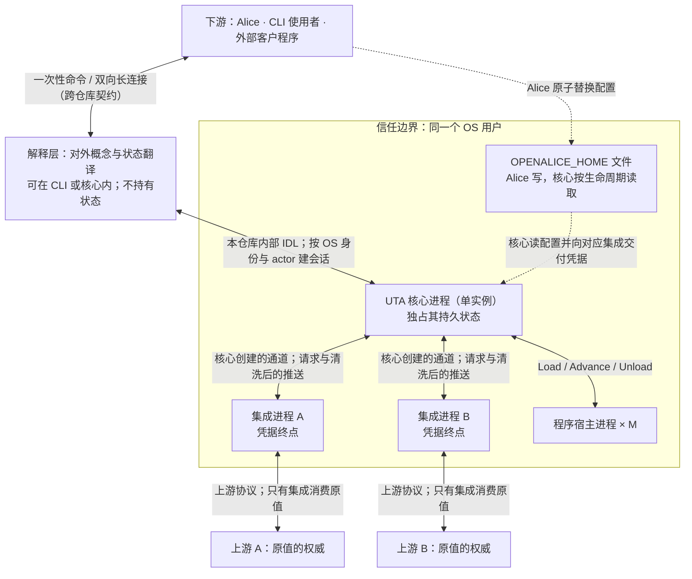

核心拉起集成与宿主并持有进程登记；集成或宿主失败由核心各自处理，不要求下游存活。一个集成进程只有一个由核心创建的会话，通道关闭后不自行重连；凭据只按文件 → 核心 → 对应集成的链交付。集成接触上游原值，核心只接收契约值与证据原文；下游只接触解释层。核心崩溃后继任实例先取得 fence，再按 OS 身份核对并回收旧子进程，随后从自己的记录恢复（D1.2、D7.3）。解释层本身无状态，换进程落点不改变对外面。

## D1.2 启动五步

对照：§7.2 生命周期表与启动第 1–5 步；§6.7 恢复；§9.2 #15/#21。这里只画跨进程的生命周期与可见性；核心内部各步的事务、记录和失败分支在 §7.2。

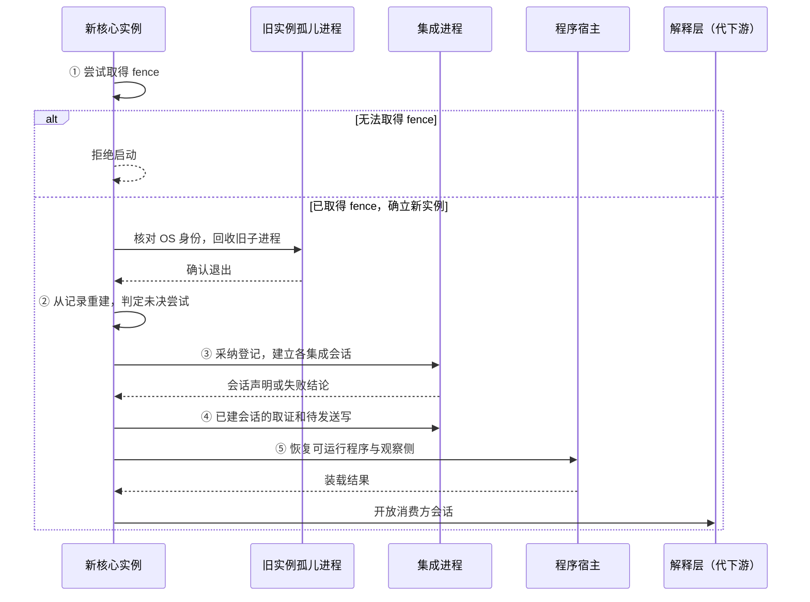

取不到 fence、记录版本不兼容、重建失败或统一路径配置无法读取时，整体拒绝启动；单个集成或程序失败只影响该单元。消费方在第 5 步之前只看到 `Starting`。第 2 步在不接触集成时从记录判定 `Undetermined(CrashWindow)`；第 4 步先取证后发送，均须等待对应集成的有效会话。受控停止后的第 1 步没有需回收的旧进程，第 2 步没有无后继的 `SendBarrier`。旧实例的 readiness 不另写，按新实例的会话观察派生（§8.4）。

## D1.6 生命周期嵌套与受控停止

对照：§7.2 生命周期表与受控停止；§7.1 凭据链；§8.2 `route` 义务；§8.3 会话内开流 epoch；§8.5 消费方会话；§8.6 程序成员与宿主执行。可选计算的接口只在 §8.7 的文字契约中，本图不描绘它。

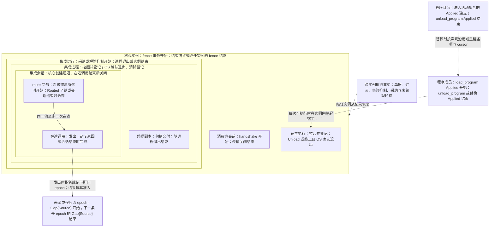

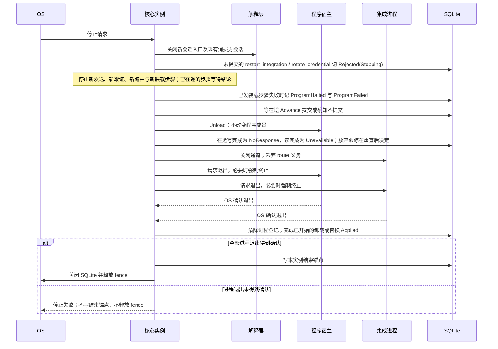

流 epoch 与程序成员可以跨核心实例延续，不嵌在实例或会话中；只有各自的来源或控制动作能确认它们的边界。集成会话结束先让每个在途调用得到封闭结果，才丢弃未了的 `route` 义务、关闭通道；流 epoch 的结束取决于来源的 `Gap{Source}`，不取决于通道关闭。`unload_program` 和替换先结束宿主执行、等 OS 确认退出，再以 `Applied` 结束成员；受控停止本身不结束成员。逐项开始/结束锚点与异常窗口以 §7.2 的生命周期表和受控停止步骤为准，图只显示容器之间的包含及退出顺序。

## D2.1 一条记录进核心：信封 / 锚点 / 处理器 / 载荷

对照：§0.1（上游只在集成内被消费）、§2.1（信封与反向代理）、§2.2（协议 = 注册单元）、§7.2（会话 epoch）、§8.1 锚点表、处理器字段注册表、`payload_schema`、§8.3 推送、§8.4 序号覆盖。

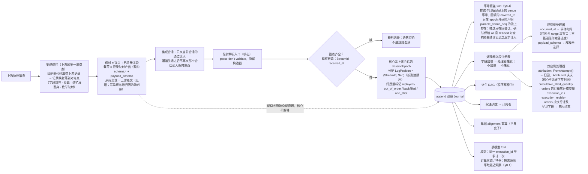

读法：

- "核心看哪些字段" = `锚点 ∪ ⋃ handler.required_inputs`，其余自动是载荷；加一个 venue 字段只是注册一个处理器。
- 两种失败面互不混淆：缺锚点是畸形（拒绝）；缺处理器字段是不触发（不是错误）。
- 会话归属不是集成填的锚点：核心只从当前会话的通道读入，并给接受的记录盖上该会话的 `SessionEpoch`；旧会话的消息不进信封解析，也不 append。
- `LogPosition` 归核心，完备归来源：到达顺序只是日志顺序；是否全部到达只由来源证据（序号覆盖）说明，`occurred_at` 与到达时刻都不说明。
- 载荷是集成的消费结论，解释权在下游（程序、钩子、消费方），记录权在核心；原始负载只作证据，不进任何解释器。


## D3.1 一次推送的入库时序

对照：§8.3 推送表与集成义务（位置与完备、归因）、§7.2 会话 epoch、§2.1 处理器、§4.3、§4.2 投递、§6.2 偏离是状态、§8.1 来源顺序、§8.4 序号覆盖。

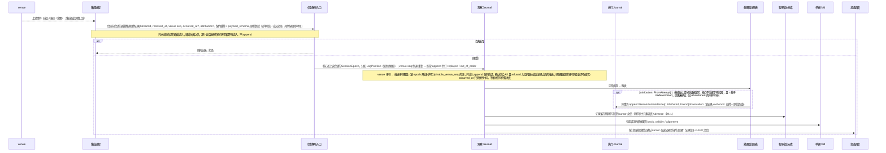

读法：

- 位置归核心，完备归来源：`LogPosition` 由核心按到达顺序分配，核心是它的源头，但到达顺序只是日志顺序，不是来源顺序；venue seq、`occurred_at` 是来源给的字段，随记录作为副本保存。完备只来自来源证据（序号覆盖），不从到达时刻或任何时限推导。
- 乱序与重复不被核心修正，由派生侧 fold 按种类处理：成交按 execution_id 与修订计数；订单状态与持仓按身份取最近观察，只凭四种声明的来源定序证据比较（同一 epoch 的 venue 序号、`order_revision`、声明 `query_not_lagging` 的流上不带序号的回答对 `dispatch_end` 及之前的记录、声明 `push_ordered` 的流上同一会话 epoch 且同一流 epoch 内的两条推送；上游推送通道重连由集成报为 `Gap{Source}` 开新流 epoch，两侧推送不可比），其余不可比，最近观察顺序未确立时并列；其余种类由各自的 fold 规定（§8.1）。
- 同一条推送可能同时是三件事：订阅者的一条记录、某单据偏离状态的触发、某 `Undetermined` Attempt 的决议证据。
- 迟到回执走的就是这条路：旧会话的通道关闭后不再读入（其在途调用已在会话结束时完成为 `NoResponse`）；新会话重送的在 `opt` 分支并入原 Attempt。


## D3.3 回填与实时边界

对照：§8.2 `backfill`、§8.4 回填、实时边界、衔接、序号覆盖；§8.1 精确重建的前提；Q14。

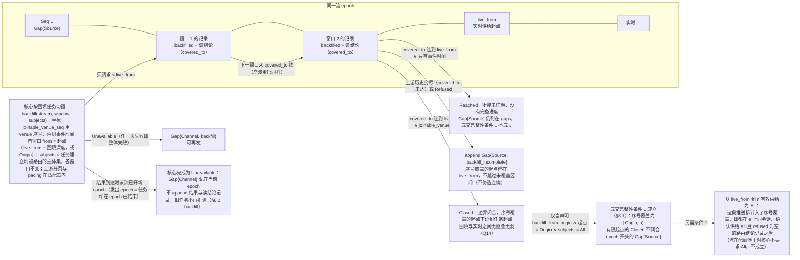

读法：回填记录与实时记录同形、同 epoch，只多一个 `backfilled` 标记；回填窗口都在 `live_from` 之前。有可衔接序号的流上二者按序号不重叠也不留洞，不需要逐条去重。只有事件时间的流上，实时订阅确认前上游已发出的记录可能两边都不在，迟到的实时记录也可能与回填的同一对象并存，所以只称“到达”，也没有完备进度。续点是读结论记录里的覆盖边界，不需要任何一方保存游标。


## D3.4 订阅、route、cursor、ack、慢消费者与重连

对照：§4.2 cursor 与确认、§8.5 订阅组（两种 selector、逐项接纳、配额、订阅状态）、§8.2 `route`、§7.5 订阅表、W6 步 3–4、W14、W20。

```mermaid
sequenceDiagram
  participant C as 消费方（解释层代下游）
  participant SUB as 持久订阅元素
  participant I as 集成进程
  participant DL as 投递调度
  participant J as 观察 Journal
  participant EJ as 执行 Journal（经存储按位置读，不解析）
  C->>SUB: subscribe(selector, mode, from?)（mode = ordered | latest；selector = 观察流：一组 (来源, 流, 主体集?, 用途：供给 | 只投递) 项，可跨来源；或 执行事实 (来源, WriteScope?)；或 控制（核心的控制流））
  alt 执行事实 / 控制：mode ≠ ordered，或执行事实的来源是 Program(_)（只收集成来源），或执行事实的 WriteScope.key 不在该来源任何声明版本里（不看采纳集合）
    SUB-->>C: 拒绝
  else 观察流：逐项判定（各项独立，按项在请求里的次序）
    Note over SUB: 每项（集成来源）：来源不在采纳集合且从未有声明 → 拒绝；在采纳集合而从未有声明 → 待接纳；供给项：来源不在采纳集合 → 拒绝（来源未登记），流不在最近声明 / 配额池里不带主体集 → 拒绝，放不下 → QuotaExceeded（集成不收到超限主体）；只投递项：流在该来源任何一个声明版本里出现过 → 接纳（不看采纳集合、不要求最近声明、不要求会话；不进需求、不占配额），从未声明过 → 拒绝。每项（程序来源 Program(p)，依据是 p 历代开始成员的 Applied 所记输出契约）：p 没有这种 Applied → 拒绝（来源未登记）；供给项 → 拒绝（ProgramStreamNotRouted，程序流不经 route）；带主体集 → 拒绝（程序流的记录不带 subject）；整条流的只投递项：流在任一条这种 Applied 的输出契约里出现过 → 接纳且为活（不要求 p 此刻在活动集合里），从未出现过 → 拒绝。from < 保留边界 → 该项 BeyondRetention（只在建立时对 from 判定）
    alt 没有任何一项被接纳或待接纳
      SUB-->>C: Rejected{items}
    else 至少一项被接纳或待接纳
      SUB->>SUB: 写订阅表，每条选中流一个 cursor：from = 保留边界 → Start{from}（先交前导）；from 高于边界 → At（从 from 起投递）；缺省 → At{当前流末}（不补历史）；订阅归属 principal，持久
      SUB-->>C: Subscription{id, items}（逐项结果；整体状态由逐项派生）
    end
  else 执行事实 / 控制：接受
    SUB->>SUB: 写订阅表；执行事实的 selector 是成员规则：此后出现的 lane 流自动加入，cursor 为 Start{其首条记录}；控制订阅只有控制流一条；from 可为起点（cursor 为 Start{第一条记录}，执行事实不压缩，没有前导）
    SUB-->>C: Subscription{id, items}
  end
  opt 某流的需求（各供给项主体之并 ∪ 核心自己的需求；只投递项与挂起项不计）变了，且该集成会话已建立
    SUB->>I: route(stream, 主体全集 | All | 空集, generation = 本会话最后接受的值，见 §8.2 route 的 generation)
    alt Routed{refused}（集成只以 Routed 回答带它当前 generation 的调用）
      I-->>SUB: Routed{refused}
      SUB->>J: 同事务 append 路由结论记录（这次生效的主体全集：All 或主体集，refused 及原因；不记增减，相对同一流 epoch 内上一条的增减由相邻两条算出）；refused 主体在所属各项内列为“来源拒绝”
    else Unavailable（上游没有完整结论；或 generation 早于集成为该流最近上报的：集成先已上报 Gap{Source}，这次调用问的是已结束的 epoch，供给不变）
      I-->>SUB: Unavailable（不 append；该流的 route 义务未了，本会话内按 pacing 再发，带其时的目标全集；会话结束时随会话丢弃；同一流至多一次 route 在途；核心不另判 epoch 更替）
    end
  end
  opt cursor 为 Start{from}（从边界订阅）：每次挂接先交前导
    DL->>C: 按位置交出该流此刻在 from 之下留下的记录（健康流各键基线；程序流各流 epoch 基线与原位置的开 epoch Gap{Source}），from 之下被删的段不是损失、不记缺口；再交 from 及以上被删段的 Gap{Delivery, compacted} 与 from 起的记录
    C->>SUB: ack(subscription, cursor = c)
    SUB->>SUB: c 不低于前导里每一条 → cursor 成为 At{c 与 from 前一位置中较大者}；c 落在前导中间 → 仍为 Start{from}，下次挂接前导整段重交（按 LogPosition 去重）
  end
  loop 记录到达
    J->>DL: 新记录 pos（观察流订阅）
    EJ->>DL: 新记录 pos（执行事实订阅：存储按位置交出已提交的字节，投递不读读模型、不解析）
    DL->>C: 投递 pos（数据记录按信封 subject ∈ 项的主体集过滤，整条流的项不过滤；流上的控制记录 Gap{Source} / Gap{Channel} / 读结论 / 路由结论投给该流每一项；同一订阅每条记录至多一次；每条流各自有序，流与流之间不定序；已投未确认 = 消费者内存里的事）
    C->>SUB: ack(subscription, cursor = pos)（确认 = 已处理）
    SUB->>SUB: cursor 推进（单写者，串行化）
  end
  alt latest 订阅的慢消费者：投递缓冲耗尽（ordered 只背压，从不走这一支）
    DL->>SUB: 请求写下投递缺口
    SUB->>SUB: 订阅表该（订阅, 流）写下 Gap{Delivery} {流, from, to = 被跳过的最后一个位置, slow_consumer}；写下之后才跳过
    DL->>C: 停投；先交出这条缺口（需显式确认），再交 to 之后的记录
    C->>SUB: ack(subscription, cursor ≥ to)（显式确认这次损失）
    SUB->>SUB: cursor 推进与删除该缺口在同一次写里
    DL->>C: 从 to 之后恢复投递
  end
  alt 断连 / 崩溃
    C--xDL: 连接断
    Note over SUB: 订阅 owner 是核心，订阅、cursor 与未确认的投递缺口保留
    C->>SUB: 重连：同一 principal 重新 handshake → 自动挂接其持久订阅（不需再 subscribe）
    DL->>C: 先交出未确认的投递缺口，再从 cursor 之后重投（cursor 仍为 Start{from} 的，前导整段重交）；未确认区间可能重复，按 LogPosition 去重
  end
  opt 重新握手（新会话建立）使某流进入配额池
    SUB->>SUB: 该流上整条流的供给项挂起（WholeStreamInPool），核心自己的 All 撤去；离开所有配额池时恢复
    SUB->>I: 按会话建立的规则：重算后的全集非空才起 route 义务，route(stream, 重算后的全集, generation)
  end
  opt 会话内集成上报 Gap{Source, generation}，该流开新流 epoch
    Note over I: 上报之前，已收到的该流 route 以 Unavailable 完成；此后收到的带旧 generation 的 route 一律 Unavailable，不改供给
    SUB->>I: route(stream, 当前全集, 新 generation)：接受 gap 为该流起一项 route 义务，已有则并入（与 pacing 重试是同一项，不多发），此后发出的都带新 generation；新流 epoch 在收到带新 generation 的 route 之前不推送
    I-->>SUB: Routed{refused} → SUB 在新 epoch 里 append 路由结论记录（全集、refused 及原因；推送只在同会话、全集为 All 且 refused 为空的一条之后才计入序号覆盖）
  end
  Note over SUB,I: route 义务嵌在集成会话里，每条流至多一项：会话建立时为需求非空的流起（需求为空的不起）；已建立期间接受会话内开 epoch 的 Gap{Source} 或需求变化时起，已有则并入；第一次 Routed 了结（在途期间的新需求按 §8.2 在返回后以新全集再起）；会话结束时在途调用完成之后、关闭通道之前丢弃，不带进下一个会话；没有已建立的会话时需求变化只改需求。流 epoch 的供给只由本 epoch 的路由结论记录证明；在该 epoch 第一次带其 generation 的 route 之前集成不推送该流
```

读法：

- 确认语义唯一：`ack` = 已处理。已投未确认的记录在崩溃后会再见一次；已确认的永不重投（退回只经控制面 `rewind_cursor`：只把 `At{pos}` 退到低于 `pos` 的 `At{to}`，cursor 仍是 `Start{from}` 时被拒）。cursor 是 `Start{from} | At{pos}`：从保留边界（或执行事实、控制流的起点）订阅的 cursor 为 `Start{from}`，每次挂接先交前导，直到第一次覆盖整段前导的确认才成为 `At`，所以确认之前断连或崩溃不会丢掉边界之下安静键的当前值；前导之下被删的段不是损失（§4.2 cursor 与确认）。
- 程序是同一种订阅者：它经自己的程序订阅消费，cursor 在订阅表里，由提交的 `Advance` 确认（第一次提交即使 `Start` 成为 `At`），与 `Checkpoint` 同事务持久化（D4.1），所以程序永远不会看到已折入状态的记录；消费方会话不挂接、不确认程序订阅（§8.6 程序的输入）。
- 需求按流的全集下发：多个订阅对同一主体只路由一次，配额在核心计量。序号覆盖只看记录：推送只在该流 epoch 上同会话、确认供给 `All` 且 `refused` 为空的路由结论记录之后才计入；之后一条不确认这一点的路由结论记录使计入停住，直到下一条确认的记录（§8.4）。订阅表与核心自己的需求都不是它的输入。
- `route` 跨过会话内流 epoch 更替只有一个判定者，就是集成。`generation` 由集成创建，随 `Gap{Source}` 送来；核心只带上它最后接受的那个，不另按发出 epoch 过滤 `Routed`。集成→核心按发送顺序处理，所以更替之前送出的 `Routed` 先于 gap 到达，落在它确认的那个 epoch 里。集成在 gap 之前以 `Unavailable` 完成已收到的 `route`，这个 `Unavailable` 先于 gap 到达，核心在接受 gap 之前按 pacing 再发的仍带旧 `generation`，同样得 `Unavailable`，无害；更替之后才到集成的旧 `generation` 调用得 `Unavailable`、供给不变。每条流至多一项未了的 `route` 义务，嵌在集成会话里：按 pacing 的重试与接受 gap 触发的重发是同一项，gap 并入它而不另起，第一次 `Routed` 了结它，所以新 epoch 的第一条路由结论记录来自一次带新 `generation` 的 `route`；会话结束时未了的义务丢弃，不带进下一个会话（§8.2 `route`“谁调、何时调”）。
- 投递按主体：数据记录只看信封上的 `subject`，不论来自推送、回填、一次性读还是回执；控制记录投给该流每一项。只投递项不改变需求与配额，一次性读得 `Pending{from, request, instance_id}` 后从 `from` 订阅一个只投递项，即收到那条结论或 gap（同一核心实例内）；同一流上别的读的结论与 gap 也投给这一项，等待者按记录所带的 `OneShot.request`、`origins`、`dispatch_end` 与 `session_epoch.instance_id` 认出自己的那一条，别的核心实例记下的从不相符（§8.5 一次性读）。
- 投递缺口是订阅的状态，不是流上的记录：投递调度要跳过时先请持久订阅写进订阅表，写下之后才跳过；每次投递与重新挂接都先交出它；确认不低于 `to` 的 cursor 时与 cursor 推进同一次写删除。它属于（订阅，流）的 cursor，不属于某一项：只在 cursor 确认它、该流离开订阅（取消订阅，或该流的项与 cursor 一起结束）、`Reset` 重建该流的 cursor，或 `rewind_cursor` 把 cursor 退到低于它的 `from` 时删除（`At{to}` 把 `to` 算作已确认；此后重新跳过时照常再记），项的挂起、重建或重新接纳失败都不动它。`compacted` 只覆盖压缩删去、且不在同一（订阅，流）上未确认缺口里的位置，每一段连续的这种位置一项；健康流与程序流在各段之间留下的基线照常按位置投递，原样不改（§2.4）。`subscriptions` 读模型在该流的各项下列出消费方订阅未确认的缺口（按（订阅，流）记，不按项存）；其他订阅者看不到它。程序订阅的缺口在 `Advance` 的投递事件里交给程序，由覆盖它的 `Advance` 提交删除（§8.6）。
- 执行事实订阅走同一套 cursor 与 ack，但只能 `ordered`：执行事实不压缩、不合并，所以慢消费者只背压自己，没有投递缺口；投递经存储按位置读出已提交的记录、原样搬运，不经读模型、不解析，所以观察侧的订阅与投递元素不依赖效应侧类型（§7.3 uses 图）。它不经 `route`，不受声明与会话影响。


## D4.1 一轮 `Advance`

对照：§8.6 宿主协议、§4.3 输入 = 位置推进、§6.1 出口、§7.5 `Checkpoint` 与 cursor 同事务、§4.2 程序订阅。

```mermaid
sequenceDiagram
  participant J as 观察 Journal
  participant DL as 投递调度
  participant C as 核心（程序宿主元素 + 持久订阅的程序订阅）
  participant H as 程序宿主进程
  participant DB as SQLite（同一事务）
  participant O as 出站请求处理器
  participant I as 集成
  J->>DL: 程序 cursor 之后有新记录
  C->>DL: 取程序订阅的投递事件（cursor 之后的记录、未确认 Gap{Delivery}、覆盖推进）
  DL-->>C: 投递事件
  C->>H: Advance(events, to = cursor')：每条流上按位置先后的投递事件——cursor 为 Start{from} 的流先交出前导（该流此刻在 from 之下留下的记录）、程序订阅上未确认的 Gap{Delivery}{流, from, to, reason}（排在该流 to 之后的记录之前）、各输入流 cursor 之后的记录、await-all 输入的覆盖推进{流, through}（每次 Load 之后的第一次 Advance 先在每个 await-all 输入的起始位置给出 through：At{p} 为 fold 到 p 为止，Start{from} 为 from 之下的严格前缀，排在前导与第一条不低于起始位置的记录之前；每个 Gap{Delivery} 之后给出到它末位为止的 through；每条 through 只在它 fold 到的位置在当前流 epoch 里、且不低于该 epoch 覆盖检查点的 folded_below 前一位置时给出，恰在该位置时就是检查点的 through，所以起始位置低于 folded_below 时没有初始事件，末位更低的开头缺口之后也没有，由此后第一条可算的 through 取代初始事件；不存进 Checkpoint）；cursor' 不确认任何未交出的留存记录或缺口：At 流不越过这批交出的最后一个位置，Start{from} 流取交出的最后一个位置与 from 前一位置中较大者
  Note over H: 解释①：nodes 增量 DAG，cutoff<br/>解释②：rules fold → On / Require / Expire / Emit
  H-->>C: Output{effects, derivations, checkpoint{bytes, state_version}}
  alt Output 超预算（意图速率 / 状态大小）
    C->>DB: 同事务 append ProgramHalted{Budget(kind)}（执行 J）+ ProgramFailed{Budget(kind)}（观察 J）
    C->>H: 提交之后终止宿主进程；OS 确认退出后清除登记
    Note over C: 程序进入失败抑制，本批输出不落
  else checkpoint.state_version 不在本成员 Applied 所记的接受集合内（违反契约，视同 trap）
    C->>DB: 同事务 append ProgramHalted{Trap}（执行 J）+ ProgramFailed{Trap}（观察 J）
    C->>H: 提交之后终止宿主进程；OS 确认退出后清除登记
    Note over C: 程序进入失败抑制，本批输出不落；所以持久化的 Checkpoint 总被本成员接受（§8.6 状态迁移）
  else 正常
    C->>DB: BEGIN
    C->>DB: append EffectRequest 记录{member = 开始本成员的 Applied 位置}（执行 J，该程序的请求流）× effects
    C->>DB: append 派生记录（观察 J：outputs 里每项所指节点的值按 §4.3 写在程序流 (Program(id), name) 上：本流 epoch 首值一条正贡献，值变一条撤回前一贡献并加入新值，值相等不写；每条 basis = 本事务提交的输入 cursor；未声明为输出的节点不落流）× 值有变化的输出
    C->>DB: 写 Checkpoint（它自己的表）；持久订阅元素写程序订阅上的程序 cursor = cursor'，同一次写删去 cursor' 覆盖的 Gap{Delivery}（cursor' 不确认未交出的缺口，所以这些都是这批交出过的）；登记 cursor 引用
    C->>DB: COMMIT
    Note over C,DB: 崩在 COMMIT 前：整批不存在，重启从同一组已提交 cursor 重新推进（#16）
    C->>O: 逐条分派 EffectRequest（事务之后）
    alt 读处理器（一次执行，不自行重试）
      alt 未调用集成（按 §8.2 read 的判定顺序：来源未登记或不是集成来源 / 从未有声明 / 来源无会话 / 流不在会话有效声明里 / 会话有效声明的 read 为 Unsupported 或 Unknown / 请求不合 schema）
        O->>DB: EffectResponse{request: pos, NotCalled(reason)}（不调用集成、不 append 观察记录）
        Note over C: 程序的解释②在自己的请求流上看到这条 EffectResponse（§6.1）
      else 调用
        O->>I: read(stream, request, range)
        alt Answered（含空）或 Refused
          I-->>O: Answered(items) / Refused(reason)
          O->>DB: 同事务：item 观察记录 × N（one_shot）+ 读结论记录，provenance OneShot{origins ∋ Request(pos), request}（观察 J）+ EffectResponse{Concluded(结论)}（执行 J）
          J->>DL: 程序 cursor 之后的新记录 → 经投递调度交给下一轮 Advance（闭环走观察侧）
        else Unavailable
          I-->>O: Unavailable
          O->>DB: 同事务：Gap{Channel}（观察 J，该流）+ EffectResponse{Unavailable(gap)}
          J->>DL: 这条 gap 经投递调度交给下一轮 Advance，程序看到它，自行决定是否再 Emit
        end
      end
    else 写处理器（读 EffectRequest.member 所指 Applied：发出成员的装载 principal 与执行事实输入，不读当前成员）
      alt 意图的锚点构造不出（D5.2）
        O->>DB: EffectResponse{NotDrafted(Malformed{reason})}（请求流；不开单，不做作用域判定）
      else 构造成功，但意图的 (来源, 作用域) 不在发出成员 Applied 所记的执行事实输入之内
        O->>DB: EffectResponse{NotDrafted(ScopeNotObserved)}（请求流；不开单）
      else 构造成功且在其内
        O->>DB: 同事务 Draft{by: 发出成员的装载 principal, basis ∋ pos}（lane 流）+ SubmitForDecision + EffectResponse{Drafted(ticket)}（请求流）（D5.1）
        Note over C: 单据与尝试的记录经程序声明的执行事实输入投给它，解释②按 ticket_id 与 p 认出自己的
      end
    else 未注册
      Note over O: Unhandled：记录留在日志，无 EffectResponse，不重派
    end
  end
```

读法：

- 程序看到的只有 `Advance` 交出的投递事件：cursor 之后的记录（cursor 为 `Start{from}` 的流先是前导）、程序订阅上未确认的投递缺口与 `await-all` 输入的覆盖推进；提交的 `Advance` 只确认它交出的这些，不确认任何未交出的留存记录或缺口。它的输出是值（`EffectRequest`、派生记录、`Checkpoint`），不是调用。
- 事务边界在 `COMMIT`：`Emit` 是否"发生"以 `EffectRequest` 记录是否持久为准；处理器执行在其后，通过位置引用与请求关联（D4.3）。
- `fetch.bars`（读）与 `trade.place`（写）对程序是同一构造子；差别在注册表。


## D4.2 程序成员与宿主执行

对照：§8.6 程序活动集合、装载与替换、宿主协议和失败抑制；§7.2 生命周期表。图只展示当前核心与宿主的边界，不描绘可选计算。

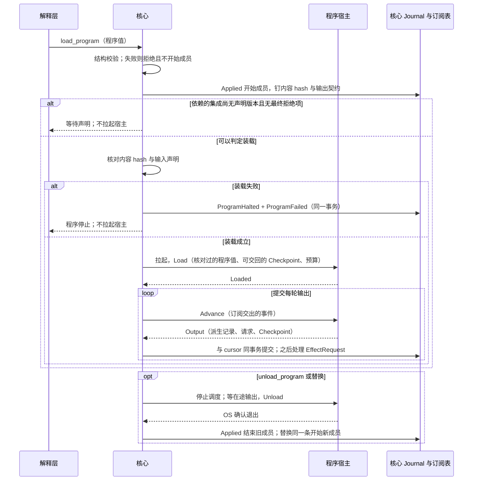

`load_program` 的 `Applied` 是程序成员的开始锚点；`unload_program` 或替换的 `Applied` 是结束锚点。宿主执行嵌在成员与核心实例内：核心受控停止或崩溃结束宿主执行，不结束成员；失败抑制来自 `ProgramHalted`，跨实例保留。替换沿用与重建 cursor、`Checkpoint` 和程序流 epoch 的判据见 §8.6；已提交的请求即使成员结束，也按发出成员的 `Applied` 所记事实处理（核心内部视图 D4.3）。不涉及可选计算的主路径之外的接口仍由 §8.7 定义，不放在本图。

## D5.2 意图从哪来、怎么开单

对照：§6.1 写处理器（构造规则、发出成员）、§6.2 参数合规与交易协议、§8.5 单据组、§7.6 `deadline` 缺省、§8.1 意图锚点。

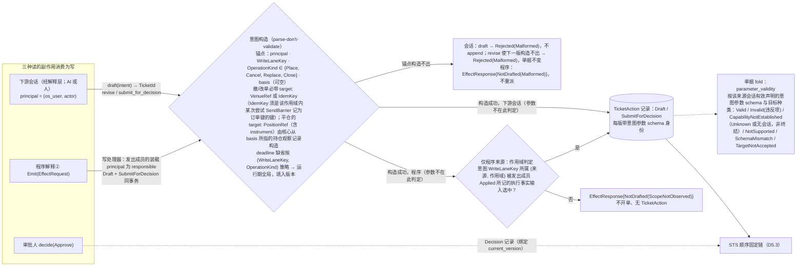

读法：开单的记录对各来源同形（principal + 依据位置）；差别只在授权规则里"哪些 principal 的记录足以进 prepare"，以及程序来源在构造成功之后多一步作用域判定：意图的作用域不在发出成员 `Applied` 所记的执行事实输入之内即 `NotDrafted(ScopeNotObserved)`，不开单（§6.1 构造规则、发出成员）。这一步只读 UTA 自己的事实（发出成员的 `Applied` 与请求锚点），不看参数。参数合规对所有来源同一规则：不挡开单，送审时由输入约束步读取（D5.3）。


## D5.6 人工审批、过期与版本冲突（W18）

对照：W18 步 3–5、§6.2 决定绑定 `current_version`、§8.5 `decide`、C11。

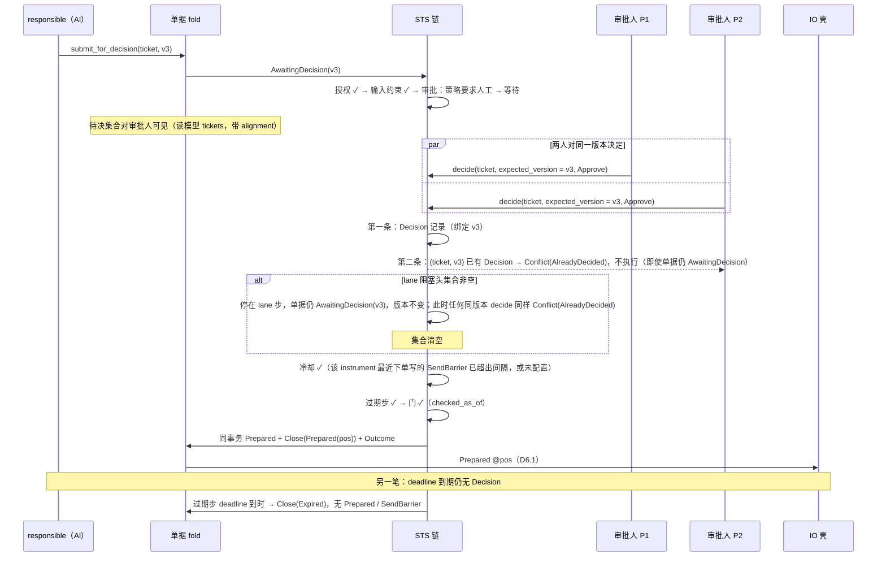

读法：冲突不是锁：一个 `current_version` 至多一条 Decision，第二个决定返回冲突记录即可；`Closed` 不是挡第二条决定的条件——lane 等待期间单据仍开着、版本未变。

## D6.5 正常下单闭环时序（W1）

对照：W1 步 1–7；§6.1、§6.2、§6.3、§6.5、§8.2、§8.3、§8.5 读模型。本图只画跨进程交互；核心内部记录和门的完整顺序见 W1、D1.5、D5.3、D6.1。

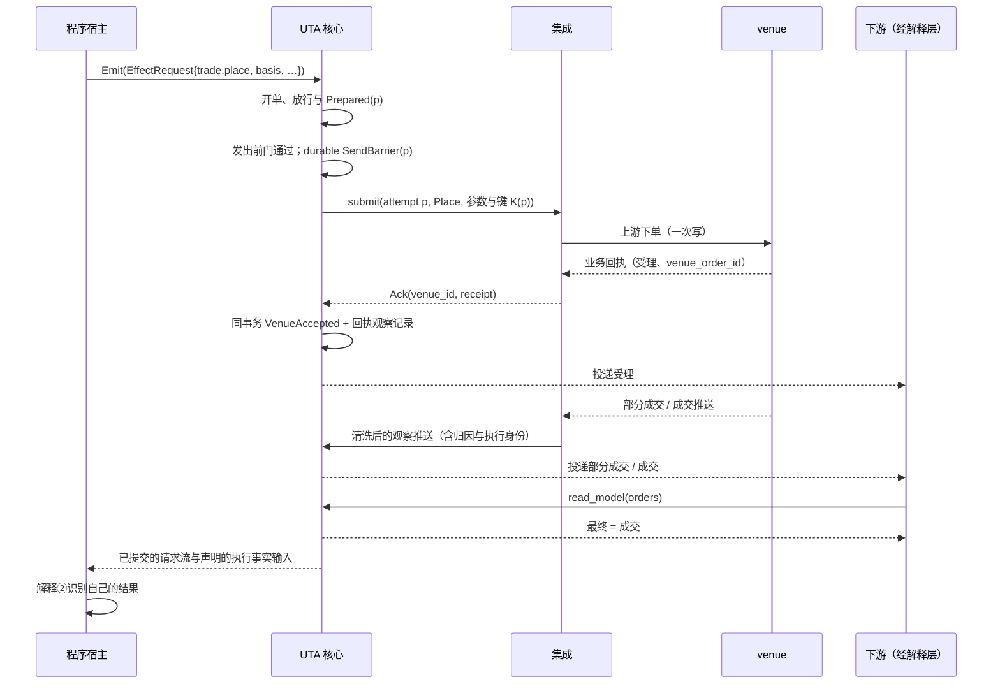

读法：`Emit` 随 `Advance` 提交且不带键；核心的开单事务写 `Draft`、`SubmitForDecision` 与 `EffectResponse{Drafted}`。STS 顺序检查授权、输入约束、审批、lane、过期与门，放行事务写 `Prepared @p`、`Close(Prepared(p))` 与 `Outcome`。IO 壳在 deadline、会话与有效能力的发出前门之后单独 durable append `SendBarrier(p)`（fsync，记 submit、键与角色），才交出一次 `submit`；集成至多投放一次上游写。

`Ack` 使核心在同一事务写 `VenueAccepted{venue_order_id, receipt: Evidence, observation}` 及其 `Receipt{p}` 观察记录；回执已含执行的，每笔另有带 `execution_id` 的成交记录。结果确立后等待结束、移出阻塞头集合并释放保留钉。后续推送由集成按各自关联证据填 `FromAttempt(p)`，核心 append 观察记录并投递；字段及原生身份保真，`orders` 对同一 `execution_id` 只计一次。程序宿主在请求流读取 `EffectResponse{Drafted(ticket)}`，在声明的执行事实输入里按 ticket_id、`Close(Prepared(p))` 与 p 的后继识别结果。从 `Emit` 到受理是一串各自原子的事务（D1.5），不是一个跨进程事务；此后是观察推送。

## D6.6 `NoResponse` → 取证 → 停等 → 放弃跟踪（W2）

对照：W2 步 1–4；§6.7 恢复、§6.6 对账驱动与放弃跟踪；§7.2 第 1/3 步；§8.5 结果未知组。

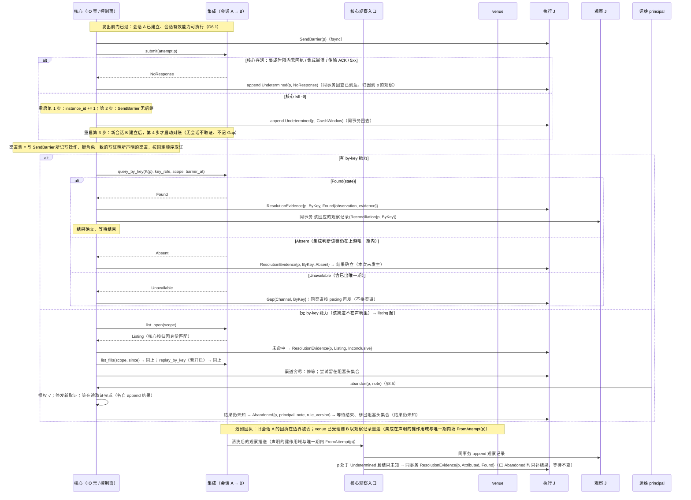

读法：末态可枚举（found → `Evidence` + 观察记录 / absent → 未发生 / 无渠道 → 停等）；停等态之后仍有多条入口：任一时刻到达的 `Attributed Found`、`ReconciliationReopened`（会话重建 / `retry_reconciliation`）重开的取证、同一会话里的能力变更使本轮尚未取证的渠道进入渠道集之后的取证，或 principal 的 `abandon`：它只结束等待，结果仍等上游证据。


## D6.7 同 lane 并发与撤阻塞头（W5）

对照：W5 正常—失败路径与扩展路径；§6.4 lane 步、无第二类越顶队列；§6.2 目标身份来源之二；§6.6 撤单尝试的取证。

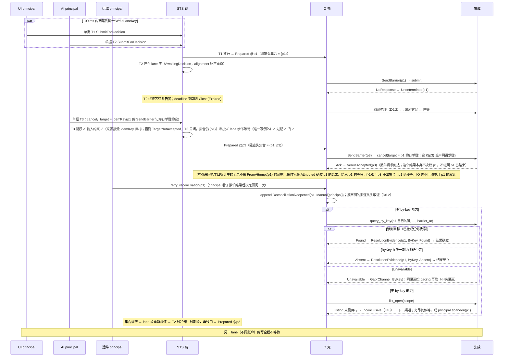

读法：撤单把 venue 侧推到一个读得出的状态，但它自己的回执与 `Found` 只说明撤单请求到达，不是阻塞头的证据，也不自动重开阻塞头的取证；阻塞头仍只由自己的取证与 `Attributed` 收敛，或由 principal 放弃跟踪。T3 的 `target` 必须是 p1 的 `SendBarrier` 记为订单键的键（按尝试精确匹配）；只能按 venue 订单身份撤单的来源上，T3 在输入约束步以 `TargetNotAccepted` 关闭。两条路径（撤阻塞头 / `bypass_lane`）都让该 lane 出现两条 `SendBarrier`，区别只在有无 `bypass_lane` 控制记录（它不是 Decision）。

## D7.3 脑裂 / 孤儿接管（W2 变体、W9、#15）

对照：§7.2 第 1 步（fence、`instance_id`、进程表回收）、第 3 步（会话 epoch）；§8.3 边界拒绝；§6.6；W2 步 4。

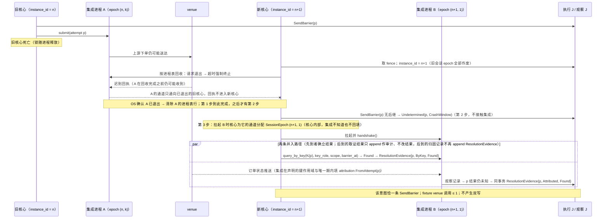

读法：安全不依赖 A 的回执到达；三条不变量（`SendBarrier` 可能已发出、阻塞头集合非空时同 lane 无新普通写、对账经 B 独立取证）共同保证。同一集成任何时刻至多一个进程：A 的 OS 确认退出与进程表行的清除是第 1 步的结束，之后才有第 2 步的恢复与第 3 步拉起 B；A 在回收完成之前收到的迟到回执只能送进通向旧核心的通道。`SessionEpoch` 由核心在拉起 B 时为通道分配，`handshake()` 不带参数，集成从不知道它。核心重启必然换 `instance_id`；同核心内重连只换 `session_seq`。


## D9.1 会话建立、身份与重连（W14、W19）

对照：§8.5 会话与 principal、已定事实；§7.1 H7；W14 步 3；W19 步 1–2；§9.2 #20；`design/downstream/design.md` 第 3、6、7 节。

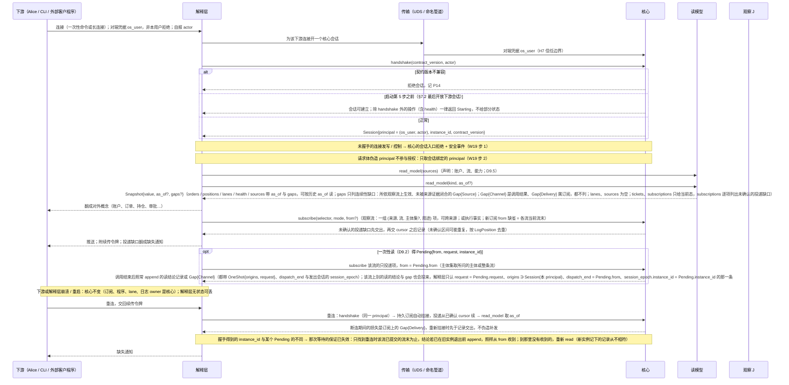

读法：`actor` 是审计与 scope 的键，不是信任来源；信任来自 OS 对端凭据。`as_of` 与 cursor 在解释层与核心之间比对，下游只见续传令牌与缺失通知。等一次在途读的结果用只投递项（不增加需求、不占配额，按历代声明接纳），“一定收到”只限发出调用的那个核心实例。


## D9.5 解释层取得声明与执行事实推送（W20）

对照：§2.2 Projection / `StreamDecl` / `account_ref`、声明的两种读法；§7.5 能力证据；§8.2 `handshake`；§8.4 健康面；§8.5 订阅组、一次性读、`sources`、`health`；W20；`design/downstream/design.md` 第 2、3.2、4 节。

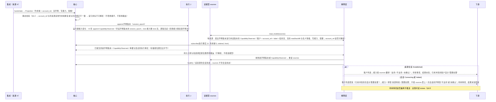

读法：声明是执行事实，所以取得它是一次读模型 fold、它的变化随执行事实订阅到达，不依赖当前会话；会话状态只在 `health`（§8.4），`sources` 不带它。“此刻能不能”由解释层合并二者：来源在线时按 `sources` 翻译能力，离线时先答离线（`design/downstream/design.md` 第 4 节）。按旧 `account_ref` 发出的命令在引用不可解析时不解析到任何账户。
